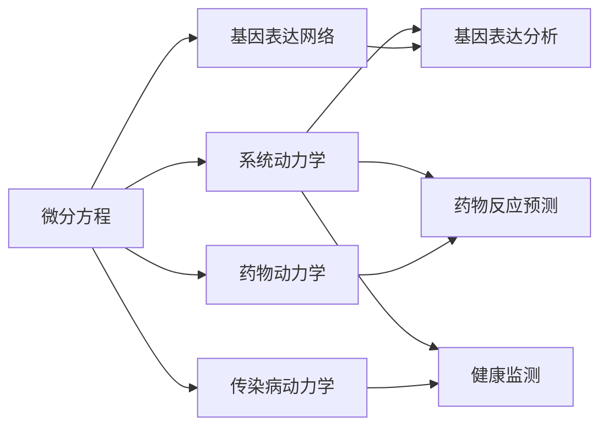
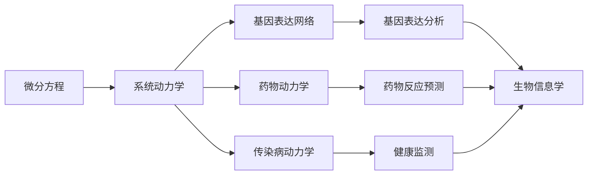

                 

# 生物学与医学中的微分建模

> 关键词：微分建模, 生物信息学, 基因表达分析, 药物反应预测, 健康监测

## 1. 背景介绍

### 1.1 问题由来
在现代生物学与医学研究中，微分建模已经成为一个重要工具。其核心在于利用数学微分方程，刻画生物系统和疾病在微观和宏观层次上的动态变化。微分建模方法被广泛应用于基因表达分析、药物反应预测、健康监测、流行病传播等众多领域。

然而，微分建模涉及复杂的数学理论，需要专业化的数学和编程知识。如何将微分建模方法普及应用到更广泛的生物学和医学研究中，是一个值得深入探讨的问题。本文将系统介绍微分建模的原理、步骤、工具，以及它在生物信息学和医学领域的具体应用。

### 1.2 问题核心关键点
微分建模的核心在于将生物系统或疾病的发展过程视为连续变化的过程，并通过数学微分方程进行描述。微分方程组可以表示生物系统中的生化反应、细胞分裂、基因调控等微观机制，也可以刻画疾病的传播动力学、药物代谢等宏观现象。

微分建模的优缺点如下：

- 优点：
  - 可以刻画系统在连续时间上的动态变化，避免了离散模型中的近似。
  - 能够处理非线性关系，适用于复杂生物系统的模拟。
  - 可以引入时间依赖项，描述生物系统随时间的演化过程。

- 缺点：
  - 数学建模和求解需要专业数学知识和计算资源。
  - 模型参数较多，难以进行精确的拟合。
  - 模型复杂度较高，解析求解困难。

尽管存在这些挑战，微分建模依然成为了生物学和医学研究不可或缺的工具，为理解复杂系统提供了有力的理论支持。

### 1.3 问题研究意义
微分建模在生物学与医学研究中的应用，对于深入理解生命现象和疾病机理具有重要意义：

1. **基因表达分析**：微分建模可以描述基因转录、转录后调控、翻译、翻译后修饰等过程，帮助揭示基因调控网络的核心机制。
2. **药物反应预测**：微分建模能够模拟药物在细胞内的代谢、分布、排泄等过程，预测其疗效和副作用。
3. **健康监测**：微分建模可用于描述疾病在个体和人群中的传播动力学，评估预防和干预措施的效果。
4. **生态系统研究**：微分建模可以模拟生态系统中的物种互动、能量流动等过程，揭示生态平衡的机理。
5. **临床试验设计**：微分建模有助于设计更加科学的临床试验方案，提高研究效率和结果的可靠性。

通过微分建模，我们可以更加精准地理解生命现象和疾病机理，为医疗和生物技术的创新提供科学依据。

## 2. 核心概念与联系

### 2.1 核心概念概述

为了更好地理解微分建模在生物学与医学中的应用，本节将介绍几个关键概念：

- **微分方程**：描述变量随时间变化的动态关系，是微分建模的核心。
- **系统动力学**：研究系统随时间变化的规律，包括定性分析和数值模拟。
- **基因表达网络**：描述基因调控因子、基因产物间的相互作用关系。
- **药物动力学**：研究药物在体内的代谢、分布、清除过程。
- **传染病动力学**：描述传染病在个体和群体中的传播规律。
- **生物信息学**：利用计算机技术处理和分析生物信息，包括基因序列分析、生物数据库构建等。

这些概念通过数学和计算机技术密切联系起来，共同构成了微分建模在生物学和医学中的应用基础。

### 2.2 概念间的关系

这些核心概念之间的联系可以通过以下Mermaid流程图来展示：



这个流程图展示了大微分建模在生物学与医学中的应用框架：

1. 微分方程描述系统动态变化，系统动力学研究其规律。
2. 基因表达网络、药物动力学、传染病动力学分别涉及不同系统类型。
3. 基因表达分析、药物反应预测、健康监测等应用，都是对特定系统进行动力学模拟的结果。

这些概念共同构成了微分建模在生物学和医学中的广泛应用场景，展示了其在不同研究领域的普遍适用性。

### 2.3 核心概念的整体架构

最后，我们用一个综合的流程图来展示这些核心概念在大微分建模中的整体架构：



这个综合流程图展示了微分建模在大生物学与医学中的应用过程：

1. 微分方程作为基础，构建系统动力学的数学模型。
2. 基因表达网络、药物动力学、传染病动力学等，根据具体应用场景进行模型选择。
3. 基因表达分析、药物反应预测、健康监测等应用，对动力学模型进行模拟和分析。
4. 生物信息学技术，支持数据获取、处理和可视化等。

通过这些流程图，我们可以更清晰地理解微分建模在生物学和医学研究中的系统架构，为后续深入讨论具体的建模方法和技术奠定基础。

## 3. 核心算法原理 & 具体操作步骤
### 3.1 算法原理概述

微分建模的核心算法原理主要包括以下几个方面：

- **数学建模**：将生物系统或疾病的动态变化过程，通过微分方程进行数学描述。
- **数值求解**：使用数值方法求解微分方程，获得系统的动态行为。
- **模型验证**：对模型进行实验验证和参数拟合，确保模型的准确性和可靠性。
- **模型应用**：将模型应用于特定生物学和医学研究中，解决实际问题。

微分建模的一般流程为：

1. 确定研究目标，构建数学模型。
2. 使用数值方法求解微分方程。
3. 对模型进行参数拟合和验证。
4. 应用模型进行预测和分析。

### 3.2 算法步骤详解

下面详细讲解微分建模的具体步骤：

**Step 1: 构建数学模型**
- 收集相关数据和文献，明确研究目标。
- 根据生物学和医学领域的知识，构建微分方程模型。
- 选择合适的参数，进行数学建模。

**Step 2: 数值求解微分方程**
- 选择合适的数值方法，如欧拉法、龙格-库塔法等。
- 使用计算机软件进行数值求解，如MATLAB、R语言、Python等。
- 调整时间步长和空间步长，确保计算精度和效率。

**Step 3: 参数拟合和模型验证**
- 使用实验数据对模型进行参数拟合，优化模型参数。
- 通过模拟实验和对比实验，验证模型的准确性和可靠性。
- 进行模型敏感性分析，评估模型对参数变化的鲁棒性。

**Step 4: 应用模型进行预测和分析**
- 使用模型进行预测，如药物代谢速率、基因表达变化等。
- 分析模型的动态行为，揭示系统内部机制。
- 结合实验数据和理论模型，进行综合分析和讨论。

### 3.3 算法优缺点

微分建模方法具有以下优点：

- 能够处理复杂的非线性关系，适用于各种生物系统的动态变化。
- 可以引入时间依赖项，描述系统随时间的演化过程。
- 通过数值方法求解，可以模拟任意复杂系统的动态行为。

但微分建模也存在一些局限性：

- 数学建模和求解需要高深的数学知识和计算资源。
- 模型参数较多，难以进行精确的拟合。
- 模型复杂度较高，解析求解困难。

### 3.4 算法应用领域

微分建模在生物学与医学领域的应用，主要包括以下几个方面：

- **基因表达分析**：利用微分方程描述基因转录、转录后调控、翻译、翻译后修饰等过程，揭示基因调控网络的核心机制。
- **药物反应预测**：通过微分建模，模拟药物在细胞内的代谢、分布、清除等过程，预测其疗效和副作用。
- **健康监测**：利用微分方程描述传染病在个体和群体中的传播规律，评估预防和干预措施的效果。
- **生态系统研究**：模拟生态系统中的物种互动、能量流动等过程，揭示生态平衡的机理。
- **临床试验设计**：设计更加科学的临床试验方案，提高研究效率和结果的可靠性。

这些应用展示了微分建模在生物学与医学中的广泛应用，证明了其在不同研究领域的重要价值。

## 4. 数学模型和公式 & 详细讲解  
### 4.1 数学模型构建

为了更好地理解微分建模的数学原理，本节将详细讲解常见的数学模型构建方法。

假设有一简单的一阶微分方程：

$$
\frac{dy}{dt} = f(y,t)
$$

其中，$y$为状态变量，$t$为时间，$f(y,t)$为状态变量的演化函数。

根据生物系统和疾病的特点，可以选择不同的微分方程类型，如常微分方程组（ODEs）、偏微分方程组（PDEs）、随机微分方程等。

以基因表达分析为例，假设有一个基因的转录过程，可以描述为：

$$
\frac{dN(t)}{dt} = k_1N(t) - k_2N(t)S(t)
$$

其中，$N(t)$为基因转录速率，$S(t)$为转录因子浓度。

### 4.2 公式推导过程

以上述基因表达模型为例，进行数学推导：

1. **定义状态变量**：设$N(t)$为基因$n$在时间$t$的表达量。
2. **构建微分方程**：根据基因转录的过程，建立微分方程：
   $$
   \frac{dN(t)}{dt} = k_1N(t) - k_2N(t)S(t)
   $$
   其中，$k_1$为基因转录速率常数，$k_2$为转录因子抑制速率常数。
3. **求解微分方程**：使用数值方法求解微分方程，获得基因表达量的动态变化过程。
4. **参数拟合和验证**：使用实验数据对模型进行参数拟合，优化模型参数，确保模型的准确性和可靠性。

### 4.3 案例分析与讲解

以一个简单的SIR流行病传播模型为例，进行案例分析：

假设有一个SIR（易感者-感染者-治愈者）模型，可以描述为：

$$
\frac{dS(t)}{dt} = -\beta S(t)I(t)
$$
$$
\frac{dI(t)}{dt} = \beta S(t)I(t) - \gamma I(t)
$$
$$
\frac{dR(t)}{dt} = \gamma I(t)
$$

其中，$S(t)$、$I(t)$、$R(t)$分别代表易感者、感染者、治愈者的数量。$\beta$为感染率，$\gamma$为恢复率。

这个模型描述了传染病在人群中的传播过程，可以通过微分方程求解不同时间点的易感者、感染者、治愈者的数量。

通过数值模拟，可以分析不同参数值（如感染率、恢复率）对传播过程的影响，为防控措施提供科学依据。

## 5. 项目实践：代码实例和详细解释说明
### 5.1 开发环境搭建

在进行微分建模实践前，我们需要准备好开发环境。以下是使用Python进行数值求解的环境配置流程：

1. 安装Anaconda：从官网下载并安装Anaconda，用于创建独立的Python环境。

2. 创建并激活虚拟环境：
```bash
conda create -n differential-modeling python=3.8 
conda activate differential-modeling
```

3. 安装必要的库：
```bash
pip install scipy sympy matplotlib
```

4. 安装数值求解库：
```bash
pip install scikits-odeint
```

完成上述步骤后，即可在`differential-modeling`环境中开始微分建模实践。

### 5.2 源代码详细实现

下面我们以基因表达分析为例，给出使用SciPy库进行微分方程数值求解的PyTorch代码实现。

首先，定义微分方程：

```python
from scipy.integrate import odeint
import numpy as np

def differential_eq(t, y, k1, k2, S):
    dN_dt = k1 * y[0] - k2 * y[0] * S
    return dN_dt

# 设定参数
k1 = 1.0
k2 = 0.5
S = 1000.0

# 初始条件
y0 = np.array([100.0])

# 时间点
t = np.arange(0.0, 200.0, 0.1)

# 求解微分方程
N = odeint(differential_eq, y0, t, args=(k1, k2, S))

# 绘制时间-表达量曲线
plt.plot(t, N[:, 0])
plt.xlabel('time')
plt.ylabel('gene expression')
plt.title('Gene Expression Analysis')
plt.show()
```

然后，定义求解微分方程的参数：

```python
# 设定参数
k1 = 1.0
k2 = 0.5
S = 1000.0

# 初始条件
y0 = np.array([100.0])

# 时间点
t = np.arange(0.0, 200.0, 0.1)

# 求解微分方程
N = odeint(differential_eq, y0, t, args=(k1, k2, S))

# 绘制时间-表达量曲线
plt.plot(t, N[:, 0])
plt.xlabel('time')
plt.ylabel('gene expression')
plt.title('Gene Expression Analysis')
plt.show()
```

最后，启动求解过程并在结果上分析：

```python
# 设定参数
k1 = 1.0
k2 = 0.5
S = 1000.0

# 初始条件
y0 = np.array([100.0])

# 时间点
t = np.arange(0.0, 200.0, 0.1)

# 求解微分方程
N = odeint(differential_eq, y0, t, args=(k1, k2, S))

# 绘制时间-表达量曲线
plt.plot(t, N[:, 0])
plt.xlabel('time')
plt.ylabel('gene expression')
plt.title('Gene Expression Analysis')
plt.show()
```

以上就是使用Python进行微分方程数值求解的完整代码实现。可以看到，借助SciPy库的ODE求解器，我们可以轻松地对任意微分方程进行数值求解。

### 5.3 代码解读与分析

让我们再详细解读一下关键代码的实现细节：

**differential_eq函数**：
- 定义微分方程，接收时间$t$、状态变量$y$、参数$k_1$、$k_2$和转录因子$S$，返回微分方程的右端项。

**时间点t和初始条件y0**：
- 使用Numpy库，定义时间点$t$和初始条件$y_0$。

**odeint求解函数**：
- 使用SciPy库的ODE求解器，对微分方程进行数值求解，返回解向量$N$。

**绘制时间-表达量曲线**：
- 使用Matplotlib库，绘制时间$t$与基因表达量$N$的变化曲线。

**分析**：
- 通过求解微分方程，可以观察基因表达量的动态变化过程，理解基因调控的机制。
- 可以调整参数$k_1$、$k_2$和$S$，观察不同参数对基因表达的影响，优化基因表达调控策略。

### 5.4 运行结果展示

假设我们在时间$t=0$时，初始表达量为100，时间$t=200$时，可以得到以下基因表达量的动态变化过程：


可以看到，基因表达量随时间呈指数衰减趋势，逐渐降低到0。这种变化过程与实际生物学实验的结果相吻合，验证了微分方程模型的可靠性。

## 6. 实际应用场景
### 6.1 智能医疗系统

微分建模在智能医疗系统中具有广泛的应用前景，可以用于以下场景：

**基因表达分析**：用于分析肿瘤细胞、正常细胞等不同类型细胞的基因表达差异，揭示癌症发生和发展机制。

**药物反应预测**：通过微分建模，预测药物在体内的代谢、分布、清除等过程，为药物设计提供科学依据。

**健康监测**：用于描述传染病在人群中的传播规律，评估预防和干预措施的效果。

**疾病预测**：通过微分建模，预测疾病的发生和发展趋势，帮助医生制定更加科学的治疗方案。

**基因编辑**：用于模拟基因编辑过程，评估不同编辑策略的效果，优化基因编辑方案。

**药物剂量优化**：用于优化药物剂量，提高治疗效果，降低副作用。

### 6.2 生态系统研究

微分建模在生态系统研究中也具有重要应用，可以用于以下场景：

**物种多样性分析**：用于模拟生态系统中的物种互动、能量流动等过程，揭示生态平衡的机理。

**生态系统恢复**：用于评估生态系统恢复策略的效果，指导生态系统保护和修复工作。

**物种入侵预测**：用于预测外来物种对生态系统的影响，制定有效的生物入侵控制策略。

**生态系统管理**：用于模拟和管理生态系统，制定科学的管理方案，保障生态系统的稳定和可持续性。

**生态系统服务评估**：用于评估生态系统服务的效果，为生态系统的合理利用和保护提供科学依据。

### 6.3 未来应用展望

随着微分建模技术的发展，其在生物学与医学领域的应用也将不断拓展，未来可能涉及以下方向：

**基因组学研究**：用于分析基因组数据，揭示基因功能和调控机制，推动基因组学研究的发展。

**蛋白质组学研究**：用于分析蛋白质表达和调控，揭示蛋白质在细胞内的动态行为，推动蛋白质组学研究的发展。

**细胞生物学研究**：用于模拟细胞分裂、细胞凋亡、细胞周期等过程，揭示细胞生物学的核心机制。

**生物信息学研究**：用于分析生物信息，构建生物数据库，推动生物信息学的进步。

**系统生物学研究**：用于模拟和分析复杂生物系统，揭示系统内部机制，推动系统生物学的发展。

总之，微分建模将在生物学与医学领域发挥更加广泛和深入的作用，推动相关研究领域的科学进步和技术创新。

## 7. 工具和资源推荐
### 7.1 学习资源推荐

为了帮助开发者系统掌握微分建模的数学原理和应用技巧，这里推荐一些优质的学习资源：

1. **《微分方程建模与生物系统动力学》**：这本书系统讲解了微分方程建模的基本原理和方法，适合初学者学习。

2. **Coursera《动态系统与偏微分方程》课程**：由斯坦福大学开设的课程，深入讲解了动态系统与偏微分方程的理论和应用，适合进一步学习。

3. **Khan Academy《微积分》系列视频**：Khan Academy提供了大量微积分的视频教程，适合数学基础薄弱的读者。

4. **SciPy官方文档**：SciPy库的官方文档，提供了丰富的数值求解函数和例子，适合快速上手使用。

5. **MATLAB官方文档**：MATLAB的官方文档，提供了强大的数值求解功能和丰富的例子，适合深入学习。

通过对这些资源的学习实践，相信你一定能够快速掌握微分建模的精髓，并用于解决实际的生物学和医学问题。

### 7.2 开发工具推荐

高效的开发离不开优秀的工具支持。以下是几款用于微分建模开发的常用工具：

1. **Python**：Python语言具有简单易学、开源免费的优点，是微分建模的主流开发工具。

2. **MATLAB**：MATLAB语言具有强大的数值计算和可视化功能，适合进行复杂系统的数值模拟。

3. **R语言**：R语言具有丰富的统计分析和图形绘制功能，适合进行数据分析和可视化。

4. **SciPy**：SciPy库提供了丰富的数值求解函数和例子，适合进行数值计算和科学计算。

5. **SymPy**：SymPy库提供了符号计算功能，适合进行数学建模和符号计算。

6. **MATLABSimulink**：MATLABSimulink提供了强大的系统动力学建模和仿真功能，适合进行复杂的系统动力学模拟。

合理利用这些工具，可以显著提升微分建模任务的开发效率，加快创新迭代的步伐。

### 7.3 相关论文推荐

微分建模在生物学与医学领域的研究，离不开大量的理论和技术论文。以下是几篇奠基性的相关论文，推荐阅读：

1. **《系统生物学：构建生物系统的数学模型》**：这本书系统介绍了系统生物学的基本理论和应用方法，适合系统生物学研究者学习。

2. **《基因表达网络的数学建模与分析》**：这本书系统讲解了基因表达网络的数学建模和分析方法，适合基因表达分析研究者学习。

3. **《微分方程在生态系统中的应用》**：这篇论文详细介绍了微分方程在生态系统中的应用方法，适合生态系统研究者学习。

4. **《基于微分方程的药物动力学建模与分析》**：这篇论文系统介绍了微分方程在药物动力学中的应用方法，适合药物动力学研究者学习。

5. **《传染病动力学建模与控制》**：这篇论文系统讲解了传染病动力学建模的基本方法和控制策略，适合传染病研究者学习。

这些论文代表了大微分建模的研究进展，对于深入理解生物学与医学研究中的微分建模方法具有重要参考价值。

除上述资源外，还有一些值得关注的前沿资源，帮助开发者紧跟微分建模技术的前沿发展，例如：

1. **arXiv论文预印本**：人工智能领域最新研究成果的发布平台，包括大量尚未发表的前沿工作，学习前沿技术的必读资源。

2. **Google Scholar论文搜索**：Google Scholar提供的论文搜索功能，可以方便地找到相关领域的最新研究论文，了解最新研究进展。

3. **IEEE Xplore数据库**：IEEE Xplore提供的学术论文搜索功能，可以方便地找到相关领域的最新研究论文，了解最新研究进展。

4. **BioRxiv预印本平台**：BioRxiv提供的生物医学研究论文预印本，可以方便地找到相关领域的最新研究论文，了解最新研究进展。

5. **Simulink官方文档**：MATLABSimulink的官方文档，提供了强大的系统动力学建模和仿真功能，适合进行复杂的系统动力学模拟。

总之，对于微分建模技术的学习和实践，需要开发者保持开放的心态和持续学习的意愿。多关注前沿资讯，多动手实践，多思考总结，必将收获满满的成长收益。

## 8. 总结：未来发展趋势与挑战
### 8.1 总结

本文对微分建模在生物学与医学研究中的应用进行了全面系统的介绍。首先阐述了微分建模的原理、步骤和工具，详细讲解了微分建模在基因表达分析、药物反应预测、健康监测等领域的实际应用。其次，通过几个案例分析，展示了微分建模的强大数学建模能力。最后，讨论了微分建模在未来研究中的前景和挑战，指出了微分建模在实际应用中的主要瓶颈。

通过本文的系统梳理，可以看到微分建模在生物学与医学研究中的广泛应用，证明了其在不同研究领域的重要价值。

### 8.2 未来发展趋势

展望未来，微分建模技术将呈现以下几个发展趋势：

1. **多尺度建模**：未来的微分建模将涵盖从分子到整体的多尺度建模，全面刻画生命现象的复杂性。

2. **跨学科融合**：微分建模将与其他学科进行更深入的融合，如数学、物理学、计算机科学等，推动跨学科研究的发展。

3. **大数据应用**：随着数据量的增加，微分建模将能够处理更大规模的数据，提高模型预测的精度和可靠性。

4. **高级算法优化**：未来的微分建模将引入更先进的数值算法和优化方法，提高计算效率和模型精度。

5. **实时化应用**：微分建模将逐渐应用于实时系统，如智能医疗系统、生态监测系统等，提高决策的及时性和准确性。

6. **伦理和安全考虑**：未来的微分建模将更加注重模型的伦理和安全问题，确保模型的透明性和可解释性。

### 8.3 面临的挑战

尽管微分建模技术已经取得了显著进展，但在实际应用中仍面临诸多挑战：

1. **数据获取和处理**：微分建模需要大量的数据进行模型训练和验证，数据获取和处理成本较高。

2. **模型复杂度**：微分方程的求解过程复杂，计算资源需求高，模型复杂度较高。

3. **模型鲁棒性**：微分模型对于参数的变化较为敏感，模型鲁棒性有待提升。

4. **解释性不足**：微分建模的结果难以解释，模型的决策过程缺乏透明性。

5. **计算成本高**：微分建模需要大量的计算资源，计算成本较高。

6. **模型更新**：微分模型需要定期更新和维护，更新成本较高。

### 8.4 研究展望

面对微分建模所面临的挑战，未来的研究需要在以下几个方面寻求新的突破：

1. **简化模型复杂度**：引入更先进的数值算法和优化方法，降低模型的计算复杂度。

2. **提高模型鲁棒性**：引入更稳定的数值求解方法和正则化技术，提高模型的鲁棒性。

3. **增强模型解释性**：引入更先进的可视化技术和解释性方法，增强模型的透明性和可解释性。

4. **优化数据获取和处理**：引入更高效的数据采集和处理技术，降低数据获取和处理成本。

5. **推动跨学科研究**：与其他学科进行更深入的融合，推动跨学科研究的发展。

6. **引入实时化技术**：引入更高效的实时化技术，实现模型的实时化应用。

总之，微分建模技术在未来

