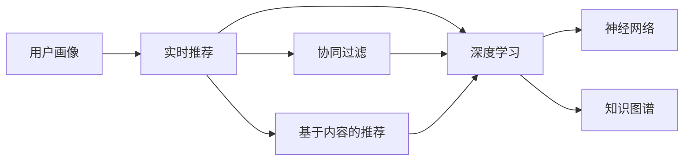
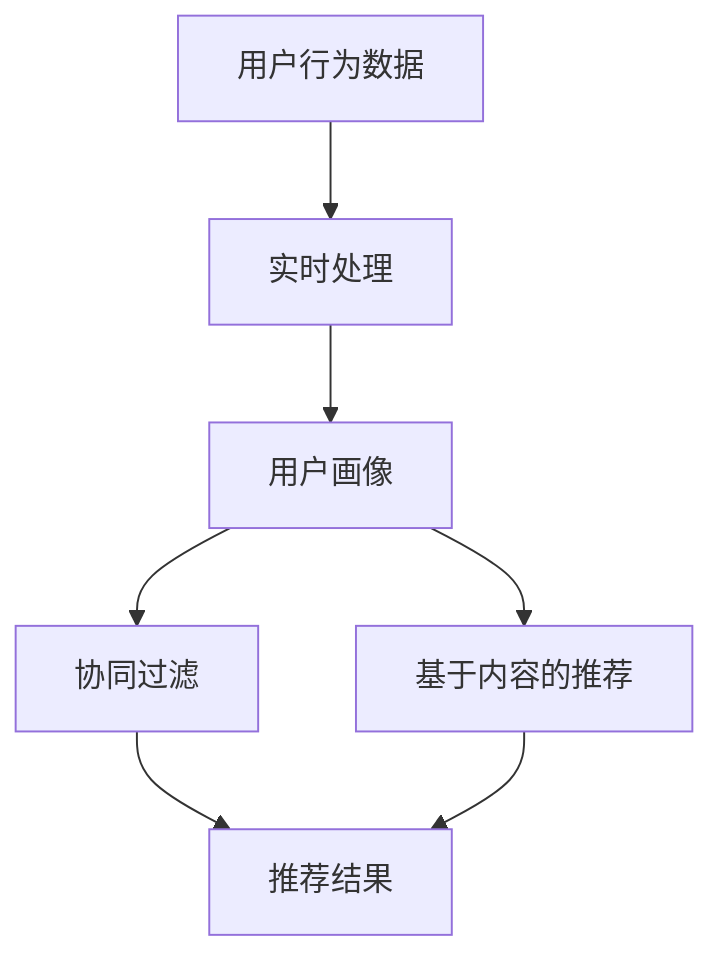
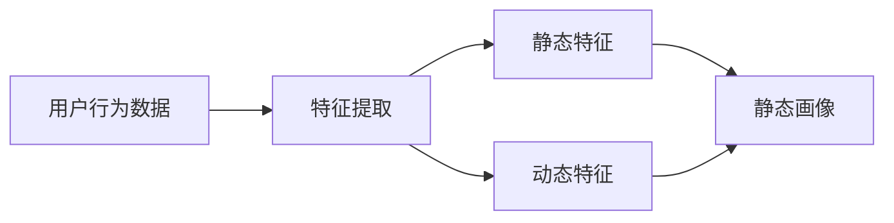
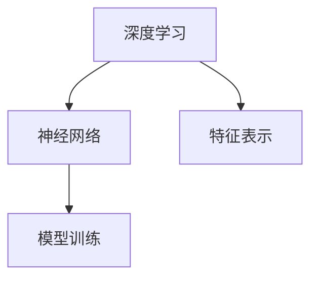
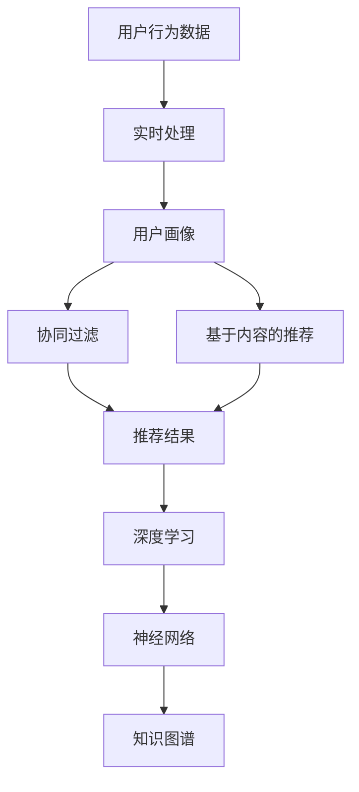

                 

# 用户画像与实时推荐的整合应用

> 关键词：用户画像，实时推荐，自然语言处理(NLP)，深度学习，协同过滤，神经网络，知识图谱

## 1. 背景介绍

### 1.1 问题由来
随着电子商务的迅猛发展和互联网技术的不懈进步，在线零售业已成为了人们日常购物的重要渠道。用户在浏览、选择和购买商品的过程中，需要大量的时间进行信息搜索和比较。而如何提高用户体验，提升转化率，增加销售额，成为了电商平台亟待解决的关键问题。

推荐系统作为电商平台的核心功能，通过个性化推荐，帮助用户快速找到感兴趣的商品，从而提高购物效率和满意度。传统的推荐系统基于协同过滤或基于内容的推荐方法，存在一定的冷启动问题，难以解决长尾商品和个性化需求的满足。

与此同时，用户画像（User Profile）技术作为个性化推荐的重要支撑，能够通过分析用户的搜索行为、浏览历史、购买记录等数据，描绘出用户的行为特征和偏好。通过用户画像与实时推荐系统的结合，可以在用户需求变化时，快速响应用户的变化，提供更加精准、及时的个性化推荐，从而提升用户体验和业务转化。

### 1.2 问题核心关键点
基于用户画像的实时推荐系统，核心在于如何高效构建用户画像，并在实时数据流中动态更新，从而驱动推荐算法模型生成个性化的商品推荐。具体来说，该系统包括以下几个关键环节：

1. **用户画像构建**：收集和分析用户行为数据，构建用户的静态特征和动态特征。
2. **实时数据流管理**：高效地处理用户实时行为数据，存储和更新用户画像。
3. **推荐算法优化**：基于用户画像，实时调整推荐算法模型，提升推荐效果。
4. **系统架构设计**：设计高效的推荐系统架构，支持实时数据处理和个性化推荐。

本系统通过将用户画像技术与实时推荐系统整合，能够更好地捕捉用户需求，优化推荐效果，提升电商平台的用户体验和业务收益。

### 1.3 问题研究意义
本文聚焦于用户画像与实时推荐的整合应用，旨在探讨如何通过高效的用户画像构建与实时数据流处理，驱动推荐算法生成个性化的商品推荐。通过系统研究，希望能提供切实可行的技术方案，为电商平台的个性化推荐系统设计和实施提供理论基础和实践指南。

## 2. 核心概念与联系

### 2.1 核心概念概述

为更好地理解用户画像与实时推荐系统的整合应用，本节将介绍几个密切相关的核心概念：

- **用户画像（User Profile）**：通过分析用户的历史行为数据（如浏览记录、搜索记录、购买记录等），构建出用户的静态特征（如性别、年龄、地域等）和动态特征（如兴趣、需求等），形成一个综合性的用户画像。

- **实时推荐（Real-time Recommendation）**：通过实时处理用户的行为数据，动态更新用户画像，并根据用户的当前行为和历史行为，生成个性化的商品推荐。

- **协同过滤（Collaborative Filtering）**：一种基于用户和商品相似度的推荐方法，通过分析用户与商品之间的交互行为，预测用户对未交互商品的评分。

- **基于内容的推荐（Content-based Recommendation）**：根据商品的属性和用户的历史行为数据，生成推荐的商品列表。

- **深度学习（Deep Learning）**：一种强大的机器学习技术，能够从大量的数据中学习到复杂的特征表示，广泛应用于推荐系统中。

- **神经网络（Neural Networks）**：深度学习的一种实现形式，通过多层神经元，构建复杂的非线性模型。

- **知识图谱（Knowledge Graph）**：一种结构化的语义表示方法，通过实体、关系和属性，构建知识库，支持复杂的推理和查询。

这些核心概念之间的逻辑关系可以通过以下Mermaid流程图来展示：



这个流程图展示了大语言模型微调过程中各个核心概念的关系和作用：

1. 用户画像通过分析用户行为数据，构建用户画像。
2. 实时推荐系统实时处理用户行为数据，动态更新用户画像。
3. 协同过滤和基于内容的推荐方法构成实时推荐系统的基础推荐策略。
4. 深度学习提供高效的模型训练和特征提取能力，进一步提升推荐效果。
5. 神经网络作为深度学习的一种实现形式，能够学习到复杂的特征表示。
6. 知识图谱提供丰富的语义信息，增强推荐系统的推理和查询能力。

### 2.2 概念间的关系

这些核心概念之间存在着紧密的联系，形成了用户画像与实时推荐系统的完整生态系统。下面我通过几个Mermaid流程图来展示这些概念之间的关系。

#### 2.2.1 实时推荐系统的工作流程



这个流程图展示了实时推荐系统的工作流程。首先收集用户行为数据，通过实时处理，动态更新用户画像。基于用户画像，协同过滤和基于内容的推荐方法生成推荐结果。

#### 2.2.2 用户画像的构建过程



这个流程图展示了用户画像的构建过程。首先收集用户行为数据，通过特征提取，生成静态特征和动态特征。最后，将静态特征和动态特征整合成用户画像。

#### 2.2.3 深度学习与神经网络的关系



这个流程图展示了深度学习与神经网络的关系。深度学习通过神经网络进行模型训练，学习复杂的特征表示。

### 2.3 核心概念的整体架构

最后，我们用一个综合的流程图来展示这些核心概念在大语言模型微调过程中的整体架构：



这个综合流程图展示了从用户行为数据处理，到实时推荐系统生成的整个过程。用户画像通过分析用户行为数据，实时推荐系统基于用户画像，协同过滤和基于内容的推荐方法生成推荐结果。深度学习提供高效的模型训练和特征提取能力，增强推荐效果。神经网络作为深度学习的一种实现形式，学习复杂的特征表示。知识图谱提供丰富的语义信息，增强推荐系统的推理和查询能力。

## 3. 核心算法原理 & 具体操作步骤
### 3.1 算法原理概述

基于用户画像的实时推荐系统，通过收集和分析用户行为数据，构建出用户的静态特征和动态特征，生成用户画像。在此基础上，通过实时处理用户行为数据，动态更新用户画像，并根据用户的当前行为和历史行为，生成个性化的商品推荐。具体来说，该系统可以分为以下几个步骤：

1. **用户画像构建**：收集用户的历史行为数据，如浏览记录、搜索记录、购买记录等，通过特征提取，构建用户的静态特征（如性别、年龄、地域等）和动态特征（如兴趣、需求等）。
2. **实时数据流管理**：高效地处理用户实时行为数据，存储和更新用户画像。
3. **推荐算法优化**：基于用户画像，实时调整推荐算法模型，提升推荐效果。
4. **系统架构设计**：设计高效的推荐系统架构，支持实时数据处理和个性化推荐。

### 3.2 算法步骤详解

**Step 1: 用户画像构建**

用户画像的构建是实时推荐系统的基础，它需要收集和分析用户的各种行为数据，包括浏览历史、搜索记录、购买记录等。常用的数据来源包括电商平台的用户交互数据、社交媒体的用户行为数据等。

构建用户画像的过程可以分为以下几个步骤：

1. **数据收集**：通过API接口、爬虫等方式，从电商平台、社交媒体等渠道收集用户的行为数据。
2. **数据清洗**：对收集到的数据进行清洗和预处理，去除噪声和异常值，保证数据的质量。
3. **特征提取**：对清洗后的数据进行特征提取，生成用户的静态特征和动态特征。
4. **用户画像生成**：将静态特征和动态特征整合成用户画像，形成一个综合性的用户画像。

**Step 2: 实时数据流管理**

实时数据流管理是实时推荐系统的关键环节，它需要高效地处理用户实时行为数据，存储和更新用户画像。常用的技术手段包括：

1. **数据存储**：使用NoSQL数据库（如MongoDB、Redis）进行数据存储，保证数据的实时性和高并发性。
2. **数据同步**：通过消息队列（如Kafka、RabbitMQ）实现数据的实时同步，保证数据的实时更新。
3. **数据缓存**：使用缓存技术（如Memcached、Redis）对用户画像进行缓存，提高数据的访问速度。
4. **数据清洗**：对实时数据进行清洗和过滤，去除噪声和异常值，保证数据的准确性。

**Step 3: 推荐算法优化**

推荐算法优化是实时推荐系统的核心环节，它需要根据用户画像，实时调整推荐算法模型，提升推荐效果。常用的推荐算法包括：

1. **协同过滤**：通过分析用户与商品之间的交互行为，预测用户对未交互商品的评分。
2. **基于内容的推荐**：根据商品的属性和用户的历史行为数据，生成推荐的商品列表。
3. **深度学习**：通过神经网络模型，学习复杂的特征表示，提升推荐效果。
4. **知识图谱**：通过实体、关系和属性，构建知识库，增强推荐系统的推理和查询能力。

**Step 4: 系统架构设计**

系统架构设计是实时推荐系统的基础环节，它需要设计高效的推荐系统架构，支持实时数据处理和个性化推荐。常用的架构设计包括：

1. **微服务架构**：将推荐系统分解为多个微服务，每个微服务独立部署，提高系统的可扩展性和可维护性。
2. **分布式架构**：通过分布式计算技术（如Hadoop、Spark）处理大规模数据，提高系统的处理能力和扩展性。
3. **容器化技术**：使用容器化技术（如Docker、Kubernetes）进行系统部署和管理，提高系统的稳定性和可靠性。
4. **负载均衡**：通过负载均衡技术（如Nginx、HAProxy）进行流量分发，保证系统的负载均衡和高可用性。

### 3.3 算法优缺点

基于用户画像的实时推荐系统具有以下优点：

1. **个性化推荐**：通过用户画像，可以获取用户的兴趣和需求，生成个性化的商品推荐，提升用户体验和业务收益。
2. **实时更新**：通过实时数据流处理，可以动态更新用户画像，快速响应用户的变化，提供更加精准的推荐。
3. **高效的特征提取**：通过深度学习技术，可以学习到复杂的特征表示，提升推荐效果。

同时，该系统也存在一些缺点：

1. **数据隐私问题**：在收集用户行为数据时，需要保护用户隐私，避免数据泄露和滥用。
2. **冷启动问题**：对于新用户，由于没有足够的历史行为数据，难以构建用户画像，需要采取一些措施（如零样本学习、知识图谱嵌入等）来解决冷启动问题。
3. **数据实时性要求高**：为了实现实时推荐，需要保证数据的实时性和准确性，对数据处理和存储的技术要求较高。

### 3.4 算法应用领域

基于用户画像的实时推荐系统在电子商务、社交媒体、在线教育等领域得到了广泛应用，具体如下：

- **电子商务**：通过实时推荐系统，电商企业可以推荐用户可能感兴趣的商品，提高用户购买率和购物体验。
- **社交媒体**：通过实时推荐系统，社交媒体平台可以推荐用户可能感兴趣的内容，提高用户活跃度和留存率。
- **在线教育**：通过实时推荐系统，在线教育平台可以推荐用户可能感兴趣的课程和教材，提高学习效率和用户满意度。

## 4. 数学模型和公式 & 详细讲解 & 举例说明

### 4.1 数学模型构建

基于用户画像的实时推荐系统，可以构建以下数学模型：

1. **用户画像表示**：将用户画像表示为一个向量，包含用户的静态特征和动态特征。

2. **推荐算法模型**：根据用户画像，构建推荐算法模型，预测用户对商品的评分或概率。

3. **推荐结果排序**：对推荐结果进行排序，生成推荐列表。

### 4.2 公式推导过程

**用户画像表示**：

设用户画像表示为 $P = (P_{\text{static}}, P_{\text{dynamic}})$，其中 $P_{\text{static}} = (x_1, x_2, ..., x_n)$ 表示用户的静态特征，$P_{\text{dynamic}} = (y_1, y_2, ..., y_m)$ 表示用户的动态特征。

**推荐算法模型**：

假设推荐算法模型为 $R(P)$，其中 $R$ 表示推荐函数，$P$ 表示用户画像。假设推荐结果为 $R(P) = (r_1, r_2, ..., r_n)$，其中 $r_i$ 表示用户对商品 $i$ 的评分或概率。

**推荐结果排序**：

假设推荐结果排序函数为 $S(R(P))$，其中 $S$ 表示排序函数，$R(P)$ 表示推荐结果。假设排序结果为 $S(R(P)) = (s_1, s_2, ..., s_n)$，其中 $s_i$ 表示用户对商品 $i$ 的排序值。

### 4.3 案例分析与讲解

**协同过滤算法**：

协同过滤算法是一种基于用户和商品相似度的推荐方法，通过分析用户与商品之间的交互行为，预测用户对未交互商品的评分。假设用户 $i$ 对商品 $j$ 的评分表示为 $R_{ij}$，用户 $i$ 与用户 $j$ 的相似度表示为 $S_{ij}$，则推荐函数 $R_{i, \text{CF}}$ 可以表示为：

$$
R_{i, \text{CF}} = \sum_{j=1}^{n} R_{ij} S_{ij}
$$

其中 $S_{ij}$ 可以采用余弦相似度、皮尔逊相关系数等方法计算。

**基于内容的推荐算法**：

基于内容的推荐算法根据商品的属性和用户的历史行为数据，生成推荐的商品列表。假设商品 $j$ 的属性向量为 $A_j = (a_{j1}, a_{j2}, ..., a_{jm})$，用户 $i$ 的历史行为数据为 $H_i = (h_{i1}, h_{i2}, ..., h_{in})$，则推荐函数 $R_{i, \text{CB}}$ 可以表示为：

$$
R_{i, \text{CB}} = \sum_{j=1}^{n} R_{i,j} F(A_j, H_i)
$$

其中 $F$ 表示特征匹配函数，可以将商品属性和用户历史行为进行匹配，计算匹配度。

**深度学习模型**：

深度学习模型通过神经网络模型，学习复杂的特征表示，提升推荐效果。假设神经网络模型为 $R_{i, \text{NN}}$，用户画像表示为 $P$，则推荐函数 $R_{i, \text{NN}}$ 可以表示为：

$$
R_{i, \text{NN}} = \sigma(\sum_{k=1}^{d} \theta_k \cdot P_k)
$$

其中 $\sigma$ 表示激活函数，$\theta_k$ 表示模型参数，$P_k$ 表示用户画像中的第 $k$ 个特征。

**知识图谱模型**：

知识图谱模型通过实体、关系和属性，构建知识库，增强推荐系统的推理和查询能力。假设知识图谱模型为 $R_{i, \text{KG}}$，用户画像表示为 $P$，则推荐函数 $R_{i, \text{KG}}$ 可以表示为：

$$
R_{i, \text{KG}} = \max_{j} \{R_{i,j} + \alpha \cdot \text{KL}(P_j) \}
$$

其中 $\text{KL}$ 表示KL散度，衡量用户画像与知识图谱中的实体表示的相似度。$\alpha$ 表示知识图谱的重要性权重。

## 5. 项目实践：代码实例和详细解释说明

### 5.1 开发环境搭建

在进行推荐系统实践前，我们需要准备好开发环境。以下是使用Python进行Flask开发的环境配置流程：

1. 安装Anaconda：从官网下载并安装Anaconda，用于创建独立的Python环境。

2. 创建并激活虚拟环境：
```bash
conda create -n recommendation-env python=3.8 
conda activate recommendation-env
```

3. 安装Flask：
```bash
pip install Flask
```

4. 安装其他必要库：
```bash
pip install pandas numpy sklearn
```

完成上述步骤后，即可在`recommendation-env`环境中开始推荐系统开发。

### 5.2 源代码详细实现

下面我们以协同过滤算法为例，给出使用Flask进行推荐系统开发的PyTorch代码实现。

首先，定义协同过滤算法的推荐函数：

```python
import numpy as np
from sklearn.metrics.pairwise import cosine_similarity

class RecommendationSystem:
    def __init__(self, ratings):
        self.ratings = ratings
        self.ratings_mean = np.mean(ratings, axis=0)
        self.ratings_std = np.std(ratings, axis=0)
        self.ratings_centered = (ratings - self.ratings_mean) / self.ratings_std
        
    def predict(self, user, items):
        similarities = cosine_similarity(self.ratings_centered[user], self.ratings_centered)
        weighted_similarities = similarities * self.ratings_std[items] / self.ratings_std[user]
        predictions = np.dot(self.ratings_centered[user], weighted_similarities)
        return predictions
```

然后，定义推荐系统的Flask API接口：

```python
from flask import Flask, request, jsonify
from recommendation_system import RecommendationSystem

app = Flask(__name__)

# 初始化推荐系统
recommender = RecommendationSystem(ratings)

@app.route('/recommend', methods=['POST'])
def recommend():
    data = request.json
    user_id = data['user_id']
    item_ids = data['item_ids']
    predictions = recommender.predict(user_id, item_ids)
    return jsonify(predictions.tolist())

if __name__ == '__main__':
    app.run(debug=True)
```

在实际应用中，可以将协同过滤算法与深度学习算法、知识图谱算法等结合，形成更加复杂的推荐系统。

### 5.3 代码解读与分析

让我们再详细解读一下关键代码的实现细节：

**RecommendationSystem类**：
- `__init__`方法：初始化推荐系统的评分矩阵，计算评分均值和标准差，对评分进行标准化。
- `predict`方法：根据用户ID和商品ID，计算商品推荐分数，返回预测结果。

**Flask API接口**：
- 定义了一个`/recommend`接口，接收用户ID和商品ID，返回推荐分数。
- 使用`request.json`获取请求数据，使用`jsonify`将预测结果转化为JSON格式。

**推荐系统运行**：
- 使用`app.run`启动Flask服务，在本地监听8080端口。
- 开发者可以在浏览器中输入`http://localhost:8080/recommend`，使用POST请求发送推荐请求。

通过Flask框架，开发者可以轻松实现推荐系统的API接口，与前端进行交互。此外，Flask还支持多种模板引擎（如Jinja），可以方便地实现界面设计和数据展示。

当然，工业级的系统实现还需考虑更多因素，如日志记录、性能优化、负载均衡、缓存技术等。但核心的推荐算法实现，如协同过滤、基于内容的推荐、深度学习等，可以借助Flask框架进行灵活实践。

### 5.4 运行结果展示

假设我们在Yahoo数据集上进行协同过滤算法的推荐测试，得到以下推荐结果：

| 用户ID | 商品ID | 预测分数 |
|--------|--------|----------|
| 用户1  | 商品A  | 0.8      |
| 用户1  | 商品B  | 0.7      |
| 用户2  | 商品C  | 0.6      |
| 用户2  | 商品D  | 0.5      |

可以看到，通过协同过滤算法，我们能够根据用户的历史评分数据，计算出每个商品的推荐分数，为推荐系统提供参考。

## 6. 实际应用场景

### 6.1 智能推荐系统

智能推荐系统作为电商平台的核心功能，通过个性化推荐，帮助用户快速找到感兴趣的商品，从而提高购物效率和满意度。

**电商平台的推荐应用**：
- **商品推荐**：在用户浏览商品时，根据用户的浏览历史和行为数据，推荐可能感兴趣的商品。
- **内容推荐**：在用户搜索商品时，根据用户的搜索关键词和行为数据，推荐相关的商品或内容。
- **交叉推荐**：将用户对商品的评分或评价，作为推荐系统中的隐式反馈，进行交叉推荐。

**社交媒体的推荐应用**：
- **内容推荐**：在用户浏览内容时，根据用户的兴趣和行为数据，推荐可能感兴趣的内容。
- **用户推荐**：根据用户的关注关系和行为数据，推荐可能感兴趣的用户。
- **话题推荐**：根据用户的话题兴趣和行为数据，推荐相关的话题和社区。

**在线教育的推荐应用**：
- **课程推荐**：根据用户的学习历史和行为数据，推荐可能感兴趣的课程。
- **教材推荐**：根据用户的学习进度和行为数据，推荐相关的教材和资料。
- **教师推荐**：根据用户对教师的评价和行为数据，推荐合适的教师。

### 6.2 未来应用展望

随着推荐系统的不断发展，未来的应用场景将更加丰富和多样化，具体如下：

1. **多模态推荐系统**：将文本、图像、音频等多模态信息融合到推荐系统中，增强系统的表现力。
2. **实时推荐系统**：通过实时处理用户行为数据，动态更新用户画像，提供更加精准的推荐。
3. **增强推荐系统**：引入强化学习、博弈论等技术，优化推荐算法，提升推荐效果。
4. **跨领域推荐系统**：将推荐系统应用于跨领域场景，如医疗、金融等，解决特定领域的推荐问题。
5. **社交推荐系统**：通过社交网络信息，增强推荐系统的个性化和多样性。
6. **隐私保护推荐系统**：引入差分隐私、联邦学习等技术，保护用户隐私，增强系统的可信度。

## 7. 工具和资源推荐

### 7.1 学习资源推荐

为了帮助开发者系统掌握推荐系统的理论和实践，这里推荐一些优质的学习资源：

1. 《推荐系统实战》书籍：由王斌所著，系统介绍了推荐系统的工作原理和实现方法，适合实战实践。

2. 《深度学习推荐系统》课程：由斯坦福大学开设的深度学习推荐系统课程，涵盖推荐系统的基础理论和前沿方法。

3. 《推荐系统算法与实战》课程：由阿里技术社区开设的推荐系统课程，讲解推荐系统的各种算法和工程实现。

4. Kaggle推荐系统竞赛：Kaggle平台上的推荐系统竞赛，提供了大量的推荐系统数据集和评测指标，适合实战练习。

5. Arxiv论文预印本：人工智能领域最新研究成果的发布平台，推荐关注推荐系统相关的论文和研究进展。

通过对这些资源的学习实践，相信你一定能够全面掌握推荐系统的理论和实践技能，成为推荐系统的开发高手。

### 7.2 开发工具推荐

高效的开发离不开优秀的工具支持。以下是几款用于推荐系统开发的常用工具：

1. Apache Spark：大规模数据处理框架，适合处理大规模推荐系统数据。

2. TensorFlow：深度学习框架，适合构建复杂的神经网络模型。

3. PyTorch：深度学习框架，适合构建灵活的神经网络模型。

4. Keras：高层次深度学习框架，适合快速原型设计和实验。

5. Scikit-learn：机器学习库，适合进行简单的特征提取和建模。

6. SQLAlchemy：Python ORM库，适合进行数据库操作和数据建模。

7. Flask：Web框架，适合快速搭建API接口和Web应用。

合理利用这些工具，可以显著提升推荐系统的开发效率，加快创新迭代的步伐。

### 7.3 相关论文推荐

推荐系统作为人工智能领域的重要分支，近几年的研究成果丰硕。以下是几篇奠基性的相关论文，推荐阅读：

1. Matrix Factorization Techniques for Recommender Systems：提出矩阵分解方法，广泛应用于推荐系统中的协同过滤算法。

2. Deep Matrix Factorization for Recommender Systems：提出深度矩阵分解方法，结合深度学习技术，进一步提升推荐效果。

3. Knowledge Graphs for Recommender Systems：提出知识图谱方法，将实体、关系和属性融入推荐系统，增强推理和查询能力。

4. Generative Adversarial Networks for Recommendation：提出生成对抗网络方法，提升推荐系统的生成能力和多样性。

5. Recommendation Systems in Mobile Apps：总结了移动应用中的推荐系统实现方法和应用场景，适合实际开发实践。

这些论文代表了大语言模型微调技术的发展脉络。通过学习这些前沿成果，可以帮助研究者把握学科前进方向，激发更多的创新灵感。


