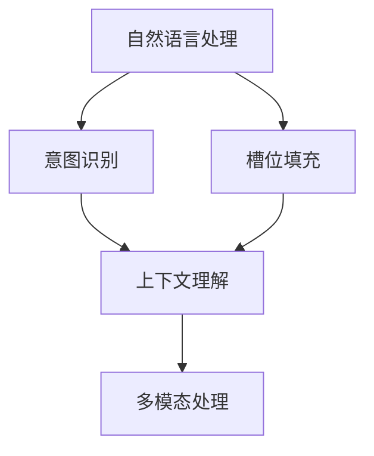
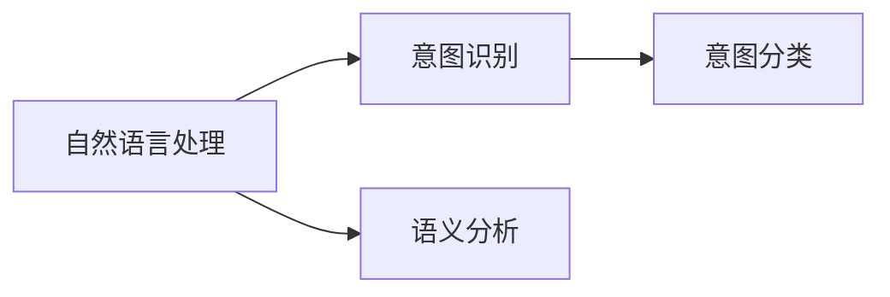
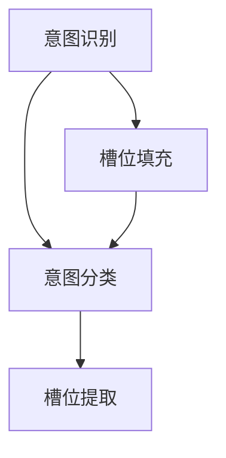
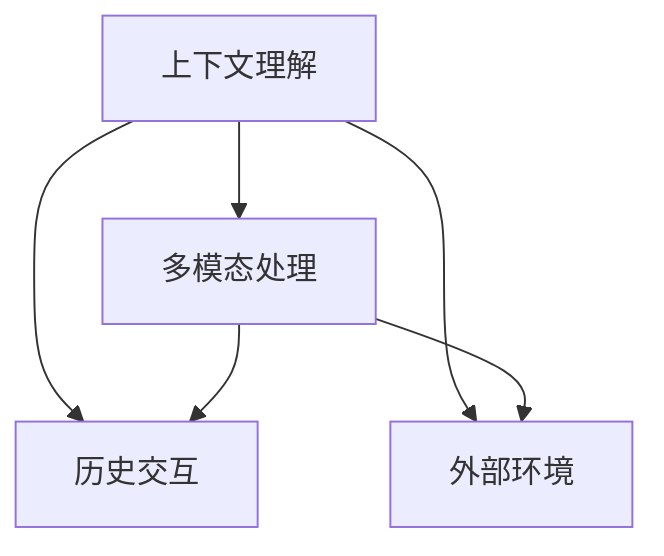
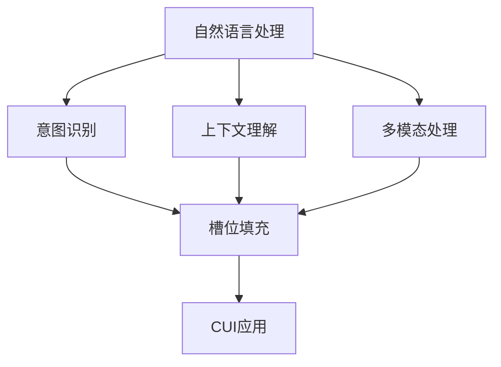

                 

# 用户需求表达在CUI中的实现方式

在计算用户界面（Computational User Interface, CUI）中，用户的需求表达是实现自然交互和个性化服务的基础。CUI通过计算机程序自动地解析和理解用户的输入，从而提供更为智能化和高效的交互体验。本文将深入探讨用户需求表达在CUI中的实现方式，包括核心概念、算法原理、具体实现和实际应用。

## 1. 背景介绍

### 1.1 问题由来

随着人工智能技术的不断进步，CUI在各行各业中得到了广泛应用，如智能助手、推荐系统、智能客服等。用户需求表达作为CUI的核心部分，是影响用户体验和系统性能的关键因素。尽管现有技术在语音识别、图像处理等方面取得了显著进展，但用户在自然语言输入时的表达仍然存在多义性、模糊性等问题。因此，准确理解和解析用户需求，并转化为系统可执行的指令，是CUI中面临的一大挑战。

### 1.2 问题核心关键点

用户需求表达涉及以下核心关键点：

1. **自然语言理解（Natural Language Understanding, NLU）**：将自然语言文本转换为结构化的语义表示。
2. **意图识别（Intent Recognition）**：确定用户输入的意图，如询问、命令、投诉等。
3. **槽位填充（Slot Filling）**：识别和提取用户输入中的具体信息，如时间、地点、价格等。
4. **上下文理解（Context Understanding）**：考虑历史交互和外部环境，增强对用户需求的理解。
5. **多模态处理（Multimodal Processing）**：结合语音、图像、文字等多种输入方式，提升理解准确性。

### 1.3 问题研究意义

深入研究用户需求表达的实现方式，对于提升CUI的用户体验、增强系统的智能化和个性化能力具有重要意义：

1. **提升交互效率**：通过准确的意图识别和槽位填充，减少用户重复输入，提高交互效率。
2. **增强智能化水平**：基于上下文理解和多模态处理，实现更为精准的需求识别和响应。
3. **促进个性化服务**：通过个性化模型和算法，为用户提供量身定制的解决方案。
4. **拓展应用范围**：支持多种用户需求表达方式，提升CUI的通用性和可扩展性。
5. **推动产业发展**：推动智能技术在更多行业的应用，带来新的商业机会和价值。

## 2. 核心概念与联系

### 2.1 核心概念概述

CUI中用户需求表达涉及的核心概念包括：

- **自然语言处理（Natural Language Processing, NLP）**：涉及语音识别、语义分析、情感分析等技术，用于理解用户的自然语言输入。
- **意图识别（Intent Recognition）**：通过机器学习算法，自动识别用户输入的意图。
- **槽位填充（Slot Filling）**：通过命名实体识别（Named Entity Recognition, NER）等技术，提取用户输入中的具体信息。
- **上下文理解（Context Understanding）**：考虑历史交互和外部环境，增强对用户需求的理解。
- **多模态处理（Multimodal Processing）**：结合语音、图像、文字等多种输入方式，提升理解准确性。

这些核心概念之间的联系可以通过以下Mermaid流程图来展示：



这个流程图展示了从自然语言处理到意图识别，再到槽位填充、上下文理解和多模态处理的过程。

### 2.2 概念间的关系

这些核心概念之间存在着紧密的联系，形成了CUI中用户需求表达的完整生态系统。下面我们通过几个Mermaid流程图来展示这些概念之间的关系。

#### 2.2.1 自然语言处理与意图识别的关系



这个流程图展示了自然语言处理与意图识别的关系。自然语言处理中通过语义分析得到用户输入的语义表示，然后意图识别系统通过分类算法确定用户意图。

#### 2.2.2 意图识别与槽位填充的关系



这个流程图展示了意图识别与槽位填充的关系。意图识别系统确定用户意图后，槽位填充系统提取意图中的具体信息。

#### 2.2.3 上下文理解与多模态处理的关系



这个流程图展示了上下文理解与多模态处理的关系。上下文理解系统考虑历史交互和外部环境，提升对用户需求的理解，而多模态处理系统则结合多种输入方式，进一步增强理解准确性。

### 2.3 核心概念的整体架构

最后，我们用一个综合的流程图来展示这些核心概念在CUI中的整体架构：



这个综合流程图展示了从自然语言处理到意图识别、槽位填充、上下文理解和多模态处理的过程，并最终应用于CUI系统中。

## 3. 核心算法原理 & 具体操作步骤

### 3.1 算法原理概述

用户需求表达在CUI中的实现方式，主要包括自然语言理解、意图识别、槽位填充和上下文理解等步骤。以下是这些步骤的具体算法原理概述：

1. **自然语言理解（NLU）**：将自然语言文本转换为结构化的语义表示，常用的算法包括词向量模型（Word Embedding）、句法分析（Syntactic Parsing）和语义分析（Semantic Analysis）。
2. **意图识别（Intent Recognition）**：通过机器学习算法，自动识别用户输入的意图，常用的算法包括决策树（Decision Tree）、支持向量机（Support Vector Machine, SVM）和神经网络（Neural Networks）。
3. **槽位填充（Slot Filling）**：通过命名实体识别（NER）等技术，提取用户输入中的具体信息，常用的算法包括条件随机场（Conditional Random Fields, CRF）和神经网络。
4. **上下文理解（Context Understanding）**：考虑历史交互和外部环境，增强对用户需求的理解，常用的算法包括时序模型（Recurrent Neural Networks, RNN）和注意力机制（Attention Mechanism）。
5. **多模态处理（Multimodal Processing）**：结合语音、图像、文字等多种输入方式，提升理解准确性，常用的算法包括深度学习（Deep Learning）和融合技术（Fusion Techniques）。

### 3.2 算法步骤详解

#### 3.2.1 自然语言理解（NLU）

自然语言理解通常包括以下步骤：

1. **分词**：将用户输入的文本分成词语或子词，常用的分词工具包括JIEBA、SnowNLP等。
2. **词向量化**：将词语映射到向量空间，常用的词向量模型包括Word2Vec、GloVe和BERT等。
3. **句法分析**：分析句子的结构，常用的句法分析工具包括Stanford Parser、SpaCy等。
4. **语义分析**：识别句子中的语义角色，常用的语义分析工具包括依存关系分析（Dependency Parsing）和语义角色标注（Semantic Role Labeling, SRL）。

#### 3.2.2 意图识别（Intent Recognition）

意图识别通常包括以下步骤：

1. **特征提取**：将用户输入的特征提取为向量，常用的特征提取方法包括词向量、句法特征和情感特征等。
2. **分类模型训练**：使用决策树、SVM或神经网络等分类模型，对特征进行分类。
3. **意图分类**：根据分类结果，确定用户意图，常用的分类算法包括逻辑回归（Logistic Regression）和深度学习模型。

#### 3.2.3 槽位填充（Slot Filling）

槽位填充通常包括以下步骤：

1. **命名实体识别（NER）**：识别用户输入中的实体，如人名、地名、机构名等。
2. **槽位标注**：将实体标注为槽位，常用的标注方法包括条件随机场（CRF）和序列标注模型。
3. **槽位提取**：从用户输入中提取具体的槽位信息，常用的提取方法包括神经网络。

#### 3.2.4 上下文理解（Context Understanding）

上下文理解通常包括以下步骤：

1. **历史交互分析**：分析用户的历史交互记录，提取有用的上下文信息。
2. **外部环境感知**：感知用户所处的外部环境，如时间、地点等。
3. **上下文整合**：将历史交互和外部环境信息整合，增强对用户需求的理解。

#### 3.2.5 多模态处理（Multimodal Processing）

多模态处理通常包括以下步骤：

1. **数据融合**：将语音、图像、文字等多种输入方式进行融合，常用的融合方法包括特征池化（Feature Pooling）和注意力机制（Attention Mechanism）。
2. **特征提取**：提取融合后的特征，常用的特征提取方法包括卷积神经网络（Convolutional Neural Networks, CNN）和循环神经网络（Recurrent Neural Networks, RNN）。
3. **多模态分类**：使用神经网络等分类模型，对融合后的特征进行分类。

### 3.3 算法优缺点

用户需求表达在CUI中的实现方式具有以下优点：

1. **提升用户体验**：通过准确的意图识别和槽位填充，减少用户重复输入，提高交互效率。
2. **增强智能化水平**：基于上下文理解和多模态处理，实现更为精准的需求识别和响应。
3. **促进个性化服务**：通过个性化模型和算法，为用户提供量身定制的解决方案。
4. **拓展应用范围**：支持多种用户需求表达方式，提升CUI的通用性和可扩展性。

但同时也存在以下缺点：

1. **复杂度高**：涉及多种算法和技术，实现难度较大。
2. **数据需求高**：需要大量标注数据进行训练和优化，数据获取和标注成本较高。
3. **泛化能力有限**：模型对特定领域和场景的泛化能力有限，需要进行领域适应。
4. **资源消耗大**：涉及多种计算资源，模型推理速度较慢，硬件资源消耗较大。

### 3.4 算法应用领域

用户需求表达在CUI中的应用领域包括：

1. **智能助手**：如小冰、小爱同学等，为用户提供查询、提醒、日程管理等服务。
2. **推荐系统**：如Netflix、Amazon等，根据用户需求和历史行为，推荐个性化的内容。
3. **智能客服**：如支付宝、微信等，为用户提供自动问答、问题解决等服务。
4. **健康医疗**：如丁香医生、平安好医生等，提供健康咨询、病历记录等服务。
5. **金融服务**：如招行、支付宝等，提供账户管理、理财咨询等服务。

## 4. 数学模型和公式 & 详细讲解 & 举例说明

### 4.1 数学模型构建

#### 4.1.1 自然语言理解（NLU）

自然语言理解中常用的数学模型包括：

1. **词向量模型**：将词语映射到向量空间，常用的模型包括Word2Vec和GloVe。
2. **句法分析模型**：分析句子的结构，常用的模型包括Constituency Parsing和Dependency Parsing。
3. **语义分析模型**：识别句子中的语义角色，常用的模型包括依存关系分析和语义角色标注（SRL）。

#### 4.1.2 意图识别（Intent Recognition）

意图识别中常用的数学模型包括：

1. **决策树**：通过决策树对特征进行分类，常用的模型包括ID3和C4.5。
2. **支持向量机**：通过SVM对特征进行分类，常用的核函数包括线性核和RBF核。
3. **神经网络**：通过神经网络对特征进行分类，常用的模型包括多层感知机（MLP）和卷积神经网络（CNN）。

#### 4.1.3 槽位填充（Slot Filling）

槽位填充中常用的数学模型包括：

1. **条件随机场**：通过CRF对实体进行标注，常用的模型包括LME和LSTM-CRF。
2. **序列标注模型**：通过神经网络对实体进行标注，常用的模型包括LSTM和BiLSTM。

#### 4.1.4 上下文理解（Context Understanding）

上下文理解中常用的数学模型包括：

1. **时序模型**：通过RNN对历史交互进行建模，常用的模型包括GRU和LSTM。
2. **注意力机制**：通过注意力机制对外部环境进行感知，常用的模型包括Transformer和BiTransformer。

#### 4.1.5 多模态处理（Multimodal Processing）

多模态处理中常用的数学模型包括：

1. **特征池化**：通过特征池化对多种输入进行融合，常用的方法包括Max Pooling和Average Pooling。
2. **神经网络**：通过神经网络对融合后的特征进行分类，常用的模型包括CNN和RNN。

### 4.2 公式推导过程

#### 4.2.1 自然语言理解（NLU）

自然语言理解中常用的公式包括：

1. **词向量模型**：$$
    \mathbf{W} = \arg\min_{\mathbf{W}} \frac{1}{N}\sum_{i=1}^N \|\mathbf{w}_i - \mathbf{v}_i\|^2
$$

其中，$\mathbf{w}_i$为词语$i$的向量表示，$\mathbf{v}_i$为词语$i$的词向量，$N$为词语总数。

2. **句法分析模型**：$$
    \arg\min_{\mathbf{T}} \sum_{i=1}^N \|\mathbf{t}_i - \mathbf{s}_i\|^2
$$

其中，$\mathbf{t}_i$为句子$i$的结构表示，$\mathbf{s}_i$为句法分析器的输出。

3. **语义分析模型**：$$
    \arg\min_{\mathbf{S}} \sum_{i=1}^N \|\mathbf{s}_i - \mathbf{r}_i\|^2
$$

其中，$\mathbf{s}_i$为句子$i$的语义角色标注，$\mathbf{r}_i$为语义分析器的输出。

#### 4.2.2 意图识别（Intent Recognition）

意图识别中常用的公式包括：

1. **决策树模型**：$$
    \mathbf{Y} = \arg\max_{\mathbf{Y}} \sum_{i=1}^M p_i \log p_i
$$

其中，$\mathbf{Y}$为意图分类器的输出，$p_i$为每个叶节点的概率。

2. **支持向量机模型**：$$
    \mathbf{w} = \arg\min_{\mathbf{w}} \frac{1}{2} \|\mathbf{w}\|^2 + C \sum_{i=1}^N \xi_i
$$

其中，$\mathbf{w}$为SVM的权重向量，$\xi_i$为松弛变量，$C$为正则化系数。

3. **神经网络模型**：$$
    \mathbf{Y} = \sigma(\mathbf{W} \mathbf{X} + \mathbf{b})
$$

其中，$\mathbf{Y}$为神经网络的输出，$\mathbf{X}$为输入特征，$\mathbf{W}$为权重矩阵，$\mathbf{b}$为偏置向量，$\sigma$为激活函数。

#### 4.2.3 槽位填充（Slot Filling）

槽位填充中常用的公式包括：

1. **条件随机场模型**：$$
    \mathbf{Y} = \arg\min_{\mathbf{Y}} \sum_{i=1}^N \mathbf{L}(\mathbf{y}_i, \mathbf{z}_i)
$$

其中，$\mathbf{y}_i$为槽位标注，$\mathbf{z}_i$为上下文特征，$\mathbf{L}$为CRF的损失函数。

2. **序列标注模型**：$$
    \mathbf{Y} = \sigma(\mathbf{W} \mathbf{X} + \mathbf{b})
$$

其中，$\mathbf{Y}$为序列标注器的输出，$\mathbf{X}$为输入特征，$\mathbf{W}$为权重矩阵，$\mathbf{b}$为偏置向量，$\sigma$为激活函数。

#### 4.2.4 上下文理解（Context Understanding）

上下文理解中常用的公式包括：

1. **时序模型模型**：$$
    \mathbf{H} = \sigma(\mathbf{W} \mathbf{X} + \mathbf{b})
$$

其中，$\mathbf{H}$为时序模型的隐藏状态，$\mathbf{X}$为输入特征，$\mathbf{W}$为权重矩阵，$\mathbf{b}$为偏置向量，$\sigma$为激活函数。

2. **注意力机制模型**：$$
    \mathbf{A} = \sigma(\mathbf{W} \mathbf{X} + \mathbf{b})
$$

其中，$\mathbf{A}$为注意力机制的输出，$\mathbf{X}$为输入特征，$\mathbf{W}$为权重矩阵，$\mathbf{b}$为偏置向量，$\sigma$为激活函数。

#### 4.2.5 多模态处理（Multimodal Processing）

多模态处理中常用的公式包括：

1. **特征池化模型**：$$
    \mathbf{F} = \frac{1}{M}\sum_{i=1}^M \mathbf{f}_i
$$

其中，$\mathbf{F}$为融合后的特征向量，$\mathbf{f}_i$为第$i$个输入的特征向量。

2. **神经网络模型**：$$
    \mathbf{Y} = \sigma(\mathbf{W} \mathbf{X} + \mathbf{b})
$$

其中，$\mathbf{Y}$为神经网络的输出，$\mathbf{X}$为融合后的特征向量，$\mathbf{W}$为权重矩阵，$\mathbf{b}$为偏置向量，$\sigma$为激活函数。

### 4.3 案例分析与讲解

#### 4.3.1 案例分析

以智能助手系统为例，用户输入的文本为"我想订一张从北京到上海的机票"。

1. **自然语言理解（NLU）**：
    - **分词**：将文本分词为"我"、"想"、"订"、"一张"、"从"、"北京"、"到"、"上海"、"的"、"机票"。
    - **词向量化**：将词语映射到向量空间，得到每个词语的向量表示。
    - **句法分析**：分析句子结构，得到依存关系和成分分析结果。
    - **语义分析**：识别句子中的语义角色，得到意图和槽位信息。

2. **意图识别（Intent Recognition）**：
    - **特征提取**：将用户输入的特征提取为向量，包括词向量、句法特征和情感特征等。
    - **分类模型训练**：使用决策树、SVM或神经网络等分类模型，对特征进行分类。
    - **意图分类**：根据分类结果，确定用户意图为"订票"。

3. **槽位填充（Slot Filling）**：
    - **命名实体识别（NER）**：识别用户输入中的实体，如"北京"和"上海"。
    - **槽位标注**：将实体标注为槽位，得到"出发地"和"目的地"。
    - **槽位提取**：从用户输入中提取具体的槽位信息，得到"北京"和"上海"。

4. **上下文理解（Context Understanding）**：
    - **历史交互分析**：分析用户的历史交互记录，提取有用的上下文信息，如用户之前是否有订票记录。
    - **外部环境感知**：感知用户所处的外部环境，如时间、地点等。
    - **上下文整合**：将历史交互和外部环境信息整合，增强对用户需求的理解。

5. **多模态处理（Multimodal Processing）**：
    - **数据融合**：将语音、图像、文字等多种输入方式进行融合，常用的融合方法包括特征池化（Feature Pooling）和注意力机制（Attention Mechanism）。
    - **特征提取**：提取融合后的特征，常用的特征提取方法包括卷积神经网络（CNN）和循环神经网络（RNN）。
    - **多模态分类**：使用神经网络等分类模型，对融合后的特征进行分类。

#### 4.3.2 讲解

以上案例展示了用户需求表达在CUI中的实现过程，从自然语言理解、意图识别到槽位填充和上下文理解，再到多模态处理，每个步骤都有详细的公式和算法说明。

通过这些步骤，CUI系统能够准确理解用户输入的自然语言文本，并转化为系统可执行的指令，从而实现智能交互和个性化服务。

## 5. 项目实践：代码实例和详细解释说明

### 5.1 开发环境搭建

在进行CUI系统开发前，我们需要准备好开发环境。以下是使用Python进行PyTorch开发的环境配置流程：

1. 安装Anaconda：从官网下载并安装Anaconda，用于创建独立的Python环境。

2. 创建并激活虚拟环境：
```bash
conda create -n pytorch-env python=3.8 
conda activate pytorch-env
```

3. 安装PyTorch：根据CUDA版本，从官网获取对应的安装命令。例如：
```bash
conda install pytorch torchvision torchaudio cudatoolkit=11.1 -c pytorch -c conda-forge
```

4. 安装TensorFlow：使用pip安装TensorFlow，或通过Anaconda安装最新版本。

5. 安装各类工具包：
```bash
pip install numpy pandas scikit-learn matplotlib tqdm jupyter notebook ipython
```

完成上述步骤后，即可在`pytorch-env`环境中开始CUI系统开发。

### 5.2 源代码详细实现

下面以智能助手系统为例，给出使用PyTorch进行CUI系统开发的代码实现。

```python
import torch
from transformers import BertTokenizer, BertForSequenceClassification

class SmartAssistant:
    def __init__(self, model_path):
        self.tokenizer = BertTokenizer.from_pretrained('bert-base-cased')
        self.model = BertForSequenceClassification.from_pretrained(model_path)
        self.model.eval()

    def preprocess(self, input_text):
        tokens = self.tokenizer.tokenize(input_text)
        tokens = ["[CLS]"] + tokens + ["[SEP]"]
        input_ids = self.tokenizer.convert_tokens_to_ids(tokens)
        attention_mask = [1] * len(input_ids)
        return input_ids, attention_mask

    def classify(self, input_ids, attention_mask):
        with torch.no_grad():
            output = self.model(input_ids, attention_mask=attention_mask)
            logits = output.logits
            predicted_class = torch.argmax(logits, dim=1).item()
            return predicted_class

    def predict(self, input_text):
        input_ids, attention_mask = self.preprocess(input_text)
        predicted_class = self.classify(input_ids, attention_mask)
        return predicted_class
```

在这个代码中，我们使用Bert模型作为意图识别器。首先，通过BertTokenizer将输入文本进行分词和编码，得到输入特征。然后，使用BertForSequenceClassification模型对特征进行分类，得到意图标签。最后，返回预测的意图标签。

### 5.3 代码解读与分析

让我们再详细解读一下关键代码的实现细节：

**SmartAssistant类**：
- `__init__`方法：初始化分词器和意图分类器。
- `preprocess`方法：对输入文本进行分词和编码，得到模型需要的输入特征。
- `classify`方法：使用意图分类器对输入特征进行分类，得到预测的意图标签。
- `predict`方法：调用`preprocess`和`classify`方法，最终返回预测的意图标签。

**输入预处理**：
- `input_text`：用户输入的自然语言文本。
- `tokens`：将输入文本分词为词语。
- `input_ids`：将词语转换为模型需要的向量表示。
- `attention_mask`：表示输入特征的注意力掩码，1表示有效位置，0表示无效位置。

**模型分类**：
- `model`：使用预训练的BertForSequenceClassification模型。
- `logits`：模型的输出向量，包含每个类别的概率。
- `predicted_class`：预测的意图标签，通过argmax函数得到。

### 5.

