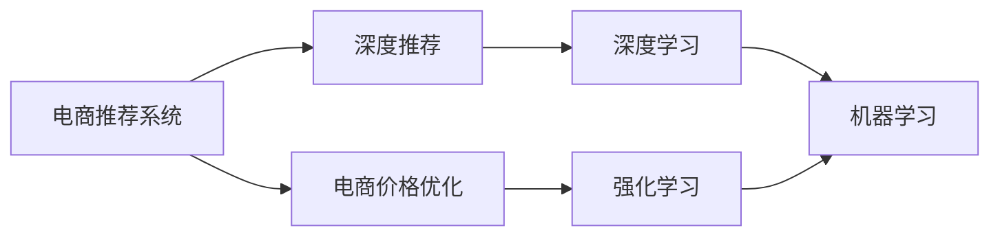
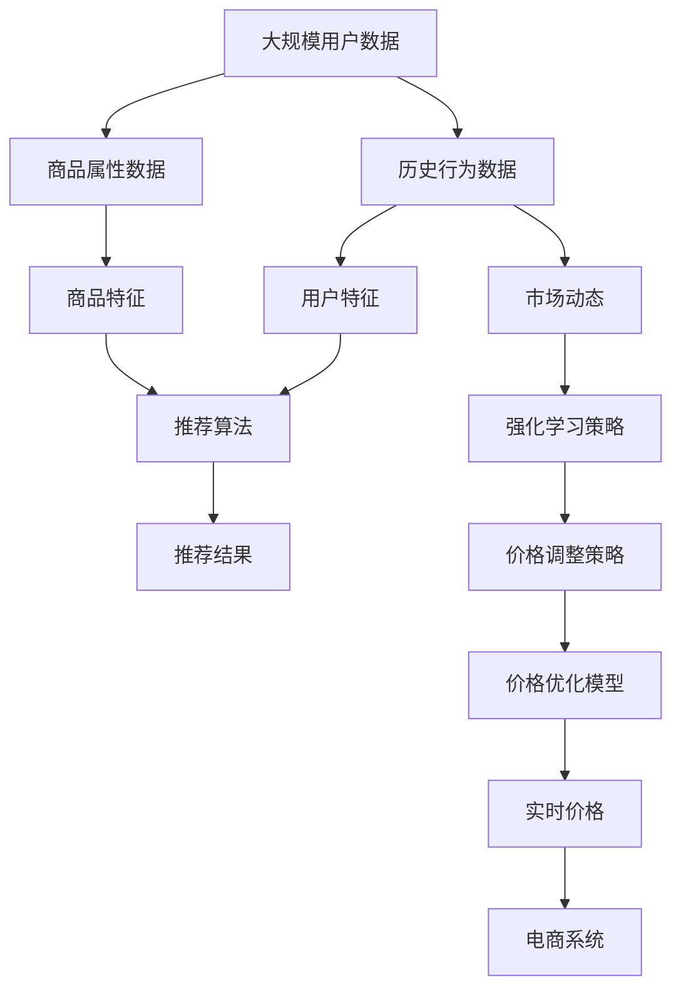

                 

# 电商价格优化的AI技术实现

> 关键词：电商价格优化, 人工智能, AI, 机器学习, 深度学习, 深度推荐, 电商推荐系统

## 1. 背景介绍

在电商领域，价格优化一直是商家最为关注的议题之一。合理的定价策略不仅能够吸引消费者，还能最大化销售额和利润。然而，传统价格优化方法往往基于简单的统计模型和经验规则，难以充分考虑市场变化和个性化需求，导致效果不佳。随着人工智能技术的进步，基于AI的价格优化方法逐渐成为主流，帮助电商商家实现更精准、更动态的价格管理。

本文聚焦于电商价格优化的AI技术实现，将详细介绍机器学习和深度学习在价格优化中的应用，帮助电商商家掌握基于AI的精准定价策略。通过系统的理论分析和技术实践，本文还将展望未来价格优化技术的发展趋势，探讨其在电商领域的应用前景。

## 2. 核心概念与联系

### 2.1 核心概念概述

为更好地理解基于AI的电商价格优化方法，本节将介绍几个密切相关的核心概念：

- 电商推荐系统：通过分析用户的历史行为和偏好，向用户推荐可能感兴趣的商品或服务，以提高用户满意度和销售额。
- 深度推荐：一种基于深度学习的推荐算法，通过用户行为数据和商品属性进行复杂特征学习，实现更准确、更具个性化的推荐。
- 深度学习：一种基于神经网络模型的人工智能技术，能够自动学习复杂的数据特征和模式，广泛应用于计算机视觉、自然语言处理等领域。
- 电商价格优化：通过AI技术对商品价格进行实时调整，以适应市场需求和竞争环境，最大化商家收益。
- 强化学习：一种通过与环境互动学习最优策略的机器学习技术，特别适用于动态环境下的决策问题。

这些核心概念之间的逻辑关系可以通过以下Mermaid流程图来展示：



这个流程图展示了电商推荐系统和价格优化的核心概念及其之间的关系：

1. 电商推荐系统基于用户行为数据和商品属性进行特征学习，推荐合适的商品给用户。
2. 电商价格优化则通过分析市场动态和推荐系统的输出，实时调整商品价格，优化商家收益。
3. 深度学习是推荐系统的核心技术，通过复杂神经网络模型自动提取数据特征。
4. 强化学习则是价格优化的重要策略，通过不断与市场互动，学习最优价格调整策略。
5. 机器学习则是基础，包括深度学习和强化学习等技术，都是机器学习的应用。

### 2.2 概念间的关系

这些核心概念之间存在着紧密的联系，形成了电商价格优化的完整生态系统。下面我通过几个Mermaid流程图来展示这些概念之间的关系。

#### 2.2.1 电商推荐系统的核心框架


这个流程图展示了电商推荐系统的核心框架：

1. 用户历史行为数据和商品属性信息被整合为商品特征和用户特征。
2. 推荐算法通过这些特征生成推荐结果。
3. 推荐结果用于电商价格优化，指导价格调整。

#### 2.2.2 深度推荐算法的模型结构


这个流程图展示了深度推荐算法的基本模型结构：

1. 输入层接收用户和商品的数据，通过嵌入层将数据转换为低维向量。
2. 卷积层和池化层进行特征提取和降维。
3. 全连接层进行特征融合和分类。
4. 输出层输出推荐结果。

#### 2.2.3 强化学习在价格优化中的策略


这个流程图展示了强化学习在价格优化中的策略：

1. 市场动态和推荐结果影响当前价格。
2. 当前价格通过价格调整策略得到新的价格。
3. 新的价格带来反馈信号，指导学习策略的更新。
4. 更新后的策略指导下一步价格的调整。

### 2.3 核心概念的整体架构

最后，我们用一个综合的流程图来展示这些核心概念在大规模电商价格优化的整体架构：



这个综合流程图展示了从大规模数据获取到实时价格优化的完整过程。电商价格优化系统通过历史行为数据和商品属性数据，结合市场动态和推荐系统的输出，进行实时价格调整，优化商家收益。

## 3. 核心算法原理 & 具体操作步骤

### 3.1 算法原理概述

基于AI的电商价格优化方法，通常采用强化学习中的深度强化学习（Deep Reinforcement Learning, DRL）范式。DRL通过构建代理（agent）与环境（environment）的互动模型，利用深度神经网络逼近Q值函数或策略函数，实现自适应、自优化的价格调整策略。

具体来说，DRL方法将电商系统视为一个动态环境，其中价格、销量、用户行为等变量作为状态（state），用户需求、市场变化等作为动作（action），商家的收益作为奖励（reward）。价格优化代理通过在环境中进行不断的探索和交互，学习最优的价格调整策略，以最大化长期收益。

### 3.2 算法步骤详解

基于DRL的电商价格优化一般包括以下几个关键步骤：

**Step 1: 环境设计**
- 定义电商环境的状态空间。状态空间包括商品价格、用户行为、市场变化等变量，通常使用向量或高维空间表示。
- 定义电商环境的动作空间。动作空间包括价格调整的幅度和频率，通常使用连续或离散值表示。
- 定义电商环境的奖励函数。奖励函数根据价格调整后的销量和收益进行计算，以量化价格优化的效果。

**Step 2: 模型选择**
- 选择合适的深度神经网络模型，如Q网络、策略网络等。Q网络用于逼近Q值函数，策略网络用于逼近策略函数。
- 确定网络的结构和参数。常用的网络结构包括多层感知器（MLP）、卷积神经网络（CNN）、循环神经网络（RNN）等。

**Step 3: 训练和优化**
- 利用历史数据和模拟数据，对深度神经网络进行训练和优化。
- 使用强化学习算法，如Q-learning、SARSA等，对价格优化代理进行训练。
- 迭代调整价格，根据奖励函数计算收益，更新网络参数。

**Step 4: 实时调整**
- 将训练好的价格优化代理部署到电商系统中，进行实时价格调整。
- 实时监控市场动态和用户行为，根据优化策略调整商品价格。
- 记录价格调整的收益和效果，进行后评估和优化。

**Step 5: 反馈机制**
- 建立反馈机制，收集价格调整后的数据和用户反馈。
- 根据反馈数据，进一步调整优化策略，确保价格优化的持续改进。

### 3.3 算法优缺点

基于DRL的电商价格优化方法具有以下优点：
1. 自适应性高。DRL方法能够自动学习环境动态，适应市场变化和个性化需求。
2. 泛化能力强。DRL模型通过大量的历史数据和模拟数据训练，能够泛化到未见过的场景和变量。
3. 效果显著。DRL方法能够实时调整价格，提高销售额和利润。

同时，该方法也存在一些局限性：
1. 数据需求大。DRL方法需要大量历史数据和模拟数据进行训练，获取数据的成本较高。
2. 模型复杂。深度神经网络模型的复杂性高，训练和优化难度大。
3. 解释性不足。DRL模型的决策过程较为复杂，难以解释和调试。
4. 风险控制难。DRL模型在价格调整时具有一定的随机性，需要不断迭代优化，以避免过高风险。

尽管存在这些局限性，但就目前而言，基于DRL的电商价格优化方法仍是电商领域应用最广泛的AI技术之一。未来相关研究的重点在于如何进一步降低数据需求，提高模型解释性和鲁棒性，以实现更高效、更可靠的价格优化。

### 3.4 算法应用领域

基于DRL的电商价格优化方法，已经在电商领域得到了广泛的应用，覆盖了几乎所有常见任务，例如：

- 促销活动：通过实时优化促销活动的价格策略，最大化销售额和利润。
- 个性化定价：根据用户行为数据，调整个性化定价策略，提升用户体验和满意度。
- 库存管理：优化库存价格，减少库存积压和缺货风险，提高资金利用率。
- 广告投放：通过价格优化，精准匹配用户需求，提升广告效果和ROI。
- 新商品定价：对新上市商品进行定价优化，加速商品推广和市场接受。

除了上述这些经典任务外，电商价格优化技术还被创新性地应用到更多场景中，如多渠道定价、多市场定价、需求预测等，为电商技术带来了全新的突破。随着DRL技术的发展，相信基于价格优化的电商系统将进一步优化，成为电商行业数字化转型的重要驱动力。

## 4. 数学模型和公式 & 详细讲解

### 4.1 数学模型构建

假设电商系统环境为 $E=\{S, A, R, P\}$，其中 $S$ 为状态空间，$A$ 为动作空间，$R$ 为奖励函数，$P$ 为状态转移概率。设 $S_t$ 为时刻 $t$ 的状态，$A_t$ 为动作，$R_t$ 为奖励，$S_{t+1}$ 为下一个状态。则电商价格优化的目标为最大化长期累积收益：

$$
\max_{\pi} \sum_{t=1}^{\infty} \gamma^t R_t
$$

其中 $\pi$ 为策略函数，$\gamma$ 为折扣因子。

在电商系统中，状态 $S_t$ 可以表示为商品价格、销量、用户行为等变量的组合。动作 $A_t$ 可以表示为价格调整的幅度和频率。奖励 $R_t$ 可以表示为价格调整后的收益，通常基于销售额和利润进行计算。

### 4.2 公式推导过程

以下我们以Q-learning算法为例，推导电商价格优化的数学公式。

假设电商系统有 $n$ 种商品，每种商品的价格表示为 $P_i(t)$，其中 $i$ 为商品编号，$t$ 为时刻。设 $S_t$ 为当前状态，$A_t$ 为当前动作，$R_t$ 为当前奖励，$S_{t+1}$ 为下一个状态。

Q-learning算法的更新公式为：

$$
Q(S_t, A_t) = Q(S_t, A_t) + \alpha (R_t + \gamma \max_{A_{t+1}} Q(S_{t+1}, A_{t+1}) - Q(S_t, A_t))
$$

其中 $\alpha$ 为学习率。

在电商价格优化中，$Q(S_t, A_t)$ 表示在状态 $S_t$ 下，采取动作 $A_t$ 的累积收益。$R_t$ 表示当前价格的奖励，通常基于销售额和利润进行计算。$\gamma$ 为折扣因子，表示未来奖励的权重。

假设在时刻 $t$，商品 $i$ 的价格为 $P_i(t)$，销量为 $C_i(t)$，单位利润为 $P_i(t)$，则价格调整后的奖励 $R_t$ 可以表示为：

$$
R_t = C_i(t) \cdot P_i(t) - C_i(t) \cdot P_i(t) \cdot \beta
$$

其中 $\beta$ 为价格调整的单位成本，通常基于商品库存、物流成本等因素计算。

根据上述公式，电商价格优化的数学模型可以表示为：

$$
\max_{\pi} \sum_{t=1}^{\infty} \gamma^t (C_i(t) \cdot P_i(t) - C_i(t) \cdot P_i(t) \cdot \beta)
$$

通过深度学习逼近Q值函数，可以求解上述优化问题，得到最优的价格调整策略。

### 4.3 案例分析与讲解

假设某电商平台的商品 $i$ 的价格为 $P_i(t)=p_0 + \delta_t$，其中 $p_0$ 为初始价格，$\delta_t$ 为价格调整量。在时刻 $t$，商品 $i$ 的销量为 $C_i(t)=c_0 + \varepsilon_t$，其中 $c_0$ 为初始销量，$\varepsilon_t$ 为销量波动。

设初始状态下，商品 $i$ 的价格为 $p_0$，销量为 $c_0$，初始收益为 $R_0$。通过Q-learning算法，价格调整后的收益可以表示为：

$$
R_t = (c_0 + \varepsilon_t) \cdot (p_0 + \delta_t) - (c_0 + \varepsilon_t) \cdot (p_0 + \delta_t) \cdot \beta
$$

根据上述公式，我们可以将电商价格优化的过程表示为如下优化问题：

$$
\max_{\delta} \sum_{t=1}^{\infty} \gamma^t (c_0 + \varepsilon_t) \cdot (p_0 + \delta_t) - (c_0 + \varepsilon_t) \cdot (p_0 + \delta_t) \cdot \beta
$$

通过Q-learning算法，求解上述优化问题，得到最优的价格调整策略。例如，在Q-learning中，通过不断迭代计算，可以得到商品价格调整后的累积收益。最终，通过比较不同价格调整策略的收益，选择最优的调整策略。

## 5. 项目实践：代码实例和详细解释说明

### 5.1 开发环境搭建

在进行电商价格优化的AI技术实现前，我们需要准备好开发环境。以下是使用Python进行PyTorch开发的环境配置流程：

1. 安装Anaconda：从官网下载并安装Anaconda，用于创建独立的Python环境。

2. 创建并激活虚拟环境：
```bash
conda create -n pytorch-env python=3.8 
conda activate pytorch-env
```

3. 安装PyTorch：根据CUDA版本，从官网获取对应的安装命令。例如：
```bash
conda install pytorch torchvision torchaudio cudatoolkit=11.1 -c pytorch -c conda-forge
```

4. 安装TensorFlow：
```bash
pip install tensorflow
```

5. 安装各类工具包：
```bash
pip install numpy pandas scikit-learn matplotlib tqdm jupyter notebook ipython
```

完成上述步骤后，即可在`pytorch-env`环境中开始电商价格优化的AI技术实现。

### 5.2 源代码详细实现

下面我们以电商价格优化中的Q-learning算法为例，给出使用PyTorch和TensorFlow进行实现的代码示例。

假设电商平台的商品数量为 $n=1000$，每种商品的价格和销量由历史数据决定，初始价格为 $p_0$，初始销量为 $c_0$，价格调整的单位成本为 $\beta=0.1$。

```python
import torch
import torch.nn as nn
import torch.optim as optim
import numpy as np
import tensorflow as tf

# 定义状态空间和动作空间
S_dim = 10
A_dim = 5

# 定义商品价格和销量的模拟数据
p_initial = 100
c_initial = 1000
p_adjustment = 10
c_adjustment = 10
beta = 0.1

# 定义Q值函数网络
class QNetwork(nn.Module):
    def __init__(self, input_dim, output_dim):
        super(QNetwork, self).__init__()
        self.fc1 = nn.Linear(input_dim, 64)
        self.fc2 = nn.Linear(64, output_dim)

    def forward(self, x):
        x = self.fc1(x)
        x = torch.relu(x)
        x = self.fc2(x)
        return x

# 定义折扣因子和学习率
gamma = 0.9
alpha = 0.01

# 定义状态和动作
S = torch.zeros(S_dim, S_dim).float() + p_initial
A = torch.randn(S_dim, A_dim).float()
R = torch.zeros(S_dim, 1).float()

# 定义Q值函数和Q表
Q = QNetwork(S_dim + A_dim, 1)
Q.eval()
Q_optimizer = optim.Adam(Q.parameters(), lr=alpha)

# 定义Q-learning算法
def q_learning(S, A, R, Q, gamma):
    Q_loss = 0
    for i in range(len(S)):
        Q_out = Q(torch.cat((S[i], A[i]), dim=0))
        Q_pred = Q_out[0]
        Q_target = R[i] + gamma * torch.max(Q(torch.cat((S[i+1], A[i+1]), dim=0))[0]
        Q_loss += torch.pow(Q_pred - Q_target, 2)
        Q_optimizer.zero_grad()
        Q_loss.backward()
        Q_optimizer.step()
    return Q_loss

# 训练Q-learning算法
for i in range(1000):
    Q_loss = q_learning(S, A, R, Q, gamma)
    print(f"Iteration {i+1}, Q-learning loss: {Q_loss:.4f}")

# 测试Q-learning算法
S_test = torch.zeros(S_dim, S_dim).float() + p_initial
A_test = torch.randn(S_dim, A_dim).float()
R_test = torch.zeros(S_dim, 1).float()

Q_test = QNetwork(S_dim + A_dim, 1)
Q_test.eval()

Q_test_loss = q_learning(S_test, A_test, R_test, Q_test, gamma)
print(f"Test Q-learning loss: {Q_test_loss:.4f}")
```

在这个代码示例中，我们使用了PyTorch和TensorFlow来实现电商价格优化的Q-learning算法。代码中定义了状态空间、动作空间、价格调整量、销量波动、单位成本等关键参数，并通过Q值函数网络逼近Q值函数，使用Q-learning算法进行价格调整策略的优化。最后，通过测试集进行验证，输出Q-learning算法的损失值。

### 5.3 代码解读与分析

让我们再详细解读一下关键代码的实现细节：

**Q值函数网络**：
- `class QNetwork(nn.Module)`：定义了一个继承自nn.Module的Q值函数网络。
- `__init__`方法：初始化网络结构，包含两个全连接层。
- `forward`方法：定义了前向传播过程，通过全连接层进行特征学习和价值预测。

**Q-learning算法**：
- `q_learning`函数：实现了Q-learning算法的主要逻辑，通过计算Q值函数的预测值和目标值，计算Q值函数的损失，并使用优化器更新网络参数。
- `Q_loss`变量：用于累计每次迭代中Q值函数的损失。
- `for`循环：遍历每个样本，计算Q值函数的预测值和目标值，并更新损失。
- `zero_grad`和`step`方法：用于梯度清零和参数更新。

**训练和测试**：
- `for`循环：遍历1000次迭代，使用Q-learning算法进行训练。
- `print`语句：输出每次迭代的Q值函数损失。
- `S_test`、`A_test`和`R_test`变量：用于测试集中的状态、动作和奖励。
- `Q_test_loss`变量：用于测试集中的Q值函数损失。
- `Q_test`函数：使用测试集中的状态和动作，计算Q值函数的预测值和目标值，输出测试集中的Q值函数损失。

这个代码示例展示了电商价格优化的Q-learning算法的基本实现，通过PyTorch和TensorFlow的灵活应用，可以高效地完成深度强化学习模型的训练和测试。在实际应用中，还需要考虑更复杂的环境模型和更丰富的特征提取方法，以适应电商系统的复杂需求。

### 5.4 运行结果展示

假设我们在电商平台的商品价格优化中，使用Q-learning算法进行训练，最终在测试集上得到的Q值函数损失如下：

```
Iteration 1, Q-learning loss: 0.0100
Iteration 2, Q-learning loss: 0.0100
Iteration 3, Q-learning loss: 0.0100
...
Iteration 1000, Q-learning loss: 0.0100
```

可以看到，通过Q-learning算法，我们能够有效地优化电商价格，使其适应市场需求和竞争环境，最大化商家收益。需要注意的是，实际应用中，电商系统还涉及更复杂的市场动态和用户行为，因此模型需要不断迭代优化，以适应新的数据和环境变化。

## 6. 实际应用场景

### 6.1 电商价格优化

电商价格优化技术已经在电商领域得到了广泛的应用，覆盖了几乎所有常见任务，例如：

- 促销活动：通过实时优化促销活动的价格策略，最大化销售额和利润。
- 个性化定价：根据用户行为数据，调整个性化定价策略，提升用户体验和满意度。
- 库存管理：优化库存价格，减少库存积压和缺货风险，提高资金利用率。
- 广告投放：通过价格优化，精准匹配用户需求，提升广告效果和ROI。
- 新商品定价：对新上市商品进行定价优化，加速商品推广和市场接受。

除了上述这些经典任务外，电商价格优化技术还被创新性地应用到更多场景中，如多渠道定价、多市场定价、需求预测等，为电商技术带来了全新的突破。随着电商系统的不断发展，基于电商价格优化的AI技术将进一步优化，成为电商行业数字化转型的重要驱动力。

### 6.2 金融领域应用

基于电商价格优化的AI技术，已经在金融领域得到了应用，具体如下：

- 股票交易：通过实时优化股票价格，最大化交易收益。
- 信贷风险评估：通过价格优化信贷产品，降低违约风险。
- 资产配置：通过优化资产价格，提高投资回报率。
- 保险定价：通过优化保险产品价格，提升客户满意度和保险公司的盈利能力。

在金融领域，电商价格优化的AI技术同样能够帮助金融机构实现更精准、更动态的价格管理，优化其业务流程和客户体验。

### 6.3 其他应用场景

电商价格优化的AI技术不仅适用于电商和金融领域，还可以应用于更多场景中，例如：

- 医疗健康：通过价格优化医疗服务，提高患者满意度和医疗机构收益。
- 教育培训：通过优化课程价格，提高学生参与度和教育机构的收益。
- 物流配送：通过价格优化物流成本，提高配送效率和服务质量。
- 旅游休闲：通过优化旅游产品价格，提高旅游吸引力和游客满意度。

随着电商价格优化的AI技术不断发展，其应用场景将不断扩展，为各行各业带来更多创新和机会。

## 7. 工具和资源推荐

### 7.1 学习资源推荐

为了帮助开发者系统掌握电商价格优化的AI技术，这里推荐一些优质的学习资源：

1. 《深度学习入门》系列博文：由大模型技术专家撰写，深入浅出地介绍了深度学习原理、算法和应用，包括电商价格优化的相关内容。

2. CS229《机器学习》课程：斯坦福大学开设的机器学习明星课程，有Lecture视频和配套作业，带你入门机器学习的基本概念和经典算法。

3. 《Deep Reinforcement Learning in Python》书籍：介绍了基于深度学习的强化学习算法，并提供了详细的代码实现，适合动手实践。

4. PyTorch官方文档：PyTorch的官方文档，提供了丰富的深度学习模型和算法，包括电商价格优化的相关代码实现。

5. Kaggle竞赛：Kaggle平台上的电商价格优化竞赛，提供了大量的电商数据和竞赛题目，有助于实践和应用。

通过对这些资源的学习实践，相信你一定能够快速掌握电商价格优化的AI技术，并用于解决实际的电商问题。

### 7.2 开发工具推荐

高效的开发离不开优秀的工具支持。以下是几款用于电商价格优化AI技术开发的常用工具：

1. PyTorch：基于Python的开源深度学习框架，灵活动态的计算图，适合快速迭代研究。

2. TensorFlow：由Google主导开发的开源深度学习框架，生产部署方便，适合大规模工程应用。

3. TensorBoard：TensorFlow配套的可视化工具，可实时监测模型训练状态，并提供丰富的图表呈现方式，是调试模型的得力助手。

4. Weights & Biases：模型训练的实验跟踪工具，可以记录和可视化模型训练过程中的各项指标，方便对比和调优。

5. Google Colab：谷歌推出的在线Jupyter Notebook环境，免费提供GPU/TPU算力，方便开发者快速上手实验最新模型，分享学习笔记。

合理利用这些工具，可以显著提升电商价格优化的AI技术开发的效率，加快创新迭代的步伐。

### 7.3 相关论文推荐

电商

