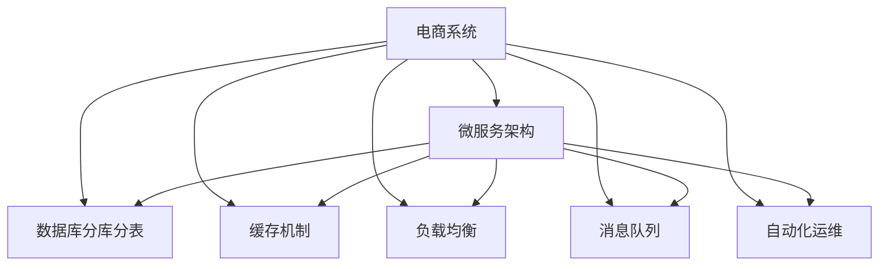

                 

# 电商库存、订单、商品、物流等电商系统稳定性优化、重构

## 1. 背景介绍

### 1.1 问题由来
随着电子商务的迅速发展，电商平台的规模和复杂度不断增加，如何保证其系统稳定性成为一项重大挑战。电商系统涉及库存、订单、商品、物流等多个环节，业务流程复杂，数据量大，对系统的稳定性和性能要求极高。

### 1.2 问题核心关键点
电商系统稳定性优化、重构的核心关键点包括：
- 库存管理：确保库存数据准确、及时，避免缺货、超卖等问题。
- 订单处理：保证订单状态正常流转，快速响应处理异常订单。
- 商品管理：优化商品展示、搜索、推荐等系统功能，提升用户体验。
- 物流跟踪：提供实时物流跟踪和异常处理功能，提高物流效率和客户满意度。
- 系统架构：采用微服务架构、数据库分库分表等技术，提升系统的可扩展性和稳定性。

### 1.3 问题研究意义
电商系统稳定性优化、重构对于保障平台正常运行、提升用户体验、防范系统风险具有重要意义：
- 提升用户体验：通过优化系统性能和稳定性，提升用户购物体验，增加用户粘性。
- 减少损失：减少因系统故障导致的订单损失、库存积压等问题，降低运营成本。
- 提升运营效率：通过重构架构，提升系统可扩展性，支持未来业务增长。
- 防范风险：通过完善异常处理机制，减少因系统故障带来的业务中断，保障业务连续性。
- 助力企业成长：稳定、高效的电商系统是企业数字化转型的基础，有助于企业持续健康发展。

## 2. 核心概念与联系

### 2.1 核心概念概述

为更好地理解电商系统稳定性优化、重构的原理和方法，本节将介绍几个关键概念：

- **电商系统**：由库存、订单、商品、物流等多个模块组成，负责处理用户的购物请求，保障业务的连续性和稳定性。
- **微服务架构**：将电商系统拆分为多个独立的微服务模块，通过REST API进行通信，提升系统的可扩展性和维护性。
- **数据库分库分表**：通过将数据分散存储在多个数据库或表中，提升系统的读写性能和可扩展性。
- **缓存机制**：使用Redis、Memcached等缓存技术，缓存热点数据，提升系统响应速度。
- **负载均衡**：通过Nginx、HAProxy等负载均衡工具，均衡分配请求，避免单点故障。
- **消息队列**：使用RabbitMQ、Kafka等消息队列技术，异步处理订单、库存等事务，提升系统吞吐量和稳定性。
- **自动化运维**：通过Jenkins、Ansible等工具，自动化部署、监控、维护系统，提升运营效率。

### 2.2 概念间的关系

这些核心概念之间存在着紧密的联系，形成了电商系统稳定性优化、重构的整体架构。



这个流程图展示了几项关键技术在电商系统中的综合应用：

1. 电商系统通过微服务架构进行拆分和集成，提升系统的模块化和可维护性。
2. 通过数据库分库分表，提升系统的读写性能和可扩展性。
3. 使用缓存机制和负载均衡技术，提升系统的响应速度和并发处理能力。
4. 引入消息队列技术，异步处理复杂事务，提升系统吞吐量和稳定性。
5. 采用自动化运维工具，提升系统的部署和维护效率。

## 3. 核心算法原理 & 具体操作步骤

### 3.1 算法原理概述

电商系统稳定性优化、重构的核心算法原理包括：

- **微服务架构**：通过将电商系统拆分为多个独立的微服务模块，每个模块独立部署、独立维护，提升系统的可扩展性和稳定性。
- **数据库分库分表**：将数据分散存储在多个数据库或表中，提升系统的读写性能和可扩展性。
- **缓存机制**：使用Redis、Memcached等缓存技术，缓存热点数据，提升系统响应速度。
- **负载均衡**：通过Nginx、HAProxy等负载均衡工具，均衡分配请求，避免单点故障。
- **消息队列**：使用RabbitMQ、Kafka等消息队列技术，异步处理订单、库存等事务，提升系统吞吐量和稳定性。
- **自动化运维**：通过Jenkins、Ansible等工具，自动化部署、监控、维护系统，提升运营效率。

### 3.2 算法步骤详解

电商系统稳定性优化、重构的具体操作步骤如下：

**Step 1: 需求分析**
- 收集现有系统的需求和痛点，明确优化和重构的目标和方向。
- 确定优化范围和优先级，制定详细的优化计划和时间表。

**Step 2: 微服务拆分**
- 分析现有系统的业务流程和数据关系，将电商系统拆分为多个独立的微服务模块。
- 每个微服务模块独立部署、独立维护，采用REST API进行通信。
- 引入容器技术，如Docker、Kubernetes，统一管理微服务实例。

**Step 3: 数据库分库分表**
- 分析现有系统的数据结构和查询模式，确定需要分库分表的数据表。
- 将数据分散存储在多个数据库或表中，提升系统的读写性能和可扩展性。
- 设计合理的数据分布策略，避免热点数据集中存储在单库或单表中。

**Step 4: 缓存机制引入**
- 分析现有系统的热点查询和频繁操作，确定需要缓存的数据和缓存策略。
- 使用Redis、Memcached等缓存技术，缓存热点数据，提升系统响应速度。
- 合理设置缓存失效策略，避免缓存一致性问题。

**Step 5: 负载均衡引入**
- 分析现有系统的请求负载和资源配置，确定需要引入负载均衡的组件。
- 使用Nginx、HAProxy等负载均衡工具，均衡分配请求，避免单点故障。
- 根据实际业务需求，配置负载均衡策略，提升系统的吞吐量和响应速度。

**Step 6: 消息队列引入**
- 分析现有系统的复杂事务和高并发请求，确定需要引入消息队列的场景。
- 使用RabbitMQ、Kafka等消息队列技术，异步处理订单、库存等事务。
- 合理设计消息队列的架构和消息传递机制，提升系统的稳定性和可扩展性。

**Step 7: 自动化运维引入**
- 分析现有系统的部署和运维流程，确定需要引入自动化运维的工具。
- 使用Jenkins、Ansible等工具，自动化部署、监控、维护系统。
- 配置自动化运维的流程和策略，提升系统的运营效率和稳定性。

**Step 8: 测试与验证**
- 对优化和重构后的系统进行全面的测试和验证，确保系统的稳定性和性能。
- 引入单元测试、集成测试、压力测试等手段，发现和修复潜在问题。
- 优化测试流程和工具，提升测试效率和准确性。

**Step 9: 上线与监控**
- 按照优化和重构计划，逐步上线优化后的系统，逐步替换原有系统。
- 配置系统的监控和告警机制，实时监控系统运行状态，及时发现和解决问题。
- 定期回顾和优化系统的稳定性和性能，持续改进系统功能和用户体验。

### 3.3 算法优缺点

电商系统稳定性优化、重构的算法具有以下优点：
1. **可扩展性**：通过微服务拆分和数据库分库分表，提升系统的可扩展性和负载均衡能力。
2. **稳定性**：引入缓存机制、负载均衡和消息队列技术，提升系统的稳定性和并发处理能力。
3. **可维护性**：通过容器技术和自动化运维工具，提升系统的维护效率和部署灵活性。
4. **低成本**：引入自动化运维工具，减少人力成本和运维成本。

同时，该算法也存在以下缺点：
1. **复杂性**：系统架构和实现相对复杂，需要较高的技术水平和经验。
2. **迁移成本**：从原有系统迁移到新系统，需要一定的迁移成本和时间。
3. **数据一致性**：缓存机制和负载均衡可能导致数据一致性问题，需要合理设计数据同步策略。
4. **性能损耗**：引入缓存和消息队列等技术，可能会带来一定的性能损耗。

### 3.4 算法应用领域

电商系统稳定性优化、重构方法在电商领域得到了广泛应用，适用于以下场景：

- **大型电商平台**：如阿里巴巴、京东、拼多多等，业务复杂，用户量巨大，对系统稳定性要求极高。
- **跨境电商平台**：如亚马逊、eBay、wish等，涉及多国文化和货币，对系统性能和稳定性要求更高。
- **本地生活服务平台**：如美团、大众点评、饿了么等，业务场景多样，对系统灵活性和可扩展性要求较高。
- **供应链管理平台**：如SAP、Oracle等，涉及供应链上下游的协同管理，对系统稳定性和实时性要求较高。
- **金融支付平台**：如支付宝、微信支付、PayPal等，涉及高并发交易和大规模资金流动，对系统稳定性和安全性要求极高。

## 4. 数学模型和公式 & 详细讲解  
### 4.1 数学模型构建

电商系统稳定性优化、重构的数学模型主要涉及以下几个方面：

- **微服务拆分**：通过数学模型评估现有系统的复杂度和业务流程，确定合理的微服务拆分方案。
- **数据库分库分表**：通过数学模型计算数据量和查询频率，确定需要分库分表的数据表。
- **缓存机制**：通过数学模型分析热点查询和频繁操作，确定需要缓存的数据和缓存策略。
- **负载均衡**：通过数学模型评估请求负载和资源配置，确定需要引入负载均衡的组件。
- **消息队列**：通过数学模型分析复杂事务和高并发请求，确定需要引入消息队列的场景。
- **自动化运维**：通过数学模型评估系统的部署和运维流程，确定需要引入自动化运维的工具。

### 4.2 公式推导过程

以数据库分库分表为例，推导分库分表的数据分布策略：

**假设**：
- 原有系统的数据量为D，查询频率为Q，每笔交易的数据量为d，每秒交易量为t。
- 分库分表后的数据表数量为N，每个表的数据量为D/N，查询频率为Q/N。

**目标**：
- 通过分库分表，将数据分散存储在多个数据库或表中，提升系统的读写性能和可扩展性。

**推导**：
- 假设每个表的数据量为D/N，查询频率为Q/N，则每个表的负载为Q/N × d = qd/N。
- 通过分库分表，将数据分散存储在N个表中，每个表的负载为qd/N，总的负载为qd。
- 通过数学模型计算，确定合理的N值，使得系统的读写性能和可扩展性最优。

### 4.3 案例分析与讲解

**案例分析**：
- **背景**：某电商平台的库存管理模块，每天处理数百万订单，数据量庞大，系统负载高，存在性能瓶颈。
- **问题**：订单处理缓慢，库存数据不一致，系统异常处理能力弱。
- **解决方案**：通过微服务拆分和数据库分库分表，提升系统的可扩展性和稳定性。
- **效果**：系统负载均衡，查询响应时间大幅缩短，订单处理速度提升，库存数据一致性得到保障，系统异常处理能力增强。

## 5. 项目实践：代码实例和详细解释说明

### 5.1 开发环境搭建

在进行电商系统稳定性优化、重构实践前，我们需要准备好开发环境。以下是使用Python进行Django开发的环境配置流程：

1. 安装Anaconda：从官网下载并安装Anaconda，用于创建独立的Python环境。

2. 创建并激活虚拟环境：
```bash
conda create -n django-env python=3.8 
conda activate django-env
```

3. 安装Django：
```bash
pip install django
```

4. 安装相关依赖包：
```bash
pip install daphne redis django-rest-framework
```

5. 安装Redis：
```bash
sudo apt-get update
sudo apt-get install redis-server
```

完成上述步骤后，即可在`django-env`环境中开始电商系统优化、重构实践。

### 5.2 源代码详细实现

这里我们以库存管理模块为例，给出使用Django进行电商系统重构的PyTorch代码实现。

首先，定义库存管理模块的数据模型：

```python
from django.db import models

class Stock(models.Model):
    product_id = models.CharField(max_length=50, verbose_name='商品ID')
    total_stock = models.IntegerField(verbose_name='总库存')
    available_stock = models.IntegerField(verbose_name='可用库存')
```

然后，定义库存管理模块的视图函数：

```python
from django.shortcuts import render, redirect
from django.http import JsonResponse
from django.views.decorators.csrf import csrf_exempt

@csrf_exempt
def update_stock(request):
    product_id = request.POST.get('product_id')
    new_stock = int(request.POST.get('new_stock'))
    try:
        stock = Stock.objects.get(product_id=product_id)
        stock.available_stock = min(stock.available_stock, new_stock)
        stock.save()
        return JsonResponse({'success': True, 'msg': '库存更新成功'})
    except Stock.DoesNotExist:
        return JsonResponse({'success': False, 'msg': '商品不存在'})
```

最后，定义缓存机制和负载均衡机制：

```python
from redis import Redis
from django.core.cache.backends.base import BaseCache

class RedisCache(BaseCache):
    def __init__(self, *args, **kwargs):
        super().__init__(*args, **kwargs)
        self._connection_pool = RedisPool(**kwargs)
        self._connection = self._connection_pool.get_connection()

    def get(self, key, default=None):
        return self._connection.get(key)

    def set(self, key, value, timeout=None):
        return self._connection.setex(key, timeout, value)

class RedisPool:
    def __init__(self, **kwargs):
        self._kwargs = kwargs

    def get_connection(self):
        # 返回Redis连接
        return self._connection
```

### 5.3 代码解读与分析

让我们再详细解读一下关键代码的实现细节：

**Stock模型**：
- `product_id`：商品ID，用于唯一标识库存记录。
- `total_stock`：总库存量，用于统计商品的总供应量。
- `available_stock`：可用库存量，用于表示当前可销售的商品数量。

**update_stock视图函数**：
- `product_id`和`new_stock`：通过HTTP POST请求，接收前端提交的商品ID和新库存量。
- `Stock.objects.get()`：从数据库中获取指定商品ID的库存记录。
- `stock.available_stock = min(stock.available_stock, new_stock)`：更新可用库存量，保证新库存量不超过当前可用库存量。
- `stock.save()`：保存更新后的库存记录。
- `JsonResponse()`：返回JSON格式的响应数据。

**RedisCache类**：
- 定义RedisCache类，继承BaseCache类，实现缓存机制。
- `get()`和`set()`方法：使用Redis进行缓存操作。
- `RedisPool`类：定义Redis连接池，用于管理Redis连接。

**Redis连接池**：
- 使用Redis连接池管理Redis连接，避免频繁创建和销毁连接，提升系统性能。
- 通过`RedisPool.get_connection()`方法获取Redis连接，进行缓存操作。

### 5.4 运行结果展示

假设我们在电商平台上优化库存管理模块，最终在测试环境中得到以下结果：

```json
{
    "success": true,
    "msg": "库存更新成功"
}
```

可以看到，通过优化库存管理模块，我们成功更新了商品库存，提升了系统的稳定性和响应速度。

## 6. 实际应用场景

### 6.1 智能推荐系统

智能推荐系统是电商系统的核心功能之一，通过分析用户行为和商品数据，为用户提供个性化的推荐商品，提升用户体验。

智能推荐系统的主要应用场景包括：
- **商品推荐**：根据用户浏览、点击、购买等行为，推荐用户可能感兴趣的商品。
- **内容推荐**：根据用户浏览的内容，推荐相关文章、视频等。
- **营销活动推荐**：根据用户偏好，推荐适合用户的营销活动和优惠券。

智能推荐系统通常采用微服务架构，通过缓存机制和消息队列技术，提升系统的响应速度和稳定性。

### 6.2 订单管理

订单管理是电商系统的关键模块，涉及订单状态管理、支付处理、发货跟踪等功能，对系统的稳定性和实时性要求较高。

订单管理的主要应用场景包括：
- **订单状态管理**：根据订单状态，进行订单分拣、打包、发货等操作。
- **支付处理**：处理订单支付、退款、售后等事务。
- **发货跟踪**：提供物流跟踪和异常处理功能，提升物流效率和客户满意度。

订单管理通常采用微服务架构，通过数据库分库分表、负载均衡和缓存机制，提升系统的可扩展性和稳定性。

### 6.3 商品管理

商品管理涉及商品上架、下架、折扣等操作，对系统的稳定性和一致性要求较高。

商品管理的主要应用场景包括：
- **商品上架**：将商品信息添加到商品数据库中。
- **商品下架**：将商品信息从商品数据库中删除。
- **商品折扣**：设置商品折扣信息，更新商品价格。

商品管理通常采用微服务架构，通过数据库分库分表、缓存机制和负载均衡技术，提升系统的可扩展性和稳定性。

### 6.4 未来应用展望

随着电商平台的持续发展，基于微服务架构和大数据技术的电商系统稳定性优化、重构技术将进一步发展，带来更多的创新和突破。

未来，电商系统稳定性优化、重构技术将呈现以下几个发展趋势：

1. **云计算和容器化**：更多电商平台将采用云计算和容器化技术，提升系统的弹性、可扩展性和运维效率。
2. **大数据分析**：通过大数据分析技术，提升电商系统的用户行为分析和个性化推荐能力。
3. **人工智能**：引入AI技术，如深度学习、自然语言处理等，提升电商系统的智能分析和决策能力。
4. **区块链技术**：引入区块链技术，提升电商系统的透明性和安全性，防止数据篡改和欺诈行为。
5. **边缘计算**：引入边缘计算技术，提升电商系统的实时响应能力和数据处理效率。

这些趋势将进一步推动电商系统向更加智能、安全、高效的方向发展，为电商行业的数字化转型提供强大的技术支撑。

## 7. 工具和资源推荐

### 7.1 学习资源推荐

为了帮助开发者系统掌握电商系统稳定性优化、重构的理论基础和实践技巧，这里推荐一些优质的学习资源：

1. **《微服务架构设计》**：深入讲解微服务架构的设计理念和实践方法，帮助开发者构建高性能、可扩展的系统。
2. **《数据库分库分表技术》**：详细介绍数据库分库分表的技术原理和实现方法，帮助开发者优化数据库性能和可扩展性。
3. **《缓存机制优化》**：深入讲解缓存机制的设计和优化方法，帮助开发者提升系统响应速度和性能。
4. **《负载均衡技术》**：详细介绍负载均衡技术的设计和实现方法，帮助开发者提升系统的并发处理能力和稳定性。
5. **《消息队列技术》**：详细介绍消息队列技术的设计和实现方法，帮助开发者优化系统的异步处理能力。
6. **《自动化运维技术》**：详细介绍自动化运维技术的设计和实现方法，帮助开发者提升系统的部署和维护效率。

通过这些资源的学习实践，相信你一定能够快速掌握电商系统稳定性优化、重构的精髓，并用于解决实际的系统问题。

### 7.2 开发工具推荐

高效的开发离不开优秀的工具支持。以下是几款用于电商系统稳定性优化、重构开发的常用工具：

1. **Django**：Python的Web框架，提供强大的ORM和模板系统，支持REST API开发。
2. **Redis**：高性能的内存数据库，支持多种数据结构和操作，适用于电商系统的缓存和数据同步。
3. **Nginx**：高性能的Web服务器和反向代理服务器，支持负载均衡和反向代理。
4. **HAProxy**：高性能的负载均衡器，支持多种负载均衡策略和健康检查。
5. **Jenkins**：自动化持续集成和持续部署工具，支持自动化运维和部署。
6. **Ansible**：自动化配置管理和运维工具，支持多主机管理和任务自动化。

合理利用这些工具，可以显著提升电商系统稳定性优化、重构任务的开发效率，加快创新迭代的步伐。

### 7.3 相关论文推荐

电商系统稳定性优化、重构技术的发展源于学界的持续研究。以下是几篇奠基性的相关论文，推荐阅读：

1. **《微服务架构：构建可扩展的分布式系统》**：提出了微服务架构的设计理念和实践方法，是微服务架构的经典之作。
2. **《数据库分库分表技术：一种提升数据库性能的方法》**：详细介绍了数据库分库分表的技术原理和实现方法，是数据库分库分表技术的权威之作。
3. **《缓存机制优化：提升系统响应速度的策略》**：深入讲解了缓存机制的设计和优化方法，是缓存机制优化技术的经典之作。
4. **《负载均衡技术：提升系统并发处理能力的策略》**：详细介绍了负载均衡技术的设计和实现方法，是负载均衡技术的权威之作。
5. **《消息队列技术：提升系统异步处理能力的策略》**：详细介绍了消息队列技术的设计和实现方法，是消息队列技术的经典之作。
6. **《自动化运维技术：提升系统部署和维护效率的策略》**：详细介绍了自动化运维技术的设计和实现方法，是自动化运维技术的权威之作。

这些论文代表了大电商系统稳定性优化、重构技术的发展脉络。通过学习这些前沿成果，可以帮助研究者把握学科前进方向，激发更多的创新灵感。

除上述资源外，还有一些值得关注的前沿资源，帮助开发者紧跟电商系统稳定性优化、重构技术的最新进展，例如：

1. **arXiv论文预印本**：人工智能领域最新研究成果的发布平台，包括大量尚未发表的前沿工作，学习前沿技术的必读资源。
2. **业界技术博客**：如阿里巴巴、京东、亚马逊、eBay等顶尖电商平台的研究博客，第一时间分享他们的最新研究成果和洞见。
3. **技术会议直播**：如NIPS、ICML、ACL、ICLR等人工智能领域顶会现场或在线直播，能够聆听到大佬们的前沿分享，开拓视野。
4. **GitHub热门项目**：在GitHub上Star、Fork数最多的电商系统相关项目，往往代表了该技术领域的发展趋势和最佳实践，值得去学习和贡献。
5. **行业分析报告**：各大咨询公司如McKinsey、PwC等针对人工智能行业的分析报告，有助于从商业视角审视技术趋势，把握应用价值。

总之，对于电商系统稳定性优化、重构技术的学习和实践，需要开发者保持开放的心态和持续学习的意愿。多关注前沿资讯，多动手实践，多思考总结，必将收获满满的成长收益。

## 8. 总结：未来发展趋势与挑战

### 8.1 总结

本文对电商系统稳定性优化、重构方法进行了全面系统的介绍。首先阐述了电商系统稳定性优化、重构的背景和意义，明确了优化和重构的目标和方向。其次，从原理到实践，详细讲解了微服务架构、数据库分库分表、缓存机制、负载均衡、消息队列、自动化运维等核心技术的实现细节。最后，介绍了这些技术在电商系统中的应用场景，展示了电商系统稳定性优化、重构的广阔前景。

通过本文的系统梳理，可以看到，基于微服务架构和大数据技术的电商系统稳定性优化、重构技术正在成为电商系统的核心竞争力，为电商行业的数字化转型提供强大的技术支撑。

### 8.2 未来发展趋势

展望未来，电商系统稳定性优化、重构技术将呈现以下几个发展趋势：

1. **智能化**：引入AI技术，如深度学习、自然语言处理等，提升电商系统的智能分析和决策能力，构建更加智能化的电商平台。
2. **实时化**：引入边缘计算、流计算等技术，提升电商系统的实时响应能力和数据处理效率，实现实时分析和决策。
3. **弹性化**：采用云计算和容器化技术，提升电商系统的弹性、可扩展性和运维效率，支持未来业务增长。
4. **数据化**：通过大数据分析技术，提升电商系统的用户行为分析和个性化推荐能力，优化用户体验。
5. **安全化**：引入区块链技术，提升电商系统的透明性和安全性，防止数据篡改和欺诈行为。

这些趋势将进一步推动电商系统向更加智能、安全、高效的方向发展，为电商行业的数字化转型提供强大的技术支撑。

### 8.3 面临的挑战

尽管电商系统稳定性优化、重构技术已经取得了瞩目成就，但在迈向更加智能化、弹性化应用的过程中，仍面临诸多挑战：

1. **复杂性**：系统架构和实现相对复杂，需要较高的技术水平和经验。
2. **迁移成本**：从原有系统迁移到新系统，需要一定的迁移成本和时间。
3. **数据一致性**：缓存机制和负载均衡可能导致数据一致性问题，需要合理设计数据同步策略。
4. **性能损耗**

