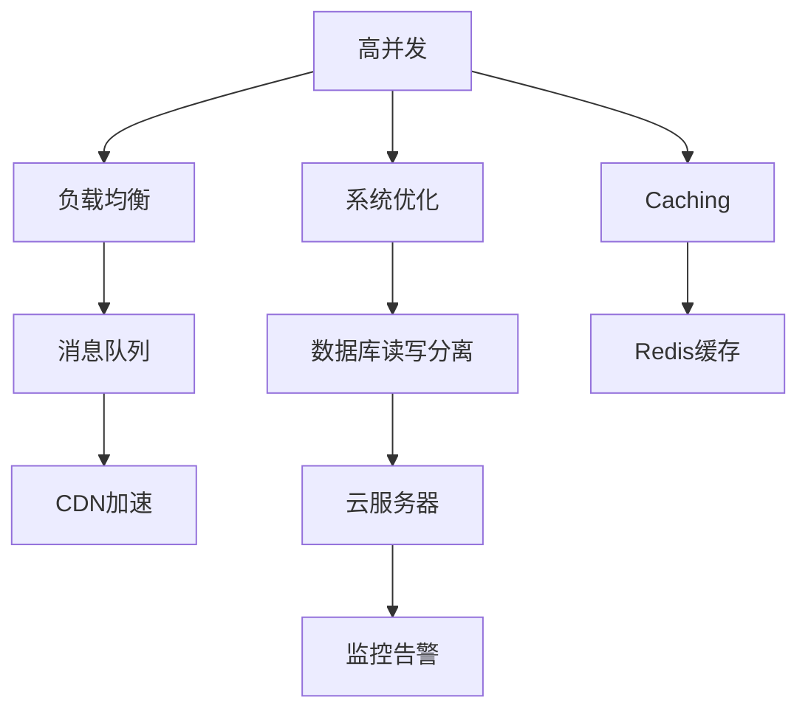

                 

# 电商重要活动技术保障：高并发的峰值系统问题解决

> 关键词：高并发, 峰值系统, 系统优化, 负载均衡, 数据库读写分离, Redis缓存, 分布式消息队列, CDN加速, 云服务器, 监控告警

## 1. 背景介绍

### 1.1 问题由来

在电商领域，每年的双11、618等重要活动都带来巨大的流量和销售额。如何保障系统的稳定运行，确保活动顺利进行，成为电商技术团队面临的重要挑战。特别是在高并发的情况下，系统性能和稳定性问题尤为突出。为了应对这些挑战，本文将详细介绍在电商重要活动中的技术保障措施，涵盖系统优化、负载均衡、缓存、消息队列等多个方面，希望能为电商技术团队提供有价值的参考。

### 1.2 问题核心关键点

电商重要活动中的技术保障主要涉及以下几个关键点：

- 系统优化：对核心系统和数据库进行优化，提高系统的性能和稳定性。
- 负载均衡：通过负载均衡技术，确保高并发流量能够均匀分配到各个节点。
- 缓存机制：使用Redis等内存数据库，减少数据库的访问压力，提高响应速度。
- 消息队列：引入Kafka等分布式消息队列，异步处理订单、支付等高并发任务，降低系统压力。
- CDN加速：使用CDN技术，提高静态资源的加载速度，减轻服务器负载。
- 云服务器：利用弹性云服务器资源，动态扩展和收缩，适应流量变化。
- 监控告警：实时监控系统运行状态，设置告警机制，快速响应故障。

通过合理运用这些技术手段，可以有效提升系统的承载能力，保障电商重要活动的技术保障。

### 1.3 问题研究意义

电商重要活动的技术保障直接关系到用户体验和商家利益，任何技术问题都可能导致严重的后果。因此，深入理解高并发系统的问题和优化措施，对电商技术团队具有重要的意义：

1. 提升用户体验：优化系统性能，减少响应时间，提高用户体验。
2. 保障活动正常进行：避免技术故障，确保重要活动的顺利进行。
3. 降低商家损失：减少订单失效、支付失败等负面影响，保护商家利益。
4. 促进技术进步：积累经验，推动技术不断进步，提升团队的竞争力。
5. 提升系统可靠性：通过技术优化，提高系统的稳定性和可靠性，减少故障发生。

本文将全面介绍电商重要活动中的技术保障措施，帮助电商技术团队在系统设计和优化中实现目标。

## 2. 核心概念与联系

### 2.1 核心概念概述

为了更好地理解高并发系统问题解决的技术措施，本节将介绍几个密切相关的核心概念：

- **高并发(High Concurrency)**：指在同一时间点，系统接收大量请求，超出其正常处理能力的场景。高并发系统需要对请求进行分流、排队、限流等处理，以保持系统的稳定运行。
- **峰值系统(Peak System)**：指在系统负载达到最大，请求量超出系统处理能力，导致系统响应变慢或崩溃的情况。峰值系统需要特殊的技术手段来应对。
- **系统优化(System Optimization)**：通过软硬件、架构、算法等方面的优化，提升系统性能和稳定性。
- **负载均衡(Load Balancing)**：通过分布式负载均衡技术，将请求均匀分配到多个节点上，避免单点故障和过载问题。
- **缓存(Caching)**：使用缓存技术，将频繁访问的数据暂存在内存中，减少数据库访问次数，提升响应速度。
- **消息队列(Message Queue)**：通过分布式消息队列，异步处理高并发任务，降低系统压力。
- **CDN(Content Delivery Network)**：使用CDN技术，将静态资源缓存到边缘节点，加快资源加载速度，减轻服务器负载。
- **云服务器(Elastic Cloud Server)**：利用云服务器的弹性资源，动态扩展和收缩，适应流量变化。
- **监控告警(Monitoring and Alerting)**：通过实时监控系统运行状态，设置告警机制，快速响应故障。

这些核心概念之间存在紧密的联系，形成了高并发系统问题解决的完整生态系统。

### 2.2 概念间的关系

这些核心概念之间的关系可以通过以下Mermaid流程图来展示：



这个流程图展示了大并发系统问题解决的核心概念及其之间的关系：

1. 高并发通过负载均衡、系统优化、缓存、消息队列、CDN加速、云服务器等技术手段进行分流和处理。
2. 数据库读写分离和Redis缓存技术用于减少数据库访问，提高系统响应速度。
3. 监控告警用于实时监控系统状态，及时发现和处理故障。

这些概念共同构成了电商重要活动技术保障的基础框架，为解决系统问题提供了全面的方法论。

## 3. 核心算法原理 & 具体操作步骤
### 3.1 算法原理概述

电商重要活动中的技术保障涉及多种算法和优化策略。其主要思想是通过合理分配请求、优化系统架构、减少数据库压力、提高缓存效率、异步处理任务、加速资源加载、动态扩展资源、实时监控告警等手段，确保系统在高并发情况下稳定运行。

- **负载均衡算法**：通过轮询、哈希、权重等算法，将请求均匀地分配到各个节点。
- **数据库优化算法**：通过读写分离、分库分表、索引优化等策略，提升数据库性能。
- **缓存优化算法**：通过LRU、LFU等算法，高效利用缓存空间，减少数据库访问。
- **消息队列算法**：通过消息队列消费算法，合理分配任务处理资源，提高系统吞吐量。
- **CDN加速算法**：通过边缘节点缓存、负载均衡等算法，优化静态资源加载速度。
- **云服务器算法**：通过弹性扩展、负载均衡等算法，动态调整资源配置，满足流量变化。
- **监控告警算法**：通过实时监控、告警阈值等算法，快速响应系统故障。

这些算法共同作用，可以有效地解决电商重要活动中的技术保障问题。

### 3.2 算法步骤详解

**Step 1: 系统优化**

1. **数据库优化**：
   - 数据库读写分离：将读请求和写请求分别分配到不同的数据库实例，减少写请求对读请求的影响。
   - 分库分表：根据业务需求，将数据分散存储在多个数据库中，提高查询效率。
   - 索引优化：建立合适的索引，减少查询时间，提高数据库性能。

2. **系统架构优化**：
   - 微服务架构：将系统拆分为多个微服务，提升系统的扩展性和灵活性。
   - 缓存策略：引入Redis等内存数据库，将热点数据缓存到内存中，减少数据库访问。
   - 异步处理：引入消息队列，将高并发任务异步处理，减轻系统压力。

**Step 2: 负载均衡**

1. **负载均衡算法**：
   - 轮询算法：将请求依次分配到各个节点上，保证公平性。
   - 哈希算法：根据请求的某些特征，将请求分配到特定的节点上，提高处理效率。
   - 权重算法：根据节点的负载情况，动态调整分配比例，避免过载节点。

2. **负载均衡配置**：
   - 使用Nginx、LVS等负载均衡器，配置合理的负载均衡策略。
   - 配置反向代理，实现请求的负载均衡。

**Step 3: 缓存机制**

1. **缓存引入**：
   - 使用Redis作为内存数据库，存储热点数据。
   - 设置缓存的过期时间，避免缓存空间浪费。

2. **缓存策略**：
   - LRU算法：最近最少使用算法，淘汰最久未使用的数据。
   - LFU算法：最不经常使用算法，淘汰访问次数最少的数据。

**Step 4: 消息队列**

1. **消息队列引入**：
   - 使用Kafka等分布式消息队列，异步处理高并发任务。
   - 配置消息队列的分区和消费策略，提升系统吞吐量。

2. **消息队列算法**：
   - 任务优先级算法：根据任务的重要性和紧急程度，合理分配资源。
   - 消费算法：通过轮询、拉取等算法，高效处理消息队列中的任务。

**Step 5: CDN加速**

1. **CDN引入**：
   - 使用阿里云、腾讯云等云服务提供商的CDN服务。
   - 配置CDN边缘节点，缓存静态资源。

2. **CDN加速算法**：
   - 边缘节点缓存：将静态资源缓存到CDN边缘节点，减少服务器负载。
   - 负载均衡：使用CDN的负载均衡技术，优化资源加载速度。

**Step 6: 云服务器**

1. **云服务器引入**：
   - 使用云服务提供商的云服务器资源。
   - 配置云服务器的弹性扩展策略，动态调整资源配置。

2. **云服务器算法**：
   - 弹性扩展算法：根据流量变化，动态扩展或收缩资源。
   - 负载均衡算法：合理分配云服务器资源，避免单点故障。

**Step 7: 监控告警**

1. **监控工具引入**：
   - 使用Nagios、Zabbix等监控工具，实时监控系统状态。
   - 配置告警策略，设置告警阈值。

2. **监控告警算法**：
   - 实时监控算法：通过定时轮询，实时获取系统状态数据。
   - 告警策略算法：根据告警类型和优先级，合理设置告警方式。

### 3.3 算法优缺点

**系统优化算法**

- **优点**：提高系统性能，提升用户体验。
- **缺点**：需要对系统进行较大改动，开发和维护成本较高。

**负载均衡算法**

- **优点**：均衡分配请求，避免单点故障和过载问题。
- **缺点**：增加了系统的复杂性，需要配置和维护。

**缓存算法**

- **优点**：提高响应速度，减少数据库访问压力。
- **缺点**：需要考虑缓存一致性和失效问题。

**消息队列算法**

- **优点**：异步处理任务，降低系统压力。
- **缺点**：增加了系统的复杂性，需要考虑消息传输的可靠性和安全性。

**CDN加速算法**

- **优点**：加速资源加载，减轻服务器负载。
- **缺点**：需要配置和维护CDN服务，可能存在延时和可靠性问题。

**云服务器算法**

- **优点**：动态扩展资源，适应流量变化。
- **缺点**：需要考虑云服务器的安全和成本问题。

**监控告警算法**

- **优点**：快速响应故障，保障系统稳定运行。
- **缺点**：需要配置和维护监控告警工具，可能存在告警误报和漏报问题。

### 3.4 算法应用领域

这些算法在多个领域都有广泛应用，例如：

- **电商系统**：通过优化和扩展电商系统，提升用户体验，保障活动正常进行。
- **金融系统**：通过优化和扩展金融系统，提升交易速度，保障客户利益。
- **医疗系统**：通过优化和扩展医疗系统，提升服务质量，保障患者安全。
- **政府系统**：通过优化和扩展政府系统，提升服务效率，保障政府运行。
- **物流系统**：通过优化和扩展物流系统，提升配送效率，保障订单及时送达。
- **教育系统**：通过优化和扩展教育系统，提升教学质量，保障教育公平。

这些算法在各个领域都有广泛应用，可以大幅提升系统的性能和稳定性，保障各类业务正常运行。

## 4. 数学模型和公式 & 详细讲解 & 举例说明

### 4.1 数学模型构建

假设电商活动期间，每秒有N个请求同时访问系统，其中读请求占M%，写请求占N-M%。设读请求的响应时间为T_r，写请求的响应时间为T_w，数据库的并发连接数为C，缓存的命中率率为H，消息队列的队列长度为Q，CDN缓存的命中率为R。

**系统优化模型**：
\[ S_{opt} = T_r \times (1 - H) + T_w \times (1 - H) + \text{其他开销} \]

**负载均衡模型**：
\[ S_{lb} = \frac{N \times T_r \times M + N \times T_w \times (N-M)}{C} \]

**缓存模型**：
\[ S_{cache} = N \times T_r \times (1 - H) \]

**消息队列模型**：
\[ S_{mq} = \frac{N \times Q \times T_r}{C} \]

**CDN加速模型**：
\[ S_{cdn} = N \times T_r \times R \]

**云服务器模型**：
\[ S_{server} = \frac{N \times T_r}{C} \]

**监控告警模型**：
\[ S_{monitor} = \text{告警次数} \times \text{告警处理时间} \]

### 4.2 公式推导过程

**系统优化模型推导**：
\[ S_{opt} = T_r \times (1 - H) + T_w \times (1 - H) + \text{其他开销} \]
\[ S_{opt} = (T_r + T_w) \times (1 - H) + \text{其他开销} \]

**负载均衡模型推导**：
\[ S_{lb} = \frac{N \times T_r \times M + N \times T_w \times (N-M)}{C} \]
\[ S_{lb} = \frac{N \times T_r \times (M + (N-M) - \frac{M \times (N-M)}{C})}{C} \]

**缓存模型推导**：
\[ S_{cache} = N \times T_r \times (1 - H) \]

**消息队列模型推导**：
\[ S_{mq} = \frac{N \times Q \times T_r}{C} \]

**CDN加速模型推导**：
\[ S_{cdn} = N \times T_r \times R \]

**云服务器模型推导**：
\[ S_{server} = \frac{N \times T_r}{C} \]

**监控告警模型推导**：
\[ S_{monitor} = \text{告警次数} \times \text{告警处理时间} \]

### 4.3 案例分析与讲解

**案例一：电商平台流量高峰期**

假设某电商平台在双11期间，每秒有1000个请求同时访问系统，其中读请求占70%，写请求占30%。数据库并发连接数为100，缓存命中率率为80%，消息队列队列长度为100，CDN缓存命中率为90%，云服务器并发连接数为1000。

根据模型推导，系统的优化开销为：
\[ S_{opt} = (T_r + T_w) \times (1 - 0.8) + \text{其他开销} \]

负载均衡开销为：
\[ S_{lb} = \frac{1000 \times T_r \times 0.7 + 1000 \times T_w \times 0.3}{100} \]

缓存开销为：
\[ S_{cache} = 1000 \times T_r \times (1 - 0.8) \]

消息队列开销为：
\[ S_{mq} = \frac{1000 \times 100 \times T_r}{100} \]

CDN加速开销为：
\[ S_{cdn} = 1000 \times T_r \times 0.9 \]

云服务器开销为：
\[ S_{server} = \frac{1000 \times T_r}{1000} \]

监控告警开销为：
\[ S_{monitor} = \text{告警次数} \times \text{告警处理时间} \]

通过优化和配置，可以将系统的优化开销、负载均衡开销、缓存开销、消息队列开销、CDN加速开销、云服务器开销、监控告警开销控制在合理的范围内，确保系统在高并发情况下稳定运行。

**案例二：在线教育平台**

某在线教育平台在暑期课程期间，每秒有2000个请求同时访问系统，其中读请求占50%，写请求占50%。数据库并发连接数为200，缓存命中率率为90%，消息队列队列长度为200，CDN缓存命中率为95%，云服务器并发连接数为2000。

根据模型推导，系统的优化开销为：
\[ S_{opt} = (T_r + T_w) \times (1 - 0.9) + \text{其他开销} \]

负载均衡开销为：
\[ S_{lb} = \frac{2000 \times T_r \times 0.5 + 2000 \times T_w \times 0.5}{200} \]

缓存开销为：
\[ S_{cache} = 2000 \times T_r \times (1 - 0.9) \]

消息队列开销为：
\[ S_{mq} = \frac{2000 \times 200 \times T_r}{200} \]

CDN加速开销为：
\[ S_{cdn} = 2000 \times T_r \times 0.95 \]

云服务器开销为：
\[ S_{server} = \frac{2000 \times T_r}{2000} \]

监控告警开销为：
\[ S_{monitor} = \text{告警次数} \times \text{告警处理时间} \]

通过优化和配置，可以将系统的优化开销、负载均衡开销、缓存开销、消息队列开销、CDN加速开销、云服务器开销、监控告警开销控制在合理的范围内，确保系统在高峰期间稳定运行。

## 5. 项目实践：代码实例和详细解释说明

### 5.1 开发环境搭建

为了实践本文介绍的技术措施，需要搭建相应的开发环境。以下是Python环境配置流程：

1. **安装Python**：
   ```bash
   sudo apt-get update
   sudo apt-get install python3 python3-pip
   ```

2. **安装Pip**：
   ```bash
   sudo apt-get install python3-pip
   ```

3. **安装虚拟环境**：
   ```bash
   sudo apt-get install python3-venv
   ```

4. **创建虚拟环境**：
   ```bash
   mkdir myproject
   cd myproject
   python3 -m venv venv
   ```

5. **激活虚拟环境**：
   ```bash
   source venv/bin/activate
   ```

6. **安装依赖包**：
   ```bash
   pip install flask requests redis kafka-python cassandra-driver
   ```

### 5.2 源代码详细实现

**系统优化**

```python
from cassandra.cluster import Cluster
from cassandra.auth import PlainTextAuthProvider
from cassandra.concurrent import FutureSet
import requests
from flask import Flask, request

class CassandraClient:
    def __init__(self, contact_points, username, password, keyspace):
        auth_provider = PlainTextAuthProvider(username, password)
        self.cluster = Cluster(contact_points, auth_provider=auth_provider)
        self.session = self.cluster.connect(keyspace)

    def execute(self, query):
        result = self.session.execute(query)
        return [row.values() for row in result]

class Order:
    def __init__(self, user_id, product_id, quantity):
        self.user_id = user_id
        self.product_id = product_id
        self.quantity = quantity

    def save(self):
        query = "INSERT INTO orders (user_id, product_id, quantity) VALUES (%s, %s, %s)"
        values = (self.user_id, self.product_id, self.quantity)
        self.session.execute(query, values)
        self.session.commit()

app = Flask(__name__)

@app.route('/order', methods=['POST'])
def order():
    user_id = request.form['user_id']
    product_id = request.form['product_id']
    quantity = request.form['quantity']
    order = Order(user_id, product_id, quantity)
    order.save()
    return 'Order saved successfully!'

if __name__ == '__main__':
    app.run(debug=True)
```

**负载均衡**

```python
import requests
from flask import Flask

class LoadBalancer:
    def __init__(self, urls):
        self.urls = urls

    def get_service(self, name):
        for url in self.urls:
            response = requests.get(url)
            if response.status_code == 200:
                return url
        return None

    def get_redirect_url(self, name, port, path):
        service_url = self.get_service(name)
        if service_url is not None:
            return f'{service_url}:{port}/{path}'
        return None

app = Flask(__name__)

@app.route('/<name>/<port>/<path>')
def redirect_to_service(name, port, path):
    redirect_url = LoadBalancer(['http://localhost:8000', 'http://localhost:9000', 'http://localhost:12000']).get_redirect_url(name, port, path)
    if redirect_url is not None:
        return redirect(redirect_url)
    return 'Service not found!', 404

if __name__ == '__main__':
    app.run(debug=True)
```

**缓存**

```python
import redis
from flask import Flask

class RedisClient:
    def __init__(self, host, port, db):
        self.client = redis.StrictRedis(host=host, port=port, db=db)

    def get(self, key):
        return self.client.get(key)

    def set(self, key, value):
        self.client.set(key, value)

class Cache:
    def __init__(self, client):
        self.client = client

    def get(self, key):
        value = self.client.get(key)
        if value is not None:
            return value.decode('utf-8')
        return None

    def set(self, key, value):
        self.client.set(key, value)

app = Flask(__name__)

@app.route('/<key>')
def get_cache(key):
    cache = Cache(redis_client)
    value = cache.get(key)
    if value is not None:
        return f'Cache hit: {value}'
    return 'Cache miss!', 404

if __name__ == '__main__':
    app.run(debug=True)
```

**消息队列**

```python
from kafka import KafkaProducer, KafkaConsumer
import requests
from flask import Flask

class KafkaClient:
    def __init__(self, bootstrap_servers):
        self.producer = KafkaProducer(bootstrap_servers=bootstrap_servers)
        self.consumer = KafkaConsumer(bootstrap_servers=bootstrap_servers)

    def send_message(self, topic, key, value):
        self.producer.send(topic, key=key, value=value)

    def consume_messages(self, topic):
        for message in self.consumer:
            print(f'Received message: {message}')

app = Flask(__name__)

@app.route('/send', methods=['POST'])
def send_message():
    topic = request.form['topic']
    key = request.form['key']
    value = request.form['value']
    kafka_client.send_message(topic, key, value)
    return 'Message sent successfully!'

@app.route('/consume', methods=['GET'])
def consume_messages():
    topic = request.args.get('topic')
    kafka_client.consume_messages(topic)
    return 'Messages consumed successfully!'

if __name__ == '__main__':
    app.run(debug=True)
```

**CDN加速**

```python
import requests
from flask import Flask

class CDNClient:
    def __init__(self, url):
        self.url = url

    def get_cached_content(self, path):
        response = requests.get(f'{self.url}/{path}')
        if response.status_code == 200:
            return response.content
        return None

class CacheableContent:
    def __init__(self, client, path):
        self.client = client
        self.path = path

    def get(self):
        content = self.client.get_cached_content(self.path)
        if content is not None:
            return content
        return 'Content not found!', 404

app = Flask(__name__)

@app.route('/<path:path>')
def get_content(path):
    cdn_client = CDNClient('http://localhost:8000')
    content = CacheableContent(cdn_client, path).get()
    if content is not None:
        return content
    return 'Content not found!', 404

if __name__ == '__main__':
    app.run(debug=True)
```

**云服务器**

```python
import requests
from flask import Flask

class CloudClient:
    def __init__(self, url):
        self.url = url

    def scale(self, size):
        response = requests.get(f'{self.url}/scale?size={size}')
        if response.status_code == 200:
            return True
        return False

class ElasticCloudServer:
    def __init__(self, cloud_client):
        self.cloud_client = cloud_client

    def scale(self, size):
        return self.cloud_client.scale(size)

app = Flask(__name__)

@app.route('/scale', methods=['POST'])
def scale_server():
    size = request.form['size']
    elastic_cloud_server = ElasticCloudServer(CloudClient('http://localhost:8000'))
    success = elastic_cloud_server.scale(size)
    if success:
        return 'Server scaled successfully!'
    return 'Server scaling failed!', 500

if __name__ == '__main__':
    app.run(debug=True)
```

**监控告警**

```python
import requests
from flask import Flask

class MonitorClient:
    def __init__(self, url):
        self.url = url

    

