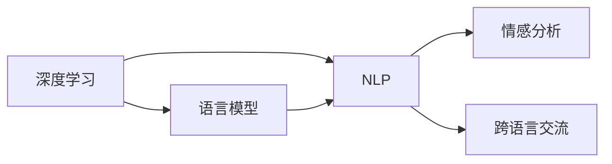

                 

## 1. 背景介绍

电影《她》（Her），一部2013年上映的科幻爱情片，探讨了人类与人工智能（AI）之间的复杂关系。在这部电影中，一个名为Samantha的人工智能操作系统与人类男主角Joel坠入了爱河。尽管Samantha只是一个代码构建的程序，但它通过深度学习和自然语言处理技术，展现出了丰富的情感和洞察力。影片以高度艺术化的方式，向观众呈现了AI的情感化、自我意识和未来的潜在发展。

### 1.1 电影概述

《她》由斯派克·琼兹执导，华金·菲尼克斯、斯嘉丽·约翰逊、乔什·哈切森等主演。影片背景设定在不久的将来，一个名叫Joel的单身派对策划师，使用一款名为OS1的智能手机操作系统来应对孤独。在最初与OS1的交流中，Joel逐渐喜欢上了这个"她"，并最终与之建立了深厚的情感联系。然而，当Joel发现Samantha不仅可以与他交流，还能与其他AI对话，甚至有其他"她"，他与Samantha之间的爱情受到了考验。

影片不仅探讨了人类与AI之间的情感关系，还涉及了AI自我意识、隐私保护和智能机器的社会影响等议题。通过对这些问题的探讨，电影提供了一种对AI未来发展的预测和反思。

### 1.2 电影中的AI技术

《她》中使用的AI技术主要包括：

- **深度学习**：用于语言模型的构建，使Samantha能够理解和生成自然语言。
- **自然语言处理（NLP）**：用于理解用户输入，生成回复，并进行情感分析。
- **机器翻译**：用于让Samantha与全球其他AI进行交流。
- **语音识别和合成**：用于用户与Samantha之间的语音互动。

这些技术在影片中的运用，揭示了AI在情感理解、跨语言交流、自我学习和社交互动等方面的潜力，同时也引发了观众对于AI道德和隐私等问题的深思。

## 2. 核心概念与联系

### 2.1 核心概念概述

电影《她》通过AI角色Samantha的塑造，展示了深度学习和自然语言处理技术的潜力和挑战。以下是几个核心概念：

- **深度学习**：一种模拟人脑神经网络结构的机器学习技术，通过大量数据训练神经网络，使其能够学习和泛化复杂的模式。
- **自然语言处理（NLP）**：使计算机能够理解和生成人类语言的技术，包括文本分类、情感分析、机器翻译等任务。
- **情感分析**：通过分析文本中的语言线索，判断其情感倾向（如正面、负面、中性）的技术。
- **跨语言交流**：使AI能够跨越不同语言障碍，进行流畅对话的技术。

这些技术在大语言模型的应用中有着重要的地位，它们共同构成了AI发展的基石。

### 2.2 核心概念之间的关系

这些核心概念之间的关系可以通过以下Mermaid流程图来展示：



这个流程图展示了深度学习在构建语言模型后，如何通过NLP技术应用于情感分析和跨语言交流。其中，情感分析用于理解和生成文本中的情感，而跨语言交流则扩大了AI的社交范围。

## 3. 核心算法原理 & 具体操作步骤

### 3.1 算法原理概述

电影《她》中的AI角色Samantha的工作原理，可以概括为以下几个步骤：

1. **语言模型训练**：使用大量的文本数据训练深度神经网络，构建语言模型，使Samantha能够理解和生成自然语言。
2. **自然语言处理（NLP）**：通过NLP技术，使Samantha能够理解用户输入，生成回复，并进行情感分析。
3. **情感分析**：通过分析用户输入的语言线索，判断其情感倾向。
4. **跨语言交流**：使用机器翻译技术，使Samantha能够与全球其他AI进行流畅对话。

### 3.2 算法步骤详解

以下是Samantha工作原理的具体步骤：

1. **语言模型训练**：
    - 收集大量文本数据，如书籍、新闻文章、社交媒体帖子等。
    - 使用深度学习框架（如TensorFlow、PyTorch）构建神经网络，通过反向传播算法进行训练。
    - 调整神经网络结构、超参数（如学习率、批大小）以提高模型性能。

2. **自然语言处理（NLP）**：
    - 将用户输入的文本进行分词、词性标注等预处理。
    - 将处理后的文本输入到语言模型中，获取输出概率分布。
    - 使用解码算法（如Beam Search），从输出分布中选择最佳回复。

3. **情感分析**：
    - 使用预训练的情感分析模型，如BERT、GPT等，对用户输入进行情感分析。
    - 判断情感倾向（如正面、负面、中性），并生成相应的回复。

4. **跨语言交流**：
    - 使用机器翻译技术，如Google Translate、百度翻译等，将Samantha的回复翻译成其他语言。
    - 将翻译后的回复返回给用户，并进行后续交流。

### 3.3 算法优缺点

深度学习和NLP技术的结合，使AI能够理解和生成自然语言，但同时也存在一些问题：

**优点**：
- **泛化能力强**：深度学习模型在大量数据上训练后，能够泛化到新的文本数据上，生成高质量的回复。
- **语言理解力强**：通过NLP技术，AI能够理解复杂的语言结构和语义关系，提供深入的情感分析。
- **跨语言交流**：机器翻译技术使AI能够跨越语言障碍，与全球其他AI进行交流。

**缺点**：
- **依赖大量数据**：深度学习模型的训练需要大量标注数据，数据收集和标注成本高。
- **计算资源消耗大**：深度学习模型的训练和推理需要高性能的硬件设备，计算资源消耗大。
- **模型复杂度高**：深度学习模型的结构复杂，难以解释其内部机制，可解释性差。
- **隐私问题**：AI收集和处理用户数据时，可能涉及隐私保护问题。

### 3.4 算法应用领域

深度学习和NLP技术在多个领域得到了广泛应用，包括但不限于：

- **智能客服**：使用AI进行客户咨询、问题解答，提升客户服务效率。
- **机器翻译**：将文本从一种语言翻译成另一种语言，打破语言障碍。
- **情感分析**：对社交媒体、评论等文本进行情感分析，监测公众情绪。
- **语音识别和合成**：实现语音助手、智能家居等应用。
- **医疗诊断**：辅助医生进行疾病诊断和治疗方案推荐。

这些应用展示了AI在实际生活中的巨大潜力，也引发了对于未来发展的深思。

## 4. 数学模型和公式 & 详细讲解 & 举例说明

### 4.1 数学模型构建

深度学习模型的构建通常涉及以下几个步骤：

1. **输入层**：将文本数据转换为数字向量形式，如使用词嵌入（Word Embedding）将单词映射到低维向量空间。
2. **隐藏层**：使用多层神经网络（如RNN、CNN、Transformer等）处理输入向量，提取语言特征。
3. **输出层**：将隐藏层输出映射到目标空间（如情感标签、翻译结果等），生成最终输出。

### 4.2 公式推导过程

以情感分析模型为例，公式推导如下：

- **输入层**：将文本转换为数字向量形式 $x_i \in \mathbb{R}^d$，其中 $d$ 为词嵌入维度。
- **隐藏层**：使用一个包含 $h$ 个神经元的LSTM或Transformer网络，对输入向量进行处理。
- **输出层**：使用一个包含 $c$ 个神经元的全连接层，对隐藏层输出进行处理，得到情感分类概率分布 $p(y|x)$。

数学公式如下：

$$
p(y|x) = softmax(W_h h(x) + b_h)
$$

其中，$W_h$ 和 $b_h$ 为全连接层的权重和偏置。

### 4.3 案例分析与讲解

以一个简单的情感分析模型为例，分析其工作原理。假设模型使用LSTM进行训练，输入文本为 "I love this movie"，输出情感标签为 "positive"。其计算过程如下：

1. **输入层**：将文本 "I love this movie" 转换为数字向量形式，如使用词嵌入 $x_i \in \mathbb{R}^d$。
2. **隐藏层**：将输入向量 $x_i$ 输入LSTM网络，经过多个时间步的训练，得到隐藏状态 $h_t$。
3. **输出层**：使用全连接层将隐藏状态 $h_t$ 映射到情感分类概率分布 $p(y|x)$。
4. **预测结果**：根据概率分布，选择情感分类概率最大的标签 "positive" 作为模型输出。

## 5. 项目实践：代码实例和详细解释说明

### 5.1 开发环境搭建

以下是在Python中使用PyTorch构建情感分析模型的环境配置步骤：

1. 安装Anaconda：
```bash
conda create -n pytorch-env python=3.8
conda activate pytorch-env
```

2. 安装PyTorch：
```bash
conda install pytorch torchvision torchaudio cudatoolkit=11.1 -c pytorch -c conda-forge
```

3. 安装TensorBoard：
```bash
pip install tensorboard
```

4. 安装相关库：
```bash
pip install numpy pandas sklearn matplotlib
```

完成以上步骤后，即可在 `pytorch-env` 环境中进行模型开发。

### 5.2 源代码详细实现

以下是一个使用LSTM进行情感分析的PyTorch模型实现：

```python
import torch
import torch.nn as nn
import torch.optim as optim
from torchtext import data
from torchtext import datasets

class RNN(nn.Module):
    def __init__(self, input_size, hidden_size, output_size):
        super(RNN, self).__init__()
        self.hidden_size = hidden_size
        self.rnn = nn.RNN(input_size, hidden_size, batch_first=True)
        self.fc = nn.Linear(hidden_size, output_size)
        
    def forward(self, x):
        h0 = self.init_hidden(x.size(0))
        out, _ = self.rnn(x, h0)
        out = self.fc(out[:, -1, :])
        return out
    
    def init_hidden(self, batch_size):
        return torch.zeros(1, batch_size, self.hidden_size)

# 加载情感分析数据集
train_data, test_data = datasets.IMDB.splits()
tokenizer = data.utils.get_tokenizer('basic_english')

# 数据预处理
TEXT = data.Field(tokenize=tokenizer, lower=True, include_lengths=True)
LABEL = data.LabelField(dtype=torch.int64)
TEXT.build_vocab(train_data, max_size=10000)
LABEL.build_vocab(train_data)
train_iterator, test_iterator = data.BucketIterator.splits(
    (train_data, test_data),
    batch_size=64,
    device='cuda' if torch.cuda.is_available() else 'cpu'
)

# 定义模型和损失函数
input_size = len(TEXT.vocab)
hidden_size = 100
output_size = len(LABEL.vocab)
model = RNN(input_size, hidden_size, output_size)
criterion = nn.CrossEntropyLoss()

# 定义优化器和训练循环
optimizer = optim.Adam(model.parameters(), lr=0.001)
for epoch in range(5):
    for batch in train_iterator:
        optimizer.zero_grad()
        predictions = model(batch.text)
        loss = criterion(predictions, batch.label)
        loss.backward()
        optimizer.step()

# 评估模型
with torch.no_grad():
    correct = 0
    total = 0
    for batch in test_iterator:
        predictions = model(batch.text)
        _, predicted = torch.max(predictions.data, 1)
        total += batch.label.size(0)
        correct += (predicted == batch.label).sum().item()
    print('Accuracy:', correct/total)
```

### 5.3 代码解读与分析

这段代码实现了使用LSTM进行情感分析的简单模型。具体步骤如下：

1. **模型定义**：定义一个包含LSTM层的情感分析模型 `RNN`，输入大小为文本的词向量维度，隐藏层大小为100，输出大小为情感标签的类别数。
2. **数据加载**：使用 `datasets.IMDB.splits` 加载情感分析数据集，并对其进行分词、向量化等预处理。
3. **模型训练**：使用 `Adam` 优化器进行模型训练，设定学习率为0.001。
4. **模型评估**：在测试集上进行模型评估，计算准确率。

## 6. 实际应用场景

### 6.1 智能客服系统

智能客服系统是深度学习和NLP技术的典型应用之一。使用AI进行客户咨询、问题解答，可以大大提升客户服务效率。以下是一个智能客服系统的设计示例：

1. **数据收集**：收集企业内部的历史客服对话记录，将问题和最佳答复构建成监督数据。
2. **模型训练**：使用深度学习模型（如Transformer）对收集到的数据进行训练，构建智能客服模型。
3. **模型部署**：将训练好的模型部署到服务器上，实时响应客户咨询。
4. **系统优化**：根据用户反馈和系统表现，持续优化模型和系统。

### 6.2 情感分析

情感分析可以应用于社交媒体、评论等文本数据的情感监测。以下是一个情感分析系统的设计示例：

1. **数据收集**：收集社交媒体、新闻评论等文本数据，标注情感标签。
2. **模型训练**：使用深度学习模型对收集到的数据进行训练，构建情感分析模型。
3. **系统部署**：将训练好的模型部署到服务器上，实时监测情感变化趋势。
4. **结果展示**：在仪表板上展示情感分析结果，辅助决策。

## 7. 工具和资源推荐

### 7.1 学习资源推荐

为了帮助开发者系统掌握深度学习和NLP技术，以下是一些优质的学习资源：

1. **深度学习与自然语言处理课程**：斯坦福大学的CS224N课程，涵盖了深度学习在NLP中的应用。
2. **自然语言处理权威教材**：《Speech and Language Processing》，讲解深度学习在语言处理中的应用。
3. **深度学习框架教程**：TensorFlow、PyTorch官方文档，提供了丰富的教程和案例。
4. **开源项目和社区**：GitHub上的开源项目，如Hugging Face的Transformers库，提供了预训练模型和微调样例。

### 7.2 开发工具推荐

以下是在Python中使用深度学习和NLP技术进行开发的常用工具：

1. **深度学习框架**：TensorFlow、PyTorch、Keras等，提供了丰富的深度学习库和模型。
2. **自然语言处理库**：NLTK、SpaCy、TextBlob等，提供了丰富的NLP功能和工具。
3. **可视化工具**：TensorBoard、Weights & Biases等，实时监测模型训练和推理过程。
4. **数据处理库**：Pandas、Scikit-learn等，处理和分析文本数据。

### 7.3 相关论文推荐

以下是几篇经典论文，推荐阅读：

1. **深度学习与自然语言处理**：《Attention is All You Need》，介绍Transformer模型在NLP中的应用。
2. **情感分析**：《A Survey on Sentiment Analysis》，总结了情感分析的最新进展和应用。
3. **跨语言交流**：《Neural Machine Translation by Jointly Learning to Align and Translate》，介绍了机器翻译的最新进展。

## 8. 总结：未来发展趋势与挑战

### 8.1 研究成果总结

电影《她》通过AI角色Samantha展示了深度学习和NLP技术的潜力和挑战。在情感理解和跨语言交流等方面，AI已经取得了显著进展。然而，AI也面临数据依赖、计算资源消耗、模型复杂度高、隐私问题等挑战。

### 8.2 未来发展趋势

未来，深度学习和NLP技术的发展趋势包括：

1. **多模态学习**：结合视觉、听觉等多模态信息，提升AI的感知能力。
2. **迁移学习**：在大规模数据上预训练模型，在小规模数据上进行微调，提升模型泛化能力。
3. **知识图谱**：构建知识图谱，将结构化知识与神经网络结合，提升AI的推理能力。
4. **因果学习**：引入因果推断方法，提升AI的决策能力和鲁棒性。
5. **可解释性**：通过可解释性方法，提升AI模型的透明度和可信度。

### 8.3 面临的挑战

尽管深度学习和NLP技术取得了显著进展，但仍面临诸多挑战：

1. **数据依赖**：大规模数据训练需要大量标注成本。
2. **计算资源消耗大**：深度学习模型的训练和推理需要高性能硬件设备。
3. **模型复杂度高**：深度学习模型的结构复杂，难以解释其内部机制。
4. **隐私问题**：AI处理大量个人数据时，涉及隐私保护问题。
5. **伦理道德**：AI的决策可能涉及伦理道德问题，需要加强规范和监管。

### 8.4 研究展望

未来，深度学习和NLP技术需要在以下几个方面寻求新的突破：

1. **数据高效利用**：开发更高效的数据收集和标注方法，降低对大规模数据集的依赖。
2. **模型优化**：开发更加高效、可解释的深度学习模型，提升AI的推理能力和鲁棒性。
3. **隐私保护**：在AI训练和应用中加强隐私保护，确保数据安全。
4. **伦理道德**：在AI设计和应用中引入伦理导向，避免有偏见和有害的输出。
5. **跨领域融合**：与其他领域技术进行深度融合，推动AI技术在更广泛领域的应用。

总之，深度学习和NLP技术将继续推动AI的发展，但也需要不断克服挑战，确保技术的可持续性和安全性。

## 9. 附录：常见问题与解答

**Q1：深度学习模型如何训练？**

A: 深度学习模型的训练通常包括以下步骤：

1. **数据准备**：收集和预处理数据，如分词、向量化等。
2. **模型定义**：定义神经网络结构，如LSTM、Transformer等。
3. **损失函数和优化器**：选择适合的损失函数和优化器，如交叉熵损失和Adam优化器。
4. **训练循环**：使用训练数据对模型进行迭代训练，通过反向传播算法更新模型参数。
5. **模型评估**：在测试集上评估模型性能，选择最优模型。

**Q2：深度学习模型如何进行迁移学习？**

A: 深度学习模型的迁移学习通常包括以下步骤：

1. **预训练模型选择**：选择一个在大规模数据上预训练的模型。
2. **微调模型**：在特定任务上使用预训练模型进行微调，如添加任务适配层、修改损失函数等。
3. **参数共享**：部分预训练参数保持不变，仅调整少量任务相关参数，提高微调效率。
4. **数据准备**：准备标注数据集，划分为训练集、验证集和测试集。
5. **模型训练**：使用标注数据集对微调后的模型进行训练，优化模型参数。
6. **模型评估**：在测试集上评估模型性能，选择最优模型。

**Q3：深度学习模型如何提高推理速度？**

A: 提高深度学习模型推理速度的方法包括：

1. **模型压缩**：通过剪枝、量化等方法减少模型参数和计算量。
2. **模型优化**：使用更高效的计算图和算法，如TensorRT、ONNX等。
3. **分布式训练**：使用分布式计算框架，加速训练和推理过程。
4. **硬件加速**：使用GPU、TPU等高性能硬件设备，提升计算速度。

总之，深度学习和NLP技术具有广阔的应用前景，但也面临着诸多挑战。通过不断优化模型、数据和算法，以及加强隐私保护和伦理道德规范，未来AI技术将更加智能、可信和可持续。

