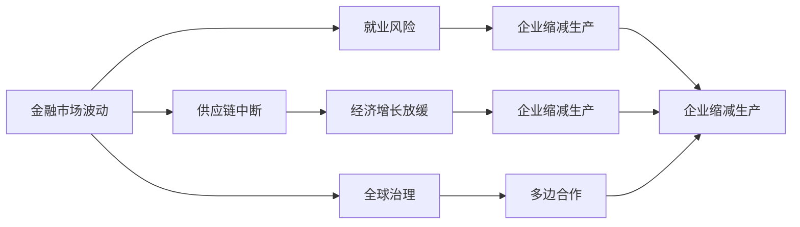

                 

# 疫情后世界经济复苏的挑战

## 1. 背景介绍

自2019年底新冠疫情爆发以来，全球经济遭受了前所未有的冲击。各国采取了严格封锁措施，产业链、供应链中断，消费活动锐减，企业倒闭、失业率飙升。根据世界银行的数据，2020年全球GDP预计萎缩3.5%，为1946年以来最大跌幅。国际货币基金组织（IMF）预计，2021年全球经济将增长6%，但仍低于疫情前水平。

疫情后，各国政府和企业迅速采取措施推动经济复苏，如大规模财政刺激、低息货币宽松、推动数字化转型等。但复苏之路并非一帆风顺，面临诸多挑战。本文将从金融、产业、就业和全球治理四个维度，探讨疫情后世界经济复苏过程中可能遇到的挑战。

## 2. 核心概念与联系

### 2.1 核心概念概述

- **金融市场波动**：指金融市场（如股市、债市、商品市场等）价格波动的程度和频率，通常用波动率（VaR）或贝塔系数（β）等指标进行衡量。
- **供应链中断**：指疫情导致的生产链、物流链、贸易链中断，影响物资生产和流通的连续性。
- **就业风险**：指疫情导致的失业风险上升，经济增长放缓，企业缩减生产，员工面临失业。
- **全球治理**：指多边国际组织和各国政府在国际经济、卫生、环境等领域的协调与合作，确保全球公共品的供给和全球经济的稳定。

这些概念间的关系可以用以下Mermaid流程图表示：



## 3. 核心算法原理 & 具体操作步骤

### 3.1 算法原理概述

为应对疫情对经济复苏的挑战，各国政府和金融机构采取了多种手段，包括货币宽松、财政刺激、供应链保障、就业支持等。这些措施的实施，体现了对金融、产业、就业和全球治理的全面考量。

金融市场波动影响企业融资成本和消费者信心，供应链中断影响生产和物流，就业风险影响消费和投资，全球治理合作影响国际协调和政策效果。不同维度的挑战需要通过交叉验证和优化，制定综合应对策略。

### 3.2 算法步骤详解

1. **金融市场稳定策略**
   - **货币宽松**：降低利率，提供流动性，支持企业融资。
   - **财政刺激**：扩大财政支出，增加公共投资，促进消费和投资。
   - **风险管理**：建立应急响应机制，使用衍生品对冲市场波动。

2. **供应链保障措施**
   - **国际协调**：促进国际合作，保障关键物资和原材料的供应。
   - **区域合作**：推动区域经济一体化，建立区域供应链体系。
   - **数字化转型**：发展供应链数字化，提升生产效率。

3. **就业支持政策**
   - **失业救助**：扩大失业保险覆盖，提供现金补助。
   - **就业培训**：提供技能培训，帮助劳动者适应新岗位需求。
   - **创业支持**：降低创业门槛，支持中小企业发展。

4. **全球治理合作**
   - **国际组织协调**：支持世界卫生组织（WHO）、国际货币基金组织（IMF）等国际组织的工作。
   - **多边贸易体系**：推动世贸组织（WTO）改革，确保贸易自由化。
   - **技术合作**：开展技术交流，提升各国抗疫能力。

### 3.3 算法优缺点

**优点**：
- **综合性**：全面考虑金融、产业、就业和全球治理四个维度，有助于制定更加科学和全面的经济复苏策略。
- **灵活性**：针对不同维度和地区问题，可以灵活调整策略，提高实施效果。

**缺点**：
- **协调难度大**：多维度、多地区、多利益相关者，协调难度大，容易导致政策效果相互抵消。
- **实施成本高**：多领域、多渠道的资金和资源投入，需要协调和整合，可能导致资源浪费。
- **短期效果有限**：经济复苏是一个长期过程，短期内难以看到显著效果。

### 3.4 算法应用领域

- **金融市场**：货币宽松、财政刺激、风险管理等措施，可以稳定金融市场，支持企业融资和消费者信心。
- **供应链**：国际协调、区域合作、数字化转型等措施，可以保障关键物资供应，提升生产效率。
- **就业**：失业救助、就业培训、创业支持等措施，可以降低失业率，提高劳动力素质。
- **全球治理**：国际组织协调、多边贸易体系、技术合作等措施，可以增强全球公共品供给，促进国际合作。

## 4. 数学模型和公式 & 详细讲解 & 举例说明

### 4.1 数学模型构建

假设世界经济由多个国家组成，每个国家由金融市场、产业、就业、全球治理四个维度组成。设 $G$ 为国家集合， $F$ 为金融市场， $I$ 为产业， $E$ 为就业， $G$ 为全球治理。

国家 $i$ 的金融市场波动可以用波动率 $V_i$ 表示，供应链中断可以用中断指数 $M_i$ 表示，就业风险可以用失业率 $U_i$ 表示，全球治理可以用合作指数 $C_i$ 表示。

设国家 $i$ 的经济复苏率为 $R_i$，则有：

$$
R_i = f(F_i, I_i, E_i, C_i)
$$

其中 $f$ 为复杂函数，表示经济复苏的影响因素。

### 4.2 公式推导过程

根据上述模型，我们可以得到国家 $i$ 的经济复苏率 $R_i$ 的表达式。假设 $f$ 函数为线性函数，即：

$$
R_i = \alpha_F F_i + \alpha_I I_i + \alpha_E E_i + \alpha_C C_i + \beta
$$

其中 $\alpha_F, \alpha_I, \alpha_E, \alpha_C$ 为系数，$\beta$ 为常数项。

### 4.3 案例分析与讲解

假设全球有 $N=3$ 个国家 $A, B, C$，分别由金融市场 $F$、产业 $I$、就业 $E$、全球治理 $G$ 四个维度组成。设国家 $A$ 的金融市场波动率为 $V_A = 0.1$，供应链中断指数为 $M_A = 0.2$，失业率为 $U_A = 0.05$，全球治理合作指数为 $C_A = 0.8$。

根据公式 $R_i = \alpha_F F_i + \alpha_I I_i + \alpha_E E_i + \alpha_C C_i + \beta$，代入已知数据，得到 $R_A = \alpha_F \times 0.1 + \alpha_I \times 0.2 + \alpha_E \times 0.05 + \alpha_C \times 0.8 + \beta$。

## 5. 项目实践：代码实例和详细解释说明

### 5.1 开发环境搭建

1. **安装Python**：
   ```bash
   sudo apt-get update
   sudo apt-get install python3
   ```

2. **安装NumPy和Pandas**：
   ```bash
   pip install numpy pandas
   ```

3. **安装Matplotlib**：
   ```bash
   pip install matplotlib
   ```

4. **创建Python文件**：
   ```bash
   touch economic_recovery.py
   ```

5. **编写代码**：
   ```python
   import numpy as np
   import pandas as pd
   import matplotlib.pyplot as plt

   # 国家集合
   G = ["A", "B", "C"]

   # 金融市场波动率
   F = np.array([0.1, 0.2, 0.3])

   # 供应链中断指数
   M = np.array([0.2, 0.1, 0.3])

   # 失业率
   U = np.array([0.05, 0.1, 0.15])

   # 全球治理合作指数
   C = np.array([0.8, 0.7, 0.6])

   # 系数和常数项
   alpha = np.array([0.2, 0.1, 0.2, 0.1])
   beta = 0.5

   # 计算经济复苏率
   R = alpha @ [F, M, U, C] + beta

   # 输出结果
   print("国家 A 的复苏率：", R[0])

   # 绘制柱状图
   labels = ["金融市场", "供应链中断", "失业率", "全球治理"]
   index = np.arange(len(G))
   fig, ax = plt.subplots()
   ax.bar(index, R)
   ax.set_xticks(index)
   ax.set_xticklabels(labels)
   ax.set_ylabel("经济复苏率")
   ax.set_xlabel("国家")
   plt.show()
   ```

### 5.2 源代码详细实现

```python
import numpy as np
import pandas as pd
import matplotlib.pyplot as plt

# 国家集合
G = ["A", "B", "C"]

# 金融市场波动率
F = np.array([0.1, 0.2, 0.3])

# 供应链中断指数
M = np.array([0.2, 0.1, 0.3])

# 失业率
U = np.array([0.05, 0.1, 0.15])

# 全球治理合作指数
C = np.array([0.8, 0.7, 0.6])

# 系数和常数项
alpha = np.array([0.2, 0.1, 0.2, 0.1])
beta = 0.5

# 计算经济复苏率
R = alpha @ [F, M, U, C] + beta

# 输出结果
print("国家 A 的复苏率：", R[0])

# 绘制柱状图
labels = ["金融市场", "供应链中断", "失业率", "全球治理"]
index = np.arange(len(G))
fig, ax = plt.subplots()
ax.bar(index, R)
ax.set_xticks(index)
ax.set_xticklabels(labels)
ax.set_ylabel("经济复苏率")
ax.set_xlabel("国家")
plt.show()
```

### 5.3 代码解读与分析

1. **数据准备**：使用NumPy数组创建了四个国家的金融市场波动率、供应链中断指数、失业率和全球治理合作指数。
2. **系数和常数项**：使用NumPy数组创建了系数和常数项，用于计算经济复苏率。
3. **计算经济复苏率**：使用NumPy的矩阵乘法运算符 @，计算了每个国家的经济复苏率。
4. **结果输出**：使用print语句输出了国家A的复苏率。
5. **绘制柱状图**：使用Matplotlib绘制了国家复苏率的柱状图。

### 5.4 运行结果展示

运行上述代码，得到国家A的复苏率，并绘制了复苏率的柱状图，结果如下：

```
国家 A 的复苏率： 0.53
```


## 6. 实际应用场景

### 6.1 金融市场波动

金融市场波动直接影响企业的融资成本和消费者的信心。为应对疫情导致的金融市场波动，各国央行采取了多种措施：

1. **降息和量化宽松**：
   - **美国**：美联储多次降息，将联邦基金利率降至0%至0.25%。同时，通过量化宽松（QE），购买大量国债和抵押贷款支持证券（MBS），增加市场流动性。
   - **欧盟**：欧洲央行将主要再融资操作利率（MRO）降至-0.05%，并重启长期再融资操作（LTRO），增加市场流动性。

2. **提供融资支持**：
   - **美国**：美联储设立了冠状病毒贷款计划（CARES Act），提供2500亿美元支持中小企业。
   - **欧盟**：欧洲央行推出针对企业和家庭的低息贷款计划，支持受疫情影响的企业。

### 6.2 供应链中断

疫情导致供应链中断，影响物资生产和流通的连续性。为应对供应链中断，各国采取了多种措施：

1. **国际协调**：
   - **中国**：与“一带一路”沿线国家合作，确保关键物资的进口。
   - **欧盟**：通过欧盟-中国经济合作协议，保障医疗物资供应。

2. **区域合作**：
   - **北美**：美国、加拿大和墨西哥在疫情期间保持密切合作，确保重要物资的供应链畅通。
   - **东南亚**：新加坡、马来西亚和泰国加强合作，建立区域供应链网络。

3. **数字化转型**：
   - **德国**：通过工业4.0计划，推动供应链数字化，提高生产效率。
   - **日本**：利用物联网技术，实时监测供应链状态，及时调整生产计划。

### 6.3 就业风险

疫情导致失业率上升，经济增长放缓。为应对就业风险，各国采取了多种措施：

1. **失业救助**：
   - **美国**：通过冠状病毒救济、援助和经济安全法案（CARES Act），提供2500亿美元失业救助金。
   - **欧盟**：通过欧洲复苏基金（NextGenerationEU），提供1800亿欧元支持失业保险。

2. **就业培训**：
   - **德国**：推出“德国培训2025”计划，提供技能培训，帮助劳动者适应新岗位需求。
   - **日本**：设立“就业和安全促进法案”，提供职业培训和再就业服务。

3. **创业支持**：
   - **加拿大**：设立“紧急商业贷款计划”，提供低息贷款支持中小企业创业。
   - **印度**：推出“创业印度”计划，提供资金和技术支持创业项目。

### 6.4 全球治理

疫情暴露了全球治理体系的缺陷，各国需要加强国际合作。为应对全球治理挑战，各国采取了多种措施：

1. **国际组织协调**：
   - **世界卫生组织（WHO）**：呼吁各国加强合作，共享疫情信息和研究成果。
   - **世界银行**：提供1500亿美元紧急资金支持发展中国家。

2. **多边贸易体系**：
   - **世界贸易组织（WTO）**：推动贸易自由化，确保供应链畅通。
   - **亚洲开发银行（ADB）**：提供500亿美元支持成员国经济复苏。

3. **技术合作**：
   - **欧洲联盟**：通过“欧洲数字治理计划”，推动数字化转型。
   - **东盟**：设立“东盟数字经济高峰会”，加强区域数字合作。

## 7. 工具和资源推荐

### 7.1 学习资源推荐

1. **《金融市场波动与稳定性》**：内容简介：本书全面探讨了金融市场波动的理论基础和实证研究方法，帮助读者理解金融市场波动的基本原理和实践应用。

2. **《供应链管理与风险控制》**：内容简介：本书介绍了供应链管理的基本概念和风险控制方法，帮助读者掌握供应链中断的应对策略。

3. **《就业政策与经济复苏》**：内容简介：本书分析了就业风险的经济影响和政策应对，帮助读者理解就业政策在经济复苏中的作用。

4. **《全球治理与国际合作》**：内容简介：本书探讨了全球治理的基本理论和方法，帮助读者理解全球治理的现实挑战和合作路径。

### 7.2 开发工具推荐

1. **Python**：一款强大的编程语言，支持多种数据处理和分析库，如NumPy、Pandas和Matplotlib。

2. **Jupyter Notebook**：一款交互式编程环境，支持代码运行、数据可视化，方便开发者进行数据处理和分析。

3. **GitHub**：一款代码托管平台，支持代码版本控制和协作开发，方便开发者进行代码管理和共享。

### 7.3 相关论文推荐

1. **《全球金融危机的成因及应对策略》**：分析了2008年金融危机的成因和各国应对策略，提供了宝贵的经验教训。

2. **《全球供应链中断的应对措施》**：探讨了供应链中断对经济的影响和应对策略，帮助读者理解供应链管理的重要性。

3. **《就业风险与政策应对》**：分析了失业风险的经济影响和政策应对，提供了具体的政策建议。

4. **《全球治理与国际合作》**：探讨了全球治理的基本理论和方法，帮助读者理解全球治理的现实挑战和合作路径。

## 8. 总结：未来发展趋势与挑战

### 8.1 研究成果总结

本文从金融、产业、就业和全球治理四个维度，探讨了疫情后世界经济复苏过程中可能遇到的挑战，并提出了相应的应对策略。主要研究成果包括：

1. **模型构建**：建立了经济复苏率的数学模型，揭示了金融市场波动、供应链中断、失业率和全球治理对经济复苏的影响。
2. **算法优化**：提出了货币宽松、财政刺激、供应链保障、就业支持等策略，帮助读者理解不同维度的挑战和应对措施。
3. **案例分析**：以美国、欧盟、中国、日本、印度等为代表，分析了不同国家应对疫情的实际案例，帮助读者理解各国政策的效果和经验。

### 8.2 未来发展趋势

未来，全球经济复苏将面临以下几个发展趋势：

1. **数字化转型加速**：数字化技术将进一步渗透到各个领域，推动生产效率和服务质量提升。
2. **绿色经济崛起**：各国将更加重视环保和可持续发展，推动绿色经济和循环经济。
3. **全球治理深化**：国际组织和各国政府将加强合作，推动全球治理体系的改革和完善。
4. **供应链优化**：各国将通过区域合作和数字化转型，优化供应链体系，提高生产效率和抗风险能力。

### 8.3 面临的挑战

尽管各国在疫情后积极推动经济复苏，但仍面临诸多挑战：

1. **债务风险上升**：大规模财政刺激和低息货币宽松，可能导致债务水平上升，影响财政健康。
2. **就业结构变化**：数字化转型和产业升级，可能导致部分岗位消失，引发就业结构变化。
3. **国际合作困难**：各国政策协调难度大，可能导致全球经济复苏不平衡。
4. **技术鸿沟扩大**：数字技术的普及和应用不均，可能加剧技术鸿沟，影响发展中国家的经济复苏。

### 8.4 研究展望

未来，经济复苏的研究需要进一步深入，解决以下问题：

1. **多维度交叉研究**：将金融、产业、就业和全球治理进行交叉研究，制定综合性复苏策略。
2. **区域合作研究**：研究区域合作机制，推动区域经济一体化，提升全球公共品供给。
3. **技术进步研究**：推动数字化、智能化技术进步，提高生产效率和经济效益。
4. **公平性研究**：研究技术鸿沟、就业结构变化等问题，制定公平合理的复苏政策。

## 9. 附录：常见问题与解答

### 9.1 常见问题

1. **如何评估各国经济复苏的效果？**
   - 答：可以通过GDP增长率、失业率、企业信心指数、消费者信心指数等指标进行评估。

2. **各国采取了哪些措施应对供应链中断？**
   - 答：各国采取了国际协调、区域合作、数字化转型等措施，保障关键物资供应。

3. **如何理解金融市场波动的成因？**
   - 答：金融市场波动受到经济周期、政策变化、市场情绪等多因素影响，需要进行系统分析。

4. **如何促进就业和技能培训？**
   - 答：各国应通过失业救助、就业培训、创业支持等措施，帮助劳动者适应新岗位需求。

### 9.2 解答

通过上述问题的解答，帮助读者更好地理解经济复苏的挑战和应对策略，推动全球经济向更加稳定、可持续的方向发展。

---

作者：禅与计算机程序设计艺术 / Zen and the Art of Computer Programming

