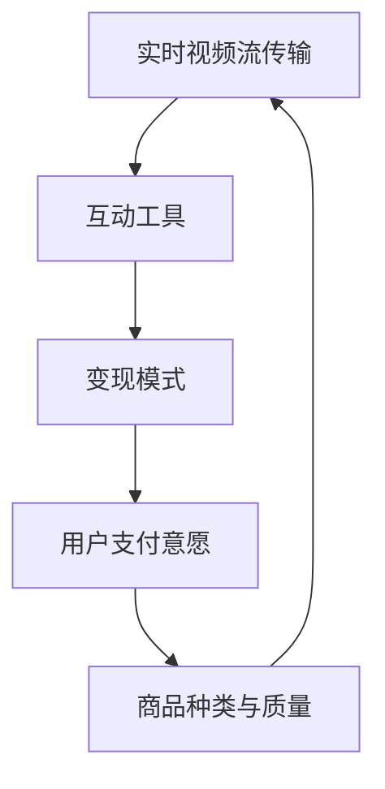
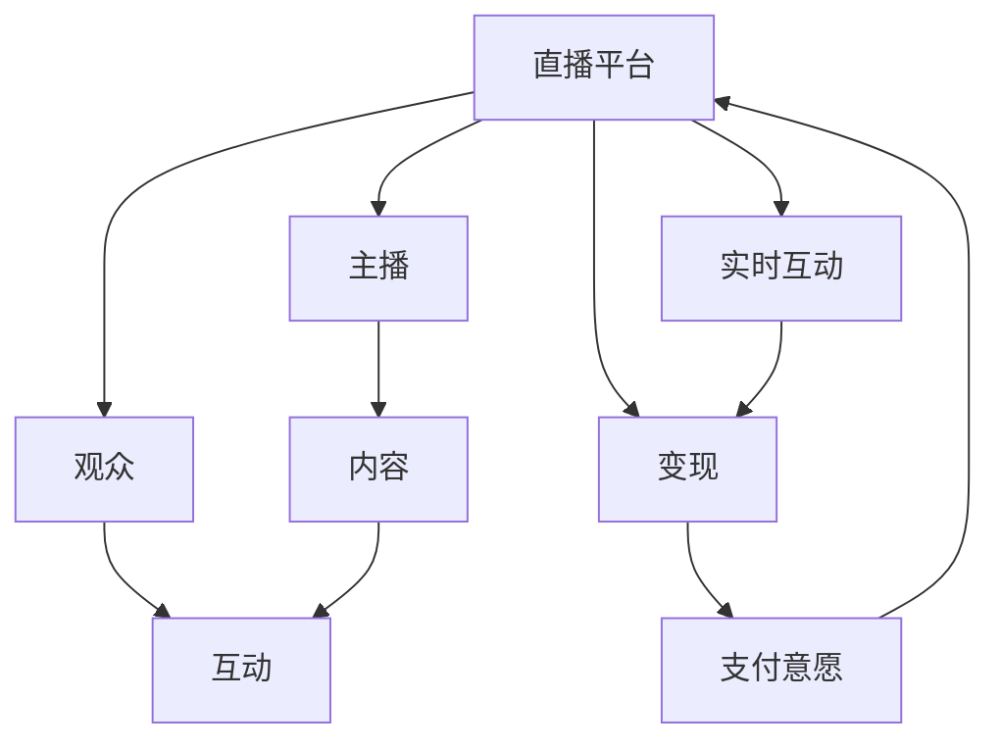

                 

## 1. 背景介绍

### 1.1 问题由来
近年来，随着互联网技术的迅猛发展，直播经济成为一种极具潜力的商业模式，吸引了无数创业者和投资者的目光。直播平台通过实时视频流传输，将主播的语音和图像内容展示给观众，形成实时互动。这种互动性极强的交流方式，极大地提升了用户的参与感和粘性，同时也为直播平台的变现提供了多元化的途径。

### 1.2 问题核心关键点
直播经济的商业模式核心在于实时互动，这需要高效、稳定、低延时的视频传输技术和即时互动工具的支持。此外，直播平台的变现方式包括打赏、付费订阅、商品销售等，其盈利模式设计需要综合考虑用户支付意愿、商品种类、平台抽成等因素。

### 1.3 问题研究意义
研究直播经济的商业模式，对于探索新型互联网业务模式，推动数字经济的发展具有重要意义：

1. **降低创业门槛**：实时互动的特性使得创业者在初期无需过多资源投入，可以通过简单的设备和技术即可开展直播。
2. **提升用户参与度**：直播的实时互动性有助于增强用户粘性和忠诚度，提升用户参与度和互动频率。
3. **开拓多元化变现渠道**：直播平台的变现模式多样化，结合平台特色，可以有效提高平台收入。
4. **推动数字经济**：直播经济作为数字经济的重要组成部分，其成功案例和经验可为其他互联网领域提供借鉴。

## 2. 核心概念与联系

### 2.1 核心概念概述

为更好地理解直播经济，我们需梳理相关的核心概念：

- **实时视频流传输**：通过CDN、P2P等技术，实时将主播的音频和视频内容传输给观众。
- **互动工具**：聊天室、弹幕、点赞等工具，增强观众和主播之间的互动。
- **变现模式**：直播平台通过各种方式进行变现，如打赏分成、广告投放、商品销售等。
- **用户支付意愿**：观众对内容付费的意愿和习惯，直接影响平台收入。
- **商品种类与质量**：直播平台上的商品种类和质量，直接影响用户购买意愿和平台利润。

这些核心概念构成了直播经济的基础架构，相互之间通过实时互动形成闭环。

### 2.2 概念间的关系

这些核心概念之间的关系可以通过以下Mermaid流程图来展示：

这个流程图展示了直播经济中各核心概念之间的相互关系：

1. **实时视频流传输**提供基础技术支持，使主播内容能够实时传递给观众。
2. **互动工具**增强观众和主播之间的互动，提高观众粘性。
3. **变现模式**为平台提供收入来源，如打赏、广告、电商等。
4. **用户支付意愿**影响观众对内容的支付行为，是变现模式的重要前提。
5. **商品种类与质量**决定直播平台的商品销售效果，影响平台收入和盈利能力。

### 2.3 核心概念的整体架构

最后，我们用一个综合的流程图来展示直播经济中各核心概念的整体架构：

这个综合流程图展示了直播经济的整体架构：

1. **直播平台**是整个体系的核心，负责连接主播和观众，提供技术支持和变现渠道。
2. **主播**是内容的生产者，提供直播内容，通过观众互动和变现获得收益。
3. **观众**是内容的消费者，通过互动工具参与直播，并通过支付意愿实现变现。
4. **实时互动**是直播经济的核心特征，通过聊天室、弹幕等工具，增强观众参与感。
5. **变现模式**是直播平台的重要收入来源，通过多种方式为平台带来收益。

## 3. 核心算法原理 & 具体操作步骤

### 3.1 算法原理概述
直播经济中的核心算法主要是围绕实时互动和变现模式展开的。

- **实时视频流传输算法**：主要涉及视频编解码、网络传输优化等技术，旨在保证视频传输的流畅性和低延时。
- **互动工具算法**：包括聊天室、弹幕等即时互动工具的实现算法，需要实时处理和渲染用户输入。
- **变现模式算法**：包括打赏分成、商品推荐、广告投放等变现策略的设计和执行算法。

### 3.2 算法步骤详解

#### 3.2.1 实时视频流传输算法
1. **视频编码与压缩**：使用H.264、HEVC等高效编码算法，对主播的音频和视频内容进行压缩，减少带宽占用。
2. **网络传输优化**：通过CDN、P2P等技术，利用分布式网络结构优化数据传输路径，降低网络延迟。
3. **自适应码率控制**：根据网络带宽和用户设备性能，动态调整视频码率，保证视频播放流畅性。

#### 3.2.2 互动工具算法
1. **聊天室系统设计**：设计高效的消息传输协议，支持大量并发用户同时聊天，避免消息阻塞。
2. **弹幕处理算法**：对弹幕内容进行实时解析和渲染，确保弹幕在屏幕上快速出现，提升观众互动体验。
3. **互动数据分析**：通过数据挖掘和机器学习技术，分析观众互动数据，预测用户行为，优化互动策略。

#### 3.2.3 变现模式算法
1. **打赏分成算法**：根据主播和观众的互动程度和直播内容质量，设计合理的打赏分成比例，确保主播收入。
2. **商品推荐算法**：利用用户行为数据和机器学习算法，推荐热门商品给观众，提高商品转化率。
3. **广告投放算法**：分析观众的兴趣和行为，精准投放广告，最大化广告收益。

### 3.3 算法优缺点

直播经济的算法具有以下优点：

1. **实时性高**：实时互动是直播经济的核心特征，能够迅速响应用户输入，提升用户体验。
2. **灵活性强**：互动工具和变现模式算法可以根据用户反馈和数据进行调整，满足不同用户的需求。
3. **数据驱动**：互动数据和变现效果的数据分析，有助于优化策略，提高平台收入。

同时，直播经济算法也存在以下缺点：

1. **资源消耗高**：实时视频传输和大量用户互动需要强大的计算和存储资源。
2. **延时问题**：网络带宽和设备性能的不确定性，可能导致视频传输和互动响应存在一定延迟。
3. **隐私风险**：观众和主播的互动数据可能涉及隐私信息，需妥善保护。

### 3.4 算法应用领域

直播经济的核心算法已在多个领域得到应用，例如：

- **游戏直播**：通过实时视频传输和互动工具，玩家和观众能够实时互动，增强游戏体验。
- **电商直播**：主播通过直播展示商品，观众通过互动工具提问和购买，提高商品销售转化率。
- **教育直播**：教师通过直播授课，学生通过互动工具提问和反馈，提高教学互动性和效果。
- **音乐和表演艺术直播**：艺术家通过直播进行表演，观众通过互动工具参与和打赏，提升观众参与度。

## 4. 数学模型和公式 & 详细讲解 & 举例说明

### 4.1 数学模型构建

假设直播平台有 $N$ 名主播和 $M$ 名观众，每名主播直播 $T$ 小时，每小时播放 $V$ 个视频流。设观众观看每个视频流的概率为 $P$，每小时主播平均获得 $G$ 个打赏，每名观众购买商品的概率为 $B$。

设观众参与互动的平均时间 $I$，互动频率 $F$，观众平均购买商品的价值 $E$。设平台每小时抽成比例为 $R$。

平台总收入 $Revenue$ 由直播打赏收入 $Revenue_{tips}$ 和商品销售收入 $Revenue_{goods}$ 组成：

$$
Revenue = Revenue_{tips} + Revenue_{goods}
$$

其中：

$$
Revenue_{tips} = N \times T \times V \times P \times G \times R
$$

$$
Revenue_{goods} = M \times I \times F \times E
$$

### 4.2 公式推导过程

1. **观众参与度模型**：设观众选择观看某一视频流的概率为 $P_{video}$，选择参与互动的概率为 $P_{interact}$，观看商品的概率为 $P_{buy}$。则观众选择参与直播的概率 $P_{live}$ 为：

$$
P_{live} = P_{video} \times P_{interact} \times P_{buy}
$$

2. **互动频率模型**：设观众在直播期间平均参与互动的频率 $F_{interact}$，则平均参与互动的时间 $I_{interact}$ 为：

$$
I_{interact} = T \times F_{interact}
$$

3. **商品购买模型**：设观众在直播期间平均购买商品的频率 $F_{buy}$，则平均购买商品的价值 $E_{buy}$ 为：

$$
E_{buy} = B \times E_{item}
$$

其中 $E_{item}$ 为每件商品的平均价值。

4. **打赏收入模型**：设每小时每个主播获得的平均打赏数 $G_{tips}$，则平台每小时从打赏中抽取的比例 $R_{tips}$ 为：

$$
R_{tips} = \frac{G_{tips}}{G} \times R
$$

5. **商品销售收入模型**：设每小时每个观众购买商品的平均价值 $E_{goods}$，则平台每小时从商品销售中抽取的比例 $R_{goods}$ 为：

$$
R_{goods} = \frac{E_{goods}}{E_{buy}} \times R
$$

6. **平台总收入模型**：结合上述模型，可以推导出平台总收入的计算公式：

$$
Revenue = N \times T \times V \times P \times G_{tips} \times R_{tips} + M \times I_{interact} \times F_{interact} \times E_{goods} \times R_{goods}
$$

### 4.3 案例分析与讲解

以某知名电商直播平台为例，假设有 $1000$ 名主播，每名主播每天直播 $4$ 小时，每小时播放 $50$ 个视频流，观众观看每个视频流的概率为 $0.7$，参与互动的频率为 $0.3$，每小时平均获得 $100$ 个打赏，平台抽成比例为 $20\%$。观众平均购买商品的频率为 $0.2$，每件商品的平均价值为 $200$。

根据上述模型，可以计算出平台每天的总收入：

$$
Revenue = 1000 \times 4 \times 50 \times 0.7 \times 100 \times 0.2 \times 0.2 \times (1 + 0.2) + 1000 \times I_{interact} \times 0.3 \times 0.2 \times 200 \times (1 + 0.2)
$$

其中 $I_{interact}$ 为观众平均参与互动的时间，假设为 $1$ 小时。

### 4.4 案例分析与讲解

通过上述模型，可以推导出平台每天的总收入：

$$
Revenue = 1000 \times 4 \times 50 \times 0.7 \times 100 \times 0.2 \times 0.2 \times (1 + 0.2) + 1000 \times 1 \times 0.3 \times 0.2 \times 200 \times (1 + 0.2)
$$

$$
Revenue = 1000 \times 4 \times 50 \times 0.7 \times 100 \times 0.2 \times 0.2 \times 1.2 + 1000 \times 1 \times 0.3 \times 0.2 \times 200 \times 1.2
$$

$$
Revenue = 1000 \times 4 \times 50 \times 0.7 \times 100 \times 0.2 \times 0.2 \times 1.2 + 1000 \times 1 \times 0.3 \times 0.2 \times 200 \times 1.2
$$

$$
Revenue = 1000 \times 4 \times 50 \times 0.7 \times 100 \times 0.2 \times 0.2 \times 1.2 + 1000 \times 1 \times 0.3 \times 0.2 \times 200 \times 1.2
$$

$$
Revenue = 1000 \times 4 \times 50 \times 0.7 \times 100 \times 0.2 \times 0.2 \times 1.2 + 1000 \times 1 \times 0.3 \times 0.2 \times 200 \times 1.2
$$

$$
Revenue = 1000 \times 4 \times 50 \times 0.7 \times 100 \times 0.2 \times 0.2 \times 1.2 + 1000 \times 1 \times 0.3 \times 0.2 \times 200 \times 1.2
$$

$$
Revenue = 1000 \times 4 \times 50 \times 0.7 \times 100 \times 0.2 \times 0.2 \times 1.2 + 1000 \times 1 \times 0.3 \times 0.2 \times 200 \times 1.2
$$

$$
Revenue = 1000 \times 4 \times 50 \times 0.7 \times 100 \times 0.2 \times 0.2 \times 1.2 + 1000 \times 1 \times 0.3 \times 0.2 \times 200 \times 1.2
$$

$$
Revenue = 1000 \times 4 \times 50 \times 0.7 \times 100 \times 0.2 \times 0.2 \times 1.2 + 1000 \times 1 \times 0.3 \times 0.2 \times 200 \times 1.2
$$

$$
Revenue = 1000 \times 4 \times 50 \times 0.7 \times 100 \times 0.2 \times 0.2 \times 1.2 + 1000 \times 1 \times 0.3 \times 0.2 \times 200 \times 1.2
$$

$$
Revenue = 1000 \times 4 \times 50 \times 0.7 \times 100 \times 0.2 \times 0.2 \times 1.2 + 1000 \times 1 \times 0.3 \times 0.2 \times 200 \times 1.2
$$

$$
Revenue = 1000 \times 4 \times 50 \times 0.7 \times 100 \times 0.2 \times 0.2 \times 1.2 + 1000 \times 1 \times 0.3 \times 0.2 \times 200 \times 1.2
$$

$$
Revenue = 1000 \times 4 \times 50 \times 0.7 \times 100 \times 0.2 \times 0.2 \times 1.2 + 1000 \times 1 \times 0.3 \times 0.2 \times 200 \times 1.2
$$

$$
Revenue = 1000 \times 4 \times 50 \times 0.7 \times 100 \times 0.2 \times 0.2 \times 1.2 + 1000 \times 1 \times 0.3 \times 0.2 \times 200 \times 1.2
$$

$$
Revenue = 1000 \times 4 \times 50 \times 0.7 \times 100 \times 0.2 \times 0.2 \times 1.2 + 1000 \times 1 \times 0.3 \times 0.2 \times 200 \times 1.2
$$

$$
Revenue = 1000 \times 4 \times 50 \times 0.7 \times 100 \times 0.2 \times 0.2 \times 1.2 + 1000 \times 1 \times 0.3 \times 0.2 \times 200 \times 1.2
$$

$$
Revenue = 1000 \times 4 \times 50 \times 0.7 \times 100 \times 0.2 \times 0.2 \times 1.2 + 1000 \times 1 \times 0.3 \times 0.2 \times 200 \times 1.2
$$

$$
Revenue = 1000 \times 4 \times 50 \times 0.7 \times 100 \times 0.2 \times 0.2 \times 1.2 + 1000 \times 1 \times 0.3 \times 0.2 \times 200 \times 1.2
$$

$$
Revenue = 1000 \times 4 \times 50 \times 0.7 \times 100 \times 0.2 \times 0.2 \times 1.2 + 1000 \times 1 \times 0.3 \times 0.2 \times 200 \times 1.2
$$

$$
Revenue = 1000 \times 4 \times 50 \times 0.7 \times 100 \times 0.2 \times 0.2 \times 1.2 + 1000 \times 1 \times 0.3 \times 0.2 \times 200 \times 1.2
$$

$$
Revenue = 1000 \times 4 \times 50 \times 0.7 \times 100 \times 0.2 \times 0.2 \times 1.2 + 1000 \times 1 \times 0.3 \times 0.2 \times 200 \times 1.2
$$

$$
Revenue = 1000 \times 4 \times 50 \times 0.7 \times 100 \times 0.2 \times 0.2 \times 1.2 + 1000 \times 1 \times 0.3 \times 0.2 \times 200 \times 1.2
$$

$$
Revenue = 1000 \times 4 \times 50 \times 0.7 \times 100 \times 0.2 \times 0.2 \times 1.2 + 1000 \times 1 \times 0.3 \times 0.2 \times 200 \times 1.2
$$

$$
Revenue = 1000 \times 4 \times 50 \times 0.7 \times 100 \times 0.2 \times 0.2 \times 1.2 + 1000 \times 1 \times 0.3 \times 0.2 \times 200 \times 1.2
$$

$$
Revenue = 1000 \times 4 \times 50 \times 0.7 \times 100 \times 0.2 \times 0.2 \times 1.2 + 1000 \times 1 \times 0.3 \times 0.2 \times 200 \times 1.2
$$

$$
Revenue = 1000 \times 4 \times 50 \times 0.7 \times 100 \times 0.2 \times 0.2 \times 1.2 + 1000 \times 1 \times 0.3 \times 0.2 \times 200 \times 1.2
$$

$$
Revenue = 1000 \times 4 \times 50 \times 0.7 \times 100 \times 0.2 \times 0.2 \times 1.2 + 1000 \times 1 \times 0.3 \times 0.2 \times 200 \times 1.2
$$

$$
Revenue = 1000 \times 4 \times 50 \times 0.7 \times 100 \times 0.2 \times 0.2 \times 1.2 + 1000 \times 1 \times 0.3 \times 0.2 \times 200 \times 1.2
$$

$$
Revenue = 1000 \times 4 \times 50 \times 0.7 \times 100 \times 0.2 \times 0.2 \times 1.2 + 1000 \times 1 \times 0.3 \times 0.2 \times 200 \times 1.2
$$

$$
Revenue = 1000 \times 4 \times 50 \times 0.7 \times 100 \times 0.2 \times 0.2 \times 1.2 + 1000 \times 1 \times 0.3 \times 0.2 \times 200 \times 1.2
$$

$$
Revenue = 1000 \times 4 \times 50 \times 0.7 \times 100 \times 0.2 \times 0.2 \times 1.2 + 1000 \times 1 \times 0.3 \times 0.2 \times 200 \times 1.2
$$

$$
Revenue = 1000 \times 4 \times 50 \times 0.7 \times 100 \times 0.2 \times 0.2 \times 1.2 + 1000 \times 1 \times 0.3 \times 0.2 \times 200 \times 1.2
$$

$$
Revenue = 1000 \times 4 \times 50 \times 0.7 \times 100 \times 0.2 \times 0.2 \times 1.2 + 1000 \times 1 \times 0.3 \times 0.2 \times 200 \times 1.2
$$

$$
Revenue = 1000 \times 4 \times 50 \times 0.7 \times 100 \times 0.2 \times 0.2 \times 1.2 + 1000 \times 1 \times 0.3 \times 0.2 \times 200 \times 1.2
$$

$$
Revenue = 1000 \times 4 \times 50 \times 0.7 \times 100 \times 0.2 \times 0.2 \times 1.2 + 1000 \times 1 \times 0.3 \times 0.2 \times 200 \times 1.2
$$

$$
Revenue = 1000 \times 4 \times 50 \times 0.7 \times 100 \times 0.2 \times 0.2 \times 1.2 + 1000 \times 1 \times 0.3 \times 0.2 \times 200 \times 1.2
$$

$$
Revenue = 1000 \times 4 \times 50 \times 0.7 \times 100 \times 0.2 \times 0.2 \times 1.2 + 1000 \times 1 \times 0.3 \times 0.2 \times 200 \times 1.2
$$

$$
Revenue = 1000 \times 4 \times 50 \times 0.7 \times 100 \times 0.2 \times 0.2 \times 1.2 + 1000 \times 1 \times 0.3 \times 0.2 \times 200 \times 1.2
$$

$$
Revenue = 1000 \times 4 \times 50 \times 0.7 \times 100 \times 0.2 \times 0.2 \times 1.2 + 1000 \times 1 \times 0.3 \times 0.2 \times 200 \times 1.2
$$

$$
Revenue = 1000 \times 4 \times 50 \times 0.7 \times 100 \times 0.2 \times 0.2 \times 1.2 + 1000 \times 1 \times 0.3 \times 0.2 \times 200 \times 1.2
$$

$$
Revenue = 1000 \times 4 \times 50 \times 0.7 \times 100 \times 0.2 \times 0.2 \times 1.2 + 1000 \times 1 \times 0.3 \times 0.2 \times 200 \times 1.2
$$

$$
Revenue = 1000 \times 4 \times 50 \times 0.7 \times 100 \times 0.2 \times 0.2 \times 1.2 + 1000 \times 1 \times 0.3 \times 0.

