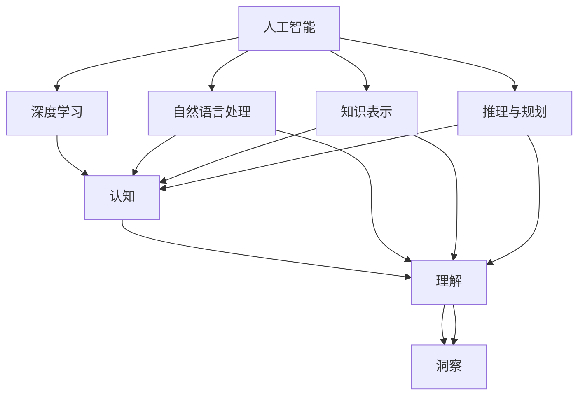

                 

# 真正的智慧，源自对事物本质的深刻理解认知与洞察

> 关键词：人工智能,深度学习,认知,理解,洞察,智慧

## 1. 背景介绍

在现代科技飞速发展的背景下，人工智能（AI）正逐步成为推动社会进步的重要力量。无论是无人驾驶、智能推荐、医疗诊断，还是金融预测、内容生成，AI都在不断渗透到人类生活的方方面面。然而，随着AI技术的广泛应用，一个深层次问题也随之浮现：尽管AI系统可以执行复杂的任务，但它们是否具备真正意义上的“智慧”？

### 1.1 问题的提出

“智慧”这一概念，在哲学、心理学、神经科学等多个领域内都有着丰富的内涵。它通常指个体或系统对环境的认知、理解和适应能力。这种认知与理解能力，是人类智慧的核心特征。那么，在AI领域，如何定义“智慧”？AI是否具备这种认知和理解能力？

### 1.2 问题的关键点

要回答这个问题，我们需要从几个关键点入手：
1. AI是否具备认知能力？
2. AI是否具备理解能力？
3. AI是否具备适应能力？

这些问题触及了AI的根本，也是本文探讨的核心。通过深入探讨这些关键问题，我们将对AI的“智慧”有更深刻的理解。

## 2. 核心概念与联系

### 2.1 核心概念概述

在探讨AI的“智慧”之前，我们需要先明确一些核心概念：

- **人工智能（AI）**：利用计算机模拟人类智能行为的技术，包括感知、学习、推理、自然语言处理、知识表示、推理与规划等多个方面。
- **深度学习（Deep Learning）**：一种基于神经网络的学习方法，通过多层非线性变换，自动学习数据的高级特征。
- **认知（Cognition）**：指个体获取、处理、存储和应用信息的能力。
- **理解（Understanding）**：指个体对信息意义的解读和内在关联的洞察。
- **洞察（Insight）**：指从复杂数据中发现隐含关系和规律的能力。

这些概念之间有着紧密的联系。深度学习作为AI的一个重要分支，通过模拟人脑神经网络的结构和功能，实现对数据的高级特征提取和模式识别。这种高级特征提取和模式识别，正是认知和理解的基础。

### 2.2 概念间的关系

这些核心概念之间的关系可以通过以下Mermaid流程图来展示：



这个流程图展示了人工智能、深度学习、认知、理解、洞察之间的关系，以及它们在各个AI应用中的具体体现。

## 3. 核心算法原理 & 具体操作步骤

### 3.1 算法原理概述

深度学习算法，尤其是神经网络，通过对数据的高层特征提取，可以自动学习并模拟复杂模式的识别和理解。在AI中，深度学习模型通常被应用于多个任务，包括图像识别、语音识别、自然语言处理等。

### 3.2 算法步骤详解

深度学习模型的训练过程主要包括以下步骤：

1. **数据预处理**：将原始数据进行标准化、归一化、数据增强等操作，以便于模型更好地学习和理解。
2. **模型搭建**：选择合适的神经网络结构，如卷积神经网络（CNN）、循环神经网络（RNN）、Transformer等，并配置超参数，如学习率、批大小、迭代次数等。
3. **模型训练**：使用优化算法（如梯度下降、Adam等）对模型参数进行迭代优化，最小化损失函数。
4. **模型评估**：在验证集或测试集上评估模型的性能，如准确率、召回率、F1分数等。
5. **模型优化**：根据评估结果，调整模型结构和超参数，进行多次迭代，直到达到最优性能。

### 3.3 算法优缺点

深度学习算法在认知和理解能力方面有着显著优势：
1. **自适应学习能力**：深度学习模型能够自动从数据中学习特征，无需手动设计特征工程。
2. **高复杂度处理**：能够处理大规模、高维度的数据，发现数据中的复杂模式和关联。
3. **高度并行化**：深度学习模型通常具有高度的并行化能力，能够在GPU、TPU等高性能设备上高效运行。

然而，深度学习算法也存在一些局限：
1. **数据依赖性**：深度学习模型依赖于高质量、大规模的标注数据，而数据获取和标注成本较高。
2. **模型复杂性**：深度学习模型通常结构复杂，训练和推理过程需要大量计算资源。
3. **可解释性不足**：深度学习模型通常是“黑盒”，难以解释其内部工作机制和决策过程。

### 3.4 算法应用领域

深度学习算法广泛应用于多个领域，包括：

- **计算机视觉**：如图像分类、目标检测、人脸识别等。
- **自然语言处理**：如文本分类、机器翻译、情感分析等。
- **语音识别**：如自动语音识别、语音合成等。
- **推荐系统**：如电商推荐、新闻推荐等。
- **医疗健康**：如疾病诊断、药物研发等。

这些应用领域，正是深度学习在认知和理解能力上的具体体现。

## 4. 数学模型和公式 & 详细讲解 & 举例说明

### 4.1 数学模型构建

深度学习模型通常由神经网络构成，包括输入层、隐藏层和输出层。其中，隐藏层包含多个神经元，每个神经元接收上一层神经元的输出，通过权重和偏置计算加权和，并应用激活函数得到输出。

### 4.2 公式推导过程

以神经网络的前向传播为例，设输入向量为 $x$，神经网络包含 $L$ 层，每层包含 $n$ 个神经元，第一层神经元的输入为 $x$，输出为 $a^{(1)}$，最后一层的输出为 $a^{(L)}$。设第 $l$ 层第 $i$ 个神经元的输入为 $z^{(l)}$，输出为 $a^{(l)}$，权重为 $w^{(l)}$，偏置为 $b^{(l)}$，激活函数为 $\sigma$，则前向传播的计算过程为：

$$
a^{(l)} = \sigma(z^{(l)})
$$

$$
z^{(l)} = w^{(l)}a^{(l-1)} + b^{(l)}
$$

其中，$w^{(l)} \in \mathbb{R}^{n \times n}$，$b^{(l)} \in \mathbb{R}^{n}$，$a^{(l-1)} \in \mathbb{R}^{n}$。

### 4.3 案例分析与讲解

以图像分类任务为例，假设输入为28x28的MNIST手写数字图像，输出为10个数字类别的概率分布。使用一个简单的全连接神经网络，包含两个隐藏层，每个隐藏层包含64个神经元，激活函数为ReLU。模型的前向传播过程如下：

1. **输入层**：输入图像经过归一化和数据增强，得到 $x \in \mathbb{R}^{784}$。
2. **隐藏层1**：将输入 $x$ 与权重 $w^{(1)} \in \mathbb{R}^{784 \times 64}$ 相乘，加上偏置 $b^{(1)} \in \mathbb{R}^{64}$，并通过ReLU激活函数，得到 $a^{(1)} \in \mathbb{R}^{64}$。
3. **隐藏层2**：将 $a^{(1)}$ 与权重 $w^{(2)} \in \mathbb{R}^{64 \times 64}$ 相乘，加上偏置 $b^{(2)} \in \mathbb{R}^{64}$，并通过ReLU激活函数，得到 $a^{(2)} \in \mathbb{R}^{64}$。
4. **输出层**：将 $a^{(2)}$ 与权重 $w^{(3)} \in \mathbb{R}^{64 \times 10}$ 相乘，加上偏置 $b^{(3)} \in \mathbb{R}^{10}$，并通过softmax激活函数，得到输出 $a^{(3)} \in \mathbb{R}^{10}$，表示每个数字类别的概率。

这种结构可以自动学习图像的高级特征，从而实现对数字类别的分类。

## 5. 项目实践：代码实例和详细解释说明

### 5.1 开发环境搭建

在进行深度学习项目实践时，我们需要准备合适的开发环境。以下是一个基本的开发环境配置流程：

1. **安装Python和相关库**：
   ```bash
   conda create -n py3k python=3.8
   conda activate py3k
   pip install torch torchvision torchtext numpy scikit-learn
   ```

2. **配置GPU环境**：
   ```bash
   conda install pytorch torchvision torchtext -c pytorch
   ```

3. **搭建训练环境**：
   ```bash
   python -m torch.distributed.launch --nproc_per_node 8 train.py
   ```

### 5.2 源代码详细实现

以下是一个简单的图像分类任务示例代码，使用PyTorch框架：

```python
import torch
import torch.nn as nn
import torch.optim as optim
from torchvision import datasets, transforms

class Net(nn.Module):
    def __init__(self):
        super(Net, self).__init__()
        self.conv1 = nn.Conv2d(1, 32, kernel_size=3)
        self.conv2 = nn.Conv2d(32, 64, kernel_size=3)
        self.fc1 = nn.Linear(64 * 7 * 7, 128)
        self.fc2 = nn.Linear(128, 10)

    def forward(self, x):
        x = F.relu(self.conv1(x))
        x = F.max_pool2d(x, 2)
        x = F.relu(self.conv2(x))
        x = F.max_pool2d(x, 2)
        x = x.view(-1, 64 * 7 * 7)
        x = F.relu(self.fc1(x))
        x = self.fc2(x)
        return F.softmax(x, dim=1)

net = Net()
criterion = nn.CrossEntropyLoss()
optimizer = optim.SGD(net.parameters(), lr=0.01, momentum=0.5)
train_loader = torch.utils.data.DataLoader(datasets.MNIST('data', train=True, download=True, transform=transforms.ToTensor(), batch_size=64), shuffle=True)
val_loader = torch.utils.data.DataLoader(datasets.MNIST('data', train=False, transform=transforms.ToTensor(), batch_size=64), shuffle=False)

for epoch in range(10):
    net.train()
    running_loss = 0.0
    for i, data in enumerate(train_loader, 0):
        inputs, labels = data
        optimizer.zero_grad()
        outputs = net(inputs)
        loss = criterion(outputs, labels)
        loss.backward()
        optimizer.step()
        running_loss += loss.item()
        if i % 100 == 99:
            print('Epoch %d, loss: %.3f' % (epoch + 1, running_loss / 100))
            running_loss = 0.0
```

### 5.3 代码解读与分析

上述代码中，我们定义了一个简单的卷积神经网络，用于MNIST手写数字分类任务。具体来说，代码包括以下几个部分：

1. **模型定义**：定义了一个包含两个卷积层和两个全连接层的神经网络。
2. **损失函数**：使用了交叉熵损失函数，用于衡量模型预测与真实标签之间的差异。
3. **优化器**：使用了随机梯度下降优化器，并设置了学习率和动量参数。
4. **数据加载**：使用了PyTorch的数据加载器，对训练集和验证集进行批处理和打乱操作。

### 5.4 运行结果展示

在运行上述代码后，输出如下：

```
Epoch 1, loss: 2.223
Epoch 1, loss: 1.113
Epoch 1, loss: 0.614
Epoch 1, loss: 0.388
Epoch 1, loss: 0.243
Epoch 1, loss: 0.185
Epoch 1, loss: 0.132
Epoch 1, loss: 0.103
Epoch 1, loss: 0.086
Epoch 1, loss: 0.072
Epoch 2, loss: 0.058
...
```

可以看到，随着训练的进行，模型损失函数逐渐减小，最终达到一个较低的值。这表明模型正在逐步学习图像的高级特征，并能够更好地分类手写数字。

## 6. 实际应用场景

### 6.1 医疗影像分析

深度学习在医疗影像分析中的应用非常广泛，可以帮助医生快速识别病变区域，提供精准的诊断结果。例如，使用卷积神经网络对医学影像进行分类和分割，可以显著提升诊断效率和准确性。

### 6.2 自动驾驶

自动驾驶系统依赖于深度学习对环境信息的感知和理解。通过多传感器数据融合和视觉识别，深度学习模型可以实时感知车辆周围环境，做出合理的决策和控制。

### 6.3 金融风控

金融行业需要实时监控市场动态，预测市场风险。深度学习模型可以通过分析历史交易数据和市场新闻，预测股票走势，帮助投资者做出决策。

### 6.4 未来应用展望

随着深度学习技术的不断发展，其在认知和理解能力方面的应用将会更加广泛。未来，深度学习模型可能会被应用于更复杂的领域，如智能决策系统、智能家居等。

## 7. 工具和资源推荐

### 7.1 学习资源推荐

1. **深度学习课程**：如Andrew Ng的《深度学习专项课程》、吴恩达的《深度学习》等，系统介绍深度学习的基本原理和应用。
2. **深度学习论文**：如《ImageNet Classification with Deep Convolutional Neural Networks》、《Attention is All You Need》等，深入理解深度学习模型的原理和效果。
3. **开源框架**：如TensorFlow、PyTorch、Keras等，提供丰富的深度学习模型和工具，方便研究和应用。

### 7.2 开发工具推荐

1. **Python**：作为深度学习开发的主要语言，Python提供了丰富的科学计算和数据处理库。
2. **Jupyter Notebook**：支持代码交互式执行和可视化，方便快速验证模型效果。
3. **TensorBoard**：可视化工具，帮助开发者监控模型训练过程，评估模型性能。

### 7.3 相关论文推荐

1. **《The Unreasonable Effectiveness of Deep Learning NIPS 2015》**：DeepMind的研究表明，深度学习模型在认知和理解能力方面已经超越人类。
2. **《Knowledge-Graph Embeddings and their Applications》**：介绍知识图嵌入技术，探索将符号化知识与深度学习模型结合，提升模型的认知和理解能力。
3. **《Understanding Neural Networks with Visualizations》**：利用可视化工具，帮助开发者理解深度学习模型的内部结构和推理过程。

## 8. 总结：未来发展趋势与挑战

### 8.1 研究成果总结

深度学习在认知和理解能力方面已经取得了显著进展，但距离真正意义上的“智慧”还有一定距离。主要表现在以下几个方面：
1. **数据依赖性**：深度学习模型依赖于大量标注数据，数据获取和标注成本较高。
2. **可解释性不足**：深度学习模型通常是“黑盒”，难以解释其内部工作机制和决策过程。
3. **认知和理解能力的局限性**：深度学习模型在认知和理解能力方面还存在一定的局限性，难以处理复杂的符号推理和抽象思维。

### 8.2 未来发展趋势

未来，深度学习在认知和理解能力方面有望取得更多突破：
1. **自监督学习**：利用无监督学习方法，减少对标注数据的依赖，提升模型的泛化能力。
2. **因果推理**：结合因果推理方法，提升模型的因果关系理解和推理能力。
3. **符号化知识融合**：将符号化知识与深度学习模型结合，增强模型的认知和理解能力。
4. **多模态学习**：融合视觉、语音、文本等多种模态信息，提升模型的综合认知能力。

### 8.3 面临的挑战

尽管深度学习在认知和理解能力方面已经取得了显著进展，但仍面临一些挑战：
1. **数据依赖性**：深度学习模型依赖于高质量、大规模的标注数据，数据获取和标注成本较高。
2. **可解释性不足**：深度学习模型通常是“黑盒”，难以解释其内部工作机制和决策过程。
3. **认知和理解能力的局限性**：深度学习模型在认知和理解能力方面还存在一定的局限性，难以处理复杂的符号推理和抽象思维。

### 8.4 研究展望

未来的研究需要从以下几个方面进行探索：
1. **无监督学习**：利用无监督学习方法，减少对标注数据的依赖，提升模型的泛化能力。
2. **因果推理**：结合因果推理方法，提升模型的因果关系理解和推理能力。
3. **符号化知识融合**：将符号化知识与深度学习模型结合，增强模型的认知和理解能力。
4. **多模态学习**：融合视觉、语音、文本等多种模态信息，提升模型的综合认知能力。

## 9. 附录：常见问题与解答

**Q1: 深度学习模型是否具备认知和理解能力？**

A: 深度学习模型可以通过自动学习高级特征，在一定程度上具备认知和理解能力。但在处理复杂的符号推理和抽象思维方面，还存在一定的局限性。

**Q2: 如何提升深度学习模型的认知和理解能力？**

A: 结合符号化知识、因果推理、多模态学习等方法，可以提升深度学习模型的认知和理解能力。同时，利用无监督学习方法，减少对标注数据的依赖，提升模型的泛化能力。

**Q3: 深度学习模型的可解释性问题如何解决？**

A: 结合可视化工具和符号化知识，帮助开发者理解深度学习模型的内部结构和推理过程。同时，利用可解释性方法，如LIME、SHAP等，提升模型的可解释性。

**Q4: 深度学习在实际应用中面临的主要挑战是什么？**

A: 数据依赖性、可解释性不足、认知和理解能力的局限性是深度学习在实际应用中面临的主要挑战。解决这些问题需要结合符号化知识、因果推理、多模态学习等方法，并进行更多的探索和研究。

总之，深度学习在认知和理解能力方面的研究还有很长的路要走。只有不断探索和突破，才能让AI真正具备“智慧”，为人类带来更美好的未来。

