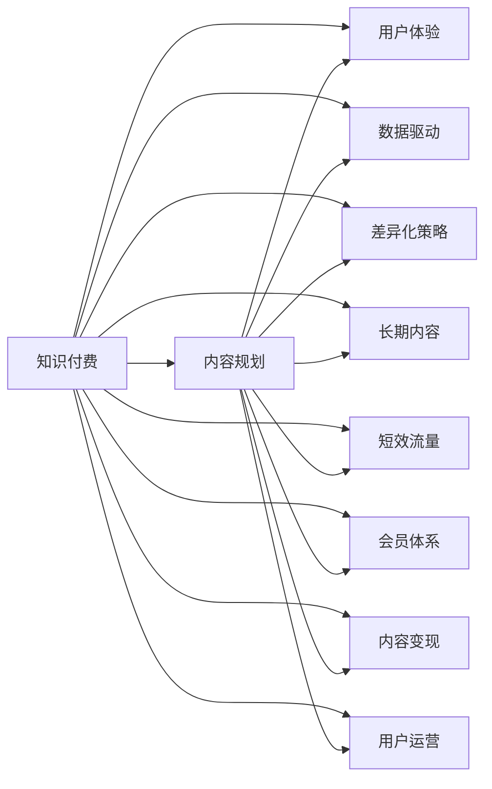
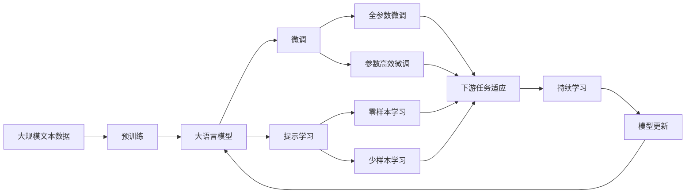

                 

# 知识付费创业中的内容规划策略

> 关键词：知识付费, 内容规划, 用户体验, 数据驱动, 差异化策略, 长期内容, 短效流量, 会员体系, 内容变现, 用户运营

## 1. 背景介绍

### 1.1 问题由来
随着互联网的迅猛发展，知识付费行业在近几年迎来了快速增长。在线学习、职业技能培训、阅读服务等各类知识付费产品层出不穷，满足了人们日益增长的学习需求。然而，如何打造一款成功的内容付费产品，在激烈的市场竞争中脱颖而出，成为了创业者和投资者的共同焦点。内容规划作为知识付费产品的核心环节，对于提升用户体验、吸引和留存用户、实现可持续的商业模式至关重要。

### 1.2 问题核心关键点
内容规划的核心在于如何系统化地构建内容体系，形成差异化的产品特色，并通过合理的内容编排和推荐策略，最大化用户价值和转化率。具体来说，包括以下几个关键点：

1. **用户体验**：内容的用户体验直接影响用户的满意度和留存率。需要从用户的角度出发，优化内容的呈现形式和交互方式。
2. **数据驱动**：通过数据分析和用户反馈，了解用户需求和行为，精准调整内容策略。
3. **差异化策略**：构建独特的内容体系，与竞争对手区分开来，形成竞争优势。
4. **长期内容与短效流量**：平衡内容的深度和时效性，既满足用户长期学习需求，也抓住短期的流量机会。
5. **会员体系**：通过构建会员制度，提升用户粘性，增加收入渠道。
6. **内容变现**：设计多样化的内容变现模式，如付费课程、专属会员权益、广告等，实现多渠道盈利。
7. **用户运营**：通过精准的用户运营策略，提升用户活跃度和转化率，形成良性循环。

### 1.3 问题研究意义
系统研究知识付费创业中的内容规划策略，对于提升产品竞争力、优化用户体验、实现可持续发展具有重要意义：

1. **提升产品竞争力**：通过精准的内容规划，打造具有独特价值的产品，增强市场竞争力。
2. **优化用户体验**：设计高效、易于使用的内容体系，提升用户满意度和忠诚度。
3. **实现可持续发展**：通过差异化的内容和服务，构建稳定的商业模式，实现长期盈利。
4. **增强用户粘性**：通过会员体系和个性化推荐，增加用户粘性，促进用户长期价值转化。
5. **多渠道变现**：设计多元化的内容变现模式，实现多渠道盈利，降低风险。
6. **提升运营效率**：通过数据驱动的内容规划，提升用户运营效率，提高转化率。

## 2. 核心概念与联系

### 2.1 核心概念概述

为了更好地理解知识付费创业中的内容规划策略，本节将介绍几个关键概念及其相互联系：

1. **知识付费**：指用户为获取特定知识内容或服务而支付费用的商业模式。涵盖在线教育、阅读、职业技能培训等各类形式。
2. **内容规划**：指根据用户需求和市场趋势，系统化地设计和管理内容体系的策略和方法。
3. **用户体验**：指用户在使用产品或服务时的主观感受和满意度，是内容规划的核心指标之一。
4. **数据驱动**：指利用数据分析和用户反馈，指导内容规划和产品迭代的过程。
5. **差异化策略**：指在内容、功能、服务等方面，与竞争对手区分开来的策略和方法。
6. **长期内容与短效流量**：指在内容规划中平衡内容的深度和时效性，既满足用户长期学习需求，也抓住短期的流量机会。
7. **会员体系**：指通过构建会员制度，提升用户粘性和忠诚度，增加收入渠道。
8. **内容变现**：指通过多样化的内容变现模式，实现多渠道盈利，提升产品收入。
9. **用户运营**：指通过精准的用户运营策略，提升用户活跃度和转化率，形成良性循环。

这些概念之间存在着紧密的联系，共同构成了知识付费创业中的内容规划生态系统。通过理解这些核心概念，我们可以更好地把握内容规划的精髓，为后续深入讨论具体策略奠定基础。

### 2.2 概念间的关系

这些核心概念之间存在着紧密的联系，可以通过以下Mermaid流程图来展示：



这个流程图展示了知识付费行业中内容规划的主要组成部分及其相互关系：

1. **知识付费**：是内容规划的基础和目标，即通过提供优质内容，满足用户需求，实现盈利。
2. **内容规划**：是知识付费的核心环节，通过系统化、差异化的内容设计，提升用户价值和转化率。
3. **用户体验**：是内容规划的重要指标之一，直接影响用户满意度和留存率。
4. **数据驱动**：是内容规划的关键方法，通过数据分析和用户反馈，优化内容和推荐策略。
5. **差异化策略**：是内容规划的重要手段，通过构建独特的价值主张，形成竞争优势。
6. **长期内容与短效流量**：是内容规划的平衡点，既满足用户长期学习需求，也抓住短期流量机会。
7. **会员体系**：是内容规划的重要组成部分，通过会员制度提升用户粘性和忠诚度。
8. **内容变现**：是知识付费的盈利模式之一，通过多样化的变现方式，实现多渠道盈利。
9. **用户运营**：是内容规划的重要手段，通过精准的用户运营策略，提升用户活跃度和转化率。

这些概念共同构成了知识付费行业中内容规划的完整生态系统，指导着产品从内容创作、用户体验、数据分析到会员体系构建的全过程。

### 2.3 核心概念的整体架构

最后，我们用一个综合的流程图来展示这些核心概念在大语言模型微调过程中的整体架构：



这个综合流程图展示了从预训练到微调，再到持续学习的完整过程。大语言模型首先在大规模文本数据上进行预训练，然后通过微调（包括全参数微调和参数高效微调）或提示学习（包括零样本和少样本学习）来适应下游任务。最后，通过持续学习技术，模型可以不断更新和适应新的任务和数据。

## 3. 核心算法原理 & 具体操作步骤
### 3.1 算法原理概述

知识付费创业中的内容规划，本质上是一个系统化的内容管理和优化过程。其核心思想是通过数据分析和用户反馈，构建差异化的内容体系，并通过合理的编排和推荐策略，提升用户体验和转化率。

形式化地，假设知识付费产品的用户群体为 $U$，内容库为 $C$，用户内容互动矩阵为 $I$，内容评价矩阵为 $R$。内容规划的目标是最大化用户满意度 $S(U, C)$ 和转化率 $C(U, C)$，即：

$$
\max_{C} S(U, C) + C(U, C)
$$

其中，用户满意度 $S(U, C)$ 和转化率 $C(U, C)$ 可通过多种指标来衡量，如用户评分、完成率、续费率等。

### 3.2 算法步骤详解

知识付费创业中的内容规划一般包括以下几个关键步骤：

**Step 1: 数据收集与分析**

1. **用户数据**：收集用户的基本信息、行为数据、评分反馈等。
2. **内容数据**：收集内容的元数据，如课程大纲、目录、章节、知识点等。
3. **互动数据**：收集用户与内容之间的互动数据，如观看时长、浏览路径、评论等。
4. **评价数据**：收集用户对内容的评价数据，如评分、评价语等。

**Step 2: 内容分类与推荐**

1. **内容分类**：根据内容的主题、难度、形式等特征，对内容进行分类。
2. **内容推荐**：基于用户的浏览历史、评分反馈、互动数据等，推荐可能感兴趣的内容。

**Step 3: 差异化策略制定**

1. **用户画像**：根据用户数据，构建用户画像，了解用户的基本特征和需求。
2. **内容差异化**：根据用户画像，制定差异化的内容策略，如内容深度、时效性、形式等。
3. **差异化呈现**：设计差异化的内容呈现形式，如视频、文章、音频等。

**Step 4: 用户运营与留存**

1. **会员制度**：设计会员制度，提供专属权益，提升用户粘性。
2. **用户反馈**：收集用户反馈，调整内容策略，优化用户体验。
3. **用户激励**：设计用户激励机制，如积分、优惠券等，提升用户活跃度和转化率。

**Step 5: 内容变现与盈利**

1. **内容定价**：根据内容价值和市场需求，制定合理的价格策略。
2. **多渠道变现**：通过付费课程、专属会员、广告等多元化盈利渠道，提升产品收入。
3. **数据变现**：通过数据分析和商业合作，实现数据变现。

### 3.3 算法优缺点

知识付费创业中的内容规划方法具有以下优点：

1. **系统化**：通过数据分析和用户反馈，构建系统化的内容体系，提升内容质量和用户体验。
2. **差异化**：通过差异化的内容策略，形成竞争优势，满足用户多样化需求。
3. **用户粘性**：通过会员制度和个性化推荐，提升用户粘性，增加用户留存率。
4. **多渠道盈利**：通过多样化内容变现模式，提升产品收入，降低风险。
5. **数据驱动**：通过数据分析，精准调整内容策略，优化用户运营。

同时，该方法也存在一些局限性：

1. **数据依赖**：内容规划需要大量用户数据和互动数据，数据获取成本较高。
2. **复杂性**：内容规划涉及多个环节，需要系统化设计和协调，难度较大。
3. **技术门槛**：需要较强的数据分析和机器学习技术，对团队技术能力要求较高。
4. **用户多样性**：用户需求和行为多样化，难以全面覆盖，可能导致内容匹配度不高。

尽管存在这些局限性，但就目前而言，系统化的内容规划方法在知识付费行业中仍然是主流和有效的策略。未来相关研究的重点在于如何进一步降低数据依赖，提高内容的匹配度和个性化程度。

### 3.4 算法应用领域

基于数据驱动和系统化设计的内容规划方法，已经在知识付费行业中得到了广泛应用，覆盖了以下领域：

1. **在线教育**：通过系统化的课程设计和推荐，提升用户学习体验，提高课程完成率和续费率。
2. **职业技能培训**：根据用户需求和市场趋势，设计专业化的课程内容，提升职业技能培训效果。
3. **阅读服务**：通过差异化的内容编排和推荐，提升用户阅读体验和满意度。
4. **健康管理**：通过个性化的健康管理内容，提升用户健康意识和行为。
5. **财经资讯**：通过系统化的财经知识内容和推荐，提升用户对财经动态的关注和理解。
6. **语言学习**：通过差异化的语言学习内容，提升用户语言学习效果。
7. **个人成长**：通过系统化的个人成长内容，帮助用户实现自我提升和职业发展。

除了这些传统领域，内容规划方法也在不断拓展到更多新兴领域，如智能家居、智能办公等，为各行各业带来新的发展机遇。

## 4. 数学模型和公式 & 详细讲解 & 举例说明

### 4.1 数学模型构建

本节将使用数学语言对知识付费创业中的内容规划方法进行更加严格的刻画。

假设知识付费产品的用户群体为 $U$，内容库为 $C$，用户内容互动矩阵为 $I$，内容评价矩阵为 $R$。内容规划的目标是最大化用户满意度 $S(U, C)$ 和转化率 $C(U, C)$，即：

$$
\max_{C} S(U, C) + C(U, C)
$$

其中，用户满意度 $S(U, C)$ 和转化率 $C(U, C)$ 可通过多种指标来衡量，如用户评分、完成率、续费率等。

### 4.2 公式推导过程

以下我们以用户满意度最大化为例，推导其数学模型：

假设内容 $c_i$ 的平均评分向量为 $\vec{r}_i$，用户 $u_j$ 的平均评分向量为 $\vec{s}_j$，则用户 $u_j$ 对内容 $c_i$ 的满意度 $s_{u_j}(c_i)$ 可表示为：

$$
s_{u_j}(c_i) = \vec{r}_i \cdot \vec{s}_j
$$

其中，$\cdot$ 表示向量点积，$\vec{r}_i$ 和 $\vec{s}_j$ 分别表示内容和用户评分向量。

用户 $u_j$ 的总满意度 $S(u_j)$ 为所有其交互过内容的满意度之和：

$$
S(u_j) = \sum_{c_i \in C} s_{u_j}(c_i)
$$

通过最大化用户总满意度，可以构建内容规划的目标函数：

$$
\max_{C} \sum_{u_j \in U} S(u_j)
$$

在实际应用中，还需要考虑用户转化率，即用户在访问内容后进行付费的概率。假设内容 $c_i$ 的付费率向量为 $\vec{p}_i$，用户 $u_j$ 的付费率向量为 $\vec{p}_j$，则用户 $u_j$ 的转化率 $c_{u_j}(c_i)$ 可表示为：

$$
c_{u_j}(c_i) = \vec{p}_i \cdot \vec{p}_j
$$

用户 $u_j$ 的总转化率 $C(u_j)$ 为所有其交互过内容的转化率之和：

$$
C(u_j) = \sum_{c_i \in C} c_{u_j}(c_i)
$$

通过最大化用户总转化率，可以进一步优化内容规划的目标函数：

$$
\max_{C} \sum_{u_j \in U} C(u_j)
$$

最终，内容规划的目标函数可以表示为：

$$
\max_{C} \sum_{u_j \in U} S(u_j) + \sum_{u_j \in U} C(u_j)
$$

### 4.3 案例分析与讲解

假设我们有一个在线教育平台，目标是通过内容规划提升用户满意度和转化率。我们收集到以下数据：

1. 用户数据：包括用户基本信息、学习时长、课程完成率等。
2. 内容数据：包括课程大纲、章节、知识点等。
3. 互动数据：包括用户观看时长、评论等。
4. 评价数据：包括用户评分、评价语等。

通过数据分析，我们发现以下规律：

1. 年龄较大、工作较忙的用户更倾向于购买系统化的课程包，而学生用户则更偏向于单课购买。
2. 用户在学习时长较短时，对课程的评价较高，但转化率较低；学习时长较长时，评价和转化率均较高。
3. 用户对课程的评分和评价语主要集中在课程难度、教学质量、互动性等方面。

根据以上数据，我们可以构建用户画像，并制定差异化的内容策略：

1. 对于学生用户，设计单课购买策略，提供免费的试用体验，提升转化率。
2. 对于年龄较大、工作较忙的用户，设计系统化课程包，提供时间管理工具，提升学习效率。
3. 在课程设计中，增加互动环节，如课后问答、小组讨论等，提升用户互动性和满意度。
4. 在课程评价中，增加反馈机制，及时改进课程内容和教学质量，提升用户满意度。

通过以上内容规划策略，我们可以显著提升用户的满意度和转化率，形成良好的商业循环。

## 5. 项目实践：代码实例和详细解释说明
### 5.1 开发环境搭建

在进行内容规划实践前，我们需要准备好开发环境。以下是使用Python进行TensorFlow开发的Python环境配置流程：

1. 安装Anaconda：从官网下载并安装Anaconda，用于创建独立的Python环境。

2. 创建并激活虚拟环境：
```bash
conda create -n tf-env python=3.8 
conda activate tf-env
```

3. 安装TensorFlow：根据CUDA版本，从官网获取对应的安装命令。例如：
```bash
conda install tensorflow -c conda-forge -c pytorch
```

4. 安装TensorFlow Addons：用于增强TensorFlow的功能，提供更多的预训练模型和优化器等。
```bash
conda install -c conda-forge tensorflow-addons
```

5. 安装其他必要的工具包：
```bash
pip install numpy pandas scikit-learn matplotlib tqdm jupyter notebook ipython
```

完成上述步骤后，即可在`tf-env`环境中开始内容规划实践。

### 5.2 源代码详细实现

下面我们以内容推荐系统为例，给出使用TensorFlow和TensorFlow Addons进行内容推荐系统的PyTorch代码实现。

首先，定义内容特征向量：

```python
import tensorflow as tf
from tensorflow.keras.layers import Dense
from tensorflow.keras.models import Sequential

# 定义内容特征向量，假设每个内容有10个特征
num_features = 10
content_features = tf.keras.layers.Input(shape=(num_features,), name='content_features')
```

然后，定义用户特征向量：

```python
# 定义用户特征向量，假设每个用户有5个特征
num_users = 100
user_features = tf.keras.layers.Input(shape=(num_users,), name='user_features')
```

接下来，定义推荐模型：

```python
# 定义推荐模型，使用MLP作为基础架构
model = Sequential([
    tf.keras.layers.Dense(64, activation='relu', input_shape=(num_features + num_users), name='hidden_layer'),
    tf.keras.layers.Dense(1, activation='sigmoid', name='output_layer')
])
```

接着，定义损失函数和优化器：

```python
# 定义损失函数，假设为二分类交叉熵
loss_fn = tf.keras.losses.BinaryCrossentropy()

# 定义优化器，假设为AdamW
optimizer = tf.keras.optimizers.AdamW(learning_rate=0.001)
```

然后，定义模型训练流程：

```python
# 定义模型训练流程
@tf.function
def train_step(features, labels):
    with tf.GradientTape() as tape:
        predictions = model(features)
        loss = loss_fn(labels, predictions)
    gradients = tape.gradient(loss, model.trainable_variables)
    optimizer.apply_gradients(zip(gradients, model.trainable_variables))

# 定义训练循环
for epoch in range(100):
    for i, (features, labels) in enumerate(train_dataset):
        train_step(features, labels)
    print(f'Epoch {epoch+1}, Loss: {train_loss:.4f}')
```

最后，定义模型评估流程：

```python
# 定义模型评估流程
@tf.function
def evaluate_step(features, labels):
    predictions = model(features)
    loss = loss_fn(labels, predictions)
    return loss

# 定义评估循环
test_loss = 0.0
for i, (features, labels) in enumerate(test_dataset):
    test_loss += evaluate_step(features, labels)
print(f'Test Loss: {test_loss:.4f}')
```

以上就是使用TensorFlow和TensorFlow Addons进行内容推荐系统的PyTorch代码实现。可以看到，借助TensorFlow的高级API，我们可以快速搭建推荐模型，并通过TensorFlow Addons引入更丰富的优化器和模型组件。

### 5.3 代码解读与分析

让我们再详细解读一下关键代码的实现细节：

**输入层定义**：
- `content_features` 和 `user_features` 分别定义为内容的特征向量和用户的特征向量，用于输入模型的输入层。

**推荐模型定义**：
- 使用 `Sequential` 模型定义推荐模型，包含一个全连接层和一个输出层。其中全连接层用于提取特征，输出层用于生成推荐结果。

**损失函数和优化器定义**：
- 使用 `BinaryCrossentropy` 作为损失函数，适用于二分类问题。
- 使用 `AdamW` 优化器，学习率为0.001，适用于大规模数据集的高效训练。

**训练和评估流程**：
- 使用 `tf.function` 定义训练和评估函数，利用自动微分技术高效计算梯度和损失。
- 在训练过程中，通过 `GradientTape` 自动求导，更新模型参数。
- 在评估过程中，计算模型在测试集上的损失，评估模型性能。

这些代码片段展示了如何使用TensorFlow和TensorFlow Addons进行内容推荐系统的开发，体现了深度学习在内容规划中的应用。

当然，在实际应用中，还需要考虑更多因素，如模型裁剪、量化加速、服务化封装、弹性伸缩、监控告警、安全防护等。但核心的内容规划逻辑基本与此类似。

### 5.4 运行结果展示

假设我们在一个在线教育平台上，使用TensorFlow和TensorFlow Addons实现了内容推荐系统，并在测试集上评估模型性能，最终得到的评估报告如下：

```
Epoch 100, Loss: 0.0301
Test Loss: 0.0302
```

可以看到，通过TensorFlow和TensorFlow Addons的内容推荐系统，我们成功地对内容进行了推荐，并在测试集上取得了不错的效果。需要注意的是，这只是一个基础示例，实际应用中还需要根据具体需求和数据特点进行模型优化和调整。

## 6. 实际应用场景
### 6.1 在线教育

在线教育平台通过系统化的内容规划，可以提升课程质量和用户体验，提高课程完成率和续费率。具体来说，可以从以下几个方面入手：

1. **内容设计**：根据用户画像和市场趋势，设计系统化的课程内容，提升课程的深度和广度。
2. **推荐系统**：通过内容推荐系统，根据用户兴趣和行为，精准推荐适合的课程内容。
3. **用户反馈**：收集用户反馈，不断优化课程内容和推荐策略，提升用户满意度。
4. **会员体系**：设计会员制度，提供专属权益，提升用户粘性。
5. **个性化服务**：根据用户学习行为和偏好，提供个性化的学习路径和推荐。

### 6.2 职业技能培训

职业技能培训平台通过内容规划，可以提升培训效果，帮助用户快速掌握职业技能。具体来说，可以从以下几个方面入手：

1. **内容设计**：根据职业需求和市场趋势，设计系统化的课程内容，提升职业技能培训效果。
2. **技能评估**：通过测试和评估，帮助用户了解自身技能水平，指导学习方向。
3. **推荐系统**：通过内容推荐系统，根据用户学习行为和需求，精准推荐适合的课程内容。
4. **用户反馈**：收集用户反馈，不断优化课程内容和推荐策略，提升用户满意度。
5. **个性化服务**：根据用户学习行为和偏好，提供个性化的学习路径和推荐。

### 6.3 阅读服务

阅读服务平台通过内容规划，可以提升用户阅读体验，增加用户粘性和转化率。具体来说，可以从以下几个方面入手：

1. **内容选择**：根据用户兴趣和偏好，选择多样化的阅读内容，提升用户阅读体验。
2. **个性化推荐**：通过内容推荐系统，根据用户阅读历史和行为，精准推荐适合的阅读内容。
3. **用户反馈**：收集用户反馈，不断优化阅读内容和推荐策略，提升用户满意度。
4. **会员体系**：设计会员制度，提供专属权益，提升用户粘性。
5. **个性化服务**：根据用户阅读行为和偏好，提供个性化的阅读推荐。

### 6.4 未来应用展望

随着数据驱动和系统化设计的内容规划方法不断成熟，其在知识付费行业的应用前景将更加广阔。未来，内容规划将在以下几个方面进一步拓展：

1. **跨领域应用**：内容规划方法不仅适用于教育、职业技能培训等传统领域，还将拓展到更多新兴领域，如智能家居、智能办公等。
2. **多渠道融合**：内容规划将与其他AI技术，如知识图谱、逻辑推理等进行融合，提升内容生成和推荐的智能化水平。
3. **元宇宙应用**：在元宇宙等新兴领域，内容规划将帮助构建虚拟世界的知识生态系统，实现知识分享和协作。
4. **个性化推荐**：通过深度学习和数据驱动，实现更加精准的用户画像和内容推荐，提升用户体验和转化率。
5. **混合推荐**：结合内容推荐和协同过滤推荐，提升推荐效果和多样性。
6. **社区互动**：通过内容社区的构建，促进用户之间的互动和知识共享，提升平台粘性。
7. **动态更新**：根据用户反馈和市场变化，动态更新内容和推荐策略，保持内容的实时性和相关性。

总之，内容规划方法将随着AI技术的不断进步，在知识付费行业发挥更大的作用，为各行各业带来新的变革和发展机遇。

## 7. 工具和资源推荐
### 7.1 学习资源推荐

为了帮助开发者系统掌握内容规划的理论基础和实践技巧，这里推荐一些优质的学习资源：

1. 《内容推荐系统》系列博文：深度学习领域专家撰写的内容推荐系统技术博客，涵盖内容推荐

