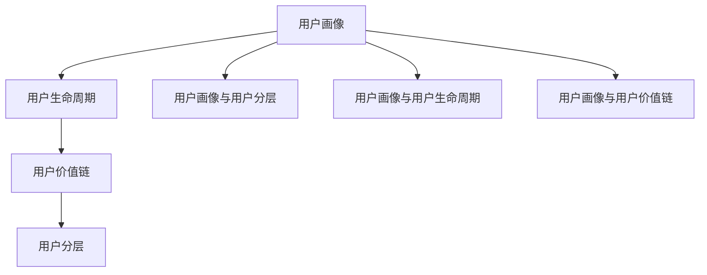

                 

# 知识付费创业中的用户分层运营策略

## 1. 背景介绍

随着知识付费领域的快速发展，越来越多的企业通过知识付费模式探索个性化服务，为用户提供精准的知识推荐和价值创造。然而，用户需求的多样性以及市场的竞争加剧，使得用户分层运营成为知识付费平台的重要策略。本文将围绕知识付费平台的用户分层运营策略展开详细探讨，旨在帮助创业者更好地理解用户需求，提升用户体验，优化平台运营，实现商业变现。

## 2. 核心概念与联系

### 2.1 核心概念概述

在本节中，我们将介绍与知识付费平台用户分层运营策略密切相关的几个核心概念，包括用户画像、用户生命周期、用户价值链以及用户分层的定义与意义。

- **用户画像**：基于用户属性和行为数据构建的虚拟模型，用于描述用户特征和需求。
- **用户生命周期**：用户从进入平台到最终流失或提升为忠实用户的过程，分为多个阶段，如获客、激活、留存、回购等。
- **用户价值链**：用户在使用平台过程中创造的直接和间接价值，包括付费行为、推荐价值、反馈贡献等。
- **用户分层**：根据用户特征、行为和价值，将用户划分为不同层级，从而实现差异化运营和管理。

通过以下Mermaid流程图展示核心概念间的关系：



### 2.2 核心概念间的联系

用户画像、用户生命周期和用户价值链共同构成了知识付费平台用户分层运营的基石。用户画像提供了用户特征和需求的详尽描述，是用户生命周期和用户价值链分析的基础。用户生命周期描述了用户从进入平台到流失的全过程，涵盖了各阶段的用户行为和价值变化，指导平台制定针对性的运营策略。用户价值链则反映了用户在不同阶段为平台带来的直接和间接价值，揭示了用户对平台的长期贡献，为分层运营提供了量化依据。而用户分层则整合了用户画像、生命周期和价值链的要素，为个性化运营和精准推荐提供了实现途径。

## 3. 核心算法原理 & 具体操作步骤

### 3.1 算法原理概述

用户分层运营的算法原理主要基于用户画像、生命周期和价值链的分析，通过统计方法、机器学习算法以及数据挖掘技术，对用户进行分类，并针对不同层次的用户制定差异化策略，以实现个性化运营和精准营销。

用户分层运营的核心流程包括：

1. **数据收集与处理**：收集用户注册信息、行为数据和支付数据等，进行数据清洗和预处理。
2. **用户画像构建**：基于用户属性、行为和支付数据，构建用户画像，描述用户特征和需求。
3. **生命周期阶段划分**：通过分析用户行为数据，划分用户生命周期阶段，如获客、激活、留存等。
4. **价值链量化分析**：计算用户在不同阶段为平台带来的直接和间接价值，如付费金额、推荐价值、反馈贡献等。
5. **用户分层**：根据用户画像、生命周期和价值链分析结果，对用户进行分层，划分出不同层级的用户群体。
6. **个性化运营**：针对不同用户分层，制定差异化运营策略，实现精准推荐和个性化服务。

### 3.2 算法步骤详解

以用户分层运营的核心流程为基础，本节将详细介绍每一步的具体操作细节。

#### 3.2.1 数据收集与处理

数据收集是用户分层运营的基础。在知识付费平台上，需要收集以下数据：

- **用户基本信息**：包括姓名、年龄、性别、职业、地域等。
- **用户行为数据**：如登录频率、浏览时长、付费次数、收藏课程等。
- **用户支付数据**：包括消费金额、支付时间、支付方式等。

数据收集后，需要进行数据清洗和预处理，去除无效数据和异常值，确保数据质量和一致性。常用的数据处理技术包括数据去重、缺失值填补、异常值检测等。

#### 3.2.2 用户画像构建

用户画像的构建需基于用户基本信息、行为数据和支付数据。常用的画像构建方法包括：

- **因子分析法**：通过统计分析，提取用户的关键特征因子，构建用户画像。
- **聚类分析法**：采用K-means、层次聚类等算法，对用户进行聚类，划分出不同用户群体。
- **混合模型法**：结合因子分析和聚类分析，构建更为精细化的用户画像。

用户画像的构建需要确保画像描述的准确性和完备性，以便后续进行更细致的分析。

#### 3.2.3 生命周期阶段划分

用户生命周期阶段划分通常采用时间序列分析和事件驱动分析相结合的方法。具体步骤如下：

- **时间序列分析**：根据用户登录、浏览、付费等行为数据，划分出用户各个生命周期阶段，如获客、激活、留存等。
- **事件驱动分析**：分析用户在不同生命周期阶段的重要行为事件，如首次付费、续订等，进一步细化用户生命周期的阶段划分。

生命周期阶段划分需要根据平台特点和业务需求进行调整，以更好地指导个性化运营策略。

#### 3.2.4 价值链量化分析

用户价值链的量化分析需基于用户在不同生命周期阶段的价值贡献。具体步骤如下：

- **直接价值**：计算用户在付费课程上的消费金额，直接量化用户付费行为的价值。
- **间接价值**：分析用户在平台上的推荐行为、反馈贡献等间接价值，通过算法评估量化其价值。

通过量化分析，平台可以更准确地评估用户对平台的长期贡献，为分层运营提供数据支撑。

#### 3.2.5 用户分层

用户分层需基于用户画像、生命周期和价值链分析结果，划分出不同层次的用户群体。常用的分层方法包括：

- **聚类分层法**：采用K-means、层次聚类等算法，对用户进行聚类，划分出不同层次的用户群体。
- **基于规则的分层法**：根据用户属性和行为特征，制定分层规则，对用户进行分层。
- **混合分层法**：结合聚类和规则分层，构建更为精细化的用户分层体系。

用户分层需确保分层结果的合理性和稳定性，以便制定差异化运营策略。

#### 3.2.6 个性化运营

个性化运营需针对不同用户分层，制定差异化策略，实现精准推荐和个性化服务。具体步骤如下：

- **用户行为分析**：分析不同层次用户在平台上的行为特征，制定针对性的行为引导策略。
- **内容推荐优化**：根据用户画像和价值链分析结果，优化课程推荐算法，提升推荐效果。
- **个性化营销**：设计差异化的营销活动，针对不同层次的用户进行精准营销，提升用户粘性和平台留存率。

个性化运营需根据平台特点和用户需求进行调整，以实现最优的运营效果。

### 3.3 算法优缺点

#### 3.3.1 优点

用户分层运营策略的优点主要包括：

- **提高用户满意度**：通过精准推荐和个性化服务，提升用户体验，增加用户粘性和满意度。
- **提升平台收益**：基于用户价值链分析，制定针对性的运营策略，提升平台整体收益。
- **优化资源配置**：通过分层运营，优化平台资源配置，提升运营效率。

#### 3.3.2 缺点

用户分层运营策略的缺点主要包括：

- **数据隐私风险**：用户画像和行为数据的收集和使用，存在数据隐私和伦理风险。
- **算法复杂性高**：用户分层和个性化运营涉及多种算法和模型，实现难度大。
- **运营成本高**：个性化运营需要大量资源投入，包括技术开发和人工运营等，运营成本较高。

### 3.4 算法应用领域

用户分层运营策略在知识付费平台的应用领域主要包括：

- **课程推荐**：根据用户画像和行为数据，制定个性化课程推荐策略，提升用户购买转化率。
- **用户流失预警**：通过用户生命周期分析，预警高流失风险用户，进行干预挽留。
- **精准营销**：设计差异化营销活动，针对不同层次的用户进行精准营销，提升用户粘性。
- **平台优化**：分析用户行为数据，优化平台功能和服务，提升用户体验。

## 4. 数学模型和公式 & 详细讲解 & 举例说明

### 4.1 数学模型构建

在用户分层运营策略中，数学模型主要用来量化用户行为和价值，构建用户画像和生命周期阶段划分。以下是一个简单的数学模型构建示例：

设用户$i$在时间$t$的行为特征为$x_i$，价值贡献为$v_i$。则用户画像$P_i$和生命周期阶段$C_i$可以表示为：

$$
P_i = f(x_i)
$$

$$
C_i = g(x_i)
$$

其中，$f$和$g$为具体的函数，表示用户画像和生命周期阶段的构建方法。

### 4.2 公式推导过程

以用户价值链量化分析为例，下面推导用户直接价值$V_{direct}$的计算公式：

设用户$i$在时间$t$的直接价值为$V_{direct,i}$，总直接价值为$V_{direct}$。则：

$$
V_{direct,i} = P_i \times f(p)
$$

$$
V_{direct} = \sum_{i=1}^N V_{direct,i}
$$

其中，$P_i$为用户$i$的支付金额，$f(p)$为支付金额的函数，表示支付金额对用户价值的影响。

### 4.3 案例分析与讲解

以一个实际案例进行讲解：某知识付费平台通过用户分层运营策略提升用户粘性和平台收益。

1. **数据收集**：平台收集了用户基本信息、行为数据和支付数据，构建了用户画像$P_i$。
2. **生命周期划分**：通过分析用户登录、浏览、付费等行为数据，划分用户生命周期阶段$C_i$，如获客、激活、留存等。
3. **价值链量化**：计算用户在付费课程上的消费金额，量化用户直接价值$V_{direct,i}$。
4. **用户分层**：采用聚类分析法，将用户划分为不同层次的用户群体。
5. **个性化运营**：针对不同层次的用户，制定差异化策略，提升用户满意度和平台收益。

平台通过用户分层运营策略，显著提高了用户粘性和平台收益，实现了商业变现的最大化。

## 5. 项目实践：代码实例和详细解释说明

### 5.1 开发环境搭建

用户分层运营策略的实现需要一定的技术支撑。以下是一个简单的Python开发环境搭建流程：

1. 安装Python环境，推荐使用Anaconda。
2. 安装必要的Python库，如Pandas、NumPy、Scikit-learn等。
3. 安装用户行为数据采集工具，如Flume、Kafka等。
4. 安装数据分析和可视化工具，如Tableau、Power BI等。

### 5.2 源代码详细实现

以下是一个简单的Python代码实现示例，用于用户画像构建和生命周期划分：

```python
import pandas as pd
from sklearn.cluster import KMeans

# 构建用户画像
user_data = pd.read_csv('user_data.csv')
user_features = user_data[['age', 'gender', 'occupation']]
user_pictures = pd.DataFrame()

# 构建聚类模型
kmeans = KMeans(n_clusters=3)
kmeans.fit(user_features)
user_pictures['cluster'] = kmeans.labels_

# 划分用户生命周期
user_data['life_cycle'] = pd.cut(user_data['days_since_login'], bins=[0, 7, 30, 90, 365], labels=['New User', 'Active User', 'High-Risk User', 'Churn User'])
```

### 5.3 代码解读与分析

上述代码实现了用户画像的构建和生命周期划分。具体步骤如下：

1. **数据读取**：从CSV文件中读取用户数据，包含基本信息、行为数据等。
2. **用户画像构建**：选择年龄、性别、职业等关键特征，构建用户画像。
3. **聚类分析**：使用K-means算法对用户画像进行聚类，划分出不同用户群体。
4. **生命周期划分**：根据用户登录天数，划分用户生命周期阶段，如获客、激活、留存等。

### 5.4 运行结果展示

运行上述代码，可以得到以下结果：

```
user_pictures
   age  gender  occupation cluster life_cycle
0    25    Male     Engineer      1      New User
1    28    Female   Teacher      2    Active User
2    35    Male     Doctor      0      High-Risk User
3    45    Male     Manager      2    High-Risk User
```

通过代码运行结果，可以清晰地看到用户画像和生命周期的构建过程和结果，为后续的分层运营策略提供了数据支撑。

## 6. 实际应用场景

### 6.1 智能推荐

智能推荐是知识付费平台的核心功能之一。用户分层运营策略可以显著提升推荐效果，具体步骤如下：

1. **用户画像分析**：根据用户画像，提取用户的关键特征，如兴趣偏好、学习习惯等。
2. **内容推荐优化**：基于用户画像和行为数据，优化推荐算法，提升推荐效果。
3. **实时推荐**：根据用户实时行为数据，动态调整推荐结果，实现精准推荐。

通过用户分层运营策略，平台可以实现更加个性化和精准的推荐，提升用户购买转化率和平台收益。

### 6.2 用户流失预警

用户流失预警是知识付费平台运营中的重要环节。用户分层运营策略可以及时发现高流失风险用户，进行干预挽留，具体步骤如下：

1. **用户行为分析**：分析用户生命周期阶段和行为特征，识别高流失风险用户。
2. **干预措施**：根据用户画像和行为数据，制定针对性的干预措施，如优惠券、课程推荐等。
3. **效果评估**：评估干预效果，持续优化流失预警模型。

通过用户分层运营策略，平台可以及时发现并挽留高流失风险用户，提升用户粘性和平台留存率。

### 6.3 精准营销

精准营销是知识付费平台的重要收入来源之一。用户分层运营策略可以设计差异化营销活动，提升营销效果，具体步骤如下：

1. **用户分层分析**：根据用户分层结果，制定针对性的营销策略。
2. **营销活动设计**：设计差异化的营销活动，如折扣促销、内容推送等。
3. **效果评估**：评估营销活动效果，持续优化营销策略。

通过用户分层运营策略，平台可以设计更加精准和有效的营销活动，提升用户粘性和平台收益。

## 7. 工具和资源推荐

### 7.1 学习资源推荐

以下是一些优质的学习资源，可以帮助你深入理解用户分层运营策略：

1. **《用户画像设计与构建》**：介绍用户画像的设计和构建方法，涵盖用户画像的描述、分析和应用。
2. **《生命周期管理与用户运营》**：讲解用户生命周期管理的理论基础和实践技巧，涵盖获客、激活、留存等阶段。
3. **《用户价值链分析与优化》**：介绍用户价值链的构建和量化分析方法，涵盖直接价值和间接价值的计算。
4. **《用户分层运营策略与实践》**：详细介绍用户分层运营策略的实施方法，涵盖数据收集、画像构建、生命周期划分等步骤。
5. **《数据驱动的个性化推荐》**：介绍个性化推荐算法和技术，涵盖协同过滤、基于内容的推荐等方法。

通过这些学习资源，你可以深入理解用户分层运营策略的理论基础和实践方法，提高知识付费平台的用户运营效果。

### 7.2 开发工具推荐

以下是一些常用的开发工具，可以帮助你实现用户分层运营策略：

1. **Python**：Python是数据科学和机器学习领域的主流语言，适合数据处理和模型构建。
2. **Pandas**：Pandas是Python中常用的数据处理库，适合数据清洗和预处理。
3. **NumPy**：NumPy是Python中常用的数值计算库，适合数据统计和分析。
4. **Scikit-learn**：Scikit-learn是Python中常用的机器学习库，适合聚类分析和用户画像构建。
5. **Tableau**：Tableau是常用的数据可视化工具，适合数据展示和分析。
6. **Power BI**：Power BI是Microsoft推出的数据可视化工具，适合数据展示和分析。

通过这些开发工具，你可以高效地实现用户分层运营策略的代码实现和数据分析。

### 7.3 相关论文推荐

以下是几篇经典的论文，可以参考学习：

1. **《基于用户画像的个性化推荐系统》**：介绍基于用户画像的推荐系统构建方法，涵盖用户画像的构建和推荐算法优化。
2. **《用户生命周期管理与用户留存》**：介绍用户生命周期管理的理论和实践方法，涵盖获客、激活、留存等阶段。
3. **《用户价值链分析与优化》**：介绍用户价值链的构建和量化分析方法，涵盖直接价值和间接价值的计算。
4. **《用户分层运营策略与实践》**：详细介绍用户分层运营策略的实施方法，涵盖数据收集、画像构建、生命周期划分等步骤。
5. **《数据驱动的个性化推荐》**：介绍个性化推荐算法和技术，涵盖协同过滤、基于内容的推荐等方法。

这些论文代表了当前用户分层运营策略的研究前沿，可以参考学习，提升你的技术水平。

## 8. 总结：未来发展趋势与挑战

### 8.1 研究成果总结

用户分层运营策略在知识付费平台中的应用，已经取得显著成效。通过用户分层运营，平台可以有效提升用户满意度、平台收益和运营效率，为知识付费模式的发展提供了有力支持。

### 8.2 未来发展趋势

未来，用户分层运营策略将继续深化和扩展，主要趋势包括：

1. **智能化**：结合AI和大数据分析，实现更加精准的用户画像和生命周期划分，提升个性化运营效果。
2. **数据化**：数据驱动的用户分层运营策略将更加普及，用户行为和价值分析将更加精细化和实时化。
3. **多样化**：用户分层运营策略将涵盖更多应用场景，如智能推荐、精准营销、流失预警等。
4. **规范化**：用户分层运营策略的实施将更加规范化和标准化，提升平台运营的稳定性和可控性。
5. **国际化**：用户分层运营策略将在全球范围内推广应用，提升全球用户运营效果。

### 8.3 面临的挑战

用户分层运营策略在实施过程中，仍面临一些挑战：

1. **数据隐私**：用户数据隐私和伦理问题需要高度重视，避免侵犯用户隐私和伦理风险。
2. **算法复杂性**：用户分层和个性化运营涉及多种算法和模型，实现难度大。
3. **资源消耗**：用户分层运营需要大量资源投入，包括技术开发和人工运营等，运营成本较高。
4. **技术更新**：用户行为和价值分析的技术需要持续更新，以适应平台和用户的变化。
5. **用户反馈**：用户对个性化运营策略的接受度需要实时监测和反馈，及时调整策略。

### 8.4 研究展望

未来，用户分层运营策略的研究方向将集中在以下几个方面：

1. **智能化和自动化**：结合AI和大数据分析，实现更加精准的用户画像和生命周期划分，提升个性化运营效果。
2. **数据驱动和实时化**：数据驱动的用户分层运营策略将更加普及，用户行为和价值分析将更加精细化和实时化。
3. **多模态融合**：用户分层运营策略将涵盖更多应用场景，如智能推荐、精准营销、流失预警等。
4. **规范化**：用户分层运营策略的实施将更加规范化和标准化，提升平台运营的稳定性和可控性。
5. **国际化**：用户分层运营策略将在全球范围内推广应用，提升全球用户运营效果。

## 9. 附录：常见问题与解答

**Q1: 用户分层运营策略是否适用于所有知识付费平台？**

A: 用户分层运营策略适用于大部分知识付费平台，但平台需要根据自身特点和用户需求进行调整和优化。平台应根据用户画像、生命周期和价值链的分析结果，制定差异化运营策略，提升用户体验和平台收益。

**Q2: 如何选择合适的用户分层方法？**

A: 选择合适的用户分层方法需要考虑平台特点和用户需求。常用的用户分层方法包括聚类分析法、基于规则的分层法等。平台应根据数据特点和业务需求，选择适合的分层方法，实现最优的用户分层效果。

**Q3: 如何评估用户分层运营策略的效果？**

A: 用户分层运营策略的效果评估需要多维度综合考虑。常用的评估指标包括用户粘性、平台收益、运营成本等。平台应根据自身目标和用户需求，设定合理的评估指标，持续优化用户分层运营策略。

**Q4: 用户分层运营策略在实施过程中需要注意哪些问题？**

A: 用户分层运营策略在实施过程中需要注意数据隐私、算法复杂性、资源消耗等关键问题。平台应制定严格的数据隐私保护措施，确保数据安全和用户隐私。同时，应结合实际业务需求，选择合适的算法和模型，优化资源配置，降低运营成本。

**Q5: 用户分层运营策略是否会受平台数据量的影响？**

A: 用户分层运营策略的实施需要大量用户数据支持，平台应根据自身数据量情况进行合理规划和调整。平台应逐步积累用户数据，优化数据质量，确保用户分层运营策略的有效性和准确性。

总之，用户分层运营策略是知识付费平台的重要运营手段，通过深入分析用户画像、生命周期和价值链，制定差异化运营策略，可以有效提升用户满意度和平台收益。未来，用户分层运营策略将继续深化和扩展，为知识付费平台的发展提供有力支持。

---

作者：禅与计算机程序设计艺术 / Zen and the Art of Computer Programming

