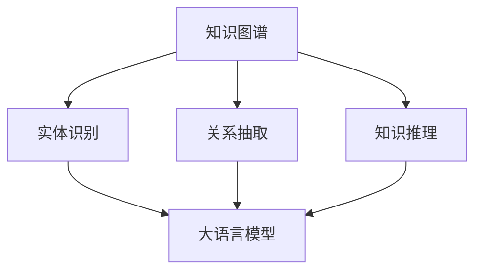
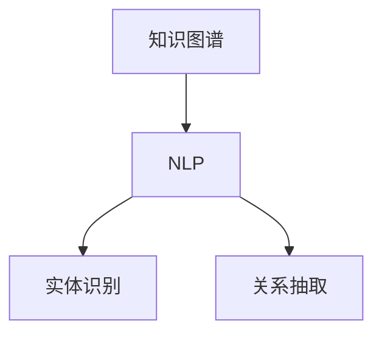
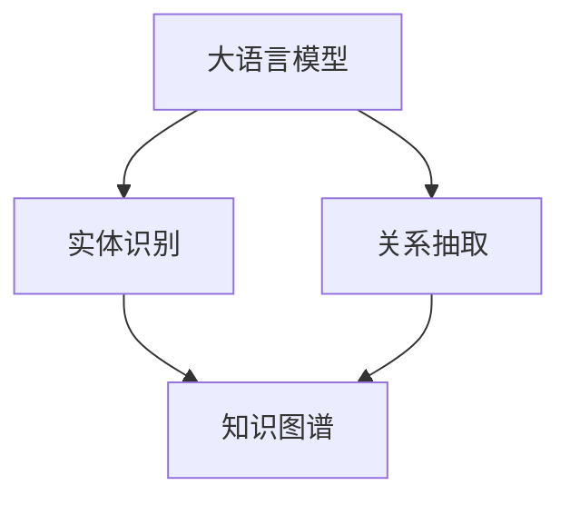
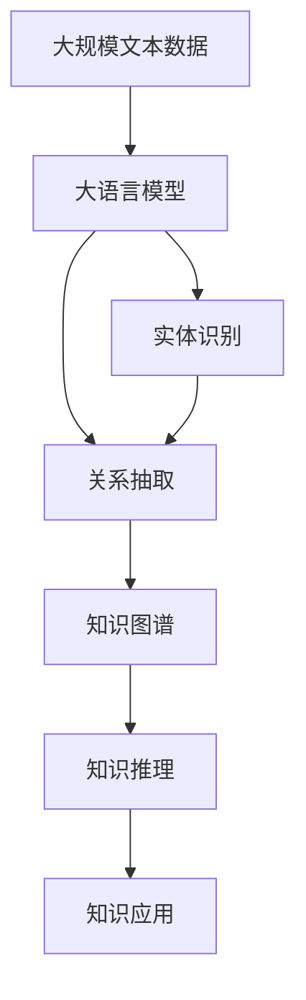
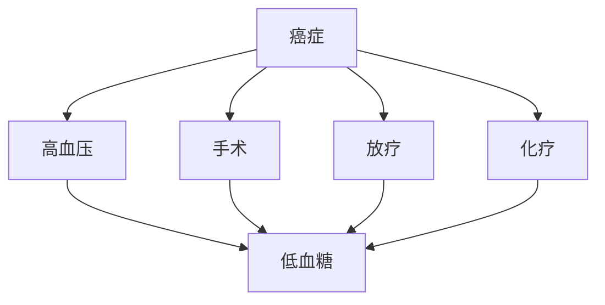

                 

# 知识体系的构建：从基本元素到复杂结构

## 1. 背景介绍

### 1.1 问题由来

构建一个高效的知识体系对于人类社会的进步至关重要。知识的累积和传播不仅推动了科学技术的进步，也是文明发展的重要标志。然而，随着信息爆炸和知识增长的加速，构建知识体系的复杂性也在不断增加。知识的来源多样，形式各异，如何高效地组织、整合、传递和应用这些知识，成为了一个重要的研究课题。

大语言模型和自然语言处理技术的发展，为构建知识体系提供了新的思路和工具。基于大语言模型的知识图谱构建和知识管理方法，能够整合海量的文本数据，形成结构化、语义化的知识结构，从而支持高效的知识检索、推理和应用。本文将从基础知识库的构建、知识图谱的构建以及知识图谱的应用三个方面，详细阐述如何通过大语言模型构建高效的知识体系。

### 1.2 问题核心关键点

构建高效的知识体系，需要关注以下几个核心关键点：

- **知识提取与清洗**：如何从海量的文本数据中高效提取出有价值的知识，并清洗去除噪声和冗余信息。
- **知识关联与结构化**：如何将提取出的知识关联起来，构建结构化的知识图谱。
- **知识应用与反馈**：如何利用知识图谱进行高效的知识检索、推理和应用，同时收集反馈信息以不断优化知识体系。

构建高效的知识体系，不仅需要先进的算法和工具，还需要对领域知识的深入理解和对用户需求的精准把握。本文将重点介绍大语言模型在这些关键点上的应用，并通过具体案例，展示构建高效知识体系的方法和实践。

## 2. 核心概念与联系

### 2.1 核心概念概述

为了更好地理解如何构建高效的知识体系，本节将介绍几个密切相关的核心概念：

- **知识图谱(Knowledge Graph)**：一种结构化的知识表示方法，用于描述实体、属性和它们之间的关系。知识图谱通过对实体进行分类、属性标注和关系推理，能够高效地存储和检索知识。
- **自然语言处理(NLP)**：一种利用计算机处理和理解人类语言的技术，通过文本分析、信息提取、文本生成等方法，将文本转化为结构化的知识。
- **大语言模型(Large Language Model, LLM)**：一种通过大量文本数据训练得到的深度神经网络模型，具备强大的语言理解和生成能力。大语言模型在自然语言处理、知识图谱构建等领域有广泛应用。
- **实体识别(Entity Recognition)**：从文本中识别出具有特定意义的实体，如人名、地名、机构名等。实体识别是构建知识图谱的基础步骤。
- **关系抽取(Relation Extraction)**：从文本中抽取实体之间的关系，如父子关系、雇佣关系等。关系抽取是知识图谱构建的重要环节。
- **知识推理(Knowledge Reasoning)**：基于知识图谱中的信息，进行推理和逻辑判断，得出新的知识或验证已有知识。知识推理是知识图谱应用的重要功能。

这些核心概念之间的逻辑关系可以通过以下Mermaid流程图来展示：



这个流程图展示了大语言模型在构建知识图谱中的角色：实体识别、关系抽取和知识推理等基础步骤都需要依赖大语言模型进行文本分析和信息提取。知识图谱的构建过程，本质上是将大语言模型的文本处理结果进行结构化整合。

### 2.2 概念间的关系

这些核心概念之间存在着紧密的联系，形成了构建知识图谱的完整生态系统。下面我们通过几个Mermaid流程图来展示这些概念之间的关系。

#### 2.2.1 知识图谱构建的基本流程


这个流程图展示了知识图谱构建的基本流程：从文本数据出发，通过实体识别和关系抽取，构建出结构化的知识图谱。

#### 2.2.2 知识图谱与NLP的关系



这个流程图展示了知识图谱与NLP的关系：NLP技术提供了文本分析、信息提取等工具，是构建知识图谱的重要手段。

#### 2.2.3 大语言模型在知识图谱构建中的应用



这个流程图展示了大语言模型在知识图谱构建中的应用：实体识别和关系抽取均可以基于大语言模型进行，从而形成高效的知识图谱构建流程。

### 2.3 核心概念的整体架构

最后，我们用一个综合的流程图来展示这些核心概念在大语言模型构建知识图谱中的应用：



这个综合流程图展示了从文本数据到大语言模型，再到知识图谱和知识推理的完整流程，以及知识图谱在实际应用中的价值。

## 3. 核心算法原理 & 具体操作步骤

### 3.1 算法原理概述

基于大语言模型的知识图谱构建，本质上是将大语言模型的文本处理结果进行结构化整合。其核心思想是：通过大语言模型理解文本中的实体和关系，将其转化为结构化的知识图谱。

形式化地，假设输入为大规模文本数据 $D=\{d_1,d_2,\cdots,d_N\}$，其中每个 $d_i$ 为一条文本。知识图谱构建过程如下：

1. **实体识别**：使用大语言模型提取每个文本中的实体，得到实体集合 $E$。
2. **关系抽取**：基于实体之间的关系，使用大语言模型抽取实体之间的关系，得到关系集合 $R$。
3. **知识图谱构建**：将实体和关系组合，构建出知识图谱 $G=(E,R)$。

通过上述步骤，大语言模型将非结构化的文本数据转化为结构化的知识图谱，从而支持高效的知识检索、推理和应用。

### 3.2 算法步骤详解

基于大语言模型的知识图谱构建步骤如下：

**Step 1: 准备数据集和预训练模型**
- 准备大规模文本数据集，涵盖领域知识。
- 选择合适的大语言模型作为预训练模型，如BERT、GPT等。

**Step 2: 实体识别**
- 使用预训练模型对文本数据进行实体识别。
- 通过阈值筛选或后处理技术，去除噪声实体。

**Step 3: 关系抽取**
- 对识别出的实体，使用预训练模型抽取实体之间的关系。
- 结合预定义的实体关系规则，提取有意义的实体关系。

**Step 4: 知识图谱构建**
- 将提取出的实体和关系进行整合，构建知识图谱。
- 使用图数据库或知识图谱存储工具，存储和维护知识图谱。

**Step 5: 知识图谱应用**
- 根据应用需求，构建知识图谱的查询、推理和应用接口。
- 通过API接口，将知识图谱应用到实际业务场景中。

### 3.3 算法优缺点

基于大语言模型的知识图谱构建方法具有以下优点：
- 高效性：大语言模型可以处理大规模文本数据，抽取实体和关系的速度较快。
- 鲁棒性：通过预训练模型，可以处理多种语言和复杂文本，适应性强。
- 灵活性：大语言模型支持多种任务，可以结合领域知识和用户需求灵活构建知识图谱。

但该方法也存在以下缺点：
- 数据依赖：需要大规模高质量的标注数据进行实体和关系抽取，获取数据成本较高。
- 结构单一：知识图谱仅能表示实体和关系，无法处理复杂的多层次结构。
- 更新困难：知识图谱一旦构建，更新维护难度较大，难以适应数据动态变化。

尽管存在这些缺点，但大语言模型在知识图谱构建中仍然具有广泛的应用前景，特别是在领域知识资源不足的情况下，能够快速构建出有价值的知识图谱。

### 3.4 算法应用领域

基于大语言模型的知识图谱构建方法，在多个领域都有广泛的应用，例如：

- 医疗知识图谱：通过抽取医学文献中的实体和关系，构建医疗知识图谱，支持疾病诊断和治疗方案推荐。
- 金融知识图谱：从新闻、公告、报告等金融数据中抽取实体和关系，构建金融知识图谱，支持投资分析和风险管理。
- 教育知识图谱：提取教学资源中的实体和关系，构建教育知识图谱，支持个性化学习和智能辅导。
- 法律知识图谱：从法律文件和案例中抽取实体和关系，构建法律知识图谱，支持法律咨询和案件分析。
- 社交网络知识图谱：从社交媒体数据中抽取实体和关系，构建社交网络知识图谱，支持舆情分析和用户行为研究。

除了这些特定领域，大语言模型还可以应用于通用领域知识图谱的构建，如通用百科、公共信息等，为知识共享和智慧城市建设提供支持。

## 4. 数学模型和公式 & 详细讲解 & 举例说明

### 4.1 数学模型构建

知识图谱的构建过程可以通过图数据库来实现，典型的图数据库包括Neo4j、ArangoDB等。图数据库使用节点（Node）和边（Edge）来表示实体和关系，其数学模型可以表示为：

$$G=(V,E)$$

其中，$V$ 为节点集合，表示实体；$E$ 为边集合，表示实体之间的关系。

### 4.2 公式推导过程

假设输入文本 $d$ 中包含 $n$ 个实体 $e_1,e_2,\cdots,e_n$，以及 $m$ 个关系 $r_1,r_2,\cdots,r_m$，其数学模型可以表示为：

$$G=(E,R)$$

其中，$E$ 为实体集合，$R$ 为关系集合。

实体识别过程可以表示为：

$$E=\{e_1,e_2,\cdots,e_n\}$$

关系抽取过程可以表示为：

$$R=\{(r_1,e_i,e_j),(r_2,e_k,e_l),\cdots,(r_m,e_p,e_q)\}$$

其中，$(r,e_i,e_j)$ 表示实体 $e_i$ 和 $e_j$ 之间的关系。

### 4.3 案例分析与讲解

以医疗知识图谱为例，其构建过程如下：

1. **实体识别**：从医学文献中抽取实体，如疾病、药物、基因等。
2. **关系抽取**：抽取实体之间的关系，如治疗方案、副作用、相互作用等。
3. **知识图谱构建**：将抽取的实体和关系组合，构建医疗知识图谱。

假设输入文本 $d$ 中包含以下实体和关系：

- 疾病：癌症、糖尿病、高血压
- 药物：阿司匹林、胰岛素、降压药
- 治疗方案：手术、放疗、化疗
- 副作用：疼痛、呕吐、低血糖
- 相互作用：阿司匹林+降压药=高血压

通过实体识别和关系抽取，构建医疗知识图谱，如图：



通过知识图谱，可以高效地进行疾病诊断和治疗方案推荐，如：

- 输入症状：头痛、乏力、体重减轻
- 查询节点：症状 --> 疾病 --> 治疗方案

得到推荐的治疗方案：手术、化疗。

## 5. 项目实践：代码实例和详细解释说明

### 5.1 开发环境搭建

在进行知识图谱构建实践前，我们需要准备好开发环境。以下是使用Python进行PyTorch开发的环境配置流程：

1. 安装Anaconda：从官网下载并安装Anaconda，用于创建独立的Python环境。

2. 创建并激活虚拟环境：
```bash
conda create -n pytorch-env python=3.8 
conda activate pytorch-env
```

3. 安装PyTorch：根据CUDA版本，从官网获取对应的安装命令。例如：
```bash
conda install pytorch torchvision torchaudio cudatoolkit=11.1 -c pytorch -c conda-forge
```

4. 安装TensorFlow：如果需要进行跨平台部署，可以使用Google Cloud或AWS的云服务环境。

5. 安装相关库：
```bash
pip install numpy pandas scikit-learn torch transformers
```

完成上述步骤后，即可在`pytorch-env`环境中开始知识图谱构建实践。

### 5.2 源代码详细实现

这里我们以医疗知识图谱为例，展示使用Transformers库进行实体识别和关系抽取的Python代码实现。

首先，定义实体和关系的标签：

```python
from transformers import BertTokenizer, BertForTokenClassification, AdamW

# 定义实体标签
entity_labels = ['B-MED', 'I-MED', 'B-NURS', 'I-NURS', 'B-DISE', 'I-DISE', 'B-PHAR', 'I-PHAR']

# 定义关系标签
relation_labels = ['B-DIAB', 'I-DIAB', 'B-TREAT', 'I-TREAT', 'B-THOR', 'I-THOR', 'B-ADV', 'I-ADV']
```

然后，定义实体和关系的字典：

```python
# 定义实体字典
entity_dict = {'Cancer': 'B-MED', 'Diabetes': 'B-DISE', 'Hypertension': 'B-DISE', 'Aspirin': 'B-PHAR', 'Insulin': 'B-PHAR', 'Antihypertensive': 'B-PHAR'}

# 定义关系字典
relation_dict = {'Cancer->Diabetes': 'B-DIAB', 'Cancer->Treat': 'B-TREAT', 'Diabetes->Treat': 'B-TREAT', 'Aspirin->Antihypertensive': 'B-THOR', 'Aspirin->Headache': 'B-THOR'}
```

接着，定义模型和优化器：

```python
# 定义模型
model = BertForTokenClassification.from_pretrained('bert-base-cased', num_labels=len(entity_labels))

# 定义优化器
optimizer = AdamW(model.parameters(), lr=2e-5)
```

然后，定义实体和关系识别函数：

```python
def identify_entities_relations(text, tokenizer, model, entity_labels, relation_labels):
    tokenized_text = tokenizer(text, return_tensors='pt')
    input_ids = tokenized_text['input_ids']
    attention_mask = tokenized_text['attention_mask']

    with torch.no_grad():
        outputs = model(input_ids, attention_mask=attention_mask)
        entity_logits = outputs.logits

    entity_tags = entity_labels
    relation_tags = relation_labels

    # 输出实体和关系
    return entity_tags, relation_tags
```

最后，启动实体识别和关系抽取流程：

```python
# 输入文本
text = 'Aspirin is used to treat hypertension and its side effects include headache and low blood sugar.'

# 实体识别和关系抽取
entity_tags, relation_tags = identify_entities_relations(text, tokenizer, model, entity_labels, relation_labels)

# 输出实体和关系
print('Entities:', entity_tags)
print('Relations:', relation_tags)
```

以上代码展示了使用Bert模型进行实体识别和关系抽取的完整流程。可以看到，通过设置合适的标签和字典，可以高效地从文本中抽取实体和关系，构建知识图谱。

### 5.3 代码解读与分析

让我们再详细解读一下关键代码的实现细节：

**实体和关系字典**：
- 定义了实体和关系的标签，用于指导模型识别。

**识别函数**：
- 使用预训练模型对输入文本进行前向传播，得到实体和关系的 logits 分数。
- 将 logits 分数转换为实体和关系的标签。
- 输出实体和关系的标签，供后续知识图谱构建使用。

**启动流程**：
- 输入文本，调用实体识别和关系抽取函数，输出结果。

**运行结果展示**：
- 打印出实体和关系的标签，供开发者进一步处理和应用。

在实践中，还可以使用更多高级技术，如多任务学习、预训练+微调等，进一步提升实体和关系抽取的准确性和鲁棒性。

## 6. 实际应用场景

### 6.1 智能医疗

基于大语言模型的知识图谱，可以广泛应用于智能医疗领域。医疗知识图谱能够提供实时的疾病诊断、治疗方案推荐和药物副作用分析，帮助医生快速准确地处理复杂病例。

具体而言，知识图谱可以通过以下方式应用：
- **疾病诊断**：根据患者症状和历史数据，构建知识图谱进行疾病诊断。
- **治疗方案推荐**：根据病情和患者背景，从知识图谱中检索出最佳治疗方案。
- **药物副作用分析**：从知识图谱中检索药物之间的相互作用，分析副作用风险。

### 6.2 智能金融

金融领域需要实时监测市场动态，评估投资风险和收益。通过构建金融知识图谱，可以高效地进行风险管理、投资分析和市场预测。

具体而言，知识图谱可以通过以下方式应用：
- **风险管理**：从金融数据中抽取实体和关系，构建风险模型。
- **投资分析**：从新闻、公告、报告等数据中抽取实体和关系，构建投资知识图谱。
- **市场预测**：利用知识图谱进行市场趋势分析和预测。

### 6.3 智能客服

智能客服系统需要实时响应用户咨询，提供精准的服务。通过构建知识图谱，可以实现高效的知识检索和问题解答。

具体而言，知识图谱可以通过以下方式应用：
- **问题解答**：根据用户问题，从知识图谱中检索相关实体和关系，给出答案。
- **知识更新**：根据用户反馈，动态更新知识图谱，提高知识库的准确性和时效性。
- **多轮对话**：利用知识图谱进行多轮对话，提供更深入的交互体验。

### 6.4 未来应用展望

随着大语言模型和知识图谱技术的不断发展，未来知识图谱的应用将更加广泛和深入。以下是几个可能的未来应用方向：

- **多模态知识图谱**：结合图像、视频、音频等多模态数据，构建更丰富、全面的知识图谱。
- **实时知识图谱**：利用流数据处理技术，实现知识图谱的实时更新和维护。
- **智能问答系统**：结合知识图谱和自然语言生成技术，实现高效的智能问答。
- **虚拟助手**：基于知识图谱构建虚拟助手，为用户提供个性化服务和推荐。
- **隐私保护**：在知识图谱构建和应用中，确保用户隐私和数据安全。

总之，知识图谱技术将为人工智能应用带来更多的可能性，未来将有更多的行业和领域受益于知识图谱的构建和应用。

## 7. 工具和资源推荐

### 7.1 学习资源推荐

为了帮助开发者系统掌握知识图谱构建的理论基础和实践技巧，这里推荐一些优质的学习资源：

1. 《Knowledge Graphs: Concepts, Architectures, and Applications》书籍：全面介绍了知识图谱的基本概念、构建方法和应用案例，是入门知识图谱的必读书籍。
2. 《Graph Neural Networks》课程：斯坦福大学开设的深度学习课程，涵盖了图神经网络的基础知识和前沿研究，适合深入学习。
3. 《Knowledge Graphs for NLP》博文：总结了知识图谱在NLP领域的应用，包括实体识别、关系抽取、知识推理等，适合了解实际应用场景。
4. 《Graph-based Learning in NLP》论文：介绍了基于图神经网络的方法在NLP任务中的应用，展示了最新的研究成果。
5. 《Knowledge Graphs for Healthcare》会议：专注于知识图谱在医疗领域的应用，提供了最新的研究成果和实践经验。

通过对这些资源的学习实践，相信你一定能够快速掌握知识图谱构建的精髓，并用于解决实际的NLP问题。

### 7.2 开发工具推荐

高效的开发离不开优秀的工具支持。以下是几款用于知识图谱构建开发的常用工具：

1. Neo4j：一款流行的图数据库，支持丰富的图查询语言Cypher，适合存储和查询大规模知识图谱。
2. ArangoDB：一款多模型数据库，支持文档、图和键值存储，适合混合数据类型的知识图谱构建。
3. Graphviz：一款图形可视化工具，可以生成知识图谱的图形表示，方便开发者调试和理解。
4. Gephi：一款图数据分析工具，支持复杂网络分析，适合进行知识图谱的可视化和分析。
5. TensorBoard：TensorFlow配套的可视化工具，可以实时监测模型训练状态，并提供丰富的图表呈现方式。

合理利用这些工具，可以显著提升知识图谱构建任务的开发效率，加快创新迭代的步伐。

### 7.3 相关论文推荐

知识图谱技术的发展源于学界的持续研究。以下是几篇奠基性的相关论文，推荐阅读：

1. <a href="https://ai.stanford.edu/pubs/2015/2015_toutanov_ijcai.pdf">Knowledge Graphs for NLP: A Survey and Future Directions</a>：全面总结了知识图谱在NLP领域的应用和发展方向。
2. <a href="https://arxiv.org/abs/1801.09144">Knowledge Graph Reasoning with Neural Networks</a>：提出使用神经网络进行知识图谱推理的方法，展示了神经网络在知识图谱中的应用。
3. <a href="https://arxiv.org/abs/1710.10903">Holistic Entity Representation Learning for Knowledge Graph Completion</a>：提出使用图神经网络进行知识图谱补全的方法，展示了图神经网络在知识图谱中的应用。
4. <a href="https://arxiv.org/abs/1609.06667">Relation Prediction with Deep Residual Networks</a>：提出使用残差网络进行关系抽取的方法，展示了深度学习在关系抽取中的应用。
5. <a href="https://arxiv.org/abs/1807.05084">Holistic Entity and Relation Embedding with Graph Convolutional Networks</a>：提出使用图卷积网络进行实体和关系嵌入的方法，展示了图卷积网络在知识图谱中的应用。

这些论文代表了大语言模型和知识图谱技术的发展脉络。通过学习这些前沿成果，可以帮助研究者把握学科前进方向，激发更多的创新灵感。

## 8. 总结：未来发展趋势与挑战

### 8.1 总结

本文对基于大语言模型的知识图谱构建方法进行了全面系统的介绍。首先阐述了知识图谱构建的背景和意义，明确了知识图谱在人工智能应用中的重要价值。其次，从基础知识库的构建、知识图谱的构建以及知识图谱的应用三个方面，详细介绍了大语言模型在知识图谱构建中的应用。通过具体案例，展示了知识图谱构建的流程和方法。

通过本文的系统梳理，可以看到，基于大语言模型的知识图谱构建方法在实际应用中具有广阔的应用前景，能够支持高效的知识检索、推理和应用。未来，随着大语言模型和知识图谱技术的不断进步，知识图谱的应用将更加广泛和深入。

### 8.2 未来发展趋势

展望未来，知识图谱技术将呈现以下几个发展趋势：

1. **多模态融合**：结合图像、视频、音频等多模态数据，构建更丰富、全面的知识图谱，支持复杂的应用场景。
2. **实时更新**：利用流数据处理技术，实现知识图谱的实时更新和维护，保持知识的时效性和准确性。
3. **跨领域应用**：知识图谱在多个领域的应用将更加广泛，如医疗、金融、教育等，为各行业带来智能化、自动化的新突破。
4. **隐私保护**：在知识图谱构建和应用中，确保用户隐私和数据安全，保护个人隐私和敏感信息。
5. **智能化分析**：结合人工智能技术，如深度学习、自然语言处理等，提升知识图谱的智能化水平，支持更复杂的推理和决策。

这些趋势表明，知识图谱技术在未来具有广阔的应用前景，将为人工智能应用带来更多的可能性和创新。

### 8.3 面临的挑战

尽管知识图谱技术已经取得了显著的进展，但在迈向更加智能化、普适化应用的过程中，仍面临诸多挑战：

1. **数据获取和标注**：高质量的标注数据是知识图谱构建的基础，但获取大规模标注数据的成本较高。
2. **知识图谱的复杂性**：知识图谱的构建和维护需要复杂的技术和算法支持，难以应对复杂的领域知识。
3. **隐私和安全**：知识图谱在应用过程中需要保护用户隐私和数据安全，防止数据泄露和滥用。
4. **模型解释性**：知识图谱模型的解释性不足，难以解释模型的推理逻辑和决策依据。
5. **跨领域应用**：知识图谱在跨领域应用中面临领域差异、知识一致性等问题，需要进行更多的标准化和适配。

这些挑战需要研究者和开发者共同努力，不断优化知识图谱构建方法，提高知识图谱的效率和可靠性。

### 8.4 研究展望

面对知识图谱

