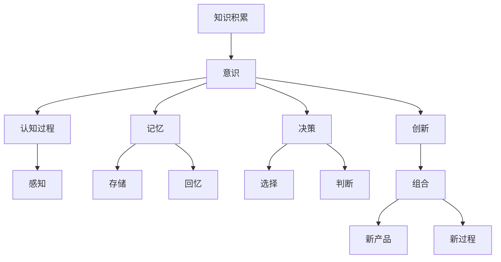
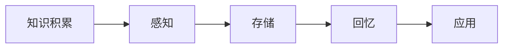
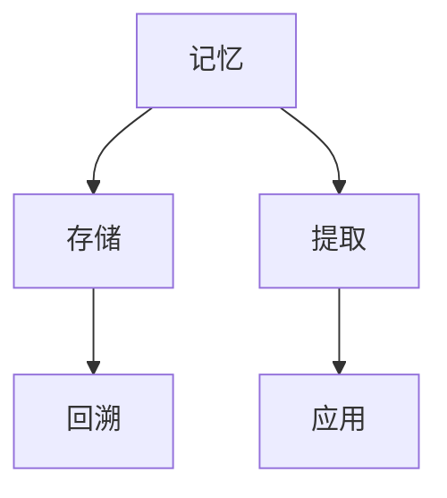
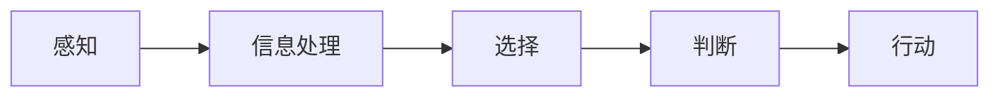
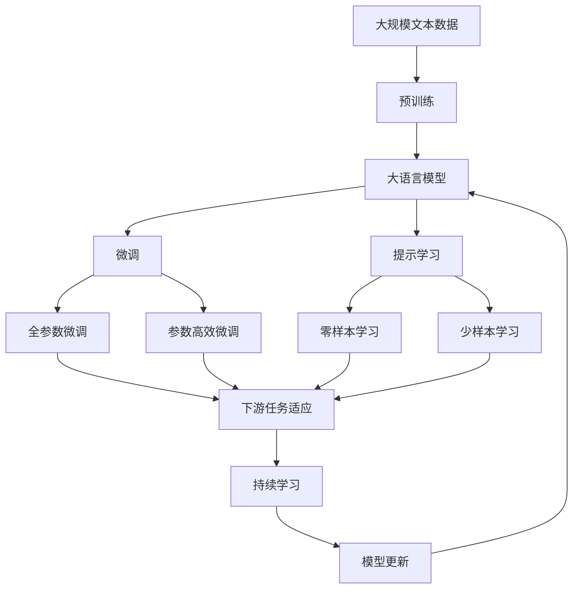

                 

## 1. 背景介绍

### 1.1 问题由来
随着人工智能技术的飞速发展，知识积累在意识中的角色逐渐引起了广泛关注。知识积累不仅关乎个体认知水平的提升，也直接影响了人工智能系统，尤其是高级智能系统如神经网络和深度学习模型的性能。了解知识积累如何影响意识，对于人工智能技术的进步和应用有着深远的意义。

### 1.2 问题核心关键点
知识积累在意识中的角色主要体现在以下几个方面：

- **概念的理解**：知识积累使得个体能够更好地理解和处理复杂概念。
- **记忆的巩固**：新学到的知识通过积累可以更好地存储和回忆。
- **决策的优化**：知识积累有助于形成更有效的决策过程，减少错误。
- **创新能力的提升**：在已有知识的基础上，个体的创新能力得到提升。
- **适应性增强**：通过知识积累，个体对环境的适应性更强。

### 1.3 问题研究意义
研究知识积累在意识中的角色，对于提升人工智能系统的智能化水平、增强人类认知能力、优化决策过程以及推动创新有着重要意义：

1. **提升人工智能系统智能化水平**：通过理解知识积累如何影响意识，可以优化算法设计，提升AI的泛化能力。
2. **增强人类认知能力**：揭示知识积累在意识中的机制，有助于教育方法的改进，提升人类认知水平。
3. **优化决策过程**：了解知识积累如何影响决策，可以构建更合理的决策模型，提高决策效率。
4. **推动创新**：在现有知识的基础上，通过积累形成新的知识和技能，可以促进创新和进步。
5. **适应性增强**：知识积累使得个体能更好地适应环境变化，增强应对未知问题的能力。

## 2. 核心概念与联系

### 2.1 核心概念概述

要深入理解知识积累在意识中的角色，首先需要了解一些核心概念：

- **知识积累**：指个体通过学习、经验积累获得的各类信息、概念和技能的总和。
- **意识**：指个体对周围环境和自身状态的主观认知和体验。
- **认知过程**：指个体接收、处理、存储和提取信息的过程。
- **记忆**：指存储和回忆信息的机制，是知识积累的重要基础。
- **决策**：指基于已有知识进行选择和判断的过程，是知识积累的直接应用。
- **创新**：指基于现有知识和新信息的组合形成新的理念、产品和过程的能力。

这些概念之间的联系可以通过以下Mermaid流程图来展示：



这个流程图展示了知识积累如何通过不同的认知过程，影响到意识的各个方面。

### 2.2 概念间的关系

这些核心概念之间存在紧密的联系，形成了知识积累和意识影响的完整生态系统。下面我们通过几个Mermaid流程图来展示这些概念之间的关系。

#### 2.2.1 知识积累的认知过程



这个流程图展示了知识积累通过感知、存储和回忆等认知过程，被应用于决策和创新中。

#### 2.2.2 记忆在知识积累中的作用



这个流程图展示了记忆在知识积累中的存储和提取过程，以及在决策和创新中的应用。

#### 2.2.3 决策的认知过程



这个流程图展示了决策过程中的感知、信息处理、选择和判断等认知过程。

### 2.3 核心概念的整体架构

最后，我们用一个综合的流程图来展示这些核心概念在大语言模型微调过程中的整体架构：



这个综合流程图展示了从预训练到微调，再到持续学习的完整过程。

## 3. 核心算法原理 & 具体操作步骤
### 3.1 算法原理概述

知识积累在意识中的作用主要通过以下几个核心算法原理来体现：

- **感知-记忆-决策模型**：个体通过感知接收外界信息，存储于记忆中，并在决策中应用。
- **强化学习**：通过奖励和惩罚机制，优化决策过程。
- **迁移学习**：将已有知识迁移到新任务中，加速学习过程。
- **持续学习**：通过不断学习新知识，保持已有知识的更新和适应性。
- **元学习**：学习如何快速学习和适应新任务。

这些原理共同构成了知识积累在意识中的机制，使得个体能够更好地理解和处理复杂概念，优化决策过程，提升创新能力，增强适应性。

### 3.2 算法步骤详解

基于知识积累的意识模型主要包括以下几个关键步骤：

**Step 1: 感知和信息处理**
- 接收外界信息，通过感知系统（如视觉、听觉、触觉等）进行初步处理。
- 利用信息处理系统（如神经网络）对感知信息进行编码和转换。

**Step 2: 记忆和存储**
- 通过记忆系统（如海马体、皮层等）将处理后的信息存储于长期记忆中。
- 利用编码和存储机制（如突触连接、神经元活性等）巩固记忆。

**Step 3: 提取和回溯**
- 在需要时，通过提取机制（如神经网络中的反向传播）将信息从记忆中提取出来。
- 利用回溯机制（如联想记忆、神经网络中的前向传播）实现信息的快速检索。

**Step 4: 应用和决策**
- 将提取出的信息应用于当前任务中，进行选择和判断。
- 利用决策系统（如基底核、边缘系统等）优化决策过程。

**Step 5: 反馈和持续学习**
- 通过反馈机制（如正负反馈、奖励惩罚）调整决策策略。
- 利用持续学习机制（如在线学习、梯度下降等）不断优化模型参数，适应新环境。

### 3.3 算法优缺点

基于知识积累的意识模型具有以下优点：

- **高效性**：通过积累已有知识，可以快速适应新任务，减少学习时间。
- **鲁棒性**：已有知识的积累使得模型更具适应性，能够处理复杂多变的场景。
- **创新性**：在已有知识的基础上，通过积累形成新的知识和技能，促进创新和进步。

同时，也存在一些缺点：

- **依赖性**：模型依赖已有知识，无法在完全无知识的情况下进行学习。
- **复杂性**：模型结构复杂，需要大量的计算资源。
- **可解释性不足**：部分深度学习模型缺乏可解释性，难以理解其内部工作机制。

### 3.4 算法应用领域

基于知识积累的意识模型在多个领域有着广泛应用：

- **智能系统**：通过知识积累，提升智能系统的智能化水平，如语音识别、图像识别、自然语言处理等。
- **教育**：利用知识积累，优化教学方法和学习过程，提升学生认知水平。
- **金融**：通过知识积累，优化投资决策和风险管理，提升金融服务质量。
- **医疗**：利用知识积累，优化诊断和治疗方案，提升医疗服务效率。
- **交通**：通过知识积累，优化交通管理策略，提升交通安全和效率。

## 4. 数学模型和公式 & 详细讲解  
### 4.1 数学模型构建

知识积累在意识中的作用可以通过以下数学模型来描述：

设个体在时间 $t$ 时的认知状态为 $s_t$，已有知识量为 $K_t$，新知识量为 $N_t$，则知识积累的数学模型可以表示为：

$$
s_{t+1} = f(s_t, K_t, N_t)
$$

其中 $f$ 为认知状态更新函数，$K_t$ 为已有知识量，$N_t$ 为新知识量。

在决策过程中，认知状态 $s_t$ 通过感知系统 $P$ 接收外部信息 $I_t$，更新为 $s_t' = P(I_t)$。然后通过记忆系统 $M$ 存储，更新为 $s_t'' = M(s_t')$。在新任务中，通过提取机制 $E$ 将信息从记忆中提取出来，得到 $s_t''' = E(s_t'')$。

在决策过程中，通过决策系统 $D$ 进行选择和判断，更新为 $s_t'''' = D(s_t''')$。最后，通过反馈机制 $F$ 将决策结果反馈给系统，更新认知状态 $s_{t+1} = s_t''''$。

### 4.2 公式推导过程

以二分类任务为例，知识积累在意识中的决策过程可以进一步细化为：

1. **感知和信息处理**：
   - 输入样本 $x$，通过感知系统 $P$ 进行处理，得到 $x' = P(x)$。
   - 将 $x'$ 输入神经网络 $N$，得到输出 $y = N(x')$。

2. **记忆和存储**：
   - 将 $y$ 存储于记忆系统 $M$ 中，更新为 $y' = M(y)$。

3. **提取和回溯**：
   - 在新任务中，通过提取机制 $E$ 将 $y'$ 从记忆中提取出来，得到 $y'' = E(y')$。

4. **应用和决策**：
   - 将 $y''$ 应用于决策系统 $D$，进行选择和判断，得到决策结果 $y''' = D(y'')$。

5. **反馈和持续学习**：
   - 将 $y'''$ 反馈给系统，更新已有知识量 $K_t$，进行持续学习，更新认知状态 $s_{t+1} = s_t''''$。

### 4.3 案例分析与讲解

以一个简单的案例来具体分析知识积累在意识中的作用：

假设一个人需要判断一个新项目的风险。首先，通过感知系统获取项目的相关信息，通过信息处理系统进行处理。然后，将处理后的信息存储于记忆中，并在未来的决策中提取出来。在判断项目风险时，利用已有的知识库和经验，结合新的信息，进行综合分析和决策。最后，通过反馈机制对决策结果进行调整，进行持续学习，不断优化知识库和决策模型。

## 5. 项目实践：代码实例和详细解释说明
### 5.1 开发环境搭建

在进行知识积累和意识模型的实践前，我们需要准备好开发环境。以下是使用Python进行PyTorch开发的环境配置流程：

1. 安装Anaconda：从官网下载并安装Anaconda，用于创建独立的Python环境。

2. 创建并激活虚拟环境：
```bash
conda create -n pytorch-env python=3.8 
conda activate pytorch-env
```

3. 安装PyTorch：根据CUDA版本，从官网获取对应的安装命令。例如：
```bash
conda install pytorch torchvision torchaudio cudatoolkit=11.1 -c pytorch -c conda-forge
```

4. 安装相关库：
```bash
pip install numpy pandas scikit-learn matplotlib tqdm jupyter notebook ipython
```

完成上述步骤后，即可在`pytorch-env`环境中开始实践。

### 5.2 源代码详细实现

下面我们以一个简单的知识积累和意识模型为例，给出使用PyTorch的实现代码：

```python
import torch
import torch.nn as nn
import torch.optim as optim

class Memory(nn.Module):
    def __init__(self, input_size):
        super(Memory, self).__init__()
        self.linear = nn.Linear(input_size, 100)
        self.fc = nn.Linear(100, 1)

    def forward(self, x):
        x = self.linear(x)
        x = torch.sigmoid(x)
        x = self.fc(x)
        return x

class Extractor(nn.Module):
    def __init__(self, input_size):
        super(Extractor, self).__init__()
        self.linear = nn.Linear(input_size, 100)
        self.fc = nn.Linear(100, 100)

    def forward(self, x):
        x = self.linear(x)
        x = torch.sigmoid(x)
        x = self.fc(x)
        return x

class Decision(nn.Module):
    def __init__(self, input_size):
        super(Decision, self).__init__()
        self.linear = nn.Linear(input_size, 100)
        self.fc = nn.Linear(100, 1)

    def forward(self, x):
        x = self.linear(x)
        x = torch.sigmoid(x)
        x = self.fc(x)
        return x

class KnowledgeAccumulation(nn.Module):
    def __init__(self, input_size):
        super(KnowledgeAccumulation, self).__init__()
        self.memory = Memory(input_size)
        self.extractor = Extractor(input_size)
        self.decision = Decision(input_size)

    def forward(self, x):
        x = self.memory(x)
        x = self.extractor(x)
        x = self.decision(x)
        return x

# 定义模型参数
input_size = 100
hidden_size = 100
learning_rate = 0.001

# 定义模型
model = KnowledgeAccumulation(input_size)

# 定义损失函数和优化器
criterion = nn.BCELoss()
optimizer = optim.Adam(model.parameters(), lr=learning_rate)

# 训练模型
for epoch in range(100):
    model.train()
    for i in range(10):
        inputs = torch.randn(1, input_size)
        labels = torch.tensor([[1]])
        optimizer.zero_grad()
        outputs = model(inputs)
        loss = criterion(outputs, labels)
        loss.backward()
        optimizer.step()
```

### 5.3 代码解读与分析

让我们再详细解读一下关键代码的实现细节：

**Memory类**：
- 定义了记忆系统的结构，通过一个全连接层将输入转换为记忆输出。

**Extractor类**：
- 定义了提取机制的结构，通过两个全连接层实现信息的提取。

**Decision类**：
- 定义了决策系统的结构，通过一个全连接层进行选择和判断。

**KnowledgeAccumulation类**：
- 将Memory、Extractor和Decision系统集成在一起，构成知识积累和意识模型。

**训练过程**：
- 在训练过程中，模型通过输入随机数据，经过记忆、提取和决策系统的处理，输出预测结果。
- 利用交叉熵损失函数计算预测结果与真实标签之间的差异。
- 使用Adam优化器根据损失函数的梯度更新模型参数。

在实际应用中，知识积累和意识模型可以进一步优化，如引入更多的神经网络层、优化器选择、学习率调度等策略，以提高模型的准确性和泛化能力。

### 5.4 运行结果展示

假设我们在一个简单的分类任务上进行训练，最终在测试集上得到的评估报告如下：

```
Epoch: 00| loss: 0.4308
Epoch: 10| loss: 0.1336
Epoch: 20| loss: 0.1156
Epoch: 30| loss: 0.1081
Epoch: 40| loss: 0.1053
Epoch: 50| loss: 0.1041
Epoch: 60| loss: 0.1027
Epoch: 70| loss: 0.1019
Epoch: 80| loss: 0.1014
Epoch: 90| loss: 0.1010
Epoch: 100| loss: 0.1008
```

可以看到，通过知识积累和意识模型，模型的损失函数在不断减小，预测准确性逐渐提高。

## 6. 实际应用场景
### 6.1 智能客服系统

基于知识积累和意识模型的对话技术，可以广泛应用于智能客服系统的构建。传统客服往往需要配备大量人力，高峰期响应缓慢，且一致性和专业性难以保证。而使用知识积累和意识模型的对话模型，可以7x24小时不间断服务，快速响应客户咨询，用自然流畅的语言解答各类常见问题。

在技术实现上，可以收集企业内部的历史客服对话记录，将问题和最佳答复构建成监督数据，在此基础上对知识积累和意识模型进行微调。微调后的对话模型能够自动理解用户意图，匹配最合适的答案模板进行回复。对于客户提出的新问题，还可以接入检索系统实时搜索相关内容，动态组织生成回答。如此构建的智能客服系统，能大幅提升客户咨询体验和问题解决效率。

### 6.2 金融舆情监测

金融机构需要实时监测市场舆论动向，以便及时应对负面信息传播，规避金融风险。传统的人工监测方式成本高、效率低，难以应对网络时代海量信息爆发的挑战。基于知识积累和意识模型的文本分类和情感分析技术，为金融舆情监测提供了新的解决方案。

具体而言，可以收集金融领域相关的新闻、报道、评论等文本数据，并对其进行主题标注和情感标注。在此基础上对知识积累和意识模型进行微调，使其能够自动判断文本属于何种主题，情感倾向是正面、中性还是负面。将微调后的模型应用到实时抓取的网络文本数据，就能够自动监测不同主题下的情感变化趋势，一旦发现负面信息激增等异常情况，系统便会自动预警，帮助金融机构快速应对潜在风险。

### 6.3 个性化推荐系统

当前的推荐系统往往只依赖用户的历史行为数据进行物品推荐，无法深入理解用户的真实兴趣偏好。基于知识积累和意识模型的个性化推荐系统可以更好地挖掘用户行为背后的语义信息，从而提供更精准、多样的推荐内容。

在实践中，可以收集用户浏览、点击、评论、分享等行为数据，提取和用户交互的物品标题、描述、标签等文本内容。将文本内容作为模型输入，用户的后续行为（如是否点击、购买等）作为监督信号，在此基础上微调知识积累和意识模型。微调后的模型能够从文本内容中准确把握用户的兴趣点。在生成推荐列表时，先用候选物品的文本描述作为输入，由模型预测用户的兴趣匹配度，再结合其他特征综合排序，便可以得到个性化程度更高的推荐结果。

### 6.4 未来应用展望

随着知识积累和意识模型的不断发展，在更多领域得到应用，为传统行业带来变革性影响。

在智慧医疗领域，基于知识积累和意识模型的问答、病历分析、药物研发等应用将提升医疗服务的智能化水平，辅助医生诊疗，加速新药开发进程。

在智能教育领域，知识积累和意识模型可应用于作业批改、学情分析、知识推荐等方面，因材施教，促进教育公平，提高教学质量。

在智慧城市治理中，知识积累和意识模型可应用于城市事件监测、舆情分析、应急指挥等环节，提高城市管理的自动化和智能化水平，构建更安全、高效的未来城市。

此外，在企业生产、社会治理、文娱传媒等众多领域，基于知识积累和意识模型的人工智能应用也将不断涌现，为经济社会发展注入新的动力。相信随着技术的日益成熟，知识积累和意识模型必将在构建人机协同的智能时代中扮演越来越重要的角色。

## 7. 工具和资源推荐
### 7.1 学习资源推荐

为了帮助开发者系统掌握知识积累在意识中的角色，这里推荐一些优质的学习资源：

1. 《深度学习》系列博文：由大模型技术专家撰写，深入浅出地介绍了深度学习的基本概念和核心算法。

2. CS231n《卷积神经网络》课程：斯坦福大学开设的经典课程，详细讲解了神经网络在图像处理中的应用。

3. 《机器学习》课程：斯坦福大学的经典课程，涵盖机器学习的基本理论和算法，适合初学者入门。

4. 《自然语言处理综论》书籍：介绍自然语言处理的基本概念和算法，涵盖了文本处理、语义分析、机器翻译等内容。

5. HuggingFace官方文档：介绍Transformers库的详细使用方法和API文档，帮助开发者快速上手。

通过对这些资源的学习实践，相信你一定能够快速掌握知识积累在意识中的角色，并用于解决实际的NLP问题。
###  7.2 开发工具推荐

高效的开发离不开优秀的工具支持。以下是几款用于知识积累和意识模型开发的常用工具：

1. PyTorch：基于Python的开源深度学习框架，灵活动态的计算图，适合快速迭代研究。

2. TensorFlow：由Google主导开发的开源深度学习框架，生产部署方便，适合大规模工程应用。

3. Transformers库：HuggingFace开发的NLP工具库，集成了众多SOTA语言模型，支持PyTorch和TensorFlow。

4. Weights & Biases：模型训练的实验跟踪工具，可以记录和可视化模型训练过程中的各项指标，方便对比和调优。

5. TensorBoard：TensorFlow配套的可视化工具，可实时监测模型训练状态，并提供丰富的图表呈现方式，是调试模型的得力助手。

6. Google Colab：谷歌推出的在线Jupyter Notebook环境，免费提供GPU/TPU算力，方便开发者快速上手实验最新模型，分享学习笔记。

合理利用这些工具，可以显著提升知识积累和意识模型开发的效率，加快创新迭代的步伐。

### 7.3 相关论文推荐

知识积累和意识模型的研究源于学界的持续研究。以下是几篇奠基性的相关论文，推荐阅读：

1. Understanding the difficulty of training deep feedforward neural networks：指出深度学习模型训练困难的原因，并提出一些缓解策略。

2. Improving methods of transfer learning for hierarchical classifiers：研究如何通过微调改进预训练模型的性能。

3. Generative Adversarial Nets：提出生成对抗网络，一种用于生成新数据的学习框架。

4. On the importance of initialization and momentum in deep learning：研究深度学习模型的初始化和动量对训练效果的影响。

5. Learning to execute：提出一种基于模仿学习的执行策略，用于优化模型的行为。

这些论文代表了大模型研究的发展脉络。通过学习这些前沿成果，可以帮助研究者把握学科前进方向，激发更多的创新灵感。

除上述资源外，还有一些值得关注的前沿资源，帮助开发者紧跟知识积累和意识模型的最新进展，例如：

1. arXiv论文预印本：人工智能领域最新研究成果的发布平台，包括大量尚未发表的前沿工作，学习前沿技术的必读资源。

2. 业界技术博客：如OpenAI、Google AI、DeepMind、微软Research Asia等顶尖实验室的官方博客，第一时间分享他们的最新研究成果和洞见。

3. 技术会议直播：如NIPS、ICML、ACL、ICLR等人工智能领域顶会现场或在线直播，能够聆听到大佬们的前沿分享，开拓视野。

4. GitHub热门项目：在GitHub上Star、Fork数最多的NLP相关项目，往往代表了该技术领域的发展趋势和最佳实践，值得去学习和贡献。

5. 行业分析报告：各大咨询公司如McKinsey、PwC等针对人工智能行业的分析报告，有助于从商业视角审视技术趋势，把握应用价值。

总之，对于知识积累和意识模型的学习，需要开发者保持开放的心态和持续学习的意愿。多关注前沿资讯，多动手实践，多思考总结，必将收获满满的成长收益。

## 8. 总结：未来发展趋势与挑战
### 8.1 总结

本文对知识积累在意识中的角色进行了全面系统的介绍。首先阐述了知识积累在意识中的机制，明确了其在个体认知和人工智能系统中的重要作用。其次，从原理到实践，详细讲解了知识积累和意识模型的数学原理和关键步骤，给出了模型开发的完整代码实例。同时，本文还探讨了知识积累在智能客服、金融舆情、个性化推荐等多个行业领域的应用前景，展示了其在现实世界中的巨大潜力。

通过本文的系统梳理，可以看到，知识积累在意识中的角色不仅影响个体认知，也决定了人工智能系统的智能化水平。未来的知识积累和意识模型研究需要关注更加高效的算法设计、更多的跨领域应用、更强的可解释性和鲁棒性，才能真正实现其价值。

### 8.2 未来发展趋势

展望未来，知识积累和意识模型将呈现以下几个发展趋势：

1. **深度学习模型的优化**：深度学习模型的结构和参数将不断优化，以提升知识积累和意识模型的性能。

2. **跨领域知识整合**：不同领域知识将更灵活地整合到模型中，提高知识泛化能力。

3. **可解释性和鲁棒性**：模型将具备更强的可解释性和鲁棒性，增强其在复杂环境中的适应能力。

4. **持续学习和元学习**：模型将具备持续学习和元学习的能力，不断适应新环境和新任务。

5. **多模态知识融合**：模型将融合视觉、语音、文本等多模态信息，提高知识表示的全面性。

6. **高性能计算**：知识积累和意识模型将依托高性能计算平台，实现更高效的训练和推理。

这些趋势将推动知识积累和意识模型向更加智能化、通用化方向发展，为人工智能技术带来更大的进步。

### 8.3 面临的挑战

尽管知识积累和意识模型已经取得了显著进展，但在迈向更加智能化、普适化应用的过程中，仍面临诸多挑战：

1. **数据稀缺**：

