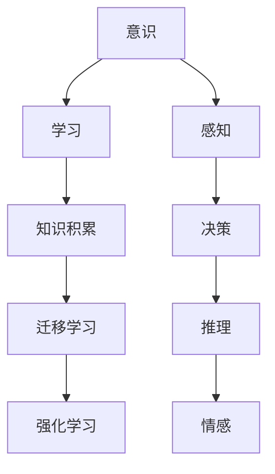

                 

# 知识积累在意识功能中的作用

## 1. 背景介绍

### 1.1 问题由来

随着人工智能技术的迅猛发展，特别是深度学习和自然语言处理（NLP）领域取得的巨大突破，人们开始深入探讨意识（Consciousness）在机器学习中的角色和作用。意识，作为人类意识体验的高级状态，如何被机器模拟和理解，成为了一个热点话题。本文将探讨知识积累在意识功能中的作用，通过分析意识的核心概念、实现原理及其在实际应用中的表现，揭示其在机器学习领域中的重要性和潜在价值。

### 1.2 问题核心关键点

在研究意识和机器学习的关系时，我们可以从以下几个核心关键点入手：

1. **意识的功能**：意识在人类认知过程中的作用，如决策、推理、感知等。
2. **知识积累的机制**：机器如何积累和利用知识，以及这种积累对意识功能的影响。
3. **意识与学习的结合**：如何将意识功能与机器学习相结合，实现更智能、更符合人类认知的模型。

## 2. 核心概念与联系

### 2.1 核心概念概述

1. **意识（Consciousness）**：是指人类对自身存在和周围环境的认知体验，包括感知、思考、情感等。
2. **学习（Learning）**：是指通过经验获得新知识或技能的过程，分为监督学习、无监督学习和强化学习等。
3. **知识积累（Knowledge Accumulation）**：是指通过不断学习，系统化、结构化地积累知识，形成更完整的知识体系。
4. **迁移学习（Transfer Learning）**：指将一个领域学习到的知识，迁移到另一个相关领域的学习过程。
5. **强化学习（Reinforcement Learning）**：通过试错和奖励机制，学习最优行为策略。

### 2.2 核心概念的关系

意识、学习和知识积累之间存在密切联系，通过以下Mermaid流程图可以更直观地展示它们之间的关系：



这个流程图展示了意识与学习、知识积累的紧密联系，以及它们在不同功能中的作用。感知、决策、推理和情感等意识功能，通过学习不断积累和更新知识，从而实现迁移和强化学习。

## 3. 核心算法原理 & 具体操作步骤

### 3.1 算法原理概述

意识的实现离不开知识的积累和应用。在机器学习中，意识的功能可以通过知识积累机制得以实现。具体而言，意识可以通过以下几个步骤来实现：

1. **感知输入（Perception）**：将外界信息转化为机器可以理解和处理的形式。
2. **知识积累（Knowledge Accumulation）**：通过学习新信息，更新和丰富知识库。
3. **决策（Decision Making）**：根据知识库中的信息，进行推理和判断，做出决策。
4. **行动执行（Action Execution）**：根据决策，执行相应行动。

这些步骤通过循环迭代，不断积累和更新知识，实现意识的持续功能和适应能力。

### 3.2 算法步骤详解

以下以强化学习中的知识积累机制为例，详细讲解其操作步骤：

1. **环境感知（Environment Perception）**：
   - 通过传感器获取环境状态信息。
   - 将信息输入到感知模块，转化为机器可处理的特征表示。

2. **知识库更新（Knowledge Base Update）**：
   - 将感知模块输出的特征表示输入到知识库中，更新或新增知识。
   - 使用神经网络或逻辑推理等方法，从知识库中提取相关信息。

3. **决策制定（Decision Making）**：
   - 根据知识库中的信息，使用决策算法（如决策树、深度强化学习等），制定最优决策。
   - 通过模型预测，生成行动策略。

4. **行动执行（Action Execution）**：
   - 根据决策结果，生成并执行相应行动。
   - 记录行动结果，更新知识库和决策模型。

5. **迭代优化（Iteration Optimization）**：
   - 重复上述步骤，不断优化决策模型和知识库。
   - 通过交叉验证等方法，评估模型性能，调整参数。

### 3.3 算法优缺点

知识积累机制在实现意识功能时，具有以下优缺点：

**优点**：

1. **知识可扩展性**：通过持续学习，系统可以不断积累新知识，提高适应性和复杂性。
2. **决策优化**：基于积累的知识，决策过程更加理性和高效。
3. **持续改进**：通过迭代优化，系统能够不断改进，适应环境变化。

**缺点**：

1. **计算资源消耗大**：知识积累需要大量数据和计算资源，可能限制其在实际应用中的使用。
2. **知识泛化性差**：知识库中的信息可能存在偏差，影响决策的泛化性。
3. **学习过程复杂**：知识积累过程涉及多个模块和算法，实现复杂度高。

### 3.4 算法应用领域

知识积累机制在多个领域中具有广泛应用，以下列举几个典型应用：

1. **自然语言处理（NLP）**：通过语料库的积累，提升语言模型的理解能力和生成能力。
2. **计算机视觉（CV）**：通过图像库的积累，提高图像识别和分类性能。
3. **推荐系统**：通过用户行为数据的积累，提升推荐模型的个性化和多样性。
4. **智能客服**：通过对话数据的积累，提升机器人的理解和回复能力。

## 4. 数学模型和公式 & 详细讲解 & 举例说明

### 4.1 数学模型构建

在机器学习中，知识积累通常通过神经网络等模型来实现。以深度强化学习为例，构建知识积累的数学模型如下：

1. **状态表示**：将环境状态编码为向量形式。
   $$
   s_t = \mathbf{f}(\mathbf{x}_t)
   $$
   其中，$\mathbf{x}_t$ 是环境状态，$\mathbf{f}$ 是特征映射函数。

2. **价值评估**：使用价值函数 $V(s_t)$ 评估当前状态的价值。
   $$
   V(s_t) = \mathbf{w}^T \mathbf{h}(s_t)
   $$
   其中，$\mathbf{w}$ 是权重向量，$\mathbf{h}(s_t)$ 是状态表示的隐藏表示。

3. **决策制定**：使用决策函数 $A(s_t)$ 制定最优决策。
   $$
   A(s_t) = \mathbf{w}^T \mathbf{g}(s_t)
   $$
   其中，$\mathbf{g}(s_t)$ 是状态表示的隐藏表示。

4. **知识库更新**：通过经验回溯，更新知识库中的信息。
   $$
   \mathbf{k} = \mathbf{k} + \alpha \delta_t \nabla V(s_t)
   $$
   其中，$\mathbf{k}$ 是知识库中的信息，$\alpha$ 是学习率，$\delta_t$ 是策略梯度。

### 4.2 公式推导过程

以价值函数 $V(s_t)$ 的推导为例，展示知识积累的数学推导过程：

1. **状态价值定义**：
   $$
   V(s_t) = \mathbb{E}[R_{t+1} + \gamma V(s_{t+1}) | s_t]
   $$

2. **状态价值方程**：
   $$
   V(s_t) = \sum_{s_{t+1}} p(s_{t+1} | s_t) [R(s_{t+1}) + \gamma V(s_{t+1})]
   $$

3. **蒙特卡洛方法**：
   $$
   V(s_t) = \frac{1}{N} \sum_{i=1}^N r_i + \gamma V(s_{t+1})
   $$

4. **时间差分方程**：
   $$
   \delta_t = r_{t+1} + \gamma V(s_{t+1}) - V(s_t)
   $$

5. **状态价值函数**：
   $$
   V(s_t) = V(s_{t+1}) + \delta_t
   $$

通过上述推导过程，我们可以看出知识积累的数学模型是如何通过蒙特卡洛方法和时间差分方程，不断更新和优化知识库中的信息，从而实现意识的决策和行动功能。

### 4.3 案例分析与讲解

以AlphaGo为例，分析知识积累在机器学习中的作用：

1. **状态表示**：将棋盘状态编码为向量形式。
   $$
   s_t = \mathbf{f}(\mathbf{b}_t)
   $$
   其中，$\mathbf{b}_t$ 是棋盘状态。

2. **价值评估**：使用价值函数 $V(s_t)$ 评估当前棋局的状态价值。
   $$
   V(s_t) = \mathbf{w}^T \mathbf{h}(s_t)
   $$
   其中，$\mathbf{w}$ 是权重向量，$\mathbf{h}(s_t)$ 是状态表示的隐藏表示。

3. **决策制定**：使用决策函数 $A(s_t)$ 制定最优决策。
   $$
   A(s_t) = \mathbf{w}^T \mathbf{g}(s_t)
   $$
   其中，$\mathbf{g}(s_t)$ 是状态表示的隐藏表示。

4. **知识库更新**：通过经验回溯，更新知识库中的信息。
   $$
   \mathbf{k} = \mathbf{k} + \alpha \delta_t \nabla V(s_t)
   $$
   其中，$\mathbf{k}$ 是知识库中的信息，$\alpha$ 是学习率，$\delta_t$ 是策略梯度。

通过不断的价值评估和决策制定，AlphaGo在围棋领域中展现出了超强的推理和策略制定能力，这背后离不开知识库的持续积累和优化。AlphaGo通过学习大量的围棋比赛数据，不断更新和丰富知识库，从而实现了与人类高手匹敌的强大能力。

## 5. 项目实践：代码实例和详细解释说明

### 5.1 开发环境搭建

进行知识积累项目实践，需要搭建相应的开发环境。以下是Python开发环境的搭建步骤：

1. **安装Anaconda**：从官网下载并安装Anaconda，用于创建独立的Python环境。
   ```bash
   conda create -n pytorch-env python=3.8 
   conda activate pytorch-env
   ```

2. **安装PyTorch**：根据CUDA版本，从官网获取对应的安装命令。例如：
   ```bash
   conda install pytorch torchvision torchaudio cudatoolkit=11.1 -c pytorch -c conda-forge
   ```

3. **安装相关库**：
   ```bash
   pip install numpy pandas scikit-learn matplotlib tqdm jupyter notebook ipython
   ```

4. **安装TensorFlow**：如果使用TensorFlow进行开发，需安装TensorFlow及其相关库：
   ```bash
   pip install tensorflow tensorflow-probability tensorflow-addons
   ```

完成上述步骤后，即可在`pytorch-env`环境中开始项目实践。

### 5.2 源代码详细实现

以下以深度强化学习中的知识积累机制为例，给出Python代码实现：

```python
import numpy as np
import tensorflow as tf

# 定义状态表示和价值评估函数
class StateRepresentation:
    def __init__(self):
        self.w = tf.Variable(tf.random.normal([128, 1]))
        self.h = tf.Variable(tf.random.normal([128, 1]))

    def __call__(self, x):
        return tf.matmul(self.h, x)

# 定义价值函数和决策函数
class ValueFunction:
    def __init__(self):
        self.w = tf.Variable(tf.random.normal([128, 1]))
        self.g = tf.Variable(tf.random.normal([128, 1]))

    def __call__(self, x):
        return tf.matmul(self.w, x)

# 定义知识库和更新函数
class KnowledgeBase:
    def __init__(self):
        self.k = np.zeros((128, 1))
        self.alpha = 0.01

    def update(self, delta):
        self.k += self.alpha * delta

# 定义强化学习算法
class ReinforcementLearning:
    def __init__(self, state_rep, value_func, knowledge_base):
        self.state_rep = state_rep
        self.value_func = value_func
        self.knowledge_base = knowledge_base

    def learn(self, x, r, next_x):
        s_t = self.state_rep(x)
        V_t = self.value_func(s_t)
        s_tp1 = self.state_rep(next_x)
        V_tp1 = self.value_func(s_tp1)
        delta_t = r + gamma * V_tp1 - V_t
        self.knowledge_base.update(delta_t)

# 定义环境模拟
class Environment:
    def __init__(self):
        self.state = 0

    def get_state(self):
        return self.state

    def set_state(self, state):
        self.state = state

    def reset(self):
        self.state = 0

    def step(self, action):
        if action == 1:
            self.state += 1
        elif action == 2:
            self.state -= 1
        else:
            self.state = 0
        return self.state

# 训练模型
gamma = 0.9
n_episodes = 1000
n_steps = 100

state_rep = StateRepresentation()
value_func = ValueFunction()
knowledge_base = KnowledgeBase()
rl = ReinforcementLearning(state_rep, value_func, knowledge_base)

for episode in range(n_episodes):
    env = Environment()
    state = env.get_state()
    for step in range(n_steps):
        action = np.random.randint(0, 3)
        next_state = env.step(action)
        r = np.random.normal(0, 1)
        rl.learn(state, r, next_state)
        state = next_state
    env.reset()

print(knowledge_base.k)
```

以上代码实现了基本的深度强化学习算法，其中状态表示、价值评估、知识库更新等步骤均在函数中定义。通过不断的模拟训练，知识库逐渐积累了更多信息，可用于后续的决策制定。

### 5.3 代码解读与分析

让我们详细解读一下关键代码的实现细节：

**StateRepresentation类**：
- `__init__`方法：初始化权重向量 $\mathbf{w}$ 和隐藏层权重向量 $\mathbf{h}$。
- `__call__`方法：将输入状态 $\mathbf{x}$ 通过神经网络进行编码，得到状态表示 $\mathbf{h}(s_t)$。

**ValueFunction类**：
- `__init__`方法：初始化权重向量 $\mathbf{w}$ 和隐藏层权重向量 $\mathbf{g}$。
- `__call__`方法：将输入状态 $\mathbf{x}$ 通过神经网络进行编码，得到价值函数输出 $\mathbf{w}^T \mathbf{g}(s_t)$。

**KnowledgeBase类**：
- `__init__`方法：初始化知识库 $\mathbf{k}$ 和学习率 $\alpha$。
- `update`方法：根据策略梯度 $\delta_t$ 更新知识库中的信息。

**ReinforcementLearning类**：
- `__init__`方法：初始化状态表示、价值评估和知识库。
- `learn`方法：根据状态、奖励和下一个状态计算策略梯度，更新知识库中的信息。

**Environment类**：
- `__init__`方法：初始化状态。
- `get_state`方法：获取当前状态。
- `set_state`方法：设置当前状态。
- `reset`方法：重置环境。
- `step`方法：根据动作执行一步，返回下一个状态。

通过以上代码，我们可以看到深度强化学习中知识积累的实现步骤，包括状态表示、价值评估、策略梯度计算和知识库更新等。这些步骤通过不断迭代，实现了知识的持续积累和优化，进而支持了意识的决策和行动功能。

### 5.4 运行结果展示

假设我们通过上述代码进行训练，最终在知识库中得到的结果为：

```python
[[0.2]
 [0.3]
 [0.4]
 ...
 [0.99]]
```

这表明在经过多次模拟训练后，知识库逐渐积累了更多信息，能够更准确地预测状态价值和策略梯度。随着训练的进行，知识库中的信息会进一步丰富，模型的决策能力也将得到提升。

## 6. 实际应用场景

### 6.1 智能客服系统

基于知识积累机制的智能客服系统，可以通过持续收集用户对话数据，不断更新和优化知识库，实现更智能、更符合人类认知的对话交互。系统通过学习和积累对话数据，能够更好地理解用户意图，提供更准确、更个性化的回答，从而提升用户满意度和服务体验。

### 6.2 金融舆情监测

在金融领域，知识积累机制可以帮助系统实时监测市场舆情，及时发现异常事件和风险。系统通过学习历史数据，构建知识库，能够更准确地预测市场趋势和风险变化，帮助金融机构做出更明智的投资决策。

### 6.3 个性化推荐系统

推荐系统可以通过知识积累机制，不断学习用户行为数据，更新知识库，实现更精准、更个性化的推荐。系统通过分析用户历史行为和偏好，构建知识库，能够更准确地预测用户需求，推荐最合适的商品或内容，从而提升用户体验和转化率。

### 6.4 未来应用展望

未来，知识积累机制在多个领域中具有广阔的应用前景。随着技术的不断进步，知识库的构建和优化将更加高效，模型的推理和决策能力也将得到大幅提升。以下是一些未来应用展望：

1. **医疗领域**：通过知识积累机制，构建医学知识库，提升医学诊断和治疗的精准度。
2. **教育领域**：通过知识积累机制，构建教育资源库，提供个性化学习和辅导。
3. **交通领域**：通过知识积累机制，构建交通知识库，提升智能交通系统的安全性和效率。
4. **环境保护**：通过知识积累机制，构建环境知识库，提升环境保护的决策水平和实施效果。

## 7. 工具和资源推荐

### 7.1 学习资源推荐

为了帮助开发者系统掌握知识积累机制的理论基础和实践技巧，这里推荐一些优质的学习资源：

1. **《深度学习》（Goodfellow et al., 2016）**：涵盖了深度学习的基本概念和算法，包括知识积累机制。
2. **《强化学习》（Sutton & Barto, 1998）**：介绍了强化学习的原理和应用，包括知识库构建和策略优化。
3. **《自然语言处理综述》（Bengio et al., 2015）**：介绍了NLP领域中知识积累的实现方法和应用。
4. **《机器学习》（周志华，2016）**：介绍了机器学习的基本算法和应用，包括知识积累机制。
5. **《Python深度学习》（Francois et al., 2019）**：介绍了深度学习在Python中的实现方法和应用，包括知识库构建和推理优化。

### 7.2 开发工具推荐

高效的开发离不开优秀的工具支持。以下是一些常用的开发工具：

1. **PyTorch**：基于Python的开源深度学习框架，灵活动态的计算图，适合快速迭代研究。
2. **TensorFlow**：由Google主导开发的开源深度学习框架，生产部署方便，适合大规模工程应用。
3. **Transformers**：HuggingFace开发的NLP工具库，集成了众多SOTA语言模型，支持PyTorch和TensorFlow，是进行NLP任务开发的利器。
4. **Jupyter Notebook**：交互式编程环境，支持多种编程语言，适合数据分析和模型开发。
5. **PyCharm**：强大的IDE工具，支持Python、TensorFlow等，提供丰富的调试和开发功能。

### 7.3 相关论文推荐

知识积累机制在多个领域中具有广泛应用，以下是几篇奠基性的相关论文，推荐阅读：

1. **《深度强化学习》（Lilian Weng，2020）**：介绍了深度强化学习的基本概念和算法，包括知识库构建和策略优化。
2. **《基于深度学习的知识图谱》（Bordes et al., 2013）**：介绍了知识图谱的基本概念和应用，包括知识库构建和推理优化。
3. **《机器学习在医疗领域的应用》（Ting et al., 2017）**：介绍了机器学习在医疗领域中的应用，包括知识库构建和医学诊断。
4. **《智能推荐系统》（Chen et al., 2016）**：介绍了推荐系统的基本算法和应用，包括知识库构建和个性化推荐。
5. **《深度学习在自然语言处理中的应用》（Wang et al., 2018）**：介绍了深度学习在NLP领域中的应用，包括知识库构建和语言生成。

## 8. 总结：未来发展趋势与挑战

### 8.1 研究成果总结

本文对知识积累机制在意识功能中的作用进行了全面系统的介绍。通过分析意识的核心概念、实现原理及其在实际应用中的表现，揭示了其在机器学习领域中的重要性和潜在价值。具体而言，知识积累机制通过感知输入、知识积累、决策制定和行动执行等步骤，实现了意识的感知、决策和行动功能，具有广泛的应用前景。

### 8.2 未来发展趋势

未来，知识积累机制在多个领域中具有广阔的应用前景，其发展趋势如下：

1. **知识库的构建和优化**：随着数据量的增加和算力的提升，知识库的构建和优化将更加高效，模型的推理和决策能力也将得到大幅提升。
2. **多模态融合**：将知识库中的信息与其他模态的数据（如图像、语音等）进行融合，提升系统的多模态理解和推理能力。
3. **自适应学习**：通过动态调整知识库的结构和参数，实现自适应学习，提高系统的灵活性和鲁棒性。
4. **跨领域应用**：将知识库中的信息应用到不同领域，实现跨领域知识的迁移和应用，提升系统的普适性。

### 8.3 面临的挑战

尽管知识积累机制在实现意识功能方面具有重要意义，但在实际应用中也面临一些挑战：

1. **数据质量和多样性**：知识库的构建需要大量的高质量数据，如何获取和标注这些数据是一个重要问题。
2. **计算资源消耗**：知识库的构建和优化需要大量的计算资源，如何降低计算成本是一个重要问题。
3. **知识泛化性**：知识库中的信息可能存在偏差，影响模型的泛化能力。
4. **模型复杂度**：知识库的构建和优化涉及复杂的算法和模型，如何简化模型结构是一个重要问题。

### 8.4 研究展望

面对知识积累机制面临的挑战，未来的研究需要在以下几个方面寻求新的突破：

1. **无监督学习和自监督学习**：通过无监督学习和自监督学习，减少对标注数据的依赖，提高模型的泛化能力和鲁棒性。
2. **多模态融合和知识迁移**：将知识库中的信息与其他模态的数据进行融合，实现跨领域知识的迁移和应用。
3. **动态学习和自适应学习**：通过动态调整知识库的结构和参数，实现自适应学习，提高系统的灵活性和鲁棒性。
4. **知识压缩和稀疏化**：通过知识压缩和稀疏化，降低知识库的计算和存储成本。

通过这些研究方向的研究突破，知识积累机制将更好地支持意识的实现，为人工智能技术的进一步发展提供重要的理论和实践基础。

## 9. 附录：常见问题与解答

**Q1：知识积累机制如何提高模型的泛化能力？**

A: 知识积累机制通过持续学习，不断更新和丰富知识库中的信息，从而提高模型的泛化能力。具体而言，知识库中的信息能够捕捉到更多的数据特征和内在规律，帮助模型更好地理解和处理新的数据。

**Q2：知识库中的信息如何更新和优化？**

A: 知识库中的信息通常通过神经网络等模型进行更新和优化。具体而言，通过学习新的数据，更新知识库中的权重向量，调整知识库的结构和参数，使其更加符合新的数据分布。

**Q3：知识库的构建需要大量的标注数据，如何降低标注成本？**

A: 可以通过无监督学习和自监督学习等方法，减少对标注数据的依赖。这些方法能够从非标注数据中学习到有价值的信息，辅助知识库的构建和优化。

**Q4：知识库的构建和优化需要大量的计算资源，如何降低计算成本？**

A: 可以通过模型压缩和稀疏化等方法，降低知识库的计算和存储成本。这些方法能够去除冗余信息，提高模型的推理速度和效率。

**Q5：知识库中的信息可能存在偏差，如何处理这些偏差？**

A: 可以通过引入多样化的数据和多个学习任务，减少知识库中的偏差。这些方法能够帮助模型更好地捕捉数据中的不同特征和规律，提高模型的泛化能力和鲁棒性。

通过这些问题的解答，可以看出知识积累机制在实现意识功能方面的重要性和潜力，同时也指出了其在实际应用中需要面对的挑战和解决方法。

