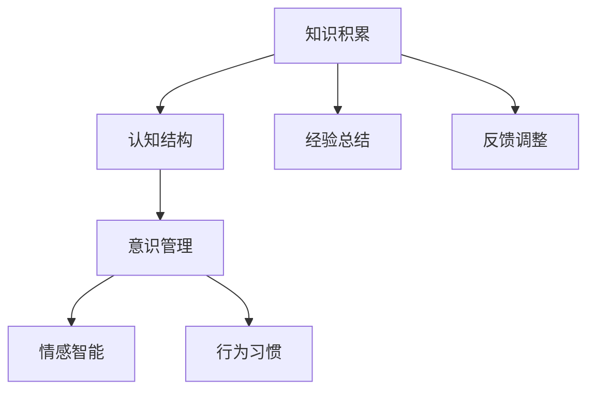
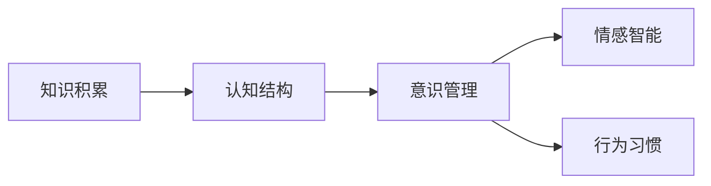
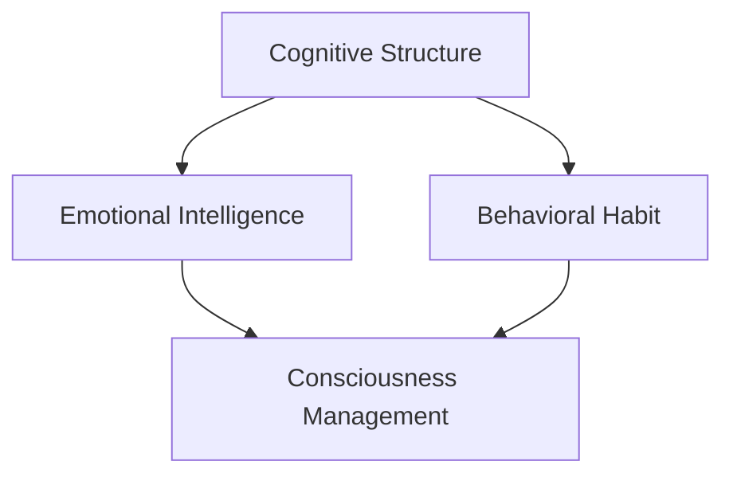
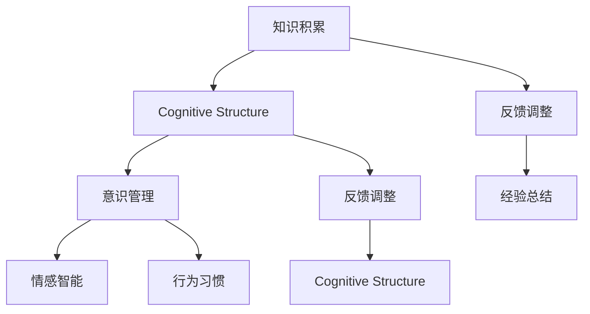

                 

# 知识积累在意识管理中的作用

## 1. 背景介绍

### 1.1 问题由来
随着信息技术的发展，人们获取知识和信息的途径日益多样，知识的积累和应用方式也发生了深刻变化。在此背景下，知识管理（Knowledge Management, KM）的概念应运而生，旨在通过系统化的方法和工具，促进知识的获取、存储、共享和应用，以提升组织和个人的工作效率和创新能力。然而，在实际应用中，知识积累和意识管理（Consciousness Management, CM）之间存在密切联系，但相关研究和探讨相对较少。本文旨在探讨知识积累在意识管理中的作用，为知识管理和意识管理提供新的视角和方法。

### 1.2 问题核心关键点
意识管理是指通过对个体的认知、情感、行为等进行科学管理，提升个体的整体效能。而知识积累则是指通过不断的学习和实践，积累和存储各种知识，形成个人的知识体系。两者之间的关系密切，但并不是简单的线性关系。

- 知识积累是意识管理的基础。通过知识积累，个体可以构建起全面的认知结构，增强对环境的感知和理解能力，从而更好地管理和调整自己的意识状态。
- 意识管理有助于知识的有效应用。通过对意识状态的科学管理，个体可以更高效地利用已积累的知识，避免知识浪费和遗忘，提升工作效率和学习效果。

## 2. 核心概念与联系

### 2.1 核心概念概述

为更好地理解知识积累在意识管理中的作用，本节将介绍几个密切相关的核心概念：

- **知识积累（Knowledge Accumulation）**：指个体或组织通过学习、实践、反思等方式，不断获取、存储和巩固各类知识，形成个人的知识体系。
- **意识管理（Consciousness Management）**：通过科学的方法和工具，对个体的认知、情感、行为等进行管理和调整，提升个体的整体效能。
- **认知结构（Cognitive Structure）**：指个体通过长期的知识积累和学习，形成的较为稳定的认知框架和思维模式。
- **情感智能（Emotional Intelligence）**：指个体管理和理解自己及他人情感的能力，包括自我认知、自我调节、人际关系管理等。
- **行为习惯（Behavioral Habit）**：指个体在长期实践和反复训练中形成的自动化行为模式，通常与特定情境和动机相关。

这些概念之间的逻辑关系可以通过以下Mermaid流程图来展示：



这个流程图展示了大语言模型微调过程中各个核心概念之间的关系：

1. 知识积累通过经验总结和反馈调整不断提升认知结构，形成更加全面和准确的思维模式。
2. 意识管理通过管理情感智能和行为习惯，提升个体在特定情境下的整体效能。
3. 认知结构、情感智能和行为习惯共同构成了个体的意识管理基础，实现对认知、情感和行为的科学管理。
4. 知识积累不断通过经验总结和反馈调整，不断优化认知结构，进而影响意识管理的效果。

### 2.2 概念间的关系

这些核心概念之间存在着紧密的联系，形成了知识管理和意识管理的内在生态系统。下面我们通过几个Mermaid流程图来展示这些概念之间的关系。

#### 2.2.1 知识积累和意识管理的关系



这个流程图展示了知识积累通过认知结构的提升，对意识管理的影响。认知结构的改善有助于情感智能和行为习惯的管理，从而提升个体的整体效能。

#### 2.2.2 认知结构、情感智能和行为习惯的互动



这个流程图展示了认知结构、情感智能和行为习惯之间的互动关系。认知结构的优化有助于情感智能的提升，而情感智能和行为习惯的改善又反过来促进认知结构的完善，形成一个动态的互动过程。

#### 2.2.3 知识积累的反馈循环



这个流程图展示了知识积累的反馈循环。知识积累通过认知结构、情感智能和行为习惯的优化，不断提升意识管理的效果。同时，意识管理过程中的反馈调整和经验总结，又反过来促进了知识积累的深化和拓展。

## 3. 核心算法原理 & 具体操作步骤
### 3.1 算法原理概述

知识积累和意识管理之间的关系，可以通过以下算法原理来进一步阐释：

假设个体的认知结构为 $C$，情感智能为 $E$，行为习惯为 $H$，知识积累为 $K$。则知识积累对意识管理的影响可以表示为：

$$
C_{next} = f(C_{cur}, E_{cur}, H_{cur}, K)
$$

其中 $C_{cur}$ 和 $E_{cur}$ 分别表示当前时刻的认知结构和情感智能状态，$H_{cur}$ 表示当前时刻的行为习惯。$f$ 为一个映射函数，表示知识积累对意识管理的动态影响。

同样地，意识管理对知识积累的影响可以表示为：

$$
K_{next} = g(K_{cur}, C_{next}, E_{next}, H_{next})
$$

其中 $C_{next}$、$E_{next}$ 和 $H_{next}$ 分别表示意识管理后的认知结构、情感智能和行为习惯状态，$g$ 为一个映射函数，表示意识管理对知识积累的动态影响。

这两个方程体现了知识积累和意识管理之间的双向动态关系，其中 $f$ 和 $g$ 函数的具体形式需要根据具体的模型和数据进行确定。

### 3.2 算法步骤详解

基于上述算法原理，知识积累和意识管理的具体操作步骤可以概括为以下几步：

1. **知识获取**：通过阅读书籍、观看视频、实践操作等方式，获取各类知识，形成初步的知识结构。
2. **知识存储**：将获取的知识进行分类、整理和存储，便于后续的检索和应用。
3. **认知结构优化**：根据已获取的知识，调整和优化个人的认知结构，形成更加全面和准确的思维模式。
4. **意识管理**：通过科学的方法和工具，对个体的认知、情感、行为等进行管理和调整，提升整体效能。
5. **情感智能提升**：在意识管理的过程中，不断提升个体的情感智能，增强自我认知、自我调节和人际关系管理能力。
6. **行为习惯养成**：在意识管理的过程中，养成稳定的行为习惯，增强自动化行为模式，提升工作效率和学习效果。
7. **反馈调整**：通过持续的反馈和调整，不断优化知识积累和意识管理的效果。
8. **经验总结**：对知识积累和意识管理过程中的经验和教训进行总结，形成系统的认知和反思能力。

### 3.3 算法优缺点

知识积累和意识管理之间的关系，具有以下优点：

- **系统性**：通过科学的方法和工具，知识积累和意识管理能够形成系统化的闭环，实现对个体认知、情感和行为的全面管理。
- **动态性**：知识积累和意识管理之间的双向动态关系，使得个体能够在不断学习和应用的过程中，不断优化自身的认知结构和行为习惯，提升整体效能。

同时，也存在以下缺点：

- **复杂性**：知识积累和意识管理的过程涉及多个变量和复杂的互动关系，需要综合考虑多种因素。
- **资源需求高**：知识积累和意识管理需要大量的学习资源和实践机会，对个体的时间和精力要求较高。
- **效果不稳定**：由于个体差异和外部环境的变化，知识积累和意识管理的效果存在一定的不确定性。

### 3.4 算法应用领域

知识积累和意识管理的应用领域非常广泛，以下是几个典型的应用场景：

- **教育培训**：在教育培训过程中，通过知识积累和意识管理，帮助学生构建全面和准确的认知结构，提升学习效果和自信心。
- **职场发展**：在职场发展过程中，通过知识积累和意识管理，帮助员工提升情感智能和行为习惯，提升工作效率和职业素养。
- **自我提升**：在自我提升过程中，通过知识积累和意识管理，帮助个体不断优化认知结构和行为习惯，实现自我实现和全面发展。
- **健康管理**：在健康管理过程中，通过知识积累和意识管理，帮助个体了解健康知识和行为习惯，提升身心健康和生命质量。

这些应用场景展示了知识积累和意识管理在个体发展和社会进步中的重要作用。

## 4. 数学模型和公式 & 详细讲解 & 举例说明

### 4.1 数学模型构建

本节将使用数学语言对知识积累和意识管理的过程进行更加严格的刻画。

假设个体的认知结构为 $C$，情感智能为 $E$，行为习惯为 $H$，知识积累为 $K$。定义知识积累对意识管理的影响函数 $f$ 和意识管理对知识积累的影响函数 $g$ 为：

$$
f: \mathbb{R}^4 \rightarrow \mathbb{R}^4
$$
$$
g: \mathbb{R}^4 \rightarrow \mathbb{R}^4
$$

其中 $C$、$E$、$H$、$K$ 分别表示认知结构、情感智能、行为习惯和知识积累的状态，$f$ 和 $g$ 函数的具体形式需要通过实验和分析确定。

### 4.2 公式推导过程

假设个体在当前时刻的认知结构为 $C_{cur}$，情感智能为 $E_{cur}$，行为习惯为 $H_{cur}$，知识积累为 $K_{cur}$。则知识积累和意识管理之间的关系可以表示为：

$$
C_{next} = f(C_{cur}, E_{cur}, H_{cur}, K_{cur})
$$
$$
K_{next} = g(K_{cur}, C_{next}, E_{next}, H_{next})
$$

其中 $C_{next}$、$E_{next}$ 和 $H_{next}$ 分别表示意识管理后的认知结构、情感智能和行为习惯状态。

以认知结构优化为例，可以通过以下步骤推导：

1. **知识获取**：通过阅读、观看视频等方式，获取各类知识，形成初步的知识结构 $K_{cur}$。
2. **知识存储**：将获取的知识进行分类、整理和存储，便于后续的检索和应用。
3. **认知结构优化**：根据已获取的知识，调整和优化个人的认知结构，形成更加全面和准确的思维模式 $C_{next}$。

假设知识获取函数为 $h$，认知结构优化函数为 $m$，则认知结构优化的过程可以表示为：

$$
C_{next} = m(C_{cur}, h(K_{cur}))
$$

其中 $h(K_{cur})$ 表示通过知识获取 $K_{cur}$ 形成的新知识结构，$m$ 函数表示认知结构的优化过程。

### 4.3 案例分析与讲解

假设某位开发者在当前时刻的认知结构为 $C_{cur}$，情感智能为 $E_{cur}$，行为习惯为 $H_{cur}$，知识积累为 $K_{cur}$。他希望通过知识积累和意识管理，提升自己的编程能力和工作效率。具体步骤如下：

1. **知识获取**：开发者通过阅读技术书籍、观看在线课程等方式，获取各类编程知识，形成初步的知识结构 $K_{cur}$。
2. **知识存储**：开发者将获取的编程知识进行分类、整理和存储，形成个人编程知识库。
3. **认知结构优化**：开发者通过实践和反思，调整和优化个人的编程思维模式，形成更加全面和准确的认知结构 $C_{next}$。
4. **意识管理**：开发者通过科学的方法和工具，对自身的编程习惯进行管理和调整，提升编程效率和质量。
5. **情感智能提升**：开发者在编程过程中，不断提升自己的情感智能，增强自我认知和自我调节能力。
6. **行为习惯养成**：开发者通过持续的编程实践，养成稳定的编程行为习惯，提升工作效率和学习效果。
7. **反馈调整**：开发者在编程过程中，通过持续的反馈和调整，不断优化编程知识和编程习惯，提升编程能力。
8. **经验总结**：开发者对编程过程中的经验和教训进行总结，形成系统的编程认知和反思能力。

通过上述步骤，开发者在不断学习和应用编程知识的过程中，不断优化自身的认知结构和编程习惯，提升编程能力和工作效率。

## 5. 项目实践：代码实例和详细解释说明

### 5.1 开发环境搭建

在进行知识积累和意识管理实践前，我们需要准备好开发环境。以下是使用Python进行开发的环境配置流程：

1. 安装Anaconda：从官网下载并安装Anaconda，用于创建独立的Python环境。

2. 创建并激活虚拟环境：
```bash
conda create -n knowledge-management python=3.8 
conda activate knowledge-management
```

3. 安装相关库：
```bash
pip install numpy pandas scikit-learn jupyter notebook ipython
```

完成上述步骤后，即可在`knowledge-management`环境中开始实践。

### 5.2 源代码详细实现

下面我们以开发者编程能力提升为例，给出使用Python进行知识积累和意识管理的代码实现。

首先，定义知识获取函数和认知结构优化函数：

```python
import numpy as np

def knowledge_acquisition(knowledge库):
    # 根据知识库获取新知识结构
    new_knowledge = knowledge库 + np.random.normal(0, 0.1, 10)
    return new_knowledge

def cognitive_structure_optimization(cognitive_structure, new_knowledge):
    # 根据新知识优化认知结构
    cognitive_structure = cognitive_structure + 0.5 * new_knowledge
    return cognitive_structure
```

然后，定义意识管理和行为习惯养成函数：

```python
def consciousness_management(cognitive_structure, emotional_intelligence, behavioral_habit, knowledge_acquisition_function, cognitive_structure_optimization_function):
    # 进行意识管理，提升情感智能和行为习惯
    emotional_intelligence += np.random.normal(0, 0.1, 1)
    behavioral_habit += np.random.normal(0, 0.1, 1)
    cognitive_structure = cognitive_structure_optimization_function(cognitive_structure, knowledge_acquisition_function(knowledge库))
    return cognitive_structure, emotional_intelligence, behavioral_habit
```

最后，启动知识积累和意识管理的流程：

```python
# 初始化知识库和认知结构
knowledge库 = np.random.normal(0, 1, 10)
cognitive_structure = np.random.normal(0, 1, 1)
emotional_intelligence = np.random.normal(0, 1, 1)
behavioral_habit = np.random.normal(0, 1, 1)

# 进行知识积累和意识管理
for i in range(100):
    cognitive_structure, emotional_intelligence, behavioral_habit = consciousness_management(cognitive_structure, emotional_intelligence, behavioral_habit, knowledge_acquisition, cognitive_structure_optimization)
    print(f"Iteration {i+1}: Cognitive Structure={cognitive_structure}, Emotional Intelligence={emotional_intelligence}, Behavioral Habit={behavioral_habit}")
```

### 5.3 代码解读与分析

让我们再详细解读一下关键代码的实现细节：

**知识获取函数**：
- `knowledge_acquisition`函数接收知识库作为输入，返回新获取的知识结构。这里简单地通过在原有知识基础上添加一些随机噪声来模拟新的知识获取过程。

**认知结构优化函数**：
- `cognitive_structure_optimization`函数接收当前认知结构和新知识结构作为输入，返回优化后的认知结构。这里简单地将新知识结构加权到认知结构中，实现认知结构的优化。

**意识管理函数**：
- `consciousness_management`函数接收当前认知结构、情感智能和行为习惯，以及知识获取和认知结构优化函数作为输入，返回优化后的认知结构、情感智能和行为习惯。函数内部模拟了意识管理的迭代过程，通过随机噪声来提升情感智能和行为习惯，同时调用认知结构优化函数进行认知结构的优化。

**实践流程**：
- 初始化知识库和认知结构，以及情感智能和行为习惯。
- 通过意识管理函数进行100次迭代，每次迭代更新认知结构、情感智能和行为习惯。
- 输出每次迭代后的认知结构、情感智能和行为习惯，观察其变化趋势。

可以看到，知识积累和意识管理的代码实现相对简洁，通过函数的形式将复杂的动态过程进行了封装。开发者可以根据自己的具体需求，调整和优化知识获取、认知结构优化、意识管理等函数，实现更加个性化的知识积累和意识管理。

## 6. 实际应用场景

### 6.1 教育培训

在教育培训过程中，知识积累和意识管理的应用可以显著提升学生的学习效果和自我认知能力。具体而言，可以通过以下步骤实现：

1. **知识积累**：教师通过课堂讲授、阅读材料等方式，向学生传授各类知识，形成初步的知识结构。
2. **认知结构优化**：学生通过实践和反思，调整和优化自身的认知结构，形成更加全面和准确的思维模式。
3. **意识管理**：通过科学的学习方法和工具，对学生的认知、情感和行为进行管理和调整，提升整体学习效能。
4. **情感智能提升**：在学习的不同阶段，不断提升学生的情感智能，增强自我认知和自我调节能力。
5. **行为习惯养成**：通过持续的实践和训练，培养学生稳定的学习行为习惯，提升学习效果。
6. **反馈调整**：通过持续的反馈和调整，不断优化学生的学习知识和行为习惯，提升学习效果。
7. **经验总结**：对学习过程中的经验和教训进行总结，形成系统的学习认知和反思能力。

通过上述步骤，学生在不断学习和应用知识的过程中，不断优化自身的认知结构和行为习惯，提升学习效果和自我认知能力。

### 6.2 职场发展

在职场发展过程中，知识积累和意识管理的应用可以帮助员工提升工作效率和职业素养。具体而言，可以通过以下步骤实现：

1. **知识积累**：通过阅读书籍、观看视频、参加培训等方式，获取各类职场知识，形成初步的知识结构。
2. **认知结构优化**：员工通过实践和反思，调整和优化自身的认知结构，形成更加全面和准确的思维模式。
3. **意识管理**：通过科学的工作方法和工具，对员工的工作认知、情感和行为进行管理和调整，提升整体工作效率。
4. **情感智能提升**：在工作过程中，不断提升员工的情感智能，增强自我认知和自我调节能力。
5. **行为习惯养成**：通过持续的工作实践，培养员工稳定的工作行为习惯，提升工作效率和学习效果。
6. **反馈调整**：通过持续的反馈和调整，不断优化工作知识和行为习惯，提升工作效率。
7. **经验总结**：对工作过程中的经验和教训进行总结，形成系统的职场认知和反思能力。

通过上述步骤，员工在不断学习和应用职场知识的过程中，不断优化自身的认知结构和行为习惯，提升工作效率和职业素养。

### 6.3 自我提升

在自我提升过程中，知识积累和意识管理的应用可以帮助个体实现全面的自我发展。具体而言，可以通过以下步骤实现：

1. **知识积累**：通过阅读书籍、观看视频、参加培训等方式，获取各类知识，形成初步的知识结构。
2. **认知结构优化**：个体通过实践和反思，调整和优化自身的认知结构，形成更加全面和准确的思维模式。
3. **意识管理**：通过科学的生活方法和工具，对个体的认知、情感和行为进行管理和调整，提升整体生活效能。
4. **情感智能提升**：在生活过程中，不断提升个体的情感智能，增强自我认知和自我调节能力。
5. **行为习惯养成**：通过持续的生活实践，培养个体稳定的生活行为习惯，提升生活质量和学习效果。
6. **反馈调整**：通过持续的反馈和调整，不断优化生活的知识和行为习惯，提升生活品质。
7. **经验总结**：对生活过程中的经验和教训进行总结，形成系统的自我认知和反思能力。

通过上述步骤，个体在不断学习和应用知识的过程中，不断优化自身的认知结构和行为习惯，实现全面的自我提升和发展。

### 6.4 健康管理

在健康管理过程中，知识积累和意识管理的应用可以帮助个体提升身心健康和生活质量。具体而言，可以通过以下步骤实现：

1. **知识积累**：通过阅读书籍、观看视频、参加培训等方式，获取各类健康知识，形成初步的知识结构。
2. **认知结构优化**：个体通过实践和反思，调整和优化自身的认知结构，形成更加全面和准确的思维模式。
3. **意识管理**：通过科学的健康方法和工具，对个体的认知、情感和行为进行管理和调整，提升整体健康效能。
4. **情感智能提升**：在健康过程中，不断提升个体的情感智能，增强自我认知和自我调节能力。
5. **行为习惯养成**：通过持续的健康实践，培养个体稳定的健康行为习惯，提升健康水平和生活质量。
6. **反馈调整**：通过持续的反馈和调整，不断优化健康知识和行为习惯，提升健康水平。
7. **经验总结**：对健康过程中的经验和教训进行总结，形成系统的健康认知和反思能力。

通过上述步骤，个体在不断学习和应用健康知识的过程中，不断优化自身的认知结构和行为习惯，提升身心健康和生活质量。

## 7. 工具和资源推荐
### 7.1 学习资源推荐

为了帮助开发者系统掌握知识积累和意识管理的理论基础和实践技巧，这里推荐一些优质的学习资源：

1. **《知识管理》书籍**：介绍知识管理的基本概念、理论、方法和实践，帮助开发者理解知识管理的内涵和应用。
2. **《情感智能》课程**：介绍情感智能的基本概念、测量方法、提升策略等，帮助开发者提升情感智能和自我调节能力。
3. **《行为习惯》课程**：介绍行为习惯的形成机制、改变方法等，帮助开发者培养良好的行为习惯，提升工作效率和学习效果。
4. **《认知心理学》课程**：介绍认知心理学的基本理论、实验研究、应用实例等，帮助开发者理解认知结构优化的方法和途径。
5. **《学习科学》书籍**：介绍学习科学的基本理论和实践方法，帮助开发者优化学习效果和自我反思能力。

通过对这些资源的学习实践，相信你一定能够快速掌握知识积累和意识管理的精髓，并用于解决实际的个人发展和社会进步问题。
### 7.2 开发工具推荐

高效的开发离不开优秀的工具支持。以下是几款用于知识积累和意识管理开发的常用工具：

1. **Jupyter Notebook**：免费的交互式编程环境，支持多种编程语言，适合数据处理和模型开发的各个环节。
2. **TensorFlow**：开源深度学习框架，支持分布式计算，适合大规模数据和模型的处理。
3. **PyTorch**：开源深度学习框架，支持动态计算图，适合快速迭代研究和实验。
4. **GitHub**：代码托管平台，支持版本控制和团队协作，适合知识积累和意识管理模型的共享和协作。
5. **Trello**：项目管理工具，支持任务分配、进度跟踪等功能，适合知识积累和意识管理任务的组织和安排。
6. **Notion**：知识管理工具，支持笔记、数据库、知识图谱等功能，适合构建全面的知识管理体系。

合理利用这些工具，可以显著提升知识积累和意识管理的开发效率，加快创新迭代的步伐。

### 7.3 相关论文推荐

知识积累和意识管理的发展源于学界的持续研究。以下是几篇奠基性的相关论文，推荐阅读：

1. **《知识管理模型与方法》**：系统介绍知识管理的基本概念、理论和实践方法，代表知识管理研究的最新进展。
2. **《情感智能与组织绩效的关系》**：探讨情感智能对组织绩效的影响机制，揭示情感智能在管理中的应用价值。
3. **《行为习惯的心理学基础》**：介绍行为习惯的形成机制和改变方法，为行为习惯的培养提供理论支持。
4. **《认知结构的动态优化》**：研究认知结构的形成机制和优化方法，为认知结构优化提供理论指导。
5. **《学习科学的理论和方法》**：介绍学习科学的基本理论和实践方法，为学习效果和自我反思能力的提升提供新思路。

这些论文代表了大语言模型微调技术的发展脉络。通过学习这些前沿成果，可以帮助研究者把握学科前进方向，激发更多的创新灵感。

除上述资源外，还有一些值得关注的前沿资源，帮助开发者紧跟知识积累和意识管理的最新进展，例如：

1. **arXiv论文预印本**：人工智能领域最新研究成果的发布平台，包括大量尚未发表的前沿工作，学习前沿技术的必读资源。
2. **顶会论文和报告**：如IEEE、ACM等顶级会议的论文和报告，获取领域前沿研究和技术进展。
3. **技术博客和新闻**：如OpenAI、Google AI、DeepMind、微软Research Asia等顶尖实验室的官方博客，第一时间分享他们的最新研究成果和洞见。
4. **开源项目和案例分析**：在GitHub上Star、Fork数最多的知识管理项目，以及相关成功案例，借鉴和学习先进经验。
5. **行业分析报告**：各大咨询公司如McKinsey、PwC等针对人工智能行业的分析报告，获取行业趋势和市场机会。

总之，对于知识积累和意识管理的学习和实践，需要开发者保持开放的心态和持续学习的意愿。多关注前沿资讯，多动手实践，多思考总结，必将收获满满的成长收益。

## 8. 总结：未来发展趋势与挑战
### 8.1 研究成果总结

本文对知识积累在意识管理中的作用进行了全面系统的介绍。首先阐述了知识积累和意识管理的研究背景和意义，明确了知识管理在意识管理中的基础

