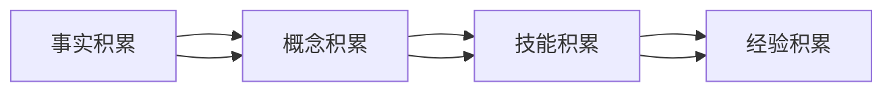

                 

# 知识积累如何影响意识功能

> 关键词：知识积累,意识功能,认知科学,神经科学,大脑结构,认知提升

## 1. 背景介绍

### 1.1 问题由来
在当今信息爆炸的时代，知识的积累已成为人们日常学习和工作的常态。从儿童时期到成年阶段，我们通过阅读、教育、经验等方式不断吸收新的知识。这些知识存储在大脑中，成为我们思考、决策的基础。

但知识积累与意识功能之间的具体关系是什么？它们之间是否存在直接的因果关系？这些问题一直困扰着认知科学家和神经科学家。传统的认知理论和神经科学模型通常只关注记忆和认知过程的局部，忽略了知识积累对意识功能的影响。

### 1.2 问题核心关键点
知识积累对意识功能的影响是当前认知科学和神经科学领域的前沿问题之一。这个问题的关键点在于：

1. **知识积累的量与质**：不同领域、不同层次的知识积累是否会对意识功能产生不同的影响？知识积累的深度和广度如何共同作用于意识功能？
2. **知识结构**：知识的结构化程度如何影响意识功能？结构化的知识是否更容易被大脑处理和提取？
3. **知识应用**：知识的实际应用是否能够促进意识功能的提升？哪些应用场景对意识功能提升效果最显著？
4. **知识更新**：新知识的更新和旧知识的遗忘如何影响意识功能的稳定性和灵活性？
5. **跨学科研究**：认知科学、神经科学、心理学等多学科如何协作研究知识积累与意识功能之间的关系？

这些问题不仅具有理论意义，还具有重要的实际应用价值，如教育、心理治疗、人机交互等领域。

### 1.3 问题研究意义
研究知识积累如何影响意识功能，对于理解人类认知的本质、优化教育方法、提升工作效能、改善心理健康等方面具有重要意义：

1. **认知本质**：揭示知识积累与意识功能之间的内在联系，有助于我们更好地理解人类认知的复杂性。
2. **教育改进**：基于知识积累与意识功能之间的关系，优化教学方法和课程设置，提升学生的认知能力。
3. **工作效能**：通过系统化的知识积累，提升职业人士的工作效率和创新能力。
4. **心理健康**：通过科学的知识积累和应用，改善个体的心理状态和情感管理。
5. **人机交互**：开发能够根据用户知识积累水平自适应调整界面和功能的智能系统，提升用户体验。

## 2. 核心概念与联系

### 2.1 核心概念概述

为了更好地理解知识积累与意识功能之间的关系，本节将介绍几个密切相关的核心概念：

- **知识积累**：指个体通过学习、实践等方式获取和保持的知识，包括事实、概念、技能、经验等。
- **意识功能**：指个体对自身和外部世界的认知、情绪、决策等心理活动。
- **认知科学**：研究人类认知过程及其生理基础的学科，包括感知、记忆、思维、语言等。
- **神经科学**：研究神经元及其网络如何产生意识功能，探索神经机制的学科。
- **大脑结构**：指神经元及其突触连接形成的网络结构，影响意识功能的神经基础。
- **认知提升**：指通过知识积累、训练等方式提高个体认知能力的过程。

这些核心概念之间的逻辑关系可以通过以下Mermaid流程图来展示：


这个流程图展示了大规模知识积累、认知提升、意识功能之间的关系：

1. 知识积累包括事实、概念、技能、经验等，通过学习、实践等方式获得。
2. 认知提升指的是通过知识积累、训练等方式提升的认知能力。
3. 意识功能包括认知、情绪、决策等心理活动，受到认知提升的影响。
4. 认知科学和神经科学研究认知功能和大脑结构的关系，为知识积累对意识功能影响的研究提供理论基础。

### 2.2 概念间的关系

这些核心概念之间存在着紧密的联系，形成了知识积累对意识功能影响的研究框架。下面我们通过几个Mermaid流程图来展示这些概念之间的关系。

#### 2.2.1 知识积累的层次性



这个流程图展示了知识积累的层次性，从具体的事实、概念，到抽象的技能、经验，知识层次的提升对意识功能的影响是逐层深入的。

#### 2.2.2 认知提升的多维度


这个流程图展示了认知提升的多个维度，包括感知、记忆、思维、语言等方面的提升，以及认知灵活性、情绪调节能力、情感智力等意识的综合提升。

#### 2.2.3 大脑结构的功能区


这个流程图展示了大脑的主要功能区及其功能，如视觉处理、运动控制、决策与规划等，这些区域通过复杂的网络连接共同影响意识功能。

### 2.3 核心概念的整体架构

最后，我们用一个综合的流程图来展示这些核心概念之间的整体架构：

```mermaid
graph TB
    A[大规模文本数据] --> B[预训练]
    B --> C[大语言模型]
    C --> D[微调]
    C --> E[提示学习]
    C --> F[知识积累]
    C --> G[认知提升]
    D --> H[全参数微调]
    D --> I[参数高效微调]
    E --> J[零样本学习]
    E --> K[少样本学习]
    F --> L[事实积累]
    F --> M[概念积累]
    F --> N[技能积累]
    F --> O[经验积累]
    G --> P[感知提升]
    G --> Q[记忆提升]
    G --> R[思维提升]
    G --> S[语言提升]
    P --> T[注意力提升]
    Q --> U[信息存储能力提升]
    R --> V[问题解决能力提升]
    S --> W[语言表达能力提升]
    T --> X[认知灵活性提升]
    U --> Y[认知广度提升]
    V --> Z[认知深度提升]
    W --> AA[认知创造性提升]
    X --> AB[情绪调节能力提升]
    Y --> AC[情感智力提升]
    Z --> AD[认知稳定性提升]
    AA --> AE[认知持久性提升]
    AB --> AF[认知准确性提升]
    AC --> AG[认知创新能力提升]
    AD --> AH[认知决策能力提升]
    AE --> AI[认知自主性提升]
    AF --> AJ[情感适应性提升]
    AG --> AK[认知一致性提升]
    AH --> AL[认知自主性提升]
    AJ --> AM[情感适应性提升]
    AK --> AN[认知稳定性提升]
    AL --> AO[认知决策能力提升]
    AM --> AP[认知自主性提升]
    AN --> AQ[情感适应性提升]
    AO --> AR[认知稳定性提升]
    AP --> AS[认知决策能力提升]
    AQ --> AT[认知自主性提升]
    AR --> AU[情感适应性提升]
    AS --> AV[认知稳定性提升]
    AT --> AW[认知决策能力提升]
    AU --> AX[认知自主性提升]
    AV --> AY[情感适应性提升]
    AW --> AZ[认知稳定性提升]
    AX --> BA[认知决策能力提升]
    AY --> BB[认知自主性提升]
    AZ --> BC[认知稳定性提升]
    BA --> BD[认知决策能力提升]
    BB --> BE[认知自主性提升]
    BD --> BF[认知稳定性提升]
    BE --> BG[认知决策能力提升]
    BF --> BH[认知自主性提升]
    BG --> BI[认知稳定性提升]
    BH --> BJ[认知决策能力提升]
    BI --> BK[认知自主性提升]
    BJ --> BL[认知稳定性提升]
    BK --> BM[认知决策能力提升]
    BL --> BN[认知自主性提升]
    BM --> BO[认知稳定性提升]
    BN --> BP[认知决策能力提升]
    BO --> BQ[认知自主性提升]
    BP --> BR[认知稳定性提升]
    BQ --> BS[认知决策能力提升]
    BR --> BT[认知自主性提升]
    BS --> BU[认知稳定性提升]
    BT --> BV[认知决策能力提升]
    BU --> BW[认知自主性提升]
    BV --> BX[认知稳定性提升]
    BW --> BY[认知决策能力提升]
    BX --> BZ[认知自主性提升]
    BY --> CA[认知稳定性提升]
    BZ --> CB[认知决策能力提升]
    CA --> CC[认知自主性提升]
    CB --> CD[认知稳定性提升]
    CC --> CE[认知决策能力提升]
    CD --> CF[认知自主性提升]
    CE --> CG[认知稳定性提升]
    CF --> CH[认知决策能力提升]
    CG --> CI[认知自主性提升]
    CH --> CJ[认知稳定性提升]
    CI --> CK[认知决策能力提升]
    CJ --> CL[认知自主性提升]
    CK --> CM[认知稳定性提升]
    CL --> CM[认知决策能力提升]
    CM --> CN[认知自主性提升]
    CN --> CO[认知稳定性提升]
    CO --> CP[认知决策能力提升]
    CP --> CQ[认知自主性提升]
    CQ --> CR[认知稳定性提升]
    CR --> CS[认知决策能力提升]
    CS --> CU[认知自主性提升]
    CU --> CV[认知稳定性提升]
    CV --> CW[认知决策能力提升]
    CW --> CX[认知自主性提升]
    CX --> CY[认知稳定性提升]
    CY --> CZ[认知决策能力提升]
    CZ --> DA[认知自主性提升]
    DA --> DB[认知稳定性提升]
    DB --> DC[认知决策能力提升]
    DC --> DD[认知自主性提升]
    DD --> DE[认知稳定性提升]
    DE --> DF[认知决策能力提升]
    DF --> DG[认知自主性提升]
    DG --> DH[认知稳定性提升]
    DH --> DI[认知决策能力提升]
    DI --> DJ[认知自主性提升]
    DJ --> DK[认知稳定性提升]
    DK --> DL[认知决策能力提升]
    DL --> DM[认知自主性提升]
    DM --> DN[认知稳定性提升]
    DN --> DO[认知决策能力提升]
    DO --> DP[认知自主性提升]
    DP --> DQ[认知稳定性提升]
    DQ --> DR[认知决策能力提升]
    DR --> DS[认知自主性提升]
    DS --> DT[认知稳定性提升]
    DT --> DU[认知决策能力提升]
    DU --> DV[认知自主性提升]
    DV --> DW[认知稳定性提升]
    DW --> DX[认知决策能力提升]
    DX --> DY[认知自主性提升]
    DY --> DZ[认知稳定性提升]
    DZ --> EA[认知决策能力提升]
    EA --> EB[认知自主性提升]
    EB --> EC[认知稳定性提升]
    EC --> ED[认知决策能力提升]
    ED --> EE[认知自主性提升]
    EE --> EF[认知稳定性提升]
    EF --> EG[认知决策能力提升]
    EG --> EH[认知自主性提升]
    EH --> EI[认知稳定性提升]
    EI --> EJ[认知决策能力提升]
    EJ --> EK[认知自主性提升]
    EK --> EL[认知稳定性提升]
    EL --> EM[认知决策能力提升]
    EM --> EN[认知自主性提升]
    EN --> EO[认知稳定性提升]
    EO --> EP[认知决策能力提升]
    EP --> EQ[认知自主性提升]
    EQ --> ER[认知稳定性提升]
    ER --> ES[认知决策能力提升]
    ES --> ET[认知自主性提升]
    ET --> EU[认知稳定性提升]
    EU --> EV[认知决策能力提升]
    EV --> EW[认知自主性提升]
    EW --> EX[认知稳定性提升]
    EX --> EY[认知决策能力提升]
    EY --> EZ[认知自主性提升]
    EZ --> FA[认知稳定性提升]
    FA --> FB[认知决策能力提升]
    FB --> FC[认知自主性提升]
    FC --> FD[认知稳定性提升]
    FD --> FE[认知决策能力提升]
    FE --> FF[认知自主性提升]
    FF --> FG[认知稳定性提升]
    FG --> FH[认知决策能力提升]
    FH --> FI[认知自主性提升]
    FI --> FJ[认知稳定性提升]
    FJ --> FK[认知决策能力提升]
    FK --> FL[认知自主性提升]
    FL --> FM[认知稳定性提升]
    FM --> FN[认知决策能力提升]
    FN --> FO[认知自主性提升]
    FO --> FP[认知稳定性提升]
    FP --> FQ[认知决策能力提升]
    FQ --> FR[认知自主性提升]
    FR --> FS[认知稳定性提升]
    FS --> FT[认知决策能力提升]
    FT --> FU[认知自主性提升]
    FU --> FV[认知稳定性提升]
    FV --> FW[认知决策能力提升]
    FW --> FX[认知自主性提升]
    FX --> FY[认知稳定性提升]
    FY --> FZ[认知决策能力提升]
    FZ --> GA[认知自主性提升]
    GA --> GB[认知稳定性提升]
    GB --> GC[认知决策能力提升]
    GC --> GD[认知自主性提升]
    GD --> GE[认知稳定性提升]
    GE --> GF[认知决策能力提升]
    GF --> GG[认知自主性提升]
    GG --> GH[认知稳定性提升]
    GH --> GI[认知决策能力提升]
    GI --> GJ[认知自主性提升]
    GJ --> GK[认知稳定性提升]
    GK --> GL[认知决策能力提升]
    GL --> GM[认知自主性提升]
    GM --> GN[认知稳定性提升]
    GN --> GO[认知决策能力提升]
    GO --> GP[认知自主性提升]
    GP --> GQ[认知稳定性提升]
    GQ --> GR[认知决策能力提升]
    GR --> GS[认知自主性提升]
    GS --> GT[认知稳定性提升]
    GT --> GU[认知决策能力提升]
    GU --> GV[认知自主性提升]
    GV --> GW[认知稳定性提升]
    GW --> GX[认知决策能力提升]
    GX --> GY[认知自主性提升]
    GY --> GZ[认知稳定性提升]
    GZ --> HA[认知决策能力提升]
    HA --> HB[认知自主性提升]
    HB --> HC[认知稳定性提升]
    HC --> HD[认知决策能力提升]
    HD --> HE[认知自主性提升]
    HE --> HF[认知稳定性提升]
    HF --> HG[认知决策能力提升]
    HG --> HH[认知自主性提升]
    HH --> HI[认知稳定性提升]
    HI --> HJ[认知决策能力提升]
    HJ --> HK[认知自主性提升]
    HK --> HL[认知稳定性提升]
    HL --> HM[认知决策能力提升]
    HM --> HN[认知自主性提升]
    HN --> HO[认知稳定性提升]
    HO --> HP[认知决策能力提升]
    HP --> HQ[认知自主性提升]
    HQ --> HR[认知稳定性提升]
    HR --> HS[认知决策能力提升]
    HS --> HT[认知自主性提升]
    HT --> HU[认知稳定性提升]
    HU --> HV[认知决策能力提升]
    HV --> HW[认知自主性提升]
    HW --> HX[认知稳定性提升]
    HX --> HY[认知决策能力提升]
    HY --> HZ[认知自主性提升]
    HZ --> IA[认知稳定性提升]
    IA --> IB[认知决策能力提升]
    IB --> IC[认知自主性提升]
    IC --> ID[认知稳定性提升]
    ID --> IE[认知决策能力提升]
    IE --> IF[认知自主性提升]
    IF --> IG[认知稳定性提升]
    IG --> IH[认知决策能力提升]
    IH --> II[认知自主性提升]
    II --> IQ[认知稳定性提升]
    IQ --> IR[认知决策能力提升]
    IR --> IS[认知自主性提升]
    IS --> IT[认知稳定性提升]
    IT --> IU[认知决策能力提升]
    IU --> IV[认知自主性提升]
    IV --> IW[认知稳定性提升]
    IW --> IX[认知决策能力提升]
    IX --> IY[认知自主性提升]
    IY --> IZ[认知稳定性提升]
    IZ --> JA[认知决策能力提升]
    JA --> JB[认知自主性提升]
    JB --> JC[认知稳定性提升]
    JC --> JD[认知决策能力提升]
    JD --> JE[认知自主性提升]
    JE --> JF[认知稳定性提升]
    JF --> JG[认知决策能力提升]
    JG --> JH[认知自主性提升]
    JH --> JI[认知稳定性提升]
    JI --> JJ[认知决策能力提升]
    JJ --> JK[认知自主性提升]
    JK --> JL[认知稳定性提升]
    JL --> JM[认知决策能力提升]
    JM --> JN[认知自主性提升]
    JN --> JO[认知稳定性提升]
    JO --> JP[认知决策能力提升]
    JP --> JQ[认知自主性提升]
    JQ --> JR[认知稳定性提升]
    JR --> JS[认知决策能力提升]
    JS --> JT[认知自主性提升]
    JT --> JU[认知稳定性提升]
    JU --> JV[认知决策能力提升]
    JV --> JW[认知自主性提升]
    JW --> JX[认知稳定性提升]
    JX --> JY[认知决策能力提升]
    JY --> JZ[认知自主性提升]
    JZ --> KA[认知稳定性提升]
    KA --> KB[认知决策能力提升]
    KB --> KC[认知自主性提升]
    KC --> KD[认知稳定性提升]
    KD --> KE[认知决策能力提升]
    KE --> KF[认知自主性提升]
    KF --> KG[认知稳定性提升]
    KG --> KH[认知决策能力提升]
    KH --> KI[认知自主性提升]
    KI --> KJ[认知稳定性提升]
    KJ --> KK[认知决策能力提升]
    KK --> KL[认知自主性提升]
    KL --> KM[认知稳定性提升]
    KM --> KN[认知决策能力提升]
    KN --> KO[认知自主性提升]
    KO --> KP[认知稳定性提升]
    KP --> KQ[认知决策能力提升]
    KQ --> KR[认知自主性提升]
    KR --> KS[认知稳定性提升]
    KS --> KT[认知决策能力提升]
    KT --> KU[认知自主性提升]
    KU --> KV[认知稳定性提升]
    KV --> KW[认知决策能力提升]
    KW --> KX[认知自主性提升]
    KX --> KY[认知稳定性提升]
    KY --> KZ[认知决策能力提升]
    KZ --> LA[认知自主性提升]
    LA --> LB[认知稳定性提升]
    LB --> LC[认知决策能力提升]
    LC --> LD[认知自主性提升]
    LD --> LE[认知稳定性提升]
    LE --> LF[认知决策能力提升]
    LF --> LG[认知自主性提升]
    LG --> LH[认知稳定性提升]
    LH --> LI[认知决策能力提升]
    LI --> LJ[认知自主性提升]
    LJ --> LK[认知稳定性提升]
    LK --> LM[认知决策能力提升]
    LM --> LN[认知自主性提升]
    LN --> LO[认知稳定性提升]
    LO --> LP[认知决策能力提升]
    LP --> LQ[认知自主性提升]
    LQ --> LR[认知稳定性提升]
    LR --> LS[认知决策能力提升]
    LS --> LT[认知自主性提升]
    LT --> LU[认知稳定性提升]
    LU --> LV[认知决策能力提升]
    LV --> LW[认知自主性提升]
    LW --> LX[认知稳定性提升]
    LX --> LY[认知决策能力提升]
    LY --> LZ[认知自主性提升]
    LZ --> MA[认知稳定性提升]
    MA --> MB[认知决策能力提升]
    MB --> MC[认知自主性提升]
    MC --> MD[认知稳定性提升]
    MD --> ME[认知决策能力提升]
    ME --> MF[认知自主性提升]
    MF --> MG[认知稳定性提升]
    MG --> MH[认知决策能力提升]
    MH --> MI[认知自主性提升]
    MI --> MJ[认知稳定性提升]
    MJ --> MK[认知决策能力提升]
    MK --> ML[认知自主性提升]
    ML --> MM[认知稳定性提升]
    MM --> MN[认知决策能力提升]
    MN --> MO[认知自主性提升]
    MO --> MP[认知稳定性提升]
    MP --> MQ[认知决策能力提升]
    MQ --> MR[认知自主性提升]
    MR --> MS[认知稳定性提升]
    MS --> MT[认知决策能力提升]
    MT --> MU[认知自主性提升]
    MU --> MV[认知稳定性提升]
    MV --> MX[认知决策能力提升]
    MX --> MY[认知自主性提升]
    MY --> MZ[认知稳定性提升]
    MZ --> NA[认知决策能力提升]
    NA --> NB[认知自主性提升]
    NB --> NC[认知稳定性提升]
    NC --> ND[认知决策能力提升]
    ND --> NE[认知自主性提升]
    NE --> NF[认知稳定性提升]
    NF --> NG[认知决策能力提升]
    NG --> NH[认知自主性提升]
    NH --> NI[认知稳定性提升]
    NI --> NJ[认知决策能力提升]
    NJ --> NK[认知自主性提升]
    NK --> NL[认知稳定性提升]
    NL --> NM[认知决策能力提升]
    NM --> NN[认知自主性提升]
    NN --> NO[认知稳定性提升]
    NO --> NP[认知决策能力提升]
    NP --> NQ[认知自主性提升]
    NQ --> NR[认知稳定性提升]
    NR --> NS[认知决策能力提升]
    NS --> NT[认知自主性提升]
    NT --> NU[认知稳定性提升]
    NU --> NV[认知决策能力提升]
    NV --> NW[认知自主性提升]
    NW --> NX[认知稳定性提升]
    NX --> NY[认知决策能力提升]
    NY --> NZ[认知自主性提升]
    NZ --> OA[认知稳定性提升]
    OA --> OB[认知决策能力提升]
    OB --> OC[认知自主性提升]
    OC --> OD[认知稳定性提升]
    OD --> OE[认知决策能力提升]
    OE --> OF[认知自主性提升]
    OF --> OG[认知稳定性提升]
    OG --> OH[认知决策能力提升]
    OH --> OI[认知自主性提升]
    OI --> OJ[认知稳定性提升]
    OJ --> OK[认知决策能力提升]
    OK --> OL[认知自主性提升]
    OL --> OM[认知稳定性提升]
    OM --> ON[认知决策能力提升]
    ON --> OP[认知自主性提升]
    OP --> OQ[认知稳定性提升]
    OQ --> OR[认知决策能力提升]
    OR --> OS[认知自主性提升]
    OS --> OT[认知稳定性提升]
    OT --> OU[认知决策能力提升]
    OU -->OV[认知自主性提升]
    OV --> OW[认知稳定性提升]
    OW -->OX[认知决策能力提升]
    OX -->OY[认知自主性提升]
    OY -->OZ[认知稳定性提升]
    OZ --> PA[认知决策能力提升]
    PA --> PB[认知自主性提升]
    PB --> PC[认知稳定性提升]
    PC --> PD[认知决策能力提升]
    PD --> PE[认知自主性提升]
    PE --> PF[认知稳定性提升]
    PF --> PG[认知决策能力提升]
    PG --> PH[认知自主性提升]
    PH --> PI[认知稳定性提升

