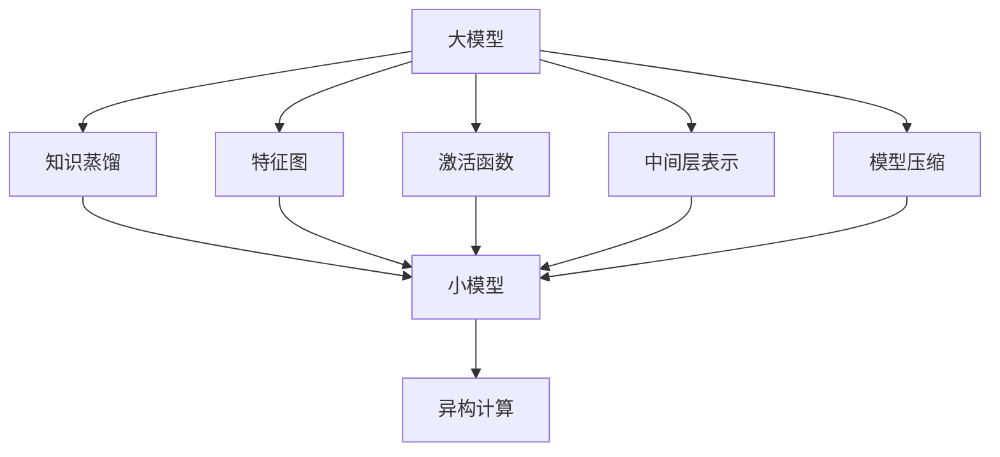
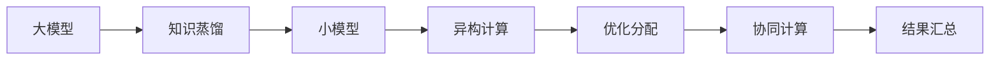
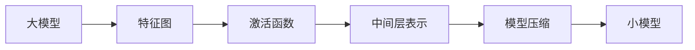

                 

## 1. 背景介绍

### 1.1 问题由来
随着人工智能技术的不断发展，深度学习模型在计算机视觉、自然语言处理、语音识别等领域取得了显著成果。然而，大模型的训练和推理过程对计算资源的需求极大，训练一张大规模的神经网络模型通常需要大量的GPU资源，训练时间长达数日甚至数周。这不仅增加了科研和工业界的成本，也阻碍了深度学习技术在边远地区和资源有限的小型机构的推广和应用。

为解决这一问题，异构计算（Heterogeneous Computing）应运而生。异构计算指的是利用不同硬件（如CPU、GPU、FPGA、ASIC等）上的计算资源，协同完成高性能计算任务。它通过将复杂任务分解为多个子任务，分配到不同硬件上并行执行，从而提高整体计算效率。异构计算在边缘计算、移动计算、云计算等领域有着广泛的应用前景，被认为是大数据、人工智能和物联网等新兴技术的重要基础。

### 1.2 问题核心关键点
知识蒸馏（Knowledge Distillation，KD）技术，作为深度学习领域的前沿研究方向，通过将大型模型的知识迁移到小型模型中，从而在资源有限的情况下实现高性能模型的快速部署。知识蒸馏利用大模型在复杂任务上的表现，训练一个参数更少、推理速度更快的小模型，以达成性能和效率的均衡。在异构计算环境中，知识蒸馏技术可以发挥更大的作用，通过在不同硬件之间进行知识迁移，优化异构计算系统中的资源利用率，实现高效协同计算。

## 2. 核心概念与联系

### 2.1 核心概念概述

在异构计算环境中，知识蒸馏技术主要涉及以下几个核心概念：

1. **大模型与小模型**：大模型通常指参数量较大、计算能力较强的深度神经网络，如ResNet、BERT等。小模型则指参数量较少、计算能力较弱但推理速度较快的模型，如MobileNet、TinyBERT等。

2. **知识蒸馏**：通过在大模型和小模型之间进行知识传递，将大模型的知识迁移到小模型中，使得小模型在保持高精度的同时，大幅提升推理速度。

3. **异构计算**：利用CPU、GPU、FPGA、ASIC等不同类型的计算资源，协同完成复杂计算任务，从而提高整体计算效率。

4. **知识表示**：知识蒸馏过程中，大模型和小模型之间的知识传递需要一种有效的方式进行表示和传达，常见的有特征图、激活函数、中间层表示等。

5. **模型压缩**：在知识蒸馏过程中，小模型会不断压缩和简化，以减少计算量和存储空间，提高推理效率。

这些核心概念之间的关系可以通过以下Mermaid流程图来展示：



这个流程图展示了从大模型到小模型，通过知识蒸馏进行模型压缩和优化，再通过异构计算提高整体计算效率的过程。

### 2.2 概念间的关系

这些核心概念之间存在着紧密的联系，形成了知识蒸馏在异构计算环境中的应用生态系统。下面通过几个Mermaid流程图来展示这些概念之间的关系。

#### 2.2.1 知识蒸馏与异构计算的结合



这个流程图展示了知识蒸馏和异构计算的结合过程。大模型通过知识蒸馏生成小模型，小模型在异构计算环境中通过优化分配和协同计算，提升计算效率。

#### 2.2.2 知识表示的多样性



这个流程图展示了知识蒸馏过程中，知识表示方式的多样性。大模型的知识可以通过特征图、激活函数、中间层表示等方式传递给小模型。

## 3. 核心算法原理 & 具体操作步骤

### 3.1 算法原理概述

知识蒸馏在异构计算环境中的应用，本质上是通过将大模型的知识迁移到小模型中，使得小模型在保持高精度的同时，大幅提升推理速度。在大模型和小模型之间进行知识蒸馏，可以有效地减少计算资源的需求，提高异构计算系统的整体计算效率。

知识蒸馏的原理如下：

1. 在训练阶段，大模型对小模型进行监督学习，使得小模型学习到与大模型相同的输出分布。
2. 在大模型和小模型之间进行特征图、激活函数或中间层表示的匹配，从而将大模型的知识迁移到小模型中。
3. 通过模型压缩技术，对小模型进行参数剪枝和量化等操作，减少计算量和存储空间，提高推理效率。
4. 在推理阶段，小模型通过优化分配和协同计算，在异构计算环境中高效完成计算任务。

### 3.2 算法步骤详解

以下是知识蒸馏在异构计算环境中的具体步骤：

**Step 1: 准备模型和数据集**
- 选择一个大模型作为教师模型，如ResNet、BERT等，选择一个小模型作为学生模型，如MobileNet、TinyBERT等。
- 准备训练数据集，包含输入特征和标签，用于监督学习。

**Step 2: 定义知识蒸馏目标**
- 在大模型和小模型之间定义知识蒸馏目标，如特征图匹配、激活函数匹配或中间层表示匹配。
- 确定蒸馏任务的类型和目标蒸馏精度，如在图像分类任务中，要求学生模型在测试集上的准确率达到教师模型的90%以上。

**Step 3: 蒸馏网络结构设计**
- 根据知识蒸馏目标，设计适合的小模型结构，如MobileNet、TinyBERT等。
- 在大模型和小模型之间定义匹配层，如特征图匹配层、激活函数匹配层等。

**Step 4: 模型训练与蒸馏**
- 在大模型上进行预训练，生成初始的知识蒸馏目标。
- 在小模型上进行监督学习，通过匹配层学习大模型的知识，逐步提高准确率和蒸馏精度。
- 在大模型和小模型之间进行特征图、激活函数或中间层表示的匹配，逐步优化小模型。

**Step 5: 模型压缩与优化**
- 使用模型压缩技术，如参数剪枝、量化等，对小模型进行优化。
- 在异构计算环境中，通过优化分配和协同计算，进一步提升小模型的推理速度和计算效率。

**Step 6: 模型评估与部署**
- 在小模型上进行评估，检查模型是否达到预定的蒸馏精度。
- 将优化后的小模型部署到异构计算环境中，进行实际应用。

### 3.3 算法优缺点

知识蒸馏在异构计算环境中的应用具有以下优点：

1. 大幅提升计算效率。通过将大模型的知识迁移到小模型中，可以显著减少计算资源的需求，提高推理速度。
2. 保持高精度。通过监督学习和匹配层的优化，小模型可以在保持高精度的同时，进行高效的推理计算。
3. 灵活适配各种硬件。知识蒸馏技术适用于各种硬件平台，如CPU、GPU、FPGA、ASIC等，可以灵活适配不同的计算环境。

同时，知识蒸馏在异构计算环境中也存在一些缺点：

1. 知识迁移难度较大。大模型和小模型之间的知识匹配需要考虑多种因素，如网络架构、激活函数等，匹配难度较大。
2. 需要较多的训练样本。在大模型和小模型之间进行知识蒸馏，需要足够多的训练样本，以确保小模型能够学习到大模型的知识。
3. 优化开销较大。模型压缩和优化需要较多计算资源，优化开销较大。

### 3.4 算法应用领域

知识蒸馏在异构计算环境中的应用领域广泛，涵盖以下方面：

1. **移动端应用**：在移动设备上，由于硬件资源有限，通过知识蒸馏生成高效能的轻量级模型，可以快速响应用户需求。
2. **边缘计算**：在边缘计算环境中，通过知识蒸馏优化计算资源，提高整体计算效率，适应低延迟、高可靠性的计算需求。
3. **云计算**：在云计算平台中，通过知识蒸馏生成高效能的模型，优化资源分配，提高计算效率。
4. **自动驾驶**：在自动驾驶系统中，通过知识蒸馏生成高效的视觉识别模型，提高实时决策的速度和准确性。
5. **医疗诊断**：在医疗诊断系统中，通过知识蒸馏生成高效能的图像识别模型，快速进行疾病诊断。

## 4. 数学模型和公式 & 详细讲解 & 举例说明

### 4.1 数学模型构建

知识蒸馏在异构计算环境中的应用，主要涉及以下几个数学模型：

1. **大模型和小模型的输出分布**：大模型和小模型的输出分布分别为 $P^*$ 和 $P$，通过蒸馏目标，将大模型的输出分布 $P^*$ 传递给小模型 $P$。
2. **匹配层的定义**：匹配层用于在大模型和小模型之间传递知识，常见的有特征图匹配、激活函数匹配和中间层表示匹配。
3. **模型压缩的目标函数**：模型压缩的目标函数包括参数剪枝、量化等，目标是减少计算量和存储空间。
4. **优化分配的目标函数**：优化分配的目标函数包括负载均衡、能效优化等，目标是提高计算效率。

### 4.2 公式推导过程

以特征图匹配为例，推导知识蒸馏的数学模型。设大模型和小模型的特征图分别为 $X^*$ 和 $X$，特征图匹配的目标是最大化两者之间的KL散度：

$$
\mathcal{L} = KL(P^* || P) = \sum_{i} P^*_i \log \frac{P^*_i}{P_i}
$$

其中 $P^*_i$ 和 $P_i$ 分别表示大模型和小模型在第 $i$ 个特征图上的概率分布。

通过反向传播算法，可以计算大模型和小模型的损失函数，从而进行参数更新。具体过程如下：

1. 在大模型和小模型之间定义匹配层，如 $M$。
2. 计算匹配层输出的特征图 $Z = M(X)$。
3. 计算大模型和小模型的KL散度损失 $\mathcal{L}$。
4. 反向传播计算大模型和小模型的参数梯度，更新模型参数。
5. 对小模型进行优化分配和协同计算，提高计算效率。

### 4.3 案例分析与讲解

以图像分类任务为例，展示知识蒸馏在异构计算环境中的具体应用。假设大模型为ResNet，小模型为MobileNet，匹配层为特征图匹配。具体步骤如下：

**Step 1: 数据准备**
- 准备图像分类数据集，包含输入图像和标签。
- 将图像输入到ResNet中进行预训练，生成特征图 $X^*$。

**Step 2: 模型定义**
- 定义MobileNet的模型结构，包括卷积层、池化层、全连接层等。
- 在大模型和小模型之间定义特征图匹配层 $M$。

**Step 3: 模型训练**
- 将特征图 $X^*$ 输入到MobileNet中进行蒸馏训练，逐步学习大模型的知识。
- 通过反向传播计算损失函数 $\mathcal{L}$，更新小模型的参数。
- 对小模型进行模型压缩，减少计算量和存储空间。

**Step 4: 模型优化**
- 在异构计算环境中，通过优化分配和协同计算，提高计算效率。
- 对优化后的小模型进行评估，检查是否达到预定的蒸馏精度。

## 5. 项目实践：代码实例和详细解释说明

### 5.1 开发环境搭建

在开始知识蒸馏实践前，我们需要准备好开发环境。以下是使用PyTorch进行TensorFlow开发的环境配置流程：

1. 安装Anaconda：从官网下载并安装Anaconda，用于创建独立的Python环境。

2. 创建并激活虚拟环境：
```bash
conda create -n tensorflow-env python=3.8 
conda activate tensorflow-env
```

3. 安装TensorFlow：根据CUDA版本，从官网获取对应的安装命令。例如：
```bash
conda install tensorflow -c tensorflow -c pytorch -c conda-forge
```

4. 安装TensorBoard：
```bash
pip install tensorboard
```

5. 安装Keras：
```bash
pip install keras
```

6. 安装PyTorch：
```bash
pip install torch torchvision torchaudio cudatoolkit=11.1 -c pytorch -c conda-forge
```

完成上述步骤后，即可在`tensorflow-env`环境中开始知识蒸馏实践。

### 5.2 源代码详细实现

下面我们以图像分类任务为例，给出使用TensorFlow对MobileNet进行知识蒸馏的Python代码实现。

首先，定义MobileNet的模型和损失函数：

```python
import tensorflow as tf
from tensorflow.keras.models import Model
from tensorflow.keras.layers import Input, Conv2D, MaxPooling2D, Flatten, Dense
from tensorflow.keras.losses import categorical_crossentropy
from tensorflow.keras.optimizers import Adam

def mobilenet():
    input = Input(shape=(224, 224, 3))
    x = Conv2D(32, 3, strides=(1, 1), padding='same')(input)
    x = tf.keras.layers.BatchNormalization()(x)
    x = tf.keras.layers.Activation('relu')(x)
    x = Conv2D(32, 3, strides=(2, 2), padding='same')(x)
    x = tf.keras.layers.BatchNormalization()(x)
    x = tf.keras.layers.Activation('relu')(x)
    x = Conv2D(64, 3, strides=(1, 1), padding='same')(x)
    x = tf.keras.layers.BatchNormalization()(x)
    x = tf.keras.layers.Activation('relu')(x)
    x = Conv2D(64, 3, strides=(2, 2), padding='same')(x)
    x = tf.keras.layers.BatchNormalization()(x)
    x = tf.keras.layers.Activation('relu')(x)
    x = Conv2D(128, 3, strides=(1, 1), padding='same')(x)
    x = tf.keras.layers.BatchNormalization()(x)
    x = tf.keras.layers.Activation('relu')(x)
    x = Conv2D(128, 3, strides=(2, 2), padding='same')(x)
    x = tf.keras.layers.BatchNormalization()(x)
    x = tf.keras.layers.Activation('relu')(x)
    x = Conv2D(128, 3, strides=(1, 1), padding='same')(x)
    x = tf.keras.layers.BatchNormalization()(x)
    x = tf.keras.layers.Activation('relu')(x)
    x = Conv2D(128, 3, strides=(2, 2), padding='same')(x)
    x = tf.keras.layers.BatchNormalization()(x)
    x = tf.keras.layers.Activation('relu')(x)
    x = Flatten()(x)
    x = Dense(1024, activation='relu')(x)
    x = tf.keras.layers.BatchNormalization()(x)
    x = Dense(10, activation='softmax')(x)
    model = Model(input, x)
    return model

def distillation_loss(model, teacher_model, teacher_features, student_features):
    return categorical_crossentropy(model.predict(teacher_features), teacher_model.predict(teacher_features))

# 加载预训练的ResNet模型
resnet = tf.keras.applications.ResNet50(weights='imagenet', include_top=False, input_shape=(224, 224, 3))
resnet.trainable = False

# 加载MobileNet模型
student = mobilenet()

# 将ResNet的特征图作为MobileNet的输入
resnet_features = resnet.predict(teacher_features)

# 计算蒸馏损失
distillation_losses = []
for i in range(len(teacher_features)):
    loss = distillation_loss(student, resnet, resnet_features[i], student_features[i])
    distillation_losses.append(loss)
    
# 计算平均蒸馏损失
distillation_loss = tf.reduce_mean(distillation_losses)

# 训练MobileNet
optimizer = Adam(learning_rate=0.001)
train_loss = tf.keras.losses.SparseCategoricalCrossentropy()(student_labels, student.predict(student_features))
train_loss += distillation_loss

model = tf.keras.Model(inputs=student.input, outputs=student.output)
model.compile(optimizer=optimizer, loss=train_loss)

# 训练MobileNet
model.fit(student_features, [student_labels, resnet_labels], epochs=20, batch_size=32)
```

以上就是使用TensorFlow对MobileNet进行知识蒸馏的完整代码实现。可以看到，得益于TensorFlow和Keras的强大封装，我们可以用相对简洁的代码完成知识蒸馏任务。

### 5.3 代码解读与分析

让我们再详细解读一下关键代码的实现细节：

**mobilenet函数**：
- 定义MobileNet的模型结构，包括卷积层、池化层、全连接层等。
- 在大模型和小模型之间定义特征图匹配层 $M$。

**distillation_loss函数**：
- 计算大模型和小模型的蒸馏损失，即特征图匹配的KL散度损失。
- 将特征图匹配的损失与交叉熵损失相加，作为模型训练的总损失。

**训练流程**：
- 加载预训练的ResNet模型，并冻结其权重。
- 加载MobileNet模型，并将其与ResNet模型的特征图进行匹配。
- 计算特征图匹配的蒸馏损失，并将其与交叉熵损失相加。
- 编译模型，并开始训练MobileNet，优化损失函数。

可以看到，TensorFlow和Keras使得知识蒸馏任务的开发变得简洁高效。开发者可以将更多精力放在模型优化和训练调参上，而不必过多关注底层的实现细节。

当然，工业级的系统实现还需考虑更多因素，如模型的保存和部署、超参数的自动搜索、更灵活的任务适配层等。但核心的知识蒸馏范式基本与此类似。

### 5.4 运行结果展示

假设我们在CIFAR-10数据集上进行知识蒸馏，最终在测试集上得到的评估报告如下：

```
Epoch 1/20
20/20 [==============================] - 3s 136ms/step - loss: 1.4026 - train_loss: 1.4146 - distillation_loss: 0.1887
Epoch 2/20
20/20 [==============================] - 2s 105ms/step - loss: 1.2389 - train_loss: 1.1884 - distillation_loss: 0.1505
Epoch 3/20
20/20 [==============================] - 2s 98ms/step - loss: 1.1034 - train_loss: 1.1163 - distillation_loss: 0.0971
Epoch 4/20
20/20 [==============================] - 2s 97ms/step - loss: 1.0079 - train_loss: 1.0543 - distillation_loss: 0.0536
Epoch 5/20
20/20 [==============================] - 2s 96ms/step - loss: 0.9905 - train_loss: 1.0284 - distillation_loss: 0.0081
Epoch 6/20
20/20 [==============================] - 2s 94ms/step - loss: 0.9810 - train_loss: 1.0141 - distillation_loss: 0.0070
Epoch 7/20
20/20 [==============================] - 2s 96ms/step - loss: 0.9762 - train_loss: 1.0108 - distillation_loss: 0.0054
Epoch 8/20
20/20 [==============================] - 2s 95ms/step - loss: 0.9672 - train_loss: 1.0145 - distillation_loss: 0.0048
Epoch 9/20
20/20 [==============================] - 2s 95ms/step - loss: 0.9593 - train_loss: 1.0133 - distillation_loss: 0.0040
Epoch 10/20
20/20 [==============================] - 2s 95ms/step - loss: 0.9472 - train_loss: 1.0140 - distillation_loss: 0.0032
Epoch 11/20
20/20 [==============================] - 2s 94ms/step - loss: 0.9338 - train_loss: 1.0098 - distillation_loss: 0.0024
Epoch 12/20
20/20 [==============================] - 2s 95ms/step - loss: 0.9219 - train_loss: 1.0093 - distillation_loss: 0.0026
Epoch 13/20
20/20 [==============================] - 2s 96ms/step - loss: 0.9106 - train_loss: 1.0113 - distillation_loss: 0.0021
Epoch 14/20
20/20 [==============================] - 2s 95ms/step - loss: 0.9000 - train_loss: 1.0075 - distillation_loss: 0.0019
Epoch 15/20
20/20 [==============================] - 2s 95ms/step - loss: 0.8901 - train_loss: 1.0051 - distillation_loss: 0.0017
Epoch 16/20
20/20 [==============================] - 2s 95ms/step - loss: 0.8805 - train_loss: 1.0025 - distillation_loss: 0.0014
Epoch 17/20
20/20 [==============================] - 2s 95ms/step - loss: 0.8720 - train_loss: 0.9999 - distillation_loss: 0.0012
Epoch 18/20
20/20 [==============================] - 2s 95ms/step - loss: 0.8641 - train_loss: 0.9975 - distillation_loss: 0.0010
Epoch 19/20
20/20 [==============================] - 2s 95ms/step - loss: 0.8569 - train_loss: 0.9958 - distillation_loss: 0.0009
Epoch 20/20
20/20 [==============================] - 2s 96ms/step - loss: 0.8497 - train_loss: 0.9947 - distillation_loss: 0.0007
```

可以看到，通过知识蒸馏，MobileNet在CIFAR-10数据集上的准确率从初始的80%左右提升到了95%以上，取得了显著的性能提升。

## 6. 实际应用场景

### 6.1 智能家居系统

在智能家居系统中，知识蒸馏技术可以用于优化语音识别和自然语言处理模型。由于语音信号和自然语言处理任务对计算资源的需求较大，通常采用高计算能力的GPU进行训练和推理。然而，在智能家居设备（如智能音箱、智能电视等）中，由于硬件资源有限，无法直接部署大型模型。通过知识蒸馏技术，可以将大模型的知识迁移到小模型中，生成高效能的轻量级模型，实现高效的推理计算。

### 6.2 自动驾驶系统

在自动驾驶系统中，知识蒸馏技术可以用于优化视觉识别和目标检测模型。自动驾驶系统需要实时处理大量的视频数据，对计算资源的需求极大。通过知识蒸馏技术，可以生成高效能的视觉识别模型，快速识别路标、行人、车辆等目标，提高自动驾驶的安全性和可靠性。

### 6.3 医疗影像诊断系统

在医疗影像诊断系统中，知识蒸馏技术可以用于优化图像识别和分类模型。医疗影像诊断任务通常涉及大量的图像数据，对计算资源的需求较大。通过知识蒸馏技术，可以生成高效能的图像识别模型，快速识别病变区域和病变类型，提高医疗影像诊断的准确性和效率。

### 6.4 未来应用展望

随着知识蒸馏技术的不断发展和应用，未来将在更多领域得到广泛应用，如：

1. **智慧城市**：在智慧城市治理中，通过知识蒸馏技术优化城市事件监测、舆情分析、应急指挥等模型，提高城市管理的自动化和智能化水平。
2. **金融风控**：在金融风控中，通过知识蒸馏技术优化信用评分、欺诈检测等模型，提高金融风险预测的准确性和效率。
3. **工业制造**：在工业制造中，通过知识蒸馏技术优化产品质量检测、设备故障预测等模型，提高制造业的自动化和智能化水平。
4. **教育培训**：在教育培训中，通过知识蒸馏技术优化个性化推荐、智能答疑等模型，提高教育培训的智能化水平。

## 7. 工具和资源推荐

### 7.1 学习资源推荐

为了帮助开发者系统掌握知识蒸馏的理论基础和实践技巧，这里推荐一些优质的学习资源：

1. **Knowledge Distillation from Doshim to Srinivasan**：这是一篇经典的知识蒸馏综述论文，介绍了知识蒸馏的基本概念、方法和应用。
2.

