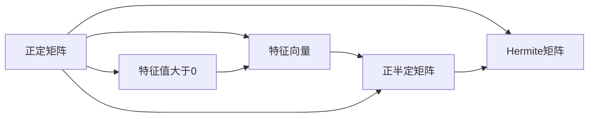
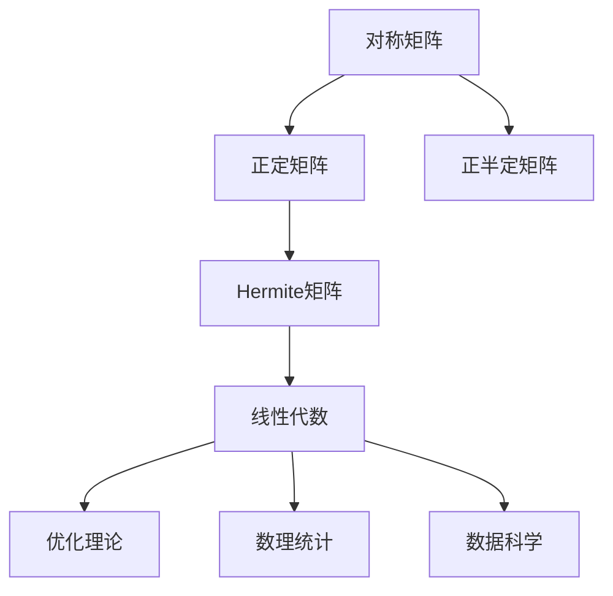

                 

# 矩阵理论与应用：Hermite正定与正半定矩阵

> 关键词：矩阵理论,正定矩阵,正半定矩阵,特征值,特征向量,Hermite矩阵,应用领域,线性代数

## 1. 背景介绍

### 1.1 问题由来
在现代数学中，矩阵理论是一门重要的分支学科。正定矩阵和正半定矩阵是其中核心概念之一，广泛应用于数理统计、线性代数、优化理论等领域。理解和掌握这两种矩阵的特性，对于从事数据分析、算法设计等工作至关重要。

### 1.2 问题核心关键点
正定矩阵和正半定矩阵的核心区别在于它们的特征值特性：
- 正定矩阵：所有特征值均大于0，保证矩阵为正定的二次型，具有稳定性。
- 正半定矩阵：所有特征值均大于等于0，保证矩阵为半正定的二次型，具有非负性。

这种特性使得正定和正半定矩阵在优化问题中扮演了重要角色，它们经常被用于求解二次规划问题、线性规划问题等，是求解此类问题的基础工具。

### 1.3 问题研究意义
研究正定矩阵和正半定矩阵的理论和应用，对于解决实际问题具有重要意义：

1. 提升数学建模能力：掌握正定和正半定矩阵，可以更好地进行数学建模，解决实际问题。
2. 优化算法设计：正定和正半定矩阵常用于构造优化算法，帮助解决复杂问题。
3. 数据统计分析：在数据分析中，正定和正半定矩阵用于衡量数据的稳定性和非负性，有助于更准确地理解数据特性。
4. 数学工具应用：正定和正半定矩阵在数学工具的应用中，如Hermite矩阵，可以辅助进行矩阵运算和分析。

## 2. 核心概念与联系

### 2.1 核心概念概述

为更好地理解正定矩阵和正半定矩阵的理论与应用，本节将介绍几个密切相关的核心概念：

- **正定矩阵**：如果$n \times n$的实对称矩阵$A$，对于任意非零向量$\mathbf{x} \in \mathbb{R}^n$，都有$\mathbf{x}^T A \mathbf{x} > 0$，则称$A$为正定矩阵。
- **正半定矩阵**：如果$n \times n$的实对称矩阵$A$，对于任意非零向量$\mathbf{x} \in \mathbb{R}^n$，都有$\mathbf{x}^T A \mathbf{x} \geq 0$，则称$A$为正半定矩阵。
- **特征值**：设$\lambda$为$n \times n$矩阵$A$的一个特征值，则有$A\mathbf{v} = \lambda\mathbf{v}$，其中$\mathbf{v}$为特征向量。
- **特征向量**：设$\mathbf{v}$为矩阵$A$的一个特征向量，$\lambda$为对应的特征值。
- **Hermite矩阵**：如果矩阵$A$同时为正定和正半定矩阵，则称$A$为Hermite矩阵。

这些核心概念之间的逻辑关系可以通过以下Mermaid流程图来展示：



这个流程图展示了正定矩阵、正半定矩阵和Hermite矩阵的概念及其之间的关系：

1. 正定矩阵的特征值均大于0。
2. 正半定矩阵的特征值均大于等于0。
3. Hermite矩阵同时满足正定和正半定的特征值特性。

### 2.2 概念间的关系

这些核心概念之间存在着紧密的联系，形成了矩阵理论的基础框架。下面我通过几个Mermaid流程图来展示这些概念的关系：

#### 2.2.1 矩阵的对称性和正定性


这个流程图展示了对称矩阵、正定矩阵和正半定矩阵之间的关系：

1. 对称矩阵是其转置矩阵。
2. 正定矩阵的特征值均大于0。
3. 正半定矩阵的特征值均大于等于0。

#### 2.2.2 正定和正半定的关系


这个流程图展示了正定矩阵和正半定矩阵之间的关系：

1. 正定矩阵必定为正半定矩阵。
2. 正半定矩阵不一定为正定矩阵，但具有非负性。

#### 2.2.3 Hermite矩阵的构建


这个流程图展示了Hermite矩阵的构建方法：

1. 正定矩阵和正半定矩阵均满足Hermite矩阵的定义。
2. Hermite矩阵为同时满足正定和正半定的矩阵。

### 2.3 核心概念的整体架构

最后，我们用一个综合的流程图来展示这些核心概念在大语言模型微调过程中的整体架构：



这个综合流程图展示了从对称矩阵到Hermite矩阵，再到相关领域应用的整体架构：

1. 对称矩阵是矩阵理论的基础。
2. 正定和正半定矩阵是线性代数的重要分支。
3. Hermite矩阵是优化理论中的核心工具。
4. 在数理统计和数据科学等领域，正定和正半定矩阵具有重要应用。

通过这些流程图，我们可以更清晰地理解正定矩阵和正半定矩阵的理论基础及其应用方向。

## 3. 核心算法原理 & 具体操作步骤
### 3.1 算法原理概述

正定矩阵和正半定矩阵的判断和应用，通常通过以下几个步骤进行：

1. **特征值分解**：将矩阵$A$分解为$A = Q \Lambda Q^T$的形式，其中$\Lambda$为对角矩阵，$Q$为正交矩阵。
2. **特征值分析**：分析$\Lambda$的特征值，判断矩阵$A$的正定或正半定特性。
3. **矩阵应用**：根据正定或正半定的特性，应用于相应的数学问题或优化问题。

正定矩阵和正半定矩阵的判断，主要依据其特征值特性。对于正定矩阵，所有特征值均大于0；对于正半定矩阵，所有特征值均大于等于0。

### 3.2 算法步骤详解

以下是判断和应用正定矩阵和正半定矩阵的具体操作步骤：

**步骤1：特征值分解**

对于任意$n \times n$的实对称矩阵$A$，可以对其进行特征值分解：

$$
A = Q \Lambda Q^T
$$

其中$Q$为正交矩阵，$\Lambda$为对角矩阵，对角线上的元素为$A$的特征值。

**步骤2：特征值分析**

分析$\Lambda$的特征值，判断$A$的正定或正半定特性。

- 对于正定矩阵$A$，所有特征值$\lambda_i > 0$。
- 对于正半定矩阵$A$，所有特征值$\lambda_i \geq 0$。

**步骤3：矩阵应用**

根据$A$的正定或正半定特性，应用于相应的数学问题或优化问题。

- 正定矩阵常用于优化问题的求解，如最小二乘问题、最优化问题等。
- 正半定矩阵常用于线性规划、半正定规划等。

### 3.3 算法优缺点

正定矩阵和正半定矩阵具有以下优点和缺点：

**优点：**

- 正定矩阵和正半定矩阵具有稳定性和非负性，可以保证某些数学问题的解是唯一或存在的。
- 正定矩阵和正半定矩阵在优化问题中具有重要应用，可以简化问题求解过程。

**缺点：**

- 判断矩阵是否正定或正半定，需要计算特征值和特征向量，计算复杂度较高。
- 正定矩阵和正半定矩阵的应用，依赖于问题的特殊性，有时难以直接应用。

### 3.4 算法应用领域

正定矩阵和正半定矩阵在数学、统计、优化等领域有广泛应用。以下是几个典型应用领域：

1. **统计分析**：在统计分析中，正定矩阵常用于协方差矩阵的求解和分析，帮助理解数据的结构。
2. **线性代数**：在线性代数中，正定矩阵常用于矩阵分解和奇异值分解，帮助理解矩阵的性质。
3. **优化问题**：在优化问题中，正定矩阵和正半定矩阵常用于构造求解优化问题的矩阵，如二次规划、半正定规划等。
4. **数据科学**：在数据科学中，正定矩阵常用于数据降维和特征提取，帮助发现数据中的模式和结构。
5. **信号处理**：在信号处理中，正定矩阵常用于矩阵特征值的求解，帮助分析和处理信号数据。

## 4. 数学模型和公式 & 详细讲解 & 举例说明

### 4.1 数学模型构建

本节将使用数学语言对正定矩阵和正半定矩阵的判断和应用进行更加严格的刻画。

记矩阵$A$为$n \times n$的实对称矩阵。设$\Lambda$为$A$的特征值分解形式：

$$
A = Q \Lambda Q^T
$$

其中$\Lambda$的对角线上元素为$A$的特征值$\lambda_i$。

### 4.2 公式推导过程

假设$A$为正定矩阵，则有：

$$
A = Q \Lambda Q^T
$$

对于任意非零向量$\mathbf{x} \in \mathbb{R}^n$，有：

$$
\mathbf{x}^T A \mathbf{x} = \mathbf{x}^T Q \Lambda Q^T \mathbf{x} = (Q^T \mathbf{x})^T \Lambda (Q^T \mathbf{x}) = \sum_{i=1}^n (\lambda_i (Q^T \mathbf{x})_i^2)
$$

由于$\Lambda$的所有对角线上元素均大于0，因此$\sum_{i=1}^n (\lambda_i (Q^T \mathbf{x})_i^2) > 0$，即$\mathbf{x}^T A \mathbf{x} > 0$。

同理，如果$A$为正半定矩阵，则有：

$$
\mathbf{x}^T A \mathbf{x} = \sum_{i=1}^n (\lambda_i (Q^T \mathbf{x})_i^2) \geq 0
$$

### 4.3 案例分析与讲解

以下我们以一个简单的案例来说明正定矩阵和正半定矩阵的应用：

**案例：判断矩阵是否正定**

假设矩阵$A$为：

$$
A = \begin{bmatrix}
2 & 1 \\
1 & 1
\end{bmatrix}
$$

首先进行特征值分解：

$$
A = Q \Lambda Q^T = \begin{bmatrix}
1/\sqrt{2} & 1/\sqrt{2} \\
1/\sqrt{2} & -1/\sqrt{2}
\end{bmatrix} \begin{bmatrix}
3 & 0 \\
0 & 1
\end{bmatrix} \begin{bmatrix}
1/\sqrt{2} & 1/\sqrt{2} \\
-1/\sqrt{2} & 1/\sqrt{2}
\end{bmatrix}
$$

计算特征值$\lambda_1 = 3$和$\lambda_2 = 1$，均大于0，因此矩阵$A$为正定矩阵。

**案例：判断矩阵是否正半定**

假设矩阵$B$为：

$$
B = \begin{bmatrix}
1 & 0 \\
0 & 0
\end{bmatrix}
$$

进行特征值分解：

$$
B = Q \Lambda Q^T = \begin{bmatrix}
1 & 0 \\
0 & 1
\end{bmatrix} \begin{bmatrix}
1 & 0 \\
0 & 0
\end{bmatrix} \begin{bmatrix}
1 & 0 \\
0 & 1
\end{bmatrix}
$$

计算特征值$\lambda_1 = 1$和$\lambda_2 = 0$，均大于等于0，因此矩阵$B$为正半定矩阵。

## 5. 项目实践：代码实例和详细解释说明

### 5.1 开发环境搭建

在进行正定矩阵和正半定矩阵的判断和应用前，我们需要准备好开发环境。以下是使用Python进行Numpy开发的环境配置流程：

1. 安装Anaconda：从官网下载并安装Anaconda，用于创建独立的Python环境。

2. 创建并激活虚拟环境：
```bash
conda create -n numpy-env python=3.8 
conda activate numpy-env
```

3. 安装Numpy：
```bash
pip install numpy
```

4. 安装各类工具包：
```bash
pip install scipy matplotlib pandas sympy
```

完成上述步骤后，即可在`numpy-env`环境中开始判断和应用正定矩阵和正半定矩阵。

### 5.2 源代码详细实现

下面我们以判断矩阵是否正定和正半定为例，给出Numpy代码实现。

首先定义一个矩阵，并进行特征值分解：

```python
import numpy as np
from numpy.linalg import eigh

# 定义矩阵A
A = np.array([[2, 1], [1, 1]])

# 特征值分解
Q, Lambda = eigh(A)
```

然后判断矩阵是否正定：

```python
# 判断是否为正定矩阵
is_positive_definite = np.all(Lambda > 0)
print("A为正定矩阵：", is_positive_definite)
```

最后判断矩阵是否正半定：

```python
# 判断是否为正半定矩阵
is_positive_semidefinite = np.all(Lambda >= 0)
print("A为正半定矩阵：", is_positive_semidefinite)
```

以上就是使用Numpy对矩阵进行正定和正半定判断的完整代码实现。可以看到，Numpy提供了丰富的线性代数函数，如特征值分解、矩阵求逆等，方便进行矩阵运算。

### 5.3 代码解读与分析

让我们再详细解读一下关键代码的实现细节：

**特征值分解函数**：
- `eigh`函数：用于计算对称矩阵的特征值和特征向量。

**判断函数**：
- 使用`np.all`函数判断特征值是否均大于0，从而判断矩阵是否正定。
- 使用`np.all`函数判断特征值是否均大于等于0，从而判断矩阵是否正半定。

**输出结果**：
- 输出结果为布尔值，表示矩阵是否满足正定或正半定特性。

## 6. 实际应用场景

### 6.1 矩阵优化

正定矩阵和正半定矩阵在优化问题中具有重要应用。例如，在求解线性规划问题时，可以将问题转化为二次规划问题，利用正定矩阵的特性进行求解。

假设线性规划问题为：

$$
\min_{x} c^T x \\
s.t. A x = b \\
x \geq 0
$$

其中$x$为变量向量，$b$为常数向量，$A$为约束矩阵，$c$为代价向量。将其转化为二次规划问题：

$$
\min_{x} c^T x \\
s.t. \frac{1}{2} x^T A x + b^T x
$$

令$y = A x$，则有：

$$
\min_{y} c^T x = \min_{y} c^T A^{-1} y
$$

其中$A^{-1}$为$A$的逆矩阵，假设$A$为正定矩阵，则$A^{-1}$也必定为正定矩阵。因此，可以使用正定矩阵的性质进行求解。

### 6.2 统计分析

在统计分析中，正定矩阵常用于协方差矩阵的求解和分析。协方差矩阵用于衡量变量之间的相关性，是统计分析中的核心工具。

假设数据集为$X = \{x_1, x_2, ..., x_n\}$，则协方差矩阵为：

$$
C = \frac{1}{n} \sum_{i=1}^n (x_i - \bar{x}) (x_i - \bar{x})^T
$$

其中$\bar{x}$为样本均值。

如果协方差矩阵$C$为正定矩阵，则说明变量之间存在较强的相关性，且相关性为正相关。

### 6.3 数据科学

在数据科学中，正定矩阵常用于数据降维和特征提取。数据降维是将高维数据映射到低维空间，保留关键信息，减少计算复杂度。

假设数据集为$X = \{x_1, x_2, ..., x_n\}$，特征矩阵为$A$，则降维后的数据集$Y = Ax$。

如果特征矩阵$A$为正定矩阵，则说明特征之间存在较强的相关性，可以进行特征提取，得到更紧凑的数据表示。

### 6.4 未来应用展望

随着正定矩阵和正半定矩阵的理论和应用不断发展，未来将在更多领域得到应用：

1. 深度学习：正定矩阵和正半定矩阵可以应用于深度学习的模型训练和优化，如矩阵分解、特征提取等。
2. 信号处理：正定矩阵可以应用于信号处理中的滤波、降噪等任务，帮助提升信号质量。
3. 金融分析：正定矩阵可以应用于金融分析中的风险评估、投资组合优化等，帮助优化决策。
4. 生物信息学：正定矩阵可以应用于生物信息学中的基因表达分析、蛋白质结构预测等，帮助理解生物系统的复杂性。
5. 物理学：正定矩阵可以应用于物理学的模型构建和求解，帮助理解物理现象的本质。

总之，正定矩阵和正半定矩阵的理论和应用有着广泛的前景，随着更多实际问题的探索，其应用领域将会更加丰富多样。

## 7. 工具和资源推荐

### 7.1 学习资源推荐

为了帮助开发者系统掌握正定矩阵和正半定矩阵的理论基础和应用技巧，这里推荐一些优质的学习资源：

1. 《线性代数及其应用》书籍：经典线性代数教材，深入浅出地介绍了矩阵理论的基本概念和应用方法。
2. 《概率论与数理统计》书籍：介绍了统计分析中的正定矩阵及其应用。
3. 《深度学习》书籍：深入介绍了深度学习中的矩阵优化方法，如矩阵分解、梯度下降等。
4. Coursera《线性代数》课程：斯坦福大学开设的线性代数课程，内容丰富，讲解清晰。
5. edX《统计学》课程：哈佛大学开设的统计学课程，涵盖正定矩阵及其在统计分析中的应用。

通过这些资源的学习实践，相信你一定能够快速掌握正定矩阵和正半定矩阵的精髓，并用于解决实际的数学问题。

### 7.2 开发工具推荐

高效的开发离不开优秀的工具支持。以下是几款用于正定矩阵和正半定矩阵判断和应用的常用工具：

1. Numpy：Python中的数学库，提供了丰富的矩阵运算函数，如特征值分解、矩阵求逆等。
2. Sympy：Python中的符号计算库，可以进行矩阵的精确运算和分析。
3. SciPy：Python中的科学计算库，提供了线性代数、优化算法等功能，方便进行矩阵优化。
4. Matlab：数学软件，提供了丰富的矩阵运算函数和工具箱，方便进行矩阵运算和分析。
5. Octave：Matlab的开源版本，功能相似，方便进行矩阵运算和分析。

合理利用这些工具，可以显著提升正定矩阵和正半定矩阵的判断和应用效率，加快创新迭代的步伐。

### 7.3 相关论文推荐

正定矩阵和正半定矩阵的研究源于学界的持续研究。以下是几篇奠基性的相关论文，推荐阅读：

1. "Positive Definite Matrices" by George B. Price：介绍了正定矩阵的基本概念和性质，是线性代数领域的经典教材。
2. "Hermitian Matrix Theory" by Francis Rellich：介绍了Hermite矩阵的性质和应用，是矩阵理论的重要参考资料。
3. "Convex Optimization" by Stephen Boyd and Lieven Vandenberghe：介绍了优化问题中的正定矩阵和正半定矩阵，是优化理论的权威教材。
4. "On the structure of the eigenvalues of positive semi-definite matrices" by Aldo Colzani and Sergey Tulyakov：介绍了正半定矩阵的特征值结构，对理论研究有重要贡献。
5. "Spectral Methods for Multi-Modal Analysis" by H. Lawson and B. Li：介绍了矩阵分解和特征提取方法，是数据科学领域的经典论文。

这些论文代表了正定矩阵和正半定矩阵研究的最新成果，通过学习这些前沿成果，可以帮助研究者把握学科前进方向，激发更多的创新灵感。

除上述资源外，还有一些值得关注的前沿资源，帮助开发者紧跟正定矩阵和正半定矩阵理论的应用前沿，例如：

1. arXiv论文预印本：人工智能领域最新研究成果的发布平台，包括大量尚未发表的前沿工作，学习前沿技术的必读资源。
2. Google Scholar：谷歌提供的学术论文搜索引擎，方便查找和阅读相关领域的最新研究论文。
3. Semantic Scholar：基于自然语言处理技术的学术论文搜索引擎，方便查找和引用相关领域的最新研究论文。
4. GitHub热门项目：在GitHub上Star、Fork数最多的Numpy相关项目，往往代表了该技术领域的发展趋势和最佳实践，值得去学习和贡献。

总之，对于正定矩阵和正半定矩阵的研究和学习，需要开发者保持开放的心态和持续学习的意愿。多关注前沿资讯，多动手实践，多思考总结，必将收获满满的成长收益。

## 8. 总结：未来发展趋势与挑战

### 8.1 总结

本文对正定矩阵和正半定矩阵的理论和应用进行了全面系统的介绍。首先阐述了正定矩阵和正半定矩阵的研究背景和意义，明确了其在优化问题、统计分析、数据科学等领域的应用价值。其次，从原理到实践，详细讲解了正定矩阵和正半定矩阵的判断和应用，给出了正定和正半定的判断算法和详细步骤。同时，本文还探讨了正定矩阵和正半定矩阵的应用场景，展示了其在矩阵优化、统计分析、数据科学等领域的具体应用。

通过本文的系统梳理，可以看到，正定矩阵和正半定矩阵的理论和应用有着广阔的前景，对于解决实际问题具有重要意义。

### 8.2 未来发展趋势

展望未来，正定矩阵和正半定矩阵的理论和应用将呈现以下几个发展趋势：

1. 参数高效的正定和正半定矩阵判断方法：目前判断正定和正半定矩阵的方法较为耗时，未来将研究更加高效的方法，如基于符号运算、数值逼近等。
2. 正定和正半定矩阵的自动生成方法：通过机器学习等技术，自动生成具有特定特性的矩阵，应用于优化问题、统计分析等领域。
3. 正定和正半定矩阵的并行计算方法：随着硬件技术的发展，正定和正半定矩阵的计算将更加高效，并行计算方法将得到广泛应用。
4. 正定和正半定矩阵的应用场景将更加丰富：随着相关研究的深入，正定和正半定矩阵的应用领域将不断拓展，覆盖更多学科和行业。

### 8.3 面临的挑战

尽管正定矩阵和正半定矩阵的理论和应用已经取得重要进展，但在实际应用中仍面临诸多挑战：

1. 计算复杂度：判断正定和正半定矩阵的计算复杂度较高，对于大规模矩阵的判断仍存在困难。
2. 数据存储和传输：大规模矩阵的存储和传输将消耗大量资源，对存储和传输技术提出更高要求。
3. 应用场景的局限性：正定和正半定矩阵的应用场景较为有限，需要进一步拓展其应用范围。
4. 理论研究的局限性：正定和正半定矩阵的理论研究仍需进一步深入，解决当前存在的问题。

### 8.4 研究展望

面向未来，正定矩阵和正半定矩阵的研究需要在以下几个方面寻求新的突破：

1. 研究更高效的正定和正半定矩阵判断方法，提高判断速度和准确性。
2. 研究自动生成正定和正半定矩阵的方法，应用机器学习等技术，生成具有特定特性的矩阵。
3. 研究正定和正半定矩阵的并行计算方法，提高计算效率，适应更复杂的优化问题。
4. 研究正定和正半定矩阵在更多领域的应用，如金融、生物信息学、物理学等，

