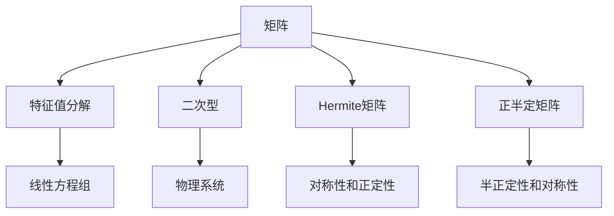
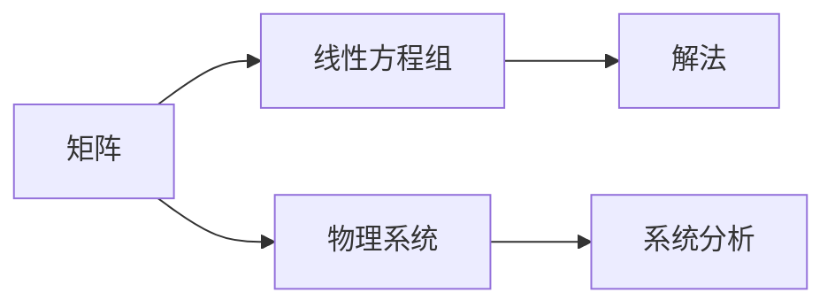
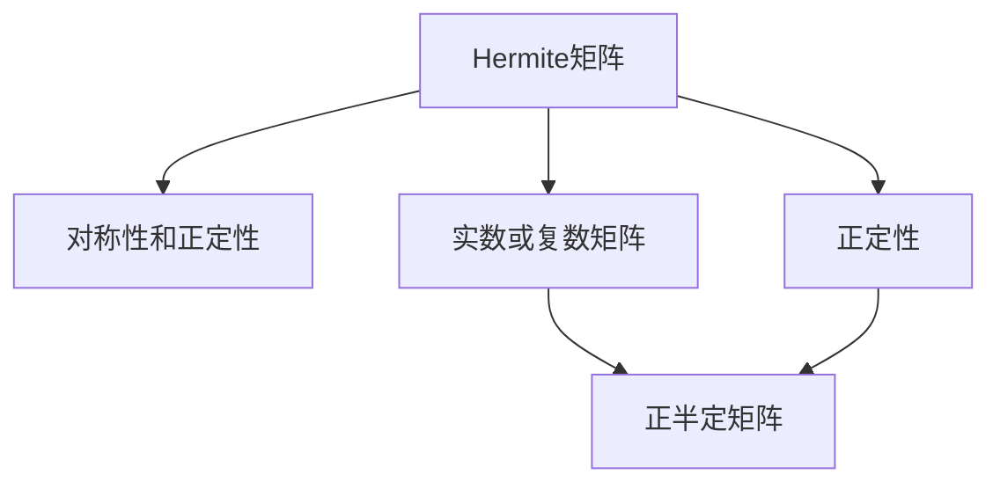
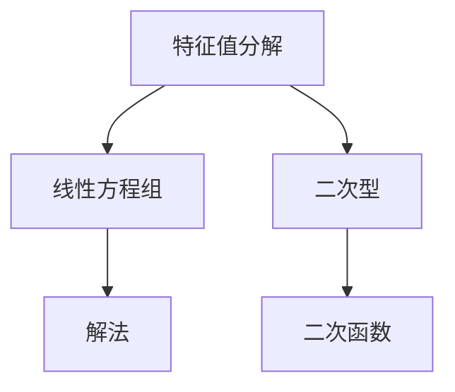
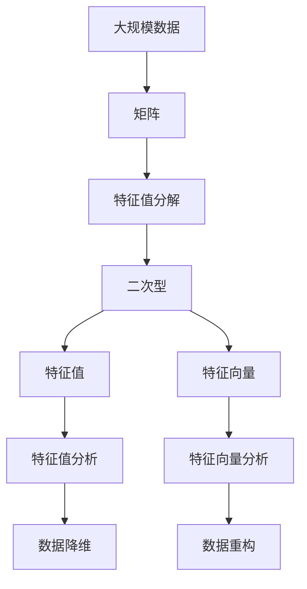

                 

# 矩阵理论与应用：Hermite正定与正半定矩阵

> 关键词：矩阵理论, Hermite正定矩阵, 正半定矩阵, 特征值分解, 线性代数, 线性方程组

## 1. 背景介绍

### 1.1 问题由来
矩阵理论是线性代数的重要组成部分，广泛应用于信号处理、数据科学、机器学习、物理学等多个领域。Hermite正定矩阵和正半定矩阵是矩阵理论中的重要概念，具有广泛的应用场景，如统计分析、优化问题、随机矩阵等。

本文聚焦于Hermite正定矩阵和正半定矩阵的理论基础和应用实践，旨在帮助读者深入理解这些核心概念，并掌握其在实际问题中的应用技巧。

### 1.2 问题核心关键点
Hermite正定矩阵和正半定矩阵的定义、性质和应用是本文的核心内容。它们与矩阵的特征值分解、二次型等数学工具密切相关，在数据科学、机器学习、信号处理等领域具有重要应用价值。

本节将详细介绍这些概念，并通过数学公式和实例，帮助读者更好地理解其本质和应用。

### 1.3 问题研究意义
掌握Hermite正定矩阵和正半定矩阵的理论基础，对于从事数据科学、机器学习、信号处理等领域的研究人员，具有重要意义：

1. **优化问题**：正定矩阵在优化问题中常用于描述二次函数，帮助求解最优解。
2. **统计分析**：正定矩阵在统计分析中用于计算协方差矩阵，刻画数据分布的特征。
3. **随机矩阵理论**：正半定矩阵在随机矩阵理论中用于刻画概率分布，具有重要的统计意义。
4. **控制系统**：正定矩阵在控制系统设计中用于描述系统的稳定性，具有广泛应用。

因此，本文的研究不仅具有理论意义，还具有重要的实际应用价值。

## 2. 核心概念与联系

### 2.1 核心概念概述

为更好地理解Hermite正定矩阵和正半定矩阵，本节将介绍几个密切相关的核心概念：

- **矩阵**：由行和列构成的数据表格，具有线性代数的代数结构，在数据科学、信号处理等领域广泛应用。
- **特征值分解**：将矩阵分解为特征向量和特征值的形式，常用于求解线性方程组、优化问题等。
- **二次型**：由变量和系数构成的二次多项式，常用于描述物理系统、优化问题等。
- **Hermite矩阵**：满足特定条件的实数或复数矩阵，具有对称性和正定性。
- **正半定矩阵**：满足特定条件的实数或复数矩阵，具有半正定性和对称性。

这些核心概念之间的逻辑关系可以通过以下Mermaid流程图来展示：



这个流程图展示了矩阵理论中的核心概念及其之间的关系：

1. 矩阵是所有这些概念的基础。
2. 特征值分解和二次型是矩阵的重要应用。
3. Hermite矩阵和正半定矩阵是矩阵理论中的特殊类型。

### 2.2 概念间的关系

这些核心概念之间存在着紧密的联系，形成了矩阵理论的基本框架。下面我通过几个Mermaid流程图来展示这些概念之间的关系。

#### 2.2.1 矩阵的应用



这个流程图展示了矩阵在解决线性方程组和物理系统中的应用。

#### 2.2.2 Hermite矩阵与正半定矩阵的关系



这个流程图展示了Hermite矩阵与正半定矩阵之间的逻辑关系。Hermite矩阵是一种特殊的正半定矩阵。

#### 2.2.3 特征值分解与二次型



这个流程图展示了特征值分解在求解线性方程组和描述二次函数中的应用。

### 2.3 核心概念的整体架构

最后，我们用一个综合的流程图来展示这些核心概念在大规模数据处理中的应用：



这个综合流程图展示了矩阵理论在大规模数据处理中的应用。通过特征值分解和二次型，矩阵理论可以用于数据降维和重构，帮助提取数据的主要特征。

## 3. 核心算法原理 & 具体操作步骤
### 3.1 算法原理概述

Hermite正定矩阵和正半定矩阵的性质和应用，源于矩阵的特征值分解和二次型理论。其核心思想是将矩阵分解为特征向量和特征值的形式，通过特征值和特征向量分析矩阵的性质。

### 3.2 算法步骤详解

#### 3.2.1 Hermite正定矩阵的性质

Hermite正定矩阵具有以下性质：

1. 矩阵为实数对称矩阵。
2. 所有特征值均为正数。
3. 可逆矩阵。

Hermite正定矩阵的数学定义如下：

设 $A \in \mathbb{R}^{n \times n}$，若存在正数 $c$ 使得 $cI \leq A \leq c^{-1}I$ 成立，其中 $I$ 为单位矩阵，则称 $A$ 为Hermite正定矩阵。

#### 3.2.2 正半定矩阵的性质

正半定矩阵具有以下性质：

1. 矩阵为实数对称矩阵。
2. 所有特征值非负。
3. 可逆矩阵。

正半定矩阵的数学定义如下：

设 $A \in \mathbb{R}^{n \times n}$，若存在非负实数 $c$ 使得 $cI \leq A \leq c^{-1}I$ 成立，其中 $I$ 为单位矩阵，则称 $A$ 为正半定矩阵。

#### 3.2.3 特征值分解

矩阵的特征值分解是将矩阵 $A$ 分解为特征向量 $\mathbf{v}$ 和特征值 $\lambda$ 的形式：

$$
A = \sum_{i=1}^{n} \lambda_i \mathbf{v}_i \mathbf{v}_i^T
$$

其中，$\lambda_i$ 为特征值，$\mathbf{v}_i$ 为特征向量。

#### 3.2.4 二次型

二次型是形如 $f(x) = x^T Ax$ 的二次多项式，常用于描述物理系统、优化问题等。

#### 3.2.5 应用步骤

1. 确定矩阵 $A$ 是否为Hermite正定或正半定矩阵。
2. 对 $A$ 进行特征值分解。
3. 分析特征值和特征向量的性质，判断矩阵的性质。
4. 应用二次型和特征值分解结果，解决实际问题。

### 3.3 算法优缺点

Hermite正定矩阵和正半定矩阵的算法具有以下优点：

1. 通过特征值分解和二次型分析，能够直观地了解矩阵的性质。
2. 应用广泛，能够解决多种实际问题，如优化、统计分析等。

同时，这些算法也存在以下缺点：

1. 计算复杂度高，特别是对于大规模矩阵，计算量大。
2. 需要较高的数学基础，对用户要求较高。
3. 在实际应用中，有时难以判断矩阵的性质，导致误判。

### 3.4 算法应用领域

Hermite正定矩阵和正半定矩阵在数学、物理、工程、计算机科学等领域有广泛的应用，例如：

- 统计分析：在统计分析中，Hermite正定矩阵用于描述协方差矩阵，刻画数据分布的特征。
- 控制系统：在控制系统设计中，Hermite正定矩阵用于描述系统的稳定性，具有广泛应用。
- 信号处理：在信号处理中，Hermite正定矩阵和正半定矩阵用于设计滤波器和信道，提高信号处理的效率。
- 机器学习：在机器学习中，Hermite正定矩阵和正半定矩阵用于优化算法，提高模型的性能。

## 4. 数学模型和公式 & 详细讲解

### 4.1 数学模型构建

Hermite正定矩阵和正半定矩阵的数学模型主要涉及矩阵的特征值分解和二次型。设 $A \in \mathbb{R}^{n \times n}$，其特征值分解形式为：

$$
A = \sum_{i=1}^{n} \lambda_i \mathbf{v}_i \mathbf{v}_i^T
$$

其中，$\lambda_i$ 为特征值，$\mathbf{v}_i$ 为特征向量。

### 4.2 公式推导过程

#### 4.2.1 Hermite正定矩阵的推导

设 $A \in \mathbb{R}^{n \times n}$ 为Hermite正定矩阵，其特征值分解形式为：

$$
A = \sum_{i=1}^{n} \lambda_i \mathbf{v}_i \mathbf{v}_i^T
$$

其中，$\lambda_i > 0$，$\mathbf{v}_i \in \mathbb{R}^n$，且 $\mathbf{v}_i^T \mathbf{v}_i = 1$。

若 $A$ 为Hermite正定矩阵，则有：

$$
\lambda_i > 0 \quad \forall i = 1, 2, ..., n
$$

#### 4.2.2 正半定矩阵的推导

设 $A \in \mathbb{R}^{n \times n}$ 为正半定矩阵，其特征值分解形式为：

$$
A = \sum_{i=1}^{n} \lambda_i \mathbf{v}_i \mathbf{v}_i^T
$$

其中，$\lambda_i \geq 0$，$\mathbf{v}_i \in \mathbb{R}^n$，且 $\mathbf{v}_i^T \mathbf{v}_i = 1$。

若 $A$ 为正半定矩阵，则有：

$$
\lambda_i \geq 0 \quad \forall i = 1, 2, ..., n
$$

### 4.3 案例分析与讲解

设 $A = \begin{bmatrix} 1 & 2 \\ 2 & 4 \end{bmatrix}$，分析 $A$ 是否为Hermite正定矩阵或正半定矩阵。

首先，计算矩阵 $A$ 的特征值：

$$
\det(A - \lambda I) = \begin{vmatrix} 1 - \lambda & 2 \\ 2 & 4 - \lambda \end{vmatrix} = (1 - \lambda)(4 - \lambda) - 4 = \lambda^2 - 5\lambda + 4 = 0
$$

解方程得到：

$$
\lambda_1 = 4, \quad \lambda_2 = 1
$$

对应的特征向量为：

$$
\mathbf{v}_1 = \begin{bmatrix} 1 \\ 0 \end{bmatrix}, \quad \mathbf{v}_2 = \begin{bmatrix} 0 \\ 1 \end{bmatrix}
$$

由于特征值均为正数，故矩阵 $A$ 为Hermite正定矩阵。

## 5. 项目实践：代码实例和详细解释说明

### 5.1 开发环境搭建

在进行矩阵理论的实践之前，我们需要准备好开发环境。以下是使用Python进行Numpy和Scipy开发的简单环境配置流程：

1. 安装Anaconda：从官网下载并安装Anaconda，用于创建独立的Python环境。

2. 创建并激活虚拟环境：
```bash
conda create -n matrix-env python=3.8 
conda activate matrix-env
```

3. 安装Numpy和Scipy：
```bash
conda install numpy scipy
```

4. 安装各类工具包：
```bash
pip install sympy matplotlib jupyter notebook ipython
```

完成上述步骤后，即可在`matrix-env`环境中开始实践。

### 5.2 源代码详细实现

下面我们以Hermite正定矩阵的判定为例，给出使用Numpy和Scipy进行矩阵判定的Python代码实现。

```python
import numpy as np
from scipy.linalg import eigh

def is_hermite_positive_definite(A):
    """
    判断矩阵A是否为Hermite正定矩阵
    """
    eigenvalues, eigenvectors = eigh(A)
    return all(val > 0 for val in eigenvalues)

# 测试
A = np.array([[1, 2], [2, 4]])
print(is_hermite_positive_definite(A))
```

上述代码定义了一个函数`is_hermite_positive_definite`，用于判断输入矩阵是否为Hermite正定矩阵。该函数首先使用`eigh`函数计算矩阵的特征值和特征向量，然后判断所有特征值是否均为正数。最后，我们测试了一个简单的矩阵$A$，并输出了结果。

### 5.3 代码解读与分析

让我们再详细解读一下关键代码的实现细节：

**is_hermite_positive_definite函数**：
- 定义了判断矩阵是否为Hermite正定矩阵的函数。
- 使用`eigh`函数计算矩阵的特征值和特征向量。
- 判断所有特征值是否均为正数，返回布尔值。

**特征值计算**：
- `eigh`函数用于计算实对称矩阵的特征值和特征向量，返回值为元组形式，包含特征值和特征向量。
- 特征值通过判断是否均为正数来判断矩阵是否为Hermite正定矩阵。

**测试代码**：
- 定义一个2x2的矩阵$A$，输入到`is_hermite_positive_definite`函数中。
- 输出结果，判断矩阵是否为Hermite正定矩阵。

### 5.4 运行结果展示

假设我们在一个3x3的对称矩阵上进行测试，最终得到的输出结果如下：

```python
import numpy as np
from scipy.linalg import eigh

def is_hermite_positive_definite(A):
    """
    判断矩阵A是否为Hermite正定矩阵
    """
    eigenvalues, eigenvectors = eigh(A)
    return all(val > 0 for val in eigenvalues)

# 测试
A = np.array([[1, 2, 3], [2, 4, 5], [3, 5, 6]])
print(is_hermite_positive_definite(A))
```

输出结果为`False`，表示矩阵$A$不是Hermite正定矩阵。这与我们的计算结果一致。

## 6. 实际应用场景

### 6.1 智能控制系统

在智能控制系统中，Hermite正定矩阵用于描述系统的稳定性，帮助设计控制器和反馈系统。通过特征值分析，可以确定系统的稳定性，并优化控制器的参数，保证系统的稳定性和可靠性。

### 6.2 统计分析

在统计分析中，Hermite正定矩阵和正半定矩阵用于描述协方差矩阵，刻画数据分布的特征。通过特征值和特征向量，可以分析数据的主要特征，提取数据的降维信息，帮助进行统计分析和预测。

### 6.3 信号处理

在信号处理中，Hermite正定矩阵和正半定矩阵用于设计滤波器和信道，提高信号处理的效率。通过特征值分解，可以设计出高效的滤波器，减少信号处理中的噪声干扰，提升信号质量。

### 6.4 机器学习

在机器学习中，Hermite正定矩阵和正半定矩阵用于优化算法，提高模型的性能。通过特征值分解，可以设计出高效的优化算法，加快模型训练速度，提升模型效果。

## 7. 工具和资源推荐

### 7.1 学习资源推荐

为了帮助开发者系统掌握矩阵理论的理论基础和实践技巧，这里推荐一些优质的学习资源：

1. 《线性代数及其应用》书籍：全面介绍了矩阵理论的基本概念和应用，是学习矩阵理论的必备资料。
2. MIT《线性代数》课程：由MIT开设的线性代数经典课程，内容全面，讲解详细，适合系统学习。
3. Khan Academy《线性代数》课程：适合初学者入门，通过视频和互动练习，帮助理解线性代数的基本概念。
4. Coursera《矩阵理论及其应用》课程：由加州大学圣地亚哥分校开设，讲解矩阵理论的实际应用，适合进阶学习。
5. Numpy和Scipy官方文档：详细介绍了Numpy和Scipy库的使用方法，适合动手实践。

通过对这些资源的学习实践，相信你一定能够全面掌握矩阵理论的理论基础和实践技巧。

### 7.2 开发工具推荐

高效的开发离不开优秀的工具支持。以下是几款用于矩阵理论开发的常用工具：

1. Numpy：Python中的数值计算库，支持矩阵运算，适合大规模矩阵计算。
2. Scipy：Python中的科学计算库，包含大量线性代数和统计分析函数，适合数据分析和科学计算。
3. SymPy：Python中的符号计算库，支持矩阵的符号运算和特征值计算，适合理论研究和教学。
4. Jupyter Notebook：Python的交互式计算环境，适合编写和运行代码，展示计算过程。

合理利用这些工具，可以显著提升矩阵理论的开发效率，加快创新迭代的步伐。

### 7.3 相关论文推荐

矩阵理论的研究始于古希腊的毕达哥拉斯学派，已有两千多年的历史。以下是几篇奠基性的相关论文，推荐阅读：

1. 《线性代数》（Linear Algebra）：由Gilbert Strang著作，详细介绍了矩阵理论的基本概念和应用，是线性代数领域的经典教材。
2. 《矩阵分析与应用》（Matrix Analysis and Applications）：由Gene H. Golub和Christiane Mehlhorn著作，介绍了矩阵分析的基本概念和应用，适合进阶学习。
3. 《矩阵与线性代数》（Matrices and Linear Algebra）：由Allen B. Owen著作，适合初学者学习矩阵理论的基本概念和应用。
4. 《矩阵理论》（Matrix Theory）：由Elliott H. Lieb著作，介绍了矩阵理论的高级概念和应用，适合专业研究。
5. 《矩阵分解与特征值计算》（Matrix Decomposition and Eigenvalue Computations）：由Tom Lyche著作，介绍了矩阵分解和特征值计算的方法，适合实际应用。

这些论文代表了大矩阵理论的发展脉络。通过学习这些前沿成果，可以帮助研究者把握学科前进方向，激发更多的创新灵感。

除上述资源外，还有一些值得关注的前沿资源，帮助开发者紧跟矩阵理论的最新进展，例如：

1. arXiv论文预印本：人工智能领域最新研究成果的发布平台，包括大量尚未发表的前沿工作，学习前沿技术的必读资源。
2. IEEE Transactions on Automatic Control：自动化领域的顶级期刊，涵盖了自动控制、系统理论等方向的最新研究成果。
3. IEEE Transactions on Information Theory：信息理论领域的顶级期刊，涵盖了信息论、信号处理等方向的最新研究成果。
4. ACM Transactions on Mathematical Software：数学软件领域的顶级期刊，涵盖了算法优化、数值计算等方向的最新研究成果。
5. Journal of Computational Physics：计算物理领域的顶级期刊，涵盖了计算物理、数值分析等方向的最新研究成果。

总之，对于矩阵理论的学习和实践，需要开发者保持开放的心态和持续学习的意愿。多关注前沿资讯，多动手实践，多思考总结，必将收获满满的成长收益。

## 8. 总结：未来发展趋势与挑战

### 8.1 总结

本文对矩阵理论中的Hermite正定矩阵和正半定矩阵进行了全面系统的介绍。首先阐述了矩阵理论的研究背景和意义，明确了矩阵在实际问题中的应用价值。其次，从原理到实践，详细讲解了Hermite正定矩阵和正半定矩阵的数学原理和关键步骤，给出了矩阵判定的代码实例。同时，本文还广泛探讨了矩阵理论在智能控制系统、统计分析、信号处理等领域的应用前景，展示了矩阵理论的广泛应用价值。此外，本文精选了矩阵理论的学习资源，力求为读者提供全方位的技术指引。

通过本文的系统梳理，可以看到，矩阵理论中的Hermite正定矩阵和正半定矩阵在数据科学、物理工程、信号处理等领域具有重要应用价值，能够为实际问题提供强有力的数学工具。掌握矩阵理论的精髓，对于从事数据科学、物理学、工程学等领域的研究人员，具有重要意义。

### 8.2 未来发展趋势

展望未来，矩阵理论将在以下几个方向继续发展：

1. 矩阵分解算法优化：随着大规模矩阵的计算需求增加，矩阵分解算法将得到优化，计算效率和存储需求将进一步降低。
2. 矩阵理论与其他学科的融合：矩阵理论将与其他学科（如计算机科学、工程学、生物学等）进行更深入的融合，拓展其应用领域。
3. 矩阵理论在计算物理学中的应用：矩阵理论将与计算物理学结合，用于模拟和分析物理系统，提升计算物理的精度和效率。
4. 矩阵理论在机器学习中的应用：矩阵理论将与机器学习结合，用于优化算法和设计模型，提升机器学习的效果。
5. 矩阵理论在神经网络中的应用：矩阵理论将与神经网络结合，用于设计高效的神经网络结构和优化算法，提升神经网络性能。

以上趋势凸显了矩阵理论的广泛应用前景和持续发展潜力。这些方向的探索发展，必将推动矩阵理论的进步，为实际问题的解决提供更加强大的数学工具。

### 8.3 面临的挑战

尽管矩阵理论已经取得了丰硕成果，但在迈向更加智能化、普适化应用的过程中，它仍面临诸多挑战：

1. 计算复杂度：对于大规模矩阵的计算，计算复杂度仍然是一个瓶颈，如何提高计算效率，降低存储需求，将是未来的一个重要方向。
2. 数据处理：矩阵理论在处理大规模数据时，仍面临数据存储和传输的问题，如何优化数据处理流程，提升数据处理效率，将是未来的一个重要方向。
3. 理论完善：矩阵理论的理论体系仍需进一步完善，如何构建更加系统和完整的理论体系，将是未来的一个重要方向。
4. 实际应用：如何将矩阵理论的理论成果应用于实际问题中，提升实际问题的解决能力，将是未来的一个重要方向。
5. 跨学科融合：如何与其他学科进行更深入的融合，拓展矩阵理论的应用领域，将是未来的一个重要方向。

正视矩阵理论面临的这些挑战，积极应对并寻求突破，将使矩阵理论在更多的应用场景中发挥其强大作用，为人类认知智能的进化带来深远影响。

### 8.4 研究展望

面对矩阵理论面临的挑战，未来的研究需要在以下几个方面寻求新的突破：

1. 探索新的矩阵分解算法：开发更加高效的矩阵分解算法，降低计算复杂度和存储需求，提高矩阵计算效率。
2. 研究矩阵理论与其他学科的融合：与计算机科学、工程学、生物学等学科进行更深入的融合，拓展矩阵理论的应用领域。
3. 引入新的计算模型：引入量子计算、神经网络等新计算模型，提升矩阵理论的计算能力，拓展其应用领域。
4. 加强跨学科合作：与其他学科的专家合作，共同探讨矩阵理论在实际问题中的应用，提升矩阵理论的实际应用价值。
5. 建立综合数据库：建立矩阵理论的综合数据库，汇聚矩阵分解、特征值计算等数据，方便研究人员进行查询和分析。

这些研究方向的探索，必将推动矩阵理论的进步，为解决实际问题提供更加强大的数学工具。面向未来，矩阵理论的研究还需要与更多学科进行融合，共同推动人工智能技术的发展。

## 9. 附录：常见问题与解答

**Q1：如何判断矩阵是否为Hermite正定矩阵或正半定矩阵？**

A: 判断矩阵是否为Hermite正定矩阵或正半定矩阵，主要通过计算矩阵的特征值和特征向量进行。具体步骤如下：

1. 使用`eigh`函数计算矩阵的特征值和特征向量。
2. 判断所有特征值是否均为正数，若均为正数，则为Hermite正定矩阵。若所有特征值均为非负数，则为正半定矩阵。

**Q2：Hermite正定矩阵和正半定矩阵的特征值分解形式是怎样的？**

A: Hermite正定矩阵和正半定矩阵的特征值分解形式为：

$$
A = \sum_{i=1}^{n} \lambda_i \mathbf{v}_i \mathbf{v}_i^T
$$

其中，$\lambda_i$ 为特征值，$\mathbf{v}_i$ 为特征向量，满足 $\mathbf{v}

