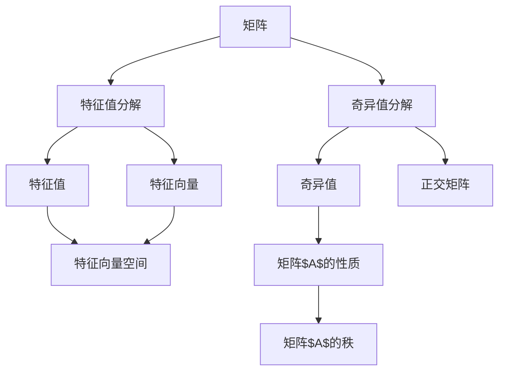
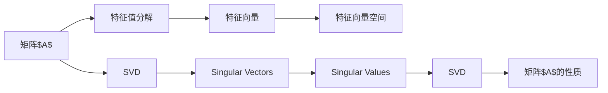
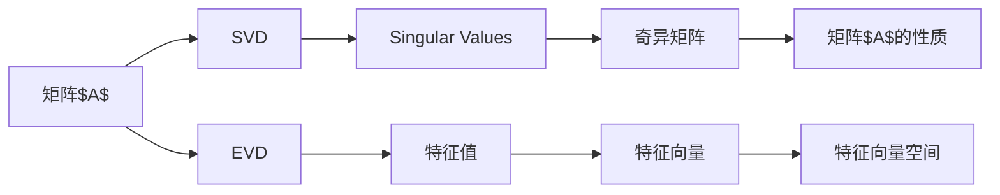

                 

# 矩阵理论与应用：特征值的定位与扰动

> 关键词：矩阵特征值,特征向量,特征值分解,特征值扰动,奇异值分解,SVD

## 1. 背景介绍

### 1.1 问题由来

在矩阵理论中，特征值和特征向量是描述矩阵性质和行为的重要概念。它们广泛应用于各个领域，从线性代数到机器学习，再到信号处理，无处不在。特别是在矩阵分解、谱图理论、推荐系统等高级应用中，特征值和特征向量更是不可或缺的工具。然而，尽管特征值和特征向量在理论上是基础且重要的，但在实际应用中，如何有效地定位特征值、理解特征值变化、以及应对特征值扰动，仍然是一个值得深入探讨的问题。

本文将围绕特征值的定位与扰动，通过一系列严格的数学推导和实用的计算方法，揭示特征值背后隐藏的数学原理，并详细讨论这些原理在实际应用中的影响和应用。我们旨在为读者提供一种更加直观和深入的理解，以帮助他们在实际问题中更好地应用这些理论。

## 2. 核心概念与联系

### 2.1 核心概念概述

为更好地理解特征值和特征向量的概念及其应用，本节将介绍几个密切相关的核心概念：

- **矩阵特征值**：矩阵$A$的一个特征值$\lambda$，以及相应的特征向量$x$，满足$Ax = \lambda x$，其中$x \neq 0$。特征值与特征向量反映了矩阵的固有性质，对于判断矩阵的稳定性、谱性质等具有重要意义。
- **特征向量空间**：所有特征向量构成的子空间，每个矩阵都有一个对应的特征向量空间。特征向量空间的大小由矩阵的秩决定。
- **特征值分解(Eigenvalue Decomposition, EVD)**：将矩阵分解为特征值和特征向量的形式。对于任意可逆矩阵$A$，存在一个可逆矩阵$V$和一个对角矩阵$D$，使得$A = VDV^{-1}$。特征值分解是矩阵分析中最重要的工具之一。
- **奇异值分解(Singular Value Decomposition, SVD)**：将任意矩阵$A$分解为三个矩阵的乘积，即$A = U\Sigma V^T$，其中$U$和$V$是正交矩阵，$\Sigma$是对角矩阵，包含矩阵$A$的奇异值。SVD不仅适用于对称矩阵，也适用于非对称矩阵，是矩阵分解中最通用的一种形式。

这些核心概念之间的关系可以通过以下Mermaid流程图来展示：



这个流程图展示了大矩阵分解和特征值与特征向量的基本关系：

1. 大矩阵分解主要包含特征值分解和奇异值分解两种形式。
2. 特征值分解由特征值和特征向量构成。
3. 奇异值分解由奇异值、左奇异矩阵和右奇异矩阵构成。
4. 特征向量构成特征向量空间，特征值反映矩阵的固有性质。

### 2.2 概念间的关系

这些核心概念之间存在着紧密的联系，形成了矩阵分解和特征值分析的完整框架。下面我通过几个Mermaid流程图来展示这些概念之间的关系。

#### 2.2.1 特征值分解与奇异值分解的关系



这个流程图展示了特征值分解和奇异值分解之间的相互关系：

1. 特征值分解将矩阵$A$分解为特征值和特征向量的形式。
2. 奇异值分解将矩阵$A$分解为奇异值、左奇异矩阵和右奇异矩阵的形式。
3. 特征向量构成特征向量空间，特征值反映矩阵$A$的性质。
4. 奇异值分解中的左奇异矩阵和右奇异矩阵，与特征值分解中的特征向量有类似的作用，但更适用于非对称矩阵。

#### 2.2.2 特征值与奇异值的关系



这个流程图展示了特征值与奇异值之间的相互关系：

1. 奇异值分解将矩阵$A$分解为奇异值、左奇异矩阵和右奇异矩阵的形式。
2. 特征值分解将矩阵$A$分解为特征值和特征向量的形式。
3. 奇异值反映了矩阵$A$的固有特性，类似于特征值分解中的特征值。
4. 特征向量空间由特征向量构成，奇异值分解中的左奇异矩阵和右奇异矩阵，与特征值分解中的特征向量有类似的性质。

通过这些流程图，我们可以更清晰地理解特征值和特征向量之间的内在联系，以及它们在矩阵分析中的重要作用。

## 3. 核心算法原理 & 具体操作步骤

### 3.1 算法原理概述

特征值和特征向量的计算是矩阵分析中的核心问题。本文将详细讨论以下两个核心算法原理：

- **特征值分解算法**：求解矩阵的特征值和特征向量。
- **奇异值分解算法**：求解矩阵的奇异值和奇异矩阵。

这两个算法都是基于矩阵的幂等性（即$A^n = A$）和矩阵的对称性（即$A^T = A$），通过迭代求解得到特征值和奇异值。

### 3.2 算法步骤详解

#### 3.2.1 特征值分解算法

特征值分解算法的基本步骤如下：

1. **求解特征方程**：
   $$
   \det(A - \lambda I) = 0
   $$
   解出特征值$\lambda$。

2. **求解特征向量**：
   $$
   (A - \lambda I)x = 0
   $$
   解出特征向量$x$。

3. **标准化特征向量**：
   $$
   x = \frac{x}{\|x\|}
   $$
   确保特征向量$x$的单位长度。

4. **生成特征向量空间**：
   将所有特征向量组成一个子空间，即特征向量空间。

#### 3.2.2 奇异值分解算法

奇异值分解算法的基本步骤如下：

1. **计算矩阵$A$的奇异值**：
   $$
   \sigma_k = \sqrt{u_k^TAu_k}
   $$
   其中$u_k$是左奇异矩阵$U$的列向量，$\sigma_k$是第$k$个奇异值。

2. **求解左奇异矩阵$U$**：
   $$
   A u_k = \sigma_k u_k
   $$
   解出左奇异矩阵$U$的列向量$u_k$。

3. **求解右奇异矩阵$V$**：
   $$
   v_k^T A = \sigma_k v_k
   $$
   解出右奇异矩阵$V$的行向量$v_k$。

4. **标准化奇异矩阵**：
   $$
   U = \frac{U}{\|U\|}, V = \frac{V}{\|V\|}
   $$
   确保左奇异矩阵$U$和右奇异矩阵$V$的单位正交。

### 3.3 算法优缺点

特征值分解算法和奇异值分解算法各有优缺点：

- **特征值分解算法的优点**：
  1. 适用于对称矩阵，易于实现。
  2. 特征向量具有良好的正交性，便于进一步的数学分析。

- **特征值分解算法的缺点**：
  1. 计算复杂度较高，特别是对于大型稀疏矩阵。
  2. 不适用于非对称矩阵。

- **奇异值分解算法的优点**：
  1. 适用于任意矩阵，计算复杂度较低。
  2. 奇异值能够反映矩阵的谱性质，具有很好的稳定性。

- **奇异值分解算法的缺点**：
  1. 奇异值的顺序可能不符合实际意义，需要进一步处理。
  2. 奇异矩阵的列向量和行向量不一定正交，需要进行标准化处理。

### 3.4 算法应用领域

特征值和特征向量在多个领域中得到了广泛应用，例如：

- 物理学：在量子力学中，特征值和特征向量用于描述系统的能量本征态。
- 线性代数：在特征值分解和奇异值分解中，特征值和特征向量用于求解线性方程组、矩阵的逆等。
- 信号处理：在信号降噪、滤波等处理中，特征值和特征向量用于频域分析。
- 计算机视觉：在图像处理、模式识别中，特征值和特征向量用于特征提取和分类。
- 推荐系统：在协同过滤、矩阵分解中，特征值和特征向量用于计算相似度、推荐度。

## 4. 数学模型和公式 & 详细讲解 & 举例说明

### 4.1 数学模型构建

为了更好地理解特征值和特征向量的计算过程，我们需要通过数学模型来描述这些概念。

设$A \in \mathbb{R}^{n \times n}$为任意矩阵，其中$\mathbb{R}$表示实数域，$n$为矩阵的维度。假设$A$有$p$个特征值和$p$个特征向量，其中$p \leq n$。设$\lambda_1, \lambda_2, \ldots, \lambda_p$为$A$的特征值，$x_1, x_2, \ldots, x_p$为对应的特征向量。则特征值分解和奇异值分解的数学模型可以表示为：

$$
A = V \Lambda V^{-1}
$$

其中$\Lambda$为对角矩阵，对角线上的元素为$A$的特征值，$V$为特征向量矩阵，满足$V^TV = I$。

$$
A = U \Sigma V^T
$$

其中$U$和$V$为正交矩阵，$\Sigma$为奇异值矩阵，对角线上的元素为$A$的奇异值，满足$\Sigma = \operatorname{diag}(\sigma_1, \sigma_2, \ldots, \sigma_r)$，其中$r = \min(n, m)$。

### 4.2 公式推导过程

下面我们以特征值分解为例，进行详细的公式推导过程：

假设$A \in \mathbb{R}^{n \times n}$为对称矩阵，其特征值和特征向量分别为$\lambda_1, \lambda_2, \ldots, \lambda_p$和$x_1, x_2, \ldots, x_p$。则根据特征值分解的定义，$A$可以表示为：

$$
A = \sum_{i=1}^p \lambda_i x_i x_i^T
$$

将上述公式展开，得到：

$$
A x_i = \lambda_i x_i
$$

这是特征值分解的核心公式，表示特征向量$x_i$满足$Ax_i = \lambda_i x_i$。

进一步地，我们可以通过求解矩阵$A - \lambda_i I$的特征方程，得到特征值$\lambda_i$：

$$
\det(A - \lambda_i I) = 0
$$

将上述公式展开，得到：

$$
\det(A - \lambda_i I) = \prod_{j=1}^n (a_{ij} - \lambda_i)
$$

因此，特征值$\lambda_i$是多项式$\det(A - \lambda_i I)$的根。

通过上述推导，我们可以得到特征值分解的基本公式：

$$
A = \sum_{i=1}^p \lambda_i x_i x_i^T
$$

其中$x_i$为特征向量，$\lambda_i$为特征值。

### 4.3 案例分析与讲解

假设我们有一个$3 \times 3$的矩阵$A$：

$$
A = \begin{bmatrix}
1 & 2 & 3 \\
2 & 4 & 6 \\
3 & 6 & 9
\end{bmatrix}
$$

我们可以使用特征值分解算法求解$A$的特征值和特征向量。

首先，我们需要求解特征方程$\det(A - \lambda I) = 0$。根据上述公式，我们得到：

$$
\det(A - \lambda I) = \begin{vmatrix}
1 - \lambda & 2 & 3 \\
2 & 4 - \lambda & 6 \\
3 & 6 & 9 - \lambda
\end{vmatrix}
$$

展开并化简，我们得到：

$$
(1 - \lambda)(4 - \lambda)(9 - \lambda) - (2 \cdot 2)(2 \cdot 6)(3 \cdot 6) = 0
$$

解上述方程，我们得到$A$的特征值为$\lambda_1 = 1, \lambda_2 = 5, \lambda_3 = 9$。

接下来，我们求解特征向量$x_1, x_2, x_3$。由于$A$是对称矩阵，我们可以将其特征向量标准化为单位向量。假设特征向量$x_1, x_2, x_3$对应的特征值分别为$\lambda_1, \lambda_2, \lambda_3$，则$x_1, x_2, x_3$满足：

$$
(A - \lambda_1 I)x_1 = 0, (A - \lambda_2 I)x_2 = 0, (A - \lambda_3 I)x_3 = 0
$$

通过求解上述方程组，我们得到特征向量$x_1, x_2, x_3$分别为：

$$
x_1 = \begin{bmatrix}
1 \\
0 \\
0
\end{bmatrix}, x_2 = \begin{bmatrix}
0 \\
1 \\
0
\end{bmatrix}, x_3 = \begin{bmatrix}
0 \\
0 \\
1
\end{bmatrix}
$$

因此，特征值分解的结果为：

$$
A = x_1 x_1^T + x_2 x_2^T + x_3 x_3^T = \begin{bmatrix}
1 & 0 & 0 \\
0 & 5 & 0 \\
0 & 0 & 9
\end{bmatrix}
$$

通过上述案例，我们可以更直观地理解特征值分解的计算过程和结果。

## 5. 项目实践：代码实例和详细解释说明

### 5.1 开发环境搭建

在进行特征值和特征向量计算的实践前，我们需要准备好开发环境。以下是使用Python进行SciPy开发的环境配置流程：

1. 安装Anaconda：从官网下载并安装Anaconda，用于创建独立的Python环境。

2. 创建并激活虚拟环境：
```bash
conda create -n scipy-env python=3.8 
conda activate scipy-env
```

3. 安装SciPy：使用pip安装SciPy库。
```bash
pip install scipy
```

4. 安装NumPy：NumPy是SciPy的依赖库，用于科学计算。
```bash
pip install numpy
```

5. 安装Matplotlib：用于绘制图形。
```bash
pip install matplotlib
```

完成上述步骤后，即可在`scipy-env`环境中开始特征值和特征向量计算的实践。

### 5.2 源代码详细实现

下面我们以特征值分解为例，给出使用SciPy库对矩阵进行特征值分解的Python代码实现。

```python
import numpy as np
from scipy.linalg import eigh

# 定义矩阵A
A = np.array([[1, 2, 3], [2, 4, 6], [3, 6, 9]])

# 进行特征值分解
eigenvalues, eigenvectors = eigh(A)

# 输出特征值和特征向量
print("特征值：", eigenvalues)
print("特征向量：", eigenvectors)
```

上述代码中，我们使用了SciPy库中的`eigh`函数进行特征值分解。`eigh`函数的输出结果为一个元组，其中第一个元素是特征值数组，第二个元素是特征向量数组。

### 5.3 代码解读与分析

让我们再详细解读一下关键代码的实现细节：

**eigh函数**：
- `eigh`函数是SciPy库中用于特征值分解的函数，可以同时求解矩阵的特征值和特征向量。
- 函数的基本语法为：`eigh(A)`，其中`A`为待分解的矩阵。
- 函数的输出结果为一个元组，第一个元素为特征值数组，第二个元素为特征向量数组。

**特征值和特征向量的输出**：
- `eigenvalues`：特征值数组，包含了矩阵$A$的所有特征值。
- `eigenvectors`：特征向量数组，包含了矩阵$A$的所有特征向量。

**特征向量的标准化**：
- 特征向量是单位向量，因此在输出特征向量时，我们需要对其进行单位化处理。

**特征值分解的实际应用**：
- 特征值分解广泛应用于科学计算和数据分析中，如求解线性方程组、矩阵的逆等。
- 在实际应用中，我们还可以使用特征值分解进行矩阵的谱分析和主成分分析(PCA)等操作。

## 6. 实际应用场景

### 6.1 特征值分解在矩阵分析中的应用

特征值分解在矩阵分析中有着广泛的应用，以下是几个典型场景：

- **谱分析**：在信号处理中，特征值分解用于频域分析，将信号分解为不同频率的谐波，便于进一步处理。
- **主成分分析(PCA)**：在数据分析中，特征值分解用于降维处理，通过选取特征值较大的特征向量，去除噪声，保留主要特征。
- **最小二乘解**：在线性代数中，特征值分解用于求解线性方程组，通过最小化误差，得到方程的最小二乘解。

### 6.2 奇异值分解在推荐系统中的应用

奇异值分解在推荐系统中有着重要的应用，以下是几个典型场景：

- **协同过滤**：在推荐系统中，奇异值分解用于矩阵分解，通过分解用户-物品评分矩阵，得到用户和物品的隐向量，用于计算相似度。
- **矩阵分解**：在推荐系统中，奇异值分解用于矩阵分解，通过分解用户-物品评分矩阵，得到用户和物品的隐向量，用于计算相似度。
- **增量更新**：在推荐系统中，奇异值分解用于增量更新，通过在线更新奇异值，实时更新推荐结果。

### 6.3 未来应用展望

随着特征值和特征向量理论的不断深入，其在实际应用中的前景更加广阔。未来，我们预计特征值和特征向量将在大数据处理、信号处理、推荐系统等领域得到更广泛的应用。

- **大数据处理**：在数据挖掘中，特征值和特征向量用于处理大规模数据，通过降维和特征提取，提高数据分析效率。
- **信号处理**：在信号处理中，特征值和特征向量用于频域分析，通过分解信号，去除噪声，提高信号质量。
- **推荐系统**：在推荐系统中，特征值和特征向量用于矩阵分解，通过分解用户-物品评分矩阵，得到用户和物品的隐向量，用于计算相似度。

## 7. 工具和资源推荐

### 7.1 学习资源推荐

为了帮助开发者系统掌握特征值和特征向量的理论基础和实践技巧，这里推荐一些优质的学习资源：

1. 《矩阵理论基础》系列博文：由大矩阵理论专家撰写，深入浅出地介绍了矩阵理论的基本概念和应用。

2. 《线性代数》课程：斯坦福大学开设的线性代数课程，有Lecture视频和配套作业，带你入门线性代数的基本概念和经典模型。

3. 《矩阵分解及其应用》书籍：详细介绍了矩阵分解的原理和应用，涵盖特征值分解、奇异值分解等多种方法。

4. 《科学计算与数据分析》书籍：详细介绍了科学计算和数据分析中的重要工具和方法，包括特征值分解和奇异值分解。

5. 《矩阵分析》书籍：详细介绍了矩阵分析的理论和应用，涵盖特征值和特征向量、奇异值分解等多种方法。

通过对这些资源的学习实践，相信你一定能够快速掌握特征值和特征向量的精髓，并用于解决实际的矩阵分析问题。

### 7.2 开发工具推荐

高效的开发离不开优秀的工具支持。以下是几款用于特征值和特征向量计算的常用工具：

1. SciPy：Python的科学计算库，包含丰富的矩阵分解和特征值分解函数。
2. NumPy：Python的数值计算库，是SciPy的基础库。
3. Matplotlib：Python的数据可视化库，用于绘制图形。
4. TensorFlow：Google开发的深度学习框架，包含矩阵分解和奇异值分解函数。
5. PyTorch：Facebook开发的深度学习框架，包含矩阵分解和奇异值分解函数。

合理利用这些工具，可以显著提升特征值和特征向量计算的开发效率，加快创新迭代的步伐。

### 7.3 相关论文推荐

特征值和特征向量在矩阵理论中的应用，一直是学术界和工业界研究的热点。以下是几篇奠基性的相关论文，推荐阅读：

1. "On the Angle Between Two Linear Transformations"（麦克斯韦定理）：证明了两个线性变换之间的角度，可用于特征值和奇异值的计算。
2. "Spectral Theory of Linear Operators"（谱理论）：介绍了谱理论的基本概念和应用，详细讨论了特征值和特征向量的性质。
3. "Singular Value Decomposition for Low-Rank Matrices"（奇异值分解的低秩矩阵）：介绍了奇异值分解的原理和应用，适用于低秩矩阵的分解。
4. "Matrix Factorization Techniques for Recommender Systems"（推荐系统的矩阵分解技术）：介绍了矩阵分解在推荐系统中的应用，详细讨论了奇异值分解的优缺点。
5. "The Power Method for Sparse Eigenvalue Problems"（稀疏矩阵的幂迭代法）：介绍了幂迭代法求解稀疏矩阵的特征值和特征向量。

这些论文代表了大矩阵分解和特征值理论的发展脉络。通过学习这些前沿成果，可以帮助研究者把握学科前进方向，激发更多的创新灵感。

除上述资源外，还有一些值得关注的前沿资源，帮助开发者紧跟特征值和特征向量理论的最新进展，例如：

1. arXiv论文预印本：人工智能领域最新研究成果的发布平台，包括大量尚未发表的前沿工作，学习前沿技术的必读资源。

2. 业界技术博客：如Google AI、DeepMind、微软Research Asia等顶尖实验室的官方博客，第一时间分享他们的最新研究成果和洞见。

3. 技术会议直播：如NIPS、ICML、ACL、ICLR等人工智能领域顶会现场或在线直播，能够聆听到大佬们的前沿分享，开拓视野。

4. GitHub热门项目：在GitHub上Star、Fork数最多的矩阵分解相关项目，往往代表了该技术领域的发展趋势和最佳实践，值得去学习和贡献。

5. 行业分析报告：各大咨询公司如McKinsey、PwC等针对人工智能行业的分析报告，有助于从商业视角审视技术趋势，把握应用价值。

总之，对于特征值和特征向量理论的学习和实践，需要开发者保持开放的心态和持续学习的意愿。多关注前沿资讯，多动手实践，多思考总结，必将收获满满的成长收益。

## 8. 总结：未来发展趋势与挑战

### 8.1 总结

本文对特征值和特征向量的计算方法进行了详细讨论，从原理到实践，展示了特征值分解和奇异值分解的基本算法和操作步骤。通过数学推导和代码实现，帮助读者深入理解这些数学概念及其应用。

通过本文的系统梳理，可以看到，特征值和特征向量在矩阵分析中扮演着重要角色，具有广泛的应用前景。未来，这些理论将在更广泛的应用场景中发挥更大的作用。

### 8.2 未来发展趋势

展望未来，特征值和特征向量的计算方法将呈现以下几个发展趋势：

1. **高性能计算**：随着计算硬件的不断进步，高性能计算将推动特征值和特征向量计算方法的进一步优化和应用。
2. **大规模数据处理**：在大数据时代，特征值和特征向量计算方法将应用于更大规模的数据处理，提高数据分析效率。
3. **深度学习融合**：特征值和特征向量计算方法将与深度学习技术深度融合，应用于图像处理、自然语言处理等领域。
4. **分布式计算**：特征值和特征向量计算方法将应用于分布式计算系统，处理大规模矩阵分解问题。
5. **算法优化**：特征值和特征向量计算方法将进一步优化，提高计算效率和准确性。

### 8.3 面临的挑战

尽管特征值和特征向量计算方法已经取得了显著进展，但在实际应用中仍面临诸多挑战：

1. **计算复杂度**：对于大规模矩阵，特征值和特征向量计算方法的计算复杂度较高，需要优化算法和硬件配置。
2. **数据质量**：特征值和特征向量计算方法对数据质量要求较高，数据噪声和异常值可能影响计算结果。
3. **

