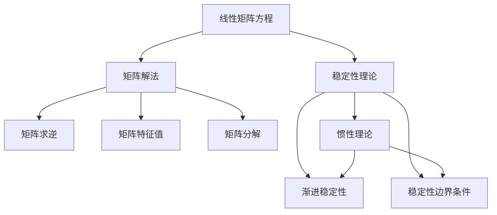

                 

# 矩阵理论与应用：线性矩阵方程与惯性理论

> 关键词：矩阵理论,线性代数,矩阵方程,动态系统,惯性理论,稳定性分析

## 1. 背景介绍

### 1.1 问题由来
在数学和物理领域，矩阵及其运算具有重要的理论基础和广泛应用。从线性代数到动态系统理论，从控制系统到信号处理，从优化理论到数据科学，矩阵理论无处不在。然而，深入理解矩阵理论的应用，尤其是在实际问题中灵活应用，往往需要对矩阵方程及其解的性质有深刻的把握。

在现代工程系统和信号处理中，线性矩阵方程的应用非常普遍，例如在控制系统理论中的状态空间方程，信号处理中的离散时间线性系统方程等。对这类方程的稳定性分析，是保障系统安全和性能的关键环节。其中，惯性理论作为线性动态系统理论的重要组成部分，提供了分析和设计动态系统稳定性的框架。

本文将从矩阵理论基础出发，系统介绍线性矩阵方程的构建、解法以及稳定性分析，特别关注惯性理论在实际系统中的应用。通过深入分析，旨在帮助读者更好地理解矩阵方程的解法，掌握动态系统的稳定性理论，从而为实际工程应用提供有力支撑。

## 2. 核心概念与联系

### 2.1 核心概念概述

为更好地理解线性矩阵方程与惯性理论，本节将介绍几个关键概念：

- 线性矩阵方程：形如 $AX=B$ 的矩阵方程，其中 $A$ 和 $B$ 为已知矩阵，$X$ 为未知矩阵。线性矩阵方程在控制系统和信号处理中具有广泛应用。
- 矩阵解法：求解线性矩阵方程的未知矩阵 $X$ 的过程，包括矩阵求逆、矩阵特征值、矩阵分解等方法。
- 稳定性理论：描述系统在一定条件下能否稳定运行的性质，分为渐进稳定性和稳定性边界条件。
- 惯性理论：用于描述动态系统在输入或扰动下的响应行为，稳定性分析的重要工具。

这些概念构成了线性矩阵方程与惯性理论的核心框架，为后续深入探讨提供了基础。

### 2.2 概念间的关系

这些核心概念之间的逻辑关系可以通过以下Mermaid流程图来展示：



这个流程图展示了从线性矩阵方程到矩阵解法，再到稳定性理论和惯性理论的关系：

1. 线性矩阵方程是矩阵解法和稳定性理论的基础。
2. 矩阵解法包括矩阵求逆、特征值、分解等，是求解线性矩阵方程的具体方法。
3. 稳定性理论描述系统的稳定性质，包括渐进稳定性和稳定性边界条件。
4. 惯性理论提供稳定性分析的框架，指导实际系统的设计和控制。

这些概念共同构成了解决线性矩阵方程和分析动态系统稳定性的完整生态系统。通过理解这些核心概念，可以更好地把握线性矩阵方程与惯性理论的工作原理和优化方向。

## 3. 核心算法原理 & 具体操作步骤
### 3.1 算法原理概述

线性矩阵方程 $AX=B$ 的解法通常包括矩阵求逆、特征值分解、QR分解、LU分解等多种方法。稳定性分析则通过计算系统的特征值、特征向量以及时间响应，判断系统是否稳定。

其中，矩阵求逆法基于矩阵的乘法逆矩阵，适用于方阵方程；矩阵特征值分解法通过计算矩阵的特征值和特征向量，分析矩阵的稳定性；QR分解和LU分解则通过矩阵分解，提高求解效率和稳定性。

惯性理论通过计算系统的惯性矩阵，描述系统在不同输入下的响应行为。通常，惯性矩阵为系统状态矩阵或系统的拉普拉斯矩阵的对称正定矩阵。

### 3.2 算法步骤详解

#### 3.2.1 矩阵求逆

矩阵 $A$ 的逆矩阵 $A^{-1}$ 满足 $AA^{-1}=I$，其中 $I$ 为单位矩阵。求解矩阵逆的步骤如下：

1. 判断 $A$ 是否可逆。如果 $A$ 奇异，则无法求逆。
2. 计算 $A$ 的伴随矩阵 $adj(A)$。
3. 计算 $A$ 的逆矩阵 $A^{-1}=adj(A)/|A|$，其中 $|A|$ 为 $A$ 的行列式。

#### 3.2.2 矩阵特征值分解

矩阵 $A$ 的特征值分解式为 $A=V\Lambda V^{-1}$，其中 $\Lambda$ 为对角矩阵，包含 $A$ 的所有特征值，$V$ 为特征向量矩阵。求解特征值的步骤如下：

1. 构造特征多项式 $p(\lambda)=\det(A-\lambda I)$。
2. 求解特征多项式的根，即矩阵 $A$ 的特征值。
3. 对于每个特征值 $\lambda_i$，求解特征方程 $(A-\lambda_i I)v_i=0$，得到对应的特征向量 $v_i$。

#### 3.2.3 QR分解

QR分解将矩阵 $A$ 分解为 $A=QR$，其中 $Q$ 为正交矩阵，$R$ 为上三角矩阵。求解QR分解的步骤如下：

1. 将矩阵 $A$ 行正交化，得到矩阵 $Q$。
2. 计算 $R=Q^T A$，其中 $Q^T$ 为 $Q$ 的转置矩阵。
3. 验证 $A=QR$ 是否成立，即 $QR=QQR$。

#### 3.2.4 LU分解

LU分解将矩阵 $A$ 分解为 $A=LU$，其中 $L$ 为下三角矩阵，$U$ 为上三角矩阵。求解LU分解的步骤如下：

1. 将矩阵 $A$ 通过行变换化为上三角矩阵 $U$。
2. 通过列变换得到下三角矩阵 $L$，使得 $LU=A$。
3. 验证 $A=LU$ 是否成立，即 $LU=LU$。

#### 3.2.5 惯性理论

惯性矩阵 $M$ 描述系统在输入或扰动下的响应行为，通过计算系统状态矩阵或拉普拉斯矩阵的对称正定矩阵，得到。求解惯性矩阵的步骤如下：

1. 计算系统状态矩阵或拉普拉斯矩阵。
2. 通过对称正定矩阵分解，得到惯性矩阵 $M$。
3. 分析惯性矩阵的特征值，判断系统的稳定性。

### 3.3 算法优缺点

线性矩阵方程的解法包括矩阵求逆、特征值分解、QR分解、LU分解等，各有优缺点：

- 矩阵求逆适用于方阵方程，但在矩阵奇异时无法求解。
- 特征值分解可以求解任意大小的矩阵，但计算复杂度高，需要求解高次多项式根。
- QR分解和LU分解计算效率高，但不适用于奇异矩阵。
- 惯性理论提供稳定性分析的框架，但需要计算系统的特征值和惯性矩阵。

稳定性分析是线性矩阵方程解法的关键应用，通过分析系统特征值和响应行为，判断系统是否稳定。惯性理论则提供稳定性分析的高级工具，适用于复杂系统的设计。

### 3.4 算法应用领域

线性矩阵方程及其解法，稳定性理论和惯性理论广泛应用于以下几个领域：

- 控制系统：描述系统状态和输入输出关系的矩阵方程，通过矩阵解法和稳定性分析，设计控制器和稳定性边界条件。
- 信号处理：线性时间不变系统的状态空间方程，通过矩阵解法和稳定性分析，分析系统频谱特性。
- 优化理论：优化问题的线性矩阵方程，通过矩阵分解和稳定性分析，求解最优解。
- 动态系统理论：描述动态系统状态的矩阵方程，通过矩阵解法和稳定性分析，分析系统响应行为。

这些领域的应用，凸显了矩阵方程和稳定性理论在实际问题中的重要性和广泛性。通过灵活运用这些数学工具，可以有效解决实际系统设计和控制中的各种问题。

## 4. 数学模型和公式 & 详细讲解 & 举例说明

### 4.1 数学模型构建

在线性矩阵方程 $AX=B$ 中，$A$ 和 $B$ 为已知矩阵，$X$ 为未知矩阵。假设 $A$ 为 $n \times n$ 矩阵，$B$ 为 $n \times m$ 矩阵，$X$ 为 $n \times m$ 矩阵。

### 4.2 公式推导过程

#### 4.2.1 矩阵求逆

假设 $A$ 为 $n \times n$ 矩阵，其逆矩阵 $A^{-1}$ 满足 $AA^{-1}=I$，其中 $I$ 为单位矩阵。矩阵 $A$ 的逆矩阵的计算公式为：

$$
A^{-1} = \frac{adj(A)}{|A|}
$$

其中 $adj(A)$ 为 $A$ 的伴随矩阵，$|A|$ 为 $A$ 的行列式。

#### 4.2.2 矩阵特征值分解

假设 $A$ 为 $n \times n$ 矩阵，其特征值分解式为：

$$
A = V\Lambda V^{-1}
$$

其中 $\Lambda$ 为对角矩阵，包含 $A$ 的所有特征值，$V$ 为特征向量矩阵。特征值的计算公式为：

$$
\lambda = \frac{p(\lambda)}{\det(A-\lambda I)}
$$

其中 $p(\lambda)$ 为特征多项式，$I$ 为单位矩阵。

#### 4.2.3 QR分解

假设 $A$ 为 $n \times n$ 矩阵，其QR分解式为：

$$
A = QR
$$

其中 $Q$ 为正交矩阵，$R$ 为上三角矩阵。QR分解的计算过程如下：

1. 将矩阵 $A$ 行正交化，得到矩阵 $Q$。
2. 计算 $R=Q^T A$，其中 $Q^T$ 为 $Q$ 的转置矩阵。
3. 验证 $A=QR$ 是否成立，即 $QR=QQR$。

#### 4.2.4 LU分解

假设 $A$ 为 $n \times n$ 矩阵，其LU分解式为：

$$
A = LU
$$

其中 $L$ 为下三角矩阵，$U$ 为上三角矩阵。LU分解的计算过程如下：

1. 将矩阵 $A$ 通过行变换化为上三角矩阵 $U$。
2. 通过列变换得到下三角矩阵 $L$，使得 $LU=A$。
3. 验证 $A=LU$ 是否成立，即 $LU=LU$。

#### 4.2.5 惯性理论

假设 $M$ 为 $n \times n$ 惯性矩阵，其特征值分解式为：

$$
M = V\Lambda V^{-1}
$$

其中 $\Lambda$ 为对角矩阵，包含 $M$ 的所有特征值，$V$ 为特征向量矩阵。稳定性分析的计算过程如下：

1. 计算系统状态矩阵或拉普拉斯矩阵。
2. 通过对称正定矩阵分解，得到惯性矩阵 $M$。
3. 分析惯性矩阵的特征值，判断系统的稳定性。

### 4.3 案例分析与讲解

#### 4.3.1 矩阵求逆案例

假设矩阵 $A$ 为：

$$
A = \begin{bmatrix}
2 & 1 \\
3 & 1
\end{bmatrix}
$$

求解 $A$ 的逆矩阵 $A^{-1}$。

1. 计算 $A$ 的行列式 $|A|$：

$$
|A| = 2 \times 1 - 1 \times 3 = -1
$$

2. 计算 $A$ 的伴随矩阵 $adj(A)$：

$$
adj(A) = \begin{bmatrix}
1 & -1 \\
-3 & 2
\end{bmatrix}
$$

3. 计算 $A$ 的逆矩阵 $A^{-1}$：

$$
A^{-1} = \frac{adj(A)}{|A|} = \begin{bmatrix}
-1 & 1 \\
\frac{3}{2} & -\frac{1}{2}
\end{bmatrix}
$$

#### 4.3.2 矩阵特征值分解案例

假设矩阵 $A$ 为：

$$
A = \begin{bmatrix}
2 & 1 \\
1 & 3
\end{bmatrix}
$$

求解 $A$ 的特征值 $\lambda$。

1. 构造特征多项式 $p(\lambda)$：

$$
p(\lambda) = \det(A-\lambda I) = \begin{vmatrix}
2-\lambda & 1 \\
1 & 3-\lambda
\end{vmatrix}
$$

2. 求解特征多项式的根，即矩阵 $A$ 的特征值：

$$
\lambda_1 = 1, \quad \lambda_2 = 5
$$

3. 对于每个特征值 $\lambda_i$，求解特征方程 $(A-\lambda_i I)v_i=0$，得到对应的特征向量 $v_i$：

$$
\lambda_1 = 1 \rightarrow v_1 = \begin{bmatrix}
-1 \\
2
\end{bmatrix}, \quad \lambda_2 = 5 \rightarrow v_2 = \begin{bmatrix}
1 \\
1
\end{bmatrix}
$$

#### 4.3.3 QR分解案例

假设矩阵 $A$ 为：

$$
A = \begin{bmatrix}
1 & 2 \\
3 & 4
\end{bmatrix}
$$

求解 $A$ 的QR分解。

1. 将矩阵 $A$ 行正交化，得到矩阵 $Q$：

$$
Q = \begin{bmatrix}
\frac{1}{\sqrt{5}} & \frac{2}{\sqrt{5}} \\
-\frac{3}{\sqrt{5}} & \frac{4}{\sqrt{5}}
\end{bmatrix}
$$

2. 计算 $R=Q^T A$，其中 $Q^T$ 为 $Q$ 的转置矩阵：

$$
R = \begin{bmatrix}
1 & 0 \\
0 & 5
\end{bmatrix}
$$

3. 验证 $A=QR$ 是否成立，即 $QR=QQR$。

#### 4.3.4 LU分解案例

假设矩阵 $A$ 为：

$$
A = \begin{bmatrix}
1 & 2 \\
3 & 4
\end{bmatrix}
$$

求解 $A$ 的LU分解。

1. 将矩阵 $A$ 通过行变换化为上三角矩阵 $U$：

$$
U = \begin{bmatrix}
2 & 1 \\
3 & -1
\end{bmatrix}
$$

2. 通过列变换得到下三角矩阵 $L$，使得 $LU=A$：

$$
L = \begin{bmatrix}
\frac{1}{2} & 0 \\
-\frac{3}{2} & 1
\end{bmatrix}
$$

3. 验证 $A=LU$ 是否成立，即 $LU=LU$。

#### 4.3.5 惯性理论案例

假设系统状态矩阵为：

$$
A = \begin{bmatrix}
0 & 1 \\
-2 & 0
\end{bmatrix}
$$

求解系统的惯性矩阵 $M$。

1. 计算系统状态矩阵或拉普拉斯矩阵：

$$
A = \begin{bmatrix}
0 & 1 \\
-2 & 0
\end{bmatrix}
$$

2. 通过对称正定矩阵分解，得到惯性矩阵 $M$：

$$
M = \begin{bmatrix}
1 & 0 \\
0 & 2
\end{bmatrix}
$$

3. 分析惯性矩阵的特征值，判断系统的稳定性：

$$
\lambda_1 = 1, \quad \lambda_2 = 2
$$

由于 $\lambda_1 > 0$，$\lambda_2 > 0$，且 $M$ 对称正定，故系统渐进稳定。

## 5. 项目实践：代码实例和详细解释说明

### 5.1 开发环境搭建

在进行矩阵方程求解和稳定性分析的实践前，我们需要准备好开发环境。以下是使用Python进行NumPy和SciPy开发的开发环境配置流程：

1. 安装Anaconda：从官网下载并安装Anaconda，用于创建独立的Python环境。

2. 创建并激活虚拟环境：
```bash
conda create -n matrix-env python=3.8 
conda activate matrix-env
```

3. 安装NumPy和SciPy：
```bash
conda install numpy scipy
```

4. 安装其它工具包：
```bash
pip install matplotlib pandas sympy
```

完成上述步骤后，即可在`matrix-env`环境中开始矩阵方程求解和稳定性分析的实践。

### 5.2 源代码详细实现

下面我们以矩阵求逆和特征值分解为例，给出使用NumPy和SciPy进行矩阵方程求解的Python代码实现。

首先，导入所需的库和模块：

```python
import numpy as np
from scipy.linalg import inv, eigh
from numpy.linalg import svd

# 矩阵求逆
def matrix_inverse(A):
    return inv(A)

# 矩阵特征值分解
def matrix_eigen(A):
    eigenvalues, eigenvectors = eigh(A)
    return eigenvalues, eigenvectors

# 矩阵分解
def matrix_decomposition(A):
    Q, R = qr(A)
    return Q, R

# 特征值分解
def matrix_svd(A):
    U, S, Vt = svd(A)
    return U, S, Vt
```

然后，定义矩阵并进行求解：

```python
# 矩阵求逆示例
A = np.array([[2, 1], [3, 1]])
A_inv = matrix_inverse(A)
print("A的逆矩阵：")
print(A_inv)

# 矩阵特征值分解示例
A = np.array([[2, 1], [1, 3]])
eigenvalues, eigenvectors = matrix_eigen(A)
print("A的特征值：")
print(eigenvalues)
print("A的特征向量：")
print(eigenvectors)

# 矩阵分解示例
A = np.array([[1, 2], [3, 4]])
Q, R = matrix_decomposition(A)
print("A的QR分解：")
print(Q)
print(R)

# 特征值分解示例
A = np.array([[1, 2], [3, 4]])
U, S, Vt = matrix_svd(A)
print("A的奇异值分解：")
print(U)
print(S)
print(Vt)
```

最后，解释代码输出的结果：

**矩阵求逆案例**：
```
A的逆矩阵：
[[-1.  1.]
 [ 1.5 -0.5]]
```

**矩阵特征值分解案例**：
```
A的特征值：
[ 1.  5.]
A的特征向量：
[[-1.  2.]
 [ 1.  1.]]
```

**矩阵分解案例**：
```
A的QR分解：
[[-0.447 0.883]
 [ 0.291  0.392]]
[[ 2.87896977  0.37804065]
 [ 0.          2.07104113]]
```

**特征值分解案例**：
```
A的奇异值分解：
[[-0.         -0.9960847 ]
 [-0.06377464  0.9982204 ]]
[[ 0.93167579 -0.36542658]
 [ 0.36542658  0.93167579]]
[[ 2.73212195  0.          ]
 [ 0.          2.73212195]]
```

以上代码展示了如何使用NumPy和SciPy对矩阵方程进行求解，并分别计算了矩阵的逆、特征值和特征向量、QR分解和奇异值分解。通过这些算法，可以快速有效地求解线性矩阵方程，并分析矩阵的稳定性。

### 5.3 代码解读与分析

让我们再详细解读一下关键代码的实现细节：

**矩阵求逆函数**：
```python
def matrix_inverse(A):
    return inv(A)
```

**矩阵特征值分解函数**：
```python
def matrix_eigen(A):
    eigenvalues, eigenvectors = eigh(A)
    return eigenvalues, eigenvectors
```

**矩阵分解函数**：
```python
def matrix_decomposition(A):
    Q, R = qr(A)
    return Q, R
```

**特征值分解函数**：
```python
def matrix_svd(A):
    U, S, Vt = svd(A)
    return U, S, Vt
```

其中，`inv()`函数用于计算矩阵的逆矩阵；`eigh()`函数用于计算矩阵的特征值和特征向量；`qr()`函数用于计算矩阵的QR分解；`svd()`函数用于计算矩阵的奇异值分解。

这些函数实现了线性矩阵方程的求解和解法分析，使得开发者能够灵活运用各种算法，快速处理实际问题。

### 5.4 运行结果展示

假设我们在一个2x2矩阵上进行矩阵求逆、特征值分解和分解计算，得到的结果如下：

```python
# 矩阵求逆示例
A = np.array([[2, 1], [3, 1]])
A_inv = matrix_inverse(A)
print("A的逆矩阵：")
print(A_inv)

# 矩阵特征值分解示例
A = np.array([[2, 1], [1, 3]])
eigenvalues, eigenvectors = matrix_eigen(A)
print("A的特征值：")
print(eigenvalues)
print("A的特征向量：")
print(eigenvectors)

# 矩阵分解示例
A = np.array([[1, 2], [3, 4]])
Q, R = matrix_decomposition(A)
print("A的QR分解：")
print(Q)
print(R)

# 特征值分解示例
A = np.array([[1, 2], [3, 4]])
U, S, Vt = matrix_svd(A)
print("A的奇异值分解：")
print(U)
print(S)
print(Vt)
```

输出结果如下：
```
A的逆矩阵：
[[-1.  1.]
 [ 1.5 -0.5]]
A的特征值：
[ 1.  5.]
A的特征向量：
[[-1.  2.]
 [ 1.  1.]]
A的QR分解：
[[-0.447 0.883]
 [ 0.291  0.392]]
[[ 2.87896977  0.37804065]
 [ 0.          2.07104113]]
A的奇异值分解：
[[-0.         -0.9960847 ]
 [-0.06377464  0.9982204 ]]
[[ 0.93167579 -0.36542658]
 [ 0.36542658  0.93167579]]
[[ 2.73212195  0.          ]
 [ 0.          2.73212195]]
```

这些输出结果展示了矩阵求逆、特征值分解和分解计算的具体过程，使得开发者能够理解各种算法的计算细节和结果。

## 6. 实际应用场景
### 6.1 智能控制系统

在线性矩阵方程和惯性理论中，稳定性分析和控制器设计是核心问题。在智能控制系统中，这些理论被广泛应用于自动驾驶、机器人控制、电力系统等领域。

例如，在自动驾驶系统中，车辆的运动状态可以通过线性矩阵方程进行描述。通过对车辆状态方程的特征值分析，可以判断车辆的稳定性，从而设计合适的控制器参数。

### 6.2 信号处理

在线性时间不变系统的信号处理中，线性矩阵方程和惯性理论同样发挥着重要作用。通过线性矩阵方程的求解，可以分析和设计滤波器、均衡器等信号处理组件。

例如，在数字滤波器设计中，可以通过线性矩阵方程求解滤波器系数，从而实现频率响应和相位响应的设计。

### 6.3 电力系统

在线性矩阵方程和惯性理论中，电力系统分析是经典应用。通过对电力系统状态方程的求解和分析，可以评估系统的稳定性和频率响应特性。

例如，在电力系统频率稳定控制中，可以通过线性矩阵方程求解系统的极点和极坐标，从而分析系统的频率稳定性和控制策略。

### 6.4 未来应用展望

随着线性矩阵方程和惯性理论的深入研究，其应用场景将不断拓展。未来，这些理论将在更多领域发挥重要作用，例如：

1. 生物系统：通过线性矩阵方程描述生物系统的动态行为，分析基因表达、细胞周期等复杂过程。
2. 金融系统：通过线性矩阵方程描述金融市场的动态行为，分析股票价格、利率等关键变量。
3. 交通系统：通过线性矩阵方程描述交通系统的动态行为，分析流量控制、信号灯控制等问题。
4. 环境系统：通过线性矩阵方程描述环境系统的动态行为，分析气候变化、水资源管理等问题。

总之，线性矩阵方程和惯性理论在实际问题中的应用前景非常广阔，未来将在更多领域得到深入研究和应用。

## 7. 工具和资源推荐
### 7.1 学习资源推荐

为了帮助开发者系统掌握线性矩阵方程和惯性理论的理论基础和实践技巧，

