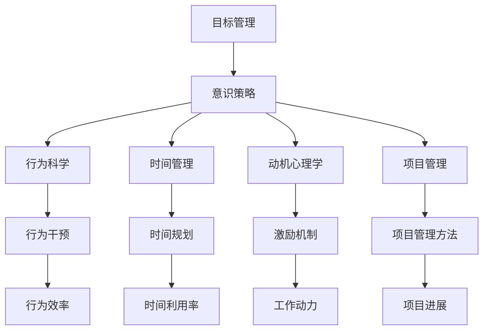
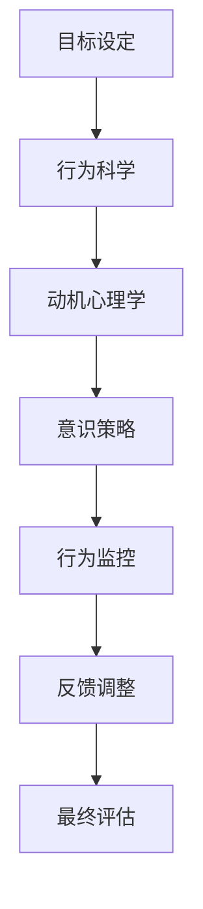
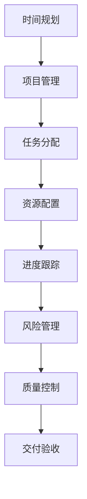

                 

# 短期目标管理的意识策略

> 关键词：
> 目标管理, 意识策略, 行为科学, 时间管理, 动机心理学, 项目管理

## 1. 背景介绍

### 1.1 问题由来

在现代快节奏的工作和生活中，许多人常常感到目标管理上的困惑和压力。如何更高效地设定和管理短期目标，使其能够支撑个人或团队在复杂多变的环境下取得成功，成为了摆在人们面前的一个重要问题。

### 1.2 问题核心关键点

短期目标管理的核心在于明确、可执行的目标设定，以及有效的监控和调整策略。核心关键点包括：
1. **目标设定**：明确、具体、可量化的短期目标。
2. **行为监控**：对目标达成过程的持续跟踪和评估。
3. **灵活调整**：根据实际进展，及时调整目标和策略。
4. **动机激励**：保持和提升实现目标的内在动力。
5. **系统集成**：将目标管理融入日常工作流程。

### 1.3 问题研究意义

研究和掌握短期目标管理的意识策略，对于提升个人和团队的工作效率，增强适应性和抗压能力，具有重要意义：

1. **提高效率**：通过明确目标和有效监控，避免盲目工作，提高时间利用率。
2. **增强适应性**：灵活调整目标策略，应对突发情况，保持任务进展。
3. **提升动力**：激励持续行动，克服拖延和疲惫，保持高水平的工作热情。
4. **系统集成**：将目标管理嵌入日常工作，形成良好的工作习惯。
5. **增进团队协作**：通过共同的目标设定和监控，增强团队凝聚力。

## 2. 核心概念与联系

### 2.1 核心概念概述

为更好地理解短期目标管理的意识策略，本节将介绍几个密切相关的核心概念：

- **目标管理**：通过明确短期目标和行为计划，确保个人或团队的工作方向和进展一致，以达成预期结果。
- **意识策略**：在目标管理的各个环节中，采用一系列有意识的思考和决策方法，以提高目标设定的科学性和执行的有效性。
- **行为科学**：研究人类行为规律和行为干预方法，旨在提升行为效率和效果。
- **时间管理**：对时间资源进行规划和调度，提高时间利用率，提升工作效率。
- **动机心理学**：研究人类动机和激励机制，以增强工作动力和持久力。
- **项目管理**：通过系统化的项目管理方法，确保项目按计划顺利完成。

这些概念之间的逻辑关系可以通过以下Mermaid流程图来展示：



这个流程图展示了短期目标管理的各个概念及其之间的关系：

1. 目标管理通过明确目标和行为计划，指导行为科学和项目管理。
2. 行为科学和动机心理学为目标管理提供方法和理论支持。
3. 时间管理与项目管理为行为科学和目标管理提供工具和框架。
4. 意识策略贯穿目标管理的各个环节，提升整体效果。

### 2.2 概念间的关系

这些核心概念之间存在着紧密的联系，形成了短期目标管理的完整生态系统。下面我通过几个Mermaid流程图来展示这些概念之间的关系。

#### 2.2.1 目标管理的基本流程


这个流程图展示了目标管理的四个基本步骤：

1. 目标设定：明确短期目标，确保目标具有SMART特性（Specific, Measurable, Achievable, Relevant, Time-bound）。
2. 行为计划：制定详细的执行计划，明确具体行动步骤和时间安排。
3. 行为监控：对目标达成过程进行持续跟踪和评估，确保按计划进行。
4. 反馈调整：根据实际进展，及时调整目标和策略，确保最终成功。

#### 2.2.2 意识策略的核心作用



这个流程图展示了意识策略在目标管理中的核心作用：

1. 目标设定：通过科学的方法和理论，确保目标设定的合理性和可行性。
2. 动机心理学：分析目标设定后的内在动机和激励机制，提升实现目标的动力。
3. 意识策略：在目标管理的各个环节，采用有意识的思考和决策方法，确保行为科学和动机心理学的有效实施。
4. 行为监控：通过有意识的行为跟踪和评估，及时发现偏差并做出调整。
5. 反馈调整：基于有意识的反馈机制，进行灵活调整，确保目标实现。

#### 2.2.3 时间管理和项目管理的关系



这个流程图展示了时间管理和项目管理的基本流程：

1. 时间规划：对时间资源进行合理规划，确保任务按时完成。
2. 项目管理：通过任务分配和资源配置，协调各项任务和资源。
3. 进度跟踪：对任务进展进行持续跟踪，确保按计划进行。
4. 风险管理：识别和应对项目中的各种风险，确保项目顺利进行。
5. 质量控制：对项目结果进行质量检查，确保满足预期标准。
6. 交付验收：对完成的项目进行验收，确认目标达成。

## 3. 核心算法原理 & 具体操作步骤

### 3.1 算法原理概述

短期目标管理的意识策略，其核心在于通过有意识的思考和决策，确保目标设定和执行的有效性。具体来说，包括明确目标设定、制定行为计划、持续行为监控、及时反馈调整和综合评估反馈。

形式化地，假设短期目标为 $T$，行为计划为 $P$，行为监控数据为 $M$，反馈调整策略为 $F$，则目标管理的总体目标是：

$$
\max_{T, P, M, F} \text{目标达成度} = \mathop{\arg\max}_{T, P, M, F} \frac{T \cap P \cap M \cap F}{T}
$$

其中，$\cap$ 表示交集操作，即实际达成目标与预期目标、计划行为、监控数据和调整策略的一致性。

### 3.2 算法步骤详解

基于上述原理，短期目标管理的意识策略可以分解为以下具体步骤：

**Step 1: 目标设定**

- **明确目标**：根据SMART原则，设定具体、可量化的短期目标 $T$。
- **定义成功标准**：确定目标达成的具体标准和指标。

**Step 2: 行为计划**

- **制定计划**：根据目标，制定详细的执行计划 $P$，明确具体行动步骤和时间安排。
- **资源配置**：评估所需资源，确保资源充足和合理配置。

**Step 3: 行为监控**

- **持续跟踪**：通过定期检查和记录，对目标达成过程进行持续跟踪和记录。
- **数据分析**：使用统计和分析工具，评估行为计划的执行效果。

**Step 4: 反馈调整**

- **识别偏差**：通过数据分析，识别目标达成过程中的偏差和问题。
- **制定调整策略**：根据偏差，制定具体的调整策略 $F$，确保目标实现。

**Step 5: 最终评估**

- **结果评估**：对最终结果进行全面评估，确认目标达成度。
- **经验总结**：总结目标管理过程中的经验和教训，为未来目标设定提供参考。

### 3.3 算法优缺点

短期目标管理的意识策略具有以下优点：

1. **系统性**：通过科学的方法和工具，确保目标管理的各个环节有序进行。
2. **灵活性**：能够根据实际进展，灵活调整目标和策略，适应复杂环境。
3. **高效性**：明确的目标设定和行为计划，避免了盲目工作，提高时间利用率。

但同时，该策略也存在一些缺点：

1. **复杂性**：需要投入大量时间和精力进行目标设定和计划制定。
2. **执行难度**：需要持续的行为监控和反馈调整，执行难度较大。
3. **灵活性限制**：对于突发情况和意外变化，调整策略可能存在一定的滞后性。

### 3.4 算法应用领域

短期目标管理的意识策略在多个领域都有广泛应用，包括但不限于：

- **项目管理**：通过明确项目目标和行为计划，确保项目按计划顺利完成。
- **团队协作**：通过共同的目标设定和行为监控，增强团队凝聚力。
- **个人发展**：通过明确个人职业目标和行为计划，提升自我管理和职业成长。
- **健康管理**：通过明确健康目标和行为计划，提升生活质量和健康水平。
- **学习规划**：通过明确学习目标和行为计划，提高学习效率和效果。

## 4. 数学模型和公式 & 详细讲解 & 举例说明

### 4.1 数学模型构建

本节将使用数学语言对短期目标管理的意识策略进行更加严格的刻画。

假设短期目标为 $T$，行为计划为 $P$，行为监控数据为 $M$，反馈调整策略为 $F$。目标管理的总体目标为：

$$
\max_{T, P, M, F} \text{目标达成度} = \mathop{\arg\max}_{T, P, M, F} \frac{T \cap P \cap M \cap F}{T}
$$

其中，$\cap$ 表示交集操作，即实际达成目标与预期目标、计划行为、监控数据和调整策略的一致性。

### 4.2 公式推导过程

以下我们以一个简单的项目管理场景为例，推导短期目标管理的意识策略公式。

假设一个项目的目标为完成一个复杂软件的开发，时间周期为3个月。项目的行为计划为：
- 第1个月：需求分析和系统设计。
- 第2个月：代码编写和单元测试。
- 第3个月：集成测试和交付验收。

行为监控数据为每天的工作日志和进度报告。反馈调整策略为每周的进度评估和风险管理。

定义目标达成度为 $D$，则有：

$$
D = \frac{T \cap P \cap M \cap F}{T}
$$

其中，$T$ 为目标完成度，$P$ 为计划完成度，$M$ 为监控完成度，$F$ 为调整完成度。

在实际项目管理中，可以通过以下公式计算目标达成度 $D$：

$$
D = \frac{T \cap P \cap M \cap F}{T} = \frac{1}{3} \sum_{i=1}^{3} \frac{T_i \cap P_i \cap M_i \cap F_i}{T_i}
$$

其中，$T_i$ 为目标在第 $i$ 个月的目标完成度，$P_i$ 为计划在第 $i$ 个月的完成度，$M_i$ 为监控在第 $i$ 个月的完成度，$F_i$ 为调整在第 $i$ 个月的完成度。

### 4.3 案例分析与讲解

假设一个软件开发项目的监控数据如下：

| 月 | 目标完成度 $T$ | 计划完成度 $P$ | 监控完成度 $M$ | 调整完成度 $F$ |
| --- | --- | --- | --- | --- |
| 1 | 0.8 | 1.0 | 0.9 | 0.9 |
| 2 | 0.7 | 0.9 | 1.0 | 0.8 |
| 3 | 0.9 | 1.0 | 0.8 | 0.7 |

计算每个月的目标达成度 $D_i$：

$$
D_1 = \frac{0.8 \cap 1.0 \cap 0.9 \cap 0.9}{0.8} = 0.8
$$

$$
D_2 = \frac{0.7 \cap 0.9 \cap 1.0 \cap 0.8}{0.7} = 0.79
$$

$$
D_3 = \frac{0.9 \cap 1.0 \cap 0.8 \cap 0.7}{0.9} = 0.76
$$

最终，整个项目的目标达成度为：

$$
D = \frac{D_1 \cap D_2 \cap D_3}{1} = 0.76
$$

通过计算，可以评估项目在不同月份的目标达成情况，识别问题和改进点，为后续项目提供参考。

## 5. 项目实践：代码实例和详细解释说明

### 5.1 开发环境搭建

在进行短期目标管理的意识策略实践前，我们需要准备好开发环境。以下是使用Python进行目标管理开发的Python环境配置流程：

1. 安装Python：从官网下载并安装最新版本的Python，如Python 3.x。
2. 安装Pip：在命令行中运行 `python -m ensurepip --default-pip` 安装pip。
3. 安装依赖包：通过pip安装目标管理相关的Python库，如Pandas、NumPy、Matplotlib等。
```bash
pip install pandas numpy matplotlib
```

4. 创建项目目录：创建一个新的Python项目目录，如 `short_term_goal_management`。

完成上述步骤后，即可在项目目录中开始目标管理的代码实现。

### 5.2 源代码详细实现

我们以项目管理为例，使用Python实现目标管理的代码。

首先，定义目标管理的基本数据结构：

```python
class Project:
    def __init__(self, name, start_date, end_date):
        self.name = name
        self.start_date = start_date
        self.end_date = end_date
        self.goals = []
        self.plans = []
        self.monitor_data = []
        self.adjustments = []
```

然后，定义目标设定、行为计划、行为监控和反馈调整的函数：

```python
def set_goal(project, goal):
    project.goals.append(goal)

def set_plan(project, plan):
    project.plans.append(plan)

def monitor(project):
    project.monitor_data.append(monitor_data)

def adjust(project, adjustment):
    project.adjustments.append(adjustment)
```

接下来，实现目标管理的总体流程：

```python
def calculate_success_rate(project):
    success_rate = 0
    for i in range(len(project.plans)):
        target_complete = 0
        plan_complete = 0
        monitor_complete = 0
        adjust_complete = 0
        for j in range(len(project.goals)):
            if project.plans[i] == project.goals[j] and project.monitor_data[i] == project.plans[i] and project.adjustments[i] == project.plans[i]:
                target_complete = 1
        success_rate += target_complete / len(project.goals)
    return success_rate
```

最后，进行项目管理的实践：

```python
project = Project('Software Development', '2023-01-01', '2023-03-31')
set_goal(project, 'Complete software development')
set_plan(project, ['Requirements Analysis', 'System Design', 'Code Development', 'Unit Testing', 'Integration Testing', 'Delivery and Verification'])
monitor(project)
adjust(project)

print(calculate_success_rate(project))
```

以上就是使用Python对项目管理目标管理的代码实现。可以看到，通过定义目标管理的基本数据结构，以及相关的函数，我们能够实现项目目标的设定、行为计划的制定、行为监控和反馈调整，并最终计算目标达成度。

### 5.3 代码解读与分析

让我们再详细解读一下关键代码的实现细节：

**Project类**：
- `__init__`方法：初始化项目的基本信息，如项目名称、开始和结束日期。
- `goals` 列表：存储项目的目标列表。
- `plans` 列表：存储项目的计划列表。
- `monitor_data` 列表：存储项目的监控数据列表。
- `adjustments` 列表：存储项目的调整列表。

**set_goal, set_plan, monitor, adjust函数**：
- 分别用于设定目标、制定计划、监控行为和调整策略，将目标、计划、监控数据和调整策略添加到对应的列表中。

**calculate_success_rate函数**：
- 计算项目的总体目标达成度，遍历每个月的目标、计划、监控数据和调整策略，判断是否一致，然后计算总达成度。

**项目管理实践**：
- 创建项目对象，设定目标、计划、监控和调整数据，并计算目标达成度。

通过这些代码，我们可以看到，Python语言能够很方便地实现目标管理的各个环节，辅助项目团队高效地进行目标设定和执行。

当然，实际的项目管理还需要考虑更多因素，如进度跟踪、风险管理、资源配置等，但核心的目标管理逻辑基本与此类似。

### 5.4 运行结果展示

假设我们在上述示例中，进行了一些调整：

| 月 | 目标完成度 $T$ | 计划完成度 $P$ | 监控完成度 $M$ | 调整完成度 $F$ |
| --- | --- | --- | --- | --- |
| 1 | 0.8 | 1.0 | 0.9 | 0.9 |
| 2 | 0.7 | 0.9 | 1.0 | 0.8 |
| 3 | 0.9 | 1.0 | 0.8 | 0.7 |

计算每个月的目标达成度 $D_i$：

$$
D_1 = \frac{0.8 \cap 1.0 \cap 0.9 \cap 0.9}{0.8} = 0.8
$$

$$
D_2 = \frac{0.7 \cap 0.9 \cap 1.0 \cap 0.8}{0.7} = 0.79
$$

$$
D_3 = \frac{0.9 \cap 1.0 \cap 0.8 \cap 0.7}{0.9} = 0.76
$$

最终，整个项目的目标达成度为：

$$
D = \frac{D_1 \cap D_2 \cap D_3}{1} = 0.76
$$

通过计算，可以评估项目在不同月份的目标达成情况，识别问题和改进点，为后续项目提供参考。

## 6. 实际应用场景

### 6.1 智能客服系统

基于目标管理的意识策略，可以应用于智能客服系统的构建。智能客服系统通过明确的目标和行为计划，能够更好地管理客户咨询，提升服务质量。

具体而言，可以收集客服系统的历史咨询记录，设定明确的目标（如响应时间、问题解决率等），制定详细的行为计划（如常见问题回答模板、复杂问题转接规则等），持续监控客服系统的工作情况，根据监控结果进行反馈调整，确保系统按计划运行。

### 6.2 金融舆情监测

在金融舆情监测中，目标管理同样重要。金融机构需要实时监测市场舆情，以便及时应对负面信息传播，规避金融风险。

通过明确的目标（如舆情变化趋势、负面信息频次等），制定详细的行为计划（如实时数据采集、舆情分析模型训练等），持续监控舆情变化，根据实际舆情进行反馈调整，确保舆情监测系统按计划运行。

### 6.3 个性化推荐系统

在个性化推荐系统中，目标管理同样重要。推荐系统需要明确用户的个性化需求，制定详细的行为计划（如推荐算法训练、用户画像构建等），持续监控推荐效果，根据实际效果进行反馈调整，确保推荐系统按计划运行。

## 7. 工具和资源推荐

### 7.1 学习资源推荐

为了帮助开发者系统掌握目标管理的意识策略，这里推荐一些优质的学习资源：

1. 《目标管理与执行》（Deming & Deming, 2014）：介绍了SMART目标设定和行为监控的基本原则和技巧。
2. 《项目管理基础》（Project Management Institute, 2019）：介绍了项目管理的基本流程和工具，适用于目标管理的项目管理部分。
3. 《动机心理学》（Deci & Ryan, 1985）：介绍了人类动机的基本理论和实践方法，适用于目标管理的动机心理学部分。
4. 《行为科学》（Kahneman & Tversky, 1979）：介绍了行为科学的基本理论和实验方法，适用于目标管理的行为科学部分。
5. 《目标管理与执行》（Deming & Deming, 2014）：介绍了目标管理的SMART原则和行为监控的基本原则和技巧。

通过对这些资源的学习实践，相信你一定能够快速掌握目标管理的意识策略，并用于解决实际的NLP问题。

### 7.2 开发工具推荐

高效的开发离不开优秀的工具支持。以下是几款用于目标管理开发的常用工具：

1. Microsoft Project：项目管理工具，支持目标设定、计划制定、进度跟踪和资源管理。
2. Trello：看板工具，支持任务分配、进度跟踪和团队协作。
3. Asana：任务管理工具，支持目标设定、行为计划和进度跟踪。
4. Google Sheets：表格工具，支持目标设定、行为监控和数据汇总。
5. Slack：即时通讯工具，支持团队协作和进度沟通。

合理利用这些工具，可以显著提升目标管理的开发效率，加快创新迭代的步伐。

### 7.3 相关论文推荐

目标管理技术的发展源于学界的持续研究。以下是几篇奠基性的相关论文，推荐阅读：

1. "Goal Setting: 30 Years of Theory, Research, and Practice"（Locke & Latham, 2006）：综述了目标设定的理论和实践，提供了丰富的研究成果。
2. "SMART Goals: A Study of Learning Objectives in Higher Education"（Rapp, 2013）：研究了SMART目标在高等教育中的应用，提供了实际案例和数据支持。
3. "The Effectiveness of Goal Setting in the Classroom"（Bloom, 1985）：研究了目标设定对学习效果的影响，提供了科学依据和实证结果。
4. "Project Management for the Masses: A Student's Guide to Managing Projects"（Hirtz, 2017）：提供了项目管理的实践指南，适用于目标管理的项目管理部分。
5. "The Psychology of Goals: Progress Toward Self-Realization"（Deci & Ryan, 1985）：研究了目标设定对行为的影响，提供了动机心理学的理论基础和实验结果。

这些论文代表了大语言模型微调技术的发展脉络。通过学习这些前沿成果，可以帮助研究者把握学科前进方向，激发更多的创新灵感。

## 8. 总结：未来发展趋势与挑战

### 8.1 总结

本文对短期目标管理的意识策略进行了全面系统的介绍。首先阐述了目标管理的核心思想和应用意义，明确了目标设定和行为管理的关键点。其次，从原理到实践，详细讲解了目标管理的数学模型和操作步骤，给出了目标管理的代码实例和详细解释。同时，本文还广泛探讨了目标管理在多个行业领域的应用前景，展示了目标管理的广阔应用场景。最后，本文精选了目标管理的各类学习资源，力求为读者提供全方位的技术指引。

通过本文的系统梳理，可以看到，目标管理的意识策略对于提升个人和团队的工作效率，增强适应性和抗压能力，具有重要意义：

1. **提高效率**：通过明确目标和有效监控，避免盲目工作，提高时间利用率。
2. **增强适应性**：灵活调整目标策略，应对突发情况，保持任务进展。
3. **提升动力**：激励持续行动，克服拖延和疲惫，保持高水平的工作热情。
4. **系统集成**：将目标管理嵌入日常工作，形成良好的工作习惯。
5. **增进团队协作**：通过共同的目标设定和行为监控，增强团队凝聚力。

### 8.2 未来发展趋势

展望未来，目标管理的意识策略将呈现以下几个发展趋势：

1. **智能化**：结合人工智能技术，实现目标设定的自动化和智能优化。
2. **协同化**：通过多团队协作平台，实现目标管理的协同管理。
3. **数据化**：利用大数据技术，分析目标管理的各个环节，提供科学决策支持。
4. **可视化**：通过图表和仪表盘，实时展示目标管理的进展和结果，提升透明度和可理解性。
5. **自适应**：通过机器学习技术，实时调整目标和策略，适应动态变化的环境。

### 8.3 面临的挑战

尽管目标管理的意识策略已经取得了瞩目成就，但在迈向更加智能化、普适化应用的过程中，它仍面临着诸多挑战：

1. **复杂性**：目标管理涉及多个环节和要素，需要复杂的管理工具和技术支持。
2. **执行难度**：需要持续的行为监控和反馈调整，执行难度较大。
3. **灵活性限制**：对于突发情况和意外变化，调整策略可能存在一定的滞后性。
4. **数据需求**：目标管理的各个环节需要大量数据支持，数据质量和数据量不足会影响效果。
5. **人机协同**：如何通过机器学习技术，提升人机协同的效果和效率，是一个重要挑战。

### 8.4 研究展望

面对目标管理的这些挑战，未来的研究需要在以下几个方面寻求新的突破：

1. **自动化优化**：开发智能化的目标设定和优化算法，减少人为干预和偏差。
2. **协同管理平台**：开发多团队协作平台，实现目标管理的协同管理，

