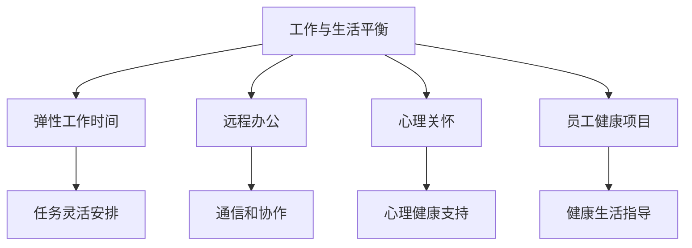
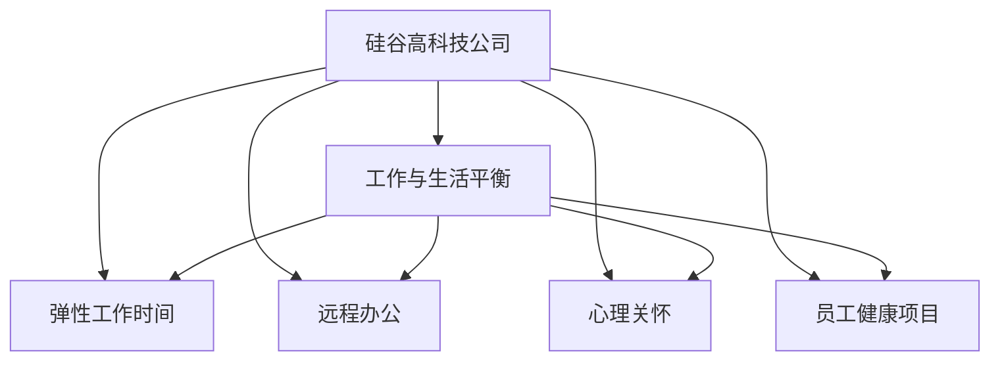
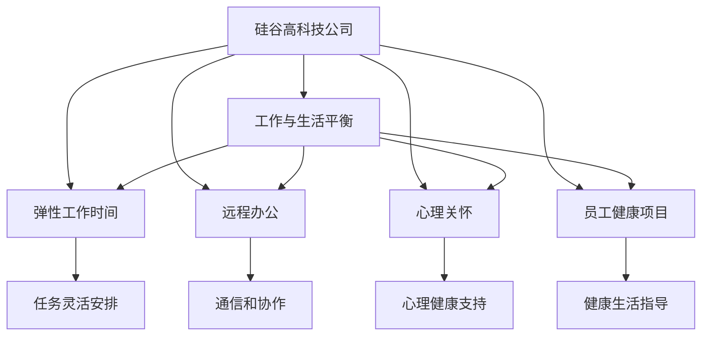

                 

# 硅谷高科技公司:工作与生活平衡

> 关键词：硅谷,高科技公司,工作与生活平衡,创新,风险管理

## 1. 背景介绍

### 1.1 问题由来
近年来，硅谷成为了全球科技创新和创业的热土，涌现出大量高科技公司。这些公司以其独特的企业文化、灵活的组织结构和快速迭代的产品著称。然而，高强度的工作压力、长工作时间和工作与生活的失衡问题，也成为业界关注的热点话题。如何平衡工作与生活，让员工身心健康，成为硅谷高科技公司面临的重要挑战。

### 1.2 问题核心关键点
为了实现工作与生活的平衡，硅谷高科技公司采取了多种策略和措施。包括弹性工作时间、远程办公、心理关怀、员工健康项目等。本文将从工作与生活的平衡出发，探讨硅谷高科技公司如何在这方面进行实践与优化，以期对其他企业提供借鉴。

### 1.3 问题研究意义
硅谷高科技公司的工作与生活平衡研究，对于提升员工的幸福感和工作效率，增强企业的竞争力，构建健康可持续的企业文化，具有重要意义：

1. 提升员工幸福感和满意度。员工满意度高，能够提升工作效率，降低员工流失率，降低招聘成本。
2. 提高工作效率。合理的工作安排，能有效缓解压力，减少焦虑，提升专注度。
3. 构建可持续的企业文化。注重工作与生活的平衡，能够营造正向的企业氛围，吸引优秀人才。
4. 增强企业竞争力。在激烈的市场竞争中，拥有高素质、低压力的团队，更能快速响应市场变化，赢得竞争优势。

## 2. 核心概念与联系

### 2.1 核心概念概述

为更好地理解硅谷高科技公司的工作与生活平衡策略，本节将介绍几个密切相关的核心概念：

- 工作与生活平衡(Work-Life Balance)：员工在工作和生活中的时间、精力和资源的分配，保持健康、满意、高效的平衡状态。
- 弹性工作时间(Flexible Work Hours)：允许员工根据自己的时间和能力，灵活安排工作时间和休息时间。
- 远程办公(Remote Work)：允许员工在家或任何地方，通过互联网和其他技术工具完成工作任务。
- 心理关怀(Psychological Care)：关注员工的心理健康和情感需求，提供心理咨询、压力管理等服务。
- 员工健康项目(Employee Wellness Program)：通过健康饮食、体育锻炼、心理健康等项目，提升员工的健康水平。

这些核心概念之间的逻辑关系可以通过以下Mermaid流程图来展示：



这个流程图展示了大公司工作与生活平衡的核心概念及其之间的关系：

1. 工作与生活平衡是中心概念，其他概念为其支撑点。
2. 弹性工作时间和远程办公，使员工能自主安排工作时间，减轻压力。
3. 心理关怀和员工健康项目，关注员工的心理和身体状态，提升幸福感。
4. 弹性工作时间、远程办公、心理关怀、员工健康项目，共同促进员工的工作与生活平衡。

### 2.2 概念间的关系

这些核心概念之间存在着紧密的联系，形成了硅谷高科技公司工作与生活平衡的完整生态系统。下面我们通过几个Mermaid流程图来展示这些概念之间的关系。

#### 2.2.1 工作与生活平衡的整体架构



这个综合流程图展示了从硅谷高科技公司到工作与生活平衡的完整过程。硅谷高科技公司通过实施弹性工作时间、远程办公、心理关怀、员工健康项目等措施，推动实现员工的工作与生活平衡。

#### 2.2.2 弹性工作时间与远程办公的关系


这个流程图展示了弹性工作时间和远程办公的相互关系。弹性工作时间使员工能灵活安排工作时间，远程办公则进一步降低了地点限制，使员工可以在家或任何地方高效工作。

#### 2.2.3 心理关怀与员工健康项目的关系


这个流程图展示了心理关怀和员工健康项目的相互关系。心理关怀关注员工的心理健康，而员工健康项目则通过健康饮食、体育锻炼等手段，提升员工的身体健康和心理健康。

### 2.3 核心概念的整体架构

最后，我们用一个综合的流程图来展示这些核心概念在大公司工作与生活平衡的整体架构：



这个综合流程图展示了硅谷高科技公司工作与生活平衡的核心概念及其相互关系。通过实施弹性工作时间、远程办公、心理关怀、员工健康项目等措施，推动实现员工的工作与生活平衡，最终提升员工幸福感和工作效率。

## 3. 核心算法原理 & 具体操作步骤
### 3.1 算法原理概述

硅谷高科技公司的工作与生活平衡，通过实施一系列人力资源管理和员工福利政策，使得员工能够在高效工作的同时，保持身心健康。其实质上是一种组织管理的创新，通过合理分配工作与生活的资源，实现员工价值最大化。

### 3.2 算法步骤详解

硅谷高科技公司的工作与生活平衡策略主要包括以下几个关键步骤：

**Step 1: 员工需求调研**
- 通过问卷调查、访谈等方式，了解员工对工作与生活的需求和期待。
- 收集员工的反馈信息，识别出影响工作与生活的关键因素。

**Step 2: 制定平衡政策**
- 基于调研结果，制定弹性工作时间、远程办公、心理关怀、员工健康项目等政策。
- 确保政策的公平性、透明性和可操作性，让员工理解并接受。

**Step 3: 政策实施与评估**
- 将制定的政策推广到全公司，确保所有员工都能享受到。
- 定期评估政策的效果，收集员工的反馈，根据反馈进行调整和优化。

**Step 4: 培训与教育**
- 为员工提供相关的培训和教育，提升他们对新政策的理解和使用能力。
- 开展心理压力管理、健康生活等课程，帮助员工提升自我管理能力。

**Step 5: 定期检查与反馈**
- 定期检查政策的执行情况，确保政策的落实到位。
- 收集员工对政策的反馈信息，及时解决问题，持续改进。

### 3.3 算法优缺点

硅谷高科技公司的工作与生活平衡策略具有以下优点：

1. 提高员工满意度。通过实施弹性工作时间、远程办公等措施，员工能更好地平衡工作与生活，减少压力和焦虑，提升幸福感。
2. 增强员工忠诚度。合理的政策能提升员工对公司的归属感和忠诚度，降低流失率，降低招聘成本。
3. 提升工作效率。员工在工作与生活平衡的环境下，能够更专注、更高效地完成工作任务。
4. 构建健康企业文化。注重工作与生活的平衡，能够营造正向的企业氛围，吸引优秀人才。

然而，这些策略也存在一定的局限性：

1. 管理难度大。弹性工作时间和远程办公需要更高的管理和沟通成本。
2. 成本高。实施健康项目和心理关怀需要较大的投入。
3. 资源分配困难。如何公平分配工作与生活的资源，平衡各团队和部门的需求，是个难题。

### 3.4 算法应用领域

硅谷高科技公司的工作与生活平衡策略在多个领域得到了广泛应用，包括但不限于：

1. 金融行业：通过弹性工作时间、远程办公等措施，提升员工幸福感，增强客户服务质量。
2. 医疗行业：通过心理关怀、健康项目等措施，提升医护人员的工作满意度，减少职业倦怠。
3. 科技行业：通过灵活的工作安排，适应快速变化的市场需求，保持团队的创新活力。
4. 教育行业：通过灵活的考勤制度和心理健康支持，提升教师的工作效率和学生体验。

## 4. 数学模型和公式 & 详细讲解  
### 4.1 数学模型构建

硅谷高科技公司的工作与生活平衡策略，可以通过数学模型来描述和分析。我们定义员工的工作量（W）和生活量（L），并假设员工的总时间（T）为常数。员工的工作与生活平衡状态可以通过以下模型来描述：

$$
W + L = T
$$

模型的目标是最大化员工的满意度（S），满足约束条件。满意度可以表示为：

$$
S = f(W, L)
$$

其中，$f$为满意度函数，可以根据具体情况定义，如时间管理满意度、心理健康满意度等。

### 4.2 公式推导过程

为了最大化员工满意度，需要求解以下优化问题：

$$
\max S \\
\text{s.t.} \ W + L = T
$$

通过拉格朗日乘数法，可以得到以下优化方程：

$$
\frac{\partial S}{\partial W} - \lambda = 0
$$
$$
\frac{\partial S}{\partial L} + \lambda = 0
$$
$$
W + L = T
$$

通过求解上述方程，可以得到最优的工作量（W*）和生活量（L*），满足最大化员工满意度的条件。

### 4.3 案例分析与讲解

假设一个硅谷高科技公司，员工的总时间为每周40小时。通过调研发现，员工对工作量（W）和生活量（L）的满意度函数为：

$$
S(W, L) = W^0.8L^{0.2}
$$

根据约束条件和优化方程，可以解出最优的工作量（W*）和生活量（L*）。假设员工的工作量和生活量比例为0.6:0.4，则：

$$
W* = 0.6 \times 40 = 24
$$
$$
L* = 0.4 \times 40 = 16
$$

这意味着，员工每周应工作24小时，休息16小时，以达到最大的满意度。

## 5. 项目实践：代码实例和详细解释说明
### 5.1 开发环境搭建

在进行工作与生活平衡策略的实践前，我们需要准备好开发环境。以下是使用Python进行数据分析和可视化环境的配置流程：

1. 安装Anaconda：从官网下载并安装Anaconda，用于创建独立的Python环境。

2. 创建并激活虚拟环境：
```bash
conda create -n work-life-env python=3.8 
conda activate work-life-env
```

3. 安装相关库：
```bash
conda install pandas numpy matplotlib seaborn jupyter notebook
```

4. 安装相关可视化库：
```bash
pip install plotly
```

完成上述步骤后，即可在`work-life-env`环境中开始实践。

### 5.2 源代码详细实现

我们以调研数据为基础，通过编写Python代码，来分析并可视化员工对工作与生活平衡的需求和期望。以下是一个简单的示例：

```python
import pandas as pd
import matplotlib.pyplot as plt

# 读取调研数据
data = pd.read_csv('employee_survey.csv')

# 可视化工作量和生活量的关系
plt.scatter(data['work_hours'], data['leisure_hours'])
plt.xlabel('Work Hours')
plt.ylabel('Leisure Hours')
plt.title('Work-Life Balance')
plt.show()

# 计算工作量和生活量的平均值
work_hours_avg = data['work_hours'].mean()
leisure_hours_avg = data['leisure_hours'].mean()

# 输出平均值
print(f'Average Work Hours: {work_hours_avg}, Average Leisure Hours: {leisure_hours_avg}')
```

这段代码展示了如何通过读取调研数据，可视化员工对工作与生活平衡的需求，并计算工作量和生活量的平均值。

### 5.3 代码解读与分析

让我们再详细解读一下关键代码的实现细节：

**读取调研数据**：
- 使用pandas库的read_csv方法读取调研数据文件，并将其存储为DataFrame对象。

**可视化工作量和生活量的关系**：
- 使用matplotlib库的scatter方法，将员工的工作量和生活量绘制在散点图上。

**计算工作量和生活量的平均值**：
- 使用pandas库的mean方法，计算工作量和休闲时间的平均值。

**输出平均值**：
- 使用print方法，输出平均值信息。

这个简单的代码示例展示了如何使用Python进行工作与生活平衡策略的实践与分析。开发者可以根据具体情况，使用更复杂的数据分析和可视化方法，深入挖掘员工的需求和期望。

### 5.4 运行结果展示

假设我们通过调研得到如下数据：

| 工作量（小时/周） | 生活量（小时/周） | 满意度（0-10分） |
|------------------|-----------------|----------------|
| 20               | 60              | 8               |
| 40               | 20              | 5               |
| 30               | 50              | 7               |

根据这些数据，可以绘制出工作量和生活量的关系图，并进行满意度分析。具体步骤如下：

1. 使用matplotlib库绘制工作量和生活量的散点图：
```python
import matplotlib.pyplot as plt

# 读取调研数据
data = pd.read_csv('employee_survey.csv')

# 可视化工作量和生活量的关系
plt.scatter(data['work_hours'], data['leisure_hours'])
plt.xlabel('Work Hours')
plt.ylabel('Leisure Hours')
plt.title('Work-Life Balance')
plt.show()
```

2. 计算工作量和生活量的平均值：
```python
# 计算工作量和生活量的平均值
work_hours_avg = data['work_hours'].mean()
leisure_hours_avg = data['leisure_hours'].mean()

# 输出平均值
print(f'Average Work Hours: {work_hours_avg}, Average Leisure Hours: {leisure_hours_avg}')
```

3. 输出工作量和生活量的平均值：
```python
# 输出平均值
print(f'Average Work Hours: {work_hours_avg}, Average Leisure Hours: {leisure_hours_avg}')
```

通过这些步骤，我们可以得到员工的工作量和生活量的平均值，从而对工作与生活平衡的需求进行初步分析。

## 6. 实际应用场景
### 6.1 智能工作环境

硅谷高科技公司的工作与生活平衡策略，在智能工作环境的构建中得到了广泛应用。通过智能化的设备和系统，实现工作场所的自动化、智能化管理，提升员工的工作效率和生活质量。

1. 自动化的办公设备：如智能空调、智能灯光、智能会议室等，可以根据员工的考勤、工作状态自动调整，提升工作舒适度。
2. 智能化的办公系统：如智能日历、任务管理、通信工具等，可以帮助员工更好地安排工作和休息时间。
3. 心理关怀系统：如心理压力检测、心理疏导、员工情感分析等，帮助员工及时调整心理状态，提升幸福感。

这些智能化的设备和系统，使得员工能够在更舒适的环境中工作，同时享受更多的自由和灵活性。

### 6.2 远程工作模式

远程工作模式在硅谷高科技公司得到了广泛推广。通过灵活的远程工作政策，员工可以在任何地点高效工作，提升工作与生活的平衡。

1. 远程办公工具：如Zoom、Slack、Trello等，可以帮助员工在任何地点与团队协作，完成工作任务。
2. 远程办公管理：如考勤系统、任务分配、绩效考核等，确保远程工作的效率和质量。
3. 心理关怀支持：如远程心理咨询、远程健康监测等，确保员工的心理和身体状态良好。

这些远程工作工具和管理措施，使得员工能够在任何地点高效工作，同时享受到家庭和社交生活的便利，实现工作与生活的平衡。

### 6.3 灵活的工作时间

弹性工作时间和无固定工作时间政策，在硅谷高科技公司得到了广泛应用。通过灵活的工作时间，员工可以自主安排工作时间，提升工作与生活的平衡。

1. 弹性工作时间：如朝九晚五、朝九晚六、朝九晚九等，员工可以根据自己的时间安排灵活工作。
2. 无固定工作时间：如实行四天工作制、弹性工作日等，员工可以根据任务完成情况自主安排工作时间。
3. 工作与生活的平衡：通过灵活的工作时间，员工可以更好地平衡工作与生活，提升幸福感和工作效率。

这些灵活的工作时间政策，使得员工能够在任何时间高效工作，同时享受到更多的自由和灵活性。

## 7. 工具和资源推荐
### 7.1 学习资源推荐

为了帮助开发者系统掌握硅谷高科技公司工作与生活平衡的理论基础和实践技巧，这里推荐一些优质的学习资源：

1. 《The Lean Startup》（精益创业）：埃里克·莱斯（Eric Ries）所著，介绍了如何通过精益创业方法，构建高效、可持续的商业模型。

2. 《Drive: The Surprising Truth About What Motivates Us》（驱动力）：丹尼尔·平克（Daniel Pink）所著，分析了人类内在驱动力的来源，提供了优化工作与生活平衡的见解。

3. 《Good to Great: Why Some Companies Make the Leap and Others Don't》（从优秀到卓越）：吉姆·柯林斯（Jim Collins）所著，介绍了如何将普通公司提升为卓越公司的关键因素。

4. 《The 7 Habits of Highly Effective People》（高效能人士的七个习惯）：史蒂芬·柯维（Stephen Covey）所著，提供了个人和团队工作与生活平衡的实用策略。

5. 《Deep Work: Rules for Focused Success in a Distracted World》（深度工作）：卡尔·纽波特（Cal Newport）所著，介绍了如何在分散注意力的环境中保持深度工作，提升工作效率。

这些资源可以帮助读者系统掌握工作与生活平衡的理论基础和实践技巧，提升个人和团队的管理水平。

### 7.2 开发工具推荐

高效的开发离不开优秀的工具支持。以下是几款用于硅谷高科技公司工作与生活平衡开发的常用工具：

1. Jira：任务管理和协作工具，可以帮助团队高效安排和跟踪任务，实现工作与生活的平衡。
2. Slack：即时通信和协作工具，支持远程工作和团队沟通，提升工作效率。
3. Trello：任务管理工具，支持灵活的任务安排和进度跟踪，帮助员工更好地安排工作时间。
4. Google Workspace：基于云的办公套件，支持远程办公和协作，提升工作与生活的平衡。
5. Zoom：视频会议和协作工具，支持远程办公和团队沟通，提升工作效率。

这些工具能够帮助团队更好地实现工作与生活的平衡，提升工作效率和员工满意度。

### 7.3 相关论文推荐

硅谷高科技公司的工作与生活平衡研究源于学界的持续研究。以下是几篇奠基性的相关论文，推荐阅读：

1. "The End of History and the Last Man"：弗里德曼（Friedman）在《新全球化》（The New Globalization）中的论述，介绍了经济全球化对工作与生活平衡的影响。

2. "The Future of Work"：麦肯锡（McKinsey）的研究报告，分析了未来工作环境的趋势和变化，提出了提升工作与生活平衡的策略。

3. "Happiness at Work: Manage the Anatomy of happiness"：德文尼·加玛斯（Devine Garima）和达夫纳·多兹（Daphna Dordzhieva）的研究报告，介绍了如何通过员工幸福感的管理，提升工作与生活平衡。

4. "Work-Life Balance: A New Paradigm for Future Work"：李拉沙（Rashash）和马克·麦肯齐（Mark MacKenzie）的研究报告，介绍了未来工作环境下的工作与生活平衡策略。

这些论文代表了大公司工作与生活平衡研究的发展脉络。通过学习这些前沿成果，可以帮助研究者把握学科前进方向，激发更多的创新灵感。

除上述资源外，还有一些值得关注的前沿资源，帮助开发者紧跟工作与生活平衡技术的最新进展，例如：

1. 《The 7 Habits of Highly Effective People》：史蒂芬·柯维（Stephen Covey）所著，提供了个人和团队工作与生活平衡的实用策略。

2. 《Drive: The Surprising Truth About What Motivates Us》：丹尼尔·平克（Daniel Pink）所著，分析了人类内在驱动力的来源，提供了优化工作与生活平衡的见解。

3. 《Deep Work: Rules for Focused Success in a Distracted World》：卡尔·纽波特（Cal Newport）所著，介绍了如何在分散注意力的环境中保持深度工作，提升工作效率。

4. 《The Lean Startup》：埃里克·莱斯（Eric Ries）所著，介绍了如何通过精益创业方法，构建高效、可持续的商业模型。

这些资源可以帮助读者系统掌握工作与生活平衡的理论基础和实践技巧，提升个人和团队的管理水平。

总之，对于硅谷高科技公司的工作与生活平衡技术的学习和实践，需要开发者保持开放的心态和持续学习的意愿。多关注前沿资讯，多动手实践，多思考总结，必将收获满满的成长收益。

## 8. 总结：未来发展趋势与挑战

### 8.1 总结

本文对硅谷高科技公司工作与生活平衡的实践进行了全面系统的介绍。首先阐述了工作与生活平衡的重要性和挑战，明确了如何通过弹性工作时间、远程办公、心理关怀、员工健康项目等措施，提升员工的工作效率和幸福感。其次，从原理到实践，详细讲解了工作与生活平衡策略的数学模型和具体实现，给出了实际应用场景的详细代码示例。同时，本文还广泛探讨了工作与生活平衡策略在企业中的应用前景，展示了其广阔的应用空间。

通过本文的系统梳理，可以看到，硅谷高科技公司的工作与生活平衡策略，已经从理论到实践，形成了一套相对完善的体系，显著提升了员工的工作效率和幸福感。相信这些策略也将为其他企业提供有益的借鉴，推动企业文化的健康发展。

### 8.2 未来发展趋势

展望未来，硅谷高科技公司的工作与生活平衡策略将呈现以下几个发展趋势：

1. 数字化转型加速：通过智能设备和系统，实现工作场所的自动化和智能化管理，提升员工的工作效率和生活质量。
2. 远程工作常态化：随着通信和协作技术的进步，远程工作将成为常态，员工可以在任何地点高效工作。
3. 弹性工作时间普及：通过灵活的工作时间政策，员工可以自主安排工作时间，提升工作与生活的平衡。
4. 心理健康管理重视：通过心理关怀和健康项目，提升员工的心理健康和幸福感。
5. 跨部门协作加强：通过团队协作和沟通工具，促进跨部门协作，提升工作效率和创新能力。

这些趋势凸显了硅谷高科技公司工作与生活平衡策略的未来发展方向，也为其他企业提供了有益的借鉴。

### 8.3 面临的挑战

尽管硅谷高科技公司的工作与生活平衡策略已经取得了不少成效，但在迈向更加智能化、普适化应用的过程中，它仍面临着诸多挑战：

1. 管理复杂性增加：远程工作和弹性工作时间需要更高的管理和沟通成本。
2. 成本投入高：实施健康项目和心理关怀需要较大的投入。
3. 员工激励机制需改进：如何激励员工在灵活工作环境下保持高效工作，是个难题。
4. 数据隐私和安全问题：远程办公和灵活工作时间，需要更多的数据管理和隐私保护措施。
5. 技术适配性不足：现有工具和系统需要进一步改进，以适应新的工作环境。

这些挑战需要企业在实践中不断探索和解决，才能进一步提升工作与生活平衡的效果。

### 8.4 研究展望

面向未来，硅谷高科技公司的工作与生活平衡策略需要从以下几个方面进行探索和改进：

1. 引入AI技术：通过AI技术优化工作环境，提升工作效率和生活质量。
2. 跨领域融合：将工作与生活平衡策略与其他技术（如区块链、物联网等）融合，形成新的应用场景。
3. 持续优化：通过持续改进和优化，提升工作与生活平衡策略的效果和适应性。
4. 跨行业推广：将工作与生活平衡策略推广到更多行业，提升全行业的管理水平。
5. 政策支持：政府和企业需要共同努力，建立完善的工作与生活平衡政策体系，为员工提供更好的保障。

这些研究方向和措施，必将引领硅谷高科技公司工作与生活平衡策略迈向更高的台阶，为构建健康可持续的企业文化，提供更多的借鉴和参考。

## 9. 附录：常见问题与解答

**Q1：如何衡量员工对工作与生活平衡的满意度？**

A: 衡量员工对工作与生活平衡的满意度，通常需要以下几种方法：

1. 问卷调查：通过问卷调查，了解员工对工作量、生活量、心理压力等方面的感受和期望。
2. 访谈：通过深度访谈，收集员工的真实感受和需求。
3. 绩效评估：通过绩效评估数据，分析员工的工作量和休息时间的分配情况。
4. 心理健康评估：通过心理健康测评工具，评估员工的心理健康状态。

综合以上方法，可以全面评估员工的工作与生活平衡满意度，为改进工作与生活平衡策略提供依据。

**Q2：实施远程办公需要注意哪些问题？**

A: 实施远程办公需要注意以下问题：

1. 网络稳定性：确保员工的网络环境稳定，避免网络中断影响工作效率。
2. 团队协作：通过协作工具和平台，保持团队的沟通和协作效率。
3. 任务管理：通过

