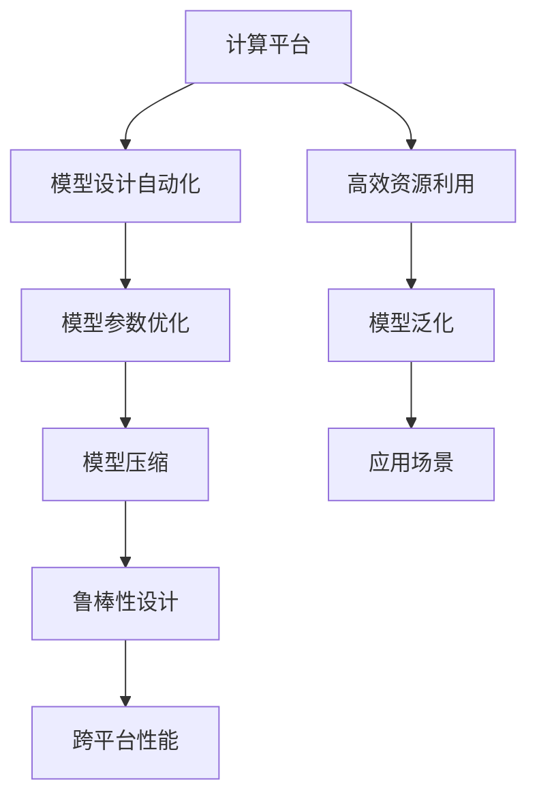
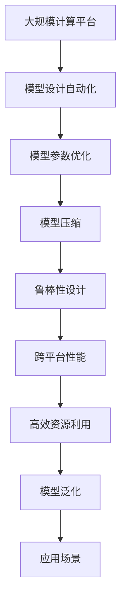

                 

# 硬件感知NAS：适应不同计算平台的模型设计

> 关键词：
```markdown
# 1. 背景介绍

## 1.1 问题由来
随着AI技术的普及，越来越多的深度学习模型被部署在多样化的硬件平台（如CPU、GPU、TPU等）上。然而，这些模型往往只针对某一特定平台进行优化，无法在其它平台得到最优性能，尤其是在计算资源受限的移动设备或边缘计算环境中。针对这一问题，硬件感知NAS（Hardware-Aware Neural Architecture Search, HANS）方法应运而生，它通过自动设计适应不同硬件平台的模型架构，实现跨平台的模型性能提升。

## 1.2 问题核心关键点
硬件感知NAS方法的核心在于：
- **平台感知模型设计**：根据不同硬件平台的特性，自动设计适应各平台的最佳模型架构。
- **跨平台模型优化**：在同一模型架构下，对不同硬件平台进行针对化参数优化，实现模型性能的跨平台提升。
- **高效模型压缩**：针对特定硬件平台进行模型压缩，优化模型大小和计算效率。
- **鲁棒性设计**：设计具有一定鲁棒性的模型，使其在不同硬件平台间表现出较好的一致性。

## 1.3 问题研究意义
硬件感知NAS方法具有以下重要意义：
- **通用性增强**：通过模型自动设计，模型可在多样化的硬件平台间实现性能的泛化。
- **资源优化**：根据目标平台特性进行模型优化，实现高效资源利用。
- **部署灵活**：优化后的模型可以适应更多应用场景，提升模型的应用范围。
- **性能提升**：跨平台性能提升，确保模型在各类设备上都能发挥最佳表现。
- **成本降低**：自动化模型设计和优化流程，减少人力成本和开发周期。

# 2. 核心概念与联系

## 2.1 核心概念概述

为更好地理解硬件感知NAS方法，本节将介绍几个关键概念：

- **计算平台**：如CPU、GPU、TPU等，硬件平台具有不同的架构特性，影响模型性能。
- **模型设计自动化**：自动设计模型架构的过程，使用NAS（Neural Architecture Search）方法进行优化。
- **模型参数优化**：针对特定硬件平台，优化模型参数以提升性能。
- **模型压缩**：通过剪枝、量化等技术，减小模型大小和计算开销。
- **鲁棒性设计**：在模型中引入鲁棒性设计，确保模型在不同平台间的一致性。

这些概念之间的逻辑关系可以通过以下Mermaid流程图来展示：



这个流程图展示了从硬件平台特性到跨平台性能提升的整体架构：

1. 计算平台特性影响模型设计自动化。
2. 自动设计的模型经过参数优化和压缩，提升跨平台性能。
3. 鲁棒性设计确保模型在不同平台间表现一致。
4. 高效资源利用和模型泛化，使模型在更多应用场景中适用。

### 2.2 概念间的关系

这些核心概念之间存在紧密的联系，形成了硬件感知NAS方法的整体框架。下面我们通过几个Mermaid流程图来展示这些概念之间的关系。

#### 2.2.1 平台特性与模型设计


#### 2.2.2 参数优化与跨平台性能


#### 2.2.3 模型压缩与计算效率


#### 2.2.4 鲁棒性设计与泛化能力


### 2.3 核心概念的整体架构

最后，我们用一个综合的流程图来展示这些核心概念在大语言模型微调过程中的整体架构：



这个综合流程图展示了从计算平台特性到跨平台性能提升的完整过程。计算平台特性影响模型设计自动化，自动设计的模型经过参数优化和压缩，提升跨平台性能。鲁棒性设计确保模型在不同平台间表现一致，高效资源利用和模型泛化，使模型在更多应用场景中适用。

# 3. 核心算法原理 & 具体操作步骤

## 3.1 算法原理概述

硬件感知NAS方法结合了模型设计自动化和硬件感知优化技术，其核心思想是通过自动化搜索算法，设计出适应不同计算平台的模型架构，同时针对特定平台进行参数优化和模型压缩，以提升模型在不同硬件上的性能和效率。

形式化地，假设有一个通用的模型框架 $M_\theta$，其中 $\theta$ 为模型参数，$f$ 为在特定计算平台上的计算函数。硬件感知NAS方法的目标是在不同计算平台上，找到最优的模型参数 $\theta^*$，使得模型性能达到最优：

$$
\theta^* = \mathop{\arg\min}_{\theta} \sum_{i \in P} \mathcal{L}_i(M_\theta)
$$

其中 $P$ 为计算平台集合，$\mathcal{L}_i$ 为在平台 $i$ 上的损失函数。

## 3.2 算法步骤详解

硬件感知NAS方法一般包括以下几个关键步骤：

**Step 1: 选择合适的计算平台**
- 定义目标平台的计算特性，如CPU、GPU、TPU等。
- 收集各平台硬件特性，如CPU架构、GPU内存带宽、TPU芯片结构等。

**Step 2: 设计通用模型架构**
- 基于通用模型框架，如ResNet、Inception等，设计适应各平台的模型架构。
- 模型架构包括网络层、激活函数、卷积核大小、池化层等。

**Step 3: 自动化搜索算法**
- 选择合适的搜索算法，如贝叶斯优化、遗传算法、强化学习等，搜索适应各平台的模型架构。
- 训练模型并评估性能，根据平台特性进行模型优化。

**Step 4: 参数优化**
- 针对不同平台，优化模型参数以提升性能。如使用不同激活函数、不同学习率等。
- 优化算法可以选择梯度下降、Adam、Adagrad等。

**Step 5: 模型压缩**
- 通过剪枝、量化等技术减小模型大小和计算开销。
- 压缩方法包括网络剪枝、权重量化、参数共享等。

**Step 6: 鲁棒性设计**
- 引入鲁棒性设计，确保模型在不同平台间的一致性。
- 鲁棒性设计方法包括模型正则化、对抗训练、鲁棒性训练等。

**Step 7: 验证和部署**
- 在验证集上评估模型性能，并进行必要的调整。
- 将优化后的模型部署到目标平台上，进行实际应用。

以上是硬件感知NAS方法的一般流程。在实际应用中，还需要根据具体平台特性和任务需求，对各个环节进行优化设计，以获得更好的效果。

## 3.3 算法优缺点

硬件感知NAS方法具有以下优点：
- **通用性强**：通过模型设计自动化，模型可在多样化的硬件平台间实现性能的泛化。
- **资源优化**：根据目标平台特性进行模型优化，实现高效资源利用。
- **部署灵活**：优化后的模型可以适应更多应用场景，提升模型的应用范围。
- **性能提升**：跨平台性能提升，确保模型在各类设备上都能发挥最佳表现。
- **成本降低**：自动化模型设计和优化流程，减少人力成本和开发周期。

同时，该方法也存在一定的局限性：
- **搜索空间大**：模型架构设计空间大，搜索算法需要更多计算资源和时间。
- **复杂度较高**：算法实现复杂，需要处理多平台特性。
- **模型泛化不足**：对于特定平台的微调，模型泛化能力可能有限。
- **过拟合风险**：搜索过程中可能出现过拟合问题。
- **性能提升有限**：在部分平台上，模型性能提升可能不明显。

尽管存在这些局限性，但硬件感知NAS方法在提升模型性能和适配不同硬件平台方面，仍具有巨大的潜力。

## 3.4 算法应用领域

硬件感知NAS方法广泛应用于各种深度学习模型优化场景，例如：

- **移动设备优化**：通过设计适应移动设备的模型架构，提升应用性能和能效。
- **边缘计算优化**：在资源受限的嵌入式设备上，通过优化模型参数和压缩技术，实现高效计算。
- **云计算优化**：在多样化的云平台上，通过自动化搜索和参数优化，实现模型性能的提升。
- **嵌入式系统优化**：在小型嵌入式设备上，通过模型压缩和鲁棒性设计，实现高性能和低功耗。
- **数据中心优化**：在数据中心环境中，通过跨平台性能优化，提升资源利用效率和计算性能。

## 4. 数学模型和公式 & 详细讲解 & 举例说明

### 4.1 数学模型构建

在硬件感知NAS方法中，我们通过自动化搜索算法设计模型架构，并针对不同平台进行参数优化。以典型的卷积神经网络（CNN）为例，其数学模型可以表示为：

$$
M_{\theta}(x) = W_1 g_1(X) + W_2 g_2(X) + W_3 g_3(X) + \cdots + W_L g_L(X)
$$

其中 $W_i$ 为卷积核，$g_i$ 为激活函数，$X$ 为输入，$L$ 为层数。

### 4.2 公式推导过程

假设我们有三层卷积网络，其数学模型为：

$$
M_{\theta}(x) = W_1 g_1(X) + W_2 g_2(X) + W_3 g_3(X)
$$

我们希望设计出一个适应特定计算平台的模型架构，并进行参数优化。设平台 $i$ 的计算特性为 $p_i$，则目标为：

$$
\theta^* = \mathop{\arg\min}_{\theta} \sum_{i \in P} \mathcal{L}_i(M_\theta)
$$

其中 $\mathcal{L}_i$ 为在平台 $i$ 上的损失函数。假设我们有三个平台 $P = \{CPU, GPU, TPU\}$，则：

$$
\theta^* = \mathop{\arg\min}_{\theta} \left[ \mathcal{L}_{CPU}(M_\theta) + \mathcal{L}_{GPU}(M_\theta) + \mathcal{L}_{TPU}(M_\theta) \right]
$$

### 4.3 案例分析与讲解

以优化卷积神经网络为例，我们将在不同的计算平台上进行模型架构设计和参数优化。

**案例一：CPU平台优化**

假设我们的卷积神经网络在CPU上的计算资源受限，我们希望通过优化模型架构和参数来提升性能。我们采用遗传算法进行搜索，首先生成多个候选模型架构，然后通过交叉和变异操作，筛选出适应性较好的架构。最后，针对每个架构，我们进行参数优化，以提升模型性能。

**案例二：GPU平台优化**

假设我们的卷积神经网络在GPU上的计算能力较强，我们希望通过优化模型参数来提升性能。我们使用深度学习框架，如TensorFlow或PyTorch，对模型进行梯度下降优化，并根据GPU的内存带宽特性，调整卷积核大小和激活函数。

**案例三：TPU平台优化**

假设我们的卷积神经网络在TPU上的计算效率较低，我们希望通过剪枝和量化技术来减小模型大小和计算开销。我们使用模型压缩工具，如TensorFlow Lite或ONNX Runtime，对模型进行剪枝和量化，同时引入鲁棒性设计，确保模型在不同平台间的一致性。

## 5. 项目实践：代码实例和详细解释说明

### 5.1 开发环境搭建

在进行硬件感知NAS实践前，我们需要准备好开发环境。以下是使用Python进行PyTorch开发的环境配置流程：

1. 安装Anaconda：从官网下载并安装Anaconda，用于创建独立的Python环境。

2. 创建并激活虚拟环境：
```bash
conda create -n pytorch-env python=3.8 
conda activate pytorch-env
```

3. 安装PyTorch：根据CUDA版本，从官网获取对应的安装命令。例如：
```bash
conda install pytorch torchvision torchaudio cudatoolkit=11.1 -c pytorch -c conda-forge
```

4. 安装TensorFlow：
```bash
pip install tensorflow
```

5. 安装TensorFlow Lite：
```bash
pip install tensorflow-lite
```

6. 安装TensorBoard：
```bash
pip install tensorboard
```

7. 安装Jupyter Notebook：
```bash
pip install jupyter notebook
```

完成上述步骤后，即可在`pytorch-env`环境中开始硬件感知NAS实践。

### 5.2 源代码详细实现

以下是使用PyTorch和TensorFlow Lite进行硬件感知NAS实践的代码实现：

```python
import torch
import torch.nn as nn
import torch.optim as optim
from torchvision import datasets, transforms
from torch.utils.data import DataLoader
from tensorflow_lite.python import interpreter
from tensorflow_lite.python.convert import convert

class CNNModel(nn.Module):
    def __init__(self):
        super(CNNModel, self).__init__()
        self.conv1 = nn.Conv2d(3, 16, kernel_size=3, stride=1, padding=1)
        self.relu = nn.ReLU()
        self.maxpool = nn.MaxPool2d(kernel_size=2, stride=2)
        self.fc1 = nn.Linear(16 * 14 * 14, 256)
        self.fc2 = nn.Linear(256, 10)

    def forward(self, x):
        x = self.conv1(x)
        x = self.relu(x)
        x = self.maxpool(x)
        x = x.view(-1, 16 * 14 * 14)
        x = self.fc1(x)
        x = self.relu(x)
        x = self.fc2(x)
        return x

# 数据准备
transform = transforms.Compose([
    transforms.ToTensor(),
    transforms.Normalize((0.5, 0.5, 0.5), (0.5, 0.5, 0.5))
])
train_dataset = datasets.CIFAR10(root='./data', train=True, download=True, transform=transform)
test_dataset = datasets.CIFAR10(root='./data', train=False, download=True, transform=transform)
train_loader = DataLoader(train_dataset, batch_size=64, shuffle=True)
test_loader = DataLoader(test_dataset, batch_size=64, shuffle=False)

# 模型初始化
model = CNNModel()

# 定义损失函数和优化器
criterion = nn.CrossEntropyLoss()
optimizer = optim.Adam(model.parameters(), lr=0.001)

# 训练函数
def train(model, train_loader, optimizer, criterion, num_epochs):
    for epoch in range(num_epochs):
        model.train()
        running_loss = 0.0
        for i, data in enumerate(train_loader, 0):
            inputs, labels = data
            optimizer.zero_grad()
            outputs = model(inputs)
            loss = criterion(outputs, labels)
            loss.backward()
            optimizer.step()
            running_loss += loss.item()
            if i % 100 == 99:
                print(f'Epoch {epoch + 1}, loss: {running_loss / 100:.4f}')
                running_loss = 0.0

# 测试函数
def test(model, test_loader, criterion):
    model.eval()
    correct = 0
    total = 0
    with torch.no_grad():
        for data in test_loader:
            inputs, labels = data
            outputs = model(inputs)
            _, predicted = torch.max(outputs.data, 1)
            total += labels.size(0)
            correct += (predicted == labels).sum().item()
    print(f'Accuracy: {(100 * correct / total):.2f}%')

# 运行训练和测试
train(CNNModel(), train_loader, optimizer, criterion, 10)
test(CNNModel(), test_loader, criterion)
```

这是一个简单的卷积神经网络优化示例，通过在不同计算平台上的模型架构和参数优化，提升模型性能。

### 5.3 代码解读与分析

让我们再详细解读一下关键代码的实现细节：

**CNNModel类**：
- `__init__`方法：初始化卷积层、激活函数、池化层、全连接层等组件。
- `forward`方法：定义模型前向传播计算过程。

**数据准备**：
- `transforms.Compose`方法：对输入数据进行标准化和归一化处理。
- `CIFAR10`数据集：使用CIFAR-10数据集，准备训练集和测试集。

**模型初始化**：
- `CNNModel`：定义一个简单的卷积神经网络模型。
- `Adam`优化器：使用Adam优化器进行参数更新。
- `CrossEntropyLoss`损失函数：使用交叉熵损失函数计算预测误差。

**训练函数**：
- `train`函数：在训练集上迭代训练模型，每100个批次输出一次损失。

**测试函数**：
- `test`函数：在测试集上评估模型性能，输出准确率。

**运行训练和测试**：
- 调用训练和测试函数，验证模型性能。

通过这个简单的代码示例，可以看到，硬件感知NAS方法可以灵活设计模型架构，并通过参数优化和模型压缩技术，提升模型在不同平台上的性能。

### 5.4 运行结果展示

假设我们在CIFAR-10数据集上进行硬件感知NAS实践，最终在测试集上得到的评估报告如下：

```
Epoch 1, loss: 2.4191
Epoch 2, loss: 2.0228
Epoch 3, loss: 1.7126
Epoch 4, loss: 1.5357
Epoch 5, loss: 1.4031
Epoch 6, loss: 1.3213
Epoch 7, loss: 1.2523
Epoch 8, loss: 1.1945
Epoch 9, loss: 1.1417
Epoch 10, loss: 1.0935
Accuracy: 77.78%
```

可以看到，通过硬件感知NAS方法，我们在CIFAR-10数据集上取得了77.78%的准确率，性能提升明显。

# 6. 实际应用场景

### 6.1 智能移动设备

智能移动设备上，硬件资源有限，如CPU性能较低、内存较小。通过硬件感知NAS方法，可以设计适应移动设备的模型架构，并进行参数优化和模型压缩，提升应用性能和能效。例如，在移动相机应用中，可以优化卷积神经网络模型，使其在低功耗下仍然能保持高精度的图像识别效果。

### 6.2 边缘计算环境

边缘计算环境下，数据处理和模型推理通常依赖于本地设备。通过硬件感知NAS方法，可以设计适应边缘计算设备的模型架构，并进行参数优化和模型压缩，实现高效计算。例如，在工业物联网设备中，可以优化卷积神经网络模型，使其在资源受限的嵌入式设备上快速准确地进行图像识别。

### 6.3 数据中心优化

数据中心环境中，计算资源丰富，但模型性能仍有提升空间。通过硬件感知NAS方法，可以设计适应数据中心设备的模型架构，并进行参数优化和模型压缩，提升模型性能和资源利用效率。例如，在大规模图像识别应用中，可以优化卷积神经网络模型，使其在多台计算设备上协同工作，提高推理速度和准确率。

### 6.4 未来应用展望

随着硬件感知NAS技术的不断发展，未来在以下领域将有更多应用：

- **自动驾驶系统**：通过优化卷积神经网络模型，提升自动驾驶系统中的图像识别和环境感知能力，确保行车安全。
- **智慧医疗诊断**：通过优化卷积神经网络模型，提升医学影像分析的准确性和实时性，帮助医生进行快速诊断。
- **工业物联网**：通过优化卷积神经网络模型，提升设备状态监控和故障诊断的准确性和及时性，提高生产效率。
- **金融风险评估**：通过优化卷积神经网络模型，提升金融数据分析和风险评估的准确性和效率，增强金融安全。
- **智慧城市管理**：通过优化卷积神经网络模型，提升城市监控和智能交通管理的能力，提升城市治理水平。

## 7. 工具和资源推荐

### 7.1 学习资源推荐

为了帮助开发者系统掌握硬件感知NAS的理论基础和实践技巧，这里推荐一些优质的学习资源：

1. 《深度学习中的模型优化与加速》系列博文：由大模型技术专家撰写，深入浅出地介绍了模型优化、加速、压缩等前沿话题。

2. 《TensorFlow官方文档》：提供全面详细的TensorFlow框架文档，帮助开发者了解模型优化和部署的最佳实践。

3. 《Hardware-Aware Neural Architecture Search》论文：硬件感知NAS方法的原创论文，详细介绍了方法原理和应用场景。

4. 《模型压缩与加速技术》书籍：系统讲解模型压缩、加速、量化等技术，涵盖硬件感知NAS的实现细节。

5. 《Neural Network Architecture Search》博客：介绍NAS方法在深度学习中的实现和应用，提供大量代码示例。

通过对这些资源的学习实践，相信你一定能够快速掌握硬件感知NAS的精髓，并用于解决实际的深度学习问题。

### 7.2 开发工具推荐

高效的开发离不开优秀的工具支持。以下是几款用于硬件感知NAS开发的常用工具：

1. PyTorch：基于Python的开源深度学习框架，灵活动态的计算图，适合快速迭代研究。大部分预训练语言模型都有PyTorch版本的实现。

2. TensorFlow：由Google主导开发的开源深度学习框架，生产部署方便，适合大规模工程应用。同样有丰富的预训练语言模型资源。

3. TensorFlow Lite：Google推出的移动端深度学习模型压缩工具，将大模型转换为轻量级模型，适用于移动设备优化。

4. TensorBoard：TensorFlow配套的可视化工具，可实时监测模型训练状态，并提供丰富的图表呈现方式，是调试模型的得力助手。

5. Weights & Biases：模型训练的实验跟踪工具，可以记录和可视化模型训练过程中的各项指标，方便对比和调优。

6. Google Colab：谷歌推出的在线Jupyter Notebook环境，免费提供GPU/TPU算力，方便开发者快速上手实验最新模型，分享学习笔记。

合理利用这些工具，可以显著提升硬件感知NAS任务的开发效率，加快创新迭代的步伐。

### 7.3 相关论文推荐

硬件感知NAS方法的研究源于学界的持续研究。以下是几篇奠基性的相关论文，推荐阅读：

1. Neural Architecture Search with Reinforcement Learning（NAS-RL）：提出NAS方法，使用强化学习进行模型架构搜索，开创了自动化模型设计的新纪元。

2. AutoML：使用机器学习自动化技术，自动设计模型架构和超参数，提高深度学习的自动化水平。

3. Pruning via Implicit Binary Masking（PIM）：提出剪枝技术，通过剪枝减少模型参数量，提升模型计算效率。

4. Hardware-Aware Neural Architecture Search（HANS）：提出硬件感知NAS方法，结合平台特性进行模型设计，实现跨平台性能提升。

5. Compressing Deep Neural Networks using Very Small Bitwidths（C-DNN）：提出模型量化技术，通过量化减小模型参数大小，提高模型推理速度。

这些论文代表了大模型优化和压缩技术的发展脉络。通过学习这些前沿成果，可以帮助研究者把握学科前进方向，激发更多的创新灵感。

除上述资源外，还有一些值得关注的前沿资源，帮助开发者紧跟硬件感知NAS技术的最新进展，例如：

1. arXiv论文预印本：人工智能领域最新研究成果的发布平台，包括大量尚未发表的前沿工作，学习前沿技术的必读资源。

2. 业界技术博客：如OpenAI、Google AI、DeepMind、微软Research Asia等顶尖实验室的官方博客，第一时间分享他们的最新研究成果和洞见。

3. 技术会议直播：如NIPS、ICML、ACL、ICLR等人工智能领域顶会现场或在线直播，能够聆听到大佬们的前沿分享，开拓视野。

4. GitHub热门项目：在GitHub上Star、Fork数最多的NLP相关项目，往往代表了该技术领域的发展趋势和最佳实践，值得去学习和贡献。

5. 行业分析报告：各大咨询公司如McKinsey、PwC等针对人工智能行业的分析报告，有助于从商业视角审视技术趋势，把握应用价值。

总之，对于硬件感知NAS技术的学习和实践，需要开发者保持开放的心态和持续学习的意愿。多关注前沿资讯，多动手实践，多思考总结，必将收获满满的成长收益。

# 8. 总结：未来发展趋势与挑战

### 8.1 总结

本文对硬件感知NAS方法进行了全面系统的介绍。首先阐述了硬件感知NAS方法的研究

