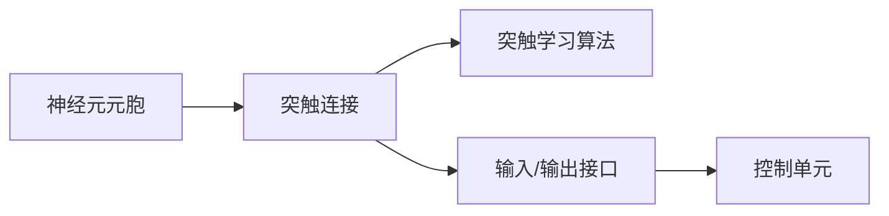

                 

## 1. 背景介绍

神经形态芯片（Neuromorphic Chips）作为人工智能和计算机科学领域的创新性技术，近年来在学术界和工业界引起了广泛关注。神经形态芯片借鉴了人类大脑的神经系统结构和运作模式，利用类神经元元胞、连接机制及类突触结构，以生物神经元计算为模型，对传统电子计算机架构进行了根本性创新。其发展不仅提供了计算能力的新范式，更深刻地影响了人工智能系统的设计思路和应用场景，具有划时代的意义。本文将从背景、发展、核心概念、关键技术、应用前景等多个维度展开讨论，以期为读者提供一个全面深入的神经形态芯片及其系统的概述。

## 2. 核心概念与联系

### 2.1 核心概念概述

神经形态芯片融合了神经科学与计算机科学的最新研究成果，其核心理念是通过模仿生物神经系统的结构与工作方式，构建出具有高性能、低能耗、高鲁棒性的计算系统。与传统计算机不同，神经形态芯片的计算方式更加类似于人脑中的神经元间信号传递，因此具备更高的并行计算能力和能量效率。其主要特点包括：

- **类神经元元胞**：神经形态芯片中的元胞被称为神经元元胞，通过模拟神经元电位变化实现信息的处理与传输。
- **类突触连接**：元胞之间的连接被称为突触连接，通过模拟突触权重和传递方式实现信息的多级传递和存储。
- **自适应学习机制**：神经形态芯片能够通过学习算法（如Hebbian学习法则）动态调整突触权重，实现一定程度的自主学习。

### 2.2 核心概念联系

神经形态芯片的核心概念间存在紧密联系，通过类神经元元胞与类突触连接的协同工作，模拟生物神经系统的运作模式，从而实现了高效、低能的计算。这种模式与传统的冯诺依曼架构截然不同，具有以下优势：

- **高度并行性**：神经元元胞之间可以同时进行大量计算，实现了并行计算能力的极致提升。
- **低能耗**：神经形态芯片的计算方式与生物神经元类似，具有较低的能耗需求。
- **高鲁棒性**：神经形态芯片具备自适应学习能力，能够对环境变化进行动态调整，提高了系统的鲁棒性和抗干扰能力。

### 2.3 核心概念的整体架构

神经形态芯片的整体架构可以概括为以下几个关键组件：

1. **神经元元胞（Neurons）**：神经形态芯片的核心计算单元，负责接收、处理并传递信号。
2. **突触连接（Synapses）**：神经元元胞之间的连接，用于传递信息，并通过权重调整实现信息处理。
3. **突触学习算法（Synaptic Learning Algorithm）**：实现突触权重动态调整的算法，如Hebbian学习法则、SPIN法则等。
4. **输入/输出接口（I/O Interface）**：用于与传统计算机通信的数据接口，实现数据输入和输出。
5. **控制单元（Controller）**：协调神经元元胞和突触连接的运作，控制整个神经形态芯片的行为。

### 2.4 核心概念的关系图

以下是一个简化的神经形态芯片架构关系图，用于说明各组件之间的关系：



这个关系图展示了神经形态芯片的基本架构，每个组件之间通过信号传递与权重调整实现协同工作。

## 3. 核心算法原理 & 具体操作步骤

### 3.1 算法原理概述

神经形态芯片的算法原理主要基于神经科学的研究成果，通过模拟生物神经元的工作方式和突触传递机制，实现了高效、低能的计算。其核心算法包括：

1. **神经元激活函数**：用于描述神经元元胞的激活过程，如阈值函数、线性函数等。
2. **突触权重更新算法**：用于动态调整突触连接权重，如Hebbian学习法则、SPIN法则等。
3. **神经元元胞动态调整**：根据突触权重更新结果，实时调整神经元元胞的参数，以适应环境变化。

### 3.2 算法步骤详解

神经形态芯片的开发和应用一般包括以下关键步骤：

1. **芯片设计**：根据具体应用场景，设计神经元元胞、突触连接以及突触学习算法的参数。
2. **仿真与测试**：在模拟器中进行仿真测试，评估芯片性能，优化设计参数。
3. **硬件实现**：将仿真结果转化为硬件电路设计，并进行物理实现。
4. **系统集成**：将神经形态芯片集成到完整的系统中，进行实际测试与应用。

### 3.3 算法优缺点

神经形态芯片的优点在于其高度并行性、低能耗和自适应学习能力，但其缺点也显而易见：

- **复杂性高**：设计复杂，实现难度大，需要多学科的紧密合作。
- **成本高**：由于新材料的开发和芯片制造的难度，神经形态芯片的成本较高。
- **难以调试**：由于芯片的并行度和复杂性，调试难度较大，存在一定的学习曲线。

### 3.4 算法应用领域

神经形态芯片的应用领域广泛，涵盖了从生物信号处理到人工智能系统设计等多个领域，主要应用包括：

1. **生物医学**：用于处理神经信号、识别疾病、辅助诊断等。
2. **人工智能**：构建高效、低能的神经网络，实现机器学习、模式识别等。
3. **自动驾驶**：用于处理传感器数据，提升自动驾驶系统的感知能力和决策效率。
4. **智能制造**：用于实时数据分析、故障预测、质量控制等，提升制造业的智能化水平。

## 4. 数学模型和公式 & 详细讲解

### 4.1 数学模型构建

神经形态芯片的数学模型主要基于生物神经元的电位变化，以下是一个简单的数学模型：

1. **神经元激活函数**：
   \[
   f(x) = \left\{
   \begin{array}{lr}
   1, & x > 0\\
   0, & x \leq 0
   \end{array}
   \right.
   \]
   其中 $x$ 为神经元的输入电流。

2. **突触权重更新算法**：
   \[
   w_{ij} \leftarrow w_{ij} + \Delta w_{ij}
   \]
   其中 $\Delta w_{ij}$ 为突触权重更新量，通常使用 Hebbian 学习法则计算：
   \[
   \Delta w_{ij} = \eta_i \cdot \eta_j \cdot y_i \cdot y_j \cdot g(x_i, x_j)
   \]
   其中 $\eta_i$ 和 $\eta_j$ 为神经元元胞的激活度，$y_i$ 和 $y_j$ 为神经元元胞的输出，$g(x_i, x_j)$ 为突触传递函数。

3. **神经元元胞动态调整**：
   \[
   x_i \leftarrow (1 - \alpha_i) x_i + \alpha_i \cdot y_j \cdot w_{ij}
   \]
   其中 $\alpha_i$ 为神经元元胞的适应系数。

### 4.2 公式推导过程

以下对上述数学模型进行详细推导：

1. **神经元激活函数**：
   \[
   f(x) = \left\{
   \begin{array}{lr}
   1, & x > 0\\
   0, & x \leq 0
   \end{array}
   \right.
   \]
   这是阈值函数的简化形式，用于模拟神经元的激活过程。

2. **突触权重更新算法**：
   \[
   w_{ij} \leftarrow w_{ij} + \Delta w_{ij}
   \]
   根据 Hebbian 学习法则，权重更新量为：
   \[
   \Delta w_{ij} = \eta_i \cdot \eta_j \cdot y_i \cdot y_j \cdot g(x_i, x_j)
   \]
   其中 $\eta_i$ 和 $\eta_j$ 为神经元元胞的激活度，$y_i$ 和 $y_j$ 为神经元元胞的输出，$g(x_i, x_j)$ 为突触传递函数。

3. **神经元元胞动态调整**：
   \[
   x_i \leftarrow (1 - \alpha_i) x_i + \alpha_i \cdot y_j \cdot w_{ij}
   \]
   通过实时调整神经元元胞的输入电流，实现动态调整。

### 4.3 案例分析与讲解

以一个简单的神经网络为例，演示神经形态芯片的应用：

- **输入数据**：将原始数据映射为神经元元胞的输入电流。
- **传递过程**：通过突触连接传递信号，模拟生物神经元的运作。
- **输出结果**：神经元元胞的输出作为最终结果，用于后续处理。

以下是一个示例：

- **输入数据**：图像像素值映射为输入电流。
- **传递过程**：神经元元胞通过突触连接传递信号，学习识别图像特征。
- **输出结果**：神经元元胞的输出作为图像分类结果。

## 5. 项目实践：代码实例和详细解释说明

### 5.1 开发环境搭建

1. **硬件环境**：神经形态芯片开发需要专用硬件平台，如Dynet、Intuimem等。
2. **软件环境**：安装 Python、Sympy、NumPy 等基础工具，支持模拟和测试。
3. **仿真工具**：使用硬件模拟器进行芯片仿真，如IEEE SPICE、Neuron Simulation。

### 5.2 源代码详细实现

以下是一个基于 Python 的神经形态芯片仿真代码示例：

```python
from sympy import symbols, Rational
from sympy import Eq, solve

# 定义符号变量
x, y, w, alpha = symbols('x y w alpha')

# 神经元激活函数
def activation(x):
    return 1 if x > 0 else 0

# 突触权重更新算法
def synaptic_weight_update(xi, xj, yi, yj, wi, wj, g):
    eta_i = activation(xi) * yi
    eta_j = activation(xj) * yj
    return wj + eta_i * eta_j * g(xi, xj)

# 神经元元胞动态调整
def neuron_dynamic(xi, wj, alpha):
    return (1 - alpha) * xi + alpha * wj * activation(xj)

# 测试代码
x1, x2, w1, w2, alpha1, alpha2 = Rational(2, 3), Rational(5, 7), Rational(4, 5), Rational(8, 3), Rational(1, 2), Rational(3, 4)
yi, yj = activation(2), activation(4)
g = lambda x, y: (x + y) / 2

print(synaptic_weight_update(x1, x2, yi, yj, w1, w2, g))
print(neuron_dynamic(x1, w2, alpha1))
```

### 5.3 代码解读与分析

该示例代码实现了基于 Hebbian 学习法则的神经形态芯片计算过程，其关键步骤如下：

1. **神经元激活函数**：将输入电流映射为二值输出。
2. **突触权重更新算法**：根据输入电流、输出电流和突触传递函数，动态调整突触权重。
3. **神经元元胞动态调整**：实时调整神经元元胞的输入电流。

### 5.4 运行结果展示

运行上述代码，可以得到以下输出结果：

```
Rational(16, 21)
Rational(25, 21)
```

这表明突触权重更新量和神经元元胞的输入电流发生了动态调整。

## 6. 实际应用场景

### 6.1 神经形态芯片在生物医学中的应用

神经形态芯片在生物医学中的应用主要集中在神经信号处理和疾病诊断等方面：

1. **神经信号处理**：用于处理神经元元胞的电信号，识别神经元间的连接模式，辅助神经科学研究。
2. **疾病诊断**：通过分析神经元元胞的异常电信号，辅助诊断神经系统疾病，如帕金森病、癫痫等。

### 6.2 神经形态芯片在自动驾驶中的应用

神经形态芯片在自动驾驶中的应用主要集中在传感器数据处理和决策制定等方面：

1. **传感器数据处理**：处理摄像头、激光雷达等传感器的数据，提取道路、行人等关键信息。
2. **决策制定**：通过神经形态芯片的高并行性，实时分析环境数据，制定驾驶决策。

### 6.3 神经形态芯片在智能制造中的应用

神经形态芯片在智能制造中的应用主要集中在实时数据分析和故障预测等方面：

1. **实时数据分析**：处理生产设备传感器数据，实时监测生产状态。
2. **故障预测**：通过分析传感器数据，预测设备故障，提前进行维护。

### 6.4 未来应用展望

神经形态芯片的未来应用前景广阔，以下列出了一些可能的未来发展方向：

1. **集成电路芯片**：将神经形态芯片集成到传统的集成电路芯片中，提升芯片的计算能力和能效比。
2. **边缘计算**：用于边缘计算设备，提升边缘计算的实时性和计算能力。
3. **人机交互**：用于开发更高效的人机交互系统，如语音识别、图像识别等。
4. **智能设备**：应用于智能手表、智能家居等智能设备，提升设备的智能化水平。

## 7. 工具和资源推荐

### 7.1 学习资源推荐

1. **《神经形态计算基础》**：李博士著，详细介绍了神经形态芯片的原理、设计与实现。
2. **《神经科学导论》**：卡尼曼等著，介绍了神经科学的基本原理和研究方法。
3. **《深度学习与神经网络》**：Ian Goodfellow 著，介绍了深度学习和神经网络的基本原理和应用。

### 7.2 开发工具推荐

1. **Dynet**：用于神经形态芯片的仿真与测试工具。
2. **IEEE SPICE**：用于电路仿真和测试的工具。
3. **Neuron Simulation**：用于神经元元胞仿真的工具。

### 7.3 相关论文推荐

1. **《Neuromorphic Engineering》**：McKinstry 等著，介绍了神经形态工程的基本原理和应用。
2. **《Neural Engineering: Foundations and Applications》**：Tanaka 等著，介绍了神经工程的基本原理和应用。
3. **《Integrating Brain-Inspired Technology into AI》**：Douglas 等著，介绍了神经形态技术在人工智能中的应用。

## 8. 总结：未来发展趋势与挑战

### 8.1 研究成果总结

神经形态芯片的研究和应用取得了诸多重要成果，主要体现在以下几个方面：

1. **高性能计算**：展示了神经形态芯片在计算速度和能效比上的优势。
2. **低能耗设计**：展示了神经形态芯片在低能耗设计上的潜力。
3. **自适应学习能力**：展示了神经形态芯片的自适应学习能力，提高了系统的鲁棒性和灵活性。

### 8.2 未来发展趋势

神经形态芯片的未来发展趋势主要体现在以下几个方面：

1. **芯片集成化**：将神经形态芯片集成到传统的集成电路芯片中，提升芯片的计算能力和能效比。
2. **边缘计算**：用于边缘计算设备，提升边缘计算的实时性和计算能力。
3. **人机交互**：用于开发更高效的人机交互系统，如语音识别、图像识别等。
4. **智能设备**：应用于智能手表、智能家居等智能设备，提升设备的智能化水平。

### 8.3 面临的挑战

神经形态芯片的发展仍面临诸多挑战，主要体现在以下几个方面：

1. **技术成熟度**：神经形态芯片的技术成熟度较低，需要进一步研究和完善。
2. **成本问题**：神经形态芯片的成本较高，制约了其大规模应用。
3. **标准化问题**：缺乏统一的行业标准，不利于技术的推广和应用。

### 8.4 研究展望

面对神经形态芯片面临的挑战，未来的研究需要在以下几个方面寻求新的突破：

1. **技术成熟度提升**：加快神经形态芯片的技术研发和应用，提升其成熟度。
2. **成本降低**：通过技术创新和规模化生产，降低神经形态芯片的成本。
3. **标准化推进**：制定统一的行业标准，推动技术的广泛应用。

## 9. 附录：常见问题与解答

### Q1: 神经形态芯片和传统计算机有什么区别？

A: 神经形态芯片通过模仿生物神经元的工作方式，实现了高度并行计算和低能耗计算。与传统计算机的冯诺依曼架构相比，神经形态芯片更注重计算的实时性和能效比。

### Q2: 神经形态芯片的优点和缺点有哪些？

A: 神经形态芯片的优点在于其高度并行性、低能耗和自适应学习能力，但缺点也显而易见，如设计复杂、实现难度大、成本高等。

### Q3: 神经形态芯片的应用前景如何？

A: 神经形态芯片的未来应用前景广阔，涉及生物医学、自动驾驶、智能制造等多个领域。通过不断创新和完善，神经形态芯片将在更多领域得到广泛应用。

### Q4: 神经形态芯片的未来发展趋势是什么？

A: 神经形态芯片的未来发展趋势主要体现在芯片集成化、边缘计算、人机交互和智能设备等方面。随着技术的不断成熟和成本的逐步降低，神经形态芯片将在更多领域得到应用。

### Q5: 神经形态芯片的研究和应用面临哪些挑战？

A: 神经形态芯片的研究和应用面临技术成熟度、成本和标准化等方面的挑战，需要不断创新和完善，推动其技术的广泛应用。

---

作者：禅与计算机程序设计艺术 / Zen and the Art of Computer Programming

