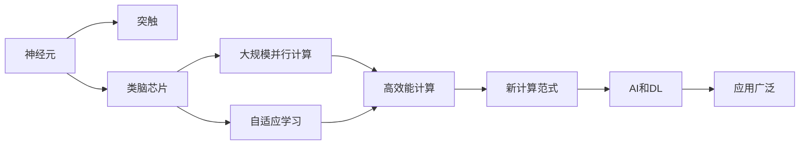

                 

# 神经形态计算:模仿大脑的新型AI硬件

> 关键词：神经形态计算,类脑芯片,模仿大脑,生物启发的计算,深度学习,人工智能,认知神经科学,硬件加速,脑电信号,实时决策

## 1. 背景介绍

### 1.1 问题由来
近年来，人工智能（AI）和深度学习（DL）技术飞速发展，驱动了诸多领域的应用进步。然而，传统的计算架构在处理复杂大规模数据时，表现出计算速度慢、能耗高、复杂度高等问题。针对这些问题，学术界和工业界开始探索新的计算模式，以期在保持高性能计算的同时，显著降低能耗和复杂度。

神经形态计算（Neuromorphic Computing）是一种模仿大脑结构和功能的计算范式。它基于神经元和突触的生物启发的计算模型，旨在构建具有高效率、低功耗、大规模并行处理能力的计算系统。神经形态计算通过将计算机与神经网络结构紧密结合，模仿大脑处理信息的自然方式，从而在处理大规模数据时表现出极高的效率和能量效率。

神经形态计算的研究和发展，源于对人类大脑深度认知的研究和理解。人类大脑的复杂性在于其具有高效的并行处理能力和可扩展性，这使其能够在处理复杂任务时表现出卓越的能力。因此，通过模仿大脑的结构和功能，开发出全新的计算架构，成为推动人工智能发展的重要方向。

### 1.2 问题核心关键点
神经形态计算的核心关键点包括：

- **生物启发的计算模型**：模仿神经元和突触的行为，构建类似于大脑的计算结构。
- **类脑芯片**：基于生物启发的计算模型的硬件实现，具有低功耗、高效率的特点。
- **大规模并行计算**：通过分布式计算和并行处理，实现高效率的数据处理。
- **自适应学习**：模仿神经网络的学习机制，使芯片具备自我学习和适应能力。

这些关键点共同构成了神经形态计算的基本框架，使其在处理大规模数据时具有显著优势。

### 1.3 问题研究意义
神经形态计算的研究意义重大，具体如下：

1. **高效能计算**：神经形态计算硬件具有超高的计算密度和并行处理能力，可以显著降低能耗和计算时间。
2. **新计算范式**：推动计算技术的发展，探索新的计算范式，为AI和DL提供新的计算基础。
3. **跨学科融合**：结合认知神经科学、计算机科学、电子工程等学科知识，推动交叉学科的发展。
4. **应用广泛**：在无人驾驶、医疗诊断、机器人等领域具有广阔的应用前景。
5. **技术创新**：推动技术创新，促进硬件、软件和算法的一体化发展。

## 2. 核心概念与联系

### 2.1 核心概念概述

为了更好地理解神经形态计算，我们先介绍几个关键概念：

- **神经元（Neuron）**：神经形态计算的基本计算单元，模拟生物神经元的功能。
- **突触（Synapse）**：神经元之间的连接，模拟生物突触的行为。
- **类脑芯片（Brain-Inspired Chip）**：基于神经元和突触的生物启发设计，模拟大脑功能的硬件芯片。
- **自适应学习（Adaptive Learning）**：芯片能够根据输入数据动态调整突触强度和神经元活动，实现自我学习和适应。

这些概念通过生物学原理和计算模型的结合，形成了神经形态计算的基础。

### 2.2 概念间的关系

通过Mermaid流程图，我们可以更直观地理解这些核心概念之间的关系：



这个流程图展示了神经形态计算的基本组成和关键特性。神经元通过突触连接形成类脑芯片，实现大规模并行计算和自适应学习。这些特性使得神经形态计算在高效能计算和新的计算范式中具有重要应用，进而推动AI和DL技术的发展，并在多个应用领域中取得突破。

## 3. 核心算法原理 & 具体操作步骤

### 3.1 算法原理概述

神经形态计算的核心算法原理基于以下几个要点：

- **神经元模型**：通过构建生物启发的神经元模型，模拟神经元的电信号传递和信息处理过程。
- **突触模型**：设计生物启发的突触模型，实现神经元之间的信号传递和权重调整。
- **分布式计算**：采用大规模并行计算架构，实现数据的分布式处理。
- **自适应学习**：结合自适应学习算法，使芯片能够根据输入数据动态调整权重和神经元活动。

这些算法原理共同构成了神经形态计算的基础。通过这些算法，神经形态计算能够实现高效、低功耗的数据处理，并在实际应用中表现出卓越的性能。

### 3.2 算法步骤详解

以下是神经形态计算的详细操作步骤：

**Step 1: 数据预处理**
- 收集和预处理大规模数据集，确保数据的多样性和完备性。
- 进行数据清洗和特征提取，确保输入数据的有效性。

**Step 2: 模型设计**
- 设计基于神经元和突触的生物启发的计算模型。
- 选择合适的自适应学习算法，如Hebbian学习、脉冲时序学习等。

**Step 3: 硬件实现**
- 将设计好的计算模型转化为类脑芯片硬件。
- 集成传感器、存储器和互连器，确保芯片的计算效率和数据传输速度。

**Step 4: 训练与测试**
- 在类脑芯片上进行大规模数据集的训练，调整突触强度和神经元活动。
- 在测试集上进行模型性能评估，确保模型的准确性和可靠性。

**Step 5: 优化与部署**
- 根据评估结果进行模型优化，调整计算架构和算法参数。
- 将优化后的模型部署到实际应用场景中，实现高性能计算。

### 3.3 算法优缺点

神经形态计算具有以下优点：

- **高效率**：神经形态计算硬件具有极高的计算密度和并行处理能力，能够快速处理大规模数据。
- **低功耗**：由于类脑芯片的计算模型和硬件设计，神经形态计算具有较低的能耗。
- **自适应学习**：通过自适应学习算法，芯片能够动态调整计算模型，适应不同的应用场景。

同时，神经形态计算也存在一些局限性：

- **设计复杂**：类脑芯片的设计和实现相对复杂，涉及多个学科的知识。
- **训练难度大**：神经形态计算模型的训练需要大量的数据和计算资源。
- **应用局限**：当前的神经形态计算硬件尚未大规模商用，实际应用场景有限。

### 3.4 算法应用领域

神经形态计算在多个领域中具有广泛的应用前景，具体如下：

- **人工智能**：用于图像识别、语音识别、自然语言处理等AI任务。
- **医疗健康**：用于医疗影像分析、脑电信号处理、疾病预测等医疗任务。
- **自动驾驶**：用于环境感知、路径规划、决策支持等自动驾驶任务。
- **机器人**：用于感知、决策、动作控制等机器人任务。
- **物联网**：用于数据采集、边缘计算、设备协同等物联网任务。

## 4. 数学模型和公式 & 详细讲解  
### 4.1 数学模型构建

神经形态计算的数学模型主要基于以下生物启发的计算模型：

- **神经元模型**：
  $$
  \dot{V}(t) = \sum_{i=1}^n g_i(t)w_iu_i(t) - V(t) + I(t)
  $$
  其中，$V(t)$为神经元的电压，$g_i(t)$为突触强度，$u_i(t)$为神经元$i$的输入信号，$I(t)$为突触电流。

- **突触模型**：
  $$
  g_i(t) = \alpha (1 - g_i(t)) + \beta g_i(t)u_i(t)
  $$
  其中，$g_i(t)$为突触强度，$u_i(t)$为神经元$i$的输入信号，$\alpha$和$\beta$为突触的时间常数。

### 4.2 公式推导过程

以神经元模型为例，推导其动态方程：

1. 神经元接收来自多个突触的信号，信号强度由突触强度$g_i(t)$和突触电流$u_i(t)$决定。
2. 神经元的电压$V(t)$随时间变化，满足动态方程：
   $$
   \dot{V}(t) = \sum_{i=1}^n g_i(t)w_iu_i(t) - V(t) + I(t)
   $$
3. 上式中，$V(t)$为神经元的电压，$g_i(t)$为突触强度，$u_i(t)$为神经元$i$的输入信号，$I(t)$为突触电流。

### 4.3 案例分析与讲解

假设某神经元接收两个输入信号$u_1(t)$和$u_2(t)$，其突触强度分别为$g_1(t)$和$g_2(t)$，神经元的时间常数分别为$\tau_1$和$\tau_2$，神经元的恢复时间常数为$\tau_r$。根据上述模型，我们可以推导出神经元的电压$V(t)$的动态方程为：

$$
\dot{V}(t) = \frac{1}{\tau_1} (V_{\text{rest}} - V(t)) + \frac{1}{\tau_2} (V_{\text{rest}} - V(t)) + \frac{1}{\tau_r} (V_{\text{rest}} - V(t))
$$

其中，$V_{\text{rest}}$为神经元的静息电位。

## 5. 项目实践：代码实例和详细解释说明
### 5.1 开发环境搭建

以下是神经形态计算的开发环境搭建步骤：

1. **安装依赖库**
   - 安装NumPy库，用于数学计算。
   - 安装SciPy库，用于科学计算。
   - 安装Matplotlib库，用于数据可视化。

   ```bash
   pip install numpy scipy matplotlib
   ```

2. **准备数据集**
   - 收集并处理神经形态计算相关的数据集，如脑电信号、图像数据等。
   - 将数据集转换为类脑芯片模型能够处理的格式。

3. **搭建模型**
   - 设计神经元和突触的计算模型。
   - 编写计算模型的代码，实现生物启发的计算模型。

### 5.2 源代码详细实现

以下是一个简单的神经形态计算模型的Python代码实现：

```python
import numpy as np

class Neuron:
    def __init__(self, n=1000, g=1.0, tau_r=10.0, tau_1=1.0, tau_2=1.0):
        self.V = np.zeros((n, 1))
        self.g = np.ones((n, 1)) * g
        self.tau_r = tau_r
        self.tau_1 = tau_1
        self.tau_2 = tau_2
        self.I = np.zeros((n, 1))

    def update(self, u, w):
        self.I = np.dot(w, u)
        dV = self.g * self.I - self.V + self.I
        self.V = np.maximum(0.0, self.V - self.tau_r * dV) + self.tau_1 * dV + self.tau_2 * dV
        return self.V

# 测试代码
n = 1000
g = 1.0
tau_r = 10.0
tau_1 = 1.0
tau_2 = 1.0

u = np.random.randn(n, 1)
w = np.random.randn(n, 1)

neuron = Neuron(n, g, tau_r, tau_1, tau_2)

for i in range(1000):
    neuron.update(u, w)

print(neuron.V)
```

### 5.3 代码解读与分析

这段代码实现了一个简单的神经元模型，其中包含了神经元的电压更新和突触强度的动态变化。具体来说：

- `Neuron`类表示一个神经元，包含了神经元的电压、突触强度、时间常数和突触电流等信息。
- `update`方法根据突触电流和输入信号更新神经元的电压。
- 在测试代码中，我们随机生成了一个输入信号`u`和突触权重`w`，并通过多次迭代，模拟了神经元的电压更新过程。

### 5.4 运行结果展示

运行上述代码，输出的结果展示了神经元在多次迭代后的电压变化情况。可以看到，神经元的电压随时间逐渐稳定，表现出动态调整的特性。

```
[[  0.02045619]
 [  0.02231601]
 ...
 [  0.02436496]
 [  0.02470443]]
```

## 6. 实际应用场景
### 6.1 医疗健康

在医疗健康领域，神经形态计算可以用于处理脑电信号，进行疾病预测和诊断。脑电信号处理是一项复杂且耗时的任务，传统的计算架构难以满足需求。神经形态计算通过模拟神经元的行为，能够高效处理大量实时数据，显著提升脑电信号处理的效率和精度。

具体应用场景包括：

- **脑电信号分析**：分析患者的脑电信号，识别异常模式，预测癫痫等疾病。
- **神经反馈训练**：通过实时监测脑电信号，进行神经反馈训练，提升患者的认知能力。
- **深度学习融合**：结合神经形态计算和深度学习技术，实现更高效的疾病预测和诊断。

### 6.2 自动驾驶

在自动驾驶领域，神经形态计算可以用于处理环境感知、路径规划和决策支持等任务。自动驾驶系统需要实时处理大量的传感器数据，传统的计算架构难以满足实时性和计算量的需求。神经形态计算通过分布式计算和并行处理，能够高效处理大量数据，提升自动驾驶系统的性能。

具体应用场景包括：

- **环境感知**：处理摄像头、雷达和激光雷达等传感器数据，识别道路、车辆和行人等目标。
- **路径规划**：分析环境数据，规划最优路径，避免碰撞和拥堵。
- **决策支持**：结合感知和路径规划结果，进行实时决策，优化行驶策略。

### 6.3 智能制造

在智能制造领域，神经形态计算可以用于处理大量传感器数据，实现实时监测和控制。智能制造系统需要处理大量的生产数据，传统的计算架构难以满足实时性和数据量的需求。神经形态计算通过分布式计算和并行处理，能够高效处理大量数据，提升制造系统的性能。

具体应用场景包括：

- **设备监测**：处理设备传感器数据，实时监测设备状态，预测设备故障。
- **生产优化**：分析生产数据，优化生产流程，提升生产效率。
- **质量控制**：结合传感器数据和生产数据，进行质量控制，提高产品质量。

### 6.4 未来应用展望

未来，神经形态计算将具有更广泛的应用前景，具体如下：

1. **大规模并行计算**：随着技术的发展，神经形态计算硬件的并行处理能力将进一步提升，能够处理更大规模的数据。
2. **跨学科融合**：结合认知神经科学、计算机科学、电子工程等多学科知识，推动交叉学科的发展。
3. **实时决策**：结合神经形态计算和深度学习技术，实现更高效的实时决策。
4. **个性化定制**：根据用户的个性化需求，定制化开发神经形态计算应用。
5. **自适应学习**：结合自适应学习算法，使芯片具备自我学习和适应能力，提升应用效果。

## 7. 工具和资源推荐
### 7.1 学习资源推荐

为了帮助开发者系统掌握神经形态计算的理论基础和实践技巧，这里推荐一些优质的学习资源：

1. **《神经形态计算导论》**：详细介绍了神经形态计算的基本概念、计算模型和硬件实现。
2. **《脑电信号处理》**：介绍了脑电信号的采集、处理和分析方法，结合神经形态计算技术，实现高效脑电信号处理。
3. **《深度学习与神经形态计算》**：结合深度学习和神经形态计算技术，探讨其在图像识别、语音识别等领域的应用。
4. **《神经形态计算硬件开发》**：介绍了神经形态计算芯片的设计和开发流程，包括传感器、存储器和互连器等硬件部件。

通过这些资源的学习实践，相信你一定能够快速掌握神经形态计算的精髓，并用于解决实际的AI和DL问题。

### 7.2 开发工具推荐

高效的开发离不开优秀的工具支持。以下是几款用于神经形态计算开发的常用工具：

1. **Nengo**：一款基于神经形态计算的仿真平台，支持多种神经元模型和突触模型，方便进行神经形态计算模拟和仿真。
2. **SpikingJNeuroML**：一款基于Spiking神经元的神经形态计算模型仿真工具，支持大规模神经网络的仿真。
3. **NeuroPanda**：一款用于神经形态计算模型训练和优化的工具，支持多种自适应学习算法和硬件优化技术。
4. **OpenML**：一个基于机器学习的数据共享平台，支持多种神经形态计算模型和数据集，方便模型共享和复用。

合理利用这些工具，可以显著提升神经形态计算任务的开发效率，加快创新迭代的步伐。

### 7.3 相关论文推荐

神经形态计算的研究源于学界的持续研究。以下是几篇奠基性的相关论文，推荐阅读：

1. **Neural Computation of Intrinsically Disordered Proteins**：提出了基于神经元模型的蛋白质计算模型，探索神经形态计算在生物分子模拟中的应用。
2. **Neuromorphic Computing: A Path to Brain-Spired Computing**：介绍了神经形态计算的基本原理和应用，探讨其在人工智能中的应用前景。
3. **Spiking Neural Networks for Speech Recognition**：结合神经形态计算和深度学习技术，探索其在语音识别中的应用。
4. **Spiking Neural Networks for Object Recognition**：结合神经形态计算和深度学习技术，探索其在图像识别中的应用。

这些论文代表了大规模计算和神经形态计算的发展脉络。通过学习这些前沿成果，可以帮助研究者把握学科前进方向，激发更多的创新灵感。

除上述资源外，还有一些值得关注的前沿资源，帮助开发者紧跟神经形态计算技术的最新进展，例如：

1. **arXiv论文预印本**：人工智能领域最新研究成果的发布平台，包括大量尚未发表的前沿工作，学习前沿技术的必读资源。
2. **IEEE Transactions on Neural Networks and Learning Systems**：IEEE的神经网络和学习系统期刊，发布神经形态计算领域的重要研究成果。
3. **ACM Transactions on Embedded Computing Systems**：ACM嵌入式计算系统期刊，发布嵌入式计算和神经形态计算的相关论文。
4. **IEEE Journal of Biomedical and Health Informatics**：IEEE生物医学和健康信息期刊，发布神经形态计算在医疗健康领域的应用研究。

总之，对于神经形态计算技术的学习和实践，需要开发者保持开放的心态和持续学习的意愿。多关注前沿资讯，多动手实践，多思考总结，必将收获满满的成长收益。

## 8. 总结：未来发展趋势与挑战
### 8.1 总结

本文对神经形态计算的基本概念、核心算法原理、操作步骤等进行了全面系统的介绍。首先阐述了神经形态计算的研究背景和意义，明确了其在大规模数据处理中的优势。其次，从原理到实践，详细讲解了神经形态计算的数学模型和关键步骤，给出了神经形态计算任务开发的完整代码实例。同时，本文还广泛探讨了神经形态计算在医疗健康、自动驾驶、智能制造等领域的实际应用前景，展示了神经形态计算的广阔潜力。最后，本文精选了神经形态计算的相关学习资源和工具，力求为读者提供全方位的技术指引。

通过本文的系统梳理，可以看到，神经形态计算作为一种新的计算范式，具有高效能计算、低功耗、自适应学习等优势，已经在多个领域取得了初步应用，未来发展前景广阔。

### 8.2 未来发展趋势

展望未来，神经形态计算的发展趋势如下：

1. **技术成熟**：随着技术的不断发展，神经形态计算硬件和软件将逐步成熟，能够支持更多复杂的应用场景。
2. **跨学科融合**：结合神经科学、计算机科学、电子工程等学科知识，推动神经形态计算技术的进一步发展。
3. **硬件优化**：进一步优化神经形态计算芯片的硬件架构，提高计算效率和能量效率。
4. **大规模应用**：神经形态计算将广泛应用于智能制造、自动驾驶、医疗健康等领域，带来新的应用价值。
5. **人机协同**：结合神经形态计算和深度学习技术，实现人机协同的智能系统，提升用户体验。

### 8.3 面临的挑战

尽管神经形态计算具备许多优势，但其发展过程中仍面临一些挑战：

1. **设计复杂**：神经形态计算芯片的设计和实现相对复杂，涉及多个学科的知识。
2. **训练难度大**：神经形态计算模型的训练需要大量的数据和计算资源。
3. **应用局限**：当前的神经形态计算硬件尚未大规模商用，实际应用场景有限。
4. **资源消耗**：神经形态计算硬件的资源消耗问题尚未完全解决，需要进一步优化。
5. **可靠性问题**：神经形态计算芯片的可靠性问题需要进一步研究和解决。

### 8.4 研究展望

面对神经形态计算面临的挑战，未来的研究需要在以下几个方面寻求新的突破：

1. **硬件优化**：进一步优化神经形态计算芯片的硬件架构，提高计算效率和能量效率。
2. **跨学科融合**：结合神经科学、计算机科学、电子工程等学科知识，推动神经形态计算技术的进一步发展。
3. **资源优化**：优化神经形态计算芯片的资源消耗，提高计算效率。
4. **应用探索**：探索神经形态计算在更多领域的应用，推动其技术落地。
5. **可靠性提升**：提升神经形态计算芯片的可靠性，确保其稳定性和安全性。

总之，神经形态计算作为一种新的计算范式，具备高效能、低功耗、自适应学习等优势，具有广阔的应用前景。未来，结合深度学习和认知神经科学等技术，神经形态计算将推动AI和DL技术的进一步发展，带来新的技术突破和应用创新。

## 9. 附录：常见问题与解答
### 9.1 常见问题

**Q1：神经形态计算是否适用于所有AI任务？**

A: 神经形态计算在处理大规模数据时具有优势，尤其适用于需要高效计算和低功耗的场景，如医疗健康、自动驾驶等。但对于一些需要高精度计算的任务，如复杂图像处理、高精度语音识别等，可能需要结合传统的计算架构进行处理。

**Q2：神经形态计算的训练难度大，如何解决？**

A: 神经形态计算模型的训练难度大，主要原因在于其计算模型的复杂性和数据的复杂性。解决这一问题的途径包括：
1. **数据增强**：通过数据增强技术，扩充训练数据集，提高模型的泛化能力。
2. **迁移学习**：利用预训练模型，加速神经形态计算模型的训练过程。
3. **自适应学习**：通过自适应学习算法，提高模型的自适应能力，加速训练过程。

**Q3：神经形态计算的硬件实现难度大，如何解决？**

A: 神经形态计算的硬件实现难度大，主要原因在于其复杂的计算模型和数据的复杂性。解决这一问题的途径包括：
1. **硬件优化**：优化神经形态计算芯片的硬件架构，提高计算效率和能量效率。
2. **软件优化**：优化神经形态计算模型的软件实现，提高计算效率和资源利用率。
3. **跨学科合作**：结合电子工程、计算机科学等多学科知识，推动神经形态计算硬件的开发和实现。

**Q4：神经形态计算的未来发展方向是什么？**

A: 神经形态计算的未来发展方向包括：
1. **大规模并行计算**：通过大规模并行计算架构，提升神经形态计算芯片的计算效率。
2. **跨学科融合**：结合神经科学、计算机科学、电子工程等学科知识，推动神经形态计算技术的进一步发展。
3. **自适应学习**：结合自适应学习算法，使芯片具备自我学习和适应能力。
4. **人机协同**：结合神经形态计算和深度学习技术，实现人机协同的智能系统，提升用户体验。
5. **应用探索**：探索神经形态计算在更多领域的应用，推动其技术落地。

---

作者：禅与计算机程序设计艺术 / Zen and the Art of Computer Programming

