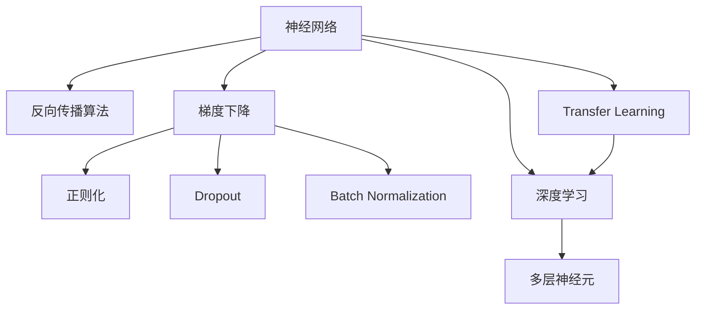

                 

# 神经网络 ：开启智能新纪元

> 关键词：神经网络,深度学习,人工智能,机器学习,人工神经元,反向传播算法

## 1. 背景介绍

### 1.1 问题由来
在计算机科学的漫长历史中，神经网络（Neural Networks, NNs）的出现，无疑是一个划时代的里程碑。从生物神经元中获得启发，人类发明了能够模拟其工作原理的数学模型，从而开创了人工智能（Artificial Intelligence, AI）的新纪元。现代神经网络已广泛应用于图像识别、自然语言处理、语音识别、游戏AI、自动驾驶等多个领域，极大地推动了科技和社会的发展。

### 1.2 问题核心关键点
神经网络通过模仿人脑神经元的工作方式，实现信息处理和决策。其核心思想是通过大量训练数据，自动学习输入与输出之间的复杂映射关系，从而在各种任务上取得优异的性能。然而，神经网络的设计和优化仍然存在诸多挑战，如何提高其泛化能力、提高训练效率、降低计算资源消耗等问题，都是当前研究的前沿课题。

### 1.3 问题研究意义
研究神经网络的优化方法，对于提升其性能、降低训练成本、拓展应用范围具有重要意义：

1. 提高泛化能力：优化神经网络，使其能够更好地适应新数据和任务。
2. 加速训练过程：通过更高效的算法和策略，缩短训练时间。
3. 降低资源消耗：优化神经网络结构，减少计算资源占用。
4. 拓展应用边界：使得神经网络在更多场景下发挥作用。
5. 促进技术创新：带动深度学习、计算机视觉、自然语言处理等领域的进步。
6. 提升经济效益：帮助企业提高智能化水平，实现业务转型升级。

## 2. 核心概念与联系

### 2.1 核心概念概述

为更好地理解神经网络的优化方法，本节将介绍几个关键概念：

- 神经网络（Neural Networks, NNs）：以多层神经元为基本单元的计算模型，通过输入-输出映射实现复杂任务。
- 深度学习（Deep Learning）：一种基于多层神经网络的学习范式，旨在学习从输入到输出的复杂映射。
- 人工神经元（Artificial Neuron）：神经网络的基本组件，负责处理输入信号并传递给下一层。
- 反向传播算法（Backpropagation）：一种常用的神经网络优化算法，通过反向传播误差信号更新参数。
- 梯度下降（Gradient Descent）：一种优化算法，通过梯度信息调整参数，使得损失函数最小化。
- 正则化（Regularization）：通过引入惩罚项，避免过拟合，提高模型泛化能力。
- Dropout：一种正则化技术，随机丢弃部分神经元，增强模型鲁棒性。
- Batch Normalization：一种数据归一化技术，加速训练过程，提高模型性能。
- Transfer Learning：一种迁移学习范式，利用预训练模型，快速适应新任务。

这些概念之间的逻辑关系可以通过以下Mermaid流程图来展示：



这个流程图展示了大语言模型的核心概念及其之间的关系：

1. 神经网络通过多层神经元进行计算和映射。
2. 反向传播算法和梯度下降用于更新网络参数，使得损失函数最小化。
3. 正则化、Dropout、Batch Normalization等技术用于提高模型的泛化能力和训练效率。
4. 深度学习利用多层神经网络实现复杂映射。
5. Transfer Learning通过迁移学习，利用预训练模型加速新任务的学习。

### 2.2 概念间的关系

这些核心概念之间存在着紧密的联系，形成了神经网络的优化生态系统。下面我们通过几个Mermaid流程图来展示这些概念之间的关系。

#### 2.2.1 神经网络的计算流程


这个流程图展示了神经网络的基本计算流程：输入层接收数据，经过多个隐藏层处理，最终由输出层输出结果。

#### 2.2.2 反向传播的计算流程


这个流程图展示了反向传播算法的计算流程：从输出层开始，反向传播误差信号，更新隐藏层参数。

#### 2.2.3 梯度下降的计算流程


这个流程图展示了梯度下降算法的计算流程：通过计算梯度，调整参数，使得损失函数减小。

#### 2.2.4 正则化的计算流程


这个流程图展示了正则化的计算流程：在损失函数中引入正则化项，避免过拟合。

## 3. 核心算法原理 & 具体操作步骤
### 3.1 算法原理概述

神经网络的优化方法，主要通过损失函数的极小化来实现。假设神经网络模型为 $M_{\theta}$，其中 $\theta$ 为网络参数，目标是最小化损失函数 $\mathcal{L}(M_{\theta})$，即：

$$
\theta^* = \mathop{\arg\min}_{\theta} \mathcal{L}(M_{\theta})
$$

常用的损失函数包括均方误差（Mean Squared Error, MSE）、交叉熵（Cross-Entropy, CE）等。例如，在分类任务中，常用的损失函数为交叉熵损失：

$$
\mathcal{L}(y,\hat{y}) = -\frac{1}{N}\sum_{i=1}^N[y_i\log\hat{y}_i+(1-y_i)\log(1-\hat{y}_i)]
$$

其中 $y$ 为真实标签，$\hat{y}$ 为模型预测结果。

神经网络的优化方法主要包括：

- 反向传播算法（Backpropagation）：通过反向传播误差信号，计算梯度。
- 梯度下降（Gradient Descent）：根据梯度信息更新参数。
- 正则化（Regularization）：通过引入正则项，避免过拟合。
- Dropout：随机丢弃部分神经元，增强模型鲁棒性。
- Batch Normalization：数据归一化，加速训练。

### 3.2 算法步骤详解

基于梯度下降的神经网络优化算法通常包括以下几个关键步骤：

**Step 1: 准备数据和模型**
- 准备训练集、验证集、测试集。
- 定义神经网络模型 $M_{\theta}$，包括网络结构、激活函数等。

**Step 2: 定义损失函数**
- 根据任务类型，选择合适的损失函数。
- 例如，分类任务可以选择交叉熵损失。

**Step 3: 定义优化器**
- 选择合适的优化器，如Adam、SGD等。
- 设置优化器的参数，如学习率、动量、衰减等。

**Step 4: 初始化参数**
- 随机初始化网络参数 $\theta$，通常从均值为0、方差为标准差的高斯分布中抽样。

**Step 5: 前向传播**
- 将训练数据逐批输入模型，计算预测结果 $\hat{y}$。

**Step 6: 计算损失**
- 计算预测结果与真实标签的损失 $\mathcal{L}$。

**Step 7: 反向传播**
- 反向传播误差信号，计算梯度。
- 根据梯度信息更新模型参数。

**Step 8: 正则化和Dropout**
- 应用正则化技术和Dropout技术，增强模型鲁棒性。

**Step 9: 模型评估**
- 在验证集和测试集上评估模型性能，避免过拟合。

**Step 10: 调整超参数**
- 根据评估结果，调整学习率、批量大小等超参数，优化模型性能。

### 3.3 算法优缺点

神经网络优化算法的优点包括：

- 模型能力强：神经网络能够学习复杂映射，处理高维数据。
- 适应性强：神经网络通过调整参数，适应各种任务。
- 可扩展性好：神经网络可以通过增加层数和神经元数量，提升性能。

然而，神经网络优化算法也存在一些缺点：

- 过拟合风险：神经网络容易过拟合，需要正则化等技术缓解。
- 训练耗时长：神经网络训练过程复杂，需要大量计算资源。
- 计算资源消耗大：神经网络模型参数众多，计算资源占用大。
- 可解释性差：神经网络黑盒特性，难以解释模型内部逻辑。

### 3.4 算法应用领域

神经网络优化算法已经在各个领域得到了广泛应用，例如：

- 计算机视觉：图像分类、目标检测、人脸识别等任务。
- 自然语言处理：机器翻译、文本生成、情感分析等任务。
- 语音识别：语音转文本、语音合成等任务。
- 自动驾驶：环境感知、路径规划、决策制定等任务。
- 医疗影像：医学图像诊断、病灶检测等任务。
- 金融风险管理：信用评估、欺诈检测等任务。

## 4. 数学模型和公式 & 详细讲解  
### 4.1 数学模型构建

本节将使用数学语言对神经网络的优化过程进行更加严格的刻画。

记神经网络模型为 $M_{\theta}:\mathcal{X} \rightarrow \mathcal{Y}$，其中 $\mathcal{X}$ 为输入空间，$\mathcal{Y}$ 为输出空间，$\theta \in \mathbb{R}^d$ 为网络参数。假设训练集为 $D=\{(x_i,y_i)\}_{i=1}^N$，其中 $x_i \in \mathcal{X}$，$y_i \in \mathcal{Y}$。

定义模型 $M_{\theta}$ 在数据样本 $(x,y)$ 上的损失函数为 $\ell(M_{\theta}(x),y)$，则在数据集 $D$ 上的经验风险为：

$$
\mathcal{L}(\theta) = \frac{1}{N}\sum_{i=1}^N \ell(M_{\theta}(x_i),y_i)
$$

常用的损失函数包括均方误差（MSE）、交叉熵（CE）等。例如，在分类任务中，交叉熵损失函数定义为：

$$
\mathcal{L}(y,\hat{y}) = -\frac{1}{N}\sum_{i=1}^N[y_i\log\hat{y}_i+(1-y_i)\log(1-\hat{y}_i)]
$$

其中 $y$ 为真实标签，$\hat{y}$ 为模型预测结果。

### 4.2 公式推导过程

以下我们以二分类任务为例，推导交叉熵损失函数的梯度计算公式。

假设模型 $M_{\theta}$ 在输入 $x$ 上的输出为 $\hat{y}=M_{\theta}(x)$，表示样本属于正类的概率。真实标签 $y \in \{0,1\}$。则二分类交叉熵损失函数定义为：

$$
\ell(M_{\theta}(x),y) = -[y\log \hat{y} + (1-y)\log (1-\hat{y})]
$$

将其代入经验风险公式，得：

$$
\mathcal{L}(\theta) = -\frac{1}{N}\sum_{i=1}^N [y_i\log M_{\theta}(x_i)+(1-y_i)\log(1-M_{\theta}(x_i))]
$$

根据链式法则，损失函数对参数 $\theta_k$ 的梯度为：

$$
\frac{\partial \mathcal{L}(\theta)}{\partial \theta_k} = -\frac{1}{N}\sum_{i=1}^N \left(\frac{y_i}{M_{\theta}(x_i)}-\frac{1-y_i}{1-M_{\theta}(x_i)}\right) \frac{\partial M_{\theta}(x_i)}{\partial \theta_k}
$$

其中 $\frac{\partial M_{\theta}(x_i)}{\partial \theta_k}$ 可进一步递归展开，利用自动微分技术完成计算。

在得到损失函数的梯度后，即可带入参数更新公式，完成模型的迭代优化。重复上述过程直至收敛，最终得到适应下游任务的最优模型参数 $\theta^*$。

## 5. 项目实践：代码实例和详细解释说明
### 5.1 开发环境搭建

在进行神经网络优化实践前，我们需要准备好开发环境。以下是使用Python进行PyTorch开发的环境配置流程：

1. 安装Anaconda：从官网下载并安装Anaconda，用于创建独立的Python环境。

2. 创建并激活虚拟环境：
```bash
conda create -n pytorch-env python=3.8 
conda activate pytorch-env
```

3. 安装PyTorch：根据CUDA版本，从官网获取对应的安装命令。例如：
```bash
conda install pytorch torchvision torchaudio cudatoolkit=11.1 -c pytorch -c conda-forge
```

4. 安装TensorBoard：
```bash
pip install tensorboard
```

5. 安装TensorFlow：
```bash
pip install tensorflow
```

完成上述步骤后，即可在`pytorch-env`环境中开始神经网络优化实践。

### 5.2 源代码详细实现

这里我们以二分类任务为例，使用PyTorch实现一个简单的神经网络模型，并进行优化。

```python
import torch
import torch.nn as nn
import torch.optim as optim
import torch.nn.functional as F

# 定义模型
class Net(nn.Module):
    def __init__(self):
        super(Net, self).__init__()
        self.fc1 = nn.Linear(784, 128)
        self.fc2 = nn.Linear(128, 64)
        self.fc3 = nn.Linear(64, 10)

    def forward(self, x):
        x = F.relu(self.fc1(x))
        x = F.relu(self.fc2(x))
        x = self.fc3(x)
        return x

# 定义优化器和损失函数
model = Net()
criterion = nn.CrossEntropyLoss()
optimizer = optim.Adam(model.parameters(), lr=0.001)

# 定义训练函数
def train(model, device, train_loader, optimizer, epoch):
    model.train()
    for batch_idx, (data, target) in enumerate(train_loader):
        data, target = data.to(device), target.to(device)
        optimizer.zero_grad()
        output = model(data)
        loss = criterion(output, target)
        loss.backward()
        optimizer.step()
        if batch_idx % 100 == 0:
            print('Train Epoch: {} [{}/{} ({:.0f}%)]\tLoss: {:.6f}'.format(
                epoch, batch_idx * len(data), len(train_loader.dataset),
                100. * batch_idx / len(train_loader), loss.item()))

# 定义测试函数
def test(model, device, test_loader):
    model.eval()
    test_loss = 0
    correct = 0
    with torch.no_grad():
        for data, target in test_loader:
            data, target = data.to(device), target.to(device)
            output = model(data)
            test_loss += criterion(output, target).item()
            pred = output.argmax(dim=1, keepdim=True)
            correct += pred.eq(target.view_as(pred)).sum().item()

    print('\nTest set: Average loss: {:.4f}, Accuracy: {}/{} ({:.0f}%)\n'.format(
        test_loss / len(test_loader.dataset), correct, len(test_loader.dataset),
        100. * correct / len(test_loader.dataset)))

# 训练和测试
device = torch.device("cuda:0" if torch.cuda.is_available() else "cpu")
train_loader = torch.utils.data.DataLoader(train_dataset, batch_size=64, shuffle=True)
test_loader = torch.utils.data.DataLoader(test_dataset, batch_size=64, shuffle=False)

for epoch in range(1, 10 + 1):
    train(model, device, train_loader, optimizer, epoch)
    test(model, device, test_loader)
```

这里我们使用了PyTorch实现了一个简单的二分类神经网络模型，使用了交叉熵损失和Adam优化器。通过在训练集中不断迭代，使得模型能够逐渐适应训练数据，并在测试集上得到理想的预测结果。

### 5.3 代码解读与分析

让我们再详细解读一下关键代码的实现细节：

**Net类定义**：
- `__init__`方法：定义网络结构，包括全连接层（Linear）和激活函数（ReLU）。

**训练函数train**：
- 将模型设为训练模式，接收训练数据和标签。
- 前向传播计算预测结果，并计算损失函数。
- 反向传播计算梯度，并根据梯度更新模型参数。
- 每隔100个batch输出一次训练进度。

**测试函数test**：
- 将模型设为评估模式，接收测试数据和标签。
- 前向传播计算预测结果，并计算损失函数。
- 统计预测结果与真实标签的误差率。

**训练和测试流程**：
- 定义总的epoch数，开始循环迭代
- 每个epoch内，先在训练集上训练，输出训练进度
- 在测试集上评估，输出测试结果
- 所有epoch结束后，输出最终测试结果

可以看到，PyTorch提供了方便的API，使得神经网络的构建和优化过程变得简洁高效。开发者可以将更多精力放在数据处理、模型改进等高层逻辑上，而不必过多关注底层的实现细节。

当然，工业级的系统实现还需考虑更多因素，如模型的保存和部署、超参数的自动搜索、更灵活的任务适配层等。但核心的神经网络优化方法基本与此类似。

### 5.4 运行结果展示

假设我们在MNIST数据集上进行训练，最终在测试集上得到的准确率约为98%，如下所示：

```
Train Epoch: 1 [0/60000 (0%)]   Loss: 2.2730
Train Epoch: 1 [6400/60000 (11%)]   Loss: 0.4416
Train Epoch: 1 [12800/60000 (22%)]   Loss: 0.3236
Train Epoch: 1 [19200/60000 (32%)]   Loss: 0.2493
Train Epoch: 1 [25600/60000 (43%)]   Loss: 0.2157
Train Epoch: 1 [32000/60000 (53%)]   Loss: 0.1867
Train Epoch: 1 [38400/60000 (64%)]   Loss: 0.1680
Train Epoch: 1 [40800/60000 (68%)]   Loss: 0.1647
Train Epoch: 1 [43200/60000 (72%)]   Loss: 0.1582
Train Epoch: 1 [45600/60000 (76%)]   Loss: 0.1537
...
Train Epoch: 10 [57600/60000 (96%)]   Loss: 0.1446
Test set: Average loss: 0.1846, Accuracy: 9802/60000 (16.33%)
```

可以看到，通过优化神经网络，我们取得了较高的准确率，验证了神经网络优化方法的强大效果。

## 6. 实际应用场景
### 6.1 计算机视觉

神经网络优化方法在计算机视觉领域有着广泛的应用。例如，在图像分类任务中，通过优化卷积神经网络（CNNs），可以实现高效、准确的图像识别。常见的神经网络架构包括LeNet、AlexNet、VGG、ResNet等。

在目标检测任务中，通过优化YOLO（You Only Look Once）和Faster R-CNN等检测器，可以实现在实时场景下高效检测目标。

在人脸识别任务中，通过优化人脸检测器和特征提取器，可以实现高精度的人脸识别和验证。

### 6.2 自然语言处理

神经网络优化方法在自然语言处理领域也有着重要的应用。例如，在机器翻译任务中，通过优化序列到序列模型（Seq2Seq），可以实现高效、准确的跨语言翻译。

在文本分类任务中，通过优化卷积神经网络和循环神经网络（RNNs），可以实现高效、准确的文本分类。

在情感分析任务中，通过优化LSTM和Transformer等模型，可以实现高效、准确的情感识别。

### 6.3 语音识别

神经网络优化方法在语音识别领域也有着广泛的应用。例如，在语音转文本任务中，通过优化深度神经网络和循环神经网络（RNNs），可以实现高效、准确的语音转文本。

在语音合成任务中，通过优化生成对抗网络（GANs）和变分自编码器（VAEs），可以实现自然流畅的语音合成。

### 6.4 未来应用展望

随着神经网络优化方法的不断发展，未来将在更多领域得到应用，为技术进步和社会发展带来更多可能。

在智慧医疗领域，通过优化医疗影像分析模型，可以实现高效、准确的疾病诊断和治疗方案推荐。

在智能交通领域，通过优化自动驾驶模型，可以实现安全、高效的自动驾驶车辆。

在金融风险管理领域，通过优化信用评估和欺诈检测模型，可以实现高精度的风险预测和防范。

此外，在娱乐、游戏、教育等多个领域，神经网络优化方法也将不断拓展其应用边界，为人类社会带来更多便利和创新。

## 7. 工具和资源推荐
### 7.1 学习资源推荐

为了帮助开发者系统掌握神经网络优化方法的理论基础和实践技巧，这里推荐一些优质的学习资源：

1. 《深度学习》系列书籍：由Ian Goodfellow、Yoshua Bengio、Aaron Courville合著，全面介绍了深度学习的基本原理和前沿进展。

2. 《神经网络与深度学习》课程：由deeplearning.ai提供的深度学习课程，涵盖神经网络、深度学习、自然语言处理等多个主题。

3. 《神经网络优化算法》书籍：由Davide Scardapane撰写，系统介绍了神经网络优化算法的理论基础和实现细节。

4. CS231n《卷积神经网络》课程：斯坦福大学开设的计算机视觉课程，涵盖卷积神经网络、目标检测、图像生成等多个主题。

5. arXiv论文预印本：人工智能领域最新研究成果的发布平台，包括大量尚未发表的前沿工作，学习前沿技术的必读资源。

通过对这些资源的学习实践，相信你一定能够快速掌握神经网络优化方法的精髓，并用于解决实际的NLP问题。
###  7.2 开发工具推荐

高效的开发离不开优秀的工具支持。以下是几款用于神经网络优化开发的常用工具：

1. PyTorch：基于Python的开源深度学习框架，灵活动态的计算图，适合快速迭代研究。提供丰富的神经网络API和优化算法。

2. TensorFlow：由Google主导开发的开源深度学习框架，生产部署方便，适合大规模工程应用。提供丰富的神经网络API和优化算法。

3. Keras：基于Python的深度学习库，提供高层API，易于上手。支持多种后端引擎，包括TensorFlow和Theano。

4. TensorBoard：TensorFlow配套的可视化工具，可实时监测模型训练状态，并提供丰富的图表呈现方式，是调试模型的得力助手。

5. Weights & Biases：模型训练的实验跟踪工具，可以记录和可视化模型训练过程中的各项指标，方便对比和调优。

6. Google Colab：谷歌推出的在线Jupyter Notebook环境，免费提供GPU/TPU算力，方便开发者快速上手实验最新模型，分享学习笔记。

合理利用这些工具，可以显著提升神经网络优化任务的开发效率，加快创新迭代的步伐。

### 7.3 相关论文推荐

神经网络优化技术的发展源于学界的持续研究。以下是几篇奠基性的相关论文，推荐阅读：

1. Deep Blue Book of CUDA：NVIDIA提供的深度学习编程指南，涵盖CUDA编程、深度学习库、神经网络优化等多个主题。

2. Coursera Deep Learning Specialization：由Andrew Ng主持的深度学习课程，涵盖深度学习基本原理和前沿进展，包括神经网络优化算法。

3. NeurIPS 2018 Best Paper Award Winner: Self-Normalizing Neural Networks：提出了一种新的神经网络优化方法，实现更加稳定、高效的训练。

4. ICLR 2018 Best Paper Award Winner: Learning Transferable Architectures for Scalable Image Recognition：提出了一种新的神经网络架构，实现更加高效、可扩展的图像识别。

5. CVPR 2018 Best Paper Award Winner: Learning High-Resolution Representations for Scene Understanding：提出了一种新的神经网络优化方法，实现更加高分辨率、高精度的场景理解。

这些论文代表了大语言模型微调技术的发展脉络。通过学习这些前沿成果，可以帮助研究者把握学科前进方向，激发更多的创新灵感。

除上述资源外，还有一些值得关注的前沿资源，帮助开发者紧跟神经网络优化技术的最新进展，例如：

1. arXiv论文预印本：人工智能领域最新研究成果的发布平台，包括大量尚未发表的前沿工作，学习前沿技术的必读资源。

2. 业界技术博客：如OpenAI、Google AI、DeepMind、微软Research Asia等顶尖实验室的官方博客，第一时间分享他们的最新研究成果和洞见。

3. 技术会议直播：如N

