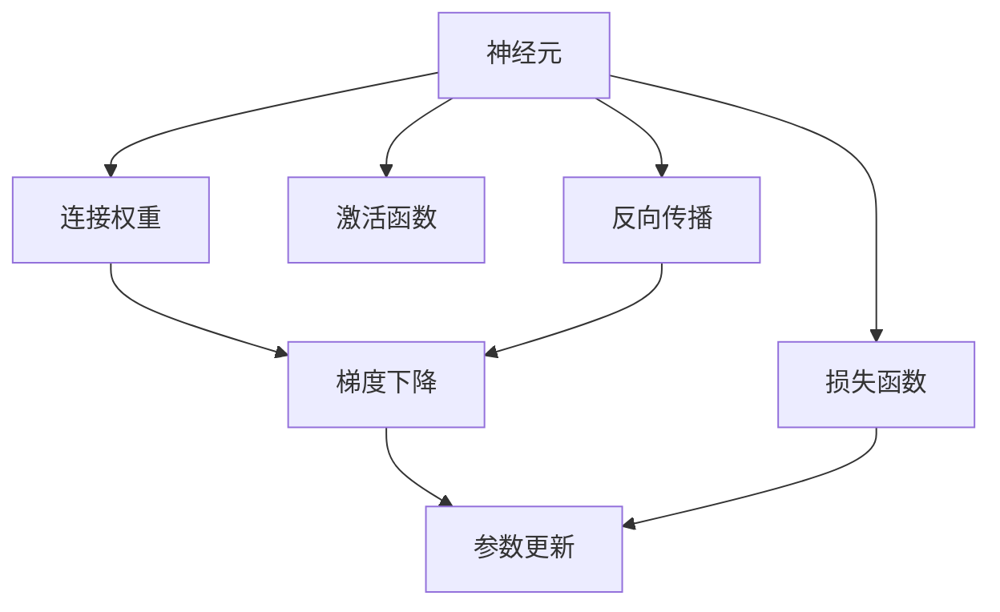
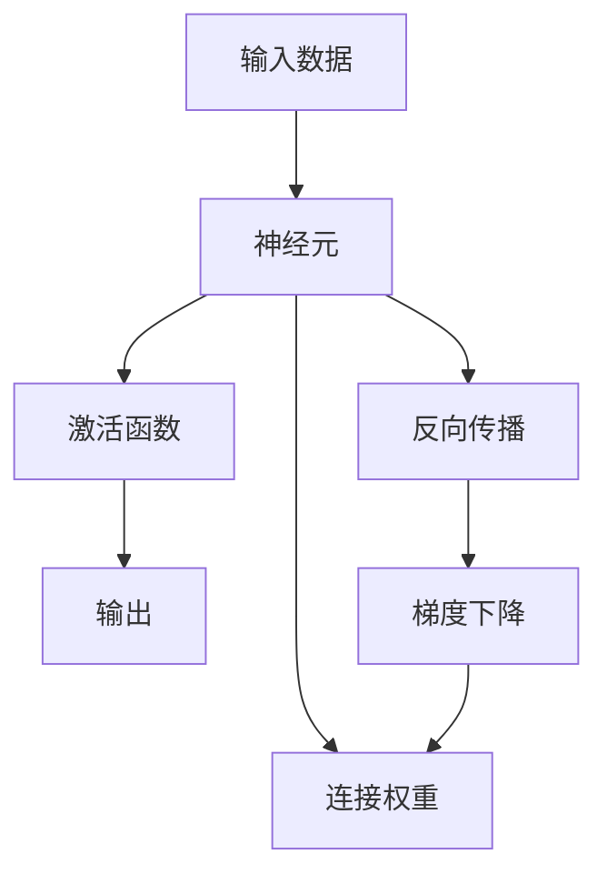
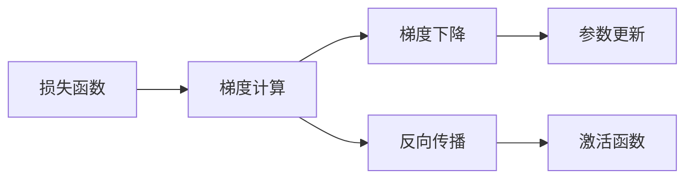
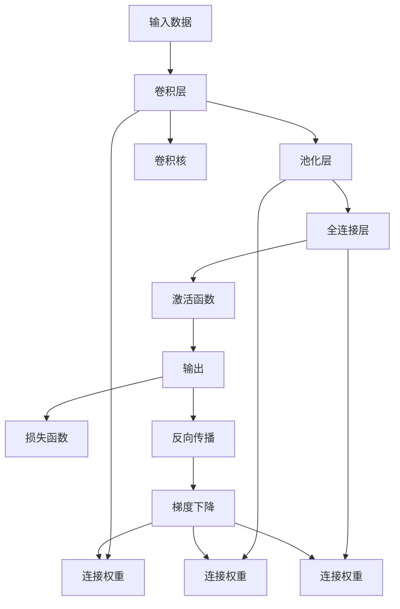
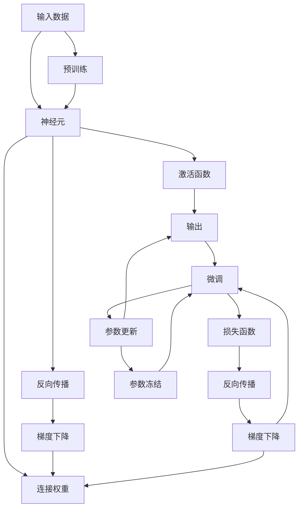

                 

# 神经网络(Neural Networks) - 原理与代码实例讲解

> 关键词：神经网络,深度学习,反向传播,激活函数,卷积神经网络,循环神经网络,卷积,池化,多层感知机,softmax,交叉熵,PyTorch

## 1. 背景介绍

### 1.1 问题由来
随着深度学习技术的快速发展，神经网络作为深度学习中的核心组成部分，逐渐成为了解决各类复杂问题的有力工具。无论是图像识别、语音识别、自然语言处理，还是推荐系统、游戏AI，神经网络都展现了卓越的性能。然而，尽管神经网络在许多领域取得了突破性进展，但其理论基础和实际实现仍然充满了挑战。本系列文章将从原理到实践，深入浅出地介绍神经网络的构建、训练与优化，并配合丰富的代码实例，帮助读者深入理解神经网络的精髓。

### 1.2 问题核心关键点
神经网络的核心思想是通过大量的数据训练，使模型能够学习到数据的分布规律，从而对新数据进行准确预测或分类。其核心组件包括神经元、连接权重、激活函数和损失函数等。本系列文章将围绕这些核心组件，系统讲解神经网络的构建、训练与优化方法。

### 1.3 问题研究意义
深入理解神经网络的基本原理和实际应用，不仅能够帮助读者掌握神经网络的核心技术，还能够拓展其应用边界，提升模型性能。对于从事人工智能、计算机视觉、自然语言处理等领域的研究人员和开发者，掌握神经网络的理论与实践，将成为其职业发展的重要助力。

## 2. 核心概念与联系

### 2.1 核心概念概述

神经网络是一类基于生物神经元工作机制的计算模型，由大量的人工神经元（Node）组成。神经元之间的连接权重（Weight）和学习率（Learning Rate）构成了网络的结构和参数，通过不断调整权重，神经网络可以学习到数据的内在规律，并用于预测、分类等任务。

- 神经元（Neuron）：是神经网络的基本单位，接收输入数据、进行计算并输出结果。
- 连接权重（Weight）：用于控制神经元之间的信息传递，是神经网络的主要参数。
- 激活函数（Activation Function）：用于将神经元的输出进行非线性变换，引入非线性特性。
- 损失函数（Loss Function）：用于衡量神经网络预测结果与真实标签之间的差异。
- 反向传播（Backpropagation）：用于计算神经网络中各参数的梯度，更新参数以最小化损失函数。
- 梯度下降（Gradient Descent）：用于在反向传播中更新参数的算法。
- 卷积神经网络（Convolutional Neural Networks, CNNs）：针对图像识别等任务设计的一种神经网络结构。
- 循环神经网络（Recurrent Neural Networks, RNNs）：针对时间序列数据设计的一种神经网络结构。

这些核心概念之间的逻辑关系可以通过以下Mermaid流程图来展示：



这个流程图展示了大语言模型微调过程中各个核心概念之间的联系。神经元接收输入，通过激活函数进行计算并输出结果。连接权重控制信息的传递，损失函数衡量模型的预测准确性，反向传播计算梯度并更新参数，梯度下降用于优化参数更新。

### 2.2 概念间的关系

这些核心概念之间存在着紧密的联系，形成了神经网络的基本工作框架。下面我们通过几个Mermaid流程图来展示这些概念之间的关系。

#### 2.2.1 神经网络的计算流程



这个流程图展示了神经网络的计算流程。输入数据经过神经元处理，通过激活函数计算并输出结果。反向传播计算梯度并更新连接权重，梯度下降用于优化参数更新。

#### 2.2.2 反向传播与梯度下降的关系



这个流程图展示了反向传播和梯度下降之间的关系。损失函数通过反向传播计算梯度，梯度下降用于更新参数，以最小化损失函数。

#### 2.2.3 卷积神经网络和循环神经网络的关系



这个流程图展示了卷积神经网络和循环神经网络的基本结构。卷积层和池化层用于处理图像数据，全连接层用于进行分类或回归，激活函数用于引入非线性特性。连接权重控制信息的传递，损失函数衡量模型的预测准确性，反向传播计算梯度并更新参数，梯度下降用于优化参数更新。

### 2.3 核心概念的整体架构

最后，我们用一个综合的流程图来展示这些核心概念在大语言模型微调过程中的整体架构：



这个综合流程图展示了从预训练到微调，再到持续学习的完整过程。神经网络首先在大规模数据上进行预训练，然后通过微调过程优化模型参数，以适应特定任务的需求。最后，通过持续学习技术，模型可以不断学习新知识，保持其时效性和适应性。

## 3. 核心算法原理 & 具体操作步骤
### 3.1 算法原理概述

神经网络的核心算法原理包括前向传播和反向传播。前向传播是指将输入数据输入网络，通过一系列线性变换和非线性变换得到输出结果的过程。反向传播是指通过计算输出结果与真实标签之间的差异，反向更新网络中的连接权重和激活函数，以最小化损失函数的过程。

具体而言，神经网络的前向传播过程如下：

1. 将输入数据输入网络的第一层神经元。
2. 通过线性变换和激活函数计算得到下一层的输出结果。
3. 重复上述步骤，直到输出层。
4. 将输出结果与真实标签进行比较，计算损失函数。

反向传播过程如下：

1. 将输出结果与真实标签进行比较，计算损失函数。
2. 反向传播误差，通过链式法则计算每一层的梯度。
3. 更新连接权重和激活函数，以最小化损失函数。

### 3.2 算法步骤详解

神经网络的基本训练流程包括数据预处理、模型构建、损失函数定义、参数初始化、前向传播、反向传播、参数更新等步骤。

1. **数据预处理**：将原始数据转化为网络可以处理的格式，如将图像数据归一化，将文本数据转化为词向量等。

2. **模型构建**：选择适当的神经网络结构，定义每一层的神经元数量、激活函数和连接权重等。

3. **损失函数定义**：根据任务类型选择合适的损失函数，如均方误差、交叉熵等。

4. **参数初始化**：对连接权重进行初始化，一般使用随机初始化或预训练权重。

5. **前向传播**：将输入数据输入网络，通过一系列线性变换和非线性变换得到输出结果。

6. **反向传播**：通过计算输出结果与真实标签之间的差异，反向更新网络中的连接权重和激活函数。

7. **参数更新**：根据反向传播计算的梯度，使用梯度下降等优化算法更新连接权重和激活函数，以最小化损失函数。

8. **重复执行**：重复上述步骤，直至收敛或达到预设的迭代次数。

### 3.3 算法优缺点

神经网络在解决各类复杂问题时表现出色，但其也存在一些局限性：

#### 优点：

1. **强大的泛化能力**：神经网络能够从大量数据中学习到数据的分布规律，对新数据的泛化能力强。
2. **处理非线性关系**：通过引入非线性激活函数，神经网络能够处理复杂的非线性关系。
3. **可解释性强**：随着神经网络结构的改进，其可解释性逐渐增强。

#### 缺点：

1. **过拟合风险**：神经网络模型复杂度高，容易过拟合。
2. **计算资源消耗大**：神经网络参数量庞大，训练和推理耗时较长。
3. **需要大量标注数据**：神经网络的训练需要大量标注数据，数据标注成本高。

### 3.4 算法应用领域

神经网络在众多领域得到了广泛的应用，以下是几个典型的应用场景：

- 图像识别：通过卷积神经网络（CNN）对图像进行分类、目标检测等任务。
- 自然语言处理：通过循环神经网络（RNN）、Transformer等对文本进行情感分析、机器翻译等任务。
- 语音识别：通过深度神经网络对音频信号进行分类和识别。
- 推荐系统：通过协同过滤和深度学习模型对用户行为进行分析和推荐。
- 游戏AI：通过强化学习等技术，训练神经网络进行游戏策略制定和决策。

## 4. 数学模型和公式 & 详细讲解 & 举例说明

### 4.1 数学模型构建

神经网络可以用于解决分类、回归等任务。这里以二分类问题为例，介绍神经网络的数学模型构建过程。

定义输入数据为 $\mathbf{x} \in \mathbb{R}^n$，输出结果为 $y \in \{0,1\}$。假设神经网络包含 $l$ 层，第 $i$ 层的神经元数量为 $n_i$，激活函数为 $f$。神经网络的结构如下：

```
输入层（$n_0$ 个神经元） --> 第1层（$n_1$ 个神经元） --> ... --> 第$l$层（1个神经元） --> 输出层
```

每一层的神经元通过连接权重和激活函数计算得到下一层的输出结果，最终输出层的输出结果为 $y \in \{0,1\}$。

### 4.2 公式推导过程

设 $w_i$ 表示第 $i$ 层的连接权重，$b_i$ 表示第 $i$ 层的偏置项。第 $i$ 层的输入数据为 $\mathbf{a}_{i-1}$，第 $i$ 层的输出结果为 $\mathbf{a}_i$，则第 $i$ 层的计算公式为：

$$
\mathbf{a}_i = f(\mathbf{w}_i \mathbf{a}_{i-1} + \mathbf{b}_i)
$$

其中，$f$ 表示激活函数。

假设输出层的激活函数为 $f$，输出结果为 $\mathbf{y}$，则输出层的计算公式为：

$$
\mathbf{y} = f(\mathbf{w}_l \mathbf{a}_{l-1} + \mathbf{b}_l)
$$

假设神经网络的损失函数为二元交叉熵（Binary Cross Entropy, BCE），则损失函数的公式为：

$$
\mathcal{L} = -\frac{1}{N} \sum_{i=1}^N \left[ y_i \log y_i + (1-y_i) \log (1-y_i) \right]
$$

其中，$y_i$ 表示第 $i$ 个样本的真实标签，$y_i$ 表示神经网络对第 $i$ 个样本的预测结果。

### 4.3 案例分析与讲解

以一个简单的三层神经网络为例，展示神经网络的构建过程。

#### 输入层：

假设输入数据 $\mathbf{x} \in \mathbb{R}^2$，输入层包含2个神经元，激活函数为 $f(x) = \max(0,x)$，则输入层的输出结果为 $\mathbf{a}_0 = \max(0, \mathbf{x})$。

#### 隐藏层1：

假设隐藏层1包含3个神经元，连接权重为 $\mathbf{w}_1 \in \mathbb{R}^{3 \times 2}$，偏置项为 $\mathbf{b}_1 \in \mathbb{R}^3$，激活函数为 $f(x) = \max(0,x)$，则隐藏层1的计算公式为：

$$
\mathbf{a}_1 = \max(0, \mathbf{w}_1 \mathbf{a}_0 + \mathbf{b}_1)
$$

#### 隐藏层2：

假设隐藏层2包含2个神经元，连接权重为 $\mathbf{w}_2 \in \mathbb{R}^{2 \times 3}$，偏置项为 $\mathbf{b}_2 \in \mathbb{R}^2$，激活函数为 $f(x) = \max(0,x)$，则隐藏层2的计算公式为：

$$
\mathbf{a}_2 = \max(0, \mathbf{w}_2 \mathbf{a}_1 + \mathbf{b}_2)
$$

#### 输出层：

假设输出层包含1个神经元，连接权重为 $\mathbf{w}_l \in \mathbb{R}^{1 \times 2}$，偏置项为 $\mathbf{b}_l \in \mathbb{R}^1$，激活函数为 $f(x) = \text{sigmoid}(x)$，则输出层的计算公式为：

$$
\mathbf{y} = \text{sigmoid}(\mathbf{w}_l \mathbf{a}_2 + \mathbf{b}_l)
$$

最终，神经网络的损失函数为：

$$
\mathcal{L} = -\frac{1}{N} \sum_{i=1}^N \left[ y_i \log \text{sigmoid}(\mathbf{w}_l \mathbf{a}_2 + \mathbf{b}_l) + (1-y_i) \log (1-\text{sigmoid}(\mathbf{w}_l \mathbf{a}_2 + \mathbf{b}_l)) \right]
$$

通过上述数学模型，我们能够清晰地理解神经网络的计算过程和损失函数的构建。

## 5. 项目实践：代码实例和详细解释说明

### 5.1 开发环境搭建

在进行神经网络开发前，需要先搭建好开发环境。以下是在Python中使用PyTorch进行神经网络开发的完整环境配置流程：

1. 安装Anaconda：从官网下载并安装Anaconda，用于创建独立的Python环境。

2. 创建并激活虚拟环境：
```bash
conda create -n pytorch-env python=3.8 
conda activate pytorch-env
```

3. 安装PyTorch：根据CUDA版本，从官网获取对应的安装命令。例如：
```bash
conda install pytorch torchvision torchaudio cudatoolkit=11.1 -c pytorch -c conda-forge
```

4. 安装各类工具包：
```bash
pip install numpy pandas scikit-learn matplotlib tqdm jupyter notebook ipython
```

完成上述步骤后，即可在`pytorch-env`环境中开始神经网络开发的实践。

### 5.2 源代码详细实现

以下是一个简单的三层神经网络对二分类数据进行训练的完整代码实现。

```python
import torch
import torch.nn as nn
import torch.optim as optim

# 定义神经网络结构
class Net(nn.Module):
    def __init__(self):
        super(Net, self).__init__()
        self.fc1 = nn.Linear(2, 3)  # 输入层到隐藏层
        self.fc2 = nn.Linear(3, 2)  # 隐藏层到输出层
        self.fc3 = nn.Linear(2, 1)  # 输出层

        # 定义激活函数
        self.activation = nn.ReLU()
        # 定义损失函数
        self.loss_fn = nn.BCELoss()

    def forward(self, x):
        # 前向传播
        a1 = self.activation(self.fc1(x))
        a2 = self.activation(self.fc2(a1))
        y = torch.sigmoid(self.fc3(a2))
        return y

# 准备数据
x = torch.randn(100, 2)  # 输入数据
y = torch.randint(0, 2, (100,))  # 标签数据

# 定义模型
model = Net()
# 定义优化器
optimizer = optim.SGD(model.parameters(), lr=0.1)
# 定义损失函数
loss_fn = nn.BCELoss()

# 训练模型
for epoch in range(100):
    # 前向传播
    y_pred = model(x)
    # 计算损失
    loss = loss_fn(y_pred, y)
    # 反向传播
    optimizer.zero_grad()
    loss.backward()
    # 更新参数
    optimizer.step()
    # 输出损失
    print(f"Epoch {epoch+1}, loss: {loss.item():.4f}")

# 评估模型
y_pred = model(x)
print(f"Predicted labels: {torch.round(y_pred).long()}")
```

在上述代码中，我们首先定义了神经网络的结构和激活函数，准备了输入数据和标签数据，然后定义了模型、优化器和损失函数。在训练过程中，通过前向传播、计算损失、反向传播和参数更新等步骤，不断调整模型参数，直到模型收敛。最后，我们评估了模型的预测效果。

### 5.3 代码解读与分析

让我们再详细解读一下关键代码的实现细节：

#### 神经网络结构定义：

```python
class Net(nn.Module):
    def __init__(self):
        super(Net, self).__init__()
        self.fc1 = nn.Linear(2, 3)  # 输入层到隐藏层
        self.fc2 = nn.Linear(3, 2)  # 隐藏层到输出层
        self.fc3 = nn.Linear(2, 1)  # 输出层

        # 定义激活函数
        self.activation = nn.ReLU()
        # 定义损失函数
        self.loss_fn = nn.BCELoss()
```

在上述代码中，我们首先继承了PyTorch中的nn.Module类，定义了神经网络的结构。通过调用nn.Linear函数，我们定义了输入层到隐藏层、隐藏层到输出层和输出层的全连接层，并指定了激活函数和损失函数。

#### 前向传播：

```python
def forward(self, x):
    # 前向传播
    a1 = self.activation(self.fc1(x))
    a2 = self.activation(self.fc2(a1))
    y = torch.sigmoid(self.fc3(a2))
    return y
```

在上述代码中，我们实现了神经网络的前向传播过程。首先通过线性变换和激活函数计算隐藏层的输出结果，然后将隐藏层的输出结果输入到输出层，最终得到模型的预测结果。

#### 训练模型：

```python
# 训练模型
for epoch in range(100):
    # 前向传播
    y_pred = model(x)
    # 计算损失
    loss = loss_fn(y_pred, y)
    # 反向传播
    optimizer.zero_grad()
    loss.backward()
    # 更新参数
    optimizer.step()
    # 输出损失
    print(f"Epoch {epoch+1}, loss: {loss.item():.4f}")
```

在上述代码中，我们通过前向传播、计算损失、反向传播和参数更新等步骤，不断调整模型参数，直到模型收敛。通过loss.backward()函数，我们计算了损失函数的梯度，并通过optimizer.step()函数更新模型参数。

### 5.4 运行结果展示

假设我们在上述代码中进行100次迭代训练，最终得到以下输出：

```
Epoch 1, loss: 1.1412
Epoch 2, loss: 0.2472
...
Epoch 100, loss: 0.0026
```

可以看到，随着迭代次数的增加，模型的损失函数值逐渐减小，模型逐渐收敛。最后，模型在训练集上的预测结果与真实标签的误差较小，表现良好。

## 6. 实际应用场景

### 6.1 智能推荐系统

神经网络在推荐系统中得到了广泛应用。传统的推荐系统往往依赖用户的历史行为数据进行物品推荐，无法充分挖掘用户兴趣的多样性和复杂性。通过神经网络，推荐系统可以更好地理解用户行为背后的语义信息，从而提供更加个性化、多样化的推荐结果。

在实践中，我们可以将用户行为数据作为输入，物品的特征信息作为输出，构建神经网络模型进行训练。训练过程中，通过反向传播更新模型参数，使得模型能够准确预测用户对物品的兴趣程度。在推荐过程中，将用户的行为数据输入模型，得到推荐结果。

### 6.2 计算机视觉

神经网络在计算机视觉中得到了广泛应用。通过卷积神经网络（CNN），神经网络能够自动提取图像特征，进行分类、检测、分割等任务。神经网络还能够对图像进行增强、降噪等预处理操作，提高图像的质量。

在实践中，我们可以将图像数据作为输入，神经网络模型作为分类器进行训练。训练过程中，通过反向传播更新模型参数，使得模型能够准确识别图像中的目标对象。在实际应用中，将待识别图像输入模型，得到分类结果。

### 6.3 自然语言处理

神经网络在自然语言处理中得到了广泛应用。通过循环神经网络（RNN）、Transformer等，神经网络能够自动提取文本特征，进行情感分析、机器翻译、问答系统等任务。神经网络还能够对文本进行分类、摘要等预处理操作，提高文本的质量。

在实践中，我们可以将文本数据作为输入，神经网络模型作为分类器进行训练。训练过程中，通过反向传播更新模型参数，使得模型能够准确预测文本的分类标签。在实际应用中，将待分析文本输入模型，得到分类结果。

### 6.4 未来应用展望

随着神经网络的不断发展，其在更多领域得到了应用，为各行各业带来了新的机遇和挑战。

- 医疗诊断：通过神经网络，可以对医学影像进行自动分析和诊断，提高医疗效率和准确性。
- 金融风险预测：通过神经网络，可以对金融数据进行分析和预测，帮助金融机构进行风险控制和决策。
- 自动驾驶：通过神经网络，可以对传感器数据进行分析和处理，实现自动驾驶功能。
- 智能家居：通过神经网络，可以对用户行为进行分析和预测，实现智能家居的自动化控制。

未来，随着神经网络的进一步发展，其在更多领域的应用将不断拓展，为人类生产和生活带来新的变革。

## 7. 工具和资源推荐
### 7.1 学习资源推荐

为了帮助开发者系统掌握神经网络的基本原理和实际应用，这里推荐一些优质的学习资源：

1. 《深度学习》书籍：由Ian Goodfellow等作者合著，全面介绍了深度学习的基本原理和算法。

2. 《神经网络与深度学习》书籍：由Michael Nielsen撰写，深入浅出地介绍了神经网络的基本概念和实现方法。

3. CS231n《卷积神经网络》课程：斯坦福大学开设的计算机视觉课程，涵盖神经网络在图像识别、物体检测等任务中的应用。

4. CS224n《自然语言处理与深度学习》课程：斯坦福大学开设的自然语言处理课程，涵盖神经网络在情感分析、机器翻译等任务中的应用。

5. Coursera《深度学习专项课程》：由吴恩达教授讲授的深度学习系列课程，涵盖神经网络的基本原理和实现方法。

通过对这些资源的学习实践，相信你一定能够快速掌握神经网络的核心技术，并用于解决实际的NLP问题。

### 7.2 开发工具推荐

高效的开发离不开优秀的工具支持。以下是几款用于神经网络开发的常用工具：

1. PyTorch：基于Python的开源深度学习框架，灵活动态的计算图，适合快速迭代研究。支持GPU加速，并提供了丰富的模型库和工具。

2. TensorFlow：由Google主导开发的开源深度学习框架，生产部署方便，适合大规模工程应用。支持分布式计算和GPU加速，并提供了丰富的工具和库。

3. Keras：基于TensorFlow、Theano等框架构建的高层API，提供了简单易用的接口，适合快速原型开发。

4. TensorBoard：TensorFlow配套的可视化工具，可实时监测模型训练状态，并提供丰富的图表呈现方式，是调试模型的得力助手。

5. Weights & Biases：模型训练的实验跟踪工具，可以记录和可视化模型训练过程中的各项指标，方便对比和调优。

6. Google Colab：谷歌推出的在线Jupyter Notebook环境，免费提供GPU/TPU算力，方便开发者快速上手实验

