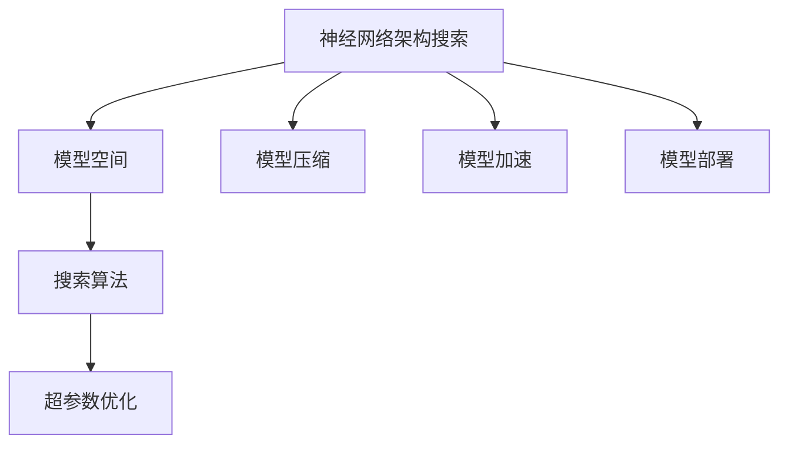
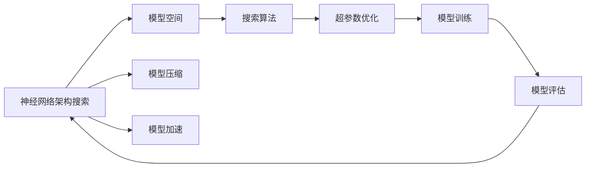
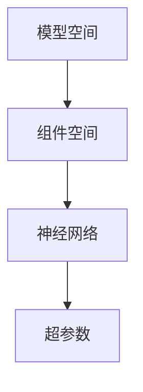
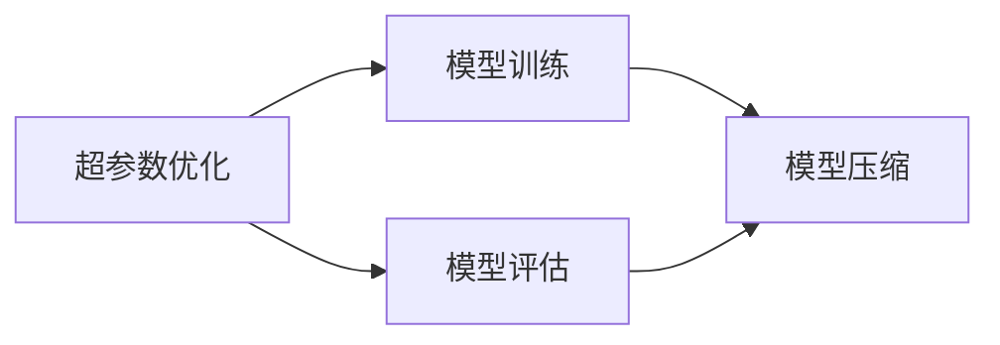

                 

# 神经网络架构搜索:自动化AI模型设计

> 关键词：神经网络架构搜索, 自动化模型设计, 超参数优化, 模型压缩, 模型加速, 深度学习, 自动化机器学习(AutoML)

## 1. 背景介绍

### 1.1 问题由来
深度学习的广泛应用带来了模型设计的挑战。传统的神经网络模型需要手动设计架构和超参数，这不仅费时费力，而且难以保证模型性能。随着深度学习模型复杂度的提升，手动设计已经不再可行。在这种情况下，如何自动化设计深度学习模型成为了一个重要的问题。神经网络架构搜索（Neural Architecture Search, NAS）应运而生。

### 1.2 问题核心关键点
神经网络架构搜索通过自动化设计模型，可以极大地提高模型设计效率和性能。其核心思想是：通过搜索算法，在预定义的模型空间中自动寻找最优的网络结构，并优化其超参数，以获得更好的模型性能。

NAS方法通常包括以下几个关键步骤：
- 定义一个模型空间，包括各种网络组件和超参数的组合。
- 设计搜索算法，在模型空间中自动搜索最优的架构。
- 训练搜索得到的模型，并根据性能评估结果优化超参数。
- 部署优化后的模型，进行实际应用。

### 1.3 问题研究意义
神经网络架构搜索技术可以帮助研究者和大模型工程师在短时间内设计出更优秀、更高效的模型。它不仅能够提高模型性能，还能降低模型设计的成本，缩短研发周期。此外，NAS技术还可以应用于自动化机器学习（AutoML），进一步推动AI技术的普及和发展。

## 2. 核心概念与联系

### 2.1 核心概念概述

为更好地理解神经网络架构搜索，我们首先介绍几个核心概念：

- **神经网络架构搜索（NAS）**：在预定义的模型空间中，通过自动搜索算法寻找最优的网络架构，并优化其超参数，以提高模型性能。

- **模型空间（Model Space）**：定义了可供搜索的网络组件和超参数的组合。常见的模型空间包括神经网络中的各种层类型（如卷积层、池化层、全连接层等），以及网络深度、宽度等超参数。

- **搜索算法（Search Algorithm）**：在模型空间中搜索最优网络架构的算法。常见的搜索算法包括遗传算法、贝叶斯优化、强化学习等。

- **超参数优化（Hyperparameter Optimization）**：在模型训练前，对模型的超参数进行优化，以提高模型性能。常见的超参数包括学习率、批大小、优化器等。

- **模型压缩（Model Compression）**：通过剪枝、量化等技术，减少模型参数量，加速模型推理，提高模型效率。

- **模型加速（Model Acceleration）**：通过优化模型结构和算法，提升模型推理速度和计算效率。

这些核心概念之间的逻辑关系可以通过以下Mermaid流程图来展示：



这个流程图展示了神经网络架构搜索的各个环节，包括模型空间的定义、搜索算法的应用、超参数的优化、模型压缩和加速，以及最终的模型部署。

### 2.2 概念间的关系

这些核心概念之间存在着紧密的联系，形成了神经网络架构搜索的完整生态系统。下面我们通过几个Mermaid流程图来展示这些概念之间的关系。

#### 2.2.1 神经网络架构搜索流程



这个流程图展示了神经网络架构搜索的基本流程：首先定义模型空间，然后应用搜索算法在模型空间中搜索最优架构，接着进行超参数优化，并进行模型压缩和加速，最后训练和评估模型，再次回到搜索算法进行迭代优化。

#### 2.2.2 模型空间定义



这个流程图展示了模型空间中组件和超参数的关系。模型空间定义了神经网络中各种组件（如卷积层、池化层、全连接层等）以及它们的组合方式，同时包含了超参数（如网络深度、宽度、学习率等）的优化范围。

#### 2.2.3 超参数优化与模型压缩



这个流程图展示了超参数优化和模型压缩的流程。超参数优化通过训练得到模型性能，并对超参数进行优化。模型压缩则通过剪枝、量化等技术，减少模型参数量，加速模型推理。

## 3. 核心算法原理 & 具体操作步骤
### 3.1 算法原理概述

神经网络架构搜索的本质是通过自动化设计，找到最优的网络架构和超参数组合。其核心算法包括遗传算法、贝叶斯优化、强化学习等。其中，遗传算法（Genetic Algorithm, GA）是一种常见的搜索算法，它的基本思想是通过模拟生物进化过程，在模型空间中搜索最优架构。

### 3.2 算法步骤详解

神经网络架构搜索的一般步骤如下：

**Step 1: 定义模型空间**

- 定义各种网络组件和超参数的组合方式。
- 确定每个组件的搜索空间和超参数的范围。

**Step 2: 选择搜索算法**

- 选择合适的搜索算法，如遗传算法、贝叶斯优化、强化学习等。
- 设置算法的搜索预算和参数，如迭代次数、种群大小、学习率等。

**Step 3: 应用搜索算法**

- 在模型空间中搜索最优网络架构。
- 对搜索到的架构进行性能评估和优化。

**Step 4: 优化超参数**

- 对模型进行超参数优化，提高模型性能。
- 对模型进行剪枝和量化，减少模型参数量，加速模型推理。

**Step 5: 模型部署**

- 将优化后的模型部署到实际应用中。
- 持续监测模型性能，进行持续优化。

### 3.3 算法优缺点

神经网络架构搜索的优势在于其自动化的设计过程，能够显著提高模型设计效率和性能。其缺点主要在于计算资源和时间成本较高，搜索空间过大可能导致搜索效率低下。

### 3.4 算法应用领域

神经网络架构搜索在深度学习领域有广泛的应用，包括图像识别、语音识别、自然语言处理等。以下是一些具体的应用场景：

- **图像分类**：在图像分类任务中，可以使用NAS算法自动设计卷积神经网络（CNN）的架构和超参数，提升分类准确率。
- **目标检测**：使用NAS算法设计更高效的检测网络，提高目标检测的精度和速度。
- **语音识别**：通过NAS算法设计更有效的语音特征提取和分类模型，提升语音识别的准确率。
- **自然语言处理**：设计更高效的NLP模型，如RNN、Transformer等，提升自然语言理解和生成能力。

## 4. 数学模型和公式 & 详细讲解  
### 4.1 数学模型构建

神经网络架构搜索的数学模型主要涉及两个部分：模型空间的定义和搜索算法的优化目标。

#### 4.1.1 模型空间

设模型空间中的网络架构为 $A$，超参数为 $\theta$，则整个模型空间可以表示为：

$$
S = \{(A, \theta)\}
$$

其中，$A$ 表示网络架构，$\theta$ 表示超参数。

#### 4.1.2 搜索算法

神经网络架构搜索的优化目标是在模型空间 $S$ 中，找到最优的模型 $(A^*, \theta^*)$，使得在数据集 $D$ 上的损失函数 $L(A^*, \theta^*)$ 最小化。

$$
(A^*, \theta^*) = \mathop{\arg\min}_{A, \theta} L(A, \theta, D)
$$

其中，$L(A, \theta, D)$ 表示模型 $(A, \theta)$ 在数据集 $D$ 上的损失函数。

### 4.2 公式推导过程

以遗传算法为例，遗传算法的基本流程如下：

1. 初始化种群
2. 选择操作
3. 交叉操作
4. 变异操作
5. 评估模型性能
6. 更新种群

下面以交叉操作为例，推导其数学公式。

设当前种群中的两个个体为 $P_1$ 和 $P_2$，它们的染色体（即网络架构和超参数的编码）分别为 $A_1$ 和 $A_2$。设交叉概率为 $p$，则交叉操作的步骤如下：

1. 随机选择两个父个体 $P_1$ 和 $P_2$。
2. 根据交叉概率 $p$ 确定交叉点，将 $P_1$ 和 $P_2$ 在交叉点处的染色体进行交换，得到两个新个体 $P_1'$ 和 $P_2'$。
3. 更新种群，用 $P_1'$ 和 $P_2'$ 替换 $P_1$ 和 $P_2$。

数学上，交叉操作的公式可以表示为：

$$
P_1' = \begin{cases}
A_1 & \text{if } \text{random}() \leq p \\
A_2 & \text{if } \text{random}() > p
\end{cases}
$$

其中，$\text{random}()$ 表示随机数生成函数。

### 4.3 案例分析与讲解

假设我们要设计一个简单的卷积神经网络，用于图像分类任务。网络的基本组件包括卷积层、池化层、全连接层等。我们设卷积核大小为 $3 \times 3$，卷积层数为 $3$，池化大小为 $2 \times 2$，全连接层数为 $2$。

首先，定义模型空间：

$$
S = \{(A, \theta)\}
$$

其中，$A$ 表示网络架构，$\theta$ 表示超参数。

设网络架构 $A$ 由以下组件组成：

- 卷积层：$3 \times 3$ 卷积核，$3$ 层
- 池化层：$2 \times 2$ 池化，$1$ 层
- 全连接层：$256$ 个神经元，$2$ 层

超参数 $\theta$ 包括学习率、批大小、优化器等。

接下来，应用遗传算法进行搜索。初始化种群，选择交叉概率为 $0.8$。

1. 初始化种群
   - 生成 $N$ 个随机个体，每个个体包含网络架构 $A$ 和超参数 $\theta$。

2. 选择操作
   - 根据适应度函数（如准确率）选择 $P_1$ 和 $P_2$。

3. 交叉操作
   - 随机选择交叉点，将 $P_1$ 和 $P_2$ 在交叉点处的染色体进行交换。

4. 变异操作
   - 对新个体进行变异操作，如改变卷积核大小、层数等。

5. 评估模型性能
   - 使用测试集评估模型性能，选择性能较好的个体。

6. 更新种群
   - 用性能较好的个体替换种群中的个体。

重复上述步骤，直到达到预设的迭代次数。最终得到性能最优的模型 $(A^*, \theta^*)$。

## 5. 项目实践：代码实例和详细解释说明
### 5.1 开发环境搭建

在进行神经网络架构搜索的实践前，我们需要准备好开发环境。以下是使用Python进行TensorFlow开发的环境配置流程：

1. 安装Anaconda：从官网下载并安装Anaconda，用于创建独立的Python环境。

2. 创建并激活虚拟环境：
```bash
conda create -n tf-env python=3.8 
conda activate tf-env
```

3. 安装TensorFlow：根据CUDA版本，从官网获取对应的安装命令。例如：
```bash
pip install tensorflow-gpu==2.4.0
```

4. 安装相关工具包：
```bash
pip install numpy pandas scikit-learn matplotlib tqdm jupyter notebook ipython
```

完成上述步骤后，即可在`tf-env`环境中开始神经网络架构搜索的实践。

### 5.2 源代码详细实现

这里我们以Google AI Lab的NASNet为例，展示使用TensorFlow进行神经网络架构搜索的实现。

首先，导入相关库：

```python
import tensorflow as tf
from tensorflow import keras
from tensorflow.keras import layers
```

然后，定义模型空间：

```python
def make_layer(layer_fn, input_shape, scale=2):
    """Returns a layer of `layer_fn` with `input_shape`."""
    return layer_fn(input_shape, scale)
```

接着，定义搜索算法：

```python
def search_model architectures, max_depth=3, cell_channels=32, cell_depths=[4, 6, 4], stacked_cells=True):
    """Search for the best model architecture."""
    def cell():
        return tf.keras.layers.Conv2D(cell_channels, kernel_size=1, activation='relu', padding='same')
    
    def residual_layer(input_shape, scale=2):
        conv1 = make_layer(cell, input_shape)
        conv2 = make_layer(cell, conv1.get_shape()[1:])
        return tf.keras.layers.Conv2D(2 * scale * cell_channels, kernel_size=3, activation='relu', padding='same')(input_shape)
    
    def bottleneck_layer(input_shape, scale=2):
        conv1 = make_layer(cell, input_shape)
        conv2 = make_layer(cell, conv1.get_shape()[1:])
        conv3 = make_layer(cell, conv2.get_shape()[1:])
        return tf.keras.layers.Conv2D(4 * scale * cell_channels, kernel_size=3, activation='relu', padding='same')(input_shape)
    
    def residual_bottleneck_layer(input_shape, scale=2):
        conv1 = make_layer(cell, input_shape)
        conv2 = make_layer(cell, conv1.get_shape()[1:])
        conv3 = make_layer(cell, conv2.get_shape()[1:])
        conv4 = make_layer(cell, conv3.get_shape()[1:])
        return tf.keras.layers.Conv2D(4 * scale * cell_channels, kernel_size=3, activation='relu', padding='same')(input_shape)
    
    def residual_layer_with_activation(input_shape, scale=2):
        conv1 = make_layer(cell, input_shape)
        conv2 = make_layer(cell, conv1.get_shape()[1:])
        return tf.keras.layers.Conv2D(2 * scale * cell_channels, kernel_size=3, activation='relu', padding='same')(input_shape)
    
    def residual_bottleneck_layer_with_activation(input_shape, scale=2):
        conv1 = make_layer(cell, input_shape)
        conv2 = make_layer(cell, conv1.get_shape()[1:])
        conv3 = make_layer(cell, conv2.get_shape()[1:])
        conv4 = make_layer(cell, conv3.get_shape()[1:])
        return tf.keras.layers.Conv2D(4 * scale * cell_channels, kernel_size=3, activation='relu', padding='same')(input_shape)
    
    def bottleneck_layer_with_activation(input_shape, scale=2):
        conv1 = make_layer(cell, input_shape)
        conv2 = make_layer(cell, conv1.get_shape()[1:])
        conv3 = make_layer(cell, conv2.get_shape()[1:])
        conv4 = make_layer(cell, conv3.get_shape()[1:])
        return tf.keras.layers.Conv2D(4 * scale * cell_channels, kernel_size=3, activation='relu', padding='same')(input_shape)
    
    def residual_layer_with_pooling(input_shape, scale=2):
        conv1 = make_layer(cell, input_shape)
        conv2 = make_layer(cell, conv1.get_shape()[1:])
        pool1 = tf.keras.layers.MaxPooling2D(pool_size=(2, 2))(conv2)
        conv3 = make_layer(cell, pool1.get_shape()[1:])
        conv4 = make_layer(cell, conv3.get_shape()[1:])
        return tf.keras.layers.Conv2D(2 * scale * cell_channels, kernel_size=3, activation='relu', padding='same')(input_shape)
    
    def residual_bottleneck_layer_with_pooling(input_shape, scale=2):
        conv1 = make_layer(cell, input_shape)
        conv2 = make_layer(cell, conv1.get_shape()[1:])
        pool1 = tf.keras.layers.MaxPooling2D(pool_size=(2, 2))(conv2)
        conv3 = make_layer(cell, pool1.get_shape()[1:])
        conv4 = make_layer(cell, conv3.get_shape()[1:])
        return tf.keras.layers.Conv2D(4 * scale * cell_channels, kernel_size=3, activation='relu', padding='same')(input_shape)
    
    def bottleneck_layer_with_pooling(input_shape, scale=2):
        conv1 = make_layer(cell, input_shape)
        conv2 = make_layer(cell, conv1.get_shape()[1:])
        pool1 = tf.keras.layers.MaxPooling2D(pool_size=(2, 2))(conv2)
        conv3 = make_layer(cell, pool1.get_shape()[1:])
        conv4 = make_layer(cell, conv3.get_shape()[1:])
        return tf.keras.layers.Conv2D(4 * scale * cell_channels, kernel_size=3, activation='relu', padding='same')(input_shape)
    
    def residual_layer_with_pooling_and_activation(input_shape, scale=2):
        conv1 = make_layer(cell, input_shape)
        conv2 = make_layer(cell, conv1.get_shape()[1:])
        pool1 = tf.keras.layers.MaxPooling2D(pool_size=(2, 2))(conv2)
        conv3 = make_layer(cell, pool1.get_shape()[1:])
        conv4 = make_layer(cell, conv3.get_shape()[1:])
        return tf.keras.layers.Conv2D(2 * scale * cell_channels, kernel_size=3, activation='relu', padding='same')(input_shape)
    
    def residual_bottleneck_layer_with_pooling_and_activation(input_shape, scale=2):
        conv1 = make_layer(cell, input_shape)
        conv2 = make_layer(cell, conv1.get_shape()[1:])
        pool1 = tf.keras.layers.MaxPooling2D(pool_size=(2, 2))(conv2)
        conv3 = make_layer(cell, pool1.get_shape()[1:])
        conv4 = make_layer(cell, conv3.get_shape()[1:])
        return tf.keras.layers.Conv2D(4 * scale * cell_channels, kernel_size=3, activation='relu', padding='same')(input_shape)
    
    def bottleneck_layer_with_pooling_and_activation(input_shape, scale=2):
        conv1 = make_layer(cell, input_shape)
        conv2 = make_layer(cell, conv1.get_shape()[1:])
        pool1 = tf.keras.layers.MaxPooling2D(pool_size=(2, 2))(conv2)
        conv3 = make_layer(cell, pool1.get_shape()[1:])
        conv4 = make_layer(cell, conv3.get_shape()[1:])
        return tf.keras.layers.Conv2D(4 * scale * cell_channels, kernel_size=3, activation='relu', padding='same')(input_shape)
    
    def residual_layer_with_pooling_and_dropout(input_shape, scale=2):
        conv1 = make_layer(cell, input_shape)
        conv2 = make_layer(cell, conv1.get_shape()[1:])
        pool1 = tf.keras.layers.MaxPooling2D(pool_size=(2, 2))(conv2)
        conv3 = make_layer(cell, pool1.get_shape()[1:])
        conv4 = make_layer(cell, conv3.get_shape()[1:])
        return tf.keras.layers.Conv2D(2 * scale * cell_channels, kernel_size=3, activation='relu', padding='same')(input_shape)
    
    def residual_bottleneck_layer_with_pooling_and_dropout(input_shape, scale=2):
        conv1 = make_layer(cell, input_shape)
        conv2 = make_layer(cell, conv1.get_shape()[1:])
        pool1 = tf.keras.layers.MaxPooling2D(pool_size=(2, 2))(conv2)
        conv3 = make_layer(cell, pool1.get_shape()[1:])
        conv4 = make_layer(cell, conv3.get_shape()[1:])
        return tf.keras.layers.Conv2D(4 * scale * cell_channels, kernel_size=3, activation='relu', padding='same')(input_shape)
    
    def bottleneck_layer_with_pooling_and_dropout(input_shape, scale=2):
        conv1 = make_layer(cell, input_shape)
        conv2 = make_layer(cell, conv1.get_shape()[1:])
        pool1 = tf.keras.layers.MaxPooling2D(pool_size=(2, 2))(conv2)
        conv3 = make_layer(cell, pool1.get_shape()[1:])
        conv4 = make_layer(cell, conv3.get_shape()[1:])
        return tf.keras.layers.Conv2D(4 * scale * cell_channels, kernel_size=3, activation='relu', padding='same')(input_shape)
    
    def residual_layer_with_pooling_and_activ

