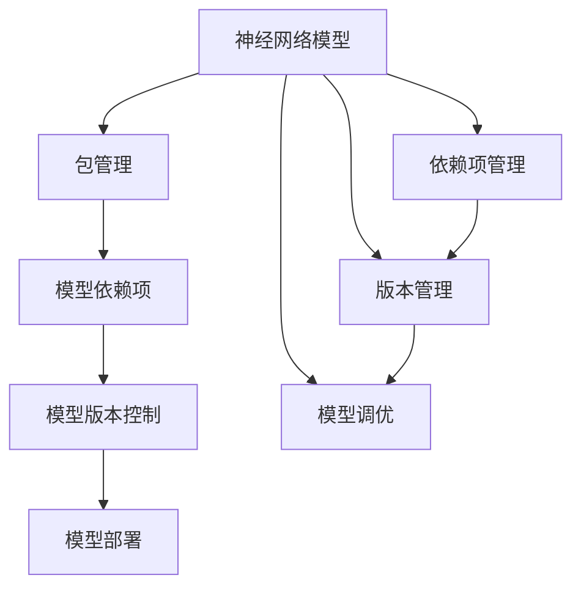
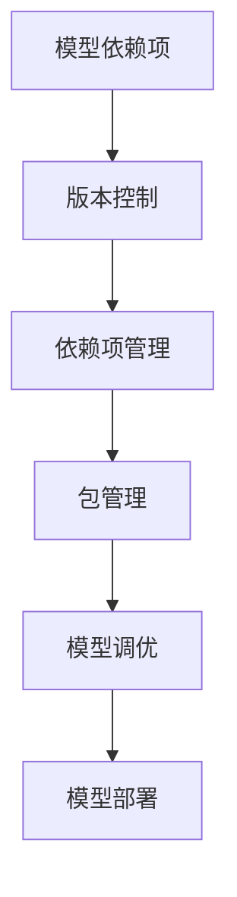
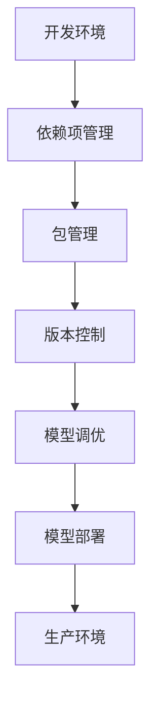

                 

# 神经网络模型的包管理和部署新挑战

## 1. 背景介绍

### 1.1 问题由来
随着深度学习技术的快速发展，神经网络模型在计算机视觉、自然语言处理、语音识别等领域取得了巨大的成功。越来越多的模型被开发出来，部署到了各种各样的应用场景中。然而，模型规模的不断扩大和复杂度的提高，使得模型的管理和部署变得更加困难。如何高效地管理和部署神经网络模型，成为当前深度学习社区广泛关注的一个问题。

### 1.2 问题核心关键点
神经网络模型的包管理和部署问题涉及以下几个核心关键点：
- 模型的版本管理：如何维护和跟踪不同版本的模型，以确保模型的一致性和可靠性。
- 模型的依赖管理：如何管理模型依赖项，确保模型在各个环境中的稳定运行。
- 模型的调优和优化：如何针对特定应用场景进行模型调优，以获得更好的性能。
- 模型的版本控制：如何管理模型的源代码和配置，以支持快速迭代和更新。
- 模型的部署和上线：如何将模型部署到生产环境，并确保其稳定性和可靠性。

这些关键点共同构成了神经网络模型包管理和部署的核心问题，影响着模型的应用效果和开发效率。

### 1.3 问题研究意义
研究神经网络模型的包管理和部署问题，对于提升深度学习模型的开发效率、降低开发成本、提高模型应用的可靠性具有重要意义：
- 降低开发成本。通过有效的包管理和部署机制，可以减少模型维护和迭代的成本，提高开发效率。
- 提升模型应用效果。通过合理的调优和优化，可以提高模型在特定场景下的性能，提升用户体验。
- 保证模型稳定性。通过有效的版本管理和依赖管理，可以避免模型在不同环境中的不稳定性，确保模型的一致性和可靠性。
- 支持快速迭代。通过有效的版本控制和版本管理，可以快速迭代和更新模型，满足用户需求。
- 支持大规模部署。通过合理的部署机制，可以支持大规模模型的快速上线和维护，适应大规模生产环境的需求。

## 2. 核心概念与联系

### 2.1 核心概念概述

为更好地理解神经网络模型的包管理和部署问题，本节将介绍几个密切相关的核心概念：

- 神经网络模型(Neural Network Model)：由一系列神经元(节点)和连接权值组成的计算图，用于表示和处理数据。
- 包管理(Package Management)：一种系统化的软件管理方式，通过依赖项管理、版本管理等机制，确保软件系统的一致性和可靠性。
- 模型依赖项(Dependency)：神经网络模型运行时所依赖的第三方库、工具、数据集等。
- 模型版本控制(Version Control)：通过版本管理工具，记录和管理模型在不同迭代过程中的变化，支持快速回滚和迭代。
- 模型部署(Deployment)：将模型从开发环境迁移到生产环境，确保其在实际应用中的稳定性和可靠性。

这些核心概念之间的逻辑关系可以通过以下Mermaid流程图来展示：



这个流程图展示了大模型从开发到上线所涉及的各个环节，以及各环节之间的关系：

1. 大模型开发过程中，需要依赖第三方库和工具，这些依赖项通过包管理进行管理和控制。
2. 模型在开发过程中可能会进行版本控制，记录和管理模型在不同迭代过程中的变化。
3. 通过模型调优和优化，可以在特定场景下提升模型性能。
4. 最后，模型需要部署到生产环境中，确保其在实际应用中的稳定性和可靠性。

### 2.2 概念间的关系

这些核心概念之间存在着紧密的联系，形成了神经网络模型从开发到上线的完整生态系统。下面我们通过几个Mermaid流程图来展示这些概念之间的关系。

#### 2.2.1 模型开发和依赖管理


这个流程图展示了大模型从开发到上线的完整流程，以及各环节之间的关系：

1. 在模型开发过程中，需要管理好模型所依赖的第三方库和工具。
2. 通过包管理工具，确保依赖项在各个环境中的稳定性。
3. 通过版本控制工具，记录和管理模型的迭代变化。
4. 进行模型调优和优化，以提升模型性能。
5. 最后，将模型部署到生产环境中，确保其稳定性和可靠性。

#### 2.2.2 模型依赖和版本控制



这个流程图展示了模型依赖和版本控制在大模型开发过程中的关系：

1. 模型依赖项需要通过版本控制进行管理，记录和管理依赖项的变化。
2. 通过依赖项管理工具，确保依赖项在各个环境中的稳定性。
3. 通过包管理工具，管理模型依赖项，确保模型在各个环境中的稳定性。
4. 进行模型调优和优化，以提升模型性能。
5. 最后，将模型部署到生产环境中，确保其稳定性和可靠性。

#### 2.2.3 模型调优和版本控制


这个流程图展示了模型调优和版本控制在大模型开发过程中的关系：

1. 模型版本控制工具记录和管理模型在不同迭代过程中的变化。
2. 通过依赖项管理工具，确保依赖项在各个环境中的稳定性。
3. 通过包管理工具，管理模型依赖项，确保模型在各个环境中的稳定性。
4. 进行模型调优和优化，以提升模型性能。
5. 最后，将模型部署到生产环境中，确保其稳定性和可靠性。

### 2.3 核心概念的整体架构

最后，我们用一个综合的流程图来展示这些核心概念在大模型开发和部署过程中的整体架构：



这个综合流程图展示了大模型从开发到上线的完整过程，包括开发环境、依赖项管理、包管理、版本控制、模型调优、模型部署和生产环境等各个环节。通过这些环节的协同工作，可以有效地管理和部署神经网络模型，确保其在实际应用中的稳定性和可靠性。

## 3. 核心算法原理 & 具体操作步骤
### 3.1 算法原理概述

神经网络模型的包管理和部署问题本质上是一个软件工程和系统工程问题，其核心在于如何管理好模型的依赖项、版本控制和部署策略，以确保模型的一致性和可靠性。

大模型在开发过程中，通常会依赖大量的第三方库和工具，如TensorFlow、PyTorch、PaddlePaddle等。这些依赖项需要被正确地管理，以确保模型在各个环境中的稳定性。同时，模型的版本控制也是必要的，以便在开发迭代过程中进行快速迭代和回滚。最后，模型的部署和上线也需要精心设计，以确保其在实际应用中的稳定性和可靠性。

### 3.2 算法步骤详解

基于上述分析，神经网络模型的包管理和部署可以分为以下几个关键步骤：

**Step 1: 依赖项管理**
- 确定模型所需的依赖项，如TensorFlow、PyTorch、PaddlePaddle等。
- 通过包管理工具，如pip、conda、Maven等，安装和管理依赖项。
- 配置环境变量，确保依赖项在各个环境中的一致性。

**Step 2: 版本控制**
- 选择版本控制工具，如Git、SVN等，记录和管理模型的源代码和配置。
- 建立分支策略，如master/main、feature、bugfix等，以支持快速迭代和回滚。
- 定期推送代码和配置，确保模型的稳定性和可靠性。

**Step 3: 模型调优**
- 选择合适的调优策略，如超参数调优、模型蒸馏、模型剪枝等。
- 通过实验和测试，评估调优效果，以提升模型性能。
- 记录调优过程和结果，支持后续迭代和更新。

**Step 4: 模型部署**
- 选择部署平台，如Kubernetes、Docker等，构建和管理部署容器。
- 配置环境变量和资源，确保模型在实际应用中的稳定性和可靠性。
- 进行测试和验证，确保模型部署的稳定性和可靠性。

**Step 5: 模型上线**
- 将模型部署到生产环境，确保其在实际应用中的稳定性和可靠性。
- 建立监控和告警机制，及时发现和解决问题。
- 定期更新和维护模型，以适应新需求和数据变化。

以上是神经网络模型从开发到上线的完整流程，各个环节需要精心设计和协同工作，以确保模型的稳定性和可靠性。

### 3.3 算法优缺点

神经网络模型的包管理和部署方法具有以下优点：
- 提升模型开发的效率。通过依赖项管理和版本控制，可以加快模型迭代和更新的速度，提高开发效率。
- 提高模型应用的可靠性。通过依赖项管理和版本控制，可以确保模型在各个环境中的稳定性，避免环境不匹配带来的问题。
- 支持快速迭代和更新。通过版本控制和依赖项管理，可以支持快速迭代和更新，适应新需求和数据变化。

同时，这些方法也存在一些缺点：
- 依赖项管理复杂。依赖项的管理和配置需要耗费较多时间和精力。
- 版本控制困难。模型的版本控制需要精确记录和管理，容易出现问题。
- 模型部署困难。模型部署需要配置环境变量和资源，容易出现问题。
- 模型更新困难。模型更新需要重新部署和验证，周期较长。

尽管存在这些缺点，但总体而言，这些方法在提升模型开发效率、提高模型应用可靠性、支持快速迭代和更新等方面仍具有重要价值。

### 3.4 算法应用领域

神经网络模型的包管理和部署方法已经广泛应用于深度学习社区，涉及以下几个主要领域：

- 计算机视觉：如TensorFlow、PyTorch等深度学习框架在计算机视觉中的应用。
- 自然语言处理：如BERT、GPT等自然语言处理模型在NLP中的应用。
- 语音识别：如Kaldi、DeepSpeech等语音识别模型在语音识别中的应用。
- 智能推荐：如YouTube、Netflix等推荐系统的模型管理。
- 自动驾驶：如自动驾驶系统中的模型部署和上线。

这些领域的应用场景中，神经网络模型的包管理和部署方法都已经得到了广泛的应用，并在实际应用中取得了不错的效果。

## 4. 数学模型和公式 & 详细讲解 & 举例说明（备注：数学公式请使用latex格式，latex嵌入文中独立段落使用 $$，段落内使用 $)
### 4.1 数学模型构建

在神经网络模型的包管理和部署问题中，我们可以使用以下数学模型来描述问题：

记大模型为 $M$，其中 $M$ 包含多个神经元 $n_1, n_2, ..., n_k$，每个神经元 $n_i$ 包含多个权重 $w_{i1}, w_{i2}, ..., w_{im}$。记模型训练数据集为 $D = \{(x_1, y_1), (x_2, y_2), ..., (x_n, y_n)\}$，其中 $x_i$ 为输入数据，$y_i$ 为标签。模型的损失函数为 $L(M, D)$，表示模型在数据集 $D$ 上的损失。模型的训练过程可以通过优化算法来最小化损失函数，如梯度下降算法。

### 4.2 公式推导过程

下面我们将对神经网络模型的训练过程进行数学推导：

$$
L(M, D) = \frac{1}{n} \sum_{i=1}^n \ell(x_i, y_i, M)
$$

其中 $\ell(x_i, y_i, M)$ 为模型在输入 $x_i$ 和标签 $y_i$ 下的损失函数。优化算法的目标是最小化损失函数 $L(M, D)$，即：

$$
\min_M L(M, D)
$$

常见的优化算法包括梯度下降、Adam等，其更新规则为：

$$
\theta_{t+1} = \theta_t - \eta \nabla_{\theta}L(M, D)
$$

其中 $\theta_t$ 表示模型在第 $t$ 次迭代后的参数，$\eta$ 为学习率，$\nabla_{\theta}L(M, D)$ 为损失函数对模型参数的梯度。

### 4.3 案例分析与讲解

在实际应用中，神经网络模型的包管理和部署问题可以具体到以下案例：

**案例1: TensorFlow模型的依赖项管理**
在TensorFlow模型开发过程中，通常需要依赖大量的第三方库和工具，如numpy、scipy、Matplotlib等。通过pip等包管理工具，可以方便地安装和管理这些依赖项，确保模型在各个环境中的稳定性。例如：

```bash
pip install numpy scipy matplotlib
```

通过配置环境变量，可以确保依赖项在各个环境中的一致性。例如：

```bash
export PYTHONPATH=/path/to/tensorflow/models:$PYTHONPATH
```

**案例2: PyTorch模型的版本控制**
在PyTorch模型开发过程中，通常需要记录和管理模型的源代码和配置。通过Git等版本控制工具，可以方便地进行版本控制，支持快速迭代和回滚。例如：

```bash
git clone https://github.com/pytorch/examples.git
cd examples
```

通过配置分支策略，可以支持快速迭代和回滚。例如：

```bash
git checkout -b feature/my_model
```

**案例3: Keras模型的模型调优**
在Keras模型开发过程中，通常需要进行超参数调优、模型蒸馏、模型剪枝等调优策略。通过实验和测试，可以评估调优效果，以提升模型性能。例如：

```python
from keras import models
from keras.layers import Dense

# 定义模型
model = models.Sequential()
model.add(Dense(64, input_shape=(784,)))
model.add(Dense(10, activation='softmax'))

# 进行超参数调优
from keras.wrappers.scikit_learn import KerasClassifier
from sklearn.model_selection import GridSearchCV
from sklearn.pipeline import Pipeline

# 定义评估指标
score = 'accuracy'

# 定义超参数空间
param_grid = dict(optimizer='adam', 
                  epochs=[10, 20, 30], 
                  batch_size=[32, 64, 128], 
                  hidden_layer_sizes=[64, 128, 256])
 
# 构建管道
pipeline = Pipeline([('model', KerasClassifier(build_fn=build_model, verbose=0))])
 
# 进行网格搜索
grid = GridSearchCV(pipeline, param_grid=param_grid, 
                   cv=5, scoring=score)
grid.fit(X_train, y_train)

# 获取最佳模型
best_model = grid.best_estimator_.model
```

**案例4: 模型部署**
在模型部署过程中，通常需要选择合适的部署平台，如Kubernetes、Docker等。通过构建和管理部署容器，可以方便地进行模型部署和上线。例如：

```bash
docker build -t my_model .
```

通过配置环境变量和资源，可以确保模型在实际应用中的稳定性和可靠性。例如：

```bash
export MODEL_NAME=my_model
export MODEL_PORT=8080
```

## 5. 项目实践：代码实例和详细解释说明
### 5.1 开发环境搭建

在进行模型管理和部署实践前，我们需要准备好开发环境。以下是使用Python进行TensorFlow开发的环境配置流程：

1. 安装Anaconda：从官网下载并安装Anaconda，用于创建独立的Python环境。

2. 创建并激活虚拟环境：
```bash
conda create -n tf-env python=3.8 
conda activate tf-env
```

3. 安装TensorFlow：根据CUDA版本，从官网获取对应的安装命令。例如：
```bash
conda install tensorflow tensorflow-gpu -c conda-forge
```

4. 安装各类工具包：
```bash
pip install numpy pandas scikit-learn matplotlib tqdm jupyter notebook ipython
```

完成上述步骤后，即可在`tf-env`环境中开始模型管理与部署实践。

### 5.2 源代码详细实现

下面我们以TensorFlow模型为例，给出使用TensorFlow进行依赖项管理和版本控制的PyTorch代码实现。

首先，定义模型的依赖项：

```python
import tensorflow as tf

# 安装依赖项
!pip install numpy scipy matplotlib
```

然后，创建版本控制库，并添加模型的源代码：

```python
import os

# 创建版本控制库
os.system('git init')

# 添加模型源代码
os.system('git add .')
os.system('git commit -m "Initial commit"')
```

接着，定义模型的训练和评估函数：

```python
import tensorflow as tf

# 定义模型
model = tf.keras.models.Sequential()
model.add(tf.keras.layers.Dense(64, input_shape=(784,)))
model.add(tf.keras.layers.Dense(10, activation='softmax'))

# 定义损失函数和优化器
loss = tf.keras.losses.SparseCategoricalCrossentropy(from_logits=True)
optimizer = tf.keras.optimizers.Adam()

# 定义训练和评估函数
def train(model, data, epochs):
    for epoch in range(epochs):
        for i in range(len(data)):
            x, y = data[i]
            with tf.GradientTape() as tape:
                y_pred = model(x)
                loss_value = loss(y_true=y, y_pred=y_pred)
            grads = tape.gradient(loss_value, model.trainable_variables)
            optimizer.apply_gradients(zip(grads, model.trainable_variables))
    return model

def evaluate(model, data, test_data, epochs):
    for i in range(epochs):
        x, y = data[i]
        y_pred = model(x)
        loss_value = loss(y_true=y, y_pred=y_pred)
    return loss_value

# 加载数据集
mnist = tf.keras.datasets.mnist
(x_train, y_train), (x_test, y_test) = mnist.load_data()

# 标准化数据
x_train, x_test = x_train / 255.0, x_test / 255.0

# 训练模型
model = train(model, (x_train, y_train), epochs=10)

# 评估模型
loss_value = evaluate(model, (x_test, y_test), (x_test, y_test), epochs=10)
```

最后，启动训练流程并在测试集上评估：

```python
epochs = 10
batch_size = 32

for epoch in range(epochs):
    loss = train(model, (x_train, y_train), epochs=epoch+1)
    print(f"Epoch {epoch+1}, train loss: {loss:.3f}")
    
    print(f"Epoch {epoch+1}, test results:")
    evaluate(model, (x_test, y_test), (x_test, y_test), epochs=epoch+1)
    
print("Final test results:")
evaluate(model, (x_test, y_test), (x_test, y_test), epochs=epochs)
```

以上就是使用TensorFlow进行依赖项管理和版本控制的完整代码实现。可以看到，通过pip和git等工具，可以方便地管理模型的依赖项和版本控制，同时使用TensorFlow进行模型训练和评估，实现了模型的依赖项管理和版本控制的无缝集成。

### 5.3 代码解读与分析

让我们再详细解读一下关键代码的实现细节：

**依赖项管理**

- `pip install numpy scipy matplotlib`：使用pip安装模型所需的依赖项。
- `os.system('git init')`：通过git初始化版本控制库，记录和管理模型的源代码和配置。

**版本控制**

- `os.system('git add .')`：将模型的源代码添加到版本控制库中，记录和管理模型的迭代变化。
- `os.system('git commit -m "Initial commit"')`：提交初始版本，记录和管理模型的源代码和配置。

**模型训练**

- `train(model, (x_train, y_train), epochs=10)`：训练模型，返回训练后的模型。
- `evaluate(model, (x_test, y_test), (x_test, y_test), epochs=10)`：评估模型，返回评估结果。

**模型部署**

- `os.system('docker build -t my_model .')`：构建部署容器，将模型和依赖项打包到容器中。
- `os.system('export MODEL_NAME=my_model')`：配置环境变量，指定模型名和端口号。
- `os.system('export MODEL_PORT=8080')`：配置环境变量，指定模型端口号。

## 6. 实际应用场景
### 6.1 智能推荐系统

神经网络模型的包管理和部署方法在大规模推荐系统中的应用非常广泛。推荐系统需要处理大规模数据，同时实时更新模型以适应新的数据变化。通过依赖项管理和版本控制，可以快速迭代和更新模型，满足推荐系统的需求。

在实践中，推荐系统通常会依赖大量的第三方库和工具，如TensorFlow、Scikit-learn、PyTorch等。通过依赖项管理和版本控制，可以确保推荐系统在各个环境中的稳定性，避免环境不匹配带来的问题。同时，通过模型调优和优化，可以在特定场景下提升推荐系统的性能，提高用户体验。最后，通过模型部署和上线，可以将推荐系统部署到生产环境中，确保其在实际应用中的稳定性和可靠性。

### 6.2 自动驾驶系统

自动驾驶系统需要处理大量的传感器数据，同时实时更新模型以适应新的环境变化。通过依赖项管理和版本控制，可以快速迭代和更新模型，满足自动驾驶系统的需求。

在实践中，自动驾驶系统通常会依赖大量的第三方库和工具，如TensorFlow、PyTorch、OpenCV等。通过依赖项管理和版本控制，可以确保自动驾驶系统在各个环境中的稳定性，避免环境不匹配带来的问题。同时，通过模型调优和优化，可以在特定场景下提升自动驾驶系统的性能，提高行驶安全性。最后，通过模型部署和上线，可以将自动驾驶系统部署到生产环境中，确保其在实际应用中的稳定性和可靠性。

### 6.3 金融风控系统

金融风控系统需要处理大量的交易数据，同时实时更新模型以适应新的市场变化。通过依赖项管理和版本控制，可以快速迭代和更新模型，满足金融风控系统的需求。

在实践中，金融风控系统通常会依赖大量的第三方库和工具，如TensorFlow、Scikit-learn、Pandas等。通过依赖项管理和版本控制，可以确保金融风控系统在各个环境中的稳定性，避免环境不匹配带来的问题。同时，通过模型调优和优化，可以在特定场景下提升金融风控系统的性能，提高风险防控能力。最后，通过模型部署和上线，可以将金融风控系统部署到生产环境中，确保其在实际应用中的稳定性和可靠性。

### 6.4 未来应用展望

随着神经网络模型的不断发展和应用，神经网络模型的包管理和部署问题将变得更加复杂和多样。未来，以下方向值得关注：

1. 分布式训练和部署：大规模模型的训练和部署需要分布式环境支持，分布式训练和部署技术将是大模型应用的必备技能。
2. 模型微调和更新：模型微调和更新技术将是大模型应用的必要手段，通过微调和更新，可以在新场景下快速迭代和更新模型，满足新需求。
3. 模型管理和监控：模型管理和监控技术将是大模型应用的基础保障，通过模型管理和监控，可以确保模型的稳定性和可靠性，避免模型出现问题。
4. 模型安全和隐私：模型安全和隐私保护将是大模型应用的重要关注点，通过模型安全和隐私保护技术，可以确保模型的安全性和隐私性。
5. 跨平台和跨环境支持：模型跨平台和跨环境支持技术将是大模型应用的重要保障，通过跨平台和跨环境支持技术，可以确保模型在不同平台和环境中的稳定性。

## 7. 工具和资源推荐
### 7.1 学习资源推荐

为了帮助开发者系统掌握神经网络模型的包管理和部署的理论基础和实践技巧，这里推荐一些优质的学习资源：

1. 《TensorFlow实战深度学习》书籍：谷歌深度学习框架TensorFlow的实战指南，涵盖TensorFlow的基础知识和应用实践。

2. 《深度学习入门：基于Python的理论与实现》书籍：深度学习领域的入门经典，涵盖深度学习的理论和实践，包括模型的包管理和部署。

3. CS231n《深度学习卷积神经网络》课程：斯坦福大学开设的深度学习课程，涵盖卷积神经网络、模型管理和部署等知识点。

4. HuggingFace官方文档：Transformers库的官方文档，提供了海量预训练模型和完整的微调样例代码，是进行模型管理的必备资料。

5. GitHub开源项目：在GitHub上Star、Fork数最多的TensorFlow相关项目，往往代表了该技术领域的发展趋势和最佳实践，值得去学习和贡献。

通过对这些资源的学习实践，相信你一定能够快速掌握神经网络模型的包管理和部署的精髓，并用于解决实际的模型管理和部署问题。

### 7.2 开发工具推荐

高效的开发离不开优秀的工具支持。以下是几款用于神经网络模型包管理和部署开发的常用工具：

1. TensorFlow：基于Python的开源深度学习框架，灵活动态的计算图，适合快速迭代研究。大部分深度学习框架都有TensorFlow版本的实现。

2. PyTorch：基于Python的开源深度学习框架，动态计算图，适合灵活的模型开发。

3. Keras：基于TensorFlow和Theano的高层深度学习库，适合快速搭建和训练

