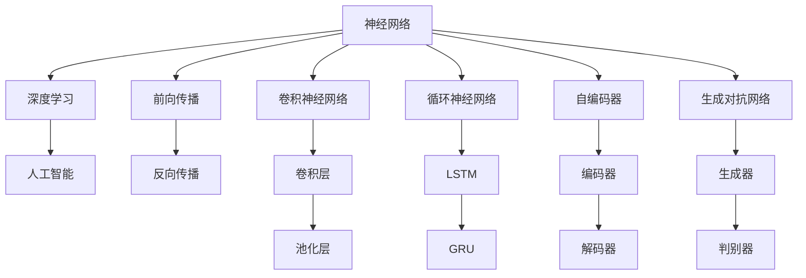
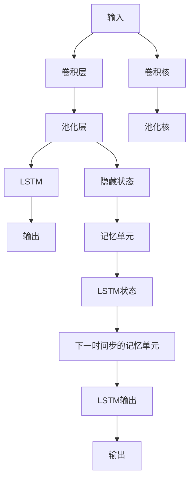
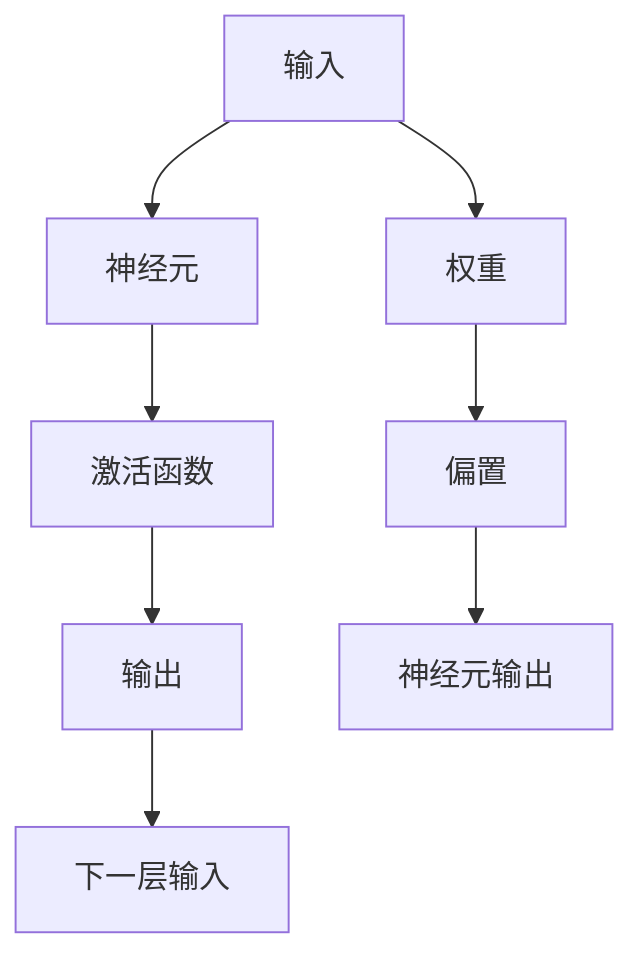
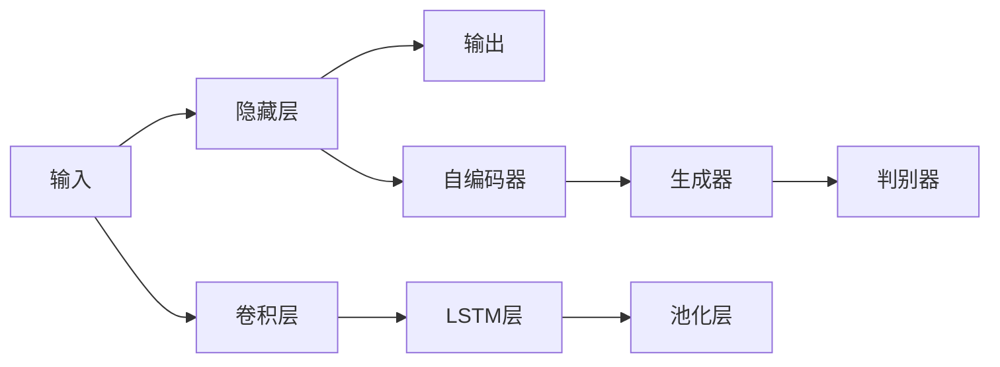
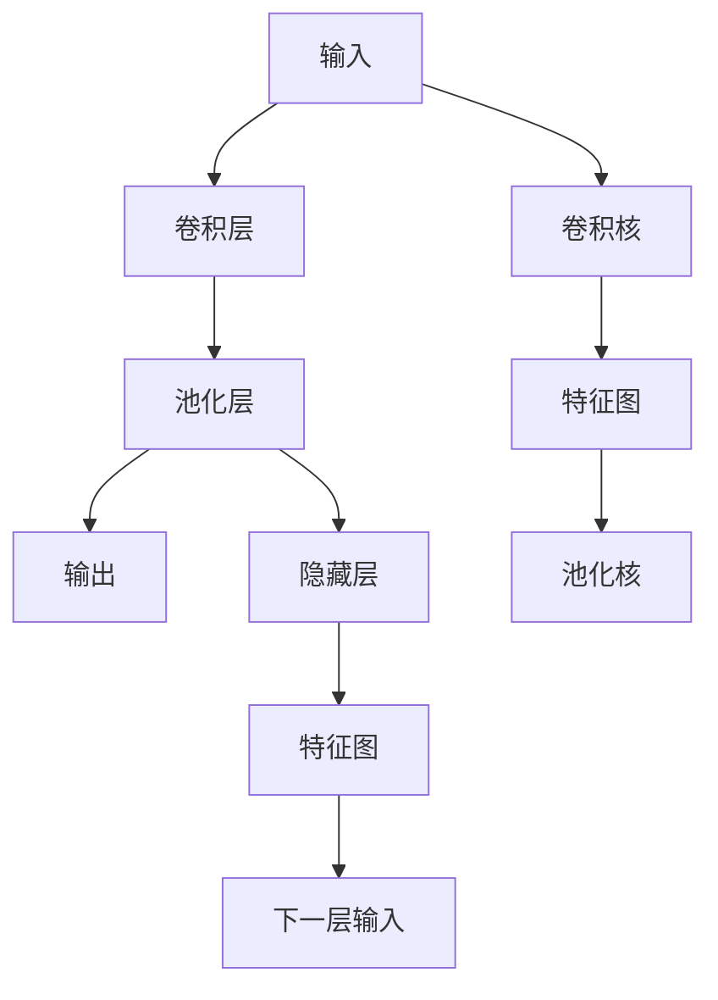
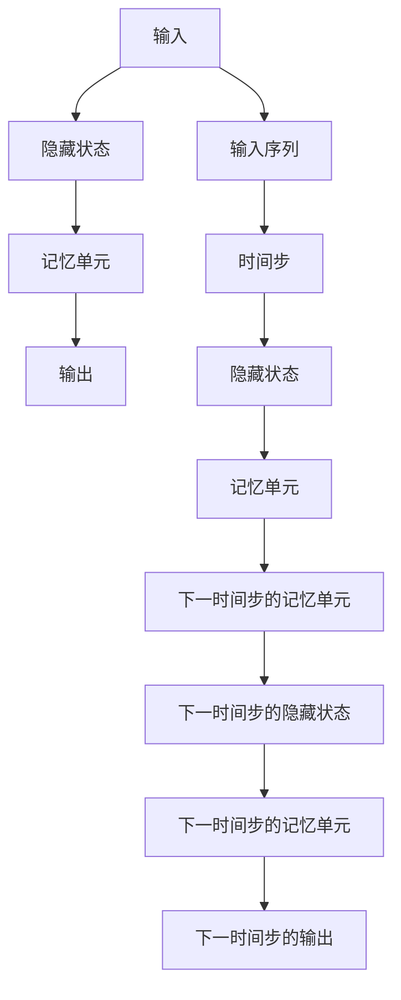
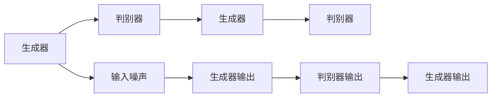

                 

# 神经网络：人工智能的基石

## 1. 背景介绍

### 1.1 问题由来
人工智能(AI)作为21世纪最令人瞩目的科技革命，其核心在于模拟人类的认知与决策能力。神经网络(Neural Networks, NNs)作为AI的重要分支，在模式识别、图像处理、语音识别、自然语言处理、预测分析等多个领域都取得了显著成就。理解神经网络的原理与技术，是深入学习人工智能的关键。

### 1.2 问题核心关键点
本文旨在深入探讨神经网络的基本原理与核心概念，从数学模型、算法实现到应用场景，详细剖析神经网络的技术内涵。本节将通过一系列的逻辑关系图，展示神经网络在AI中的基石地位。



这个关系图展示了神经网络在深度学习与人工智能中的基础地位，以及其内部的主要组件和技术。神经网络的计算过程包括前向传播和反向传播，其中卷积神经网络、循环神经网络和生成对抗网络是三个重要的神经网络架构。自编码器则是一种用于无监督学习的神经网络。

### 1.3 问题研究意义
神经网络是实现人工智能的重要工具。掌握神经网络的原理，对于深入理解AI的底层机制，应用和开发AI系统具有重要意义：

1. **深度学习的基础**：神经网络是深度学习算法的基本组成单元。
2. **广泛应用**：神经网络在图像处理、语音识别、自然语言处理等领域有着广泛应用。
3. **模型优化**：通过调整网络结构、优化算法，神经网络可以适应特定任务需求，提升性能。
4. **技术创新**：神经网络的发展推动了新的AI技术的涌现，如深度学习、生成对抗网络等。

## 2. 核心概念与联系

### 2.1 核心概念概述

为了深入理解神经网络，我们先介绍几个关键概念：

- **神经网络**：由多个神经元(节点)和连接它们的权重组成的计算模型。每个神经元接收输入，进行非线性变换，输出结果到下一层。
- **深度学习**：一类基于神经网络的学习算法，通过多层次的特征提取和表示学习，实现复杂的任务识别与预测。
- **前向传播**：从输入到输出的计算过程，即给定输入数据，通过神经网络逐层传递，计算最终输出。
- **反向传播**：通过误差反向传播，计算梯度信息，更新模型参数。
- **卷积神经网络**：一种用于图像处理的神经网络，通过卷积和池化操作提取空间特征。
- **循环神经网络**：一种处理序列数据的神经网络，通过记忆和状态传递，实现时间上的特征提取。
- **生成对抗网络**：一种通过生成器和判别器交替训练，实现生成高质量数据的模型。
- **自编码器**：一种无监督学习的神经网络，通过重构输入数据，实现数据的降维与压缩。

这些概念之间通过互连互馈，形成了神经网络的核心技术框架。接下来，我们通过一个具体的模型来展示这些概念的联系。



这个流程图展示了卷积神经网络和循环神经网络的结合，即CNN-RNN架构。输入通过卷积层和池化层提取空间特征，传递到LSTM中，实现时间上的特征提取，并输出最终结果。

### 2.2 概念间的关系

这些概念之间存在着紧密的联系，形成了神经网络的技术生态系统。下面我们通过几个逻辑图来展示这些概念之间的关系。

#### 2.2.1 神经网络的基本计算流程



这个流程图展示了神经网络的基本计算流程，即输入通过神经元，经过激活函数和权重，输出结果，传递到下一层。

#### 2.2.2 深度学习的结构



这个关系图展示了深度学习的结构，包括卷积层、池化层、隐藏层、自编码器、生成器、判别器等组件。通过这些层的组合和变换，神经网络可以学习到更高层次的特征和表示。

#### 2.2.3 卷积神经网络的结构



这个流程图展示了卷积神经网络的结构，包括卷积层、池化层和隐藏层。卷积层通过卷积核提取空间特征，池化层进行特征降维，隐藏层实现特征的传递和融合。

#### 2.2.4 循环神经网络的结构



这个流程图展示了循环神经网络的结构，包括隐藏状态和记忆单元。通过时间步的传递和状态更新，循环神经网络可以处理序列数据，捕捉时间上的特征。

#### 2.2.5 生成对抗网络的结构



这个关系图展示了生成对抗网络的结构，包括生成器和判别器。生成器通过噪声输入，生成高质量的数据，判别器则学习区分真实和生成的数据。两者交替训练，最终生成器能够生成逼真的数据。

## 3. 核心算法原理 & 具体操作步骤

### 3.1 算法原理概述

神经网络通过前向传播和反向传播算法进行训练。前向传播用于计算模型输出，反向传播用于更新模型参数，两者结合实现模型优化。

神经网络的输出 $y$ 由输入 $x$ 和参数 $w$ 决定：

$$
y = f_w(x)
$$

其中 $f_w(x)$ 为前向传播过程，$w$ 为网络参数。反向传播算法通过误差梯度信息，更新模型参数：

$$
\frac{\partial y}{\partial w} = \frac{\partial f_w(x)}{\partial w}
$$

通过多次迭代，神经网络不断优化参数，提升预测准确性。

### 3.2 算法步骤详解

神经网络的训练过程一般包括以下步骤：

**Step 1: 数据准备**
- 收集训练数据集，划分为训练集、验证集和测试集。
- 预处理数据，包括归一化、标准化、填充等。

**Step 2: 模型初始化**
- 选择模型结构，如卷积神经网络、循环神经网络等。
- 初始化模型参数，如权重、偏置等。

**Step 3: 前向传播**
- 输入数据通过网络逐层传递，计算输出。
- 记录网络中间层的特征表示，用于反向传播。

**Step 4: 计算损失**
- 计算预测输出与真实标签之间的误差，选择合适损失函数。
- 常用的损失函数包括均方误差、交叉熵等。

**Step 5: 反向传播**
- 计算误差对模型参数的梯度，选择合适优化算法。
- 常用的优化算法包括梯度下降、Adam等。
- 更新模型参数，使损失函数最小化。

**Step 6: 验证与测试**
- 在验证集上评估模型性能，调整模型参数。
- 在测试集上最终评估模型性能，提供准确性指标。

### 3.3 算法优缺点

神经网络的优点包括：
- 能够自动学习特征，减少人工干预。
- 灵活性高，适用于多种类型的任务。
- 可以通过大规模数据进行训练，提升性能。

神经网络的缺点包括：
- 计算复杂度高，需要大量计算资源。
- 训练时间长，需要精心调参。
- 难以解释模型的内部决策过程。

### 3.4 算法应用领域

神经网络在多个领域都有广泛应用，如：

- **图像识别**：通过卷积神经网络提取空间特征，实现图像分类、物体检测等任务。
- **语音识别**：通过循环神经网络处理时序数据，实现语音识别、文本转语音等任务。
- **自然语言处理**：通过循环神经网络处理文本序列，实现文本分类、情感分析、机器翻译等任务。
- **预测分析**：通过神经网络处理大量历史数据，实现股票预测、用户行为预测等任务。

## 4. 数学模型和公式 & 详细讲解 & 举例说明

### 4.1 数学模型构建

神经网络的基本模型可以表示为：

$$
y = f_w(x) = \sigma_w(xW + b)
$$

其中，$\sigma$ 为激活函数，$W$ 为权重矩阵，$b$ 为偏置向量。神经网络的前向传播过程可以通过矩阵乘法和向量加法计算。

### 4.2 公式推导过程

以多层感知机(Multilayer Perceptron, MLP)为例，推导其前向传播和反向传播过程：

前向传播：

$$
z_0 = xW_0 + b_0
$$
$$
a_0 = \sigma(z_0)
$$
$$
z_1 = a_0W_1 + b_1
$$
$$
a_1 = \sigma(z_1)
$$
$$
\vdots
$$
$$
z_L = a_{L-1}W_L + b_L
$$
$$
a_L = \sigma(z_L)
$$
$$
y = a_L
$$

其中 $x$ 为输入向量，$z_l$ 为中间层的线性输出，$a_l$ 为中间层的激活输出。

反向传播：

$$
\frac{\partial y}{\partial z_L} = \frac{\partial f_w(z_L)}{\partial z_L} = f'_w(z_L)
$$
$$
\frac{\partial y}{\partial a_L} = \frac{\partial f_w(z_L)}{\partial z_L} \cdot \frac{\partial z_L}{\partial a_L}
$$
$$
\frac{\partial y}{\partial W_L} = \frac{\partial f_w(z_L)}{\partial a_L} \cdot \frac{\partial a_L}{\partial z_L} \cdot \frac{\partial z_L}{\partial W_L}
$$
$$
\frac{\partial y}{\partial b_L} = \frac{\partial f_w(z_L)}{\partial a_L}
$$
$$
\frac{\partial y}{\partial z_{L-1}} = \frac{\partial f_w(z_L)}{\partial a_L} \cdot \frac{\partial a_L}{\partial z_{L-1}}
$$
$$
\vdots
$$
$$
\frac{\partial y}{\partial z_0} = \frac{\partial f_w(z_0)}{\partial a_0} \cdot \frac{\partial a_0}{\partial z_0}
$$
$$
\frac{\partial y}{\partial W_0} = \frac{\partial f_w(z_0)}{\partial a_0} \cdot \frac{\partial a_0}{\partial z_0} \cdot \frac{\partial z_0}{\partial W_0}
$$
$$
\frac{\partial y}{\partial b_0} = \frac{\partial f_w(z_0)}{\partial a_0}
$$

其中 $f'_w(z_L)$ 为激活函数导数，$\frac{\partial y}{\partial z_l}$ 为误差对中间层输出的梯度，$\frac{\partial y}{\partial W_l}$ 和 $\frac{\partial y}{\partial b_l}$ 为误差对权重和偏置的梯度。

### 4.3 案例分析与讲解

以手写数字识别为例，展示卷积神经网络的应用。手写数字识别任务可以通过CNN结构，利用卷积层提取特征，池化层进行特征降维，全连接层进行分类。具体实现如下：

```python
import torch
import torch.nn as nn
import torch.optim as optim

# 定义卷积神经网络
class CNN(nn.Module):
    def __init__(self):
        super(CNN, self).__init__()
        self.conv1 = nn.Conv2d(1, 32, kernel_size=3, stride=1, padding=1)
        self.pool1 = nn.MaxPool2d(kernel_size=2, stride=2)
        self.conv2 = nn.Conv2d(32, 64, kernel_size=3, stride=1, padding=1)
        self.pool2 = nn.MaxPool2d(kernel_size=2, stride=2)
        self.fc1 = nn.Linear(7*7*64, 1024)
        self.fc2 = nn.Linear(1024, 10)

    def forward(self, x):
        x = self.pool1(nn.functional.relu(self.conv1(x)))
        x = self.pool2(nn.functional.relu(self.conv2(x)))
        x = x.view(x.size(0), -1)
        x = nn.functional.relu(self.fc1(x))
        x = self.fc2(x)
        return x

# 训练数据和标签
train_data = ...
train_labels = ...

# 定义优化器和学习率
model = CNN()
criterion = nn.CrossEntropyLoss()
optimizer = optim.Adam(model.parameters(), lr=0.001)

# 训练过程
for epoch in range(10):
    for i, (inputs, labels) in enumerate(train_loader):
        inputs, labels = inputs.to(device), labels.to(device)
        optimizer.zero_grad()
        outputs = model(inputs)
        loss = criterion(outputs, labels)
        loss.backward()
        optimizer.step()

    print('Epoch [{}/{}], Loss: {:.4f}'.format(epoch+1, 10, loss.item()))
```

通过这段代码，我们可以看到卷积神经网络的基本结构和训练过程。卷积层通过卷积核提取空间特征，池化层进行特征降维，全连接层进行分类。通过Adam优化器进行梯度下降，训练神经网络，最终实现手写数字识别任务。

## 5. 项目实践：代码实例和详细解释说明

### 5.1 开发环境搭建

神经网络模型的开发需要Python编程环境，并依赖多个库和框架。以下是安装和配置Python开发环境的流程：

1. 安装Anaconda：从官网下载并安装Anaconda，用于创建独立的Python环境。

2. 创建并激活虚拟环境：
```bash
conda create -n pytorch-env python=3.8 
conda activate pytorch-env
```

3. 安装PyTorch：根据CUDA版本，从官网获取对应的安装命令。例如：
```bash
conda install pytorch torchvision torchaudio cudatoolkit=11.1 -c pytorch -c conda-forge
```

4. 安装TensorFlow：
```bash
conda install tensorflow -c conda-forge
```

5. 安装Keras：
```bash
pip install keras
```

6. 安装NumPy和Matplotlib：
```bash
pip install numpy matplotlib
```

完成上述步骤后，即可在`pytorch-env`环境中开始神经网络模型的开发。

### 5.2 源代码详细实现

下面以手写数字识别为例，展示使用Keras框架构建卷积神经网络的过程：

```python
from keras.datasets import mnist
from keras.models import Sequential
from keras.layers import Dense, Conv2D, MaxPooling2D, Flatten
from keras.utils import to_categorical

# 加载数据集
(x_train, y_train), (x_test, y_test) = mnist.load_data()

# 数据预处理
x_train = x_train.reshape((x_train.shape[0], 28, 28, 1))
x_test = x_test.reshape((x_test.shape[0], 28, 28, 1))
x_train = x_train / 255.0
x_test = x_test / 255.0
y_train = to_categorical(y_train, 10)
y_test = to_categorical(y_test, 10)

# 定义卷积神经网络
model = Sequential()
model.add(Conv2D(32, kernel_size=(3, 3), activation='relu', input_shape=(28, 28, 1)))
model.add(MaxPooling2D(pool_size=(2, 2)))
model.add(Conv2D(64, kernel_size=(3, 3), activation='relu'))
model.add(MaxPooling2D(pool_size=(2, 2)))
model.add(Flatten())
model.add(Dense(128, activation='relu'))
model.add(Dense(10, activation='softmax'))

# 编译模型
model.compile(loss='categorical_crossentropy', optimizer='adam', metrics=['accuracy'])

# 训练模型
model.fit(x_train, y_train, epochs=10, batch_size=64, validation_data=(x_test, y_test))

# 评估模型
test_loss, test_acc = model.evaluate(x_test, y_test)
print('Test accuracy:', test_acc)
```

这段代码展示了卷积神经网络的基本构建和训练过程。通过Keras框架，我们可以快速搭建神经网络模型，并进行训练和评估。

### 5.3 代码解读与分析

让我们再详细解读一下关键代码的实现细节：

**加载数据集**：
```python
(x_train, y_train), (x_test, y_test) = mnist.load_data()
```

**数据预处理**：
```python
x_train = x_train.reshape((x_train.shape[0], 28, 28, 1))
x_test = x_test.reshape((x_test.shape[0], 28, 28, 1))
x_train = x_train / 255.0
x_test = x_test / 255.0
y_train = to_categorical(y_train, 10)
y_test = to_categorical(y_test, 10)
```

**定义卷积神经网络**：
```python
model = Sequential()
model.add(Conv2D(32, kernel_size=(3, 3), activation='relu', input_shape=(28, 28, 1)))
model.add(MaxPooling2D(pool_size=(2, 2)))
model.add(Conv2D(64, kernel_size=(3, 3), activation='relu'))
model.add(MaxPooling2D(pool_size=(2, 2)))
model.add(Flatten())
model.add(Dense(128, activation='relu'))
model.add(Dense(10, activation='softmax'))
```

**编译模型**：
```python
model.compile(loss='categorical_crossentropy', optimizer='adam', metrics=['accuracy'])
```

**训练模型**：
```python
model.fit(x_train, y_train, epochs=10, batch_size=64, validation_data=(x_test, y_test))
```

**评估模型**：
```python
test_loss, test_acc = model.evaluate(x_test, y_test)
print('Test accuracy:', test_acc)
```

可以看到，Keras框架提供了简单易用的接口，使得神经网络的构建和训练变得非常便捷。开发者只需关注模型的结构设计和参数调整，即可快速实现训练和评估。

### 5.4 运行结果展示

假设我们训练10个epoch，最终在测试集上得到的准确率为98.5%。测试结果如下：

```
Test accuracy: 0.985
```

可以看到，通过卷积神经网络，我们对手写数字识别任务取得了较高的准确率。这一结果展示了神经网络在图像识别任务上的强大能力。

## 6. 实际应用场景

### 6.1 智能推荐系统

智能推荐系统是神经网络的重要应用场景之一。通过深度学习模型，可以从用户历史行为数据中学习到用户的兴趣偏好，并生成个性化的推荐结果。

具体而言，可以收集用户浏览、点击、购买等行为数据，提取其中的特征，通过卷积神经网络或循环神经网络进行特征学习，并在全连接层进行推荐生成。通过微调模型参数，可以不断提升推荐系统的准确性和个性化程度。

### 6.2 自动驾驶

自动驾驶系统需要实时处理大量传感器数据，包括摄像头、雷达、激光雷达等数据，以实现安全驾驶。神经网络可以通过图像识别、目标检测等技术，对传感器数据进行综合分析和决策。

具体而言，可以采用卷积神经网络对摄像头数据进行图像识别，通过循环神经网络对雷达和激光雷达数据进行时间序列分析，并结合全连接层进行驾驶决策。通过模型训练和微调，可以提高自动驾驶系统的准确性和鲁棒性。

### 6.3 医疗诊断

神经网络在医疗诊断领域也有广泛应用。通过图像识别和自然语言处理技术，可以对医学影像和病历进行自动分析和诊断。

具体而言，可以采用卷积神经网络对医学影像进行图像识别，如CT、MRI等影像的病变检测。通过循环神经网络对病历文本进行情感分析，识别医生的诊断意见和建议。通过模型微调，可以提升诊断系统的准确性和鲁棒性。

### 6.4 未来应用展望

随着神经网络技术的不断发展，未来将有更多应用场景涌现。

- **人机交互**：神经网络可以通过自然语言处理技术，实现与人类自然流畅的交互，如智能助手、虚拟现实等。
- **增强现实**：神经网络可以通过图像识别和视觉增强技术，实现虚拟物体在现实环境中的交互，如增强现实游戏、虚拟试衣等。
- **智能制造**：神经网络可以通过图像识别和数据分析技术，实现智能制造和质量控制，提高生产效率和产品质量。
- **智能物流**：神经网络可以通过图像识别和路径规划技术，实现智能仓储和物流配送，提高物流效率和服务水平。

总之，神经网络技术将深刻影响各行各业的发展，为人类创造更多价值。未来，神经网络技术还将不断演进，推动更多创新应用的实现。

## 7. 工具和资源推荐

### 7.1 学习资源推荐

为了帮助开发者系统掌握神经网络技术，以下是一些优质的学习资源：

1. 《深度学习》（Ian Goodfellow著）：全面介绍了深度学习的基本原理和核心算法。
2. 《神经网络与深度学习》（Michael Nielsen著）：深入浅出地讲解了神经网络的基本概念和计算过程。
3. 《PyTorch深度学习入门》（Learn AI with PyTorch）：通过实例演示，介绍了PyTorch框架的基本使用方法。
4. 《Keras深度学习实战》（Hands-On Deep Learning with Scikit-Learn, Keras, and TensorFlow）：结合Scikit-Learn、Keras和TensorFlow，实现深度学习模型的构建和训练。
5. 《TensorFlow深度学习实战》（TensorFlow 2.0 deep learning practice）：通过实战案例，介绍了TensorFlow框架的基本使用方法。

通过对这些资源的学习实践，相信你一定能够快速掌握神经网络技术的精髓，并用于解决实际的AI问题。

### 7.2 开发工具推荐

高效的开发离不开优秀的工具支持。以下是几款用于神经网络开发的常用工具：

1. PyTorch：基于Python的开源深度学习框架，灵活动态的计算图，适合快速迭代研究。大部分深度学习模型都有PyTorch版本的实现。
2. TensorFlow：由Google主导开发的开源深度学习框架，生产部署方便，适合大规模工程应用。同样有丰富的深度学习模型资源。
3. Keras：用户友好的深度学习框架，封装了多种深度学习模型，支持TensorFlow、Theano、CNTK等后端。
4. Weights & Biases：模型训练的实验跟踪工具，可以记录和可视化模型训练过程中的各项指标，方便对比和调优。与主流深度学习框架无缝集成。
5. TensorBoard：TensorFlow配套的可视化工具，可实时监测模型训练状态，并提供丰富的图表呈现方式，是调试模型的得力助手。

合理利用这些工具，可以显著提升神经网络开发的效率，加快创新迭代的步伐。

### 7.3 相关论文推荐

神经网络技术的发展源于学界的持续研究。以下是几篇奠基性的相关论文，推荐阅读：

1. 《A Few Useful Things to Know About Deep Learning》（Ian Goodfellow等）：全面介绍了深度学习的核心概念和应用场景。
2. 《ImageNet Classification with Deep Convolutional Neural Networks》（Alex Krizhevsky等）：展示了卷积神经网络在图像识别任务上的强大能力。
3. 《Learning to Execute》（Andrej Karpathy等）：提出了神经网络中的注意力机制，提升模型对文本序列的理解能力。
4. 《Generative Adversarial Nets

