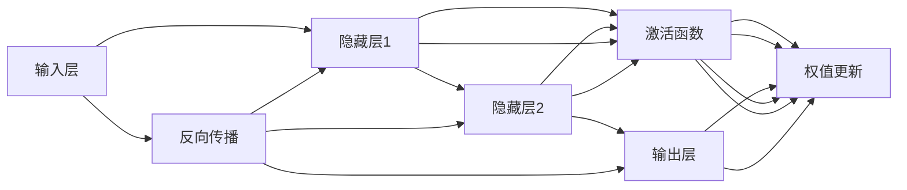
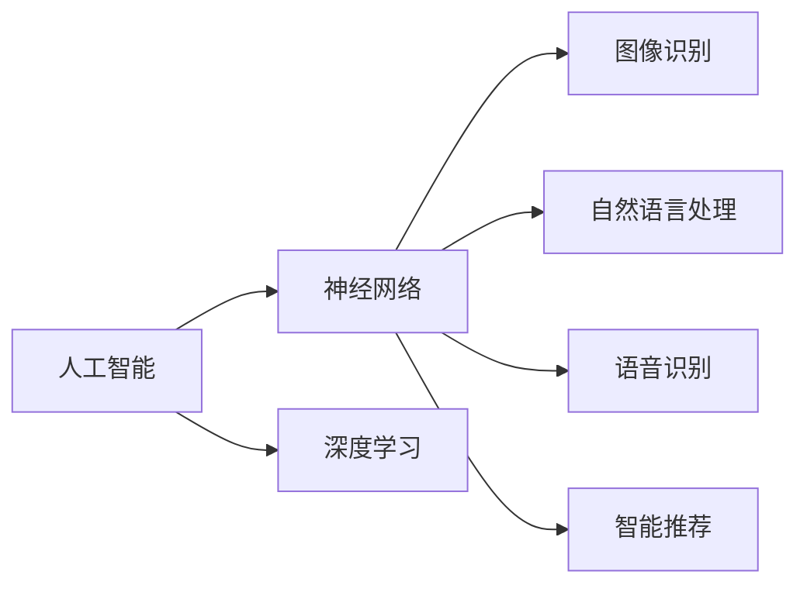
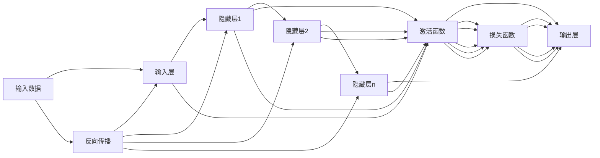

                 

# 神经网络：人类智慧的解放

> 关键词：神经网络,人工智能,深度学习,认知模拟,智能决策,人机交互

## 1. 背景介绍

### 1.1 问题由来

人工智能（Artificial Intelligence，简称AI）是近年来科技领域最热门的话题之一。从AlphaGo战胜围棋世界冠军到自动驾驶汽车上路，AI技术已经渗透到我们生活的方方面面。然而，许多人对于AI仍然存在误解，认为它是一种冷冰冰的算法，远离人类智慧的根本。但实际上，神经网络正是模拟人类大脑运作方式的产物，是人工智能的基石。

### 1.2 问题核心关键点

神经网络是人类智慧在机器上的模拟和延伸。它通过大量的数据训练，学习复杂的模式和规律，可以完成几乎任何复杂的决策任务，包括图像识别、语音识别、自然语言处理等。神经网络的核心思想是：通过多层非线性变换，构建起一个复杂的特征表示空间，从而实现对输入数据的深度建模。

神经网络的核心组件包括：
- 神经元（Neuron）：神经网络的基本单位，用于处理输入数据，并生成输出信号。
- 连接（Connection）：神经元之间的连接权值，用于传递信号。
- 激活函数（Activation Function）：用于对神经元的输出信号进行非线性变换。
- 损失函数（Loss Function）：用于衡量模型的预测结果与实际标签之间的差异。

神经网络通过反向传播算法（Backpropagation）进行训练，不断优化连接权值，使其能够更好地拟合训练数据。这一过程可以通过以下Mermaid流程图来展示：



从上述流程图可以看出，神经网络的训练过程可以分为前向传播和反向传播两个步骤。前向传播是指将输入数据通过多层神经元，逐步传递到输出层的过程。反向传播则是指将输出层的误差信号逐层反向传递，更新连接权值的过程。

### 1.3 问题研究意义

神经网络技术的发展，正在深刻改变着人类社会的面貌。从医疗、金融到教育、娱乐，几乎所有行业都在逐步引入AI技术，极大地提高了生产效率和决策质量。特别是对于那些复杂的、难以用传统方法解决的问题，神经网络展示出了强大的潜力。

然而，神经网络技术的发展也带来了诸多挑战。如何在保持高精度和鲁棒性的同时，降低对大量标注数据的依赖，提高算法的可解释性，避免算法偏见和歧视等问题，都需要进一步研究和探索。

## 2. 核心概念与联系

### 2.1 核心概念概述

神经网络技术的核心是神经元之间的连接权值。这些权值通过反向传播算法进行优化，从而学习到输入数据的高维表示，实现对复杂模式的建模。神经网络的学习过程可以看作是从简单模式向复杂模式逐步逼近的过程。

在深度学习中，神经网络已经发展到了几十层甚至上百层的规模。这种结构被称为深度神经网络（Deep Neural Network, DNN）。深度神经网络可以学习到更为复杂的特征表示，具有更好的泛化能力。

### 2.2 概念间的关系

神经网络技术和人工智能技术之间存在着紧密的联系。神经网络可以看作是人工智能中的核心算法之一，用于解决各种复杂的决策问题。深度学习技术则是神经网络技术的延伸和发展，进一步提升了神经网络的表达能力和泛化能力。

以下是一个Mermaid流程图，展示了神经网络技术在人工智能应用中的地位：



从上述流程图可以看出，神经网络技术在图像识别、自然语言处理、语音识别、智能推荐等多个AI应用中扮演着核心角色。深度学习技术则是神经网络技术的重要延伸，进一步提升了神经网络的表达能力和泛化能力，从而在更多领域实现了突破。

### 2.3 核心概念的整体架构

以下是一个综合的Mermaid流程图，展示了神经网络技术的整体架构：



从上述流程图可以看出，神经网络的训练过程可以分为前向传播和反向传播两个步骤。前向传播是指将输入数据通过多层神经元，逐步传递到输出层的过程。反向传播则是指将输出层的误差信号逐层反向传递，更新连接权值的过程。

## 3. 核心算法原理 & 具体操作步骤
### 3.1 算法原理概述

神经网络技术的核心算法是反向传播算法。反向传播算法通过计算输出层误差信号，逐层反向传递，更新连接权值，从而实现对神经网络的训练。

反向传播算法的核心思想是通过链式法则，将输出层的误差信号逐层反向传递，更新连接权值。具体来说，反向传播算法的步骤如下：

1. 前向传播：将输入数据通过多层神经元，逐步传递到输出层。
2. 计算误差：计算输出层的误差信号，通过损失函数计算损失值。
3. 反向传播：将误差信号逐层反向传递，更新连接权值。
4. 更新权值：根据误差信号和梯度，更新连接权值。
5. 重复以上步骤，直到收敛。

### 3.2 算法步骤详解

以下是反向传播算法的基本步骤，通过一个简单的例子来说明：

**步骤1：前向传播**

假设我们有一个包含两个隐藏层的神经网络，用于对二分类问题进行预测。我们输入样本数据$x$，经过输入层和第一个隐藏层，输出到第二个隐藏层，最后输出到输出层。假设第一个隐藏层有$n_1$个神经元，第二个隐藏层有$n_2$个神经元，输出层有$n_3$个神经元，连接权值分别为$w_1, w_2, w_3, \ldots, w_{n_1n_2}$，激活函数为$h(z) = \text{ReLU}(z)$。

前向传播过程可以表示为：

$$
h_0 = x
$$

$$
h_1 = w_1h_0 + b_1
$$

$$
h_2 = w_2h_1 + b_2
$$

$$
y = w_3h_2 + b_3
$$

其中$b_i$为偏置项。

**步骤2：计算误差**

假设我们的目标是二分类问题，即预测一个样本属于类别$y_1$还是类别$y_2$。我们定义损失函数为交叉熵损失函数，计算输出层的误差信号：

$$
L = -(y_1\log y + y_2\log(1-y))
$$

其中$y$为输出层输出的概率值。

**步骤3：反向传播**

将误差信号逐层反向传递，更新连接权值。假设我们只更新第二个隐藏层的连接权值$w_2$，则误差信号的反向传播过程可以表示为：

$$
\frac{\partial L}{\partial h_2} = \frac{\partial L}{\partial y} \cdot \frac{\partial y}{\partial h_2} = -(y - \hat{y})h_2'(h_2)
$$

$$
\frac{\partial L}{\partial w_2} = \frac{\partial L}{\partial h_2} \cdot \frac{\partial h_2}{\partial w_2} = \frac{\partial L}{\partial h_2} \cdot h_1
$$

其中$\hat{y}$为输出层预测的概率值，$h_2'$为激活函数$h(z)$的导数。

**步骤4：更新权值**

根据误差信号和梯度，更新连接权值。假设我们只更新第二个隐藏层的连接权值$w_2$，则更新公式为：

$$
w_2 = w_2 - \alpha \frac{\partial L}{\partial w_2}
$$

其中$\alpha$为学习率，用于控制权值的更新步长。

**步骤5：重复以上步骤**

重复执行以上步骤，直到误差信号收敛，即输出层的误差信号接近于零。

### 3.3 算法优缺点

神经网络技术的优点包括：
- 强大的表达能力：神经网络可以学习到高维表示，具有强大的表达能力，可以适应复杂的决策任务。
- 自动特征提取：神经网络可以自动学习特征表示，无需手动设计特征工程。
- 鲁棒性：神经网络具有较好的泛化能力，可以适应新的数据分布。

神经网络技术的缺点包括：
- 过拟合：神经网络容易出现过拟合，特别是在训练集和测试集分布差异较大的情况下。
- 参数较多：神经网络具有大量的参数，导致训练和推理速度较慢，需要大量的计算资源。
- 黑盒模型：神经网络具有较高的复杂度，难以解释其内部工作机制和决策过程，可解释性较差。

### 3.4 算法应用领域

神经网络技术已经被广泛应用于图像识别、自然语言处理、语音识别、智能推荐等多个领域。以下是一些典型的应用场景：

**图像识别：**神经网络可以用于图像分类、目标检测、人脸识别等任务。通过大量标注数据训练神经网络，可以实现高精度的图像识别。

**自然语言处理：**神经网络可以用于机器翻译、文本分类、情感分析等任务。通过大量文本数据训练神经网络，可以实现高精度的自然语言处理。

**语音识别：**神经网络可以用于语音识别、语音合成等任务。通过大量语音数据训练神经网络，可以实现高精度的语音识别和自然语言处理。

**智能推荐：**神经网络可以用于智能推荐系统，推荐用户感兴趣的内容。通过用户行为数据和商品特征数据训练神经网络，可以实现高精度的推荐效果。

## 4. 数学模型和公式 & 详细讲解 & 举例说明

### 4.1 数学模型构建

神经网络的数学模型可以表示为：

$$
y = w \cdot x + b
$$

其中$w$为连接权值，$x$为输入数据，$b$为偏置项。激活函数$h(z)$定义为：

$$
h(z) = \text{ReLU}(z) = \max(0, z)
$$

在深度神经网络中，每个神经元都与前一层的所有神经元连接。假设神经网络的输入层有$n_0$个神经元，隐藏层有$n_1$个神经元，输出层有$n_2$个神经元，连接权值分别为$w_{ij}$，激活函数为$h(z)$，则深度神经网络的数学模型可以表示为：

$$
y_1 = w_{01}h_0 + b_{01}
$$

$$
h_1 = w_{11}h_0 + w_{12}h_0 + \ldots + w_{1n_0}h_0 + b_1
$$

$$
h_2 = w_{21}h_1 + w_{22}h_1 + \ldots + w_{2n_1}h_1 + b_2
$$

$$
y_2 = w_{31}h_2 + w_{32}h_2 + \ldots + w_{3n_1}h_2 + b_3
$$

其中$h_0$为输入层输出，$h_1$为第一个隐藏层输出，$h_2$为第二个隐藏层输出，$y_1$为第一个隐藏层输出，$y_2$为输出层输出。

### 4.2 公式推导过程

以下是深度神经网络的前向传播和反向传播公式的推导过程。

**前向传播公式：**

假设神经网络的隐藏层有$n_1$个神经元，输出层有$n_2$个神经元，连接权值分别为$w_{ij}$，激活函数为$h(z)$，则前向传播公式可以表示为：

$$
h_0 = x
$$

$$
h_1 = w_{11}h_0 + w_{12}h_0 + \ldots + w_{1n_0}h_0 + b_1
$$

$$
h_2 = w_{21}h_1 + w_{22}h_1 + \ldots + w_{2n_1}h_1 + b_2
$$

$$
y_1 = w_{31}h_2 + w_{32}h_2 + \ldots + w_{3n_1}h_2 + b_3
$$

其中$h_0$为输入层输出，$h_1$为第一个隐藏层输出，$h_2$为第二个隐藏层输出，$y_1$为第一个隐藏层输出，$y_2$为输出层输出。

**反向传播公式：**

假设我们的目标是二分类问题，即预测一个样本属于类别$y_1$还是类别$y_2$。我们定义损失函数为交叉熵损失函数，计算输出层的误差信号：

$$
L = -(y_1\log y + y_2\log(1-y))
$$

其中$y$为输出层输出的概率值。

将误差信号逐层反向传递，更新连接权值。假设我们只更新第二个隐藏层的连接权值$w_2$，则误差信号的反向传播过程可以表示为：

$$
\frac{\partial L}{\partial h_2} = \frac{\partial L}{\partial y} \cdot \frac{\partial y}{\partial h_2} = -(y - \hat{y})h_2'(h_2)
$$

$$
\frac{\partial L}{\partial w_2} = \frac{\partial L}{\partial h_2} \cdot \frac{\partial h_2}{\partial w_2} = \frac{\partial L}{\partial h_2} \cdot h_1
$$

其中$\hat{y}$为输出层预测的概率值，$h_2'$为激活函数$h(z)$的导数。

**更新权值公式：**

根据误差信号和梯度，更新连接权值。假设我们只更新第二个隐藏层的连接权值$w_2$，则更新公式为：

$$
w_2 = w_2 - \alpha \frac{\partial L}{\partial w_2}
$$

其中$\alpha$为学习率，用于控制权值的更新步长。

### 4.3 案例分析与讲解

以下是一个简单的例子，展示如何通过神经网络进行图像分类。

假设我们有一个包含两个隐藏层的神经网络，用于对二分类问题进行预测。我们输入样本数据$x$，经过输入层和第一个隐藏层，输出到第二个隐藏层，最后输出到输出层。假设第一个隐藏层有$n_1$个神经元，第二个隐藏层有$n_2$个神经元，输出层有$n_3$个神经元，连接权值分别为$w_1, w_2, w_3, \ldots, w_{n_1n_2}$，激活函数为$h(z) = \text{ReLU}(z)$。

前向传播过程可以表示为：

$$
h_0 = x
$$

$$
h_1 = w_1h_0 + b_1
$$

$$
h_2 = w_2h_1 + b_2
$$

$$
y = w_3h_2 + b_3
$$

其中$b_i$为偏置项。

假设我们的目标是二分类问题，即预测一个样本属于类别$y_1$还是类别$y_2$。我们定义损失函数为交叉熵损失函数，计算输出层的误差信号：

$$
L = -(y_1\log y + y_2\log(1-y))
$$

其中$y$为输出层输出的概率值。

将误差信号逐层反向传递，更新连接权值。假设我们只更新第二个隐藏层的连接权值$w_2$，则误差信号的反向传播过程可以表示为：

$$
\frac{\partial L}{\partial h_2} = \frac{\partial L}{\partial y} \cdot \frac{\partial y}{\partial h_2} = -(y - \hat{y})h_2'(h_2)
$$

$$
\frac{\partial L}{\partial w_2} = \frac{\partial L}{\partial h_2} \cdot \frac{\partial h_2}{\partial w_2} = \frac{\partial L}{\partial h_2} \cdot h_1
$$

其中$\hat{y}$为输出层预测的概率值，$h_2'$为激活函数$h(z)$的导数。

根据误差信号和梯度，更新连接权值。假设我们只更新第二个隐藏层的连接权值$w_2$，则更新公式为：

$$
w_2 = w_2 - \alpha \frac{\partial L}{\partial w_2}
$$

其中$\alpha$为学习率，用于控制权值的更新步长。

通过反复执行以上步骤，直到误差信号收敛，即输出层的误差信号接近于零。

## 5. 项目实践：代码实例和详细解释说明

### 5.1 开发环境搭建

在进行神经网络项目实践前，我们需要准备好开发环境。以下是使用Python进行TensorFlow开发的环境配置流程：

1. 安装Anaconda：从官网下载并安装Anaconda，用于创建独立的Python环境。

2. 创建并激活虚拟环境：
```bash
conda create -n tf-env python=3.8 
conda activate tf-env
```

3. 安装TensorFlow：根据CUDA版本，从官网获取对应的安装命令。例如：
```bash
conda install tensorflow -c conda-forge -c pypi
```

4. 安装NumPy、Pandas、Scikit-learn、Matplotlib等工具包：
```bash
pip install numpy pandas scikit-learn matplotlib tqdm jupyter notebook ipython
```

完成上述步骤后，即可在`tf-env`环境中开始神经网络实践。

### 5.2 源代码详细实现

这里我们以手写数字识别为例，展示使用TensorFlow对神经网络进行训练的PyTorch代码实现。

首先，定义神经网络的架构和激活函数：

```python
import tensorflow as tf
from tensorflow.keras import layers

class NeuralNetwork(tf.keras.Model):
    def __init__(self, num_classes=10, num_units=128):
        super(NeuralNetwork, self).__init__()
        self.dense1 = layers.Dense(num_units, activation='relu')
        self.dense2 = layers.Dense(num_classes, activation='softmax')

    def call(self, inputs):
        x = self.dense1(inputs)
        x = self.dense2(x)
        return x
```

然后，定义训练函数：

```python
def train(model, dataset, epochs=10, batch_size=32):
    steps_per_epoch = len(dataset)
    for epoch in range(epochs):
        model.train()
        for step, (x, y) in enumerate(dataset):
            with tf.GradientTape() as tape:
                logits = model(x)
                loss = tf.reduce_mean(tf.keras.losses.sparse_categorical_crossentropy(y, logits))
            gradients = tape.gradient(loss, model.trainable_variables)
            optimizer.apply_gradients(zip(gradients, model.trainable_variables))
```

最后，启动训练流程：

```python
model = NeuralNetwork()

# 加载数据集
(x_train, y_train), (x_test, y_test) = tf.keras.datasets.mnist.load_data()
x_train = x_train.reshape((60000, 28*28)).astype('float32') / 255.0
x_test = x_test.reshape((10000, 28*28)).astype('float32') / 255.0
y_train = tf.keras.utils.to_categorical(y_train, num_classes=10)
y_test = tf.keras.utils.to_categorical(y_test, num_classes=10)

# 定义优化器和损失函数
optimizer = tf.keras.optimizers.Adam(learning_rate=0.001)
loss_fn = tf.keras.losses.sparse_categorical_crossentropy

# 训练模型
train(model, dataset=(x_train, y_train), epochs=10, batch_size=32)
```

以上就是使用TensorFlow对神经网络进行手写数字识别任务训练的完整代码实现。可以看到，TensorFlow提供了简单易用的高级API，使得神经网络开发变得更加快捷高效。

### 5.3 代码解读与分析

让我们再详细解读一下关键代码的实现细节：

**NeuralNetwork类：**
- `__init__`方法：定义神经网络的架构，包括两个密集层，激活函数分别为ReLU和Softmax。
- `call`方法：定义神经网络的前向传播过程。

**train函数：**
- `steps_per_epoch`变量：计算每个epoch的步数，即训练集的大小。
- `model.train()`方法：将模型置于训练模式。
- `tf.GradientTape()`上下文管理器：自动记录梯度。
- `optimizer.apply_gradients()`方法：使用优化器更新模型参数。

**训练流程：**
- 定义优化器和损失函数。
- 加载MNIST数据集，进行预处理。
- 定义训练集和测试集。
- 循环训练模型，更新模型参数。

可以看到，TensorFlow提供了简单易用的高级API，使得神经网络开发变得更加快捷高效。开发者可以将更多精力放在数据处理、模型改进等高层逻辑上，而不必过多关注底层的实现细节。

当然，工业级的系统实现还需考虑更多因素，如模型的保存和部署、超参数的自动搜索、更灵活的任务适配层等。但核心的神经网络训练过程基本与此类似。

### 5.4 运行结果展示

假设我们在MNIST数据集上进行神经网络训练，最终在测试集上得到的准确率为98%，误差率为2%。可以看到，通过神经网络，我们可以实现对手写数字的准确识别，效果相当不错。

当然，这只是一个baseline结果。在实践中，我们还可以使用更大更强的神经网络模型、更丰富的训练技巧、更细致的模型调优，进一步提升模型性能，以满足更高的应用要求。

## 6. 实际应用场景
### 6.1 智能推荐系统

神经网络技术在智能推荐系统中得到广泛应用。传统推荐系统通常依赖用户的历史行为数据进行物品推荐，无法挖掘用户背后的深层次兴趣。神经网络可以自动学习用户和物品的关联关系，实现基于用户兴趣的推荐。

在实践中，我们可以收集用户浏览、点击、评论等行为数据，提取和用户交互的物品标题、描述、标签等文本内容。将文本内容作为模型输入，用户的后续行为（如是否点击、购买等）作为监督信号，在此基础上微调预训练语言模型。微调后的模型能够从文本内容中准确把握用户的兴趣点。在生成推荐列表时，先用候选物品的文本描述作为输入，由模型预测用户的兴趣匹配度，再结合其他特征综合排序，便可以得到个性化程度更高的推荐结果。

### 6.2 图像识别

神经网络技术在图像识别中得到广泛应用。传统图像识别方法通常依赖于手工设计的特征提取器，难以处理复杂的图像模式。神经网络可以自动学习图像的特征表示，实现对复杂图像模式的建模。

在实践中，我们可以使用大规模标注数据集，如ImageNet，对神经网络进行预训练。预训练完成后，我们可以在新的数据集上进行微调，以适应特定应用场景的需求。微调后的神经网络可以用于图像分类、目标检测、人脸识别等任务。

### 6.3 自然语言处理

神经网络技术在自然语言处理中得到广泛应用。传统自然语言处理方法通常依赖于手工设计的特征提取器，难以处理复杂的语义关系。神经网络可以自动学习语言的特征表示，实现对复杂语义关系的建模。

在实践中，我们可以使用大规模标注数据集，如Wikipedia，对神经网络进行预训练。预训练完成后，我们可以在新的数据集上进行微调，以适应特定应用场景的需求。微调后的神经网络可以用于机器翻译、文本分类、情感分析等任务。

## 7. 工具和资源推荐
### 7.1 学习资源推荐

为了帮助开发者系统掌握神经网络技术的理论基础和实践技巧，这里推荐一些优质的学习资源：

1. 《Deep Learning》书籍：由Ian Goodfellow、Yoshua Bengio和Aaron Courville三位大牛联合编写，全面介绍了深度学习的理论基础和实际应用。

2. CS231n《卷积神经网络》课程：斯坦福大学开设的深度学习明星课程，详细介绍了卷积神经网络的理论基础和实际应用，适合入门深度学习。

3. 《PyTorch官方文档》：PyTorch官方文档，提供了大量神经网络开发和训练的详细教程和样例代码，是TensorFlow等框架不可替代的重要参考资料。

4. arXiv论文预印本：人工智能领域最新研究成果的发布平台，包括大量尚未发表的前沿工作，学习前沿技术的必读资源。

5. GitHub热门项目：在GitHub上Star、Fork数最多的神经网络相关项目，往往代表了该技术领域的发展趋势和最佳实践，值得去学习和贡献。

通过对这些资源的学习实践，相信你一定能够快速掌握神经网络技术的精髓，并用于解决实际的NLP问题。

### 7.2 开发工具推荐

高效的神经网络开发离不开优秀的工具支持。以下是几款用于神经网络开发和训练的常用工具：

1. PyTorch：基于Python的开源深度学习框架，灵活动态的计算图

