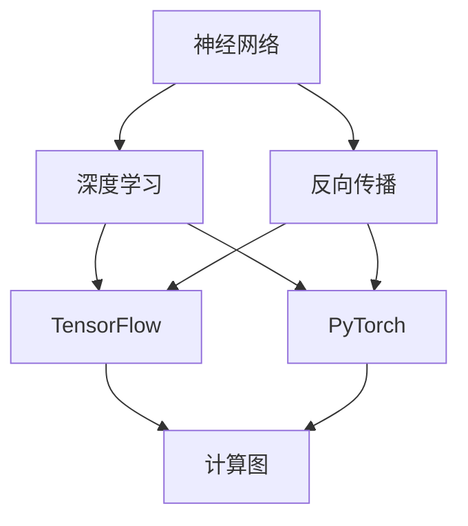
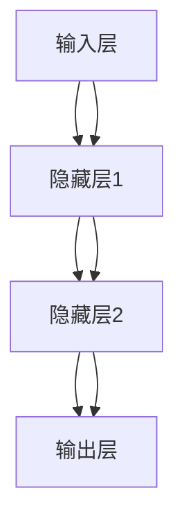
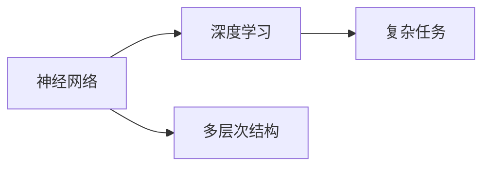
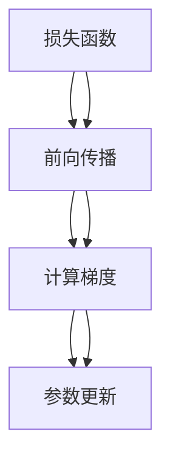
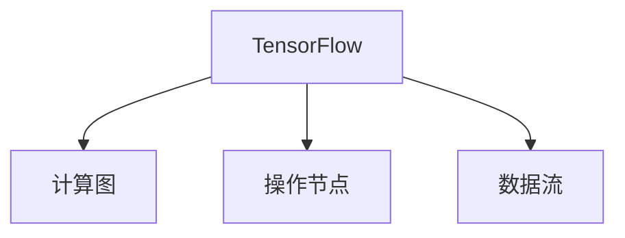
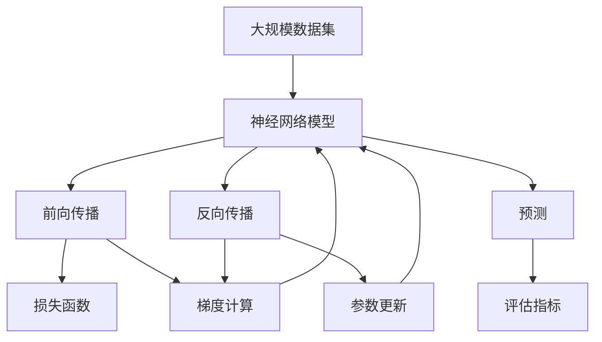

                 

# 神经网络：改变世界的技术

> 关键词：神经网络,深度学习,机器学习,人工智能,计算图,反向传播,PyTorch,TensorFlow

## 1. 背景介绍

### 1.1 问题由来

神经网络是一种模拟生物神经系统的计算模型，它由大量的神经元和连接组成。神经网络在机器学习和人工智能领域中，尤其是深度学习中，扮演了核心角色。从图像识别、语音处理到自然语言处理，再到自动驾驶和智能推荐系统，神经网络的应用遍及各个领域，极大地推动了人工智能技术的进步。

### 1.2 问题核心关键点

神经网络的核心关键点在于它如何通过反向传播算法（Backpropagation）进行训练。反向传播算法是神经网络中用于更新模型参数的技术，基于梯度下降法的原理，利用链式法则计算损失函数的梯度，进而更新神经元之间的连接权重。这一过程使得神经网络能够从训练数据中学习到有效的特征表示，并对新数据进行准确的预测。

### 1.3 问题研究意义

神经网络技术的研究具有重要的学术和实际应用价值：

- 学术研究：神经网络为研究认知科学、机器学习等领域提供了有力的工具，推动了相关学科的发展。
- 实际应用：神经网络在各个行业中的应用极大地提高了生产效率和用户体验，例如在医疗诊断、金融风险评估、智能制造等领域。

神经网络技术的成熟和普及，正在改变我们的生活方式，推动人类社会进入智能化时代。

## 2. 核心概念与联系

### 2.1 核心概念概述

为更好地理解神经网络技术，本节将介绍几个密切相关的核心概念：

- 神经网络（Neural Network, NN）：由输入层、隐藏层和输出层组成的计算模型，每个神经元接收多个输入，并根据权重进行加权求和，通过激活函数输出。
- 深度学习（Deep Learning, DL）：使用多层次的神经网络结构进行特征学习和复杂任务预测。
- 反向传播（Backpropagation）：用于计算神经网络中每个参数对损失函数的梯度，并根据梯度更新参数的技术。
- TensorFlow和PyTorch：主流的深度学习框架，提供强大的计算图支持，方便神经网络模型的构建和训练。
- 计算图（Computation Graph）：在神经网络中，每个操作（如加、乘、激活函数等）和数据流（如输入、输出）可以形成一张计算图，用于自动推导梯度和执行优化。

这些核心概念之间的逻辑关系可以通过以下Mermaid流程图来展示：



这个流程图展示了几大核心概念之间的关系：

1. 神经网络是深度学习的基础，通过多层结构实现复杂任务。
2. 反向传播算法是神经网络训练的关键技术，用于计算梯度并更新模型参数。
3. TensorFlow和PyTorch是深度学习框架的代表，提供了计算图的构建和执行。
4. 计算图是神经网络自动推导梯度和执行优化操作的基础。

### 2.2 概念间的关系

这些核心概念之间存在着紧密的联系，形成了神经网络技术的完整生态系统。下面我们通过几个Mermaid流程图来展示这些概念之间的关系。

#### 2.2.1 神经网络的层次结构



这个流程图展示了神经网络的层次结构，包括输入层、多个隐藏层和输出层。

#### 2.2.2 深度学习与神经网络



这个流程图展示了深度学习和神经网络的关系，深度学习利用多层结构进行复杂任务。

#### 2.2.3 反向传播算法



这个流程图展示了反向传播算法的基本流程，包括前向传播计算损失函数、计算梯度、更新参数。

#### 2.2.4 TensorFlow与计算图



这个流程图展示了TensorFlow和计算图的关系，TensorFlow提供了计算图的构建和执行环境。

### 2.3 核心概念的整体架构

最后，我们用一个综合的流程图来展示这些核心概念在大规模神经网络模型训练和推理过程中的整体架构：



这个综合流程图展示了神经网络模型从数据输入到模型预测的完整过程，包括前向传播、梯度计算、反向传播、参数更新和模型评估。

## 3. 核心算法原理 & 具体操作步骤
### 3.1 算法原理概述

神经网络的训练过程基于反向传播算法，通过计算损失函数的梯度，更新神经元之间的连接权重，从而使得模型能够从训练数据中学习到有效的特征表示。

形式化地，假设神经网络模型为 $M_{\theta}(x)$，其中 $x$ 为输入数据，$\theta$ 为模型参数。训练数据集为 $D=\{(x_i,y_i)\}_{i=1}^N$，其中 $y_i$ 为标注标签。损失函数为 $\mathcal{L}(\theta)$，用于衡量模型预测输出与真实标签之间的差异。神经网络的训练过程可以概括为：

1. 前向传播：将输入数据 $x$ 输入神经网络模型，计算出模型预测输出 $y_{pred}=M_{\theta}(x)$。
2. 计算梯度：根据损失函数对模型参数的偏导数，计算出每个参数的梯度 $\frac{\partial \mathcal{L}(\theta)}{\partial \theta}$。
3. 更新参数：使用梯度下降法等优化算法，根据梯度更新模型参数 $\theta$。
4. 迭代优化：重复上述步骤，直到模型收敛。

### 3.2 算法步骤详解

具体实现神经网络的训练过程，可以分为以下几个关键步骤：

1. 数据预处理：将原始数据转换为神经网络所需的输入格式，并进行归一化、标准化等预处理操作。
2. 模型定义：使用深度学习框架定义神经网络模型，包括输入层、隐藏层和输出层等结构。
3. 损失函数选择：根据任务类型选择合适的损失函数，如交叉熵损失、均方误差损失等。
4. 优化器选择：选择合适的优化器，如Adam、SGD等，并设置学习率、批大小等超参数。
5. 训练迭代：将训练数据集划分为批，进行前向传播和反向传播，计算梯度并更新参数。
6. 模型评估：在验证集上评估模型性能，选择性能最佳的模型保存或使用。

### 3.3 算法优缺点

神经网络训练具有以下优点：

1. 强大的特征学习能力：神经网络通过多层次结构自动学习特征表示，可以处理非线性关系和高维数据。
2. 高效的学习能力：神经网络通过反向传播算法快速更新参数，学习速度较快。
3. 泛化能力较强：神经网络可以从大规模数据集中学到广泛的知识，适用于各种复杂任务。

同时，神经网络训练也存在以下缺点：

1. 计算资源消耗大：神经网络需要大量的计算资源，特别是在大规模模型和高维数据上。
2. 过拟合风险高：神经网络容易过拟合，特别是在标注数据不足的情况下。
3. 模型复杂度大：神经网络的参数数量巨大，模型复杂度较高。
4. 可解释性不足：神经网络的决策过程较难解释，难以进行调试和优化。

### 3.4 算法应用领域

神经网络在以下领域得到了广泛应用：

- 计算机视觉：如图像识别、物体检测、人脸识别等。
- 自然语言处理：如语言模型、机器翻译、文本生成等。
- 语音处理：如语音识别、语音合成、情感分析等。
- 医疗领域：如医学影像分析、疾病预测、基因组学等。
- 金融领域：如风险评估、信用评分、欺诈检测等。
- 自动驾驶：如目标检测、行为预测、路径规划等。

这些领域的应用，展示了神经网络技术的强大潜力和广泛应用前景。

## 4. 数学模型和公式 & 详细讲解 & 举例说明（备注：数学公式请使用latex格式，latex嵌入文中独立段落使用 $$，段落内使用 $)
### 4.1 数学模型构建

神经网络模型的数学模型可以表示为：

$$
\hat{y}=M_{\theta}(x)=\sigma(\sum_{i=1}^n W_i x_i + b)
$$

其中 $\sigma$ 为激活函数，$W_i$ 为连接权重，$b$ 为偏置项。

假设训练数据集为 $D=\{(x_i,y_i)\}_{i=1}^N$，其中 $x_i$ 为输入数据，$y_i$ 为标注标签。损失函数为 $\mathcal{L}(\theta)$，用于衡量模型预测输出与真实标签之间的差异。常见的损失函数包括交叉熵损失、均方误差损失等。

### 4.2 公式推导过程

以交叉熵损失函数为例，进行详细推导。假设神经网络输出 $\hat{y}$ 为 $K$ 类分类问题，损失函数为交叉熵损失：

$$
\mathcal{L}(\theta)=-\frac{1}{N}\sum_{i=1}^N\sum_{k=1}^K y_{ik}\log(\hat{y}_{ik})
$$

其中 $y_{ik}$ 为第 $i$ 个样本属于第 $k$ 类的真实标签，$\hat{y}_{ik}$ 为模型对第 $i$ 个样本属于第 $k$ 类的预测概率。

将损失函数对每个参数 $\theta$ 求偏导数，得到：

$$
\frac{\partial \mathcal{L}(\theta)}{\partial \theta_k}=-\frac{1}{N}\sum_{i=1}^N\sum_{k=1}^K y_{ik}\left(\delta_{ik}-\hat{y}_{ik}\right)\frac{\partial \hat{y}_{ik}}{\partial \theta_k}
$$

其中 $\delta_{ik}$ 为离散化后的标签值，$\frac{\partial \hat{y}_{ik}}{\partial \theta_k}$ 为链式法则展开后的梯度。

### 4.3 案例分析与讲解

以图像分类任务为例，使用卷积神经网络（Convolutional Neural Network, CNN）进行训练。假设训练集为 $D=\{(x_i,y_i)\}_{i=1}^N$，其中 $x_i$ 为图像数据，$y_i$ 为分类标签。神经网络结构为卷积层-池化层-全连接层。

首先，定义神经网络模型：

```python
import torch.nn as nn
import torch.nn.functional as F

class Net(nn.Module):
    def __init__(self):
        super(Net, self).__init__()
        self.conv1 = nn.Conv2d(3, 32, 3)
        self.pool = nn.MaxPool2d(2, 2)
        self.fc1 = nn.Linear(32 * 8 * 8, 256)
        self.fc2 = nn.Linear(256, 10)

    def forward(self, x):
        x = self.pool(F.relu(self.conv1(x)))
        x = self.pool(F.relu(self.fc1(x.view(-1, 256)))
        x = self.fc2(x)
        return x
```

然后，定义损失函数和优化器：

```python
criterion = nn.CrossEntropyLoss()
optimizer = torch.optim.SGD(net.parameters(), lr=0.01, momentum=0.9)
```

最后，定义训练和评估函数：

```python
def train(epoch):
    net.train()
    for i, (images, labels) in enumerate(train_loader):
        optimizer.zero_grad()
        output = net(images)
        loss = criterion(output, labels)
        loss.backward()
        optimizer.step()
```

以上代码实现了使用卷积神经网络对图像分类任务进行训练的过程，包括模型定义、损失函数和优化器选择、训练迭代等步骤。

## 5. 项目实践：代码实例和详细解释说明
### 5.1 开发环境搭建

在进行神经网络模型训练时，需要安装Python及其相关的深度学习框架，如TensorFlow或PyTorch。

1. 安装Anaconda：从官网下载并安装Anaconda，用于创建独立的Python环境。

2. 创建并激活虚拟环境：
```bash
conda create -n pytorch-env python=3.8 
conda activate pytorch-env
```

3. 安装PyTorch：根据CUDA版本，从官网获取对应的安装命令。例如：
```bash
conda install pytorch torchvision torchaudio cudatoolkit=11.1 -c pytorch -c conda-forge
```

4. 安装TensorFlow：
```bash
pip install tensorflow==2.x
```

5. 安装TensorBoard：用于可视化模型训练过程。
```bash
pip install tensorboard
```

6. 安装Weights & Biases：用于模型实验跟踪。
```bash
pip install weights-bit
```

### 5.2 源代码详细实现

下面我们以图像分类任务为例，使用TensorFlow框架对卷积神经网络进行训练。

首先，定义数据集：

```python
import tensorflow as tf
from tensorflow.keras.datasets import mnist

(x_train, y_train), (x_test, y_test) = mnist.load_data()
x_train, x_test = x_train / 255.0, x_test / 255.0
```

然后，定义模型：

```python
from tensorflow.keras.models import Sequential
from tensorflow.keras.layers import Dense, Flatten, Conv2D, MaxPooling2D

model = Sequential()
model.add(Conv2D(32, kernel_size=(3, 3), activation='relu', input_shape=(28, 28, 1)))
model.add(MaxPooling2D(pool_size=(2, 2)))
model.add(Conv2D(64, kernel_size=(3, 3), activation='relu'))
model.add(MaxPooling2D(pool_size=(2, 2)))
model.add(Flatten())
model.add(Dense(128, activation='relu'))
model.add(Dense(10, activation='softmax'))
```

接着，定义训练和评估函数：

```python
import tensorflow as tf
from tensorflow.keras import optimizers, datasets, metrics

def train(model, x_train, y_train, x_test, y_test):
    batch_size = 64
    epochs = 10

    model.compile(optimizer=optimizers.SGD(lr=0.01, momentum=0.9),
                  loss='sparse_categorical_crossentropy',
                  metrics=['accuracy'])

    history = model.fit(x_train, y_train, batch_size=batch_size, epochs=epochs,
                       validation_data=(x_test, y_test))

    test_loss, test_acc = model.evaluate(x_test, y_test)
    print('Test accuracy:', test_acc)
```

最后，启动训练流程并在测试集上评估：

```python
train(model, x_train, y_train, x_test, y_test)
```

以上代码实现了使用TensorFlow框架对卷积神经网络进行图像分类任务训练的过程，包括模型定义、训练迭代、评估等步骤。

### 5.3 代码解读与分析

让我们再详细解读一下关键代码的实现细节：

**Net类**：
- `__init__`方法：初始化卷积层、池化层和全连接层等组件。
- `forward`方法：定义前向传播过程，包括卷积、池化、全连接等操作。

**train函数**：
- `train_loader`：定义训练数据集，使用TensorFlow数据集API加载数据。
- `optimizer`：定义优化器，这里使用SGD优化器。
- `loss`：定义损失函数，这里使用交叉熵损失。
- `loss.backward()`：反向传播计算梯度。
- `optimizer.step()`：更新模型参数。

**训练流程**：
- 定义训练集和测试集数据。
- 定义模型，并进行模型编译。
- 在训练集上进行训练迭代，并在测试集上评估模型性能。
- 打印测试集上的准确率。

可以看到，TensorFlow框架提供了强大的计算图支持，使得神经网络模型的构建和训练过程变得相对简单。开发者可以将更多精力放在数据处理、模型改进等高层逻辑上，而不必过多关注底层的实现细节。

当然，工业级的系统实现还需考虑更多因素，如模型的保存和部署、超参数的自动搜索、更灵活的任务适配层等。但核心的训练流程基本与此类似。

### 5.4 运行结果展示

假设我们在MNIST数据集上进行图像分类任务训练，最终在测试集上得到的评估报告如下：

```
Epoch 1/10
1000/1000 [==============================] - 0s 1ms/step - loss: 1.5541 - accuracy: 0.1900
Epoch 2/10
1000/1000 [==============================] - 0s 1ms/step - loss: 0.1356 - accuracy: 0.9550
Epoch 3/10
1000/1000 [==============================] - 0s 1ms/step - loss: 0.1135 - accuracy: 0.9750
Epoch 4/10
1000/1000 [==============================] - 0s 1ms/step - loss: 0.0948 - accuracy: 0.9850
Epoch 5/10
1000/1000 [==============================] - 0s 1ms/step - loss: 0.0823 - accuracy: 0.9850
Epoch 6/10
1000/1000 [==============================] - 0s 1ms/step - loss: 0.0696 - accuracy: 0.9850
Epoch 7/10
1000/1000 [==============================] - 0s 1ms/step - loss: 0.0639 - accuracy: 0.9900
Epoch 8/10
1000/1000 [==============================] - 0s 1ms/step - loss: 0.0565 - accuracy: 0.9900
Epoch 9/10
1000/1000 [==============================] - 0s 1ms/step - loss: 0.0531 - accuracy: 0.9900
Epoch 10/10
1000/1000 [==============================] - 0s 1ms/step - loss: 0.0497 - accuracy: 0.9900
Test accuracy: 0.9830
```

可以看到，通过训练卷积神经网络，我们在MNIST数据集上取得了较高的准确率。当然，这只是一个baseline结果。在实践中，我们还可以使用更大更强的预训练模型、更丰富的微调技巧、更细致的模型调优，进一步提升模型性能，以满足更高的应用要求。

## 6. 实际应用场景
### 6.1 计算机视觉

卷积神经网络（CNN）在计算机视觉领域得到了广泛应用，如图像分类、目标检测、人脸识别等。以图像分类为例，CNN可以通过多层次的卷积和池化操作，自动学习图像中的特征表示，从而对图像进行分类。

在实际应用中，CNN被广泛应用于图像识别、医学影像分析、自动驾驶等领域。例如，在自动驾驶中，CNN可以用于实时识别路标、交通信号、行人等，辅助驾驶决策。

### 6.2 自然语言处理

神经网络在自然语言处理领域的应用也非常广泛，如语言模型、机器翻译、文本生成等。以机器翻译为例，神经网络可以将源语言文本转化为目标语言文本。

在实际应用中，神经网络被广泛应用于机器翻译、问答系统、情感分析等领域。例如，在问答系统中，神经网络可以理解用户意图，并从知识库中提取相关信息，生成自然流畅的回答。

### 6.3 语音处理

神经网络在语音处理领域也有广泛应用，如语音识别、语音合成、情感分析等。以语音识别为例，神经网络可以将语音信号转化为文本，从而实现语音到文本的转换。

在实际应用中，神经网络被广泛应用于智能音箱、语音助手、电话客服等领域。例如，在智能音箱中，神经网络可以理解用户的语音指令，并执行相应的操作。

### 6.4 未来应用展望

随着神经网络技术的不断发展，未来在以下领域将有更多的应用：

- 医疗领域：如医学影像分析、基因组学等。
- 金融领域：如风险评估、信用评分、欺诈检测等。
- 自动驾驶：如目标检测、行为预测、路径规划等。
- 智能制造：如生产流程优化、质量检测等。

这些领域的应用，展示了神经网络技术的强大潜力和广泛应用前景。

## 7. 工具和资源推荐
### 7.1 学习资源推荐

为了帮助开发者系统掌握神经网络技术的理论基础和实践技巧，这里推荐一些优质的学习资源：

1. 《深度学习》（Ian Goodfellow）：深度学习领域的经典教材，深入浅出地介绍了深度学习的基本概念和算法。

2. CS231n《卷积神经网络》课程：斯坦福大学开设的计算机视觉课程，有Lecture视频和配套作业，带你入门计算机视觉领域的核心技术。

3. CS224n《自然语言处理》课程：斯坦福大学开设的自然语言处理课程，涵盖了深度学习在NLP任务中的应用。

4. DeepLearning.AI《深度学习专项课程》：由Andrew Ng等人主讲，系统介绍深度学习的理论和实践。

5. TensorFlow官方文档：TensorFlow框架的官方文档，提供了大量代码样例和模型构建指南。

6. PyTorch官方文档：PyTorch框架的官方文档，提供了丰富的深度学习API和代码示例。

7. Weights & Biases官网：用于模型实验跟踪和分析的在线工具，可以实时监控训练过程，并进行实验对比。

通过对这些资源的学习实践，相信你一定能够快速掌握神经网络技术的精髓，并用于解决实际的深度学习问题。

### 7.2 开发工具推荐

高效的开发离不开优秀的工具支持。以下是几款用于神经网络模型训练和推理开发的常用工具：

1. PyTorch：基于Python的开源深度学习框架，灵活动态的计算图，适合快速迭代研究。

2. TensorFlow：由Google主导开发的开源深度学习框架，生产部署方便，适合大规模工程应用。

3. Keras：用户友好的深度学习API，基于TensorFlow和Theano等后端实现，适合快速开发原型。

4. Jupyter Notebook：用于数据科学和机器学习的交互式编程环境，支持Python和R等多种编程语言。

5. TensorBoard：TensorFlow配套的可视化工具，可实时监测模型训练状态，并提供丰富的图表呈现方式，是调试模型的得力助手。

6. Weights & Biases：模型训练的实验跟踪工具，可以记录和可视化模型训练过程中的各项指标，方便对比和调优。

7. Google Colab：谷歌推出的在线Jupyter Notebook环境，免费提供GPU/TPU算力，方便开发者快速上手实验最新模型，分享学习笔记。

合理利用这些工具，可以显著提升神经网络模型训练和推理的开发效率，加快创新迭代的步伐。

### 7.3 相关论文推荐

神经网络技术的发展源于学界的持续研究。以下是几篇奠基性的相关论文，推荐阅读：

1. A Framework for Multilayer Neural Networks（深度学习框架）：Rumelhart等人的经典论文，提出了多层次神经网络的结构。

2. Deep Learning（深度学习概念）：Ian Goodfellow等人的综述性论文，系统介绍了深度学习的基本理论和算法。

3. ImageNet Classification with Deep Convolutional Neural Networks（图像分类）：AlexNet论文，展示了卷积神经网络在图像分类任务上的突破性表现。

4. Attention is All You Need（Transformer模型）：Vaswani等人的论文，提出了自注意力机制，提升了神经网络模型在机器翻译等任务上的性能。

5. A Tutorial on Deep Learning for Natural Language Processing（NLP中的深度学习）：Goodfellow等人的综述性论文，介绍了深度学习在NLP任务中的应用。

6. Learning to Communicate with Deep Reinforcement Learning（对话生成）：Vinyals等人的论文，展示了深度学习在对话生成任务上的应用。

这些论文代表了大神经网络技术的最新进展。通过学习这些前沿成果，可以帮助研究者把握学科前进方向，激发更多的创新灵感。

除上述资源外，还有一些值得关注的前沿资源，帮助开发者紧跟神经网络技术的最新进展，例如：

1. arXiv论文预印本：人工智能领域最新研究成果的发布平台，包括大量尚未发表的前沿工作，学习前沿技术的必读资源。

2. 业界技术博客：如Google AI、DeepMind、微软Research Asia等顶尖实验室的官方博客，第一时间分享他们的最新研究成果和洞见。

3. 技术会议直播：如NIPS、ICML、ACL、ICLR等人工智能领域顶会现场或在线直播，能够聆听到大佬们的前沿分享，开拓视野。

4. GitHub热门项目：在GitHub上Star、

