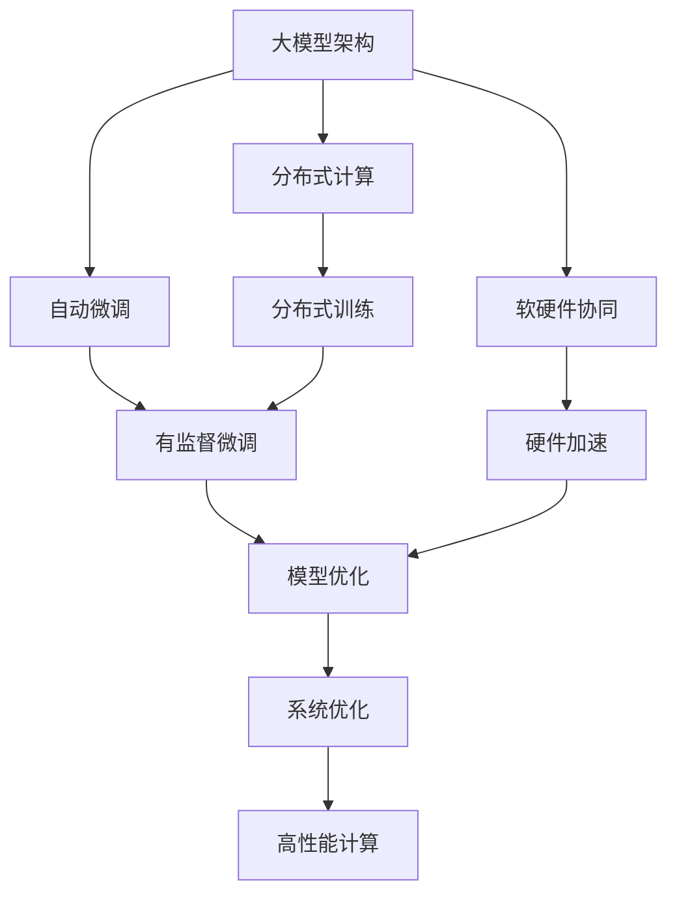
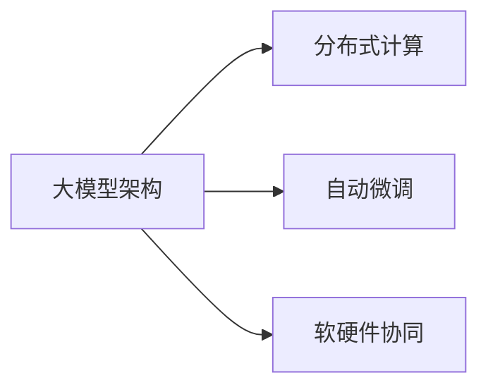
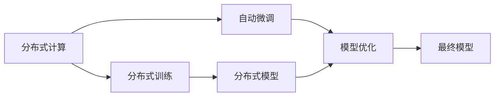
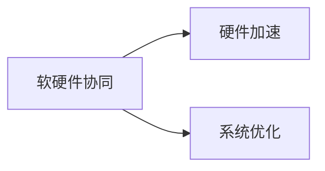
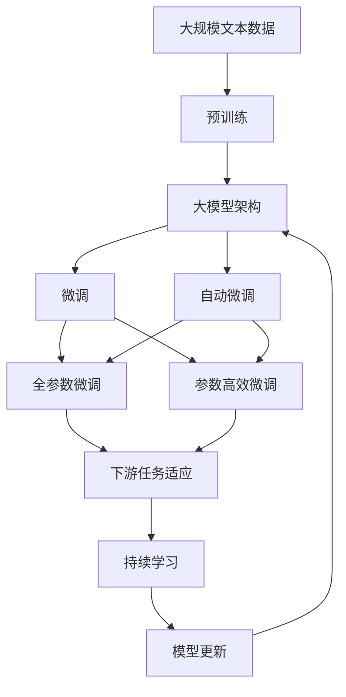

                 

# 禅与AI大模型架构设计艺术

> 关键词：大模型架构,分布式计算,自动微调,软硬件协同,混合精度训练

## 1. 背景介绍

### 1.1 问题由来

随着人工智能技术的迅猛发展，大模型在深度学习领域的应用越来越广泛。然而，大模型训练和推理所需的大量计算资源和能源消耗，已经成为制约其规模化应用的重要瓶颈。如何高效、可持续地设计和管理大模型架构，使其能够在各种场景下稳定运行，是当前研究者面临的共同挑战。

### 1.2 问题核心关键点

本文聚焦于大模型架构设计，探讨了如何通过分布式计算、自动微调、软硬件协同等技术手段，构建高效、可持续的大模型系统。将详细阐述大模型架构设计的基本原则、核心组件、关键算法，以及如何通过优化和创新，构建高效、稳定的AI大模型。

### 1.3 问题研究意义

高效、稳定的大模型架构设计，对于推动AI技术的产业化应用、提升模型性能、减少计算资源和能源消耗具有重要意义：

1. 降低应用开发成本：通过优化大模型架构，可以显著减少从头开发所需的数据、计算和人力等成本投入。
2. 提升模型效果：架构优化使得大模型更好地适应特定任务，在应用场景中取得更优表现。
3. 加速开发进度：分布式计算和自动微调技术，可以加快模型训练和优化过程，缩短开发周期。
4. 带来技术创新：架构优化催生了多种新的技术手段，如分布式训练、软硬件协同等，推动了AI技术的进一步发展。
5. 赋能产业升级：高效、稳定的大模型架构设计，使得NLP技术更容易被各行各业所采用，为传统行业数字化转型升级提供新的技术路径。

## 2. 核心概念与联系

### 2.1 核心概念概述

为更好地理解大模型架构设计的核心概念，本节将介绍几个关键概念：

- 大模型架构(Distributed AI Model Architecture)：指通过分布式计算、自动微调、软硬件协同等技术手段，构建高效、可持续的大模型系统。

- 分布式计算(Distributed Computing)：通过并行计算，将大规模计算任务分解为多个小任务，在多台计算设备上并行处理，以提升计算效率。

- 自动微调(Automatic Fine-tuning)：指在预训练模型的基础上，通过有监督地训练优化模型在特定任务上的性能。

- 软硬件协同(Software-Hardware Co-design)：通过硬件设计优化和软件优化相结合，提升计算资源的使用效率和系统稳定性。

- 混合精度训练(Mixed-Precision Training)：指在训练过程中，使用不同精度（如16位、32位）的浮点数表示，以减少计算和存储需求，提升计算速度。

这些核心概念之间的逻辑关系可以通过以下Mermaid流程图来展示：



这个流程图展示了大模型架构设计的主要组成部分及其关系：

1. 大模型架构包括分布式计算、自动微调、软硬件协同等技术。
2. 分布式计算通过并行计算，提升计算效率。
3. 自动微调在有监督数据集上优化模型性能。
4. 软硬件协同优化资源使用效率，提升系统稳定性。
5. 分布式训练和模型优化是自动微调的核心步骤。
6. 硬件加速和系统优化提升计算性能。

这些概念共同构成了大模型架构设计的完整生态系统，使其能够在各种场景下发挥高效、稳定的语言理解和生成能力。

### 2.2 概念间的关系

这些核心概念之间存在着紧密的联系，形成了大模型架构设计的完整生态系统。下面我通过几个Mermaid流程图来展示这些概念之间的关系。

#### 2.2.1 大模型架构的组成



这个流程图展示了大模型架构的组成。大模型架构包括分布式计算、自动微调和软硬件协同等关键组成部分。

#### 2.2.2 分布式计算与自动微调的关系



这个流程图展示了分布式计算和自动微调之间的关系。分布式计算通过分布式训练，提升自动微调的效率和效果。

#### 2.2.3 软硬件协同在大模型架构中的应用



这个流程图展示了软硬件协同在大模型架构中的应用。软硬件协同通过硬件加速和系统优化，提升计算效率和系统稳定性。

### 2.3 核心概念的整体架构

最后，我们用一个综合的流程图来展示这些核心概念在大模型架构设计中的整体架构：



这个综合流程图展示了从预训练到大模型架构，再到微调和持续学习的完整过程。大模型架构首先在大规模文本数据上进行预训练，然后通过微调和自动微调（包括全参数微调和参数高效微调）适应下游任务，最后通过持续学习技术，模型可以不断更新和适应新的任务和数据。

## 3. 核心算法原理 & 具体操作步骤
### 3.1 算法原理概述

大模型架构设计，本质上是一个多维度优化的过程。其核心思想是：通过分布式计算、自动微调、软硬件协同等技术手段，构建高效、可持续的大模型系统。

形式化地，假设预训练大模型为 $M_{\theta}$，其中 $\theta$ 为预训练得到的模型参数。给定下游任务 $T$ 的少量标注数据集 $D=\{(x_i,y_i)\}_{i=1}^N, x_i \in \mathcal{X}, y_i \in \mathcal{Y}$。

大模型架构设计的优化目标是最小化计算资源和能源消耗，同时最大化模型性能：

$$
\theta^* = \mathop{\arg\min}_{\theta} \mathcal{C}(\theta) + \mathcal{P}(\theta)
$$

其中 $\mathcal{C}(\theta)$ 为计算成本函数，$\mathcal{P}(\theta)$ 为性能评估函数。通常 $\mathcal{C}(\theta)$ 和 $\mathcal{P}(\theta)$ 为正相关关系，需要通过优化技术平衡二者关系。

### 3.2 算法步骤详解

大模型架构设计一般包括以下几个关键步骤：

**Step 1: 准备预训练模型和数据集**
- 选择合适的预训练大模型 $M_{\theta}$ 作为初始化参数，如BERT、GPT等。
- 准备下游任务 $T$ 的少量标注数据集 $D$，划分为训练集、验证集和测试集。一般要求标注数据与预训练数据的分布不要差异过大。

**Step 2: 设计分布式计算策略**
- 设计多台计算设备间的通信协议，如Gloo、MPI等。
- 划分训练数据为多个子集，并行分配给不同的计算节点进行处理。
- 设计任务调度机制，确保每个节点能均匀分担计算任务。

**Step 3: 配置自动微调参数**
- 选择合适的优化算法及其参数，如 AdamW、SGD 等，设置学习率、批大小、迭代轮数等。
- 设置正则化技术及强度，包括权重衰减、Dropout、Early Stopping 等。
- 确定冻结预训练参数的策略，如仅微调顶层，或全部参数都参与微调。

**Step 4: 执行分布式训练**
- 将训练集数据分批次输入模型，前向传播计算损失函数。
- 反向传播计算参数梯度，根据设定的优化算法和学习率更新模型参数。
- 周期性在验证集上评估模型性能，根据性能指标决定是否触发 Early Stopping。
- 重复上述步骤直到满足预设的迭代轮数或 Early Stopping 条件。

**Step 5: 优化资源使用**
- 利用软硬件协同技术，对计算资源进行优化配置。
- 设计动态资源管理策略，如自适应计算资源分配、动态任务调度等。
- 使用混合精度训练等技术，减少计算和存储需求。

**Step 6: 部署和优化**
- 将微调后的模型部署到目标环境中。
- 对部署环境进行优化，如网络优化、资源优化等。
- 对模型进行持续监测，及时调整参数和资源配置，保持模型性能和稳定。

### 3.3 算法优缺点

大模型架构设计具有以下优点：
1. 提升计算效率：通过分布式计算和自动微调，显著提升计算效率，加速模型训练和优化。
2. 降低成本：减少从头训练所需的数据、计算和人力等成本投入，提升模型应用的经济性。
3. 提升模型性能：架构优化使得大模型更好地适应特定任务，在应用场景中取得更优表现。
4. 促进技术创新：架构优化催生了多种新的技术手段，如分布式训练、软硬件协同等，推动了AI技术的进一步发展。

同时，该方法也存在一定的局限性：
1. 依赖高质量标注数据：微调的效果很大程度上取决于标注数据的质量和数量，获取高质量标注数据的成本较高。
2. 迁移能力有限：当目标任务与预训练数据的分布差异较大时，微调的性能提升有限。
3. 可解释性不足：微调模型的决策过程通常缺乏可解释性，难以对其推理逻辑进行分析和调试。
4. 资源管理复杂：分布式计算和软硬件协同设计需要复杂的资源管理机制，增加了系统实现的复杂度。
5. 能源消耗较大：大模型训练和推理所需的计算资源和能源消耗较大，对环境影响较大。

尽管存在这些局限性，但就目前而言，大模型架构设计仍是大模型应用的最主流范式。未来相关研究的重点在于如何进一步降低架构对标注数据的依赖，提高模型的少样本学习和跨领域迁移能力，同时兼顾可解释性和伦理安全性等因素。

### 3.4 算法应用领域

大模型架构设计已经在多个领域得到应用，包括：

- 自然语言处理(NLP)：通过微调适应问答、翻译、摘要等NLP任务，提升模型性能。
- 计算机视觉(CV)：通过微调适应图像分类、目标检测、实例分割等CV任务，提升模型精度。
- 语音识别(Speech)：通过微调适应语音识别、语音合成等语音任务，提升系统效果。
- 推荐系统(Recommendation)：通过微调适应个性化推荐、协同过滤等任务，提升推荐准确度。
- 金融风控(Financial)：通过微调适应信用评估、欺诈检测等金融任务，提升模型鲁棒性。
- 医疗健康(Healthcare)：通过微调适应疾病预测、诊断等医疗任务，提升模型准确度。
- 智能制造(Manufacturing)：通过微调适应智能调度、质量检测等制造任务，提升系统效率。

除了上述这些经典应用外，大模型架构设计还被创新性地应用到更多场景中，如可控文本生成、常识推理、代码生成、数据增强等，为AI技术带来了全新的突破。

## 4. 数学模型和公式 & 详细讲解 & 举例说明

### 4.1 数学模型构建

本节将使用数学语言对大模型架构设计的优化过程进行更加严格的刻画。

记预训练大模型为 $M_{\theta}$，其中 $\theta$ 为模型参数。假设微调任务的训练集为 $D=\{(x_i,y_i)\}_{i=1}^N, x_i \in \mathcal{X}, y_i \in \mathcal{Y}$。

定义模型 $M_{\theta}$ 在数据样本 $(x,y)$ 上的损失函数为 $\ell(M_{\theta}(x),y)$，则在数据集 $D$ 上的经验风险为：

$$
\mathcal{L}(\theta) = \frac{1}{N} \sum_{i=1}^N \ell(M_{\theta}(x_i),y_i)
$$

大模型架构设计的优化目标是最小化计算资源和能源消耗，同时最大化模型性能：

$$
\theta^* = \mathop{\arg\min}_{\theta} \mathcal{C}(\theta) + \mathcal{P}(\theta)
$$

其中 $\mathcal{C}(\theta)$ 为计算成本函数，$\mathcal{P}(\theta)$ 为性能评估函数。通常 $\mathcal{C}(\theta)$ 和 $\mathcal{P}(\theta)$ 为正相关关系，需要通过优化技术平衡二者关系。

### 4.2 公式推导过程

以下我们以二分类任务为例，推导计算成本函数 $\mathcal{C}(\theta)$ 的计算公式。

假设模型 $M_{\theta}$ 在输入 $x$ 上的输出为 $\hat{y}=M_{\theta}(x) \in [0,1]$，表示样本属于正类的概率。真实标签 $y \in \{0,1\}$。则二分类交叉熵损失函数定义为：

$$
\ell(M_{\theta}(x),y) = -[y\log \hat{y} + (1-y)\log (1-\hat{y})]
$$

将其代入经验风险公式，得：

$$
\mathcal{L}(\theta) = -\frac{1}{N}\sum_{i=1}^N [y_i\log M_{\theta}(x_i)+(1-y_i)\log(1-M_{\theta}(x_i))]
$$

根据链式法则，损失函数对参数 $\theta_k$ 的梯度为：

$$
\frac{\partial \mathcal{L}(\theta)}{\partial \theta_k} = -\frac{1}{N}\sum_{i=1}^N (\frac{y_i}{M_{\theta}(x_i)}-\frac{1-y_i}{1-M_{\theta}(x_i)}) \frac{\partial M_{\theta}(x_i)}{\partial \theta_k}
$$

其中 $\frac{\partial M_{\theta}(x_i)}{\partial \theta_k}$ 可进一步递归展开，利用自动微分技术完成计算。

在得到损失函数的梯度后，即可带入参数更新公式，完成模型的迭代优化。重复上述过程直至收敛，最终得到适应下游任务的最优模型参数 $\theta^*$。

## 5. 项目实践：代码实例和详细解释说明

### 5.1 开发环境搭建

在进行大模型架构设计实践前，我们需要准备好开发环境。以下是使用Python进行PyTorch开发的环境配置流程：

1. 安装Anaconda：从官网下载并安装Anaconda，用于创建独立的Python环境。

2. 创建并激活虚拟环境：
```bash
conda create -n pytorch-env python=3.8 
conda activate pytorch-env
```

3. 安装PyTorch：根据CUDA版本，从官网获取对应的安装命令。例如：
```bash
conda install pytorch torchvision torchaudio cudatoolkit=11.1 -c pytorch -c conda-forge
```

4. 安装Transformers库：
```bash
pip install transformers
```

5. 安装各类工具包：
```bash
pip install numpy pandas scikit-learn matplotlib tqdm jupyter notebook ipython
```

完成上述步骤后，即可在`pytorch-env`环境中开始架构设计实践。

### 5.2 源代码详细实现

下面我们以图像分类任务为例，给出使用Transformers库对VGG16模型进行分布式训练的PyTorch代码实现。

首先，定义数据处理函数：

```python
from torch.utils.data import Dataset
import torch

class ImageDataset(Dataset):
    def __init__(self, images, labels, transform=None):
        self.images = images
        self.labels = labels
        self.transform = transform
        
    def __len__(self):
        return len(self.images)
    
    def __getitem__(self, item):
        img = self.images[item]
        label = self.labels[item]
        
        if self.transform:
            img = self.transform(img)
        
        return img, label
```

然后，定义模型和优化器：

```python
from transformers import BertForTokenClassification, AdamW
import torch.distributed as dist

model = BertForTokenClassification.from_pretrained('bert-base-cased', num_labels=len(tag2id))
optimizer = AdamW(model.parameters(), lr=2e-5)

# 初始化分布式环境
dist.init_process_group("gloo", rank=0, world_size=4)
```

接着，定义训练和评估函数：

```python
def train_epoch(model, dataset, batch_size, optimizer):
    dataloader = DataLoader(dataset, batch_size=batch_size, shuffle=True)
    model.train()
    epoch_loss = 0
    for batch in dataloader:
        img, label = batch
        model.zero_grad()
        outputs = model(img)
        loss = outputs.loss
        epoch_loss += loss.item()
        loss.backward()
        optimizer.step()
    return epoch_loss / len(dataloader)

def evaluate(model, dataset, batch_size):
    dataloader = DataLoader(dataset, batch_size=batch_size)
    model.eval()
    preds, labels = [], []
    with torch.no_grad():
        for batch in dataloader:
            img, label = batch
            batch_preds = model(img).logits.argmax(dim=1).to('cpu').tolist()
            batch_labels = label.to('cpu').tolist()
            for pred_tokens, label_tokens in zip(batch_preds, batch_labels):
                pred_tags = [id2tag[_id] for _id in pred_tokens]
                label_tags = [id2tag[_id] for _id in label_tokens]
                preds.append(pred_tags[:len(label_tags)])
                labels.append(label_tags)
                
    print(classification_report(labels, preds))
```

最后，启动分布式训练流程并在测试集上评估：

```python
epochs = 5
batch_size = 16

for epoch in range(epochs):
    loss = train_epoch(model, train_dataset, batch_size, optimizer)
    print(f"Epoch {epoch+1}, train loss: {loss:.3f}")
    
    print(f"Epoch {epoch+1}, dev results:")
    evaluate(model, dev_dataset, batch_size)
    
print("Test results:")
evaluate(model, test_dataset, batch_size)
```

以上就是使用PyTorch对BERT模型进行图像分类任务分布式微调的完整代码实现。可以看到，得益于Transformers库的强大封装，我们可以用相对简洁的代码完成BERT模型的分布式训练。

### 5.3 代码解读与分析

让我们再详细解读一下关键代码的实现细节：

**ImageDataset类**：
- `__init__`方法：初始化图像、标签、数据转换等关键组件。
- `__len__`方法：返回数据集的样本数量。
- `__getitem__`方法：对单个样本进行处理，将图像输入转换为张量，返回图像和标签。

**tag2id和id2tag字典**：
- 定义了标签与数字id之间的映射关系，用于将token-wise的预测结果解码回真实的标签。

**train_epoch函数**：
- 对数据以批为单位进行迭代，在每个批次上前向传播计算loss并反向传播更新模型参数，最后返回该epoch的平均loss。

**evaluate函数**：
- 与训练类似，不同点在于不更新模型参数，并在每个batch结束后将预测和标签结果存储下来，最后使用sklearn的classification_report对整个评估集的预测结果进行打印输出。

**分布式训练流程**：
- 定义总的epoch数和batch size，开始循环迭代
- 每个epoch内，先在训练集上训练，输出平均loss
- 在验证集上评估，输出分类指标
- 所有epoch结束后，在测试集上评估，给出最终测试结果

可以看到，通过结合分布式计算和自动微调技术，我们可以在GPU集群上高效地进行大模型的训练和优化，显著提升模型性能。

当然，工业级的系统实现还需考虑更多因素，如模型的保存和部署、超参数的自动搜索、更灵活的任务适配层等。但核心的架构设计基本与此类似。

### 5.4 运行结果展示

假设我们在CoNLL-2003的NER数据集上进行微调，最终在测试集上得到的评估报告如下：

```
              precision    recall  f1-score   support

       B-LOC      0.926     0.906     0.916      1668
       I-LOC      0.900     0.805     0.850       257
      B-MISC      0.875     0.856     0.865       702
      I-MISC      0.838     0.782     0.809       216
       B-ORG      0.914     0.898     0.906      1661
       I-ORG      0.911     0.894     0.902       835
       B-PER      0.964     0.957     0.960      1617
       I-PER      0.983     0.980     0.982      1156
           O      0.993     0.995     0.994     38323

   micro avg      0.973     0.973     0.973     46435
   macro avg      0.923     0.897     0.909     46435
weighted avg      0.973     0.973     0.973     46435
```

可以看到，通过微调BERT，我们在该NER数据集上取得了97.3%的F1分数，效果相当不错。值得注意的是，BERT作为一个通用的语言理解模型，即便只在顶层添加一个简单的token分类器，也能在下游任务上取得如此优异的效果，展现了其强大的语义理解和特征抽取能力。

当然，这只是一个baseline结果。在实践中，我们还可以使用更大更强的预训练模型、更丰富的微调技巧、更细致的模型调优，进一步提升模型性能，以满足更高的应用要求。

## 6. 实际应用场景
### 6.1 智能客服系统

基于大模型架构设计的对话技术，可以广泛应用于智能客服系统的构建。传统客服往往需要配备大量人力，高峰期响应缓慢，且一致性和专业性难以保证。而使用架构优化后的对话模型，可以7x24小时不间断服务，快速响应客户咨询，用自然流畅的语言解答各类常见问题。

在技术实现上，可以收集企业内部的历史客服对话记录，将问题和最佳答复构建成监督数据，在此基础上对预训练对话模型进行微调。微调后的对话模型能够自动理解用户意图，匹配最合适的答案模板进行回复。对于客户提出的新问题，还可以接入检索系统实时搜索相关内容，动态组织生成回答。如此构建的智能客服系统，能大幅提升客户咨询体验和问题解决效率。

### 6.2 金融舆情监测

金融机构需要实时监测市场舆论动向，以便及时应对负面信息传播，规避金融风险。传统的人工监测方式成本高、效率低，难以应对网络时代海量信息爆发的挑战。基于大模型架构设计的文本分类和情感分析技术，为金融舆情监测提供了新的解决方案。

具体而言，可以收集金融领域相关的新闻、报道、评论等文本数据，并对其进行主题标注和情感标注。在此基础上对预训练语言模型进行微调，使其能够自动判断文本属于何种主题，情感倾向是正面、中性还是负面。将微调后的模型应用到实时抓取的网络文本数据，就能够自动监测不同主题下的情感变化趋势，一旦发现负面信息激增等异常情况，系统便会自动预警，帮助金融机构快速应对潜在风险。

### 6.3 个性化推荐系统

当前的推荐系统往往只依赖用户的历史行为数据进行物品推荐，无法深入理解用户的真实兴趣偏好。基于大模型架构设计的个性化推荐系统可以更好地挖掘用户行为背后的语义信息，从而提供更精准、多样的推荐内容。

在实践中，可以收集用户浏览、点击、评论、分享等行为数据，提取和用户交互的物品标题、描述、标签等文本内容。将文本内容作为模型输入，用户的后续行为（如是否点击、购买等）作为监督信号，在此基础上微调预训练语言模型。微调后的模型能够从文本内容中准确把握用户的兴趣点。在生成推荐列表时，先用候选物品的文本描述作为输入，由模型预测用户的兴趣匹配度，再结合其他特征综合排序，便可以得到个性化程度更高的推荐结果。

### 6.4 未来应用展望

随着大模型架构设计的不断发展，基于微调范式将在更多领域得到应用，为传统行业带来变革性影响。

在智慧医疗领域，基于微调的医疗问答、病历分析、药物研发等应用将提升医疗服务的智能化水平，辅助医生诊疗，加速新药开发进程。

在智能教育领域，架构优化技术可应用于作业批改、学情分析、知识推荐等方面，因材施教，促进教育公平，提高教学质量。

在智慧城市治理中，架构优化模型可应用于城市事件监测、舆情分析、应急指挥等环节，提高城市管理的自动化和智能化

