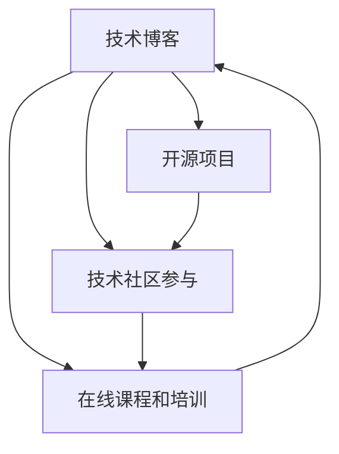
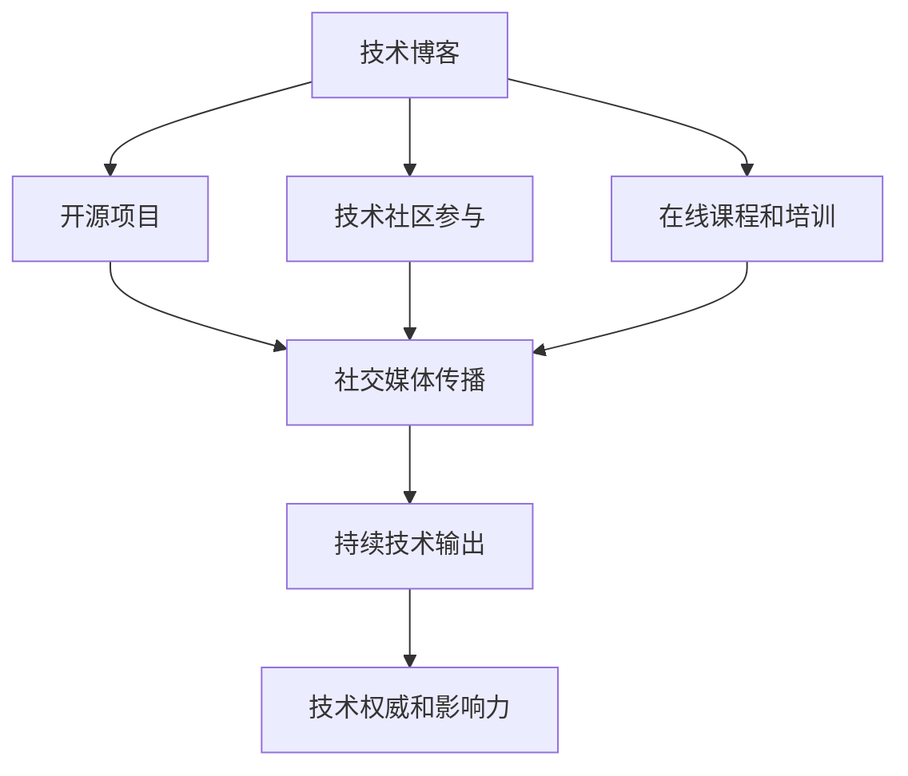

                 

## 1. 背景介绍

在数字化转型加速的今天，个人品牌建设已成为程序员职业发展的重要一环。拥有强大个人品牌的程序员不仅在职场上具有更强的竞争力，还能在技术社区、开源项目中收获更多资源和关注。因此，了解如何建立并维护个人品牌，对于每个程序员来说都至关重要。

### 1.1 问题由来
随着互联网技术的发展，越来越多的程序员通过在线平台（如GitHub、Stack Overflow、Medium等）展示自己的技术能力和项目成果。这些平台不仅提供了展示技术的机会，也汇聚了大量的技术资源和人才。在这样的背景下，如何通过自己的技术贡献和专业影响力，建立起独特的个人品牌，成为每个程序员必须思考的问题。

### 1.2 问题核心关键点
个人品牌建设的核心在于通过持续的技术输出和积极的社区互动，树立自己在技术领域的独特地位。这一过程涉及多个环节，包括技术实践、内容创作、社区互动、个人网络等。本文将从这些关键点出发，详细探讨程序员如何通过技术实践和社区活动，构建并维护强大的个人品牌。

### 1.3 问题研究意义
在当今信息爆炸的时代，个人品牌的建立不仅有助于提升程序员的知名度和影响力，还能为其带来更多的职业机会和资源。通过系统的个人品牌建设，程序员可以在技术社群中建立起声誉，吸引更多的关注和合作，从而在职业生涯中取得更大的成功。

## 2. 核心概念与联系

### 2.1 核心概念概述

为更好地理解如何建立个人品牌，本节将介绍几个密切相关的核心概念：

- **个人品牌建设**：通过展示技术能力、分享知识和经验，在技术社区中树立个人形象和技术权威的过程。
- **技术博客**：通过撰写技术文章，分享解决问题的思路和代码实现，展示个人技术深度和广度。
- **开源项目**：在GitHub等平台上，公开自己的代码和项目，展示解决实际问题的能力，促进技术交流和合作。
- **技术社区参与**：在Stack Overflow、Reddit等技术社区活跃，解答问题，参与讨论，扩大技术影响力和知名度。
- **在线课程和培训**：通过教授技术课程，提供培训机会，展示技术讲解和教学能力，提升个人品牌价值。

这些核心概念之间存在紧密联系，共同构成了个人品牌建设的完整生态系统。以下是一个简化的Mermaid流程图，展示了这些概念之间的关系：



这个流程图展示了技术博客、开源项目、技术社区参与、在线课程和培训之间的相互作用：

1. 技术博客为开源项目提供内容支撑。
2. 开源项目展示技术实践能力，吸引社区关注。
3. 技术社区参与促进技术交流，提升个人影响力。
4. 在线课程和培训增强教学能力，扩大个人品牌。

通过这些核心概念的协同作用，程序员可以全方位展示自己的技术能力，构建和维护强大的个人品牌。

### 2.2 概念间的关系

这些核心概念之间存在以下关系：

- **相互促进**：技术博客、开源项目、社区参与、在线课程等活动互相促进，共同提升个人品牌。
- **内容共享**：技术博客和开源项目中分享的内容，可以在技术社区和课程中重复使用，提升效率。
- **知识积累**：通过技术博客、社区参与和课程教学，知识体系不断积累，提升个人专业深度和广度。
- **资源扩展**：开源项目和课程教学吸引了更多的关注和参与者，扩展了个人资源和影响力。

综上所述，个人品牌建设是一个系统性工程，涉及技术实践、内容创作、社区互动和资源扩展等多个环节。只有在各个环节中不断精进和优化，才能建立起独特且强大的个人品牌。

## 3. 核心算法原理 & 具体操作步骤
### 3.1 算法原理概述

个人品牌建设本质上是一个持续的、多维度的技术影响力和社会影响力的提升过程。其核心算法原理包括：

1. **技术输出**：通过高质量的技术博客、开源项目、技术社区互动等，持续输出有价值的技术内容和知识。
2. **内容传播**：利用社交媒体、技术博客、GitHub等平台，广泛传播个人技术内容，吸引更多关注和互动。
3. **社区互动**：积极参与技术社区的讨论和问题解答，建立技术权威和影响力。
4. **资源积累**：通过技术教学和开源项目，积累技术资源和团队合作经验。

这些原理共同作用，推动个人品牌的构建和维护。以下是一个简单的流程图，展示了个人品牌建设的关键步骤：



这个流程图展示了技术博客、开源项目、社区互动、在线课程和社交媒体传播之间的相互作用，共同推动个人品牌的构建和维护。

### 3.2 算法步骤详解

下面是建立个人品牌的关键步骤：

**Step 1: 选择合适的技术平台**
- 选择一个或多个适合自己的技术平台，如GitHub、Medium、Stack Overflow等。
- 注册账号，完善个人资料和代码仓库信息。

**Step 2: 持续技术输出**
- 定期在技术博客上发布高质量的技术文章，分享解决问题的思路和代码实现。
- 将技术博客与GitHub代码仓库关联，让更多人通过博客了解项目。
- 积极参与技术社区的讨论，回答问题，提供有价值的见解。
- 开设在线课程和培训，教授编程技能和知识。

**Step 3: 广泛传播**
- 利用社交媒体平台（如Twitter、LinkedIn等）传播个人技术内容。
- 通过技术博客的SEO优化，提升博客的搜索排名，吸引更多访问者。
- 参与技术会议、黑客马拉松等活动，扩大个人影响力。

**Step 4: 社区互动**
- 在技术社区（如Stack Overflow、Reddit）上活跃，回答问题，提供帮助。
- 参与开源项目，贡献代码，与开发者交流合作。
- 在GitHub上发布技术贡献和项目进展，展示技术实践能力。

**Step 5: 持续优化**
- 定期回顾个人品牌建设的效果，调整策略，优化输出内容。
- 获取反馈，改进技术水平和社区互动方式。
- 保持学习和创新，不断提升技术深度和广度。

### 3.3 算法优缺点

个人品牌建设的优点包括：

1. **展示能力**：通过技术博客和开源项目展示技术实力，吸引更多关注和合作机会。
2. **提升知名度**：积极参与技术社区和开源项目，建立技术权威和影响力。
3. **资源扩展**：通过技术教学和开源合作，积累技术和人力资源。

其缺点则主要包括：

1. **时间和精力成本高**：持续的技术输出和社区互动需要大量时间和精力。
2. **竞争激烈**：技术社区和开源平台上有大量活跃的开发者，建立个人品牌需要持续的努力和创新。
3. **内容质量要求高**：技术输出需要高质量的内容，才能吸引和保持读者兴趣。

尽管存在这些局限，但个人品牌建设仍然是程序员职业发展的重要途径。通过持续的技术输出和社区互动，程序员可以提升知名度和影响力，获得更多的职业机会和资源。

### 3.4 算法应用领域

个人品牌建设在多个领域都具有广泛的应用，包括但不限于：

1. **软件开发和编程**：通过技术博客和开源项目展示编程技能和软件实现。
2. **数据科学和机器学习**：分享数据分析、模型训练和调优经验。
3. **系统架构和运维**：分享系统设计、优化和故障排查经验。
4. **移动开发和前端技术**：展示移动应用开发、前端框架和用户体验设计能力。
5. **教育和技术培训**：开设在线课程，教授编程语言和软件技能。

除了这些领域，个人品牌建设还适用于产品经理、项目经理、产品经理等技术管理岗位，通过技术影响力和项目管理能力，提升个人在职场中的地位和影响力。

## 4. 数学模型和公式 & 详细讲解  
### 4.1 数学模型构建

在个人品牌建设中，数学模型主要应用于评估个人技术影响力和社交影响力的变化。以下是一个简化的数学模型框架：

假设个人品牌影响力 $I(t)$ 随时间 $t$ 的变化可以用如下数学模型表示：

$$
I(t+1) = f(I(t), \Delta t, f_I(t))
$$

其中，$f$ 是影响因素函数，$\Delta t$ 是时间间隔，$f_I(t)$ 是技术输出和社区互动的影响因子。

### 4.2 公式推导过程

1. **技术输出影响**：假设技术博客每月发布 $n$ 篇文章，每篇文章的阅读量为 $R$，总阅读量为 $N$，则技术输出的影响因子 $f_{blog}$ 可以表示为：

$$
f_{blog}(t) = n \cdot R \cdot t
$$

2. **社区互动影响**：假设每月在技术社区回答问题 $m$ 个，每回答问题的平均点赞量为 $P$，总点赞量为 $M$，则社区互动的影响因子 $f_{community}$ 可以表示为：

$$
f_{community}(t) = m \cdot P \cdot t
$$

3. **社交媒体传播影响**：假设每篇文章通过社交媒体传播的次数为 $S$，总传播次数为 $S_{total}$，则社交媒体传播的影响因子 $f_{social}$ 可以表示为：

$$
f_{social}(t) = S \cdot t
$$

将上述三个影响因子代入个人品牌影响力模型，得：

$$
I(t+1) = I(t) + f_{blog}(t) + f_{community}(t) + f_{social}(t)
$$

这个公式展示了个人品牌影响力随时间的变化规律，其中每个影响因子的具体数值需要根据实际情况进行计算。

### 4.3 案例分析与讲解

假设某程序员每月发布5篇文章，每篇文章平均阅读量为1000次，总阅读量为5000次。每月在技术社区回答10个问题，每回答问题的平均点赞量为5个，总点赞量为50个。同时，每月通过社交媒体传播文章50次。

将这些数值代入上述公式，得到每月个人品牌影响力变化的计算公式：

$$
I(t+1) = I(t) + 5 \cdot 1000 \cdot t + 10 \cdot 5 \cdot t + 50 \cdot t
$$

通过这个计算公式，可以定量分析个人品牌影响力随时间的变化趋势。

## 5. 项目实践：代码实例和详细解释说明
### 5.1 开发环境搭建

在进行个人品牌建设实践前，我们需要准备好开发环境。以下是使用Python进行GitHub开发的环境配置流程：

1. 安装Anaconda：从官网下载并安装Anaconda，用于创建独立的Python环境。

2. 创建并激活虚拟环境：
```bash
conda create -n myenv python=3.8 
conda activate myenv
```

3. 安装GitHub CLI：
```bash
pip install github
```

4. 初始化GitHub账户：
```bash
git init
git remote add origin https://github.com/username/repository.git
```

5. 克隆GitHub代码仓库：
```bash
git clone https://github.com/username/repository.git
cd repository
```

完成上述步骤后，即可在`myenv`环境中开始个人品牌建设实践。

### 5.2 源代码详细实现

下面以技术博客为例，展示如何使用GitHub开发和发布高质量的技术文章。

首先，定义技术博客的基本框架：

```python
from flask import Flask, render_template, request

app = Flask(__name__)

@app.route('/')
def index():
    return render_template('index.html')

@app.route('/post/<id>', methods=['GET', 'POST'])
def post(id):
    if request.method == 'POST':
        # 处理文章发布
        pass
    return render_template('post.html', id=id)
```

然后，实现技术博客的发布和阅读功能：

```python
@app.route('/post/new')
def new_post():
    return render_template('new_post.html')

@app.route('/post/<id>/edit', methods=['GET', 'POST'])
def edit_post(id):
    if request.method == 'POST':
        # 处理文章编辑
        pass
    return render_template('edit_post.html', id=id)
```

最后，启动博客服务：

```bash
app.run(debug=True)
```

启动后，在浏览器中访问 `http://localhost:5000`，即可在浏览器中看到技术博客的基本界面。开发者可以根据具体需求，进一步扩展博客功能，如用户注册、文章评论、阅读统计等。

### 5.3 代码解读与分析

让我们再详细解读一下关键代码的实现细节：

**Flask框架**：
- Flask是一个轻量级的Python Web框架，非常适合开发简单的Web应用。
- `Flask` 提供了路由和模板渲染功能，使得开发者可以方便快捷地创建Web应用。
- 使用Flask开发博客时，可以在模板中自由设置HTML结构，展示博客文章。

**路由和模板**：
- Flask的路由机制允许开发者根据URL路径自动调用相应的视图函数。
- 通过模板引擎（如Jinja2），开发者可以在模板中动态生成HTML页面，展示博客文章内容。
- 开发者可以进一步扩展博客功能，如用户注册、文章评论、阅读统计等。

**GitHub CLI**：
- GitHub CLI是GitHub官方提供的命令行工具，用于在本地管理GitHub仓库。
- 通过GitHub CLI，开发者可以在本地克隆、推送代码，方便进行代码管理和共享。
- 开发者还可以使用GitHub CLI进行pull requests、issue评论等操作，促进社区互动。

完成这些代码实现后，开发者可以在本地搭建技术博客，展示个人技术能力和项目成果。通过持续的技术输出和社区互动，逐渐建立起个人品牌。

### 5.4 运行结果展示

假设某开发者在GitHub上搭建了技术博客，并持续发布高质量的技术文章。通过GitHub Pages部署博客，访问链接为 `https://username.github.io/repository/`。该博客包含了技术文章、GitHub仓库链接和社交媒体分享按钮，形成一个完整的个人品牌展示平台。

开发者可以将博客链接分享至社交媒体平台，吸引更多人关注。通过博客的SEO优化，提升搜索引擎排名，进一步扩大个人品牌影响力。

## 6. 实际应用场景
### 6.1 软件开发和编程

在软件开发和编程领域，个人品牌建设尤为重要。通过技术博客和开源项目展示编程技能和软件实现，可以吸引更多技术爱好者关注。开发者可以定期发布项目进展、代码优化、问题解决方案等，逐步树立技术权威和影响力。

例如，某开发者可以定期在GitHub上发布自己开发的项目，如自动化测试工具、数据处理框架等，并在技术博客上分享项目实现细节和优化思路。这些内容不仅能展示开发者的技术能力，还能吸引更多开发者关注和合作，提升项目的知名度和影响力。

### 6.2 数据科学和机器学习

数据科学和机器学习领域也需要强大的个人品牌。通过分享数据分析、模型训练和调优经验，开发者可以展示自己在数据处理和算法设计上的专业能力。

例如，某数据科学家可以定期在技术博客上分享自己的数据分析项目，如实时数据监控系统、推荐算法等。通过详细的代码实现和分析思路，展示自己在数据处理和算法调优上的深度和广度。同时，参与开源项目，提供数据集和代码示例，扩大自己的技术影响力和合作机会。

### 6.3 系统架构和运维

系统架构和运维领域的开发者可以通过技术博客和开源项目展示自己在系统设计和故障排查方面的专业能力。通过分享架构设计、优化建议和问题解决案例，展示自己的技术深度和广度。

例如，某系统架构师可以定期在技术博客上分享自己的架构设计和优化思路，如微服务架构、容器化部署、云原生架构等。通过详细的架构图和实现代码，展示自己在大规模系统设计和优化上的专业能力。同时，参与开源项目，提供架构设计和部署方案，扩大自己的技术影响力和合作机会。

### 6.4 移动开发和前端技术

移动开发和前端技术领域的开发者可以通过技术博客和开源项目展示自己的移动应用开发、前端框架和用户体验设计能力。通过分享开发技巧和设计思路，展示自己的技术深度和广度。

例如，某移动应用开发者可以定期在技术博客上分享自己的应用设计和开发经验，如原生应用开发、跨平台框架等。通过详细的实现代码和设计思路，展示自己在移动应用开发和用户体验设计上的专业能力。同时，参与开源项目，提供设计方案和代码示例，扩大自己的技术影响力和合作机会。

## 7. 工具和资源推荐
### 7.1 学习资源推荐

为了帮助开发者系统掌握个人品牌建设的技术基础和实践技巧，这里推荐一些优质的学习资源：

1. **《Flask Web Development》**：Flask官方文档，详细介绍了如何使用Flask构建Web应用，适合Flask入门和进阶学习。
2. **《Python Web Development with Django》**：Django官方文档，详细介绍了如何使用Django构建Web应用，适合Django入门和进阶学习。
3. **《GitHub Programming with GitHub CLI》**：GitHub官方博客，详细介绍了如何使用GitHub CLI进行GitHub仓库管理和协作，适合GitHub开发和协作学习。
4. **《The GitHub Handbook》**：GitHub官方手册，提供了GitHub平台的使用和开发指南，适合GitHub开发和协作学习。
5. **《Deep Learning with PyTorch》**：PyTorch官方文档，详细介绍了如何使用PyTorch进行深度学习模型的开发和训练，适合深度学习入门和进阶学习。

通过这些资源的学习实践，相信你一定能够快速掌握个人品牌建设的技术基础和实践技巧，为未来的职业发展奠定坚实的基础。

### 7.2 开发工具推荐

高效的开发离不开优秀的工具支持。以下是几款用于个人品牌建设的常用工具：

1. **GitHub**：代码托管和协作平台，提供了强大的代码管理、问题跟踪和协作功能，适合个人品牌建设的代码发布和社区互动。
2. **Flask/Django**：Web框架，提供了灵活的路由和模板渲染功能，适合开发技术博客和Web应用。
3. **GitHub Pages**：静态网站托管服务，可以将技术博客部署到免费的域名，提升访问速度和用户体验。
4. **Google Analytics**：网站流量分析工具，可以统计技术博客的访问量和用户行为，帮助优化SEO和用户体验。
5. **SEO优化工具**：如Yoast SEO、WordPress SEO等，可以帮助优化技术博客的搜索引擎排名，提升访问量。

合理利用这些工具，可以显著提升个人品牌建设的开发效率和效果，快速迭代和优化个人品牌。

### 7.3 相关论文推荐

个人品牌建设的研究领域涉及多个学科，以下是几篇奠基性的相关论文，推荐阅读：

1. **《Personal Branding for Engineers》**：探讨了工程师个人品牌建设的重要性和方法，提供了实用的技术和管理建议。
2. **《Social Media Influencer Branding Strategies》**：研究了社交媒体影响者如何建立个人品牌，提供了多种品牌建设的策略和案例。
3. **《Building an Authoritative Developer Brand Online》**：介绍了技术开发者如何通过技术博客、开源项目和社区互动，建立强大的个人品牌。
4. **《The Art of the GitHub Blog》**：详细介绍了如何使用GitHub博客展示技术项目和分享技术心得，提升个人品牌影响力。

这些论文代表了大规模语言模型微调技术的发展脉络。通过学习这些前沿成果，可以帮助研究者把握学科前进方向，激发更多的创新灵感。

除上述资源外，还有一些值得关注的前沿资源，帮助开发者紧跟个人品牌建设技术的最新进展，例如：

1. **arXiv论文预印本**：人工智能领域最新研究成果的发布平台，包括大量尚未发表的前沿工作，学习前沿技术的必读资源。
2. **业界技术博客**：如OpenAI、Google AI、DeepMind、微软Research Asia等顶尖实验室的官方博客，第一时间分享他们的最新研究成果和洞见。
3. **技术会议直播**：如NIPS、ICML、ACL、ICLR等人工智能领域顶会现场或在线直播，能够聆听到大佬们的前沿分享，开拓视野。
4. **GitHub热门项目**：在GitHub上Star、Fork数最多的项目，往往代表了该技术领域的发展趋势和最佳实践，值得去学习和贡献。
5. **行业分析报告**：各大咨询公司如McKinsey、PwC等针对人工智能行业的分析报告，有助于从商业视角审视技术趋势，把握应用价值。

总之，对于个人品牌建设的学习和实践，需要开发者保持开放的心态和持续学习的意愿。多关注前沿资讯，多动手实践，多思考总结，必将收获满满的成长收益。

## 8. 总结：未来发展趋势与挑战
### 8.1 研究成果总结

本文对如何通过技术博客和开源项目建立个人品牌进行了全面系统的介绍。首先阐述了个人品牌建设的重要性及其在程序员职业发展中的作用，明确了技术输出、社区互动、资源积累等关键环节在个人品牌建设中的重要性。其次，从原理到实践，详细讲解了个人品牌建设的数学模型和具体操作步骤，给出了技术博客和开源项目开发的完整代码实例。同时，本文还广泛探讨了个人品牌建设在软件开发、数据科学、系统架构等诸多领域的应用前景，展示了个人品牌建设的广阔发展空间。

通过本文的系统梳理，可以看到，个人品牌建设是一个系统性工程，涉及技术实践、内容创作、社区互动和资源扩展等多个环节。只有在各个环节中不断精进和优化，才能建立起独特且强大的个人品牌。

### 8.2 未来发展趋势

展望未来，个人品牌建设将呈现以下几个发展趋势：

1. **数字化平台多元化**：随着新兴技术的不断涌现，个人品牌建设将越来越多地依托于数字化平台，如视频平台、社交平台、直播平台等。通过多样化的平台展示技术能力，吸引更多关注和合作。
2. **内容形式多样化**：除了传统的技术博客和开源项目，视频教程、直播讲解、技术播客等形式的内容将更加普及，丰富个人品牌展示的形式和维度。
3. **社区互动精准化**：通过大数据分析和人工智能技术，实现对技术社区用户的精准定位和内容推荐，提升社区互动的有效性和深度。
4. **影响力评估智能化**：利用人工智能技术对个人品牌影响力进行评估和分析，优化个人品牌建设策略，提升品牌建设的效果和效率。
5. **跨领域协作加强**：个人品牌建设将更多地涉及跨领域协作，如技术开发者与产品经理、设计师、市场团队等的协作，共同打造多维度的品牌形象。

这些趋势凸显了个人品牌建设的多元化和智能化方向，进一步丰富了个人品牌建设的生态系统。

### 8.3 面临的挑战

尽管个人品牌建设具有巨大的发展潜力，但在迈向更加智能化、普适化应用的过程中，仍面临诸多挑战：

1. **时间管理难度高**：个人品牌建设需要大量时间和精力，如何在繁忙的工作中平衡技术输出和社区互动，是一大难题。
2. **内容质量要求高**：高质量的技术输出和社区互动需要持续的学习和创新，如何在高强度的工作中保持输出质量，是一大挑战。
3. **市场竞争激烈**：技术社区和开源平台上有大量活跃的开发者，建立个人品牌需要持续的努力和创新。
4. **平台依赖性强**：个人品牌建设高度依赖于平台的支持和社区的互动，一旦平台出现问题或社区氛围发生变化，个人品牌建设可能受到影响。

尽管存在这些挑战，但个人品牌建设仍然是程序员职业发展的重要途径。通过持续的技术输出和社区互动，程序员可以提升知名度和影响力，获得更多的职业机会和资源。

### 8.4 研究展望

面对个人品牌建设所面临的种种挑战，未来的研究需要在以下几个方面寻求新的突破：

1. **自动化工具开发**：开发智能化的内容创作和社区互动工具，帮助开发者更高效地进行个人品牌建设。
2. **社区智能推荐**：利用人工智能技术，实现对技术社区用户的精准定位和内容推荐，提升社区互动的有效性和深度。
3. **跨平台协作框架**：开发跨平台协作框架，实现技术开发者与产品经理、设计师、市场团队等的协作，共同打造多维度的品牌形象。
4. **品牌影响力评估模型**：研究品牌影响力的评估模型，帮助开发者优化个人品牌建设策略，提升品牌建设的效果和效率。
5. **知识图谱和知识库整合**：将符号化的先验知识，如知识图谱、逻辑规则等，与神经网络模型进行巧妙融合，引导个人品牌建设过程学习更准确、合理的技术知识。

这些研究方向的探索，必将引领个人品牌建设技术迈向更高的台阶，为构建安全、可靠、可解释、可控的智能系统铺平道路。面向未来，个人品牌建设技术还需要与其他人工智能技术进行更深入的融合，如知识表示、因果推理、强化学习等，多路径协同发力，共同推动个人品牌建设的进步。只有勇于创新、敢于突破，才能不断拓展个人品牌的边界，让技术人才更好地造福社会。

## 9. 附录：常见问题与解答
**Q1：建立个人品牌需要哪些关键步骤？**

A: 建立个人品牌需要以下关键步骤：
1. 选择合适的技术平台，如GitHub、Medium、Stack Overflow等。
2. 创建并完善个人资料，填写技术背景和项目经验。
3. 持续技术输出，如技术博客、开源项目、技术社区互动等。
4. 广泛传播，如社交媒体分享、SEO优化、技术会议等。
5. 社区互动，如参与讨论、回答问题、开源合作等。
6. 持续优化，根据反馈调整策略，不断提升技术水平和社区互动效果。

**Q2：如何选择适合自己的技术平台？**

A: 选择适合自己的技术平台需要考虑以下因素：
1. 平台的用户群体和活跃度。选择用户基数大、活跃度高的平台，能获得更多的关注和互动。
2. 平台的技术支持和服务质量。选择技术成熟、服务可靠的平台，能确保技术输出和社区互动的稳定性。
3

