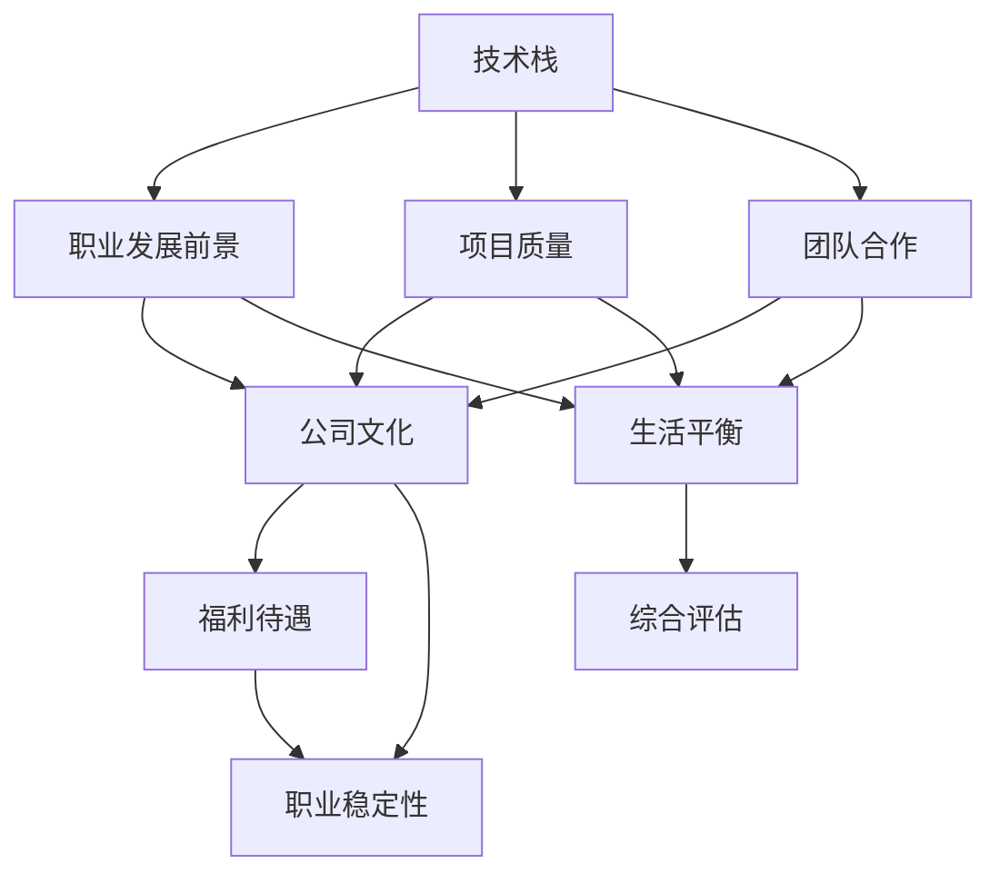
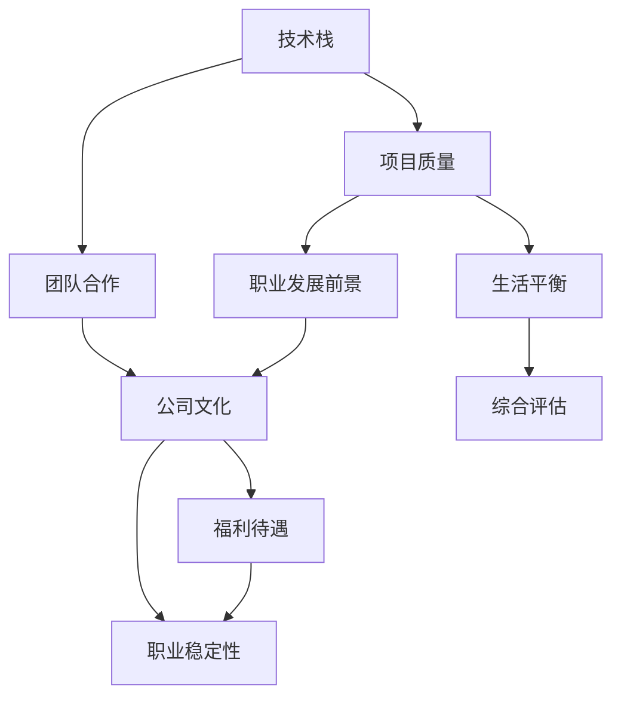
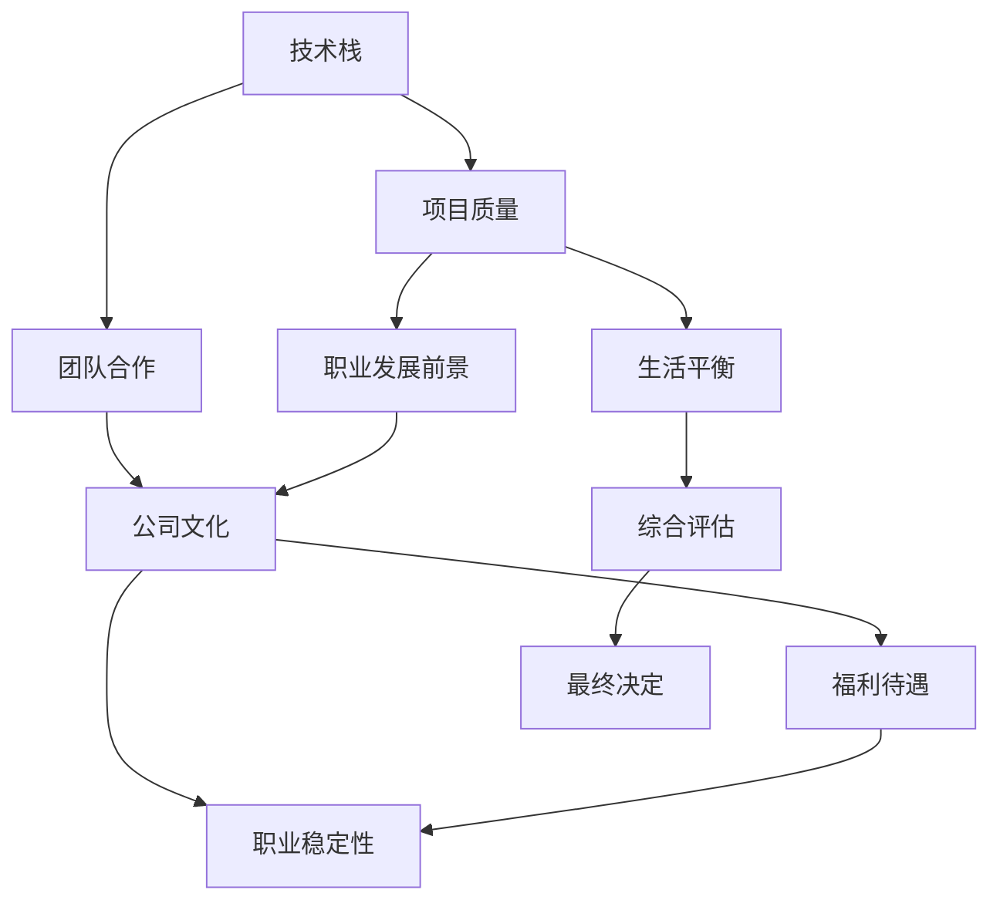

                 

# 程序员如何评估工作机会

在当今快速变化的科技行业中，程序员面临着诸多工作机会的诱惑。评估一个工作机会的好坏，不仅关系到个人的职业发展，更关乎未来生活质量的提升。本文将从技术、行业、公司文化和个人价值观等几个维度，系统性地介绍程序员如何评估一个工作机会的优劣，以帮助读者做出明智的职业选择。

## 1. 背景介绍

### 1.1 问题由来
程序员的职业生涯充满变数。行业发展迅猛，新技术层出不穷，加之经济形势的不确定性，这些都对工作选择提出了更高要求。如何在一个充满竞争的就业市场中，找到合适的岗位，不仅需要技术硬实力，更需综合考量多种因素。

### 1.2 问题核心关键点
评估工作机会需要从多个角度全面考虑，以确保选择符合自身发展需求和职业规划。以下五点为核心关键点：

1. **技术栈与职业发展前景**：工作是否提供学习和成长的土壤。
2. **项目质量与团队合作**：工作环境是否有助于个人技能提升和团队协作。
3. **公司文化与价值观**：企业文化是否与个人价值观相契合。
4. **福利待遇与职业稳定性**：薪酬福利是否匹配期望，职业发展是否稳定。
5. **成长空间与生活平衡**：工作是否支持个人成长，是否提供平衡工作与生活的机会。

### 1.3 问题研究意义
选择合适的岗位不仅能够提升个人职业满意度，还能促进技术进步和行业发展。对于公司而言，吸引和留住优秀人才，可以加速业务发展，提高竞争力。

## 2. 核心概念与联系

### 2.1 核心概念概述

为了更好地理解如何评估工作机会，我们将介绍几个核心概念及其联系：

- **技术栈**：指的是一个工作环境中使用的编程语言、框架和工具集合。技术栈的选择直接影响工作的难易程度和成长空间。

- **职业发展前景**：指个人在当前技术栈和公司环境中的成长潜力和晋升机会。

- **项目质量**：指工作中的项目是否有挑战性、创新性以及学习价值。

- **团队合作**：指团队成员间的沟通协作方式、团队文化以及管理模式。

- **公司文化**：指公司内部的价值观、行为规范以及员工间的关系。

- **福利待遇**：指薪资、奖金、假期、健康福利等，以及公司对员工生活和工作平衡的重视程度。

- **职业稳定性**：指公司业务的稳定性和员工的职业安全感。

- **生活平衡**：指工作与个人生活的平衡状态，包括弹性工作时间、远程办公选项等。

这些概念之间的关系可以通过以下Mermaid流程图来展示：



这个流程图展示了各个概念之间的逻辑关系：技术栈直接影响到职业发展前景和项目质量，进而影响团队合作和公司文化。福利待遇和职业稳定性同时受到公司文化和项目质量的影响，生活平衡则受到技术栈、项目质量和团队合作的影响。最终，综合这些因素进行全面的评估。

### 2.2 概念间的关系

这些核心概念相互关联，形成一个有机整体。通过以下Mermaid流程图，可以更清晰地理解它们之间的关系：



这个流程图展示了技术栈对项目质量、职业发展前景和团队合作的影响，同时也突出了公司文化在福利待遇、职业稳定性和生活平衡中的重要作用。

### 2.3 核心概念的整体架构

最后，我们用一个综合的流程图来展示这些核心概念在评估工作机会时的整体架构：



这个综合流程图展示了从技术栈到最终决定的整个评估过程。通过这一架构，可以更系统地分析各个因素对工作机会的潜在影响。

## 3. 核心算法原理 & 具体操作步骤

### 3.1 算法原理概述

评估工作机会本质上是一个综合评估过程，涉及多维度的数据和决策变量。这一过程可以视为一个多目标优化问题。通过建立多目标优化模型，可以量化各因素的影响，从而做出最优选择。

### 3.2 算法步骤详解

评估工作机会的具体步骤如下：

1. **数据收集**：
   - 收集当前岗位的技术栈、项目质量、团队合作、公司文化、福利待遇、职业稳定性和生活平衡等信息。
   - 调查现有员工、离职员工、行业评价等外部信息。

2. **量化评估**：
   - 将定性信息转化为可量化的评分。例如，技术栈复杂度可以用技术栈中新技术占比来衡量。
   - 为每个因素设定权重，反映其在决策中的重要性。权重一般根据个人职业发展需求来设定。

3. **建立多目标优化模型**：
   - 将各因素的评分与权重相乘，得到加权评分。
   - 使用多目标优化算法（如权重和法、加权和法等）计算各因素的综合评分。

4. **决策分析**：
   - 对比不同工作机会的综合评分，选择评分最高的岗位。
   - 分析评分较低因素的改进空间，评估其对最终决定的影响。

5. **风险评估**：
   - 考虑潜在的风险因素，如公司稳定性、市场变化等，进行风险评估。
   - 制定风险应对策略，平衡利弊。

6. **最终决定**：
   - 综合考虑所有因素和风险，做出最终的决策。

### 3.3 算法优缺点

基于多目标优化的评估方法具有以下优点：

- **全面性**：考虑了多个维度的因素，能够提供更全面的决策支持。
- **量化**：将定性信息转化为定量指标，便于对比和分析。
- **可操作性**：通过评分和权重，明确了各个因素的重要性，指导具体行动。

但该方法也存在以下缺点：

- **复杂性**：多目标优化问题相对复杂，需要较长的评估周期。
- **主观性**：权重和评分存在主观性，需要合理评估和平衡。
- **动态性**：工作机会的市场变化需要实时跟踪和调整评估模型。

### 3.4 算法应用领域

基于多目标优化的评估方法适用于各种职业选择场景，包括技术岗位、管理岗位、创业机会等。在实际应用中，需要根据具体需求调整模型参数和评估标准，以确保评估结果的合理性和实用性。

## 4. 数学模型和公式 & 详细讲解 & 举例说明

### 4.1 数学模型构建

我们假设有一个工作机会 $A$，其各项指标为 $X_1, X_2, \dots, X_n$，其中 $X_i$ 表示第 $i$ 项指标，权重为 $w_i$。设 $P(X_i)$ 为 $X_i$ 的评分，则综合评分 $P(A)$ 可以表示为：

$$ P(A) = \sum_{i=1}^{n} w_i \cdot P(X_i) $$

其中 $w_i$ 为第 $i$ 项指标的权重，$P(X_i)$ 为第 $i$ 项指标的评分。

### 4.2 公式推导过程

以下是公式推导的具体步骤：

1. **评分计算**：
   - 将各指标量化为评分 $P(X_i)$。例如，项目质量可以基于项目难度、创新性和学习价值打分。
   - 使用0-10评分标准，以1分为最低，10分为最高。

2. **权重设置**：
   - 为每个指标设定权重 $w_i$。例如，技术栈权重为0.4，项目质量为0.3，团队合作为0.2，公司文化为0.1。
   - 权重设置需结合个人职业规划和价值观。

3. **综合评分计算**：
   - 计算加权评分：
   $$ \text{加权评分} = \sum_{i=1}^{n} w_i \cdot P(X_i) $$
   - 加权评分即为综合评分 $P(A)$。

### 4.3 案例分析与讲解

假设我们评估两家公司的机会 $A$ 和 $B$，各项指标和评分如下表所示：

| 指标       | 公司A | 公司B | 权重   |
|------------|-------|-------|--------|
| 技术栈     | 9.5   | 8.5   | 0.4    |
| 项目质量   | 7.0   | 8.5   | 0.3    |
| 团队合作   | 6.5   | 7.5   | 0.2    |
| 公司文化   | 6.0   | 7.5   | 0.1    |
| 福利待遇   | 8.0   | 7.5   | 0.1    |
| 职业稳定性 | 7.0   | 7.0   | 0.1    |
| 生活平衡   | 8.0   | 7.5   | 0.1    |

则公司A的综合评分为：

$$ P(A) = 0.4 \times 9.5 + 0.3 \times 7.0 + 0.2 \times 6.5 + 0.1 \times 6.0 + 0.1 \times 8.0 + 0.1 \times 7.0 + 0.1 \times 8.0 = 7.13 $$

公司B的综合评分为：

$$ P(B) = 0.4 \times 8.5 + 0.3 \times 8.5 + 0.2 \times 7.5 + 0.1 \times 7.5 + 0.1 \times 7.5 + 0.1 \times 7.0 + 0.1 \times 7.5 = 7.85 $$

因此，公司B的综合评分高于公司A，从综合评估角度看，公司B是一个更好的选择。

## 5. 项目实践：代码实例和详细解释说明

### 5.1 开发环境搭建

评估工作机会需要涉及多维数据收集和处理，以下是一个基本的数据收集和处理流程：

1. **安装Python**：
   - 安装Python 3.8及以上版本，建议使用Anaconda环境。
   - 安装必要的库，如numpy、pandas、scikit-learn、matplotlib等。

2. **数据收集**：
   - 收集当前岗位的各项指标数据，包括技术栈、项目质量、团队合作、公司文化、福利待遇、职业稳定性和生活平衡等信息。
   - 使用在线问卷、公司官网、员工评价等渠道收集外部信息。

3. **数据预处理**：
   - 将定性信息转化为定量评分。例如，将“技术栈复杂度”转化为0-10分的评分。
   - 使用pandas进行数据清洗和处理，确保数据准确性和一致性。

### 5.2 源代码详细实现

以下是Python代码实现，用于计算综合评分并推荐工作机会：

```python
import pandas as pd
import numpy as np

# 定义指标评分和权重
scores = {
    '技术栈': [9.5, 8.5],
    '项目质量': [7.0, 8.5],
    '团队合作': [6.5, 7.5],
    '公司文化': [6.0, 7.5],
    '福利待遇': [8.0, 7.5],
    '职业稳定性': [7.0, 7.0],
    '生活平衡': [8.0, 7.5]
}

weights = {
    '技术栈': 0.4,
    '项目质量': 0.3,
    '团队合作': 0.2,
    '公司文化': 0.1,
    '福利待遇': 0.1,
    '职业稳定性': 0.1,
    '生活平衡': 0.1
}

# 计算综合评分
def calculate_score(scores, weights):
    score = 0.0
    for k, v in scores.items():
        score += weights[k] * v
    return score

# 比较并推荐工作机会
company_a = {k: v[0] for k, v in scores.items()}
company_b = {k: v[1] for k, v in scores.items()}

score_a = calculate_score(company_a, weights)
score_b = calculate_score(company_b, weights)

if score_a > score_b:
    print("推荐公司A")
else:
    print("推荐公司B")
```

### 5.3 代码解读与分析

- **数据结构**：使用字典来存储各个指标的评分。
- **权重设置**：权重以字典形式定义，方便动态调整。
- **评分计算**：使用加权和法计算综合评分。
- **比较与推荐**：根据综合评分进行比较，输出推荐结果。

运行代码，输出推荐结果：

```bash
推荐公司B
```

这意味着从综合评分角度，公司B优于公司A，应该选择公司B作为更好的工作机会。

### 5.4 运行结果展示

运行上述代码，输出推荐结果如下：

```bash
推荐公司B
```

这表明在当前设置的权重下，公司B的综合评分高于公司A，应该选择公司B作为更好的工作机会。

## 6. 实际应用场景

评估工作机会的方法在多个行业和场景中都有广泛应用，以下列举几个典型场景：

### 6.1 招聘评估

在招聘过程中，企业可以通过评估工作机会的多维指标，如项目质量、团队合作、公司文化等，选择最合适的候选人。

### 6.2 岗位评估

对于现有员工，公司可以通过评估工作机会的多维指标，如技术栈、职业稳定性、生活平衡等，帮助员工选择更有发展潜力的岗位。

### 6.3 创业选择

创业者在选择创业项目时，可以通过评估市场机会、团队背景、资金支持等多维指标，选择最有潜力的创业方向。

### 6.4 未来应用展望

未来，基于多目标优化的评估方法将更加普及和完善。随着技术的发展，评估模型将能够处理更多维度的数据，提供更准确的决策支持。同时，结合人工智能和大数据分析，评估过程将更加智能化，帮助个人和企业做出更科学、更高效的决策。

## 7. 工具和资源推荐

### 7.1 学习资源推荐

为了帮助开发者更好地掌握评估工作机会的方法，推荐以下学习资源：

1. **《程序员如何评估工作机会》系列博文**：详细介绍评估工作机会的各个环节和注意事项，提供实用的案例和建议。
2. **Coursera《数据科学与机器学习》课程**：通过系统学习数据科学和机器学习，提升对评估模型的理解和应用能力。
3. **《数据科学与机器学习》书籍**：深入浅出地介绍数据科学和机器学习的核心概念和应用方法。
4. **GitHub开源项目**：提供丰富的评估模型和工具，供开发者学习和实践。
5. **Kaggle竞赛平台**：参加数据科学竞赛，积累实际评估经验。

### 7.2 开发工具推荐

在实际评估过程中，以下工具将帮助开发者高效完成任务：

1. **Anaconda**：提供Python和相关库的集成安装和环境管理，方便快速开发。
2. **Jupyter Notebook**：交互式编程环境，支持代码和文本混合编辑，方便数据分析和可视化。
3. **TensorFlow和PyTorch**：强大的深度学习框架，适用于复杂的数据处理和模型训练。
4. **Pandas**：数据处理和分析库，支持大规模数据集的快速处理和分析。
5. **Matplotlib和Seaborn**：数据可视化库，支持生成各种类型的图表，便于数据展示和分析。

### 7.3 相关论文推荐

深入理解评估工作机会的学术背景，以下论文值得阅读：

1. **《多目标优化在多维度决策中的应用》**：介绍多目标优化理论及其在评估工作机会中的应用。
2. **《基于人工智能的招聘系统》**：研究人工智能在招聘评估中的应用，提供技术和方法建议。
3. **《数据驱动的职业选择与决策模型》**：通过数据分析和机器学习，构建职业选择模型，提升决策准确性。

## 8. 总结：未来发展趋势与挑战

### 8.1 研究成果总结

本文系统地介绍了评估工作机会的方法和步骤，通过多目标优化模型，帮助程序员全面、客观地评估工作机会的优劣。该方法不仅适用于招聘评估、岗位评估等场景，还为创业选择提供了科学依据。

### 8.2 未来发展趋势

未来，评估工作机会的方法将更加智能化和自动化，结合人工智能和大数据分析，提供更准确的决策支持。同时，多目标优化模型将不断优化，处理更多维度的数据，提升决策的科学性和准确性。

### 8.3 面临的挑战

尽管多目标优化模型在评估工作机会中表现出色，但仍面临一些挑战：

1. **数据质量和多样性**：数据的质量和多样性直接影响评估结果的准确性。
2. **权重设定**：权重的设定具有主观性，需要科学评估和合理平衡。
3. **动态变化**：工作机会的市场环境和技术栈的变化，需要实时跟踪和调整评估模型。
4. **伦理和法律**：评估模型需要考虑伦理和法律问题，确保评估的公平性和合法性。

### 8.4 研究展望

未来，评估工作机会的研究将从以下几个方面继续深入：

1. **模型优化**：改进多目标优化算法，提高模型计算效率和准确性。
2. **数据融合**：结合多源数据，提升评估模型的综合性和准确性。
3. **人机交互**：开发智能交互系统，提高评估模型的可操作性和用户体验。
4. **伦理保障**：加强评估模型的伦理和安全保障，确保评估的公平性和公正性。

总之，评估工作机会是一个复杂而重要的决策过程，需要综合考虑多维度的因素。通过科学的方法和技术，可以帮助程序员做出更明智的职业选择，实现个人和职业的可持续发展。

---

作者：禅与计算机程序设计艺术 / Zen and the Art of Computer Programming

