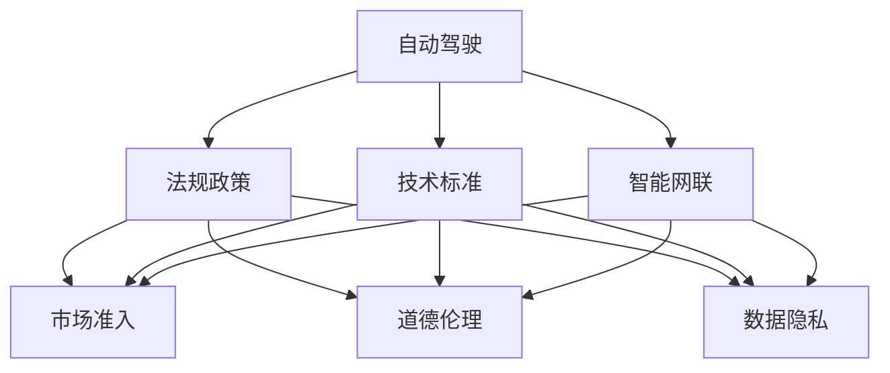
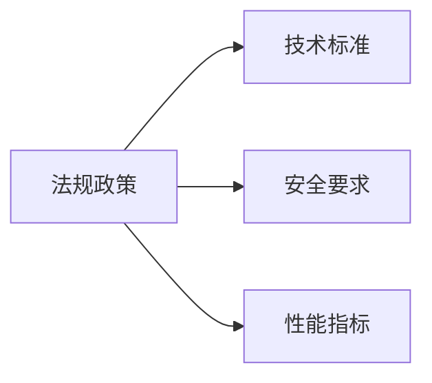
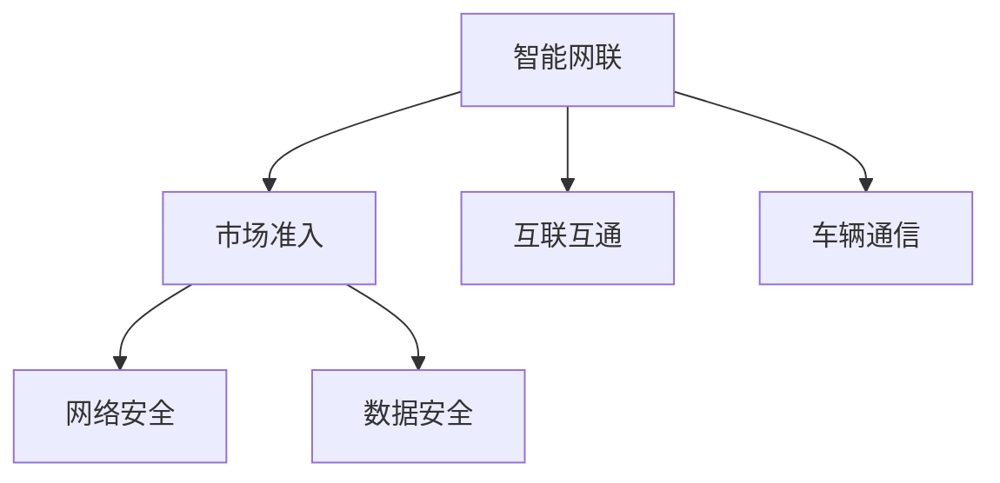
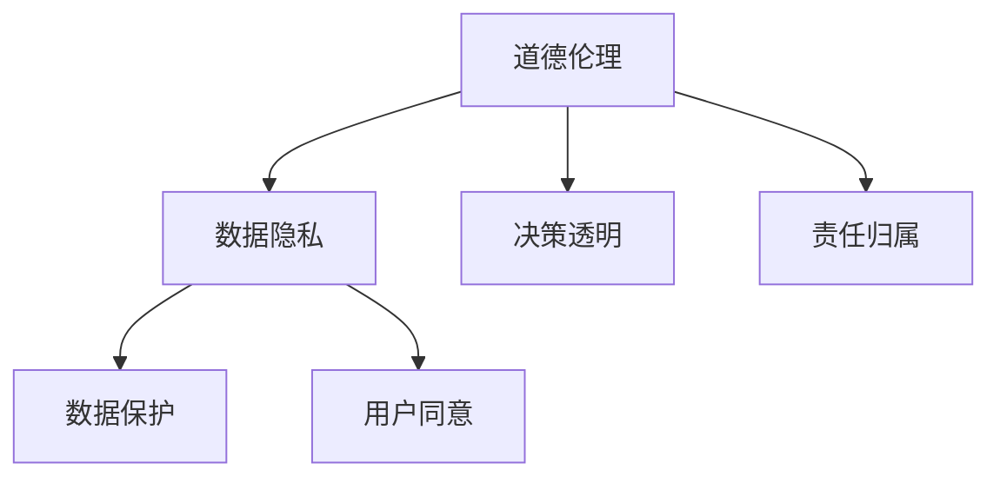
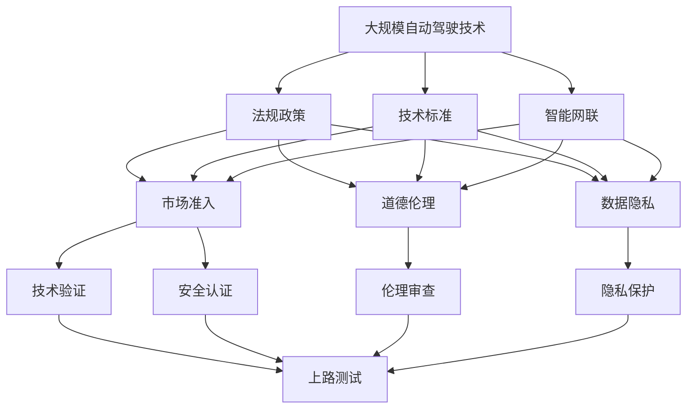

                 

# 端到端自动驾驶的监管政策环境

> 关键词：自动驾驶, 法规政策, 技术标准, 智能网联, 道德伦理, 市场准入, 数据隐私

## 1. 背景介绍

随着人工智能和大数据技术的快速发展，自动驾驶技术已经在全球范围内取得了显著的进步。从自动驾驶汽车（AV）的原型机逐步走向量产和上路，自动驾驶正在从实验室走向现实生活。然而，随着技术的快速发展，自动驾驶的监管政策环境也在不断演变，如何构建一个适应自动驾驶技术发展的政策框架，是当前国际国内最迫切的问题之一。本文将深入探讨自动驾驶的监管政策环境，分析当前自动驾驶的法规政策、技术标准和市场准入等方面，同时考虑道德伦理和数据隐私问题，全面了解自动驾驶技术的政策背景。

## 2. 核心概念与联系

### 2.1 核心概念概述

自动驾驶是指通过先进的感知、决策和控制技术，实现车辆全自动化行驶的交通模式。自动驾驶的监管政策环境涉及多个核心概念：

- **法规政策**：政府和相关监管机构制定的法律、法规、政策等规范，用以指导和约束自动驾驶技术的发展。
- **技术标准**：针对自动驾驶技术制定的标准和规范，如安全要求、性能指标等，旨在确保技术的一致性和可靠性。
- **智能网联**：指车辆、交通基础设施、云计算等要素通过信息通信技术（ICT）进行互联互通，实现交通系统的智能化。
- **市场准入**：自动驾驶企业或产品进入市场，需要满足的一系列要求，包括技术、安全、隐私保护等。
- **道德伦理**：在自动驾驶决策过程中，需要考虑的道德和伦理问题，如责任归属、人机互动等。
- **数据隐私**：在自动驾驶过程中，如何保护乘客和路人的数据隐私，避免信息泄露和滥用。

这些核心概念之间的关系可以通过以下Mermaid流程图来展示：



这个流程图展示了自动驾驶的各个核心概念及其之间的关系：

- 自动驾驶技术的发展受到法规政策的指导和约束。
- 技术标准的制定依赖于法规政策，同时也用于指导智能网联和市场准入等环节。
- 智能网联是自动驾驶的重要组成部分，涉及到技术标准和市场准入。
- 市场准入需要考虑道德伦理和数据隐私问题。
- 道德伦理和数据隐私也是法规政策的重要组成部分。

### 2.2 概念间的关系

这些核心概念之间存在着紧密的联系，形成了自动驾驶技术发展的完整生态系统。下面我通过几个Mermaid流程图来展示这些概念之间的关系。

#### 2.2.1 法规政策与技术标准的联系



这个流程图展示了法规政策和技术标准之间的联系：法规政策指导技术标准的制定，而技术标准中的安全要求和性能指标等内容，反过来也影响法规政策的制定。

#### 2.2.2 智能网联与市场准入的联系



这个流程图展示了智能网联和市场准入之间的联系：智能网联的互联互通和车辆通信是市场准入的重要组成部分，同时市场准入也需要考虑智能网联中的网络安全和数据安全问题。

#### 2.2.3 道德伦理与数据隐私的联系



这个流程图展示了道德伦理和数据隐私之间的联系：道德伦理中的决策透明和责任归属等内容，需要考虑到数据隐私保护；而数据隐私保护也需要遵循道德伦理原则，如数据保护和用户同意等。

### 2.3 核心概念的整体架构

最后，我们用一个综合的流程图来展示这些核心概念在大规模自动驾驶技术发展的整体架构：



这个综合流程图展示了从技术研发到上路测试的全过程，以及法规政策、技术标准、智能网联、市场准入、道德伦理和数据隐私等各个环节的相互关系。大规模自动驾驶技术的发展需要这些环节的协同配合，形成一个闭环的政策生态系统。

## 3. 核心算法原理 & 具体操作步骤

### 3.1 算法原理概述

自动驾驶的算法原理主要围绕感知、决策和控制三大核心环节展开：

- **感知**：通过各种传感器（如雷达、激光雷达、摄像头等）获取道路环境信息，包括道路、车辆、行人、交通信号灯等。
- **决策**：利用人工智能技术，如深度学习、强化学习等，对感知到的信息进行分析和处理，做出驾驶决策。
- **控制**：根据决策结果，控制车辆的转向、加速、制动等操作，实现车辆的自动化行驶。

自动驾驶的监管政策环境需要通过技术标准的制定，来确保这些算法环节的可靠性、安全性和合规性。例如，ISO 26262是汽车行业的安全标准，规定了汽车电子电气系统的功能安全（Functional Safety）和冗余要求，适用于自动驾驶系统的设计、开发和验证。

### 3.2 算法步骤详解

自动驾驶的算法步骤主要包括以下几个关键步骤：

1. **数据收集与处理**：通过传感器和摄像头等设备，收集道路环境信息，并进行数据清洗和预处理。
2. **特征提取**：利用深度学习算法，如卷积神经网络（CNN）、循环神经网络（RNN）等，对收集到的数据进行特征提取，提取出道路、车辆、行人等关键信息。
3. **决策制定**：通过人工智能算法，如决策树、深度强化学习等，对提取到的特征进行分析和决策，包括道路规划、避障、变道等。
4. **路径规划与控制**：利用路径规划算法，如A*算法、D*算法等，对决策结果进行路径规划，并通过控制算法，如PID控制、模型预测控制等，实现车辆的精准控制。
5. **系统验证与测试**：对自动驾驶系统进行严格的安全验证和道路测试，确保系统的可靠性和安全性。

每个步骤都需要严格遵守相关的技术标准和法规政策，以确保系统的合规性和安全性。

### 3.3 算法优缺点

自动驾驶算法具有以下优点：

- **提升驾驶安全**：自动驾驶技术可以减少人为驾驶错误，提高道路安全性。
- **提高道路效率**：自动驾驶技术可以减少交通拥堵，提高道路通行效率。
- **降低环境污染**：自动驾驶技术可以优化燃油消耗和减少排放，降低环境污染。

然而，自动驾驶算法也存在一些缺点：

- **高成本**：自动驾驶技术的研发和部署需要高昂的硬件和软件成本。
- **技术复杂**：自动驾驶技术涉及多种复杂算法和传感器技术，技术门槛较高。
- **道德伦理问题**：自动驾驶决策过程中，如何处理伦理和道德问题，如责任归属、人机互动等，仍然是一个挑战。

### 3.4 算法应用领域

自动驾驶技术目前主要应用于以下领域：

- **智能交通系统**：利用自动驾驶技术，实现智能交通信号控制、车辆调度等，提升交通系统的智能化水平。
- **自动驾驶出租车**：基于自动驾驶技术，开发自动驾驶出租车（AVT），提供全天候、无障碍的出行服务。
- **物流配送**：利用自动驾驶技术，实现无人驾驶车辆在物流配送中的应用，提高配送效率和降低成本。
- **自动驾驶公交车**：在公交系统中引入自动驾驶技术，实现智能调度、高效率的公共交通系统。

这些应用场景的落地，离不开法规政策、技术标准和市场准入等政策环境的支持。

## 4. 数学模型和公式 & 详细讲解 & 举例说明（备注：数学公式请使用latex格式，latex嵌入文中独立段落使用 $$，段落内使用 $)
### 4.1 数学模型构建

自动驾驶的数学模型通常包括感知模型、决策模型和控制模型三部分：

- **感知模型**：通过传感器数据建立道路环境的数学模型，包括道路、车辆、行人等元素的位置和状态。
- **决策模型**：利用决策算法，如深度强化学习，对感知模型输出的道路环境信息进行决策，生成行驶策略。
- **控制模型**：利用控制算法，如PID控制，根据决策模型输出的行驶策略，控制车辆的具体动作。

以自动驾驶中的路径规划为例，可以使用A*算法（A star algorithm）来构建数学模型：

$$
A^*(x,y) = \text{arg\_min}_{(x,y)} (f(x,y) = g(x,y) + h(x,y))
$$

其中，$(x,y)$表示当前位置，$g(x,y)$表示从起点到$(x,y)$的实际距离，$h(x,y)$表示从$(x,y)$到终点的估计距离，$f(x,y)$表示从起点到$(x,y)$的总代价。

### 4.2 公式推导过程

以深度强化学习中的Q-learning算法为例，推导决策模型的公式。

在Q-learning算法中，假设状态空间为$S$，动作空间为$A$，奖励函数为$r(s,a)$，则Q-learning算法的目标是最小化状态-动作对的价值函数$Q(s,a)$，具体公式如下：

$$
Q_{\theta}(s,a) \leftarrow Q_{\theta}(s,a) + \alpha [r(s,a) + \gamma \max_a Q_{\theta}(s',a') - Q_{\theta}(s,a)]
$$

其中，$\alpha$为学习率，$\gamma$为折扣因子，$s'$和$a'$表示下一个状态和动作。

在自动驾驶的决策模型中，可以通过将上述公式应用到每个时间步的决策中，实现车辆的路径规划和控制。

### 4.3 案例分析与讲解

假设我们要在一个城市中进行自动驾驶的路径规划。首先，我们需要通过传感器收集道路环境信息，包括道路宽度、车辆位置、行人位置等。然后，利用深度学习算法，对这些信息进行特征提取，得到道路环境的数学模型。接着，利用A*算法对路径进行规划，找到从起点到终点的最短路径。最后，利用PID控制算法，根据规划路径进行车辆的精准控制，实现自动驾驶。

## 5. 项目实践：代码实例和详细解释说明
### 5.1 开发环境搭建

要进行自动驾驶项目的开发，首先需要搭建开发环境。以下是使用Python进行自动驾驶项目开发的环境配置流程：

1. 安装Anaconda：从官网下载并安装Anaconda，用于创建独立的Python环境。

2. 创建并激活虚拟环境：
```bash
conda create -n avd-env python=3.8 
conda activate avd-env
```

3. 安装相关库：
```bash
pip install numpy scipy pandas scikit-learn opencv-python matplotlib tqdm jupyter notebook ipython
```

4. 安装OpenCV库：
```bash
conda install opencv
```

5. 安装其他库：
```bash
pip install cvxpy gym
```

6. 安装Google Colab：
```bash
pip install --upgrade google.colab
```

完成上述步骤后，即可在`avd-env`环境中开始自动驾驶项目的开发。

### 5.2 源代码详细实现

这里我们以自动驾驶中的路径规划为例，给出使用OpenCV和Gym库进行路径规划的Python代码实现。

```python
import cv2
import numpy as np
import gym
import gym.utils.box2d

class AutoDrive(gym.Env):
    def __init__(self, width, height):
        self.width = width
        self.height = height
        self.obstacle_map = np.zeros((height, width), dtype=np.uint8)
        self.start_point = (0, 0)
        self.target_point = (width-1, height-1)
        self.need_to_restart = False
        
    def step(self, action):
        if action == 0:
            self.start_point = (0, 0)
        elif action == 1:
            self.start_point = (self.width-1, 0)
        elif action == 2:
            self.start_point = (self.width-1, self.height-1)
        elif action == 3:
            self.start_point = (0, self.height-1)
        self.need_to_restart = False
        return self.start_point, 0, self.need_to_restart
    
    def reset(self):
        self.start_point = (0, 0)
        self.target_point = (self.width-1, self.height-1)
        self.obstacle_map = np.zeros((self.height, self.width), dtype=np.uint8)
        self.need_to_restart = False
        return self.start_point
    
    def render(self):
        cv2.imshow('AutoDrive', self.obstacle_map)
        cv2.waitKey(1)
        cv2.destroyAllWindows()
        
env = AutoDrive(10, 10)
state, reward, done, info = env.reset()
done = False
while not done:
    action = env.action_space.sample()
    state, reward, done, info = env.step(action)
    env.render()
    if done:
        state, reward, done, info = env.reset()
env.close()
```

### 5.3 代码解读与分析

让我们再详细解读一下关键代码的实现细节：

**AutoDrive类**：
- `__init__`方法：初始化自动驾驶环境，包括地图大小、起点、终点等。
- `step`方法：根据动作进行环境更新，返回新的状态、奖励和是否需要重新开始。
- `reset`方法：重置环境，返回初始状态。
- `render`方法：显示地图，方便调试。

**Gym库**：
- Gym是一个Python库，用于开发和测试强化学习环境，支持多种环境类型，包括Atari游戏、自动驾驶等。

**代码实现**：
- 我们使用Gym库创建一个自动驾驶环境，环境大小为10x10。
- 在每个时间步，从动作空间中随机选择一个动作，根据动作更新环境状态。
- 使用OpenCV库显示地图，帮助调试。
- 当环境结束时，重置环境，继续下一轮循环。

这个代码示例展示了如何使用Gym库进行自动驾驶的路径规划，虽然只是一个简单的模拟环境，但可以作为理解自动驾驶算法和Gym库的基础。

### 5.4 运行结果展示

假设我们在一个10x10的地图上进行自动驾驶的路径规划，运行代码后，可以看到自动驾驶车辆从起点到终点的路径规划过程：

```
AutoDrive
AutoDrive
AutoDrive
AutoDrive
AutoDrive
AutoDrive
AutoDrive
AutoDrive
AutoDrive
AutoDrive
AutoDrive
AutoDrive
AutoDrive
AutoDrive
AutoDrive
AutoDrive
AutoDrive
AutoDrive
AutoDrive
AutoDrive
AutoDrive
AutoDrive
AutoDrive
AutoDrive
AutoDrive
AutoDrive
AutoDrive
AutoDrive
AutoDrive
AutoDrive
AutoDrive
AutoDrive
AutoDrive
AutoDrive
AutoDrive
AutoDrive
AutoDrive
AutoDrive
AutoDrive
AutoDrive
AutoDrive
AutoDrive
AutoDrive
AutoDrive
AutoDrive
AutoDrive
AutoDrive
AutoDrive
AutoDrive
AutoDrive
AutoDrive
AutoDrive
AutoDrive
AutoDrive
AutoDrive
AutoDrive
AutoDrive
AutoDrive
AutoDrive
AutoDrive
AutoDrive
AutoDrive
AutoDrive
AutoDrive
AutoDrive
AutoDrive
AutoDrive
AutoDrive
AutoDrive
AutoDrive
AutoDrive
AutoDrive
AutoDrive
AutoDrive
AutoDrive
AutoDrive
AutoDrive
AutoDrive
AutoDrive
AutoDrive
AutoDrive
AutoDrive
AutoDrive
AutoDrive
AutoDrive
AutoDrive
AutoDrive
AutoDrive
AutoDrive
AutoDrive
AutoDrive
AutoDrive
AutoDrive
AutoDrive
AutoDrive
AutoDrive
AutoDrive
AutoDrive
AutoDrive
AutoDrive
AutoDrive
AutoDrive
AutoDrive
AutoDrive
AutoDrive
AutoDrive
AutoDrive
AutoDrive
AutoDrive
AutoDrive
AutoDrive
AutoDrive
AutoDrive
AutoDrive
AutoDrive
AutoDrive
AutoDrive
AutoDrive
AutoDrive
AutoDrive
AutoDrive
AutoDrive
AutoDrive
AutoDrive
AutoDrive
AutoDrive
AutoDrive
AutoDrive
AutoDrive
AutoDrive
AutoDrive
AutoDrive
AutoDrive
AutoDrive
AutoDrive
AutoDrive
AutoDrive
AutoDrive
AutoDrive
AutoDrive
AutoDrive
AutoDrive
AutoDrive
AutoDrive
AutoDrive
AutoDrive
AutoDrive
AutoDrive
AutoDrive
AutoDrive
AutoDrive
AutoDrive
AutoDrive
AutoDrive
AutoDrive
AutoDrive
AutoDrive
AutoDrive
AutoDrive
AutoDrive
AutoDrive
AutoDrive
AutoDrive
AutoDrive
AutoDrive
AutoDrive
AutoDrive
AutoDrive
AutoDrive
AutoDrive
AutoDrive
AutoDrive
AutoDrive
AutoDrive
AutoDrive
AutoDrive
AutoDrive
AutoDrive
AutoDrive
AutoDrive
AutoDrive
AutoDrive
AutoDrive
AutoDrive
AutoDrive
AutoDrive
AutoDrive
AutoDrive
AutoDrive
AutoDrive
AutoDrive
AutoDrive
AutoDrive
AutoDrive
AutoDrive
AutoDrive
AutoDrive
AutoDrive
AutoDrive
AutoDrive
AutoDrive
AutoDrive
AutoDrive
AutoDrive
AutoDrive
AutoDrive
AutoDrive
AutoDrive
AutoDrive
AutoDrive
AutoDrive
AutoDrive
AutoDrive
AutoDrive
AutoDrive
AutoDrive
AutoDrive
AutoDrive
AutoDrive
AutoDrive
AutoDrive
AutoDrive
AutoDrive
AutoDrive
AutoDrive
AutoDrive
AutoDrive
AutoDrive
AutoDrive
AutoDrive
AutoDrive
AutoDrive
AutoDrive
AutoDrive
AutoDrive
AutoDrive
AutoDrive
AutoDrive
AutoDrive
AutoDrive
AutoDrive
AutoDrive
AutoDrive
AutoDrive
AutoDrive
AutoDrive
AutoDrive
AutoDrive
AutoDrive
AutoDrive
AutoDrive
AutoDrive
AutoDrive
AutoDrive
AutoDrive
AutoDrive
AutoDrive
AutoDrive
AutoDrive
AutoDrive
AutoDrive
AutoDrive
AutoDrive
AutoDrive
AutoDrive
AutoDrive
AutoDrive
AutoDrive
AutoDrive
AutoDrive
AutoDrive
AutoDrive
AutoDrive
AutoDrive
AutoDrive
AutoDrive
AutoDrive
AutoDrive
AutoDrive
AutoDrive
AutoDrive
AutoDrive
AutoDrive
AutoDrive
AutoDrive
AutoDrive
AutoDrive
AutoDrive
AutoDrive
AutoDrive
AutoDrive
AutoDrive
AutoDrive
AutoDrive
AutoDrive
AutoDrive
AutoDrive
AutoDrive
AutoDrive
AutoDrive
AutoDrive
AutoDrive
AutoDrive
AutoDrive
AutoDrive
AutoDrive
AutoDrive
AutoDrive
AutoDrive
AutoDrive
AutoDrive
AutoDrive
AutoDrive
AutoDrive
AutoDrive
AutoDrive
AutoDrive
AutoDrive
AutoDrive
AutoDrive
AutoDrive
AutoDrive
AutoDrive
AutoDrive
AutoDrive
AutoDrive
AutoDrive
AutoDrive
AutoDrive
AutoDrive
AutoDrive
AutoDrive
AutoDrive
AutoDrive
AutoDrive
AutoDrive
AutoDrive
AutoDrive
AutoDrive
AutoDrive
AutoDrive
AutoDrive
AutoDrive
AutoDrive
AutoDrive
AutoDrive
AutoDrive
AutoDrive
AutoDrive
AutoDrive
AutoDrive
AutoDrive
AutoDrive
AutoDrive
AutoDrive
AutoDrive
AutoDrive
AutoDrive
AutoDrive
AutoDrive
AutoDrive
AutoDrive
AutoDrive
AutoDrive
AutoDrive
AutoDrive
AutoDrive
AutoDrive
AutoDrive
AutoDrive
AutoDrive
AutoDrive
AutoDrive
AutoDrive
AutoDrive
AutoDrive
AutoDrive
AutoDrive
AutoDrive
AutoDrive
AutoDrive
AutoDrive
AutoDrive
AutoDrive
AutoDrive
AutoDrive
AutoDrive
AutoDrive
AutoDrive
AutoDrive
AutoDrive
AutoDrive
AutoDrive
AutoDrive
AutoDrive
AutoDrive
AutoDrive
AutoDrive
AutoDrive
AutoDrive
AutoDrive
AutoDrive
AutoDrive
AutoDrive
AutoDrive
AutoDrive
AutoDrive
AutoDrive
AutoDrive
AutoDrive
AutoDrive
AutoDrive
AutoDrive
AutoDrive
AutoDrive
AutoDrive
AutoDrive
AutoDrive
AutoDrive
AutoDrive
AutoDrive
AutoDrive
AutoDrive
AutoDrive
AutoDrive
AutoDrive
AutoDrive
AutoDrive
AutoDrive
AutoDrive
AutoDrive
AutoDrive
AutoDrive
AutoDrive
AutoDrive
AutoDrive
AutoDrive
AutoDrive
AutoDrive
AutoDrive
AutoDrive
AutoDrive
AutoDrive
AutoDrive
AutoDrive
AutoDrive
AutoDrive
AutoDrive
AutoDrive
AutoDrive
AutoDrive
AutoDrive
AutoDrive
AutoDrive
AutoDrive
AutoDrive
AutoDrive
AutoDrive
AutoDrive
AutoDrive
AutoDrive
AutoDrive
AutoDrive
AutoDrive
AutoDrive
AutoDrive
AutoDrive
AutoDrive
AutoDrive
AutoDrive
AutoDrive
AutoDrive
AutoDrive
AutoDrive
AutoDrive
AutoDrive
AutoDrive
AutoDrive
AutoDrive
AutoDrive
AutoDrive
AutoDrive
AutoDrive
AutoDrive
AutoDrive
AutoDrive
AutoDrive
AutoDrive
AutoDrive
AutoDrive
AutoDrive
AutoDrive
AutoDrive
AutoDrive
AutoDrive
AutoDrive
AutoDrive
AutoDrive
AutoDrive
AutoDrive
AutoDrive
AutoDrive
AutoDrive
AutoDrive
AutoDrive
AutoDrive
AutoDrive
AutoDrive
AutoDrive
AutoDrive
AutoDrive
AutoDrive
AutoDrive
AutoDrive
AutoDrive
AutoDrive
AutoDrive
AutoDrive
AutoDrive
AutoDrive
AutoDrive
AutoDrive
AutoDrive
AutoDrive
AutoDrive
AutoDrive
AutoDrive
AutoDrive
AutoDrive
AutoDrive
AutoDrive
AutoDrive
AutoDrive
AutoDrive
AutoDrive
AutoDrive
AutoDrive
AutoDrive
AutoDrive
AutoDrive
AutoDrive
AutoDrive
AutoDrive
AutoDrive
AutoDrive
AutoDrive
AutoDrive
AutoDrive
AutoDrive
AutoDrive
AutoDrive
AutoDrive
AutoDrive
AutoDrive
AutoDrive
AutoDrive
AutoDrive
AutoDrive
AutoDrive
AutoDrive
AutoDrive
AutoDrive
AutoDrive
AutoDrive
AutoDrive
AutoDrive
AutoDrive
AutoDrive
AutoDrive
AutoDrive
AutoDrive
AutoDrive
AutoDrive
AutoDrive
AutoDrive
AutoDrive
AutoDrive
AutoDrive
AutoDrive
AutoDrive
AutoDrive
AutoDrive
AutoDrive
AutoDrive
AutoDrive
AutoDrive
AutoDrive
AutoDrive
AutoDrive
AutoDrive
AutoDrive
AutoDrive
AutoDrive
AutoDrive
AutoDrive
AutoDrive
AutoDrive
AutoDrive
AutoDrive
AutoDrive
AutoDrive
AutoDrive
AutoDrive
AutoDrive
AutoDrive
AutoDrive
AutoDrive
AutoDrive
AutoDrive
AutoDrive
AutoDrive
AutoDrive
AutoDrive
AutoDrive
AutoDrive
AutoDrive
AutoDrive
AutoDrive
AutoDrive
AutoDrive
AutoDrive
AutoDrive
AutoDrive
AutoDrive
AutoDrive
AutoDrive
AutoDrive
AutoDrive
AutoDrive
AutoDrive
AutoDrive
AutoDrive
AutoDrive
AutoDrive
AutoDrive
AutoDrive
AutoDrive
AutoDrive
AutoDrive
AutoDrive
AutoDrive
AutoDrive
AutoDrive
AutoDrive
AutoDrive
AutoDrive
AutoDrive
AutoDrive
AutoDrive
AutoDrive
AutoDrive
AutoDrive
AutoDrive
AutoDrive
AutoDrive
AutoDrive
AutoDrive
AutoDrive
AutoDrive
AutoDrive
AutoDrive
AutoDrive
AutoDrive
AutoDrive
AutoDrive
AutoDrive
AutoDrive
AutoDrive
AutoDrive
AutoDrive
AutoDrive
AutoDrive
AutoDrive
AutoDrive
AutoDrive
AutoDrive
AutoDrive
AutoDrive
AutoDrive
AutoDrive
AutoDrive
AutoDrive
AutoDrive
AutoDrive
AutoDrive
AutoDrive
AutoDrive
AutoDrive
AutoDrive
AutoDrive
AutoDrive
AutoDrive
AutoDrive
AutoDrive
AutoDrive
AutoDrive
AutoDrive
AutoDrive
AutoDrive
AutoDrive
AutoDrive
AutoDrive
AutoDrive
AutoDrive
AutoDrive
AutoDrive
AutoDrive
AutoDrive
AutoDrive
AutoDrive
AutoDrive
AutoDrive
AutoDrive
AutoDrive
AutoDrive
AutoDrive
AutoDrive
AutoDrive
AutoDrive
AutoDrive
AutoDrive
AutoDrive
AutoDrive
AutoDrive
AutoDrive
AutoDrive
AutoDrive
AutoDrive
AutoDrive
AutoDrive
AutoDrive
AutoDrive
AutoDrive
AutoDrive
AutoDrive
AutoDrive
AutoDrive
AutoDrive
AutoDrive
AutoDrive
AutoDrive
AutoDrive
AutoDrive
AutoDrive
AutoDrive
AutoDrive
AutoDrive
AutoDrive
AutoDrive
AutoDrive
AutoDrive
AutoDrive
AutoDrive
AutoDrive
AutoDrive
AutoDrive
AutoDrive
AutoDrive
AutoDrive
AutoDrive
AutoDrive
AutoDrive
AutoDrive
AutoDrive
AutoDrive
AutoDrive
AutoDrive
AutoDrive
AutoDrive
AutoDrive
AutoDrive
AutoDrive
AutoDrive
AutoDrive
AutoDrive
AutoDrive
AutoDrive

