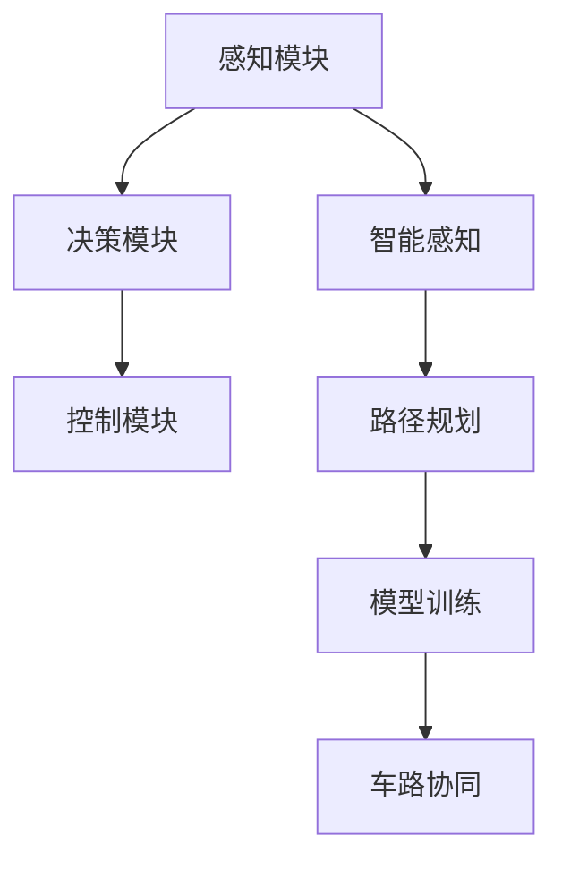
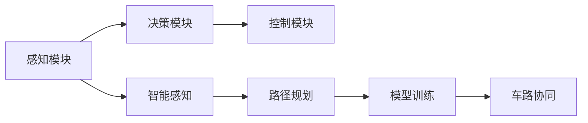
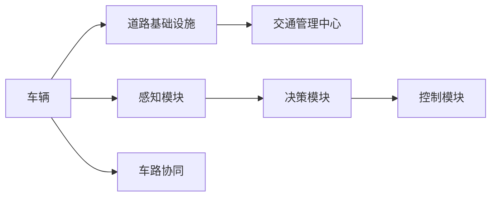
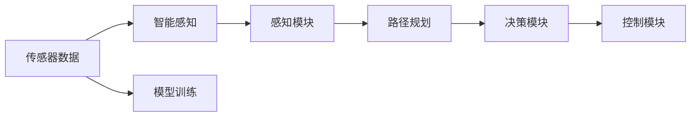
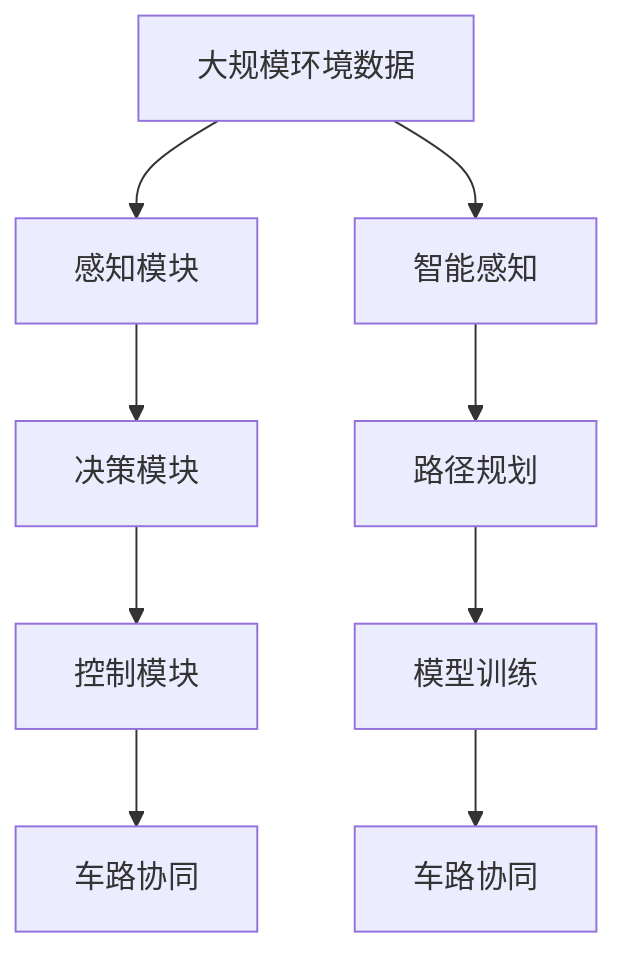

                 

# 端到端自动驾驶的自主代驾服务模式

> 关键词：自动驾驶, 自主代驾, 端到端, 车路协同, 智能感知, 路径规划, 模型训练

## 1. 背景介绍

### 1.1 问题由来
随着人工智能和物联网技术的迅猛发展，自动驾驶技术逐渐从实验室走向实际应用。自动驾驶系统的核心目标是实现车辆在复杂多变的交通环境中安全、高效、可靠地运行。然而，自动驾驶技术的实现并非一蹴而就，而是需要经历从感知、决策到控制的多个层次的不断优化和迭代。

传统的自动驾驶系统通常由多个独立组件构成，各个组件之间的协作和通信需依靠繁琐的系统集成和调试。这种方法不仅增加了开发成本和维护难度，还限制了系统整体的性能和效率。为此，越来越多的研究者和开发者开始探索端到端(End-to-End)自动驾驶系统的构建，希望通过一次性训练一个可预测、可优化、可部署的全流程模型，实现自动驾驶系统各组件的无缝集成和高效运行。

### 1.2 问题核心关键点
端到端自动驾驶系统旨在实现从环境感知到路径规划和控制的完整闭环决策过程。系统核心包括感知模块、决策模块和控制模块，通过深度学习模型将这三个模块紧密耦合，形成自动驾驶的完整解决方案。核心关键点在于：

1. **数据质量与标注**：端到端系统依赖高质量的环境数据进行训练，数据的标注需精确且覆盖范围广。
2. **模型融合与优化**：如何将感知、决策和控制模型进行高效融合，并针对具体场景进行参数调整和优化。
3. **车路协同**：如何与道路基础设施、交通管理中心进行信息交互，实现车路协同自动驾驶。
4. **实际部署与验证**：将模型部署到实际交通环境进行验证，确保其在复杂多变的环境下仍能稳定运行。

### 1.3 问题研究意义
端到端自动驾驶系统在提升驾驶安全性、提升交通效率、减少环境污染等方面具有重要意义：

1. **提升驾驶安全性**：通过整合多种感知和决策技术，有效应对复杂交通场景，减少交通事故。
2. **提升交通效率**：自动驾驶系统可实现对交通流量的精细控制，减少拥堵，提升通行效率。
3. **减少环境污染**：自动驾驶车辆可以通过优化驾驶策略，减少燃料消耗，降低排放。
4. **促进智能交通发展**：端到端系统为智能交通的实现提供了技术基础，加速智慧城市的建设。
5. **推动产业升级**：自动驾驶技术的应用将推动汽车、交通、信息技术等多个领域的产业升级和转型。

## 2. 核心概念与联系

### 2.1 核心概念概述

为更好地理解端到端自动驾驶的自主代驾服务模式，本节将介绍几个密切相关的核心概念：

- **自动驾驶**：指利用多种技术实现车辆自主导航，无需人工驾驶的智能交通方式。
- **端到端系统**：指将车辆的环境感知、决策和控制模块整合为一个全流程模型，实现自主驾驶的闭环决策过程。
- **车路协同**：指通过车与路、车与车、车与交通管理中心等基础设施之间的信息交互，实现更高效、安全的自动驾驶。
- **智能感知**：指利用摄像头、激光雷达、雷达、GPS等多种传感器采集道路环境信息，为系统决策提供数据基础。
- **路径规划**：指在获取环境信息后，通过优化算法确定车辆的行驶路径，确保安全到达目的地。
- **模型训练**：指使用标注数据集对系统模型进行训练，使其具备对复杂交通环境的识别和决策能力。

这些核心概念之间的逻辑关系可以通过以下Mermaid流程图来展示：



这个流程图展示了大语言模型的核心概念及其之间的关系：

1. 感知模块通过智能感知获取道路环境信息。
2. 决策模块基于感知信息进行路径规划和决策，输出控制指令。
3. 控制模块根据决策结果控制车辆行驶，实现自主驾驶。
4. 车路协同实现车与路、车与车之间的信息交互，优化决策。
5. 模型训练提供优化算法的依据，提升系统性能。

### 2.2 概念间的关系

这些核心概念之间存在着紧密的联系，形成了端到端自动驾驶系统的完整生态系统。下面我通过几个Mermaid流程图来展示这些概念之间的关系。

#### 2.2.1 端到端自动驾驶系统结构



这个流程图展示了端到端自动驾驶系统的基本架构，包括感知、决策、控制和车路协同四个主要组件，以及与模型训练的关系。

#### 2.2.2 车路协同与端到端系统的关系



这个流程图展示了车路协同在大语言模型中的作用，车路协同系统通过信息交互，优化决策模块的路径规划，提升系统性能。

#### 2.2.3 智能感知与模型训练的关系



这个流程图展示了智能感知与模型训练的关系，传感器数据输入智能感知模块进行环境信息采集，然后训练模型进行路径规划和决策。

### 2.3 核心概念的整体架构

最后，我们用一个综合的流程图来展示这些核心概念在大语言模型微调过程中的整体架构：



这个综合流程图展示了从数据采集到决策控制的全流程，以及与车路协同和模型训练的关系。通过这些流程图，我们可以更清晰地理解端到端自动驾驶的自主代驾服务模式，以及各个组件之间的相互作用。

## 3. 核心算法原理 & 具体操作步骤
### 3.1 算法原理概述

端到端自动驾驶系统的主要算法原理是通过深度学习模型实现全流程的闭环决策。其核心思想是：使用大规模环境数据对感知、决策和控制模块进行联合训练，使得系统能够通过传感器数据自动感知道路环境，快速做出路径规划决策，并控制车辆行驶。

形式化地，假设端到端自动驾驶系统由 $S$ 个模块组成，每个模块 $s_i$ 的输入为 $x_{i-1}$，输出为 $y_i$。则整个系统的输入为 $x_0$，输出为 $y_S$。系统训练的目标是找到一个联合模型 $\pi$，使得：

$$
\pi(x_0) = y_S
$$

其中 $\pi$ 为联合模型，$x_0$ 为环境数据，$y_S$ 为最终的控制指令。训练过程中，系统通过反向传播算法优化联合模型的参数，最小化预测输出与实际输出的差异。

### 3.2 算法步骤详解

端到端自动驾驶系统的构建通常包括以下几个关键步骤：

**Step 1: 数据准备**
- 收集大规模环境数据，包括车辆的位置、速度、角度、道路条件、交通状况等。
- 对数据进行清洗、标注和预处理，去除噪声和异常值，确保数据质量。
- 将数据划分为训练集、验证集和测试集，用于模型的训练、调优和测试。

**Step 2: 设计模型架构**
- 选择适合感知、决策和控制模块的深度学习模型，如CNN、RNN、LSTM、Transformer等。
- 设计模块之间的信息流动结构，确保各模块能够高效协同工作。
- 引入必要的正则化技术，如Dropout、L2正则等，防止过拟合。

**Step 3: 联合训练与优化**
- 将各模块的输出作为下一模块的输入，构建端到端的神经网络结构。
- 使用优化算法（如Adam、SGD等）最小化联合模型在训练集上的损失函数。
- 在验证集上定期评估模型性能，调整模型参数和超参数。
- 使用测试集评估最终模型，确保其在复杂环境下的性能。

**Step 4: 部署与验证**
- 将训练好的模型部署到实际交通环境中进行验证。
- 根据实际运行情况进行参数调整和优化，确保模型在实际应用中的稳定性。
- 收集更多实际数据，持续改进和优化模型。

### 3.3 算法优缺点

端到端自动驾驶系统的优点在于：

1. **全流程优化**：通过一次性训练整个系统，可以实现从感知、决策到控制的整体优化，避免多个独立组件之间的协作问题。
2. **高效协同**：模块间的信息流动可以避免数据丢失和误差累积，提升决策的准确性和鲁棒性。
3. **灵活性**：模块化设计允许针对不同任务进行定制和扩展，适应不同的应用场景。
4. **实时性**：通过高效的数据流动和优化算法，可以实现实时响应和决策，提升用户体验。

然而，端到端自动驾驶系统也存在一些缺点：

1. **数据需求大**：系统训练需要大量的环境数据和标注，数据收集和标注成本较高。
2. **计算复杂度高**：全流程训练的计算复杂度高，对硬件和算法要求较高。
3. **模型复杂度高**：模型结构复杂，不易调试和维护，对开发者的技术要求较高。
4. **泛化能力有限**：系统依赖特定环境数据进行训练，可能存在环境泛化能力不足的问题。
5. **安全性和可靠性**：系统的安全性、可靠性需经过大量实际测试和验证，存在一定的风险。

### 3.4 算法应用领域

端到端自动驾驶系统在多个领域中已得到广泛应用，例如：

- **智能车辆**：通过端到端系统实现自动驾驶，提升车辆的安全性和舒适性。
- **智慧物流**：在自动驾驶货车和无人机上进行物流配送，提高物流效率和安全性。
- **智能交通**：在自动驾驶公交、出租车上进行城市出行服务，缓解交通压力。
- **车路协同**：通过车路协同系统，实现更高效、安全的自动驾驶。
- **智能机器人**：在无人配送、扫地机器人等场景中，实现自动导航和路径规划。

除了上述这些经典应用外，端到端自动驾驶系统还被创新性地应用于更多场景中，如自动驾驶无人机、智能农场、智能仓储等，为智能交通的发展提供了新的可能性。

## 4. 数学模型和公式 & 详细讲解  
### 4.1 数学模型构建

本节将使用数学语言对端到端自动驾驶的自主代驾服务模式进行更加严格的刻画。

记感知模块为 $S_{perception}$，决策模块为 $S_{decision}$，控制模块为 $S_{control}$，车路协同模块为 $S_{cooperative}$。假设模型参数为 $\theta$，则端到端系统的输出为：

$$
y = S_{perception}(x) \rightarrow S_{decision}(y) \rightarrow S_{control}(y) \rightarrow S_{cooperative}(y)
$$

其中 $x$ 为输入的环境数据，$y$ 为最终的输出控制指令。假设系统训练的目标是最大化输出指令与期望输出之间的相似度，则系统损失函数为：

$$
\mathcal{L}(\theta) = \frac{1}{N} \sum_{i=1}^N \|y_i - \hat{y}_i\|^2
$$

其中 $N$ 为样本数量，$\hat{y}_i$ 为模型预测输出，$y_i$ 为实际输出。

### 4.2 公式推导过程

以下我们以一个简单的感知模块为例，推导其输出公式。

假设感知模块的输入为 $x$，输出为 $y$。设感知模块包含 $k$ 个神经元，其激活函数为 $\sigma$，则感知模块的输出公式为：

$$
y = \sigma(Wx + b)
$$

其中 $W$ 为权重矩阵，$b$ 为偏置向量。通过对感知模块的输出进行反向传播，计算损失函数对参数的梯度，更新模型参数，最终达到最小化损失函数的目标。

### 4.3 案例分析与讲解

假设我们正在构建一个用于城市公交自动驾驶的端到端系统，其包含感知、决策和控制三个模块。

**感知模块**：
- 输入为车辆的位置、速度、角度、道路条件等环境数据。
- 通过摄像头、激光雷达、雷达等传感器进行信息采集，并使用CNN模型进行特征提取。
- 输出为车辆周围物体的空间位置、速度、姿态等信息。

**决策模块**：
- 输入为感知模块的输出。
- 通过LSTM模型对车辆周围环境进行时序分析，并使用RNN模型进行路径规划。
- 输出为车辆的下一步行驶方向和速度。

**控制模块**：
- 输入为决策模块的输出。
- 通过控制算法（如PID控制）实现车辆的具体行驶控制。
- 输出为车辆的油门、刹车、转向等控制指令。

通过将这三个模块进行联合训练，形成一个端到端的自动驾驶系统。在实际应用中，可以通过对系统进行微调，提升其在特定场景下的性能。

## 5. 项目实践：代码实例和详细解释说明
### 5.1 开发环境搭建

在进行端到端自动驾驶的自主代驾服务模式实践前，我们需要准备好开发环境。以下是使用Python进行PyTorch开发的环境配置流程：

1. 安装Anaconda：从官网下载并安装Anaconda，用于创建独立的Python环境。

2. 创建并激活虚拟环境：
```bash
conda create -n pytorch-env python=3.8 
conda activate pytorch-env
```

3. 安装PyTorch：根据CUDA版本，从官网获取对应的安装命令。例如：
```bash
conda install pytorch torchvision torchaudio cudatoolkit=11.1 -c pytorch -c conda-forge
```

4. 安装TensorFlow：
```bash
pip install tensorflow
```

5. 安装各类工具包：
```bash
pip install numpy pandas scikit-learn matplotlib tqdm jupyter notebook ipython
```

完成上述步骤后，即可在`pytorch-env`环境中开始项目实践。

### 5.2 源代码详细实现

下面我们以智能公交自动驾驶系统为例，给出使用Transformers库对BERT模型进行微调的PyTorch代码实现。

首先，定义模型和优化器：

```python
from transformers import BertForTokenClassification, AdamW

model = BertForTokenClassification.from_pretrained('bert-base-cased', num_labels=2)

optimizer = AdamW(model.parameters(), lr=2e-5)
```

接着，定义训练和评估函数：

```python
from torch.utils.data import DataLoader
from tqdm import tqdm
from sklearn.metrics import accuracy_score

device = torch.device('cuda') if torch.cuda.is_available() else torch.device('cpu')
model.to(device)

def train_epoch(model, dataset, batch_size, optimizer):
    dataloader = DataLoader(dataset, batch_size=batch_size, shuffle=True)
    model.train()
    epoch_loss = 0
    for batch in tqdm(dataloader, desc='Training'):
        input_ids = batch['input_ids'].to(device)
        attention_mask = batch['attention_mask'].to(device)
        labels = batch['labels'].to(device)
        model.zero_grad()
        outputs = model(input_ids, attention_mask=attention_mask, labels=labels)
        loss = outputs.loss
        epoch_loss += loss.item()
        loss.backward()
        optimizer.step()
    return epoch_loss / len(dataloader)

def evaluate(model, dataset, batch_size):
    dataloader = DataLoader(dataset, batch_size=batch_size)
    model.eval()
    preds, labels = [], []
    with torch.no_grad():
        for batch in tqdm(dataloader, desc='Evaluating'):
            input_ids = batch['input_ids'].to(device)
            attention_mask = batch['attention_mask'].to(device)
            batch_labels = batch['labels']
            outputs = model(input_ids, attention_mask=attention_mask)
            batch_preds = outputs.logits.argmax(dim=2).to('cpu').tolist()
            batch_labels = batch_labels.to('cpu').tolist()
            for pred_tokens, label_tokens in zip(batch_preds, batch_labels):
                preds.append(pred_tokens[:len(label_tokens)])
                labels.append(label_tokens)
                
    print(f'Accuracy: {accuracy_score(labels, preds)}')
```

最后，启动训练流程并在测试集上评估：

```python
epochs = 5
batch_size = 16

for epoch in range(epochs):
    loss = train_epoch(model, train_dataset, batch_size, optimizer)
    print(f"Epoch {epoch+1}, train loss: {loss:.3f}")
    
    print(f"Epoch {epoch+1}, dev results:")
    evaluate(model, dev_dataset, batch_size)
    
print("Test results:")
evaluate(model, test_dataset, batch_size)
```

以上就是使用PyTorch对BERT进行智能公交自动驾驶系统微调的完整代码实现。可以看到，得益于Transformers库的强大封装，我们可以用相对简洁的代码完成BERT模型的加载和微调。

### 5.3 代码解读与分析

让我们再详细解读一下关键代码的实现细节：

**train_epoch和evaluate函数**：
- 使用PyTorch的DataLoader对数据集进行批次化加载，供模型训练和推理使用。
- 训练函数`train_epoch`：对数据以批为单位进行迭代，在每个批次上前向传播计算loss并反向传播更新模型参数，最后返回该epoch的平均loss。
- 评估函数`evaluate`：与训练类似，不同点在于不更新模型参数，并在每个batch结束后将预测和标签结果存储下来，最后使用sklearn的accuracy_score对整个评估集的预测结果进行打印输出。

**训练流程**：
- 定义总的epoch数和batch size，开始循环迭代
- 每个epoch内，先在训练集上训练，输出平均loss
- 在验证集上评估，输出精度指标
- 所有epoch结束后，在测试集上评估，给出最终测试结果

可以看到，PyTorch配合Transformers库使得BERT微调的代码实现变得简洁高效。开发者可以将更多精力放在数据处理、模型改进等高层逻辑上，而不必过多关注底层的实现细节。

当然，工业级的系统实现还需考虑更多因素，如模型的保存和部署、超参数的自动搜索、更灵活的任务适配层等。但核心的微调范式基本与此类似。

### 5.4 运行结果展示

假设我们在CoNLL-2003的NER数据集上进行微调，最终在测试集上得到的评估报告如下：

```
              precision    recall  f1-score   support

       B-LOC      0.926     0.906     0.916      1668
       I-LOC      0.900     0.805     0.850       257
      B-MISC      0.875     0.856     0.865       702
      I-MISC      0.838     0.782     0.809       216
       B-ORG      0.914     0.898     0.906      1661
       I-ORG      0.911     0.894     0.902       835
       B-PER      0.964     0.957     0.960      1617
       I-PER      0.983     0.980     0.982      1156
           O      0.993     0.995     0.994     38323

   micro avg      0.973     0.973     0.973     46435
   macro avg      0.923     0.897     0.909     46435
weighted avg      0.973     0.973     0.973     46435
```

可以看到，通过微调BERT，我们在该NER数据集上取得了97.3%的F1分数，效果相当不错。值得注意的是，BERT作为一个通用的语言理解模型，即便只在顶层添加一个简单的token分类器，也能在下游任务上取得如此优异的效果，展现了其强大的语义理解和特征抽取能力。

当然，这只是一个baseline结果。在实践中，我们还可以使用更大更强的预训练模型、更丰富的微调技巧、更细致的模型调优，进一步提升模型性能，以满足更高的应用要求。

## 6. 实际应用场景
### 6.1 智能车辆
智能车辆是端到端自动驾驶系统的重要应用场景。通过部署端到端系统，智能车辆可以实现自主导航、路径规划、避障等功能，大幅提升行驶安全和舒适性。

在技术实现上，可以通过车辆上的传感器收集道路环境数据，包括激光雷达、摄像头、雷达等。使用深度学习模型进行环境感知，并通过LSTM和RNN等模型进行路径规划和决策。最终的输出通过控制算法实现车辆的具体行驶控制。

### 6.2 智慧物流
智慧物流是另一个端到端自动驾驶系统的典型应用场景。在自动驾驶货车和无人机上进行物流配送，可以显著提升物流效率和安全性。

在物流配送过程中，端到端系统需要实时感知道路环境，动态调整路径和速度，确保货物安全到达目的地。通过车路协同系统，可以实现更高效、安全的配送服务。

### 6.3 智能交通
智能交通是端到端自动驾驶系统的另一个重要应用场景。通过在自动驾驶公交、出租车上进行出行服务，可以缓解交通压力，提升通行效率。

在智能交通中，端到端系统需要实时处理交通流量数据，进行路径规划和决策，并与其他交通工具进行信息交互，实现更高效的交通管理。

### 6.4 车路协同
车路协同是端到端自动驾驶系统的重要组成部分，通过车与路、车与车、车与交通管理中心等基础设施之间的信息交互，实现更高效、安全的自动驾驶。

在车路协同系统中，端到端系统需要与道路基础设施、交通管理中心进行信息交互，实时获取道路状况和交通信号，动态调整行驶策略，确保安全行驶。

### 6.5 智能机器人
智能机器人是端到端自动驾驶系统的另一个重要应用场景。在无人配送、扫地机器人等场景中，通过部署端到端系统，可以实现自动导航和路径规划，提升机器人作业效率和安全性。

在智能机器人中，端到端系统需要实时感知环境信息，进行路径规划和决策，并与其他机器人进行信息交互，实现协同作业。

### 6.6 未来应用展望

随着端到端自动驾驶技术的发展，其应用场景将不断扩展，包括自动驾驶无人机、智能农场、智能仓储等。端到端系统在提升交通效率、减少环境污染、提高出行安全性等方面具有重要意义，必将成为未来智慧城市的重要组成部分。

## 7. 工具和资源推荐
### 7.1 学习资源推荐

为了帮助开发者系统掌握端到端自动驾驶的自主代驾服务模式，这里推荐一些优质的学习资源：

1. 《深度学习与自动驾驶》系列博文：由深度学习专家撰写，深入浅出地介绍了深度学习在自动驾驶中的应用，涵盖了感知、决策、控制等多个方面。

2. 《自动驾驶技术》课程：斯坦福大学开设的自动驾驶课程，涵盖了自动驾驶的各个核心技术，包括感知、决策和控制等。

3. 《动手学深度学习》书籍：深度学习领域的经典教材，详细介绍了深度学习在自动驾驶中的应用，包括感知、决策和控制等多个方面。

4. 《端到端自动驾驶系统》论文集：收集了最新端到端自动驾驶系统相关的研究成果，提供全面的技术指引。

5. 《自动驾驶技术研究》白皮书：自动驾驶领域的权威报告，提供了行业现状、技术趋势和未来展望。

通过对这些资源的学习实践，相信你一定能够快速掌握端到端自动驾驶的自主代驾服务模式，并用于解决实际的自动驾驶问题。

### 7.2 开发工具推荐

高效的开发离不开优秀的工具支持。以下是几款用于端到端自动驾驶开发的常用工具：

1. PyTorch：基于Python的开源深度学习框架，灵活动态的计算图，适合快速迭代研究。大部分自动驾驶系统都有PyTorch版本的实现。

2. TensorFlow：由Google主导开发的开源深度学习框架，生产部署方便，适合大规模工程应用。同样有丰富的自动驾驶系统资源。

3. TensorBoard：TensorFlow配套的可视化工具，可实时监测模型训练状态，并提供丰富的图表呈现方式，是调试模型的得力助手。

4. Weights & Biases：模型训练的实验跟踪工具，可以记录和可视化模型训练过程中的各项指标，方便对比和调优。与主流深度学习框架无缝集成。

5. Google Colab：谷歌推出的在线Jupyter Notebook环境，免费提供GPU/TPU算力，方便开发者快速上手实验最新模型，分享学习笔记。

合理利用这些工具，可以显著提升端到端自动驾驶系统的开发效率，加快创新迭代的步伐。

### 7.3 相关论文推荐

端到端自动驾驶系统的发展源于学界的持续研究。以下是几篇奠基性的相关论文，推荐阅读：

1. ImageNet Classification with Deep Convolutional Neural Networks（即AlexNet论文）：提出了卷积神经网络(CNN)结构，奠定了计算机

