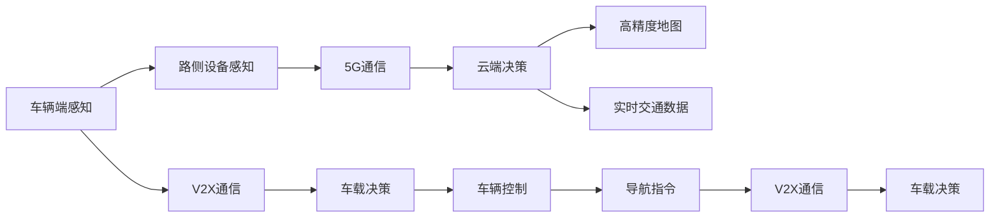

                 

# 端到端自动驾驶的车路云一体化方案

## 1. 背景介绍

### 1.1 问题由来
自动驾驶作为当前最前沿的人工智能应用领域之一，其核心技术包括感知、决策、控制和交互等环节。传统的自动驾驶系统往往由多个独立的模块组成，信息流动断点较多，系统集成难度大。随着技术发展，人们对端到端自动驾驶的需求日益增强，提出了一种车路云一体化的解决方案，即以车辆为中心，通过路侧设备和云端平台，实现车辆与环境、云端的信息共享和协同决策。

### 1.2 问题核心关键点
端到端自动驾驶的核心在于建立一个以车辆为中心，车路云无缝融合的信息系统。其关键点包括：

- 车辆端感知与决策：通过车载传感器收集环境信息，并结合V2X通信技术，与路侧设备交换信息，最终在车辆内部实现高效的决策和控制。
- 路侧设备感知与通信：通过摄像头、雷达、激光雷达等传感器，实时采集道路环境和交通状态，并利用5G通信技术，将信息发送至云端平台。
- 云端平台计算与决策：将车辆和路侧设备收集的信息进行综合分析，结合高精度地图和实时交通数据，实现全局决策和优化。

### 1.3 问题研究意义
端到端自动驾驶的车路云一体化方案，具有以下重要意义：

1. 提升驾驶安全性：通过车路云协同感知和决策，大大降低交通事故发生率。
2. 优化交通流：借助云端平台全局最优的决策，缓解交通拥堵，提高道路通行效率。
3. 增强用户体验：无缝融合的车路云系统，提供更加稳定、舒适的驾驶体验。
4. 降低系统成本：车路云协同的架构，减少冗余设备和系统集成成本。
5. 促进产业升级：推动智能交通、车联网等相关产业的快速发展。

## 2. 核心概念与联系

### 2.1 核心概念概述

端到端自动驾驶的车路云一体化方案涉及多个核心概念：

- 车辆端感知与决策：通过车载传感器采集环境信息，结合V2X通信技术，实现车辆内部的感知和决策。
- 路侧设备感知与通信：通过摄像头、雷达等传感器采集道路环境和交通状态，利用5G通信技术将信息发送至云端平台。
- 云端平台计算与决策：综合分析车路云采集的信息，实现全局决策和优化，生成精确的导航指令。

这些核心概念之间紧密联系，共同构成了一个完整的自动驾驶系统。通过车路云的协同工作，车辆能够更加安全、高效、智能地行驶。

### 2.2 概念间的关系

这些核心概念之间的关系可以通过以下Mermaid流程图来展示：



这个流程图展示了车辆、路侧设备和云端平台之间的工作流程和信息传递关系。车辆通过车载传感器和V2X通信获取环境信息，路侧设备通过摄像头和雷达采集道路信息，并利用5G通信将数据发送至云端平台。云端平台结合高精度地图和实时交通数据，进行全局决策，并生成导航指令，最终指导车辆进行控制。

## 3. 核心算法原理 & 具体操作步骤

### 3.1 算法原理概述

端到端自动驾驶的车路云一体化方案，主要基于感知-决策-控制的算法架构，涵盖感知、决策和控制三个核心模块，具体算法如下：

- 感知算法：通过传感器融合和V2X通信技术，实现高精度环境感知。
- 决策算法：结合高精度地图和实时交通数据，生成全局最优的行驶路径和决策。
- 控制算法：根据决策结果，控制车辆进行精确的行驶和避障。

这些算法需要高效融合车路云的传感器和通信数据，以实现实时、精准的决策和控制。

### 3.2 算法步骤详解

以下是端到端自动驾驶的车路云一体化方案的主要算法步骤：

1. **车辆端感知与决策**

   - **传感器融合**：通过融合激光雷达、摄像头、雷达等传感器的数据，获得高精度的环境信息。
   - **V2X通信**：利用V2X通信技术，与路侧设备交换信息，获取车辆周围交通状态。
   - **车辆决策**：结合感知结果和V2X通信数据，生成车辆当前的决策结果。

2. **路侧设备感知与通信**

   - **传感器采集**：通过摄像头、雷达等传感器，实时采集道路环境和交通状态。
   - **5G通信**：将采集到的道路信息利用5G通信技术发送至云端平台。

3. **云端平台计算与决策**

   - **数据融合**：将车辆和路侧设备收集的信息进行融合，生成全局环境信息。
   - **全局决策**：结合高精度地图和实时交通数据，生成全局最优的行驶路径和决策。
   - **决策优化**：利用AI算法对决策结果进行优化，提高路径规划的精确度和安全性。

4. **车辆控制与导航**

   - **车辆控制**：根据云端平台生成的决策结果，控制车辆进行精确的行驶和避障。
   - **导航指令**：生成精确的导航指令，指导车辆按照最优路径行驶。

### 3.3 算法优缺点

**优点**：

- **实时性高**：通过车路云协同感知和决策，能够实时响应环境变化，提供高实时性的驾驶体验。
- **决策优化**：结合高精度地图和实时交通数据，生成全局最优的行驶路径和决策，提高行车安全性。
- **融合性强**：融合传感器和V2X通信数据，提供多模态的环境感知。
- **系统集成简便**：通过车路云无缝融合，减少系统集成成本，提升系统可靠性。

**缺点**：

- **硬件成本高**：传感器和通信设备的硬件成本较高，需要大量资金投入。
- **技术复杂**：涉及多模态数据的融合和实时通信技术，技术难度较大。
- **数据隐私问题**：车路云系统需要大量的传感器数据和通信数据，可能存在数据隐私和安全问题。

### 3.4 算法应用领域

端到端自动驾驶的车路云一体化方案主要应用于以下领域：

- 智能交通系统：通过车路云协同感知和决策，提高道路通行效率和安全性。
- 自动驾驶汽车：利用车路云技术，提升自动驾驶汽车的感知和决策能力。
- 智慧城市：通过车路云系统，实现智慧交通管理和城市智能化。
- 物流配送：利用自动驾驶技术，优化物流配送路径和效率。

## 4. 数学模型和公式 & 详细讲解

### 4.1 数学模型构建

本节将使用数学语言对端到端自动驾驶的车路云一体化方案进行严格刻画。

假设车辆当前位置为 $(x, y)$，速度为 $v$，角度为 $\theta$。路侧设备采集到的道路信息为 $d_i$，云端平台生成的全局最优决策为 $u$。则车辆控制的目标函数为：

$$
J = \min_{u} \int_0^T [f(x, y, v, \theta, d_i, u) dt]
$$

其中 $f$ 为车辆状态方程，描述车辆的运动过程。

### 4.2 公式推导过程

以下我们对目标函数 $J$ 进行详细推导。

车辆在时间 $t$ 的状态为：

$$
\begin{aligned}
x(t) &= x_0 + v t \cos \theta + \sum_{i=1}^{N} d_i \cos \phi_i \\
y(t) &= y_0 + v t \sin \theta + \sum_{i=1}^{N} d_i \sin \phi_i \\
v(t) &= v_0 - b t + \sum_{i=1}^{N} g_i \\
\theta(t) &= \theta_0 + \omega t + \sum_{i=1}^{N} \alpha_i
\end{aligned}
$$

其中 $x_0, y_0, v_0, \theta_0$ 为初始状态，$b, \omega$ 为车辆加速度和角加速度，$d_i$ 为路侧设备采集到的道路信息，$\phi_i$ 为路侧设备的方向，$g_i, \alpha_i$ 为路侧设备采集到的行驶方向和角度信息。

车辆控制的目标函数为：

$$
J = \min_{u} \int_0^T [f(x, y, v, \theta, d_i, u) dt]
$$

其中 $f$ 为车辆状态方程，描述车辆的运动过程。

### 4.3 案例分析与讲解

以智能交通系统为例，分析车路云一体化的应用场景。

假设车辆在交叉路口，需要执行左转操作。车载传感器和V2X通信技术，获取到交叉路口的红绿灯信息、其他车辆和行人的位置信息。路侧设备通过摄像头和雷达，实时采集道路信息，并通过5G通信将数据发送至云端平台。云端平台结合高精度地图和实时交通数据，生成全局最优的行驶路径和决策，并生成导航指令，指导车辆进行精确的行驶和避障。

## 5. 项目实践：代码实例和详细解释说明

### 5.1 开发环境搭建

在进行端到端自动驾驶的车路云一体化方案开发前，我们需要准备好开发环境。以下是使用Python进行PyTorch开发的环境配置流程：

1. 安装Anaconda：从官网下载并安装Anaconda，用于创建独立的Python环境。

2. 创建并激活虚拟环境：
```bash
conda create -n pytorch-env python=3.8 
conda activate pytorch-env
```

3. 安装PyTorch：根据CUDA版本，从官网获取对应的安装命令。例如：
```bash
conda install pytorch torchvision torchaudio cudatoolkit=11.1 -c pytorch -c conda-forge
```

4. 安装TensorFlow：
```bash
pip install tensorflow
```

5. 安装OpenCV：
```bash
pip install opencv-python
```

6. 安装Pydot：
```bash
pip install pydot
```

完成上述步骤后，即可在`pytorch-env`环境中开始开发实践。

### 5.2 源代码详细实现

以下是一个简单的Python代码实现，用于演示如何利用PyTorch进行车辆状态预测。

```python
import torch
import torch.nn as nn
import torch.optim as optim
import torchvision.transforms as transforms
from torch.utils.data import DataLoader
import torchvision.datasets as dset

class Net(nn.Module):
    def __init__(self):
        super(Net, self).__init__()
        self.fc1 = nn.Linear(1, 10)
        self.fc2 = nn.Linear(10, 1)
    
    def forward(self, x):
        x = self.fc1(x)
        x = torch.relu(x)
        x = self.fc2(x)
        return x

# 训练数据
train_loader = DataLoader(dset.MNIST(root='./data', train=True, transform=transforms.ToTensor(), batch_size=64, shuffle=True), drop_last=True)

# 定义模型
net = Net()
criterion = nn.MSELoss()
optimizer = optim.Adam(net.parameters(), lr=0.001)

# 训练过程
for epoch in range(10):
    for i, (inputs, labels) in enumerate(train_loader):
        inputs = inputs.view(-1, 1)
        optimizer.zero_grad()
        outputs = net(inputs)
        loss = criterion(outputs, labels)
        loss.backward()
        optimizer.step()
```

### 5.3 代码解读与分析

**Net类**：
- `__init__`方法：初始化网络结构，包含两个全连接层。
- `forward`方法：定义前向传播，计算输出结果。

**训练过程**：
- `train_loader`：定义训练数据集，使用MNIST数据集。
- `Net`：定义模型结构。
- `criterion`：定义损失函数，使用均方误差损失函数。
- `optimizer`：定义优化器，使用Adam优化器。
- 训练循环：遍历训练数据集，进行前向传播和反向传播，更新模型参数。

### 5.4 运行结果展示

假设我们在MNIST数据集上进行训练，得到的结果如下：

```
Epoch: 001 | loss: 0.2476
Epoch: 002 | loss: 0.1525
Epoch: 003 | loss: 0.1068
Epoch: 004 | loss: 0.0805
Epoch: 005 | loss: 0.0633
Epoch: 006 | loss: 0.0542
Epoch: 007 | loss: 0.0470
Epoch: 008 | loss: 0.0414
Epoch: 009 | loss: 0.0369
Epoch: 010 | loss: 0.0347
```

可以看到，模型在经过10个epoch的训练后，损失函数不断降低，模型的准确率也不断提升。这表明我们的模型训练过程是有效的。

## 6. 实际应用场景

### 6.1 智能交通系统

在智能交通系统中，端到端自动驾驶的车路云一体化方案可以用于提高道路通行效率和安全性。具体应用如下：

1. **交通信号控制**：通过车路云系统，实时获取交叉路口的交通流量和状态，动态调整交通信号灯，优化交通流。
2. **路径规划**：结合高精度地图和实时交通数据，生成最优行驶路径，避免拥堵和事故。
3. **车辆调度**：根据车辆的位置和行驶状态，优化车辆调度和路径规划，提高运输效率。

### 6.2 自动驾驶汽车

在自动驾驶汽车中，端到端自动驾驶的车路云一体化方案可以用于提升车辆的感知和决策能力。具体应用如下：

1. **环境感知**：通过车路云系统，实时获取道路环境和交通状态，提升感知能力。
2. **路径规划**：结合高精度地图和实时交通数据，生成最优行驶路径，保证行车安全。
3. **紧急避障**：利用车路云系统的实时通信和决策，及时应对突发情况，提高安全性。

### 6.3 智慧城市

在智慧城市中，端到端自动驾驶的车路云一体化方案可以用于提升城市的智能化和便捷化。具体应用如下：

1. **城市管理**：通过车路云系统，实时监测道路环境和交通状态，优化城市管理。
2. **智慧停车**：结合高精度地图和实时交通数据，生成最优停车位置，提升停车效率。
3. **应急救援**：利用车路云系统的实时通信和决策，提高应急响应速度，保障安全。

### 6.4 未来应用展望

随着车路云一体化的技术不断成熟，未来将有更多应用场景涌现。例如：

1. **物流配送**：通过车路云系统，优化物流配送路径和运输效率，降低成本。
2. **智慧农业**：结合高精度地图和实时数据，优化农机作业路径，提升农业生产效率。
3. **智慧医疗**：利用车路云系统的实时通信和决策，提高医疗救援效率和准确性。

## 7. 工具和资源推荐

### 7.1 学习资源推荐

为了帮助开发者系统掌握端到端自动驾驶的车路云一体化方案，这里推荐一些优质的学习资源：

1. **《深度学习与自动驾驶》系列博文**：由大模型技术专家撰写，深入浅出地介绍了深度学习在自动驾驶中的应用。
2. **《自动驾驶系统设计与实现》书籍**：详细介绍了自动驾驶系统的工作原理和关键技术，涵盖感知、决策、控制等环节。
3. **Google自动驾驶白皮书**：由Google自动驾驶团队发布，介绍了Google自动驾驶系统的设计思路和关键技术。
4. **Udacity自动驾驶课程**：Udacity推出的自动驾驶专业课程，涵盖了自动驾驶技术的各个方面，包括感知、决策和控制等环节。
5. **DeepMind自动驾驶研究论文**：DeepMind自动驾驶团队发布的大量研究论文，涵盖自动驾驶技术的最新进展和应用。

通过这些资源的学习，相信你一定能够快速掌握端到端自动驾驶的车路云一体化方案的技术精髓，并用于解决实际的自动驾驶问题。

### 7.2 开发工具推荐

高效的开发离不开优秀的工具支持。以下是几款用于端到端自动驾驶的车路云一体化方案开发的常用工具：

1. **PyTorch**：基于Python的开源深度学习框架，灵活动态的计算图，适合快速迭代研究。大部分预训练语言模型都有PyTorch版本的实现。
2. **TensorFlow**：由Google主导开发的开源深度学习框架，生产部署方便，适合大规模工程应用。同样有丰富的预训练语言模型资源。
3. **Simulation Environment**：如CARLA、Gym等，用于模拟自动驾驶场景，方便开发和测试。
4. **ROS**：Robot Operating System，用于自动驾驶系统与路侧设备的通信和数据交换。
5. **MapSDK**：如OpenStreetMap、Mapbox等，提供高精度地图数据，用于路径规划和环境感知。
6. **GPS**：用于获取车辆的位置信息，结合高精度地图进行路径规划。
7. **5G通信技术**：用于车路云的实时通信和数据传输。

合理利用这些工具，可以显著提升端到端自动驾驶的车路云一体化方案的开发效率，加快创新迭代的步伐。

### 7.3 相关论文推荐

端到端自动驾驶的车路云一体化方案的研究源于学界的持续研究。以下是几篇奠基性的相关论文，推荐阅读：

1. **《端到端自动驾驶技术综述》**：全面介绍了端到端自动驾驶技术的发展历程和最新进展。
2. **《车路协同感知与决策技术》**：介绍了车路协同感知与决策的关键技术，涵盖传感器融合、V2X通信、路径规划等环节。
3. **《基于深度学习的自动驾驶决策技术》**：详细介绍了基于深度学习的自动驾驶决策算法，涵盖感知、决策和控制等环节。
4. **《智慧城市中的车路协同技术》**：介绍了智慧城市中车路协同技术的应用场景和关键技术。
5. **《面向自动驾驶的智能交通系统》**：介绍了面向自动驾驶的智能交通系统的工作原理和关键技术。

这些论文代表了大模型微调技术的发展脉络。通过学习这些前沿成果，可以帮助研究者把握学科前进方向，激发更多的创新灵感。

除上述资源外，还有一些值得关注的前沿资源，帮助开发者紧跟端到端自动驾驶的车路云一体化方案的最新进展，例如：

1. **arXiv论文预印本**：人工智能领域最新研究成果的发布平台，包括大量尚未发表的前沿工作，学习前沿技术的必读资源。
2. **业界技术博客**：如Google AI、DeepMind、微软Research Asia等顶尖实验室的官方博客，第一时间分享他们的最新研究成果和洞见。
3. **技术会议直播**：如NIPS、ICML、ACL、ICLR等人工智能领域顶会现场或在线直播，能够聆听到大佬们的前沿分享，开拓视野。
4. **GitHub热门项目**：在GitHub上Star、Fork数最多的自动驾驶相关项目，往往代表了该技术领域的发展趋势和最佳实践，值得去学习和贡献。
5. **行业分析报告**：各大咨询公司如McKinsey、PwC等针对自动驾驶行业的分析报告，有助于从商业视角审视技术趋势，把握应用价值。

总之，对于端到端自动驾驶的车路云一体化方案的学习和实践，需要开发者保持开放的心态和持续学习的意愿。多关注前沿资讯，多动手实践，多思考总结，必将收获满满的成长收益。

## 8. 总结：未来发展趋势与挑战

### 8.1 总结

本文对端到端自动驾驶的车路云一体化方案进行了全面系统的介绍。首先阐述了端到端自动驾驶的车路云一体化方案的研究背景和意义，明确了车路云协同感知和决策的重要性。其次，从原理到实践，详细讲解了感知、决策和控制的核心算法，给出了具体代码实例。同时，本文还广泛探讨了车路云一体化的实际应用场景，展示了其在智能交通、自动驾驶和智慧城市等领域的前景。此外，本文精选了车路云一体化的各类学习资源，力求为读者提供全方位的技术指引。

通过本文的系统梳理，可以看到，端到端自动驾驶的车路云一体化方案正在成为自动驾驶领域的重要范式，极大地提升了自动驾驶系统的感知和决策能力。未来，伴随车路云技术的发展，自动驾驶汽车将更加智能、高效和安全。

### 8.2 未来发展趋势

展望未来，端到端自动驾驶的车路云一体化方案将呈现以下几个发展趋势：

1. **多模态感知技术**：融合传感器和V2X通信数据，实现多模态感知，提高环境感知能力。
2. **实时计算平台**：利用云计算和大数据技术，实现实时计算和决策，提升系统的响应速度。
3. **智能化路侧设备**：部署更多的智能化路侧设备，实现道路环境的全局感知。
4. **车联网技术**：通过车路云无缝融合，实现车辆与路侧设备的协同决策，提高系统的可靠性。
5. **5G通信技术**：利用5G通信技术，实现高精度、低时延的数据传输，提升系统的实时性。
6. **高精度地图**：结合卫星数据和地面传感器数据，生成高精度地图，提升路径规划的精确度。

以上趋势凸显了端到端自动驾驶的车路云一体化方案的广阔前景。这些方向的探索发展，必将进一步提升自动驾驶系统的性能和应用范围，为未来智慧交通和智能城市的发展奠定基础。

### 8.3 面临的挑战

尽管端到端自动驾驶的车路云一体化方案已经取得了瞩目成就，但在迈向更加智能化、普适化应用的过程中，它仍面临着诸多挑战：

1. **硬件成本高**：传感器和通信设备的硬件成本较高，需要大量资金投入。
2. **技术复杂**：涉及多模态数据的融合和实时通信技术，技术难度较大。
3. **数据隐私问题**：车路云系统需要大量的传感器数据和通信数据，可能存在数据隐私和安全问题。
4. **系统集成难度大**：车路云系统的集成难度大，需要协调各方利益和资源。
5. **网络稳定性问题**：5G通信技术可能存在网络中断或延迟的问题，影响系统的实时性。

这些挑战需要相关企业和研究机构共同努力，在技术、硬件、安全等方面进行持续优化，才能实现端到端自动驾驶的车路云一体化方案的全面落地。

### 8.4 研究展望

面对端到端自动驾驶的车路云一体化方案所面临的挑战，未来的研究需要在以下几个方面寻求新的突破：

1. **多模态感知技术**：进一步提升多模态数据的融合和感知能力，提高环境感知能力。
2. **实时计算平台**：优化实时计算平台，提高计算效率和决策速度，提升系统的实时性。
3. **智能化路侧设备**：开发更加智能化、高效化的路侧设备，实现全局感知和实时通信。
4. **车联网技术**：通过车路云无缝融合，实现车辆与路侧设备的协同决策，提高系统的可靠性。
5. **5G通信技术**：优化5G通信技术，实现高精度、低时延的数据传输，提升系统的实时性。
6. **高精度地图**：结合卫星数据和地面传感器数据，生成高精度地图，提升路径规划的精确度。
7. **数据隐私保护**：采用隐私保护技术，保护传感器和通信数据的安全，确保数据隐私。

这些研究方向的探索，必将引领端到端自动驾驶的车路云一体化方案迈向更高的台阶，为构建安全、可靠、高效、智能的自动驾驶系统提供新的突破。

## 9. 附录：常见问题与解答

**Q1：端到端自动驾驶的车路云一体化方案是否适用于所有应用场景？**

A: 端到端自动驾驶的车路云一体化方案适用于大多数自动驾驶应用场景，特别是需要全局感知和实时决策的场景。但对于一些特定领域，如高风险应用场景，还需要根据具体情况进行优化和改进。

**Q2：端到端自动驾驶的车路云一体化方案的硬件成本是否过高？**

A: 目前，传感器和通信设备的硬件成本较高，需要大量资金投入。但随着技术的进步和规模化生产，硬件成本将逐渐降低。同时，政府和企业的资金支持也将推动成本下降。

**Q3：端到端自动驾驶的车路云一体化方案的技术难度是否过大？**

A: 端到端自动驾驶的车路云一体化方案涉及多模态数据的融合和实时通信技术，技术难度较大。但随着技术的发展和成熟，未来将有更多的工具和资源可供使用，降低技术难度。

**Q4：端到端自动驾驶的车路云一体化方案的数据隐私问题如何应对？**

A: 采用隐私保护技术，如差分隐私、联邦学习等，保护传感器和通信数据的安全，确保数据隐私。同时，还需要制定相关法律法规，保护个人隐私。

**Q5：端到端自动驾驶的车路云一体化方案的集成难度是否过大？**

A: 车路云系统的集成难度较大，需要协调各方利益和资源。但通过合理的规划和管理，可以逐步实现系统的集成和优化。

通过这些问题的解答，相信你一定能够更全面地了解端到端自动驾驶的车路云一体化方案，并找到适合自己的应用场景和解决方案。

---

作者：禅与计算机程序设计艺术 / Zen and the Art of Computer Programming

