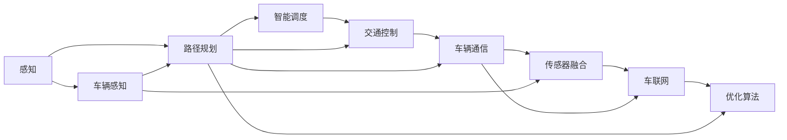

                 

# 端到端自动驾驶的车路协同智能调度

> 关键词：端到端自动驾驶,车路协同,智能调度,车辆感知,路径规划,交通控制,车辆通信,传感器融合,车联网,交通模拟,优化算法

## 1. 背景介绍

### 1.1 问题由来

随着自动驾驶技术的发展，越来越多的自动驾驶车辆在道路上行驶，车辆之间的通信和互动成为提升交通安全性和效率的重要环节。车路协同（Vehicle-to-Infrastructure, V2I）通过将车辆与道路基础设施进行通信，可以实现信息共享、位置跟踪、交通控制等功能，是未来智能交通的重要组成部分。

然而，车辆与道路基础设施的通信与交互仍面临诸多挑战。例如，传感器数据处理和融合、路径规划和交通控制、网络通信和安全性等问题需要深入研究。特别是在高密度交通场景下，如何在极短时间内实现多车辆、多道路元素的协同调度，是一个复杂且亟待解决的难题。

### 1.2 问题核心关键点

车路协同智能调度是自动驾驶技术中一个核心的研究方向。其核心问题包括：

- 如何高效地获取和处理车辆传感数据，以便进行精确的车辆定位和环境感知。
- 如何在高密度交通场景下，实现多车辆的路径规划和协同调度。
- 如何设计和实现有效的交通控制策略，确保道路安全和交通效率。
- 如何在网络通信和信息安全方面进行优化，保证数据传输的安全和稳定。

车路协同智能调度涉及车辆感知、路径规划、交通控制等多个子系统，需要各子系统的深度融合和优化。本文将重点介绍一种基于端到端自动驾驶的智能调度方法，旨在通过优化算法和车联网技术，提升交通系统的整体性能。

### 1.3 问题研究意义

研究车路协同智能调度对于自动驾驶技术的落地应用具有重要意义：

- 提升交通安全性。通过车路协同，车辆可以获得实时的道路信息，避免交通事故。
- 提高交通效率。多车辆协同调度，可以合理规划路线，避免拥堵。
- 降低能源消耗。通过精确的路径规划和交通控制，减少车辆等待和空驶时间。
- 促进技术创新。智能调度方法需要跨学科合作，推动自动驾驶技术和车联网技术的共同进步。
- 赋能产业发展。智能调度方法可以应用于城市交通、物流配送等多个场景，推动智能交通行业的发展。

## 2. 核心概念与联系

### 2.1 核心概念概述

为更好地理解车路协同智能调度，我们首先介绍几个关键概念：

- **端到端自动驾驶（End-to-End Autonomous Driving）**：指从感知、决策到控制的整体自动驾驶解决方案。通过集成传感器、计算机视觉、深度学习和控制算法，实现车辆的自主驾驶。
- **车路协同（V2I）**：指通过车辆与道路基础设施之间的通信和信息交换，实现智能交通管理。V2I系统包括车联网、道路监控、交通信号等。
- **智能调度（Intelligent Scheduling）**：指利用先进算法和信息技术，对多车辆进行协同调度，实现高效、安全的交通管理。
- **车辆感知（Vehicle Perception）**：指通过传感器（如激光雷达、摄像头等）获取周围环境信息，包括其他车辆、道路标志、交通信号灯等。
- **路径规划（Path Planning）**：指根据车辆当前位置、目标位置和环境信息，规划最优路径，避免碰撞和拥堵。
- **交通控制（Traffic Control）**：指通过交通信号灯、可变信息板等，控制交通流的流向和流量，确保道路安全。
- **车辆通信（Vehicle Communication）**：指通过车辆间的无线通信，实现信息共享和协同决策。
- **传感器融合（Sensor Fusion）**：指将多种传感器数据进行融合，提升车辆感知能力。
- **车联网（Vehicle-to-Everything, V2X）**：指车辆与道路基础设施、行人、其他车辆等多种元素之间的通信。

这些概念共同构成了车路协同智能调度的核心框架，涵盖了从感知、决策到控制的各个环节。

### 2.2 概念间的关系

这些核心概念之间的逻辑关系可以通过以下Mermaid流程图来展示：



这个流程图展示了从感知到调度各个环节之间的联系：车辆感知获取环境信息，路径规划生成最优路径，智能调度协调多车辆行为，交通控制优化道路流量，车辆通信实现信息共享，传感器融合提升感知能力，车联网连接多种元素，优化算法提升调度效果。

## 3. 核心算法原理 & 具体操作步骤
### 3.1 算法原理概述

车路协同智能调度算法通过综合考虑多车辆、多道路元素的行为和环境变化，制定最优的调度方案。其核心算法包括：

- 车辆感知：通过传感器数据融合技术，获得高精度的环境感知信息。
- 路径规划：基于车辆当前位置、目标位置和环境信息，规划最优路径。
- 智能调度：利用协同优化算法，对多车辆进行协同调度，避免碰撞和拥堵。
- 交通控制：根据多车辆行为和道路状况，实时调整交通信号和可变信息板，优化交通流。
- 车联网：通过车辆与道路基础设施的通信，实现信息共享和协同决策。

### 3.2 算法步骤详解

车路协同智能调度算法主要包括以下几个步骤：

**Step 1: 车辆感知**

- 利用传感器（如激光雷达、摄像头等）获取车辆周围的环境信息。
- 通过传感器融合技术，将多种传感器的数据进行融合，提升感知能力。
- 利用深度学习模型，如卷积神经网络（CNN）、点云处理（PCNet）等，对传感器数据进行处理，提取环境特征。

**Step 2: 路径规划**

- 基于车辆当前位置、目标位置和环境信息，构建图结构表示道路网络。
- 使用优化算法，如A*、Dijkstra等，进行路径搜索，找到最优路径。
- 在路径规划过程中，考虑车辆动态特性和交通状况，动态调整路径。

**Step 3: 智能调度**

- 建立车辆状态模型，描述车辆的速度、位置和行为。
- 利用协同优化算法，如分布式优化算法、粒子群算法等，对多车辆进行协同调度。
- 在调度过程中，考虑车辆间通信和信息共享，避免碰撞和拥堵。

**Step 4: 交通控制**

- 根据多车辆行为和道路状况，实时调整交通信号和可变信息板。
- 利用交通仿真模型，预测交通流变化，优化交通控制策略。
- 在控制过程中，考虑交通流量、车速和拥堵情况，动态调整信号和可变信息板。

**Step 5: 车联网**

- 利用车联网技术，实现车辆与道路基础设施、其他车辆的通信。
- 通过车联网技术，共享交通状况、车辆位置等信息，实现信息共享和协同决策。
- 在通信过程中，考虑网络带宽、延迟和安全性，优化通信协议。

### 3.3 算法优缺点

车路协同智能调度算法的优点包括：

- 提升交通安全性：通过实时感知和通信，避免交通事故。
- 提高交通效率：通过路径规划和协同调度，避免拥堵。
- 降低能源消耗：通过精确的路径规划和交通控制，减少能源浪费。

但该算法也存在一些缺点：

- 计算复杂度高：需要实时处理传感器数据和交通状况，计算复杂度较高。
- 对网络通信依赖大：车联网技术依赖于稳定的网络通信，网络故障可能导致调度失效。
- 对硬件要求高：需要高精度的传感器和强大的计算能力。

### 3.4 算法应用领域

车路协同智能调度算法在自动驾驶和智能交通领域具有广泛的应用前景，例如：

- 自动驾驶：在自动驾驶车辆中，通过车路协同实现信息共享和协同决策，提升驾驶安全性和效率。
- 智能交通：在城市交通管理中，通过智能调度实现交通流优化和拥堵缓解。
- 物流配送：在物流配送中，通过智能调度实现车辆路径优化和协同配送。
- 智能停车：在智能停车系统中，通过车路协同实现停车位查找和预约。
- 智能公交：在智能公交系统中，通过智能调度实现公交车辆的实时调度。

## 4. 数学模型和公式 & 详细讲解 & 举例说明
### 4.1 数学模型构建

车路协同智能调度的数学模型主要包括以下几个部分：

- **车辆感知模型**：基于传感器数据，构建环境感知模型，描述车辆周围环境。
- **路径规划模型**：基于图结构，使用优化算法，规划最优路径。
- **智能调度模型**：基于车辆状态模型，使用协同优化算法，进行多车辆调度。
- **交通控制模型**：基于交通仿真模型，优化交通控制策略。
- **车联网模型**：基于通信协议，构建车联网模型，实现信息共享和协同决策。

### 4.2 公式推导过程

以下我们以路径规划模型为例，推导A*算法的计算公式。

假设车辆当前位置为$(x_0, y_0)$，目标位置为$(x_t, y_t)$，根据车辆运动特性，车辆在每一步的位移向量为$(v_x, v_y)$，当前速度为$v_s$，最大速度为$v_{\max}$。设$g$为当前位置到目标位置的距离，$h$为当前位置到目标位置的启发式估计距离。

A*算法通过不断扩展启发式路径，找到最短路径。设$f = g + h$为每个节点的估价函数，则A*算法的状态转移方程为：

$$
f(n) = f(p(n)) + c(n, p(n))
$$

其中$c(n, p(n))$为从节点$n$到其父节点$p(n)$的代价。在路径规划中，代价可以定义为距离、时间等。

### 4.3 案例分析与讲解

假设在一个十字路口，有四个方向的车流需要经过，每个方向的车流速度不同。车辆需要根据实时交通状况，选择最优路径，避免拥堵。

我们可以使用A*算法进行路径规划，构建如下图所示的图结构：

```mermaid
graph LR
    A --> B
    A --> C
    B --> D
    B --> E
    C --> F
    C --> G
    D --> H
    D --> I
    E --> J
    E --> K
    F --> L
    F --> M
    G --> N
    G --> O
    H --> P
    H --> Q
    I --> R
    I --> S
    J --> T
    J --> U
    K --> V
    K --> W
    L --> X
    L --> Y
    M --> Z
    M --> $
    N --> AA
    N --> AB
    O --> AC
    O --> AD
    P --> AE
    P --> AF
    Q --> AG
    Q --> AH
    R --> AI
    R --> AJ
    S --> AK
    S --> AL
    T --> AM
    T --> AN
    U --> AO
    U --> AP
    V --> AQ
    V --> AR
    W --> AS
    W --> AT
    X --> AU
    X --> AV
    Y --> AW
    Y --> AX
    Z --> AY
    Z --> AZ
    AA --> BA
    AA --> BB
    AB --> BC
    AB --> BD
    AC --> BE
    AC --> BF
    AD --> BG
    AD --> BH
    AE --> BI
    AE --> BJ
    AF --> BK
    AF --> BL
    AG --> BM
    AG --> BN
    AH --> BO
    AH --> BP
    AI --> CQ
    AI --> CR
    AJ --> CS
    AJ --> CT
    AK --> CU
    AK --> CV
    AL --> CW
    AL --> CY
    AM --> CZ
    AM --> DA
    AN --> DB
    AN --> DC
    AO --> DE
    AO --> DF
    AP --> DG
    AP --> DH
    AQ --> DI
    AQ --> DJ
    AR --> DK
    AR --> DL
    AS --> DM
    AS --> DN
    AT --> DO
    AT --> DP
    AU --> DQ
    AU --> DR
    AV --> DS
    AV --> DT
    AW --> DU
    AW --> DV
    AX --> DW
    AX --> DX
    AY --> DY
    AY --> DZ
    AZ --> EA
    AZ --> EB
    BA --> FC
    BA --> FD
    BB --> FE
    BB --> FF
    BC --> FG
    BC --> FH
    BD --> FI
    BD --> FJ
    BE --> FL
    BE --> FM
    BF --> FN
    BF --> FO
    BG --> FP
    BG --> FQ
    BH --> FR
    BH --> FS
    BI --> FT
    BI --> FU
    BJ --> FV
    BJ --> FW
    BK --> FX
    BK --> FY
    BL --> FZ
    BL --> GA
    BM --> GB
    BM --> GC
    BN --> GD
    BN --> GE
    BO --> GF
    BO --> GG
    BP --> GH
    BP --> GI
    BI --> GJ
    BI --> GK
    BK --> GL
    BK --> GM
    BL --> GN
    BL --> GO
    BM --> GP
    BM --> GQ
    BN --> GR
    BN --> GS
    BO --> GT
    BO --> GU
    BP --> GV
    BP --> GW
    BI --> GX
    BI --> GY
    BK --> GZ
    BK --> HA
    BL --> HB
    BL --> HC
    BM --> HD
    BM --> HE
    BN --> HF
    BN --> HG
    BO --> HH
    BO --> HI
    BP --> HJ
    BP --> HK
    BI --> HL
    BI --> HM
    BK --> HN
    BK --> HO
    BL --> HP
    BL --> HQ
    BM --> HR
    BM --> HS
    BN --> HT
    BN --> HU
    BO --> HV
    BO --> HW
    BP --> HX
    BP --> HY
    BI --> HZ
    BI --> IA
    BK --> IB
    BK --> IC
    BL --> ID
    BL --> IE
    BM --> IF
    BM --> IG
    BN --> IH
    BN --> II
    BO --> IJ
    BO --> IK
    BP --> IL
    BP --> IM
    BI --> IN
    BI --> IO
    BK --> IP
    BK --> IQ
    BL --> IR
    BL --> IS
    BM --> IT
    BM --> IU
    BN --> IV
    BN --> IW
    BO --> IX
    BO --> IY
    BP --> IZ
    BP -->JA
    BI -->JB
    BK -->JC
    BK -->JD
    BL -->JE
    BL -->JF
    BM -->JG
    BM -->JH
    BN -->JI
    BN -->JJ
    BO -->JK
    BO -->JL
    BP -->JM
    BP -->JN
    BI -->JO
    BI -->JP
    BK -->JQ
    BK -->JR
    BL -->JS
    BL -->JT
    BM -->JU
    BM -->JV
    BN -->JW
    BN -->JX
    BO -->JY
    BO -->JZ
    BP -->KA
    BP -->KB
    BI -->KC
    BK -->KD
    BL -->KE
    BL -->KF
    BM -->KG
    BM -->KH
    BN -->KI
    BN -->KJ
    BO -->KK
    BO -->KL
    BP -->KM
    BP -->KN
    BI -->KO
    BI -->KP
    BK -->KQ
    BK -->KR
    BL -->KS
    BL -->KT
    BM -->KU
    BM -->KV
    BN -->KW
    BN -->KX
    BO -->KY
    BO -->KZ
    BP -->LA
    BP -->LB
    BI -->LC
    BK -->LD
    BL -->LE
    BL -->LF
    BM -->LG
    BM -->LH
    BN -->LI
    BN -->LJ
    BO -->LK
    BO -->LL
    BP -->LM
    BP -->LN
    BI -->LO
    BI -->LP
    BK -->LQ
    BK -->LR
    BL -->LS
    BL -->LT
    BM -->LU
    BM -->LV
    BN -->LW
    BN -->LX
    BO -->LY
    BO -->LZ
    BP -->MA
    BP -->MB
    BI -->MC
    BK -->MD
    BL -->ME
    BL -->MF
    BM -->MG
    BM -->MH
    BN -->MI
    BN -->MJ
    BO -->MK
    BO -->ML
    BP -->MM
    BP -->MN
    BI -->MO
    BI -->MP
    BK -->MQ
    BK -->MR
    BL -->MS
    BL -->MT
    BM -->MU
    BM -->MV
    BN -->MW
    BN -->MX
    BO -->MY
    BO -->MZ
    BP -->NA
    BP -->NB
    BI -->NC
    BK -->ND
    BL -->NE
    BL -->NF
    BM -->NG
    BM -->NH
    BN -->NI
    BN -->NJ
    BO -->NK
    BO -->NL
    BP -->NM
    BP -->NN
    BI -->NO
    BI -->NP
    BK -->NQ
    BK -->NR
    BL -->NS
    BL -->NT
    BM -->NU
    BM -->NV
    BN -->NW
    BN -->NX
    BO -->NY
    BO -->NZ
    BP -->OA
    BP -->OB
    BI -->OC
    BK -->OD
    BL -->OE
    BL -->OF
    BM -->OG
    BM -->OH
    BN -->OI
    BN -->OJ
    BO -->OK
    BO -->OL
    BP -->OM
    BP -->ON
    BI -->OO
    BI -->OP
    BK -->OQ
    BK -->OR
    BL -->OS
    BL -->OT
    BM -->OU
    BM -->OV
    BN -->OW
    BN -->OX
    BO -->OY
    BO -->OZ
    BP -->PA
    BP -->PB
    BI -->PC
    BK -->PD
    BL -->PE
    BL -->PF
    BM -->PG
    BM -->PH
    BN -->PI
    BN -->PJ
    BO -->PK
    BO -->PL
    BP -->PM
    BP -->PN
    BI -->PO
    BI -->PP
    BK -->PQ
    BK -->PR
    BL -->PS
    BL -->PT
    BM -->PU
    BM -->PV
    BN -->PW
    BN -->PX
    BO -->PY
    BO -->PZ
    BP -->QA
    BP -->QB
    BI -->QC
    BK -->QD
    BL -->QE
    BL -->QF
    BM -->QG
    BM -->QH
    BN -->QI
    BN -->QJ
    BO -->QK
    BO -->QL
    BP -->QM
    BP -->QN
    BI -->QO
    BI -->QP
    BK -->QQ
    BK -->QR
    BL -->QS
    BL -->QT
    BM -->QU
    BM -->QV
    BN -->QW
    BN -->QX
    BO -->QY
    BO -->QZ
    BP -->RA
    BP -->RB
    BI -->RC
    BK -->RD
    BL -->RE
    BL -->RF
    BM -->RG
    BM -->RH
    BN -->RI
    BN -->RJ
    BO -->RK
    BO -->RL
    BP -->RM
    BP -->RN
    BI -->RO
    BI -->RP
    BK -->RQ
    BK -->RR
    BL -->RS
    BL -->RT
    BM -->RU
    BM -->RV
    BN -->RW
    BN -->RX
    BO -->RY
    BO -->RZ
    BP -->SA
    BP -->SB
    BI -->SC
    BK -->SD
    BL -->SE
    BL -->SF
    BM -->SG
    BM -->SH
    BN -->SI
    BN -->SJ
    BO -->SK
    BO -->SL
    BP -->SM
    BP -->SN
    BI -->SO
    BI -->SP
    BK -->SQ
    BK -->SR
    BL -->SS
    BL -->ST
    BM -->SU
    BM -->SV
    BN -->SW
    BN -->SX
    BO -->SY
    BO -->SZ
    BP -->TA
    BP -->TB
    BI -->TC
    BK -->TD
    BL -->TE
    BL -->TF
    BM -->TG
    BM -->TH
    BN -->TI
    BN -->TJ
    BO -->TK
    BO -->TL
    BP -->TM
    BP -->TN
    BI -->TO
    BI -->TP
    BK -->TQ
    BK -->TR
    BL -->TS
    BL -->TT
    BM -->TU
    BM -->TV
    BN -->TW
    BN -->TX
    BO -->TY
    BO -->TZ
    BP -->UA
    BP -->UB
    BI -->UC
    BK -->UD
    BL -->UE
    BL -->UF
    BM -->UG
    BM -->UH
    BN -->UI
    BN -->UJ
    BO -->UK
    BO -->UL
    BP -->UM
    BP -->UN
    BI -->UO
    BI -->UP
    BK -->UQ
    BK -->UR
    BL -->US
    BL -->UT
    BM -->UU
    BM -->UV
    BN -->UW
    BN -->UX
    BO -->UY
    BO -->UZ
    BP -->VA
    BP -->VB
    BI -->VC
    BK -->VD
    BL -->VE
    BL -->VF
    BM -->VG
    BM -->VH
    BN -->VI
    BN -->VJ
    BO -->VK
    BO -->VL
    BP -->VM
    BP -->VN
    BI -->VO
    BI -->VP
    BK -->VQ
    BK -->VR
    BL -->VS
    BL -->VT
    BM -->VU
    BM -->VV
    BN -->VW
    BN -->VX
    BO -->VY
    BO -->VZ
    BP -->WA
    BP -->WB
    BI -->WC
    BK -->WD
    BL -->WE
    BL -->WF
    BM -->WG
    BM -->WH
    BN -->WI
    BN -->WJ
    BO -->WK
    BO -->WL
    BP -->WM
    BP -->WN
    BI -->WO
    BI -->WP
    BK -->WQ
    BK -->WR
    BL -->WS
    BL -->WT
    BM -->WU
    BM -->WV
    BN -->WW
    BN -->WX
    BO -->WY
    BO -->WZ
    BP -->XA
    BP -->XB
    BI -->XC
    BK -->XD
    BL -->XE
    BL -->XF
    BM -->XG
    BM -->XH
    BN -->XI
    BN -->XJ
    BO -->XK
    BO -->XL
    BP -->XM
    BP -->XN
    BI -->XO
    BI -->XP
    BK -->XQ
    BK -->XR
    BL -->XS
    BL -->XT
    BM -->XU
    BM -->XV
    BN -->XW
    BN -->XX
    BO -->XY
    BO -->XZ
    BP -->YA
    BP -->YB
    BI -->YC
    BK -->YD
    BL -->YE
    BL -->YF
    BM -->YG
    BM -->YH
    BN -->YI
    BN -->YJ
    BO -->YK
    BO -->YL
    BP -->YM
    BP -->YN
    BI -->YO
    BI -->YP
    BK -->YQ
    BK -->YR
    BL -->YS
    BL -->YT
    BM -->YU
    BM -->YV
    BN -->YW
    BN -->YX
    BO -->YY
    BO -->YZ
    BP -->ZA
    BP -->ZB
    BI -->ZC
    BK -->ZD
    BL -->ZE
    BL -->ZF
    BM -->ZG
    BM -->ZH
    BN -->ZI
    BN -->ZJ
    BO -->ZK
    BO -->ZL
    BP -->ZM
    BP -->ZN
    BI -->ZO
    BI -->ZP
    BK -->ZQ
    BK -->ZR
    BL -->ZS
    BL -->ZT
    BM

