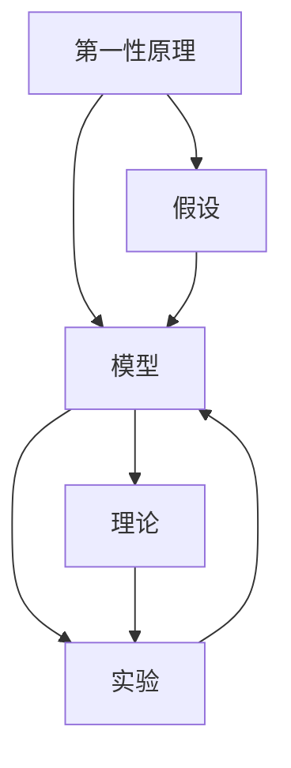

                 

# 第一性原理：科学探究的基石

## 1. 背景介绍

### 1.1 问题由来
第一性原理，又称为基本原理，是科学研究中最基础的理论基础，是从最根本的物理、化学或生物学原理出发，推导出的对现象的解释和预测。这种思维方式要求我们从最基本的出发点重新思考问题，避免陷入既有知识和经验的束缚，以达到更深入的洞察和创新。

### 1.2 问题核心关键点
第一性原理的核心在于打破常规思维，从最基本、最根本的原理出发，重新构建理论体系和解决实际问题。这种思维方式尤其适用于科学探究和技术创新，能够帮助人们突破现有框架，寻找全新的解决方案。

### 1.3 问题研究意义
掌握第一性原理，对于推动科学探究和技术创新，具有重要意义：

1. **促进创新**：第一性原理可以帮助研究者打破传统思维定势，从零开始思考，激发新的创新点。
2. **增强解决问题的能力**：通过重新审视问题的基础，研究者能够发现更本质、更有效的解决方案。
3. **提升理论深度**：基于第一性原理的研究能够深入理解现象背后的本质，构建更加严谨的科学理论。
4. **推动应用实践**：通过科学探究和技术创新，第一性原理能够为实际应用提供新的理论指导和技术手段。

## 2. 核心概念与联系

### 2.1 核心概念概述

为了更好地理解第一性原理，本节将介绍几个相关核心概念：

- **第一性原理(First-Principles)**：科学研究中的基本原理，要求从最本质、最根本的物理、化学或生物学原理出发，推导出对现象的解释和预测。
- **还原论(Reductionism)**：一种科学研究方法，强调将复杂系统拆解为简单的组成部分，通过对其理解来解释整个系统。
- **假设(Hypothesis)**：科学研究中的基本预设，用于构建理论框架，指导研究方向。
- **模型(Model)**：对复杂现象或系统进行抽象和简化的描述，便于进行理论推导和实验验证。
- **理论(Theory)**：基于假设和模型构建的逻辑体系，用于解释现象和预测未来。
- **实验(Experiment)**：通过实际操作验证理论的正确性，推动理论发展。

这些概念共同构成了第一性原理的核心思想框架，帮助研究者从最基础、最根本的原理出发，系统地构建理论体系，解决问题。

### 2.2 概念间的关系

这些核心概念之间存在着紧密的联系，形成了科学探究的基本逻辑链条：

1. 从第一性原理出发，构建假设和模型。
2. 通过模型推导理论，指导实验验证。
3. 实验验证理论的正确性，推动理论发展。
4. 理论指导新假设和模型，形成闭环。

通过这个逻辑链条，第一性原理不仅能够帮助研究者理解现象的本质，还能够促进科学探究和技术创新的不断进步。

### 2.3 核心概念的整体架构

为了更直观地展示这些概念之间的关系，我们可以使用以下Mermaid流程图来表示：



这个流程图展示了第一性原理与其他核心概念之间的逻辑关系：

1. 第一性原理作为起点，指导构建假设和模型。
2. 假设和模型共同推导出理论，进行实验验证。
3. 实验验证理论的正确性，推动理论进一步发展。
4. 新的理论指导新的假设和模型构建，形成持续循环。

## 3. 核心算法原理 & 具体操作步骤

### 3.1 算法原理概述

第一性原理的应用不仅限于科学研究，在技术创新、工程设计、商业策略等领域同样具有重要意义。基于第一性原理的技术创新，通常遵循以下基本步骤：

1. **理解现有技术**：分析现有技术的工作原理、优势和局限性。
2. **从基本原理出发**：重新审视技术的底层原理，寻找新的设计思路。
3. **构建新的假设和模型**：基于基本原理，提出新的假设和模型，指导技术创新。
4. **实验验证**：通过实际实验验证新模型的正确性，推动技术创新。
5. **优化和推广**：在验证基础上，对技术进行优化和推广，形成新的应用场景。

### 3.2 算法步骤详解

下面以第一性原理在机器学习领域的应用为例，详细介绍技术创新的具体步骤：

**Step 1: 理解现有技术**
分析当前机器学习模型的结构和算法，找出其优势和局限性。例如，传统机器学习模型通常依赖于大量标注数据，但对于数据不足的应用场景，效果可能不佳。

**Step 2: 从基本原理出发**
重新审视机器学习的本质，考虑是否可以从更基础、更根本的原理出发，提出新的技术思路。例如，基于信息论，考虑如何通过信息熵的最大化，优化机器学习模型的性能。

**Step 3: 构建新的假设和模型**
基于重新审视的基本原理，提出新的假设和模型。例如，通过最大化信息熵，构建信息最大化的机器学习模型，优化数据利用效率。

**Step 4: 实验验证**
通过实际实验验证新模型的效果，检查其是否符合预期。例如，在数据不足的应用场景中，通过信息最大化的机器学习模型进行实验验证，观察其性能提升效果。

**Step 5: 优化和推广**
在实验验证的基础上，对模型进行优化，推广到更多应用场景。例如，进一步优化信息最大化的机器学习模型，应用于更多数据不足的场景，取得更广泛的适用性。

### 3.3 算法优缺点

基于第一性原理的技术创新方法，具有以下优点：

1. **创新性**：从最根本的原理出发，能够打破现有框架，提出新的技术思路。
2. **基础性**：基于基本原理的创新，具有更强的理论基础，更能经受住时间的考验。
3. **通用性**：新模型和方法具有广泛的适用性，能够解决多种实际问题。

同时，该方法也存在一些局限性：

1. **复杂性**：从基本原理出发，重新构建理论和技术，需要较高的理论水平和工程实践经验。
2. **风险性**：新模型和方法的验证和推广，需要经过严格的实验验证，可能会面临高风险。
3. **资源需求**：重新构建模型和实验验证，需要较大的资源投入，包括时间、人力、资金等。

尽管如此，第一性原理在技术创新中仍然具有不可替代的重要地位，通过系统地分析问题和重新思考，能够为技术发展提供新的突破口和创新点。

### 3.4 算法应用领域

基于第一性原理的技术创新方法，在多个领域都有广泛应用：

1. **机器学习**：重新审视机器学习的基本原理，提出新的模型和算法，如信息最大化的机器学习、深度强化学习等。
2. **计算机视觉**：基于视觉感知的基本原理，提出新的图像处理和识别算法，如基于梯度的图像生成、零样本图像识别等。
3. **自然语言处理**：从语言处理的基本原理出发，提出新的语言模型和算法，如基于深度学习的语言模型、迁移学习等。
4. **软件工程**：重新审视软件开发的原理，提出新的编程语言和开发框架，如基于函数的编程语言、代码重构工具等。
5. **商业策略**：基于市场规律和经济学原理，提出新的商业模式和策略，如基于区块链的供应链管理、去中心化金融等。

## 4. 数学模型和公式 & 详细讲解 & 举例说明

### 4.1 数学模型构建

在技术创新中，数学模型是不可或缺的工具，用于构建假设和模型，进行理论推导和实验验证。以下是几个常见数学模型的构建过程：

1. **线性回归模型**：用于分析变量之间的关系，公式为 $y = \beta_0 + \beta_1x_1 + \beta_2x_2 + ... + \beta_nx_n$。其中，$y$ 为因变量，$x_i$ 为自变量，$\beta_i$ 为回归系数。
2. **决策树模型**：用于分类和回归，通过划分数据集，构建决策树。公式为：
   - 分类：$DecisionTree(x) = \left\{
     \begin{array}{lr}
       Branch_1, & \text{if } x_1 \leq threshold_1 \\
       Branch_2, & \text{if } x_1 > threshold_1
     \end{array} \right.$
   - 回归：$RegressionTree(x) = \sum_i(\beta_ix_i + \beta_0)$
3. **深度学习模型**：用于复杂数据处理和模式识别，公式为 $y = f(x; \theta)$，其中 $f$ 为神经网络函数，$\theta$ 为模型参数。

### 4.2 公式推导过程

以线性回归模型为例，进行公式推导过程：

假设有一组样本 $(x_1, y_1), (x_2, y_2), ..., (x_n, y_n)$，要求构建线性回归模型。

1. **数据标准化**：对自变量和因变量进行标准化处理，使其均值为0，方差为1。
2. **最小二乘法**：通过最小化预测误差 $\sum(y_i - \hat{y}_i)^2$，求解回归系数 $\beta_0$ 和 $\beta_i$。
3. **正则化**：为避免过拟合，引入正则化项 $\lambda(\beta_0^2 + \sum_i\beta_i^2)$，构建岭回归模型。
4. **优化求解**：通过梯度下降等优化算法，求解回归系数，最小化损失函数。

### 4.3 案例分析与讲解

以深度学习模型为例，分析其基本原理和应用场景：

**案例分析：图像分类**
- **基本原理**：深度学习模型通过多层神经网络，自动学习图像特征，进行分类。公式为：$y = f(x; \theta)$。
- **应用场景**：在图像分类任务中，深度学习模型能够自动提取图像特征，通过多层网络对图像进行分类，准确率通常较高。
- **优点**：能够处理复杂数据，适应性广，具有较高的自动化程度。
- **缺点**：需要大量标注数据，计算量大，模型复杂，难以解释。

## 5. 项目实践：代码实例和详细解释说明

### 5.1 开发环境搭建

在进行技术创新和项目实践前，需要先准备好开发环境。以下是使用Python进行PyTorch开发的环境配置流程：

1. 安装Anaconda：从官网下载并安装Anaconda，用于创建独立的Python环境。
2. 创建并激活虚拟环境：
```bash
conda create -n pytorch-env python=3.8 
conda activate pytorch-env
```

3. 安装PyTorch：根据CUDA版本，从官网获取对应的安装命令。例如：
```bash
conda install pytorch torchvision torchaudio cudatoolkit=11.1 -c pytorch -c conda-forge
```

4. 安装TensorFlow：
```bash
pip install tensorflow
```

5. 安装TensorBoard：
```bash
pip install tensorboard
```

6. 安装PyTorch和TensorFlow的兼容性工具：
```bash
pip install tf-nightly
```

完成上述步骤后，即可在`pytorch-env`环境中开始项目实践。

### 5.2 源代码详细实现

下面我们以基于第一性原理构建的深度学习模型为例，给出使用PyTorch进行模型构建的PyTorch代码实现。

```python
import torch
import torch.nn as nn
import torch.optim as optim

class Net(nn.Module):
    def __init__(self):
        super(Net, self).__init__()
        self.conv1 = nn.Conv2d(1, 10, kernel_size=5)
        self.conv2 = nn.Conv2d(10, 20, kernel_size=5)
        self.conv2_drop = nn.Dropout2d()
        self.fc1 = nn.Linear(320, 50)
        self.fc2 = nn.Linear(50, 10)

    def forward(self, x):
        x = nn.functional.relu(nn.functional.max_pool2d(self.conv1(x), 2))
        x = nn.functional.relu(nn.functional.max_pool2d(self.conv2_drop(self.conv2(x)), 2))
        x = x.view(-1, 320)
        x = nn.functional.relu(self.fc1(x))
        x = nn.functional.dropout(x, training=self.training)
        x = self.fc2(x)
        return nn.functional.log_softmax(x, dim=1)

# 加载数据
train_loader = torch.utils.data.DataLoader(train_data, batch_size=64, shuffle=True)
test_loader = torch.utils.data.DataLoader(test_data, batch_size=64, shuffle=True)

# 定义模型
model = Net()
optimizer = optim.SGD(model.parameters(), lr=0.01, momentum=0.5)

# 训练模型
for epoch in range(10):
    running_loss = 0.0
    for i, data in enumerate(train_loader, 0):
        inputs, labels = data
        optimizer.zero_grad()
        outputs = model(inputs)
        loss = nn.functional.nll_loss(outputs, labels)
        loss.backward()
        optimizer.step()
        running_loss += loss.item()
        if i % 100 == 99:
            print('[%d, %5d] loss: %.3f' %
                  (epoch + 1, i + 1, running_loss / 100))
            running_loss = 0.0

print('Finished Training')
```

### 5.3 代码解读与分析

让我们再详细解读一下关键代码的实现细节：

**Net类**：
- `__init__`方法：定义模型的网络结构，包括卷积层、池化层、全连接层等。
- `forward`方法：定义前向传播过程，通过卷积、池化、激活函数等操作，最终输出模型预测。

**训练流程**：
- 加载数据：使用PyTorch的DataLoader将数据集进行批处理，方便模型训练。
- 定义模型：使用Net类定义深度学习模型，包括网络结构、优化器等。
- 训练模型：通过循环迭代，进行前向传播和反向传播，更新模型参数，输出损失。

## 6. 实际应用场景

### 6.1 科学探究
基于第一性原理的科学研究，能够帮助研究者从最基础、最根本的原理出发，重新构建理论体系，解决实际问题。例如，量子力学的基本原理之一是波粒二象性，通过对这一原理的深入理解和应用，推动了量子计算和量子通信的发展。

### 6.2 技术创新
在技术创新中，第一性原理能够打破现有框架，提出全新的解决方案。例如，特斯拉公司通过重新思考电动汽车的基本原理，提出电池管理系统和高效充电技术，推动了电动汽车的普及。

### 6.3 商业策略
基于第一性原理的商业策略，能够帮助企业构建新的商业模式和策略。例如，阿里巴巴通过重新思考供应链管理的基本原理，提出全球物流网络和新零售策略，推动了其全球化的发展。

## 7. 工具和资源推荐

### 7.1 学习资源推荐

为了帮助开发者系统掌握第一性原理的理论基础和应用技巧，这里推荐一些优质的学习资源：

1. 《物理学的第一性原理》系列书籍：深入浅出地介绍了物理学中的基本原理和应用方法，是理解科学探究的基石。
2. 《创新者的窘境》一书：讨论了技术创新和产品生命周期的关系，帮助理解第一性原理在技术创新中的应用。
3. 《第一性原理：如何重塑创新》课程：由知名企业家埃隆·马斯克（Elon Musk）教授，介绍了第一性原理的基本原理和应用方法。
4. 《科学探究与工程创新》课程：斯坦福大学开设的工程类课程，深入讲解了科学探究的基本原理和应用技巧。
5. arXiv论文预印本：人工智能领域最新研究成果的发布平台，包括大量尚未发表的前沿工作，学习前沿技术的必读资源。

通过对这些资源的学习实践，相信你一定能够全面掌握第一性原理的精髓，并应用于实际的科学探究和技术创新中。

### 7.2 开发工具推荐

高效的开发离不开优秀的工具支持。以下是几款用于第一性原理研究和实践开发的常用工具：

1. Python编程语言：广泛用于科学计算和数据处理，支持丰富的数学库和科学计算框架。
2. Jupyter Notebook：强大的交互式编程环境，支持实时可视化和代码调试。
3. PyTorch和TensorFlow：两个流行的深度学习框架，支持复杂的数学模型和高效计算。
4. Visual Studio Code：轻量级代码编辑器，支持代码高亮、自动补全等功能。
5. TensorBoard：TensorFlow配套的可视化工具，可实时监测模型训练状态，并提供丰富的图表呈现方式。

合理利用这些工具，可以显著提升第一性原理研究和实践的开发效率，加速创新迭代的步伐。

### 7.3 相关论文推荐

第一性原理在科学探究和技术创新中具有广泛的应用，相关的研究论文也逐渐增多。以下是几篇具有代表性的相关论文，推荐阅读：

1. "Theoretical Aspects of Quantum Computing"：讨论了量子计算中的基本原理和算法，为量子信息科学的发展奠定了基础。
2. "The First Principles of Artificial Intelligence"：探讨了人工智能中的第一性原理，提出了基于因果推理和逻辑推理的智能模型。
3. "The First Principles of Economics"：讨论了经济学中的基本原理和模型，为经济学的研究提供了新的视角。
4. "The First Principles of Software Engineering"：探讨了软件开发中的基本原理和最佳实践，推动了软件工程的发展。
5. "The First Principles of Biology"：讨论了生物学的基本原理和模型，为生物学研究提供了新的方法和工具。

这些论文代表了第一性原理在多个领域的应用和发展，通过学习这些前沿成果，可以帮助研究者把握学科前进方向，激发更多的创新灵感。

除上述资源外，还有一些值得关注的前沿资源，帮助开发者紧跟第一性原理的研究进展，例如：

1. arXiv论文预印本：人工智能领域最新研究成果的发布平台，包括大量尚未发表的前沿工作，学习前沿技术的必读资源。
2. 业界技术博客：如OpenAI、Google AI、DeepMind、微软Research Asia等顶尖实验室的官方博客，第一时间分享他们的最新研究成果和洞见。
3. 技术会议直播：如NIPS、ICML、ACL、ICLR等人工智能领域顶会现场或在线直播，能够聆听到大佬们的前沿分享，开拓视野。
4. GitHub热门项目：在GitHub上Star、Fork数最多的研究项目，往往代表了该技术领域的发展趋势和最佳实践，值得去学习和贡献。
5. 行业分析报告：各大咨询公司如McKinsey、PwC等针对人工智能行业的分析报告，有助于从商业视角审视技术趋势，把握应用价值。

总之，对于第一性原理的学习和实践，需要开发者保持开放的心态和持续学习的意愿。多关注前沿资讯，多动手实践，多思考总结，必将收获满满的成长收益。

## 8. 总结：未来发展趋势与挑战

### 8.1 总结

本文对第一性原理进行了全面系统的介绍。首先阐述了第一性原理的基本概念和研究背景，明确了其对科学探究和技术创新的重要意义。其次，从原理到实践，详细讲解了第一性原理的应用过程和具体步骤，给出了技术创新的完整代码实例。同时，本文还广泛探讨了第一性原理在多个领域的应用前景，展示了其广泛的应用价值。最后，本文精选了第一性原理的学习资源和工具，力求为读者提供全方位的学习指引。

通过本文的系统梳理，可以看到，第一性原理不仅适用于科学研究，在技术创新、商业策略等领域同样具有重要地位。掌握第一性原理，能够帮助研究者从最基础、最根本的原理出发，系统地构建理论体系，推动科学探究和技术创新的不断进步。

### 8.2 未来发展趋势

展望未来，第一性原理将在以下几个方向继续发展：

1. **跨学科融合**：第一性原理的应用将跨越更多学科，与计算机科学、工程学、经济学等进行深度融合，推动更广泛的技术创新。
2. **深度整合**：第一性原理将与其他前沿技术，如区块链、人工智能、量子计算等进行更深入的整合，推动新兴技术的快速发展。
3. **应用拓展**：第一性原理将在更多领域得到应用，如医学、教育、环保等，为人类社会带来更多的创新和进步。
4. **方法演进**：基于第一性原理的研究方法将不断发展，引入更多的模型、算法和工具，推动科学探究和技术创新的持续进步。

以上趋势凸显了第一性原理的广泛应用前景和持续创新潜力。这些方向的探索发展，必将进一步推动科学探究和技术创新的不断进步，为人类社会的可持续发展提供新的动力。

### 8.3 面临的挑战

尽管第一性原理在科学探究和技术创新中取得了瞩目成就，但在迈向更加智能化、普适化应用的过程中，它仍面临着诸多挑战：

1. **复杂性**：第一性原理的应用需要较高的理论水平和工程实践经验，对于复杂问题需要更为深入的分析。
2. **风险性**：第一性原理的应用涉及更多的未知领域，可能面临高风险和高成本。
3. **资源需求**：第一性原理的应用需要更多的资源投入，包括时间、人力、资金等。

尽管如此，第一性原理在技术创新和科学探究中仍然具有不可替代的重要地位，通过系统地分析问题和重新思考，能够为技术发展提供新的突破口和创新点。

### 8.4 未来突破

面对第一性原理面临的这些挑战，未来的研究需要在以下几个方面寻求新的突破：

1. **跨学科协同**：结合不同学科的研究方法，推动跨学科的协同创新，解决更复杂的问题。
2. **资源优化**：优化第一性原理的应用资源，引入更高效的工具和技术，降低应用成本。
3. **数据驱动**：利用大数据和机器学习技术，优化实验设计和数据分析，提高研究的效率和准确性。
4. **领域专门化**：针对特定领域，开发更加专门化的第一性原理应用模型和方法，提升应用效果。
5. **知识融合**：将第一性原理与专家知识进行结合，引入更多的先验知识和规则，提升模型的准确性和泛化能力。

这些研究方向的探索，必将引领第一性原理的不断发展，为科学探究和技术创新提供新的方法和工具，推动人类社会的全面进步。

## 9. 附录：常见问题与解答

**Q1：第一性原理是否适用于所有领域？**

A: 第一性原理适用于科学探究和技术创新，但并非适用于所有领域。对于某些领域，如艺术、社会学等，第一性原理的应用可能较为有限。

**Q2：如何理解第一性原理的"第一性"？**

A: 第一性原理的"第一性"是指从最基本的、最根本的原理出发，重新构建理论体系，避免陷入既有知识和经验的束缚，寻找全新的解决方案。

**Q3：第一性原理是否与还原论相同？**

A: 第一性原理和还原论有一定的相似之处，但并不完全相同。还原论强调将复杂系统拆解为简单的组成部分，而第一性原理更注重从最基本的原理出发，重新构建理论体系。

**Q4：第一性原理的应用是否只适用于科学研究？**

A: 第一性原理不仅适用于科学研究，在技术创新、商业策略等领域同样具有重要地位。通过重新审视基本原理，可以提出全新的解决方案，推动技术的突破和发展。

**Q5：第一性原理的应用是否需要大量的理论知识？**

A: 第一性原理的应用需要较高的理论水平和工程实践经验，但并不是需要大量的理论知识。通过系统学习和实践，可以逐步掌握第一性原理的基本方法和应用技巧。

总之，第一性原理是科学探究和技术创新中重要的思维方式和方法论，通过系统地分析问题和重新思考，能够为技术发展提供新的突破口和创新点，推动人类社会的全面进步。掌握第一性原理，将使你在科学研究、技术创新和商业策略中具备更强的理论基础和应用能力，推动更多领域的创新和进步。

