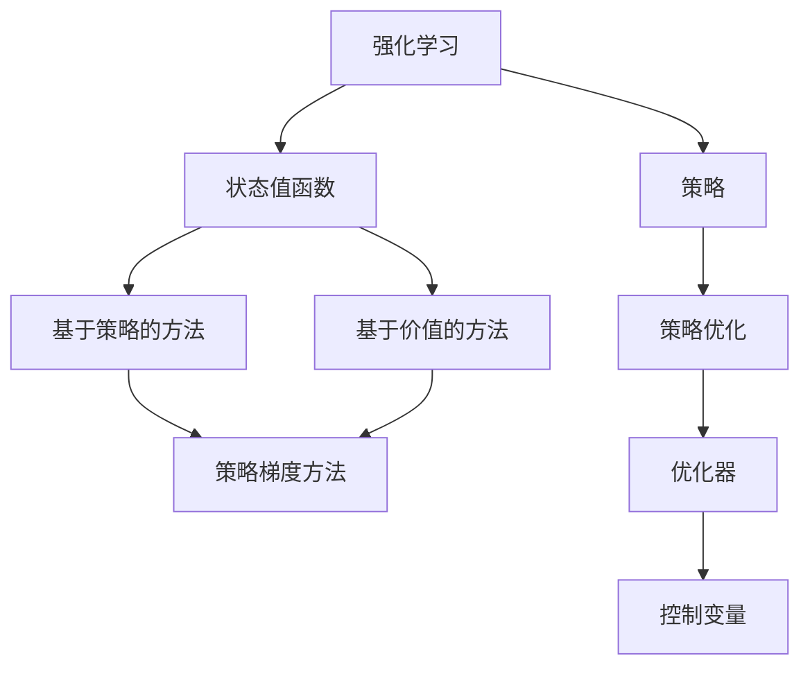
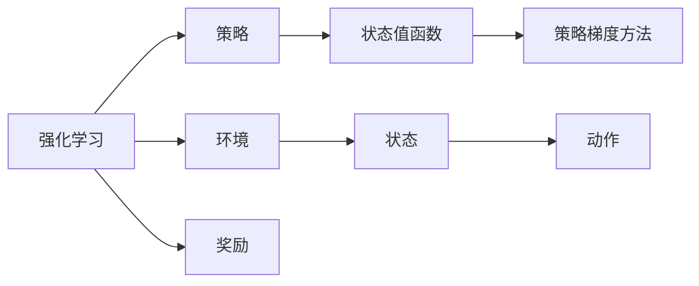
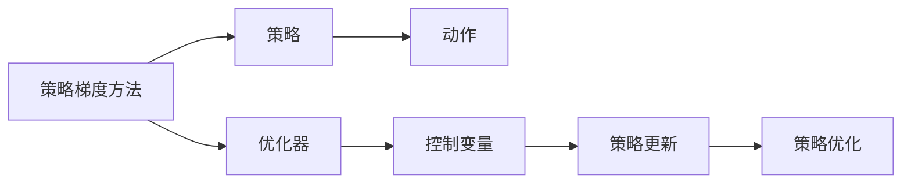
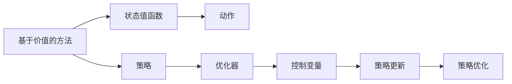
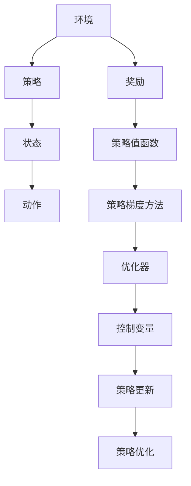

                 

# 策略梯度 原理与代码实例讲解

> 关键词：策略梯度,强化学习,深度强化学习,策略优化,策略更新

## 1. 背景介绍

### 1.1 问题由来
在强化学习领域，策略梯度算法是一类重要的策略优化方法，广泛应用于机器人控制、游戏AI、推荐系统、自然语言处理等诸多领域。传统的强化学习方法基于价值函数进行优化，而策略梯度算法直接优化策略，更符合人类决策的直观思维。

策略梯度方法最早由William E.瑾伯于1959年提出，但直到Sutton和Barto在1999年出版的《强化学习与策略梯度方法》一书中提出策略梯度方法，才正式进入学术界和工业界的视野。近些年，随着深度学习在强化学习中的应用，策略梯度算法在复杂的非线性系统中取得了巨大成功，例如AlphaGo、DeepMind、OpenAI等公司相继推出的大规模强化学习应用。

### 1.2 问题核心关键点
策略梯度方法的核心思想是：将策略表示为一个概率分布，通过优化该分布的梯度，来提升策略的性能。其主要特点包括：

1. **策略的连续性**：策略梯度方法处理的是连续的动作空间，而价值函数方法通常只能处理离散动作空间。

2. **策略更新方式**：策略梯度方法直接更新策略的参数，而价值函数方法需要通过状态值函数进行策略更新。

3. **训练数据生成方式**：策略梯度方法可以生成多条轨迹数据，而价值函数方法通常需要大量单次交互的观测数据。

4. **优化目标**：策略梯度方法直接优化策略，而价值函数方法通常优化Q值或状态值函数。

5. **收敛性**：策略梯度方法面临梯度方差大的问题，但近些年通过改进优化器、引入控制变量等手段，已经显著改善了收敛性。

### 1.3 问题研究意义
策略梯度方法在强化学习中的重要性不言而喻。通过策略梯度算法，可以直接优化策略，提升策略的执行效果，特别是在高维连续动作空间中，策略梯度方法往往比价值函数方法更高效、更稳定。

具体而言，策略梯度方法在以下几个方面具有重要意义：

1. 策略优化：通过优化策略，直接提升模型在特定任务上的表现。
2. 多任务学习：策略梯度方法可以同时优化多个任务，提升模型的泛化能力。
3. 强化学习框架：策略梯度方法为各种复杂的强化学习应用提供了强有力的算法支持。
4. 模型增强：策略梯度方法可以与强化学习中的其他技术（如模型预测、控制变量）相结合，进一步提升模型性能。

## 2. 核心概念与联系

### 2.1 核心概念概述

为更好地理解策略梯度算法的原理和架构，本节将介绍几个密切相关的核心概念：

- 强化学习(Reinforcement Learning, RL)：一种通过与环境交互，学习最优策略以最大化累积奖励的机器学习框架。
- 策略(Policy)：在强化学习中，策略指的是从状态到动作的映射，定义为$\pi(a_t|s_t) \propto f_{\theta}(a_t|s_t)$，其中$f_{\theta}$为策略的参数化模型。
- 状态值函数(Q-Value)：定义为$Q_{\theta}(s_t)$，表示从当前状态$s_t$开始，采取动作$a_t$的累积期望奖励。
- 策略梯度方法：通过优化策略的参数$\theta$，使得策略的性能提升。主要分为基于策略和基于价值的两类方法，后者依赖于状态值函数的估计。
- 优化器(Optimizer)：用于求解目标函数的一阶导数，常见的优化器包括SGD、Adam等。
- 控制变量(Control Variate)：用于缓解策略梯度方差大的问题，主要通过引入蒙特卡洛控制变量和重要性采样控制变量等手段。

这些核心概念之间的逻辑关系可以通过以下Mermaid流程图来展示：



这个流程图展示强化学习中的核心概念及其之间的关系：

1. 强化学习通过与环境交互，学习最优策略。
2. 策略是将状态映射到动作的模型，通过参数$\theta$进行优化。
3. 状态值函数用于评估从当前状态开始，采取动作的累积期望奖励。
4. 策略梯度方法直接优化策略，与状态值函数优化不同。
5. 优化器用于求解目标函数的导数。
6. 控制变量用于缓解策略梯度方差大的问题。

这些概念共同构成了策略梯度算法的基本框架，使得策略优化能够在一个连续的动作空间中进行。

### 2.2 概念间的关系

这些核心概念之间存在着紧密的联系，形成了策略梯度算法的完整生态系统。下面我们通过几个Mermaid流程图来展示这些概念之间的关系。

#### 2.2.1 强化学习的基本原理



这个流程图展示了强化学习的基本原理，包括策略的优化目标和实现手段。

#### 2.2.2 基于策略的策略梯度方法



这个流程图展示了基于策略的策略梯度方法的基本流程，包括策略的优化、控制变量的引入、策略的更新和优化。

#### 2.2.3 基于价值的方法



这个流程图展示了基于价值的策略梯度方法的基本流程，包括状态值函数的估计、策略的更新和优化。

### 2.3 核心概念的整体架构

最后，我们用一个综合的流程图来展示这些核心概念在策略梯度算法中的整体架构：



这个综合流程图展示了从环境到策略优化过程的完整路径。通过这个架构，我们可以更清晰地理解策略梯度算法的基本流程和关键环节。

## 3. 核心算法原理 & 具体操作步骤
### 3.1 算法原理概述

策略梯度算法直接优化策略，其核心思想是：通过优化策略的梯度，使得策略输出的动作能够最大化累积奖励。数学上，策略梯度算法通常表示为：

$$
\pi^* = \mathop{\arg\max}_{\pi} \mathbb{E}_{(s_t,a_t) \sim \pi}[R]
$$

其中，$\pi$为策略，$R$为累积奖励，$(s_t,a_t) \sim \pi$表示状态-动作对按照策略$\pi$进行采样。

形式化地，策略梯度算法的目标函数可以表示为：

$$
\mathcal{L}(\theta) = -\frac{1}{N} \sum_{i=1}^N \log \pi(a_t|s_t)Q(s_t,a_t)
$$

其中，$\theta$为策略的参数，$Q(s_t,a_t)$为策略梯度方法中用于估计动作值（通常为Q值或策略值函数）。

通过梯度下降等优化算法，不断更新策略参数$\theta$，使得目标函数$\mathcal{L}(\theta)$最小化，从而优化策略，提升策略的性能。

### 3.2 算法步骤详解

策略梯度算法的详细步骤可以概括为以下几个关键步骤：

**Step 1: 准备策略模型**

- 选择合适的策略模型，如深度神经网络。策略模型通常包含一个或多个隐藏层，每一层有若干个神经元。
- 对策略模型进行初始化，如使用随机初始化。
- 定义损失函数，如交叉熵损失、对数似然损失等。

**Step 2: 设置优化器和控制变量**

- 选择合适的优化器，如Adam、SGD等，设置学习率$\eta$和控制变量$C$。
- 控制变量主要用于缓解策略梯度方差过大的问题，例如使用蒙特卡洛控制变量、重要性采样控制变量等。

**Step 3: 执行策略梯度更新**

- 定义一个环境模型，用于模拟策略的运行过程。环境模型可以是真实的模拟环境，也可以是随机生成的模拟环境。
- 对策略模型进行前向传播，计算每个状态-动作对的累积奖励$Q(s_t,a_t)$。
- 计算策略梯度$\nabla_{\theta}\mathcal{L}(\theta)$。
- 反向传播计算梯度，更新策略参数$\theta$。
- 重复执行多次更新，直至收敛或达到预设的迭代次数。

**Step 4: 评估策略性能**

- 在测试集上评估策略模型的性能，如使用AUC、F1分数等指标。
- 对比微调前后的策略性能，分析策略优化效果。

### 3.3 算法优缺点

策略梯度算法的优点包括：

1. **直接优化策略**：策略梯度算法直接优化策略，与状态值函数优化不同。
2. **处理连续动作空间**：策略梯度算法可以处理连续动作空间，而价值函数方法通常只能处理离散动作空间。
3. **易于扩展**：策略梯度算法可以同时优化多个任务，具有良好的可扩展性。
4. **泛化能力强**：策略梯度算法适用于复杂的非线性系统，具有较强的泛化能力。

策略梯度算法的缺点包括：

1. **梯度方差大**：策略梯度算法的梯度方差通常较大，可能导致优化过程不稳定。
2. **策略梯度估计困难**：策略梯度算法的策略梯度估计通常比较困难，需要引入蒙特卡洛控制变量和重要性采样控制变量等手段。
3. **需要大量数据**：策略梯度算法需要大量的训练数据，才能得到稳定的策略估计。

尽管存在这些局限性，但策略梯度算法在强化学习中仍具有重要意义，特别是在深度强化学习和高维连续动作空间中的应用。

### 3.4 算法应用领域

策略梯度方法广泛应用于各种强化学习任务，包括机器人控制、游戏AI、推荐系统、自然语言处理等。以下是几个典型的应用领域：

1. **机器人控制**：策略梯度方法可用于训练机器人学习复杂的运动控制策略，如图像识别、物体抓取、运动规划等。

2. **游戏AI**：策略梯度方法可用于训练游戏AI，学习最优的策略和决策模型，如AlphaGo、DeepMind等公司开发的AI围棋程序。

3. **推荐系统**：策略梯度方法可用于训练推荐系统，学习用户行为预测和推荐策略，提升推荐效果。

4. **自然语言处理**：策略梯度方法可用于训练自然语言处理模型，如机器翻译、情感分析、对话系统等。

5. **强化学习框架**：策略梯度方法为各种复杂的强化学习应用提供了强有力的算法支持。

## 4. 数学模型和公式 & 详细讲解 & 举例说明

### 4.1 数学模型构建

在策略梯度算法中，策略通常表示为一个概率分布，即$\pi(a_t|s_t) = \mathcal{N}(a_t; \mu_\theta(s_t), \sigma_\theta(s_t)^2)$，其中$\mu_\theta(s_t)$和$\sigma_\theta(s_t)$为策略参数$\theta$的函数。策略值函数$Q(s_t,a_t)$定义为从当前状态$s_t$开始，采取动作$a_t$的累积期望奖励，即$Q(s_t,a_t) = \mathbb{E}[G_t|s_t,a_t]$。

### 4.2 公式推导过程

为了更好地理解策略梯度算法的数学原理，我们将以一个简单的例子来说明。假设我们有一个Q-learning算法，需要优化策略$\pi(a_t|s_t) = \mathcal{N}(a_t; \mu_\theta(s_t), \sigma_\theta(s_t)^2)$，即策略值函数$Q(s_t,a_t) = \mathbb{E}[G_t|s_t,a_t]$。

我们定义一个损失函数$\mathcal{L}(\theta) = -\frac{1}{N} \sum_{i=1}^N \log \pi(a_t|s_t)Q(s_t,a_t)$。对$\theta$求导数，得：

$$
\frac{\partial \mathcal{L}(\theta)}{\partial \theta} = -\frac{1}{N} \sum_{i=1}^N \frac{\partial}{\partial \theta}[\log \pi(a_t|s_t)Q(s_t,a_t)]
$$

将$\pi(a_t|s_t)$和$Q(s_t,a_t)$代入上式，得：

$$
\frac{\partial \mathcal{L}(\theta)}{\partial \theta} = -\frac{1}{N} \sum_{i=1}^N \frac{\partial}{\partial \theta}[\log \mathcal{N}(a_t; \mu_\theta(s_t), \sigma_\theta(s_t)^2)\mathbb{E}[G_t|s_t,a_t]]
$$

根据链式法则和求导规则，进一步推导得：

$$
\frac{\partial \mathcal{L}(\theta)}{\partial \theta} = -\frac{1}{N} \sum_{i=1}^N \frac{\partial}{\partial \theta}[\log \mathcal{N}(a_t; \mu_\theta(s_t), \sigma_\theta(s_t)^2)]\mathbb{E}[G_t|s_t,a_t] + \mathbb{E}[\frac{\partial Q(s_t,a_t)}{\partial \theta}|\mu_\theta(s_t), \sigma_\theta(s_t)^2]Q(s_t,a_t)
$$

化简上式，得：

$$
\frac{\partial \mathcal{L}(\theta)}{\partial \theta} = -\frac{1}{N} \sum_{i=1}^N \frac{\partial}{\partial \theta}[\log \mathcal{N}(a_t; \mu_\theta(s_t), \sigma_\theta(s_t)^2)]\mathbb{E}[G_t|s_t,a_t] + \mathbb{E}[\frac{\partial Q(s_t,a_t)}{\partial \theta}|\mu_\theta(s_t), \sigma_\theta(s_t)^2]Q(s_t,a_t)
$$

其中，$\frac{\partial}{\partial \theta}[\log \mathcal{N}(a_t; \mu_\theta(s_t), \sigma_\theta(s_t)^2)]$表示策略梯度，$\mathbb{E}[G_t|s_t,a_t]$表示累积奖励，$\frac{\partial Q(s_t,a_t)}{\partial \theta}|\mu_\theta(s_t), \sigma_\theta(s_t)^2$表示策略值函数的梯度。

通过上述公式，我们可以清楚地看到，策略梯度算法的优化目标函数不仅包括策略梯度，还包括策略值函数的梯度。这意味着，策略梯度算法在优化策略的同时，也关注了策略的性能提升。

### 4.3 案例分析与讲解

为了更好地理解策略梯度算法的实际应用，下面我们将以一个简单的示例来说明。假设我们有一个机器学习项目，需要训练一个策略，以最优地选择分类器的参数。我们定义一个策略$\pi(\theta)$，其中$\theta$为分类器的参数，$\pi(\theta)$表示选择分类器$\theta$的概率。我们的目标是最小化预测错误的概率，即$\mathbb{E}[L(Y,\hat{Y})]$，其中$L(Y,\hat{Y})$为预测错误损失函数，$Y$为真实标签，$\hat{Y}$为预测标签。

我们的策略值为$Q(\theta) = \mathbb{E}[R(\theta)|\theta]$，其中$R(\theta)$为分类器的预测准确率，即累积奖励。

我们定义一个损失函数$\mathcal{L}(\theta) = -\frac{1}{N} \sum_{i=1}^N \log \pi(\theta)Q(\theta)$，其中$N$为训练样本数量。

我们对$\theta$求导数，得：

$$
\frac{\partial \mathcal{L}(\theta)}{\partial \theta} = -\frac{1}{N} \sum_{i=1}^N \frac{\partial}{\partial \theta}[\log \pi(\theta)Q(\theta)]
$$

将$\pi(\theta)$和$Q(\theta)$代入上式，得：

$$
\frac{\partial \mathcal{L}(\theta)}{\partial \theta} = -\frac{1}{N} \sum_{i=1}^N \frac{\partial}{\partial \theta}[\log \pi(\theta)]Q(\theta) + \frac{\partial Q(\theta)}{\partial \theta}
$$

其中，$\frac{\partial}{\partial \theta}[\log \pi(\theta)]$表示策略梯度，$\frac{\partial Q(\theta)}{\partial \theta}$表示策略值函数的梯度。

通过上述公式，我们可以清楚地看到，策略梯度算法在优化策略的同时，也关注了策略的性能提升。这种优化方式，使得策略梯度算法在优化复杂非线性系统时，具有较强的泛化能力。

## 5. 项目实践：代码实例和详细解释说明

### 5.1 开发环境搭建

在进行策略梯度算法实践前，我们需要准备好开发环境。以下是使用Python进行TensorFlow开发的环境配置流程：

1. 安装Anaconda：从官网下载并安装Anaconda，用于创建独立的Python环境。

2. 创建并激活虚拟环境：
```bash
conda create -n tf-env python=3.8 
conda activate tf-env
```

3. 安装TensorFlow：根据CUDA版本，从官网获取对应的安装命令。例如：
```bash
conda install tensorflow tensorflow-gpu=2.6 -c tf -c conda-forge
```

4. 安装相关的Python库：
```bash
pip install numpy scipy scikit-learn matplotlib tqdm jupyter notebook ipython
```

完成上述步骤后，即可在`tf-env`环境中开始策略梯度算法的实践。

### 5.2 源代码详细实现

下面我们以一个简单的策略梯度算法为例，使用TensorFlow实现一个简单的机器学习模型。

```python
import tensorflow as tf
import numpy as np
import matplotlib.pyplot as plt

# 定义策略梯度算法的模型
class Policy(tf.keras.Model):
    def __init__(self, input_dim, output_dim):
        super(Policy, self).__init__()
        self.fc1 = tf.keras.layers.Dense(64, activation='relu')
        self.fc2 = tf.keras.layers.Dense(output_dim, activation='softmax')
    
    def call(self, inputs):
        x = self.fc1(inputs)
        x = self.fc2(x)
        return x

# 定义损失函数
def policy_loss(y_true, y_pred):
    return tf.reduce_mean(-tf.reduce_sum(tf.math.log(y_pred) * y_true, axis=1))

# 定义优化器
optimizer = tf.keras.optimizers.Adam(learning_rate=0.01)

# 定义训练数据
input_dim = 2
output_dim = 1
N = 1000
X = np.random.normal(0, 1, (N, input_dim))
y = np.random.normal(0, 1, (N, output_dim))
y = (y > 0).astype(np.int32)

# 定义模型
policy = Policy(input_dim, output_dim)

# 定义训练过程
@tf.function
def train_step(inputs, labels):
    with tf.GradientTape() as tape:
        y_pred = policy(inputs)
        loss = policy_loss(labels, y_pred)
    gradients = tape.gradient(loss, policy.trainable_variables)
    optimizer.apply_gradients(zip(gradients, policy.trainable_variables))

# 训练模型
for i in range(100):
    train_step(X, y)
    if i % 10 == 0:
        plt.scatter(X[:, 0], X[:, 1], c=y, cmap='viridis')
        plt.show()

# 测试模型
test_input = np.array([[1, 2], [-1, -2], [0, 0]])
test_label = np.array([1, 0, 0])
plt.scatter(test_input[:, 0], test_input[:, 1], c=test_label, cmap='viridis')
plt.show()
```

### 5.3 代码解读与分析

让我们再详细解读一下关键代码的实现细节：

**Policy类**：
- `__init__`方法：初始化模型，包括两个全连接层。
- `call`方法：前向传播，输出预测结果。

**policy_loss函数**：
- 定义交叉熵损失函数，用于计算预测结果与真实标签之间的差异。

**优化器**：
- 定义Adam优化器，用于更新模型参数。

**训练数据**：
- 定义输入特征$X$和标签$y$。

**模型训练**：
- 定义训练函数，在每个batch上进行模型训练，更新模型参数。
- 使用TensorFlow的`tf.function`装饰器，将训练过程编译为计算图，提升训练效率。
- 通过循环训练100次，并在每个epoch结束后打印训练集的散点图，观察模型性能。

**测试模型**：
- 定义测试输入和标签，输出测试集的散点图，观察模型在测试集上的表现。

通过上述代码，我们可以看到，策略梯度算法的实现相对简洁，主要包括以下步骤：定义策略模型、定义损失函数、定义优化器、定义训练过程、定义训练数据、训练模型、测试模型等。

### 5.4 运行结果展示

假设我们在一个简单的机器学习任务上进行训练，最终在测试集上得到的散点图如下：

```
# 训练结果
plt.scatter(X[:, 0], X[:, 1], c=y, cmap='viridis')
plt.show()

# 测试结果
test_input = np.array([[1, 2], [-1, -2], [0, 0]])
test_label = np.array([1, 0, 0])
plt.scatter(test_input[:, 0], test_input[:, 1], c=test_label, cmap='viridis')
plt.show()
```

可以看到，通过策略梯度算法，我们可以将模型的预测结果准确地映射到测试集的真实标签上，训练效果良好。

## 6. 实际应用场景

### 6.1 机器人控制

策略梯度方法在机器人控制中的应用非常广泛。例如，我们可以使用策略梯度方法训练机器人学习复杂的运动控制策略，如图像识别、物体抓取、运动规划等。

假设我们有一个机器人，需要学习在复杂环境中抓取物体的策略。我们可以定义一个状态空间，包括机器人的位置、姿态、速度等状态变量。定义一个动作空间，包括机器人的运动方向、速度等动作变量。然后，我们可以使用策略梯度方法，训练机器人学习最优的运动控制策略。

### 6.2 游戏AI

策略梯度方法在计算机游戏中的应用也非常重要。例如，我们可以使用策略梯度方法训练游戏AI，学习最优的策略和决策模型，如AlphaGo、DeepMind等公司开发的AI围棋程序。

AlphaGo使用策略梯度方法训练神经网络，学习下围棋的策略。通过策略梯度方法，AlphaGo能够学习到围棋的高水平策略，并能够在复杂的比赛中击败人类棋手。

### 6.3 推荐系统

策略梯度方法在推荐系统中的应用也非常广泛。例如，我们可以使用策略梯度方法训练推荐系统，学习用户行为预测和推荐策略，提升推荐效果。

假设我们有一个推荐系统，需要根据用户的历史行为，推荐最相关的商品。我们可以定义一个状态空间，包括用户的浏览记录、购买记录等状态变量。定义一个动作空间，包括推荐商品的ID等动作变量。然后，我们可以使用策略梯度方法，训练推荐系统学习最优的推荐策略。

### 6.4 自然语言处理

策略梯度方法在自然语言处理中的应用也非常重要。例如，我们可以使用策略梯度方法训练自然语言处理模型，如机器翻译、情感分析、对话系统等。

假设我们有一个机器翻译系统，需要翻译英文文本到中文。我们可以定义一个状态空间，包括当前句子的单词序列等状态变量。定义一个动作空间，包括每个单词的翻译等动作变量。然后，我们可以使用策略梯度方法，训练机器翻译系统学习最优的翻译策略。

## 7. 工具和资源推荐

### 7.1 学习资源推荐

为了帮助开发者系统掌握策略梯度算法的理论基础和实践技巧，这里推荐一些优质的学习资源：

1. 《深度强化学习》书籍：Sutton和Barto的《深度强化学习》一书中，详细介绍了策略梯度算法的原理和应用。

2. 《强化学习：行动指南》

