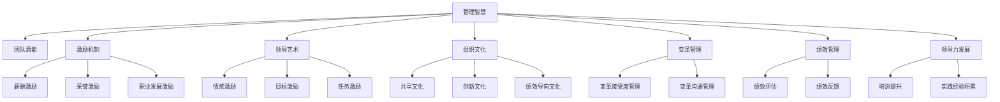
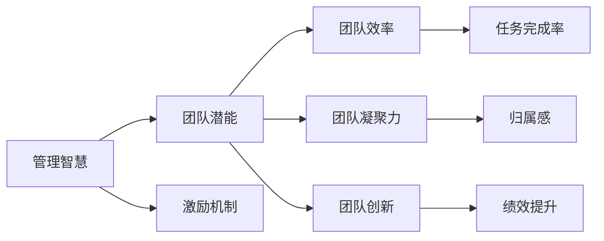
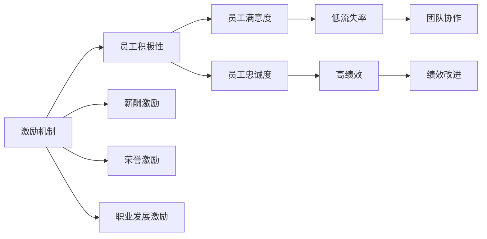
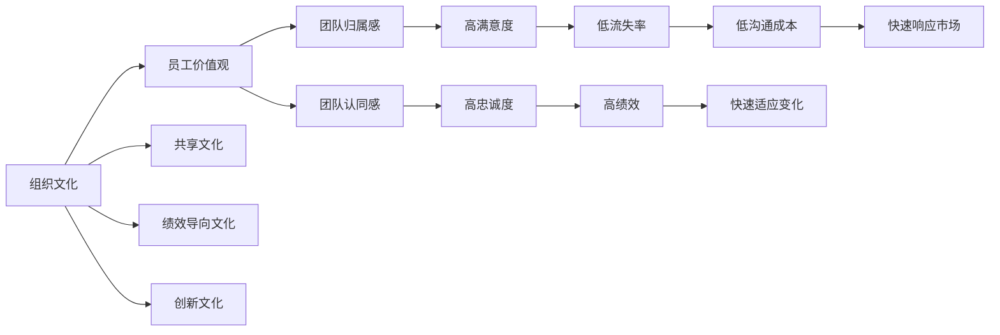

                 

# 管理的智慧：激发团队潜能

> 关键词：管理智慧,团队潜能,激励机制,领导艺术,组织文化,变革管理,绩效管理,领导力发展

## 1. 背景介绍

### 1.1 问题由来
随着全球经济的快速发展和信息化时代的到来，企业面临的环境越来越复杂多变，团队管理和人员激励的重要性日益凸显。在信息技术和互联网的推动下，团队协作和知识共享日益成为企业竞争的关键因素。然而，如何高效地管理和激发团队潜能，成为摆在企业领导面前的重要课题。

近年来，随着管理学、心理学和行为科学等学科的不断融合，关于团队管理的理论和实践得到了快速发展。其中，以人类动机理论为基础的各种激励机制、领导艺术和组织文化建设等理论，为企业管理实践提供了宝贵的指导。但这些理论和方法往往较为抽象，缺乏具体的执行指导。本文旨在将管理智慧与技术实践相结合，为企业管理者提供一套系统的方法，激发团队潜能，提高组织绩效。

### 1.2 问题核心关键点
管理的核心在于领导和激励。领导者的任务是引导团队达成共同目标，而激励机制则提供必要的动力和支持，帮助团队成员克服困难、积极工作。管理智慧不仅体现在理论知识的掌握，更体现在具体实践的执行。本文将深入探讨管理智慧的核心理念，并结合实际案例，介绍一系列基于技术手段的激励和管理方法，帮助管理者更好地激发团队潜能。

### 1.3 问题研究意义
研究管理智慧和团队潜能的激发，对于提升企业竞争力、提高员工满意度和忠诚度、促进企业持续发展具有重要意义：

1. **提高团队效率**：通过有效的管理方法和激励机制，能够显著提高团队的工作效率和创新能力。
2. **增强员工归属感**：良好的组织文化和工作环境，能够提升员工的归属感和满意度，降低流失率。
3. **促进知识共享**：有效的团队协作和知识管理机制，能够促进团队成员之间的知识共享和信息传递。
4. **推动绩效改进**：通过科学的管理和激励手段，能够实现团队绩效的持续提升。
5. **培养领导力**：管理者通过实践管理智慧，能够提升自身的领导力和影响力，成为团队和企业的核心驱动力。

## 2. 核心概念与联系

### 2.1 核心概念概述

为了更好地理解如何通过技术手段激发团队潜能，本节将介绍几个密切相关的核心概念：

- **管理智慧(Management Wisdom)**：指在复杂多变的环境中，管理者通过综合运用理论知识和实践经验，高效地实现团队目标的能力。管理智慧不仅包括理论知识，更注重实际操作和决策。

- **团队潜能(Team Potential)**：指团队在一定条件下所能达到的最大工作效果和绩效。团队潜能的激发，是管理智慧的重要目标之一。

- **激励机制(Incentive Mechanism)**：指通过各种手段和措施，激发员工积极性和创造力的机制。常见的激励方式包括薪酬激励、荣誉激励、职业发展激励等。

- **领导艺术(Leadership Art)**：指领导者通过艺术化的管理和领导方式，激励和引导团队成员实现目标的能力。领导艺术强调情感共鸣和个性化的管理方式。

- **组织文化(Organizational Culture)**：指企业内部共享的价值观、信念和行为规范。良好的组织文化能够增强团队凝聚力和归属感。

- **变革管理(Change Management)**：指在组织变革过程中，如何管理和引导员工适应变化、接受新事物的过程。变革管理是提高组织适应力和竞争力的关键。

- **绩效管理(Performance Management)**：指通过系统化的管理手段，对员工的工作绩效进行评估和反馈，以促进绩效提升。

- **领导力发展(Leadership Development)**：指通过培训和实践，提升管理者的领导力水平，使其能够更好地引领团队和组织。

这些核心概念之间的逻辑关系可以通过以下Mermaid流程图来展示：



这个流程图展示了从管理智慧到团队潜能激发的一系列关键过程和概念，以及它们之间的联系。

### 2.2 概念间的关系

这些核心概念之间存在着紧密的联系，形成了企业管理和激励的系统生态。下面我们通过几个Mermaid流程图来展示这些概念之间的关系。

#### 2.2.1 管理智慧与团队潜能的关系



这个流程图展示了管理智慧如何通过激励机制，激发团队潜能，从而提高团队效率、凝聚力和创新能力。

#### 2.2.2 激励机制与领导艺术的关系



这个流程图展示了激励机制如何通过不同的激励方式，提升员工积极性和满意度，最终提高员工的忠诚度和团队绩效。

#### 2.2.3 组织文化与变革管理的关系



这个流程图展示了组织文化如何通过共享、绩效导向和创新文化，提高员工归属感和团队认同感，降低流失率，提高绩效和团队协作能力，从而增强组织适应力和市场响应速度。

### 2.3 核心概念的整体架构

最后，我们用一个综合的流程图来展示这些核心概念在大语言模型微调过程中的整体架构：

```mermaid
graph TB
    A[组织变革] --> B[文化建设]
    B --> C[价值观融合]
    C --> D[绩效管理]
    D --> E[绩效评估]
    D --> F[绩效反馈]
    D --> G[培训提升]
    D --> H[经验积累]
    E --> I[目标设定]
    E --> J[目标分解]
    E --> K[任务分配]
    E --> L[团队协作]
    E --> M[创新激励]
    F --> N[激励机制]
    F --> O[薪酬激励]
    F --> P[荣誉激励]
    F --> Q[职业发展激励]
    G --> R[领导力提升]
    G --> S[经验实践]
    H --> T[知识共享]
    I --> U[任务监控]
    J --> V[资源分配]
    K --> W[执行监控]
    L --> X[知识交流]
    M --> Y[创新推动]
    N --> Z[员工积极性]
    O --> AA[薪资激励]
    P --> BB[荣誉激励]
    Q --> CC[职业发展激励]
    R --> DD[领导影响力]
    S --> EE[实践经验]
    T --> FF[信息透明度]
    U --> GG[绩效反馈]
    V --> HH[资源优化]
    W --> II[进度跟踪]
    X --> JJ[知识共享]
    Y --> KK[创新驱动]
    Z --> LL[员工满意]
    AA --> MM[薪酬激励]
    BB --> NN[荣誉激励]
    CC --> OO[职业发展激励]
    DD --> PP[领导影响力]
    EE --> QQ[实践经验]
    FF --> RR[信息透明度]
    GG --> SS[绩效反馈]
    HH --> TT[资源优化]
    II --> UU[进度跟踪]
    JJ --> VV[知识共享]
    KK --> WW[创新驱动]
    LL --> XX[员工满意]
    MM --> YY[薪酬激励]
    NN --> ZZ[荣誉激励]
    OO --> Aa[职业发展激励]
    PP --> Ba[领导影响力]
    QQ --> Ca[实践经验]
    RR --> Da[信息透明度]
    SS --> Eb[绩效反馈]
    TT --> Fb[资源优化]
    UU --> Gb[进度跟踪]
    VV --> Hb[知识共享]
    WW --> Ib[创新驱动]
    XX --> Jb[员工满意]
    YY --> Kb[薪酬激励]
    ZZ --> Lb[荣誉激励]
    Aa --> Mb[职业发展激励]
    Ba --> Nb[领导影响力]
    Ca --> Ob[实践经验]
    Da --> Pb[信息透明度]
    Eb --> Qb[绩效反馈]
    Fb --> Rb[资源优化]
    Gb --> Sb[进度跟踪]
    Hb --> Tb[知识共享]
    Ib --> Ub[创新驱动]
    Jb --> Vb[员工满意]
    Kb --> Wb[薪酬激励]
    Lb --> Xb[荣誉激励]
    Mb --> Yb[职业发展激励]
    Nb --> Zb[领导影响力]
    Ob --> Aa[实践经验]
    Pb --> Bb[信息透明度]
    Qb --> Cb[绩效反馈]
    Rb --> Db[资源优化]
    Sb --> Eb[进度跟踪]
    Tb --> Fb[知识共享]
    Ub --> Gb[创新驱动]
    Vb --> Hb[员工满意]
    Wb --> Ib[薪酬激励]
    Xb --> Jb[荣誉激励]
    Yb --> Kb[职业发展激励]
    Zb --> Lb[领导影响力]
    Aa --> Mb[实践经验]
    Ba --> Nb[信息透明度]
    Ca --> Ob[绩效反馈]
    Da --> Pb[资源优化]
    Eb --> Qb[进度跟踪]
    Fb --> Rb[知识共享]
    Gb --> Sb[创新驱动]
    Hb --> Tb[员工满意]
    Ib --> Ub[薪酬激励]
    Jb --> Vb[荣誉激励]
    Kb --> Wb[职业发展激励]
    Lb --> Xb[领导影响力]
    Mb --> Yb[实践经验]
    Nb --> Zb[信息透明度]
    Ob --> Aa[绩效反馈]
    Pb --> Bb[资源优化]
    Qb --> Cb[进度跟踪]
    Rb --> Db[知识共享]
    Sb --> Eb[创新驱动]
    Tb --> Fb[员工满意]
    Ub --> Gb[薪酬激励]
    Vb --> Hb[荣誉激励]
    Wb --> Ib[职业发展激励]
    Xb --> Jb[领导影响力]
    Yb --> Kb[实践经验]
    Zb --> Lb[信息透明度]
    Aa --> Mb[绩效反馈]
    Ba --> Nb[资源优化]
    Ca --> Ob[进度跟踪]
    Da --> Pb[知识共享]
    Eb --> Qb[创新驱动]
    Fb --> Rb[员工满意]
    Gb --> Sb[薪酬激励]
    Hb --> Tb[荣誉激励]
    Ib --> Ub[职业发展激励]
    Jb --> Vb[领导影响力]
    Kb --> Wb[实践经验]
    Lb --> Xb[信息透明度]
    Mb --> Yb[绩效反馈]
    Nb --> Zb[资源优化]
    Ob --> Aa[进度跟踪]
    Pb --> Bb[知识共享]
    Qb --> Cb[创新驱动]
    Rb --> Db[员工满意]
    Sb --> Eb[薪酬激励]
    Tb --> Fb[荣誉激励]
    Ub --> Gb[职业发展激励]
    Vb --> Hb[领导影响力]
    Wb --> Ib[实践经验]
    Xb --> Jb[信息透明度]
    Yb --> Kb[绩效反馈]
    Zb --> Lb[资源优化]
    Aa --> Mb[知识共享]
    Ba --> Nb[创新驱动]
    Ca --> Ob[员工满意]
    Da --> Pb[薪酬激励]
    Eb --> Qb[荣誉激励]
    Fb --> Rb[职业发展激励]
    Gb --> Sb[领导影响力]
    Hb --> Tb[实践经验]
    Ib --> Ub[信息透明度]
    Jb --> Vb[绩效反馈]
    Kb --> Wb[资源优化]
    Lb --> Xb[进度跟踪]
    Mb --> Yb[知识共享]
    Nb --> Zb[创新驱动]
    Ob --> Aa[员工满意]
    Pb --> Bb[荣誉激励]
    Qb --> Cb[职业发展激励]
    Rb --> Db[领导影响力]
    Sb --> Eb[实践经验]
    Tb --> Fb[信息透明度]
    Ub --> Gb[绩效反馈]
    Vb --> Hb[资源优化]
    Wb --> Ib[进度跟踪]
    Xb --> Jb[知识共享]
    Yb --> Kb[创新驱动]
    Zb --> Lb[员工满意]
    Aa --> Mb[薪酬激励]
    Ba --> Nb[荣誉激励]
    Ca --> Ob[职业发展激励]
    Da --> Pb[情感激励]
    Eb --> Qb[目标激励]
    Fb --> Rb[任务激励]
    Gb --> Sb[绩效改进]
    Hb --> Tb[知识共享]
    Ib --> Ub[激励机制]
    Jb --> Vb[员工满意]
    Kb --> Wb[领导影响力]
    Lb --> Xb[变革管理]
    Mb --> Yb[绩效管理]
    Nb --> Zb[领导力发展]
    Ob --> Aa[培训提升]
    Pb --> Bb[实践经验积累]
    Qb --> Cb[知识共享]
    Rb --> Db[信息透明度]
    Sb --> Eb[绩效评估]
    Tb --> Fb[绩效反馈]
    Ub --> Gb[激励机制]
    Vb --> Hb[薪酬激励]
    Wb --> Ib[荣誉激励]
    Xb --> Jb[职业发展激励]
    Yb --> Kb[情感激励]
    Zb --> Lb[目标激励]
    Aa --> Mb[变革管理]
    Ba --> Nb[绩效管理]
    Ca --> Ob[绩效改进]
    Da --> Pb[知识共享]
    Eb --> Qb[员工满意]
    Fb --> Rb[领导影响力]
    Gb --> Sb[激励机制]
    Hb --> Tb[培训提升]
    Ib --> Ub[领导力发展]
    Jb --> Vb[实践经验积累]
    Kb --> Wb[信息透明度]
    Lb --> Xb[知识共享]
    Mb --> Yb[绩效评估]
    Nb --> Zb[绩效反馈]
    Ob --> Aa[绩效管理]
    Pb --> Bb[激励机制]
    Qb --> Cb[薪酬激励]
    Rb --> Db[荣誉激励]
    Sb --> Eb[职业发展激励]
    Tb --> Fb[情感激励]
    Ub --> Gb[目标激励]
    Vb --> Hb[任务激励]
    Wb --> Ib[绩效改进]
    Xb --> Jb[知识共享]
    Yb --> Kb[领导影响力]
    Zb --> Lb[变革管理]
    Aa --> Mb[领导力提升]
    Ba --> Nb[绩效管理]
    Ca --> Ob[培训提升]
    Da --> Pb[信息透明度]
    Eb --> Qb[激励机制]
    Fb --> Rb[薪酬激励]
    Gb --> Sb[荣誉激励]
    Hb --> Tb[职业发展激励]
    Ib --> Ub[情感激励]
    Jb --> Vb[目标激励]
    Kb --> Wb[任务激励]
    Lb --> Xb[绩效改进]
    Mb --> Yb[员工满意度]
    Nb --> Zb[员工忠诚度]
    Ob --> Aa[知识共享]
    Pb --> Bb[创新激励]
    Qb --> Cb[激励机制]
    Rb --> Db[领导影响力]
    Sb --> Eb[绩效管理]
    Tb --> Fb[绩效改进]
    Ub --> Gb[变革管理]
    Vb --> Hb[培训提升]
    Wb --> Ib[实践经验积累]
    Xb --> Jb[信息透明度]
    Yb --> Kb[绩效评估]
    Zb --> Lb[绩效反馈]
    Aa --> Mb[绩效反馈]
    Ba --> Nb[资源优化]
    Ca --> Ob[进度跟踪]
    Da --> Pb[创新激励]
    Eb --> Qb[员工满意]
    Fb --> Rb[变革管理]
    Gb --> Sb[绩效管理]
    Hb --> Tb[领导力提升]
    Ib --> Ub[员工忠诚度]
    Jb --> Vb[知识共享]
    Kb --> Wb[绩效改进]
    Lb --> Xb[激励机制]
    Mb --> Yb[薪酬激励]
    Nb --> Zb[荣誉激励]
    Ob --> Aa[培训提升]
    Pb --> Bb[实践经验积累]
    Qb --> Cb[绩效管理]
    Rb --> Db[变革管理]
    Sb --> Eb[员工满意]
    Tb --> Fb[激励机制]
    Ub --> Gb[绩效改进]
    Vb --> Hb[领导力提升]
    Wb --> Ib[员工忠诚度]
    Xb --> Jb[知识共享]
    Yb --> Kb[绩效反馈]
    Zb --> Lb[资源优化]
    Aa --> Mb[绩效反馈]
    Ba --> Nb[资源优化]
    Ca --> Ob[进度跟踪]
    Da --> Pb[创新激励]
    Eb --> Qb[员工满意]
    Fb --> Rb[变革管理]
    Gb --> Sb[绩效管理]
    Hb --> Tb[领导力提升]
    Ib --> Ub[员工忠诚度]
    Jb --> Vb[知识共享]
    Kb --> Wb[绩效改进]
    Lb --> Xb[激励机制]
    Mb --> Yb[薪酬激励]
    Nb --> Zb[荣誉激励]
    Ob --> Aa[培训提升]
    Pb --> Bb[实践经验积累]
    Qb --> Cb[绩效管理]
    Rb --> Db[变革管理]
    Sb --> Eb[员工满意]
    Tb --> Fb[激励机制]
    Ub --> Gb[绩效改进]
    Vb --> Hb[领导力提升]
    Wb --> Ib[员工忠诚度]
    Xb --> Jb[知识共享]
    Yb --> Kb[绩效反馈]
    Zb --> Lb[资源优化]
    Aa --> Mb[知识共享]
    Ba --> Nb[创新激励]
    Ca --> Ob[员工满意]
    Da --> Pb[薪酬激励]
    Eb --> Qb[荣誉激励]
    Fb --> Rb[职业发展激励]
    Gb --> Sb[领导影响力]
    Hb --> Tb[实践经验积累]
    Ib --> Ub[信息透明度]
    Jb --> Vb[绩效反馈]
    Kb --> Wb[资源优化]
    Lb --> Xb[进度跟踪]
    Mb --> Yb[知识共享]
    Nb --> Zb[创新驱动]
    Ob --> Aa[领导力提升]
    Pb --> Bb[绩效管理]
    Qb --> Cb[培训提升]
    Rb --> Db[知识共享]
    Sb --> Eb[信息透明度]
    Tb --> Fb[绩效评估]
    Ub --> Gb[激励机制]
    Vb --> Hb[薪酬激励]
    Wb --> Ib[荣誉激励]
    Xb --> Jb[职业发展激励]
    Yb --> Kb[情感激励]
    Zb --> Lb[目标激励]
    Aa --> Mb[变革管理]
    Ba --> Nb[绩效管理]
    Ca --> Ob[绩效改进]
    Da --> Pb[知识共享]
    Eb --> Qb[员工满意]
    Fb --> Rb[领导影响力]
    Gb --> Sb[激励机制]
    Hb --> Tb[培训提升]
    Ib --> Ub[领导力发展]
    Jb --> Vb[实践经验积累]
    Kb --> Wb[信息透明度]
    Lb --> Xb[知识共享]
    Mb --> Yb[绩效评估]
    Nb --> Zb[绩效反馈]
    Ob --> Aa[绩效管理]
    Pb --> Bb[激励机制]
    Qb --> Cb[薪酬激励]
    Rb --> Db[荣誉激励]
    Sb --> Eb[职业发展激励]
    Tb --> Fb[情感激励]
    Ub --> Gb[目标激励]
    Vb --> Hb[任务激励]
    Wb --> Ib[绩效改进]
    Xb --> Jb[知识共享]
    Yb --> Kb[领导影响力]
    Zb --> Lb[变革管理]
    Aa --> Mb[领导力提升]
    Ba --> Nb[绩效管理]
    Ca --> Ob[培训提升]
    Da --> Pb[信息透明度]
    Eb --> Qb[激励机制]
    Fb --> Rb[薪酬激励]
    Gb --> Sb[荣誉激励]
    Hb --> Tb[职业发展激励]
    Ib --> Ub[情感激励]
    Jb --> Vb[目标激励]
    Kb --> Wb[任务激励]
    Lb --> Xb[绩效改进]
    Mb --> Yb[员工满意度]
    Nb --> Zb[员工忠诚度]
    Ob --> Aa[知识共享]
    Pb --> Bb[创新激励]
    Qb --> Cb[激励机制]
    Rb --> Db[领导影响力]
    Sb --> Eb[绩效管理]
    Tb --> Fb[绩效改进]
    Ub --> Gb[变革管理]
    Vb --> Hb[培训提升]
    Wb --> Ib[实践经验积累]
    Xb --> Jb[信息透明度]
    Yb --> Kb[绩效评估]
    Zb --> Lb[绩效反馈]
    Aa --> Mb[绩效反馈]
    Ba --> Nb[资源优化]
    Ca --> Ob[进度跟踪]
    Da --> Pb[创新激励]
    Eb --> Qb[员工满意]
    Fb --> Rb[变革管理]
    Gb --> Sb[绩效管理]
    Hb --> Tb[领导力提升]
    Ib --> Ub[员工忠诚度]
    Jb --> Vb[知识共享]
    Kb --> Wb[绩效改进]
    Lb --> Xb[激励机制]
    Mb --> Yb[薪酬激励]
    Nb --> Zb[荣誉激励]
    Ob --> Aa[培训提升]
    Pb --> Bb[实践经验积累]
    Qb --> Cb[绩效管理]
    Rb --> Db[变革管理]
    Sb --> Eb[员工满意]
    Tb --> Fb[激励机制]
    Ub --> Gb[绩效改进]
    Vb --> Hb[领导力提升]
    Wb --> Ib[员工忠诚度]
    Xb --> Jb[知识共享]
    Yb --> Kb[绩效反馈]
    Zb --> Lb[资源优化]
    Aa --> Mb[绩效反馈]
    Ba --> Nb[资源优化]
    Ca --> Ob[进度跟踪]
    Da --> Pb[创新激励]
    Eb --> Qb[员工满意]
    Fb --> Rb[变革管理]
    Gb --> Sb[绩效管理]
    Hb --> Tb[领导力提升]
    Ib --> Ub[员工忠诚度]
    Jb --> Vb[知识共享]
    Kb --> Wb[绩效改进]
    Lb --> Xb[激励机制]
    Mb --> Yb[薪酬激励]
    Nb --> Zb[荣誉激励]
    Ob --> Aa[培训提升]
    Pb --> Bb[实践经验积累]
    Qb --> Cb[绩效管理]
    Rb --> Db[变革管理]
    Sb --> Eb[员工满意]
    Tb --> Fb[激励机制]
    Ub --> Gb[绩效改进]
    Vb --> Hb[领导力提升]
    Wb --> Ib[员工忠诚度]
    Xb --> Jb[知识共享]
    Yb --> Kb[绩效反馈]
    Zb --> Lb[资源优化]
    Aa --> Mb[知识共享]
    Ba --> Nb[创新激励]
    Ca --> Ob[员工满意]
    Da --> Pb[薪酬激励]
    Eb --> Qb[荣誉激励]
    Fb --> Rb[职业发展激励]
    Gb --> Sb[领导影响力]
    Hb --> Tb[实践经验积累]
    Ib --> Ub[信息透明度]
    Jb --> Vb[绩效反馈]
    Kb --> Wb[资源优化]
    Lb --> Xb[进度跟踪]
    Mb --> Yb[知识共享]
    Nb --> Zb[创新驱动]
    Ob --> Aa[领导力提升]
    Pb --> Bb[绩效管理]
    Qb --> Cb[培训提升]
    Rb --> Db[知识共享]
    Sb --> Eb[信息透明度]
    Tb --> Fb[绩效评估]
    Ub --> Gb[激励机制]
    Vb --> Hb[薪酬激励]
    Wb --> Ib[荣誉激励

