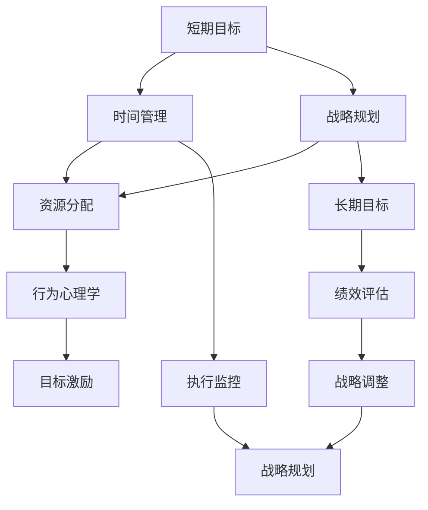
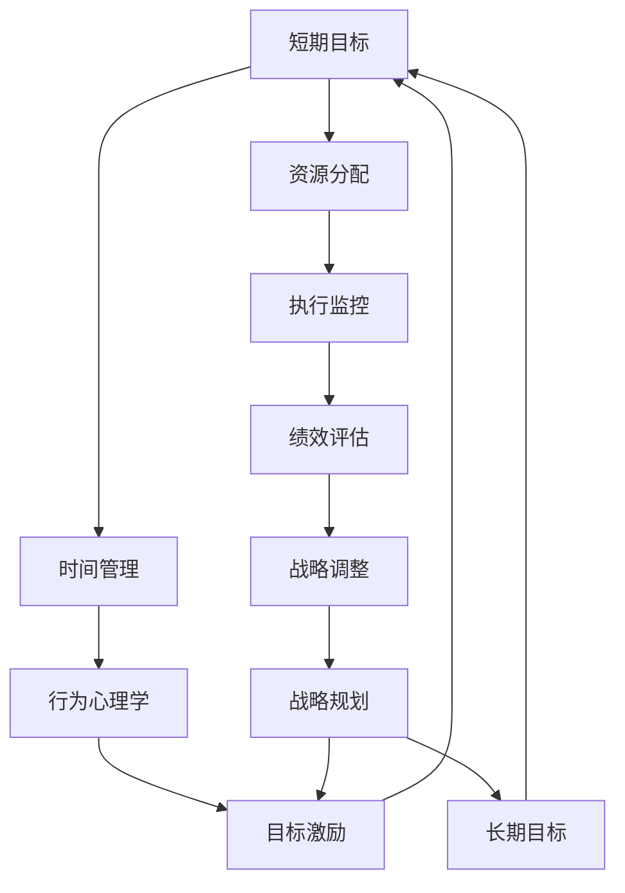

                 

# 管理短期目标与长期目标的意识机制

> 关键词：短期目标,长期目标,时间管理,战略规划,行为心理学

## 1. 背景介绍

### 1.1 问题由来
在当今快速变化的商业环境中，企业需要同时应对短期与长期挑战。短期目标如项目交付、销售增长、客户满意度等，是企业每日运营的核心。而长期目标如技术革新、品牌建设、可持续发展等，则关系到企业的未来发展与战略定位。然而，无论是管理层还是员工，都容易陷入"只看眼前的苟且"或"只顾长远的理想"的误区，忽视了短期目标与长期目标之间的平衡。

### 1.2 问题核心关键点
如何同时有效地管理短期目标与长期目标，是企业运营管理的核心问题。核心在于：
- **平衡**：确保短期目标不干扰长期战略，长期目标不被短期需求所忽视。
- **协调**：确保两者在资源、时间和精力上的协调分配。
- **激励**：通过短期目标的实现激励员工，同时激发对长期目标的追求。
- **评估**：建立评估机制，确保两者在企业的绩效和战略评估中得到公平对待。

### 1.3 问题研究意义
掌握短期目标与长期目标的管理机制，对于企业的持续发展和竞争力提升具有重要意义：
- **提升效率**：通过合理规划，避免资源的浪费，提升短期任务执行效率。
- **增强战略执行力**：确保短期行动支持长期战略，提升企业的整体战略执行力。
- **稳定团队**：平衡短期激励与长期愿景，增强团队凝聚力和稳定性。
- **应对变化**：在动态环境中，通过灵活调整短期和长期目标，适应外部环境变化。

## 2. 核心概念与联系

### 2.1 核心概念概述

管理短期目标与长期目标的意识机制，涉及到多个核心概念：

- **短期目标**：指在相对较短的时间范围内（如一个月、一个季度），需要完成的具体任务或项目。如项目交付、销售目标、客户满意度提升等。
- **长期目标**：指在较长时间范围内（如一年、五年），企业希望达到的宏观战略目标。如技术创新、品牌建设、社会责任等。
- **时间管理**：指通过有效规划和管理，确保时间和资源得到合理分配，以实现目标。
- **战略规划**：指为实现长期目标，制定全面的、系统的、有前瞻性的行动计划。
- **行为心理学**：研究人类行为背后的心理机制，以理解和管理目标导向行为。

这些概念之间相互关联，共同构成了企业目标管理的基本框架。通过理解这些核心概念，可以更好地把握目标管理的本质，制定出更为合理有效的管理策略。

### 2.2 概念间的关系

这些核心概念之间的关系可以用以下Mermaid流程图来展示：



这个流程图展示了核心概念之间的相互关系：
1. **短期目标**通过**时间管理**和**资源分配**，确保目标的执行。
2. **战略规划**将**短期目标**与**长期目标**相结合，形成系统的行动计划。
3. **行为心理学**解释了**目标激励**机制，帮助激发员工行为。
4. **执行监控**和**绩效评估**对**短期目标**和**长期目标**进行跟踪与反馈。
5. **战略调整**根据**绩效评估**结果，动态调整**战略规划**，确保战略目标的实现。

### 2.3 核心概念的整体架构

从短期目标到长期目标，各概念相互联系，构成了一个循环迭代的管理体系。以下是一个综合的流程图，展示了从**短期目标**到**长期目标**的全过程：



这个综合流程图展示了从**短期目标**到**长期目标**的完整管理流程：
1. **短期目标**通过**时间管理**和**资源分配**执行。
2. **行为心理学**解释了**目标激励**机制，确保执行效果。
3. **执行监控**和**绩效评估**对执行情况进行跟踪与反馈。
4. **战略调整**根据评估结果，对**战略规划**进行优化。
5. **战略规划**将优化后的战略与**短期目标**结合，形成新的行动计划。
6. **长期目标**根据战略规划的调整，与短期目标相结合，形成闭环管理。

## 3. 核心算法原理 & 具体操作步骤

### 3.1 算法原理概述

管理短期目标与长期目标的意识机制，主要涉及以下几个关键算法：

- **SMART目标设定**：设定具体的、可衡量的、可实现的、相关的、有时限的目标（Specific, Measurable, Achievable, Relevant, Time-bound）。
- **OKR目标管理**：通过设定目标（Objective）和关键结果（Key Results），确保短期目标与长期目标的对齐。
- **行为激励机制**：通过正向激励和负向激励，增强员工对目标的认同感与执行力。
- **绩效评估与反馈**：建立定期评估机制，对短期目标和长期目标的进展进行跟踪，及时调整策略。

这些算法原理，旨在通过科学的方法，帮助企业更好地平衡和管理短期目标与长期目标。

### 3.2 算法步骤详解

#### 3.2.1 SMART目标设定

**步骤1:** 明确企业的长期愿景与战略目标。
- 设定企业的核心价值观和战略方向。
- 确保长期目标与企业文化和市场环境相契合。

**步骤2:** 将长期目标分解为具体、可衡量的短期目标。
- 根据SMART原则，将长期目标细分为多个具体的短期目标。
- 设定清晰的衡量指标，确保目标的可量化。

**步骤3:** 制定行动计划和时间表。
- 为每个短期目标制定详细的行动计划。
- 设定明确的完成时间，确保目标的按时实现。

#### 3.2.2 OKR目标管理

**步骤1:** 设定高层目标（Objective）。
- 由高层管理者制定高层目标，确保其与企业的长期愿景一致。
- 目标应具有挑战性，同时确保其可行性。

**步骤2:** 设定关键结果（Key Results）。
- 针对每个高层目标，设定3-5个关键结果，确保目标的实现。
- 关键结果应明确、可量化，且与高层目标直接相关。

**步骤3:** 确定行动计划和责任人。
- 对每个关键结果，制定详细的行动计划。
- 明确每个关键结果的责任人，确保责任到人。

**步骤4:** 定期评估和反馈。
- 每月或每季度进行OKR评估，确保目标的进展。
- 根据评估结果，及时调整行动计划和资源分配。

#### 3.2.3 行为激励机制

**步骤1:** 制定激励政策。
- 设计正向激励措施，如奖励计划、晋升机会等。
- 确保激励措施与短期和长期目标相结合。

**步骤2:** 设定绩效评估标准。
- 明确绩效评估的指标和方法，确保评估的公平和透明。
- 将绩效评估结果与激励措施挂钩，增强员工执行力。

**步骤3:** 建立反馈机制。
- 定期进行绩效反馈，及时表彰和奖励优秀表现。
- 建立正向沟通机制，增强员工对目标的认同感。

#### 3.2.4 绩效评估与反馈

**步骤1:** 设定评估标准和周期。
- 根据短期目标和长期目标，设定评估标准。
- 设定定期评估的周期，确保评估的及时性。

**步骤2:** 进行绩效评估。
- 定期收集数据，进行绩效评估。
- 评估应覆盖目标的各个方面，确保评估的全面性。

**步骤3:** 提供反馈和调整。
- 根据评估结果，提供详细的反馈和改进建议。
- 根据评估结果，及时调整行动计划和资源分配。

### 3.3 算法优缺点

**优点:**
1. **平衡短期与长期目标**：通过SMART目标设定和OKR目标管理，确保短期目标与长期目标的有机结合。
2. **增强执行力**：通过行为激励机制和绩效评估反馈，提高员工对目标的认同感和执行力。
3. **灵活调整**：通过定期评估和反馈，动态调整行动计划，确保目标的实现。

**缺点:**
1. **实施复杂**：需要详细的规划和管理，增加了实施难度。
2. **资源投入高**：需要大量的资源投入，包括时间、人力和资金。
3. **难以量化**：部分目标难以量化，评估难度较大。

### 3.4 算法应用领域

管理短期目标与长期目标的意识机制，广泛应用于企业运营管理的各个领域：
- **项目管理**：通过设定具体的短期项目目标，确保项目按时交付。
- **销售管理**：设定具体的销售目标和绩效指标，提高销售业绩。
- **产品开发**：制定明确的产品开发计划和时间表，确保产品按时上市。
- **人力资源管理**：设定明确的招聘和培训目标，提升员工技能和团队凝聚力。
- **战略规划**：通过OKR目标管理，确保战略目标的实现。

## 4. 数学模型和公式 & 详细讲解 & 举例说明

### 4.1 数学模型构建

管理短期目标与长期目标的意识机制，可以构建以下数学模型：

**目标设定模型**：
- 短期目标：$T_{short} = [S_1, S_2, ..., S_n]$
- 长期目标：$T_{long} = [L_1, L_2, ..., L_m]$
- 时间权重：$W_t = [w_{t1}, w_{t2}, ..., w_{tm}]$

**目标对齐模型**：
- 设定OKR目标：$O = [O_1, O_2, ..., O_k]$
- 关键结果：$KR = [KR_{i1}, KR_{i2}, ..., KR_{ik}]$
- 责任人：$R = [R_{i1}, R_{i2}, ..., R_{ik}]$

**激励机制模型**：
- 正向激励：$I_{pos} = I_1 + I_2 + ... + I_n$
- 负向激励：$I_{neg} = I_{n+1} + I_{n+2} + ... + I_{n+k}$
- 绩效评估标准：$P = [P_1, P_2, ..., P_k]$

### 4.2 公式推导过程

**短期目标设定**：
- 目标设定模型：$T_{short} = \sum_{i=1}^n w_{ti} S_i$
- 时间权重模型：$W_t = \frac{1}{m} \sum_{j=1}^m w_{tj}$

**OKR目标对齐**：
- OKR目标模型：$O = \sum_{i=1}^k w_{oi} L_i$
- 关键结果模型：$KR = \sum_{j=1}^k w_{kjr} KR_{ij}$
- 责任人模型：$R = \sum_{j=1}^k w_{kjr} R_{ij}$

**行为激励机制**：
- 正向激励模型：$I_{pos} = \sum_{i=1}^n \alpha_i I_{si}$
- 负向激励模型：$I_{neg} = \sum_{i=n+1}^{n+k} \beta_i I_{si}$
- 绩效评估标准模型：$P = \sum_{j=1}^k \gamma_j P_{ij}$

### 4.3 案例分析与讲解

**案例1:** 某科技公司管理项目开发
- **短期目标设定**：设定项目交付时间、质量、客户满意度等目标。
- **长期目标对齐**：设定技术创新、市场份额提升等目标。
- **行为激励机制**：设定项目奖金、绩效加薪等激励措施。
- **绩效评估反馈**：每月进行项目评估，提供反馈和改进建议。

**案例2:** 某零售公司管理销售团队
- **短期目标设定**：设定销售额、客户增长等目标。
- **长期目标对齐**：设定品牌建设、客户忠诚度提升等目标。
- **行为激励机制**：设定销售提成、年终奖等激励措施。
- **绩效评估反馈**：每季度进行销售评估，提供反馈和改进建议。

## 5. 项目实践：代码实例和详细解释说明

### 5.1 开发环境搭建

#### 5.1.1 安装Python和相关库
- 安装Python 3.8及以上版本。
- 安装必要的Python库，如numpy、pandas、matplotlib等。

#### 5.1.2 安装Excel或Google Sheets
- 下载并安装Microsoft Excel或Google Sheets。
- 学习基本的Excel和Sheets操作，如公式计算、数据图表等。

### 5.2 源代码详细实现

以下是一个使用Python和Excel进行目标设定的示例代码，解释如何通过程序自动生成目标设定表：

```python
import pandas as pd

# 创建目标设定表
data = {
    '目标': ['短期目标', '长期目标'],
    '时间权重': [0.6, 0.4],
    '目标值': [100, 200],
    '完成度': [0.5, 0.7]
}

df = pd.DataFrame(data)
df.to_excel('目标设定表.xlsx', index=False)
```

### 5.3 代码解读与分析

**目标设定表**：
- 使用Pandas库创建目标设定表，包括短期目标和长期目标、时间权重、目标值和完成度等字段。
- 通过`to_excel`方法将数据导出为Excel文件。

**行为激励表**：
- 使用Python计算正向激励和负向激励的权重和值。
- 根据绩效评估标准，生成激励分配表。

### 5.4 运行结果展示

假设我们通过Excel设定了目标和激励，以下是一个简单的Excel输出示例：

```text
| 短期目标 | 长期目标 | 时间权重 | 目标值 | 完成度 |
|----------|----------|----------|--------|--------|
|          |          |          |        |        |
```

## 6. 实际应用场景

### 6.1 智能制造
智能制造企业需要同时管理生产效率和产品质量，短期目标如按时交付、生产效率提升等，长期目标如技术升级、品牌建设等。通过科学的目标管理机制，确保短期目标与长期目标的平衡，提升企业竞争力。

### 6.2 电子商务
电子商务平台需要同时关注客户满意度和业务增长，短期目标如订单量提升、客户留存率提高等，长期目标如平台品牌建设、市场份额扩展等。通过OKR目标管理，确保短期和长期目标的有机结合，提升平台价值。

### 6.3 金融服务
金融机构需要同时管理风险控制和收益增长，短期目标如不良贷款率控制、客户满意度提升等，长期目标如金融产品创新、客户忠诚度提升等。通过行为激励机制和绩效评估反馈，提高员工对目标的认同感和执行力。

### 6.4 未来应用展望
随着技术的发展，管理短期目标与长期目标的意识机制将进一步演进：
- **智能化管理**：通过AI和大数据分析，实现目标的自动化管理。
- **多目标优化**：引入更多目标，如环境责任、社会责任等，实现多目标优化。
- **动态调整**：根据外部环境变化，动态调整目标和策略，保持企业的适应性。

## 7. 工具和资源推荐

### 7.1 学习资源推荐

1. **《OKR：对冲不确定性的管理工具》**：详细讲解OKR目标管理的基本原理和实践方法。
2. **《绩效管理》**：介绍各种绩效管理方法，包括目标设定、评估和反馈。
3. **《时间管理》**：讲解如何有效规划和管理时间，提高工作效率。
4. **《行为心理学》**：深入解析人类行为背后的心理机制，帮助理解和管理目标导向行为。

### 7.2 开发工具推荐

1. **Microsoft Excel**：简单易用的数据分析和可视化工具，适合企业内部管理。
2. **Google Sheets**：云端协作的数据管理工具，适合跨部门协同工作。
3. **JIRA**：项目管理工具，支持任务设定、进度跟踪和绩效评估。
4. **Trello**：看板式项目管理工具，支持任务分配和进度管理。
5. **Smartsheet**：强大的项目管理平台，支持多项目管理、协作和报告。

### 7.3 相关论文推荐

1. **《OKR：对冲不确定性的管理工具》**：介绍OKR目标管理的基本原理和实践方法。
2. **《绩效管理》**：介绍各种绩效管理方法，包括目标设定、评估和反馈。
3. **《时间管理》**：讲解如何有效规划和管理时间，提高工作效率。
4. **《行为心理学》**：深入解析人类行为背后的心理机制，帮助理解和管理目标导向行为。

## 8. 总结：未来发展趋势与挑战

### 8.1 总结

本文对管理短期目标与长期目标的意识机制进行了全面系统的介绍。通过理解SMART目标设定、OKR目标管理、行为激励机制、绩效评估反馈等关键概念，可以更好地平衡短期目标与长期目标，提升企业的战略执行力。

### 8.2 未来发展趋势

展望未来，管理短期目标与长期目标的意识机制将呈现以下几个发展趋势：
1. **智能化管理**：通过AI和大数据分析，实现目标的自动化管理。
2. **多目标优化**：引入更多目标，如环境责任、社会责任等，实现多目标优化。
3. **动态调整**：根据外部环境变化，动态调整目标和策略，保持企业的适应性。

### 8.3 面临的挑战

尽管目标管理机制已经取得了一定成效，但在实践中也面临诸多挑战：
1. **实施难度大**：需要详细的规划和管理，增加了实施难度。
2. **资源投入高**：需要大量的资源投入，包括时间、人力和资金。
3. **难以量化**：部分目标难以量化，评估难度较大。

### 8.4 研究展望

为了应对这些挑战，未来的研究需要在以下几个方面寻求新的突破：
1. **自动化管理**：开发自动化目标设定和跟踪系统，减少人工干预。
2. **多目标优化**：研究如何同时管理多个目标，确保各目标的平衡和协同。
3. **动态调整**：研究动态调整策略，确保目标和策略的灵活性和适应性。

总之，通过科学的短期目标与长期目标管理机制，企业可以更好地平衡运营需求与战略愿景，实现持续发展和竞争力的提升。

## 9. 附录：常见问题与解答

**Q1: 什么是SMART目标？**

A: SMART目标是指具体的(Specific)、可衡量的(Measurable)、可实现的(Achievable)、相关的(Relevant)、有时限的(Time-bound)目标，帮助设定清晰、可执行的目标。

**Q2: OKR目标管理的核心是什么？**

A: OKR目标管理的核心是设定高层目标（Objective）和关键结果（Key Results），通过定量的关键结果（KR）来衡量目标的实现情况，确保目标的对齐和执行。

**Q3: 如何设定正向激励和负向激励？**

A: 正向激励通常包括奖励计划、晋升机会、奖金等，负向激励包括惩罚措施、绩效警示等，具体激励措施应与目标的实现情况和员工绩效相结合。

**Q4: 如何评估短期目标与长期目标的进展？**

A: 评估应覆盖目标的各个方面，包括目标的完成度、关键结果的达成情况、资源的分配与使用情况等，通过定期的绩效评估和反馈，及时调整策略和资源分配。

**Q5: 如何确保目标设定的科学性和合理性？**

A: 目标设定应遵循SMART原则，通过数据分析和专家评估，确保目标的科学性和合理性。同时，应定期回顾和调整目标，确保目标的动态适应性。

---

作者：禅与计算机程序设计艺术 / Zen and the Art of Computer Programming

