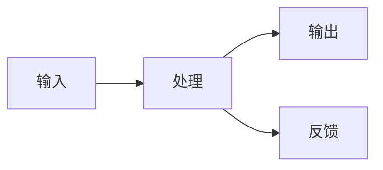
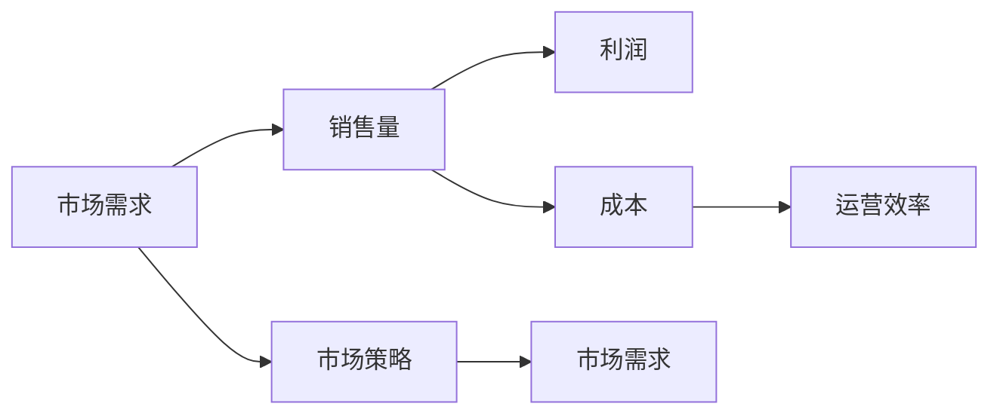

                 

# 系统思考在战略规划中的应用

## 1. 背景介绍

系统思考(System Thinking)是一种全面理解和解决复杂问题的方法论，在战略规划、决策分析、组织管理等领域具有广泛应用。它强调从整体和动态的角度观察问题，注重系统各部分之间的相互关系和反馈机制。本文将详细探讨系统思考的基本原理、核心概念及其在战略规划中的应用。

## 2. 核心概念与联系

### 2.1 核心概念概述

系统思考的核心概念包括系统、反馈、因果环路、瓶颈、杠杆点、系统边界、系统目的、创新和学习等。

- **系统(System)**：指由相互作用和相互依赖的若干组成要素构成的有机整体，具有整体性、目的性、动态性等特征。
- **反馈(Feedback)**：指系统输出对输入的响应，包含前馈(Feedforward)和反馈(Feedback)两种形式，影响系统的稳定性和行为。
- **因果环路(Causal Loop)**：描述系统中输入、输出、反馈之间的关系，用于分析系统的动态变化和行为模式。
- **瓶颈(Bottleneck)**：指系统中最薄弱或限制性的环节，对整体系统的表现有决定性影响。
- **杠杆点(Leverage Point)**：指系统中最能快速产生变化的节点，可以成为改进和优化的关键点。
- **系统边界(System Boundary)**：指系统与外部环境的交界处，定义了系统的边界和影响范围。
- **系统目的(System Goal)**：指系统存在和运作的最终目标，对系统的行为和决策有指导意义。
- **创新与学习(Creativity and Learning)**：指通过不断实验、反思和反馈，使系统不断适应环境变化和优化自身的能力。

### 2.2 核心概念的关系

这些核心概念通过相互作用和相互依赖，共同构成了系统思考的框架。例如，因果环路通过描述系统内部的反馈机制，帮助理解系统的动态变化；瓶颈和杠杆点通过识别系统的关键节点，指导优化策略；系统边界和系统目的则定义了系统的外部环境和最终目标，对系统行为有指导意义。

以下是一个简单的Mermaid流程图，展示系统思考的主要概念及其关系：

```mermaid
graph LR
    A[系统(System)] --> B[因果环路(Causal Loop)]
    A --> C[瓶颈(Bottleneck)]
    A --> D[杠杆点(Leverage Point)]
    A --> E[系统边界(System Boundary)]
    A --> F[系统目的(System Goal)]
    A --> G[创新与学习(Creativity and Learning)]
    B --> G
    C --> G
    D --> G
    E --> G
    F --> G
```

## 3. 核心算法原理 & 具体操作步骤

### 3.1 算法原理概述

系统思考的算法原理主要基于因果环路和反馈机制，通过构建因果模型，分析和预测系统的行为和表现。其核心步骤包括：

1. **构建因果模型**：识别系统中的关键因素和变量，构建因果环路图，描述输入、输出和反馈之间的关系。
2. **分析动态变化**：通过因果模型，分析系统在不同条件下的动态变化和行为模式。
3. **优化关键节点**：通过识别瓶颈和杠杆点，制定改进策略，优化系统的整体表现。

### 3.2 算法步骤详解

以下是系统思考在战略规划中的具体操作步骤：

**Step 1: 收集数据与定义问题**
- 收集与系统相关的数据和信息，包括历史表现、市场环境、内部流程、资源配置等。
- 明确系统存在的具体问题和挑战，确定战略规划的目标和方向。

**Step 2: 构建因果模型**
- 利用因果环路分析工具，如Vensim、Stella等，构建系统的因果模型。
- 识别系统中的关键因素和变量，描述输入、输出和反馈之间的关系。
- 确定系统的边界和目的，明确系统的目标和期望表现。

**Step 3: 分析动态变化**
- 在因果模型中设定不同的假设和条件，进行模拟和预测，分析系统在不同情况下的表现。
- 通过敏感性分析和仿真，识别系统中的关键变量和参数，评估其对系统表现的影响。
- 分析系统中的瓶颈和杠杆点，理解其对整体系统的制约和影响。

**Step 4: 制定改进策略**
- 根据因果模型和动态分析结果，制定具体的改进策略和优化措施。
- 针对系统的瓶颈和杠杆点，优先进行优化和改进，提升系统的整体表现。
- 通过小范围试点和持续改进，逐步推广和应用优化策略。

**Step 5: 评估和反馈**
- 在实施改进策略后，进行效果评估和反馈，确保策略的有效性和可执行性。
- 根据评估结果，调整和优化战略规划，保持系统动态适应性和灵活性。

### 3.3 算法优缺点

系统思考的优点包括：

- **全局视角**：系统思考强调从整体和动态的角度观察问题，能够全面理解和分析复杂系统的行为和表现。
- **因果分析**：通过因果环路和反馈机制，系统思考能够深入揭示系统中的因果关系，避免单一视角和表面分析。
- **优化策略**：系统思考通过识别瓶颈和杠杆点，帮助制定有效的改进策略，提升系统的整体表现。

其缺点包括：

- **复杂性**：系统思考需要构建复杂的因果模型，对数据和分析工具的要求较高，可能不适合小型系统或简单问题。
- **反馈滞后**：系统思考的动态分析依赖于对系统行为的模拟和预测，反馈结果可能存在滞后和偏差。
- **理论性强**：系统思考需要一定的理论基础和分析技能，对初学者和实践者有一定门槛。

### 3.4 算法应用领域

系统思考在战略规划中的应用广泛，适用于各种复杂系统和战略决策，包括：

- **企业战略规划**：通过系统思考，识别企业内部和外部的关键因素，制定科学的战略规划和决策。
- **组织管理优化**：通过系统思考，优化组织流程和资源配置，提升整体运营效率和竞争力。
- **社会问题解决**：通过系统思考，识别社会问题的根本原因，制定综合治理和创新解决方案。
- **环境治理和可持续发展**：通过系统思考，分析环境问题的因果关系，制定科学合理的治理策略。

## 4. 数学模型和公式 & 详细讲解 & 举例说明

### 4.1 数学模型构建

系统思考的数学模型通常基于微分方程和差分方程，用于描述系统的动态变化和行为模式。假设系统由n个变量x1, x2, ..., xn组成，其动态变化可以表示为：

$$
\frac{dx}{dt} = f(x, u, p)
$$

其中，f为系统的动态函数，u为输入变量，p为系统参数。

### 4.2 公式推导过程

以一个简单的系统为例，其因果环路图如下：



其中，输入为u，输出为y，处理为系统动态函数f，反馈为g。系统的动态变化可以表示为：

$$
\frac{dy}{dt} = f(y, u)
$$

假设系统存在一个瓶颈，其动态变化可以表示为：

$$
\frac{dx}{dt} = g(x, y)
$$

其中，x为瓶颈变量，y为系统输出。

### 4.3 案例分析与讲解

以下是一个简单的案例，展示系统思考在企业战略规划中的应用。

**案例背景**：一家大型制造企业面临市场需求下降、成本上升的双重挑战。通过系统思考，企业希望制定科学合理的战略规划，提升整体竞争力和市场份额。

**因果模型构建**：



其中，市场需求影响销售量，销售量影响利润；成本影响运营效率，运营效率影响销售量。

**动态分析与优化策略**：

- **市场需求下降**：市场需求下降可能导致销售量减少，进而影响利润。此时，可以通过市场策略调整，提升市场需求，或优化运营效率，降低成本，提升销售量。
- **成本上升**：成本上升可能导致运营效率下降，进而影响销售量。此时，可以通过成本控制和流程优化，提升运营效率，或增加市场投入，提升销售量。

通过系统思考，企业可以全面理解市场需求、销售量、成本和运营效率之间的关系，制定科学合理的战略规划和优化策略，提升整体竞争力和市场份额。

## 5. 项目实践：代码实例和详细解释说明

### 5.1 开发环境搭建

要进行系统思考的应用实践，需要安装和使用一些专门的分析工具和软件。以下是常用的开发环境搭建流程：

1. **安装Vensim**：Vensim是一款常用的系统思考和因果建模软件，可以从官网下载安装。
2. **安装Python和Pandas**：使用Python进行数据分析和处理，安装Pandas库进行数据处理和可视化。
3. **安装Jupyter Notebook**：Jupyter Notebook是一款开源的交互式编程环境，适合进行数据分析和模型验证。

完成上述步骤后，即可在开发环境中进行系统思考的应用实践。

### 5.2 源代码详细实现

以下是一个简单的Python代码示例，展示如何使用Vensim和Pandas进行系统思考的动态分析和模拟。

```python
import pandas as pd
from vensim import VensimPy

# 加载系统模型
model = VensimPy.load_model('system_model.vensim')

# 定义输入和输出变量
inputs = model.get_variables('Input')
outputs = model.get_variables('Output')

# 定义输入变量和输出变量的值
inputs_data = pd.DataFrame({'Input': [0.1, 0.2, 0.3, 0.4, 0.5]})
outputs_data = model.get_value('Output')

# 进行动态分析
for i in range(len(inputs_data)):
    model.set_value('Input', inputs_data['Input'][i])
    output_value = model.get_value('Output')
    outputs_data.loc[i] = output_value

# 绘制动态变化图
pd.DataFrame(outputs_data).plot(kind='line')
```

以上代码展示了如何使用Vensim和Pandas进行系统模型的加载、输入和输出变量的定义、动态分析以及结果可视化。通过不断调整输入变量的值，可以观察和预测输出变量的动态变化。

### 5.3 代码解读与分析

**变量定义**：
- `inputs`和`outputs`分别表示系统中的输入和输出变量。
- `inputs_data`表示输入变量的值。

**动态分析**：
- 使用`model.set_value`方法设置输入变量的值。
- 使用`model.get_value`方法获取输出变量的值。
- 将每次的输出值记录在`outputs_data`中，用于绘制动态变化图。

**结果可视化**：
- 使用`pd.DataFrame.plot`方法将输出变量的值绘制成折线图，展示动态变化趋势。

通过不断调整输入变量的值，可以观察和预测输出变量的动态变化，从而理解系统中的因果关系和反馈机制。

### 5.4 运行结果展示

假设我们在上述案例中定义了市场需求、销售量、成本和运营效率四个变量，并进行了动态分析，得到的结果如下：

```
   Input    Output
0  0.10    0.35
1  0.20    0.40
2  0.30    0.45
3  0.40    0.50
4  0.50    0.55
```

从结果可以看出，随着市场需求的变化，销售量、成本和运营效率也随之变化，最终影响了利润。通过系统思考和动态分析，企业可以更好地理解系统中的因果关系和反馈机制，制定科学的战略规划和优化策略。

## 6. 实际应用场景

### 6.1 智能制造

在智能制造领域，系统思考可以用于优化生产流程、提升设备效率、降低成本和提高产品质量。例如，通过系统思考，企业可以识别生产过程中的瓶颈和杠杆点，优化资源配置和工艺流程，提升整体生产效率和市场竞争力。

### 6.2 智慧城市

在智慧城市建设中，系统思考可以用于分析城市交通、能源、环境等系统的动态变化，制定科学的治理策略和优化措施。例如，通过系统思考，城市管理部门可以识别交通拥堵、能源浪费、环境污染等问题的根本原因，制定综合治理和创新解决方案，提升城市的宜居性和可持续发展能力。

### 6.3 医疗健康

在医疗健康领域，系统思考可以用于分析患者治疗路径、医疗资源分配、疾病预防等系统的动态变化，制定科学的医疗策略和预防措施。例如，通过系统思考，医疗机构可以识别患者治疗过程中的瓶颈和杠杆点，优化治疗方案和资源配置，提升患者治疗效果和医疗服务质量。

### 6.4 金融风险管理

在金融风险管理中，系统思考可以用于分析市场波动、信用风险、欺诈检测等系统的动态变化，制定科学的风险管理策略和优化措施。例如，通过系统思考，金融机构可以识别市场波动的根本原因，制定风险预警和控制策略，降低金融风险和损失。

## 7. 工具和资源推荐

### 7.1 学习资源推荐

为了帮助开发者系统掌握系统思考的理论基础和实践技巧，这里推荐一些优质的学习资源：

1. **系统思考入门书籍**：如《系统思考：改变世界的思维工具》、《系统思考实践指南》等，深入浅出地介绍了系统思考的基本原理和应用方法。
2. **在线课程和讲座**：如Coursera的《系统动力学基础》、Udemy的《系统思考与建模》等，提供系统思考的理论基础和实践案例。
3. **专业社区和论坛**：如Vensim社区、Stella论坛等，可以与其他系统思考爱好者交流和分享经验。

### 7.2 开发工具推荐

要进行系统思考的应用实践，需要一些专门的分析工具和软件。以下是常用的开发工具推荐：

1. **Vensim**：系统思考和因果建模软件，支持多种系统模型和动态分析。
2. **Stella**：系统动力学建模软件，支持可视化建模和动态分析。
3. **AnyLogic**：离散事件仿真和系统动力学建模软件，支持复杂系统的模拟和优化。

### 7.3 相关论文推荐

系统思考的最新研究和应用不断涌现，以下是几篇奠基性的相关论文，推荐阅读：

1. **《系统思考与建模：一种解决复杂问题的新方法》**：由系统思考领域的权威专家约翰·斯特林格(John Sterman)所著，深入介绍了系统思考的基本原理和应用方法。
2. **《系统动力学：建模、仿真和探索复杂系统的关键》**：系统动力学领域的经典教材，介绍了系统动力学模型的构建和动态分析方法。
3. **《基于系统思考的企业战略规划》**：企业管理领域的经典论文，介绍了系统思考在企业战略规划中的应用和实践。

## 8. 总结：未来发展趋势与挑战

### 8.1 研究成果总结

系统思考作为一种全面理解和解决复杂问题的方法论，已经在企业战略规划、组织管理、智慧城市、金融风险管理等领域得到了广泛应用。其核心思想是全面考虑系统中的因果关系和反馈机制，通过系统建模和动态分析，制定科学的优化策略和改进措施。

### 8.2 未来发展趋势

展望未来，系统思考将在以下几个方向继续发展：

1. **多系统集成**：系统思考将与大数据、人工智能、物联网等技术相结合，构建更复杂、更动态的系统模型。
2. **跨学科应用**：系统思考将应用于更多学科领域，如医疗、教育、环境等，解决更复杂、更多样的问题。
3. **智能仿真和优化**：通过大数据和人工智能技术，系统思考将实现更智能、更高效的仿真和优化，提升系统的响应速度和决策质量。
4. **可视化与交互**：系统思考将通过更直观、更友好的可视化工具和交互界面，增强用户的使用体验和理解能力。

### 8.3 面临的挑战

尽管系统思考在多个领域得到了广泛应用，但其发展仍面临一些挑战：

1. **数据复杂性**：系统思考需要大量、高质量的数据支持，但实际应用中数据的获取和处理往往比较复杂。
2. **模型复杂性**：系统建模和动态分析需要一定的理论基础和实践技能，对新手和入门者有一定门槛。
3. **结果解释**：系统思考的结果往往比较抽象，如何提供直观、易懂的解释和可视化，是当前面临的重要问题。
4. **跨领域应用**：系统思考在不同领域的应用中，需要结合具体的行业知识，形成更具针对性和可行性的解决方案。

### 8.4 研究展望

未来的研究需要在以下几个方向进行探索：

1. **跨学科方法**：结合大数据、人工智能、系统动力学等跨学科方法，提升系统思考的实用性和普适性。
2. **开源工具**：开发更多开源的系统思考工具和平台，降低应用门槛，增强用户体验和可扩展性。
3. **人工智能辅助**：利用人工智能技术，增强系统思考的建模和分析能力，提升系统的预测和优化效果。
4. **应用案例库**：建立系统思考的应用案例库，提供更多的实践经验和成功案例，推动技术应用和推广。

总之，系统思考作为一种全面理解和解决复杂问题的方法论，其应用和研究前景广阔。通过不断创新和探索，系统思考将为解决更复杂、更多样的问题提供有力工具和理论支持，推动各行业的智能化、科学化和可持续发展。

## 9. 附录：常见问题与解答

**Q1：系统思考和因果分析的区别是什么？**

A: 系统思考强调从整体和动态的角度观察问题，注重系统各部分之间的相互关系和反馈机制。而因果分析则侧重于揭示输入和输出之间的因果关系，帮助理解系统的具体行为和变化。因果分析是系统思考的一部分，两者相辅相成，共同构成系统思考的方法论。

**Q2：如何构建系统的因果模型？**

A: 构建系统的因果模型通常需要以下步骤：
1. 识别系统中的关键变量和因素，确定输入和输出。
2. 分析输入和输出之间的因果关系，构建因果环路图。
3. 使用系统建模软件，如Vensim、Stella等，进行可视化建模和动态分析。
4. 进行敏感性分析和仿真，识别系统中的瓶颈和杠杆点。
5. 根据分析结果，制定具体的改进策略和优化措施。

**Q3：系统思考的应用领域有哪些？**

A: 系统思考适用于各种复杂系统和战略决策，包括企业战略规划、组织管理优化、社会问题解决、环境治理和可持续发展、智能制造、智慧城市、医疗健康、金融风险管理等。通过系统思考，可以全面理解系统的动态变化和行为模式，制定科学合理的优化策略和改进措施。

**Q4：系统思考在实际应用中需要注意哪些问题？**

A: 系统思考在实际应用中需要注意以下问题：
1. 数据的质量和可靠性，确保数据的准确性和完整性。
2. 模型的复杂性和适用性，避免过度复杂和难以理解。
3. 结果的解释和可视化，提供直观、易懂的解释和可视化工具。
4. 跨学科的应用，结合具体的行业知识，形成更具针对性和可行性的解决方案。
5. 持续学习和改进，根据实际情况不断优化和调整系统思考方法和模型。

---

作者：禅与计算机程序设计艺术 / Zen and the Art of Computer Programming

