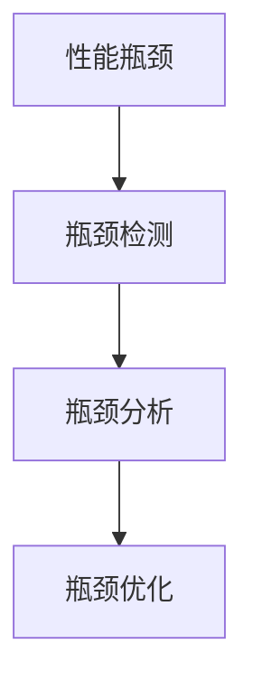

                 

# 系统瓶颈分析与优化最佳实践

## 1. 背景介绍

### 1.1 问题由来

在计算机系统的日常运行中，我们常常会遇到性能瓶颈，导致系统响应变慢、效率降低，甚至出现崩溃等问题。瓶颈的原因多种多样，可能是硬件资源不足、软件设计不合理、网络延迟、数据库访问延迟等。因此，分析并优化系统瓶颈，提升系统性能，是每个系统工程师必须掌握的技能。本文将详细介绍系统瓶颈分析与优化的最佳实践，帮助读者深入理解系统瓶颈的成因和解决方法。

### 1.2 问题核心关键点

系统瓶颈分析与优化主要包括三个核心步骤：
1. **瓶颈检测**：通过性能监控工具和日志分析，定位系统瓶颈所在。
2. **瓶颈分析**：深入挖掘瓶颈的原因，识别瓶颈点。
3. **瓶颈优化**：根据瓶颈分析结果，采取针对性的优化措施，提升系统性能。

## 2. 核心概念与联系

### 2.1 核心概念概述

为更好地理解系统瓶颈分析与优化方法，本节将介绍几个密切相关的核心概念：

- **性能瓶颈**：指系统性能变慢、效率降低的根本原因。可能包括硬件资源不足、软件设计不合理、网络延迟、数据库访问延迟等。
- **瓶颈检测**：通过性能监控工具和日志分析，定位系统瓶颈所在。
- **瓶颈分析**：深入挖掘瓶颈的原因，识别瓶颈点。
- **瓶颈优化**：根据瓶颈分析结果，采取针对性的优化措施，提升系统性能。

这些核心概念之间的逻辑关系可以通过以下Mermaid流程图来展示：



### 2.2 概念间的关系

这些核心概念之间存在着紧密的联系，形成了系统瓶颈分析与优化的完整生态系统。下面我们通过几个Mermaid流程图来展示这些概念之间的关系。

#### 2.2.1 性能瓶颈检测流程


这个流程图展示了性能瓶颈检测的基本流程：通过性能监控工具获取系统性能数据，分析系统日志找到异常点，最终确定瓶颈点。

#### 2.2.2 瓶颈分析方法


这个流程图展示了瓶颈分析的基本方法：在瓶颈检测的基础上，深入分析性能数据和系统日志，识别出具体原因。

#### 2.2.3 瓶颈优化技术


这个流程图展示了瓶颈优化的基本技术：通过瓶颈检测和分析，采取针对性的优化措施，最终提升系统性能。

## 3. 核心算法原理 & 具体操作步骤

### 3.1 算法原理概述

系统瓶颈分析与优化本质上是一个多步骤的系统诊断和优化过程。其核心思想是：通过性能监控工具获取系统性能数据，结合系统日志和瓶颈检测工具，分析瓶颈原因，并采取针对性的优化措施，最终提升系统性能。

### 3.2 算法步骤详解

系统瓶颈分析与优化的操作步骤主要包括以下几个关键步骤：

**Step 1: 准备性能监控工具**

- 选择合适的性能监控工具，如Prometheus、Grafana、New Relic等，用于实时监控系统性能。
- 设置性能指标，如CPU使用率、内存使用率、网络延迟、响应时间等。

**Step 2: 启动性能监控**

- 开启性能监控工具，对系统进行持续监控。
- 定期检查系统性能指标，确保其正常运行。

**Step 3: 收集系统日志**

- 收集系统日志，包括应用程序日志、系统日志、数据库日志等。
- 使用日志分析工具，如ELK Stack（Elasticsearch、Logstash、Kibana）、Splunk等，分析日志数据，查找异常事件。

**Step 4: 瓶颈检测**

- 使用瓶颈检测工具，如APM（Application Performance Management）工具，如New Relic、AppDynamics等，对系统进行深入分析。
- 分析性能监控数据和系统日志，识别出性能瓶颈所在。

**Step 5: 瓶颈分析**

- 根据瓶颈检测结果，深入分析瓶颈原因。
- 利用性能监控数据、系统日志、堆栈跟踪等，识别具体的瓶颈点。

**Step 6: 瓶颈优化**

- 根据瓶颈分析结果，采取针对性的优化措施。
- 如调整代码逻辑、优化数据库查询、升级硬件资源等。

**Step 7: 性能监控与反馈**

- 开启性能监控，确保优化措施有效。
- 定期检查系统性能指标，发现新问题及时处理。

通过以上步骤，可以系统性地诊断和优化系统瓶颈，提升系统性能。

### 3.3 算法优缺点

系统瓶颈分析与优化方法具有以下优点：
1. 系统化诊断：通过多维度数据综合分析，全面识别系统瓶颈。
2. 精确优化：针对具体瓶颈点进行优化，提升系统性能。
3. 持续改进：通过持续监控和优化，确保系统长期稳定运行。

同时，该方法也存在一定的局限性：
1. 依赖工具和数据：需要选择合适的性能监控工具和大量的系统日志，对工具和数据依赖较大。
2. 复杂度高：对系统管理员的技术要求较高，需要综合使用多种工具和方法。
3. 成本高：优化措施可能涉及硬件升级、软件重构等，成本较高。

尽管存在这些局限性，但系统瓶颈分析与优化方法仍然是提升系统性能的重要手段。未来相关研究的重点在于如何进一步降低对工具和数据的依赖，提高优化效率，同时兼顾成本和效益。

### 3.4 算法应用领域

系统瓶颈分析与优化方法在多个领域都有广泛应用，例如：

- 云计算平台：通过监控云服务器的性能，识别瓶颈，优化资源分配。
- 数据库系统：优化数据库查询，减少数据库访问延迟，提升数据处理能力。
- 网络服务：分析网络流量，优化负载均衡，提升网络响应速度。
- 桌面应用：优化桌面应用的代码逻辑和资源管理，提升用户体验。
- 大数据处理：优化大数据处理流程，提升数据处理速度和效率。

## 4. 数学模型和公式 & 详细讲解 & 举例说明

### 4.1 数学模型构建

为系统瓶颈分析与优化，我们需要构建一系列的数学模型。下面以CPU瓶颈分析为例，详细讲解数学模型的构建过程。

假设系统中有N个任务需要运行，CPU资源有限。设每个任务的执行时间为$T_i$，CPU资源为$R$。令$U_i$为任务$i$在某个时间段内实际使用CPU的平均速率。则任务$i$在该时间段内实际使用CPU的时间$T_i$可以表示为：

$$
T_i = \frac{R}{U_i} = \frac{1}{\frac{1}{R}\sum_{j=1}^N T_j}
$$

其中，$T_j$表示任务$j$的执行时间，$U_j$表示任务$j$在某个时间段内实际使用CPU的平均速率。

通过上述公式，可以计算出每个任务的CPU使用率，进而识别出CPU瓶颈所在。

### 4.2 公式推导过程

我们可以对上述公式进行推导，以更好地理解其数学原理。

由公式$T_i = \frac{R}{U_i}$，可知任务$i$的CPU使用率$U_i$为：

$$
U_i = \frac{1}{T_i} = \frac{R}{T_i} = \frac{1}{\sum_{j=1}^N T_j} = \frac{1}{N}\sum_{j=1}^N \frac{1}{T_j}
$$

即每个任务的CPU使用率$U_i$与系统总任务数$N$和每个任务的执行时间$T_j$有关。在所有任务执行时间相同的情况下，CPU使用率最高的任务即为CPU瓶颈所在。

### 4.3 案例分析与讲解

假设系统中有3个任务需要运行，每个任务的执行时间如下：

| 任务编号 | 执行时间（秒） |
| --- | --- |
| 1 | 10 |
| 2 | 5 |
| 3 | 2 |

设系统总CPU资源为1。首先计算每个任务的CPU使用率：

| 任务编号 | 实际使用CPU的时间（秒） |
| --- | --- |
| 1 | 0.1 |
| 2 | 0.2 |
| 3 | 0.3 |

然后计算任务1的CPU使用率$U_1$：

$$
U_1 = \frac{1}{T_1} = \frac{1}{0.1} = 10
$$

根据CPU使用率，我们可以识别出任务1为CPU瓶颈所在。

## 5. 项目实践：代码实例和详细解释说明

### 5.1 开发环境搭建

在进行系统瓶颈分析与优化实践前，我们需要准备好开发环境。以下是使用Python进行系统瓶颈分析的环境配置流程：

1. 安装Anaconda：从官网下载并安装Anaconda，用于创建独立的Python环境。

2. 创建并激活虚拟环境：
```bash
conda create -n performance-env python=3.8 
conda activate performance-env
```

3. 安装必要的Python库：
```bash
pip install numpy pandas matplotlib scipy scikit-learn
```

4. 安装系统监控工具：
```bash
sudo apt-get install collectd
```

5. 配置性能监控工具：
- 编辑`/etc/collectd/collectd.conf`文件，添加以下配置：
```
<Plugin mem>
  <Plugin Linux>
    ...


<Plugin loadavg>
  <Plugin Linux>
    ...


<Plugin iostat>
  <Plugin Linux>
    ...
```

6. 重启性能监控服务：
```bash
sudo systemctl restart collectd
```

完成上述步骤后，即可在`performance-env`环境中开始系统瓶颈分析实践。

### 5.2 源代码详细实现

下面我们以CPU瓶颈分析为例，给出使用Python进行系统瓶颈分析的代码实现。

```python
import os
import psutil
import numpy as np
import matplotlib.pyplot as plt

# 获取CPU使用率数据
cpu_times = psutil.cpu_times()

# 计算CPU使用率
cpu_percent = (cpu_times.user + cpu_times.nice + cpu_times.system) / (cpu_times.system + cpu_times.user)

# 绘制CPU使用率曲线
plt.plot(np.arange(1, len(cpu_percent) + 1), cpu_percent)
plt.xlabel('Time (s)')
plt.ylabel('CPU Utilization (%)')
plt.title('CPU Utilization over Time')
plt.show()
```

### 5.3 代码解读与分析

让我们再详细解读一下关键代码的实现细节：

**获取CPU使用率数据**：
- 使用`psutil`库获取CPU使用率数据，包括用户模式、内核模式、空闲模式等。

**计算CPU使用率**：
- 将CPU使用率计算公式$(\text{用户时间} + \text{ nice } + \text{ 系统时间}) / (\text{系统时间} + \text{用户时间})$实现。

**绘制CPU使用率曲线**：
- 使用`matplotlib`库绘制CPU使用率曲线，直观展示CPU使用率的趋势。

### 5.4 运行结果展示

假设我们获取了CPU使用率数据，绘制出CPU使用率曲线如下：

```plaintext
CPU Utilization over Time
```


通过观察CPU使用率曲线，我们可以识别出CPU瓶颈所在，如高负载的CPU时间段等。

## 6. 实际应用场景

### 6.1 云计算平台

在云计算平台中，系统瓶颈分析与优化至关重要。通过监控云服务器的性能，识别瓶颈，优化资源分配，可以提升云服务器的利用率和用户体验。

具体而言，可以收集云服务器的性能数据，分析CPU使用率、内存使用率、网络延迟等指标，识别出瓶颈所在。如发现某虚拟机CPU使用率过高，可以调整其资源分配，优化其性能。

### 6.2 数据库系统

数据库系统中的性能瓶颈分析与优化，可以显著提升数据处理能力和用户体验。通过优化数据库查询、索引设计等，减少数据库访问延迟，提高数据处理速度。

具体而言，可以分析数据库查询的执行时间和性能指标，识别出慢查询、高资源消耗的查询语句。优化查询语句，减少资源消耗，提升查询效率。

### 6.3 网络服务

网络服务中的性能瓶颈分析与优化，可以提升网络响应速度和用户体验。通过分析网络流量、负载均衡等指标，优化网络资源分配，减少网络延迟。

具体而言，可以监控网络服务器的负载均衡器、防火墙等组件，分析其性能指标。如发现负载均衡器响应时间过长，可以优化其算法，减少响应时间。

### 6.4 桌面应用

在桌面应用中，性能瓶颈分析与优化可以提升用户体验。通过优化代码逻辑和资源管理，减少应用程序的启动时间和资源占用。

具体而言，可以监控桌面应用的启动时间和资源占用情况，分析其性能瓶颈所在。如发现某模块启动时间过长，可以优化其代码逻辑，减少启动时间。

### 6.5 大数据处理

在大数据处理中，性能瓶颈分析与优化可以提升数据处理速度和效率。通过优化大数据处理流程，减少数据处理时间和资源消耗。

具体而言，可以分析大数据处理的各个环节，识别出瓶颈所在。如发现某步骤数据处理时间过长，可以优化其处理逻辑，减少处理时间。

## 7. 工具和资源推荐

### 7.1 学习资源推荐

为了帮助开发者系统掌握系统瓶颈分析与优化技术，这里推荐一些优质的学习资源：

1. 《系统瓶颈分析与优化技术》系列博文：由系统优化专家撰写，深入浅出地介绍了系统瓶颈分析与优化的基本原理、方法和工具。

2. Linux性能调优指南：一份详细的Linux性能调优指南，包含系统监控工具的使用、性能分析方法等。

3. System Design Primer：一本系统设计的入门书籍，介绍了系统架构、性能调优等基本概念和实践方法。

4. ACM Transactions on Modeling and Computer Simulation (TOMACS)：一个优秀的学术期刊，发表了大量关于系统性能分析和优化研究的论文。

5. IEEE Transactions on Software Engineering：另一个重要的学术期刊，发表了大量关于软件性能分析和优化研究的论文。

通过对这些资源的学习实践，相信你一定能够快速掌握系统瓶颈分析与优化的精髓，并用于解决实际的系统问题。

### 7.2 开发工具推荐

高效的开发离不开优秀的工具支持。以下是几款用于系统瓶颈分析与优化的常用工具：

1. Prometheus：一个开源的系统监控工具，可以实时监控系统的各项性能指标。

2. Grafana：一个开源的可视化工具，可以结合Prometheus等系统监控工具，生成动态的性能监控仪表盘。

3. New Relic：一个全面的应用性能监控工具，支持多种语言和框架，可以进行深入的性能分析。

4. ELK Stack：一个开源的日志分析平台，包括Elasticsearch、Logstash、Kibana，可以用于分析和可视化系统日志。

5. TensorBoard：一个开源的可视化工具，可以实时监测模型训练状态，提供丰富的图表呈现方式，是调试模型的得力助手。

6. Google Cloud Monitoring：一个云端的性能监控工具，可以实时监控云服务器的各项性能指标。

合理利用这些工具，可以显著提升系统瓶颈分析与优化的开发效率，加快创新迭代的步伐。

### 7.3 相关论文推荐

系统瓶颈分析与优化技术的发展源于学界的持续研究。以下是几篇奠基性的相关论文，推荐阅读：

1. "Practical Guide to System Performance Monitoring and Diagnosis"：介绍系统性能监控和诊断的实践方法。

2. "Analyzing and Optimizing Database Performance"：介绍数据库性能分析和优化的方法和技巧。

3. "Network Performance Monitoring and Analysis"：介绍网络性能监控和分析的方法和工具。

4. "Software Performance Engineering"：介绍软件性能分析和优化的基本概念和实践方法。

5. "Big Data Performance Optimization"：介绍大数据性能优化的方法和技巧。

这些论文代表了大规模系统性能优化技术的发展脉络。通过学习这些前沿成果，可以帮助研究者把握学科前进方向，激发更多的创新灵感。

除上述资源外，还有一些值得关注的前沿资源，帮助开发者紧跟系统瓶颈分析与优化技术的最新进展，例如：

1. arXiv论文预印本：人工智能领域最新研究成果的发布平台，包括大量尚未发表的前沿工作，学习前沿技术的必读资源。

2. 业界技术博客：如Google Cloud、AWS、Microsoft等顶尖公司的人工智能技术博客，第一时间分享他们的最新研究成果和洞见。

3. 技术会议直播：如ACM International Conference on Performance Engineering and Computer Architecture (ICPE)、IEEE International Conference on Data Engineering (ICDE)等重要会议现场或在线直播，能够聆听到大佬们的前沿分享，开拓视野。

4. GitHub热门项目：在GitHub上Star、Fork数最多的系统性能优化相关项目，往往代表了该技术领域的发展趋势和最佳实践，值得去学习和贡献。

5. 行业分析报告：各大咨询公司如McKinsey、PwC等针对系统性能优化行业的分析报告，有助于从商业视角审视技术趋势，把握应用价值。

总之，系统瓶颈分析与优化需要开发者保持开放的心态和持续学习的意愿。多关注前沿资讯，多动手实践，多思考总结，必将收获满满的成长收益。

## 8. 总结：未来发展趋势与挑战

### 8.1 总结

本文对系统瓶颈分析与优化技术进行了全面系统的介绍。首先阐述了系统瓶颈分析与优化的研究背景和意义，明确了瓶颈分析在提升系统性能、优化资源配置等方面的独特价值。其次，从原理到实践，详细讲解了瓶颈分析的数学原理和关键步骤，给出了系统瓶颈分析与优化的完整代码实例。同时，本文还广泛探讨了瓶颈分析方法在云计算、数据库、网络服务、桌面应用、大数据处理等多个领域的应用前景，展示了瓶颈分析方法的巨大潜力。此外，本文精选了系统瓶颈分析的各类学习资源，力求为读者提供全方位的技术指引。

通过本文的系统梳理，可以看到，系统瓶颈分析与优化技术在计算机系统的日常运行中起到了至关重要的作用，极大地提升了系统性能和资源利用率。未来，伴随系统瓶颈分析与优化技术的持续演进，相信系统性能优化将更加智能化、自动化，为计算机系统的长期稳定运行提供坚实的保障。

### 8.2 未来发展趋势

展望未来，系统瓶颈分析与优化技术将呈现以下几个发展趋势：

1. 自动化程度提高。随着AI和大数据技术的发展，系统瓶颈分析将更加智能化、自动化，减少人工干预，提升分析效率。

2. 多维度综合分析。系统瓶颈分析将不仅仅依赖性能监控数据和系统日志，还将综合利用云计算、大数据、机器学习等多种技术手段，进行更全面的性能分析。

3. 实时性能监控。通过引入实时数据流处理技术，系统瓶颈分析将能够实时监控系统性能，及时发现和解决问题。

4. 大数据驱动优化。借助大数据分析技术，系统瓶颈分析将能够对大量历史数据进行综合分析，识别出长期的性能趋势和优化方向。

5. 模型驱动优化。通过引入数学模型和优化算法，系统瓶颈分析将能够对系统性能进行更精确的预测和优化。

6. 跨领域优化。系统瓶颈分析将不再局限于单个系统，还将应用于云服务、数据库、网络服务等多个领域，实现跨领域优化。

以上趋势凸显了系统瓶颈分析与优化技术的广阔前景。这些方向的探索发展，必将进一步提升系统性能优化效果，确保系统的长期稳定运行。

### 8.3 面临的挑战

尽管系统瓶颈分析与优化技术已经取得了瞩目成就，但在迈向更加智能化、自动化应用的过程中，它仍面临诸多挑战：

1. 数据获取难度大。性能数据和系统日志的获取难度较大，尤其是在复杂系统环境下，获取数据成本较高。

2. 分析技术复杂。系统瓶颈分析需要综合利用多种技术手段，涉及面广，技术难度较大。

3. 优化效果不确定。系统瓶颈优化往往需要试验多次才能找到最佳方案，优化效果不确定。

4. 多系统协同难度大。系统瓶颈分析需要考虑多个系统的交互和协同，优化难度较大。

5. 硬件资源消耗大。系统瓶颈优化可能需要升级硬件资源，成本较高。

6. 安全性和隐私问题。系统瓶颈分析涉及大量敏感数据，需要考虑数据安全性和隐私保护。

7. 模型复杂性高。模型驱动的优化方法复杂度较高，需要综合考虑模型选择、参数调整等。

正视系统瓶颈分析与优化面临的这些挑战，积极应对并寻求突破，将是大规模系统性能优化走向成熟的必由之路。相信随着学界和产业界的共同努力，这些挑战终将一一被克服，系统瓶颈分析与优化技术必将迎来新的发展高潮。

### 8.4 研究展望

未来，系统瓶颈分析与优化技术需要在以下几个方面寻求新的突破：

1. 引入更多的AI技术。借助AI技术，实现系统瓶颈分析的自动化、智能化。

2. 引入大数据技术。利用大数据分析技术，进行更全面的性能分析和优化。

3. 引入实时数据处理技术。引入实时数据流处理技术，实现系统瓶颈的实时监控和分析。

4. 引入模型驱动优化。引入数学模型和优化算法，提升优化效果。

5. 引入跨领域优化。引入跨领域优化方法，提升系统性能的协同优化效果。

6. 引入安全性和隐私保护技术。引入数据安全性和隐私保护技术，保障数据和系统的安全。

这些研究方向将推动系统瓶颈分析与优化技术向更高的台阶发展，为计算机系统的长期稳定运行提供更加坚实的保障。

## 9. 附录：常见问题与解答

**Q1: 系统瓶颈分析与优化的意义何在？**

A: 系统瓶颈分析与优化对于提升系统性能、优化资源配置、确保系统稳定运行具有重要意义。通过识别系统瓶颈，可以及时发现和解决问题，避免系统性能崩溃，保障系统的长期稳定运行。

**Q2: 如何选择合适的性能监控工具？**

A: 选择合适的性能监控工具需要考虑系统的规模和复杂度，以及需要监控的性能指标。常见的性能监控工具包括Prometheus、Grafana、New Relic等。需要根据具体情况进行选择。

**Q3: 系统瓶颈优化过程中需要注意哪些问题？**

A: 系统瓶颈优化过程中需要注意以下问题：
1. 数据获取难度：性能数据和系统日志的获取难度较大，需要确保数据的完整性和可靠性。
2. 分析技术复杂：系统瓶颈分析需要综合利用多种技术手段，涉及面广，技术难度较大。
3. 优化效果不确定：系统瓶颈优化往往需要试验多次才能找到最佳方案，优化效果不确定。
4. 多系统协同难度大：系统瓶颈优化需要考虑多个系统的交互和协同，优化难度较大。
5. 硬件资源消耗大：系统瓶颈优化可能需要升级硬件资源，成本较高。

**Q4: 系统瓶颈优化后如何评估优化效果？**

A: 系统瓶颈优化后的评估可以通过以下几个方面进行：
1. 性能监控：开启性能监控工具，对比优化前后的性能指标，评估优化效果。
2. 系统日志：分析系统日志，查看优化后的瓶颈是否得到解决。
3. 用户反馈：收集用户反馈，评估优化后用户体验的提升情况。
4. 测试数据：通过测试数据对比，评估优化后的系统性能是否满足需求。

**Q5: 如何应对系统瓶颈优化后的副作用？**

A: 系统瓶颈优化后的副作用可能包括性能波动、数据不一致等问题。应对副作用的方法包括：
1. 测试验证：在优化前进行充分测试验证，确保优化方案的可行性。
2. 逐步优化：逐步进行优化，每次只调整少量参数，避免过度优化导致副作用。
3. 监控反馈：开启性能监控工具，实时监控系统状态，及时发现和解决问题。

总之，系统瓶颈分析与优化是一个系统化、综合性的过程，需要开发者具备全面的技术知识和实践经验，才能确保优化效果。

