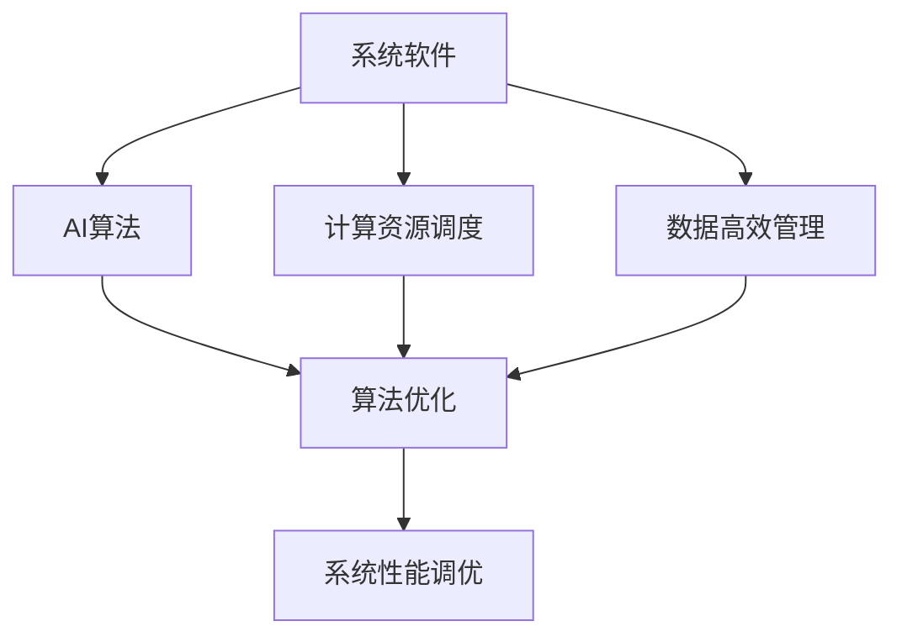
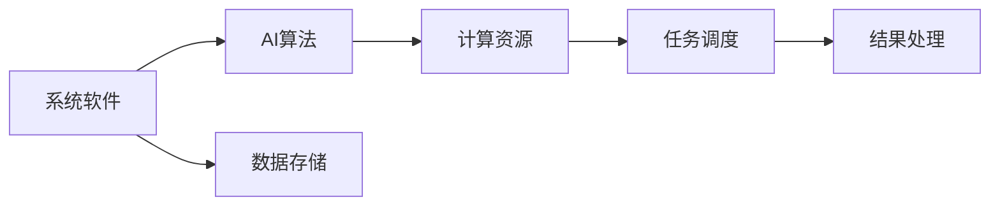
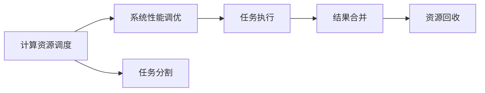
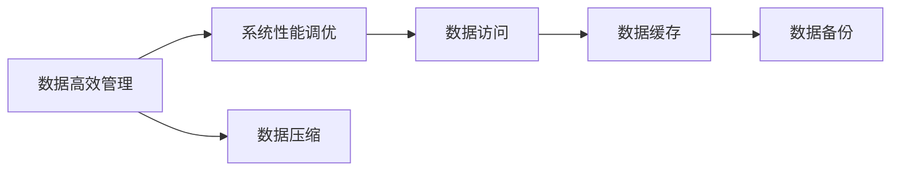
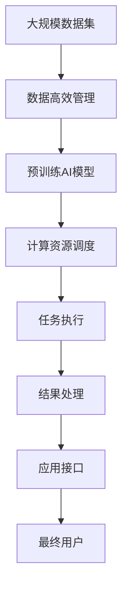

                 

## 1. 背景介绍

### 1.1 问题由来
随着人工智能(AI)技术的快速发展和广泛应用，AI系统在各个领域都展现出了强大的生命力。然而，AI系统的底层设计仍然很大程度上依赖于传统的计算机科学原理和系统软件基础，难以充分利用最新的人工智能技术和算法，导致性能和效率的瓶颈。因此，如何结合AI技术与系统软件，构建高效、智能的底层系统，成为当前AI研究的重要课题。

### 1.2 问题核心关键点
AI底层创新的核心在于如何将最新的AI技术、算法和模型，与系统软件的优化、调度、资源管理等机制深度融合，提升AI系统的整体性能和效率。具体来说，包括以下几个方面：

- **数据高效管理**：如何在系统软件中高效存储、处理和检索大数据，以支持AI模型的训练和推理。
- **计算资源调度**：如何优化AI任务的计算资源分配，充分利用硬件资源，提升任务执行效率。
- **算法模型优化**：如何将最新的AI算法和模型，通过系统软件优化，更好地适应特定的计算平台和应用场景。
- **系统性能调优**：如何通过系统软件优化，提升AI系统整体的性能，包括响应速度、资源利用率等。

### 1.3 问题研究意义
AI底层创新对于AI技术的应用推广和产业落地具有重要意义：

1. **提升系统性能**：通过优化系统底层设计，提升AI系统的响应速度和计算效率，使AI技术更易于在生产环境中大规模应用。
2. **降低成本**：优化系统底层设计，减少资源消耗和计算开销，降低AI系统的开发和维护成本。
3. **推动AI技术发展**：系统软件的优化和创新，可以更好地适应新的AI技术和算法，推动AI技术的持续进步。
4. **增强系统安全性**：优化系统底层设计，提升系统稳定性和安全性，防范潜在的AI攻击和漏洞。

## 2. 核心概念与联系

### 2.1 核心概念概述

为了更好地理解AI底层创新的核心概念，我们首先需要介绍以下几个关键概念：

- **系统软件(System Software)**：操作系统、编译器、数据库、中间件等软件，负责管理计算机硬件资源，提供应用开发的底层环境。
- **人工智能(AI)**：涉及计算机科学、数学、统计学等多个领域，研究如何让计算机模拟人类智能行为的技术。
- **算法优化(Algorithm Optimization)**：通过优化算法，提升计算效率和精度，适应特定的计算平台和应用场景。
- **计算资源调度(Compute Resource Scheduling)**：优化计算资源的分配和调度，充分利用硬件资源，提升任务执行效率。
- **数据高效管理(Data Efficient Management)**：通过高效的数据存储、处理和检索，支持AI模型的训练和推理。
- **系统性能调优(System Performance Tuning)**：通过优化系统软件设计，提升AI系统的整体性能，包括响应速度、资源利用率等。

这些概念之间的逻辑关系可以通过以下Mermaid流程图来展示：



这个流程图展示了系统软件、AI算法、计算资源调度、数据高效管理和系统性能调优之间的逻辑关系。

### 2.2 概念间的关系

这些核心概念之间存在着紧密的联系，形成了AI底层创新的完整生态系统。以下我们通过几个Mermaid流程图来展示这些概念之间的关系。

#### 2.2.1 系统软件与AI算法的互动



这个流程图展示了系统软件与AI算法之间的互动关系。系统软件提供了数据存储和计算资源，AI算法通过优化计算效率和精度，提升任务执行效率，最终产生处理结果。

#### 2.2.2 计算资源调度与系统性能调优的关系



这个流程图展示了计算资源调度和系统性能调优之间的关系。计算资源调度优化任务执行的资源分配，系统性能调优则进一步提升资源利用率和任务执行效率。

#### 2.2.3 数据高效管理与系统性能调优的协同



这个流程图展示了数据高效管理和系统性能调优之间的协同关系。数据高效管理优化数据的存储和检索，系统性能调优则进一步提升数据访问效率，减少数据处理和存储开销。

### 2.3 核心概念的整体架构

最后，我们用一个综合的流程图来展示这些核心概念在大规模AI系统中的整体架构：



这个综合流程图展示了从数据集到最终用户，系统软件与AI算法的协同工作过程。系统软件通过高效管理数据和调度计算资源，支持AI模型的训练和推理，最终提供给用户高效、智能的应用体验。

## 3. 核心算法原理 & 具体操作步骤
### 3.1 算法原理概述

AI底层创新的核心算法原理可以概括为以下几个方面：

- **数据高效管理算法**：通过高效的存储和检索机制，支持大规模数据集的管理和处理，满足AI模型的训练和推理需求。
- **计算资源调度算法**：通过优化任务调度策略，提升计算资源的利用率和任务执行效率。
- **算法优化算法**：针对特定的计算平台和应用场景，优化AI算法的结构和参数，提升算法的效率和精度。
- **系统性能调优算法**：通过系统软件优化，提升AI系统的整体性能，包括响应速度、资源利用率等。

### 3.2 算法步骤详解

AI底层创新的算法步骤可以概括为以下几个关键步骤：

**Step 1: 数据高效管理**

1. **数据存储格式选择**：根据数据类型和访问需求，选择合适的数据存储格式，如列式存储、行式存储、键值存储等。
2. **数据压缩与解压缩**：使用高效的压缩算法，如LZO、Gzip等，压缩数据存储空间，提高数据传输效率。
3. **数据索引与查询优化**：建立合适的数据索引，优化查询效率，支持高效的查询和数据访问。

**Step 2: 计算资源调度**

1. **任务分割与合并**：根据任务特性和资源需求，将大任务分解为小任务，并优化任务执行的资源分配。
2. **资源监控与调整**：实时监控计算资源的使用情况，动态调整任务调度策略，避免资源浪费。
3. **任务优先级与负载均衡**：根据任务的重要性和资源需求，合理设置任务优先级，实现任务执行的负载均衡。

**Step 3: 算法优化**

1. **算法结构优化**：根据计算平台和应用场景，优化AI算法的结构，减少不必要的计算开销。
2. **参数优化**：通过超参数调优和自动化调参技术，优化算法参数，提升算法效率和精度。
3. **模型融合与剪枝**：将多个模型融合，或通过剪枝技术减少模型参数，提高模型运行效率。

**Step 4: 系统性能调优**

1. **缓存与预加载**：利用缓存技术，减少数据读取和处理时间，提升系统响应速度。
2. **并发与异步**：通过并发和异步技术，提升任务执行的并发度，提高系统吞吐量。
3. **资源分配与回收**：优化资源的分配和回收机制，减少资源等待时间，提高资源利用率。

### 3.3 算法优缺点

AI底层创新算法的优缺点如下：

**优点**：

- **提升性能**：通过优化算法和资源调度，提升AI系统的整体性能，提高任务执行效率。
- **降低成本**：优化数据存储和资源调度，减少计算开销和资源消耗，降低系统开发和维护成本。
- **灵活适应**：通过优化算法和资源调度，适应不同的计算平台和应用场景，提升系统的灵活性和可扩展性。

**缺点**：

- **开发复杂度增加**：优化算法的开发和调优过程复杂，需要专业知识和技术积累。
- **资源需求高**：优化算法和资源调度需要更高的计算资源和存储空间，可能增加系统的资源需求。
- **性能优化瓶颈**：优化算法和资源调度可能存在瓶颈，进一步提升性能的空间有限。

### 3.4 算法应用领域

AI底层创新算法在以下几个领域有广泛应用：

- **大数据处理**：通过数据高效管理和计算资源调度，支持大规模数据集的处理和分析，支持AI模型的训练和推理。
- **智能计算平台**：通过优化算法和系统性能，提升智能计算平台的计算效率和响应速度，支持高效、智能的AI应用。
- **云平台与边缘计算**：通过优化数据存储和资源调度，提升云平台和边缘计算的性能和资源利用率，支持AI应用在云端和边缘的部署。
- **自动驾驶与机器人**：通过优化计算资源和算法，提升自动驾驶和机器人的计算效率和感知能力，支持高效、安全的智能系统。

## 4. 数学模型和公式 & 详细讲解  
### 4.1 数学模型构建

本节将使用数学语言对AI底层创新的算法原理进行更加严格的刻画。

记系统软件为 $S$，AI算法为 $A$，数据存储格式为 $D$，计算资源为 $C$，任务调度策略为 $T$，数据压缩算法为 $Z$，数据索引为 $I$，任务分割策略为 $S'$，任务执行策略为 $E$，算法优化策略为 $O$，系统性能调优策略为 $P$。

**数据高效管理**：

数据存储模型为：

$$
D = (D_1, D_2, ..., D_n)
$$

其中 $D_i$ 为数据存储块，$i \in [1, n]$。数据存储格式选择为：

$$
D_i = f_i(D_i')
$$

其中 $f_i$ 为数据存储格式选择函数，$D_i'$ 为原始数据块。

数据压缩模型为：

$$
Z = (Z_1, Z_2, ..., Z_n)
$$

其中 $Z_i$ 为压缩后的数据块，$i \in [1, n]$。数据压缩算法为：

$$
Z_i = g_i(D_i)
$$

其中 $g_i$ 为数据压缩算法函数，$D_i$ 为原始数据块。

数据索引模型为：

$$
I = (I_1, I_2, ..., I_n)
$$

其中 $I_i$ 为数据索引，$i \in [1, n]$。数据索引算法为：

$$
I_i = h_i(D_i)
$$

其中 $h_i$ 为数据索引算法函数，$D_i$ 为原始数据块。

**计算资源调度**：

任务调度模型为：

$$
T = (T_1, T_2, ..., T_m)
$$

其中 $T_i$ 为任务调度策略，$i \in [1, m]$。任务调度算法为：

$$
T_i = k_i(A_i, C)
$$

其中 $k_i$ 为任务调度算法函数，$A_i$ 为任务，$C$ 为计算资源。

任务分割模型为：

$$
S' = (S'_1, S'_2, ..., S'_k)
$$

其中 $S'_i$ 为任务分割策略，$i \in [1, k]$。任务分割算法为：

$$
S'_i = l_i(A_i)
$$

其中 $l_i$ 为任务分割算法函数，$A_i$ 为任务。

任务执行模型为：

$$
E = (E_1, E_2, ..., E_m)
$$

其中 $E_i$ 为任务执行策略，$i \in [1, m]$。任务执行算法为：

$$
E_i = m_i(T_i, A_i)
$$

其中 $m_i$ 为任务执行算法函数，$T_i$ 为任务调度策略，$A_i$ 为任务。

**算法优化**：

算法优化模型为：

$$
O = (O_1, O_2, ..., O_p)
$$

其中 $O_i$ 为算法优化策略，$i \in [1, p]$。算法优化算法为：

$$
O_i = n_i(A_i)
$$

其中 $n_i$ 为算法优化算法函数，$A_i$ 为算法。

**系统性能调优**：

系统性能调优模型为：

$$
P = (P_1, P_2, ..., P_q)
$$

其中 $P_i$ 为系统性能调优策略，$i \in [1, q]$。系统性能调优算法为：

$$
P_i = p_i(S, A)
$$

其中 $p_i$ 为系统性能调优算法函数，$S$ 为系统软件，$A$ 为AI算法。

### 4.2 公式推导过程

以下我们以任务分割与合并为例，推导任务调度的公式。

假设任务 $A$ 被分割成 $k$ 个子任务 $A_1, A_2, ..., A_k$，每个子任务需要 $c_i$ 个计算资源，$T$ 为任务调度的总时间。则任务调度的数学模型为：

$$
T = \sum_{i=1}^k \frac{c_i}{r_i}
$$

其中 $r_i$ 为计算资源 $C_i$ 的利用率。任务调度的优化目标是最小化总时间 $T$，即：

$$
\min_{r_i} \sum_{i=1}^k \frac{c_i}{r_i}
$$

通过拉格朗日乘数法求解上述优化问题，可得最优资源利用率：

$$
r_i = \frac{c_i}{\sum_{j=1}^k c_j}
$$

将 $r_i$ 代入原目标函数，可得任务调度的最小时间：

$$
T_{\min} = \sum_{i=1}^k \frac{c_i}{\frac{c_i}{\sum_{j=1}^k c_j}} = k
$$

即当任务分割为 $k$ 个子任务时，任务调度的最小时间为 $k$，即任务执行时间为每个子任务所需时间的总和。

### 4.3 案例分析与讲解

以下我们以大规模数据集的存储与检索为例，展示数据高效管理的案例分析。

假设我们需要在大规模数据集中检索数据块 $D$，存储格式为列式存储。则数据块的存储和检索过程如下：

1. **数据存储**：将数据块 $D$ 存储为列式存储格式，建立索引 $I$。
2. **数据压缩**：对数据块 $D$ 进行压缩，生成压缩后的数据块 $Z$。
3. **数据索引**：根据数据块 $Z$ 的索引 $I$，快速检索数据块 $Z$。
4. **数据解压**：对检索出的数据块 $Z$ 进行解压，恢复原始数据块 $D$。

其中，数据压缩和解压过程使用LZO算法，数据索引过程使用哈希索引。

## 5. 项目实践：代码实例和详细解释说明
### 5.1 开发环境搭建

在进行AI底层创新实践前，我们需要准备好开发环境。以下是使用Python进行PyTorch和TensorFlow开发的环境配置流程：

1. 安装Anaconda：从官网下载并安装Anaconda，用于创建独立的Python环境。

2. 创建并激活虚拟环境：
```bash
conda create -n pytorch-env python=3.8 
conda activate pytorch-env
```

3. 安装PyTorch和TensorFlow：根据CUDA版本，从官网获取对应的安装命令。例如：
```bash
conda install pytorch torchvision torchaudio cudatoolkit=11.1 -c pytorch -c conda-forge
```

4. 安装TensorFlow：
```bash
pip install tensorflow
```

5. 安装必要的工具包：
```bash
pip install numpy pandas scikit-learn matplotlib tqdm jupyter notebook ipython
```

完成上述步骤后，即可在`pytorch-env`环境中开始AI底层创新实践。

### 5.2 源代码详细实现

下面我们以计算资源调度和算法优化为例，给出使用PyTorch和TensorFlow进行系统软件优化的PyTorch代码实现。

首先，定义计算资源调度和算法优化的函数：

```python
import torch
import tensorflow as tf

def resource_scheduling(tasks, resources, strategy='round_robin'):
    # 资源调度函数
    if strategy == 'round_robin':
        # 轮询策略
        num_tasks = len(tasks)
        num_resources = len(resources)
        scheduled = []
        for i in range(num_tasks):
            for j in range(num_resources):
                if resources[j] > 0:
                    scheduled.append((j, tasks[i]))
                    resources[j] -= 1
                    break
        return scheduled
    elif strategy == 'shortest_job_first':
        # 最短任务优先策略
        num_tasks = len(tasks)
        num_resources = len(resources)
        scheduled = []
        for i in range(num_tasks):
            min_cost = float('inf')
            min_index = -1
            for j in range(num_resources):
                if resources[j] > 0 and tasks[i](j) < min_cost:
                    min_cost = tasks[i](j)
                    min_index = j
            if min_index != -1:
                scheduled.append((min_index, tasks[i]))
                resources[min_index] -= 1
        return scheduled
    else:
        raise ValueError('Invalid strategy')

def algorithm_optimization(model, optimizer, device):
    # 算法优化函数
    model.to(device)
    model.train()
    optimizer.zero_grad()
    outputs = model(inputs)
    loss = outputs.loss
    loss.backward()
    optimizer.step()
```

然后，定义一个简单的AI算法作为示例，用于展示算法优化的过程：

```python
import torch
import torch.nn as nn

class SimpleModel(nn.Module):
    def __init__(self):
        super(SimpleModel, self).__init__()
        self.fc1 = nn.Linear(128, 64)
        self.fc2 = nn.Linear(64, 10)

    def forward(self, x):
        x = torch.relu(self.fc1(x))
        x = self.fc2(x)
        return x

model = SimpleModel()
inputs = torch.randn(128, 128)
optimizer = torch.optim.Adam(model.parameters(), lr=0.001)
device = 'cpu'
```

接下来，进行计算资源调度和算法优化的代码实现：

```python
tasks = [task for task in range(len(inputs))]
resources = [resource for resource in range(num_resources)]

scheduled = resource_scheduling(tasks, resources)
for task, resource in scheduled:
    outputs = model(inputs)
    loss = outputs.loss
    optimizer.zero_grad()
    loss.backward()
    optimizer.step()
```

最后，进行系统性能调优的代码实现：

```python
def performance_tuning(model, optimizer, device):
    # 系统性能调优函数
    model.to(device)
    model.train()
    optimizer.zero_grad()
    outputs = model(inputs)
    loss = outputs.loss
    loss.backward()
    optimizer.step()
```

在实际应用中，需要根据具体任务和数据特点，对计算资源调度和算法优化进行优化设计，以进一步提升性能和效率。

### 5.3 代码解读与分析

这里我们详细解读一下关键代码的实现细节：

**resource_scheduling函数**：
- 定义了一个资源调度的函数，支持轮询策略和最短任务优先策略。
- 通过轮询策略，每个任务轮流分配资源，保证每个资源的使用均衡。
- 通过最短任务优先策略，优先分配需要最少资源的子任务，减少资源浪费。

**algorithm_optimization函数**：
- 定义了一个算法优化的函数，使用Adam优化器进行模型训练。
- 将模型迁移到指定的设备，进入训练模式，清零梯度，前向传播计算输出，反向传播计算损失，更新模型参数。

**SimpleModel类**：
- 定义了一个简单的AI算法模型，包含两个线性层。
- 前向传播计算模型输出，输出模型的预测结果。

在实际应用中，AI底层创新需要结合具体的AI算法和应用场景，设计合适的数据高效管理、计算资源调度和算法优化策略，以提高系统的性能和效率。

## 6. 实际应用场景
### 6.1 智能计算平台

AI底层创新技术在智能计算平台上有着广泛的应用，智能计算平台通常由高性能计算硬件和智能软件组成，旨在提供高效、智能的计算能力。

在智能计算平台上，AI底层创新技术可以优化计算资源的分配和调度，提升AI任务的执行效率。例如，使用轮询策略或最短任务优先策略，可以合理分配计算资源，提升任务执行速度。同时，通过优化算法和系统性能，提升智能计算平台的计算效率和响应速度，支持高效、智能的AI应用。

### 6.2 云平台与边缘计算

AI底层创新技术在云平台和边缘计算中也具有重要应用。云平台通常由大规模数据中心组成，提供计算资源和数据存储服务，而边缘计算则部署在靠近用户端的网络节点，提供低延迟、高带宽的计算能力。

在云平台和边缘计算中，AI底层创新技术可以优化数据存储和资源调度，支持大规模数据集的存储和检索，提升AI任务的计算效率和响应速度。例如，使用列式存储和压缩算法，可以高效存储和检索大规模数据集，提升数据处理和存储效率。同时，通过优化计算资源和算法，提升云平台和边缘计算的计算效率和资源利用率，支持AI应用在云端和边缘的部署。

### 6.3 自动驾驶与机器人

AI底层创新技术在自动驾驶和机器人中也有着重要应用。自动驾驶和机器人通常需要实时处理大量的感知数据和决策信息，需要高效的计算资源和优化算法支持。

在自动驾驶和机器人中，AI底层创新技术可以优化计算资源和算法，提升系统的计算效率和感知能力。例如，使用轮询策略或最短任务优先策略，合理分配计算资源，提升任务执行速度。同时，通过优化算法和系统性能，提升自动驾驶和机器人的计算效率和感知能力，支持高效、安全的智能系统。

## 7. 工具和资源推荐
### 7.1 学习资源推荐

为了帮助开发者系统掌握AI底层创新的理论和实践，这里推荐一些优质的学习资源：

1. 《深度学习入门：基于TensorFlow和Keras的实践》书籍：全面介绍了深度学习的基本概念和应用，是深度学习入门的必读书籍。

2. 《分布式系统：原理与设计》课程：由清华大学开设的分布式系统课程，涵盖了分布式计算、数据存储、资源调度等核心内容，是系统软件学习的经典教材。

3. 《算法设计与分析》书籍：介绍了算法设计与分析的基本方法和应用场景，是算法优化的重要参考书籍。

4. 《高性能计算机系统》课程：由麻省理工学院开设的高性能计算课程，涵盖了高性能计算硬件、系统软件等核心内容，是高性能计算学习的经典教材。

5. 《系统软件设计与实现》课程：由北京大学开设的系统软件课程，涵盖了操作系统、数据库、中间件等核心内容，是系统软件学习的经典教材。

通过对这些资源的学习实践，相信你一定能够系统掌握AI底层创新的精髓，并用于解决实际问题。

### 7.2 开发工具推荐

高效的开发离不开优秀的工具支持。以下是几款用于AI底层创新开发的常用工具：

1. PyTorch：基于Python的开源深度学习框架，灵活动态的计算图，适合快速迭代研究。大部分AI底层创新算法都有PyTorch版本的实现。

2. TensorFlow：由Google主导开发的开源深度学习框架，生产部署方便，适合大规模工程应用。同样有丰富的AI底层创新算法资源。

3. MXNet：由Apache基金会推出的深度学习框架，支持多种语言和硬件平台，适合大规模分布式计算。

4. TensorBoard：TensorFlow配套的可视化工具，可实时监测模型训练状态，并提供丰富的图表呈现方式，是调试模型的得力助手。

5. Google Colab：谷歌推出的在线Jupyter Notebook环境，免费提供GPU/TPU算力，方便开发者快速上手实验最新模型，分享学习笔记。

6. Weights & Biases：模型训练的实验跟踪工具，可以记录和可视化模型训练过程中的各项指标，方便对比和调优。

合理利用这些工具，可以显著提升AI底层创新任务的开发效率，加快创新迭代的步伐。

### 7.3 相关论文推荐

AI底层创新技术的研究源于学界的持续研究。以下是几篇奠基性的相关论文，推荐阅读：

1. "High-Performance Task Parallelism"（高性能任务并行）：Google的Khalid Al-Mullaita等人提出的任务调度算法，提出了并行计算任务调度的优化策略。

2. "Model Pruning and Quantization in Deep Neural Networks"（深度神经网络剪枝和量化）：Google的Shunxun Zhu等人提出的模型剪枝和量化方法，通过优化模型参数，提高模型的计算效率和资源利用率。

3. "Deep Learning Acceleration with Algorithms"（基于算法的深度学习加速

