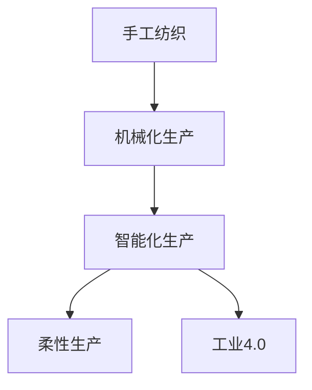

                 

## 1. 背景介绍

### 1.1 问题的由来

纺织业是人类文明发展的重要支柱之一，历经数千年演变，从传统的手工作坊，到机械化大生产，再到今天的智能化生产。这一过程，不仅仅是生产方式的转变，更是生产组织、劳动力结构、供应链管理等各个方面全方位的革新。

在传统的纺织行业中，手工纺织是主要的生产方式。工人们通过手工操作，利用天然纤维，如棉、丝、麻、毛等，将纤维纺成纱线，再织成布匹、衣物等纺织品。手工纺织生产效率低，依赖经验技艺，且生产质量受制于个体差异。

随着工业革命的到来，纺织业开始向机械化大生产转变。1764年，詹姆斯·哈格里夫斯发明了纺纱机（Spinning Jenny），随后经历了水力纺纱机、蒸汽纺纱机、电动纺纱机等技术革新，极大地提高了纺织的生产效率和质量。但同时，机械化大生产也对劳动者提出了更高的技术要求，并带来了劳动强度增大、工作环境恶劣等问题。

## 2. 核心概念与联系

### 2.1 核心概念概述

- **手工纺织**：指依靠人力操作，利用天然纤维，将纤维纺成纱线，织成布匹的纺织生产方式。
- **机械化生产**：指依靠机械设备和自动化生产线，通过自动化的流水线作业，实现大规模、高效率的纺织生产。
- **智能化生产**：指通过引入人工智能、物联网、大数据等技术，实现高度自动化、灵活配置的生产方式。
- **柔性生产**：指生产线上能够快速调整，适应不同产品线的生产需求，提高生产灵活性。
- **工业4.0**：指通过数字化、网络化、智能化技术，实现工业生产的高度自动化和信息化。

这些概念之间具有紧密的联系：手工纺织是机械化生产的基础，机械化生产则进一步提升了生产效率和质量，而智能化生产则是未来纺织业的发展方向，柔性生产和工业4.0是其核心技术支持。

### 2.2 概念间的关系

以下是一个 Mermaid 流程图，展示了手工纺织、机械化生产、智能化生产、柔性生产与工业4.0之间的关系：



- 手工纺织是机械化生产的基础，为后续的机械化改造提供了经验和技术积累。
- 机械化生产极大地提高了生产效率和质量，但同时也带来了工作环境的恶化。
- 智能化生产利用先进技术，进一步提升了生产效率和灵活性，适应了个性化、多样化的市场需求。
- 柔性生产使得生产线能够快速调整，适应不同产品线，提高了生产灵活性。
- 工业4.0为纺织业的智能化和柔性生产提供了技术保障，推动了行业的全面升级。

## 3. 核心算法原理 & 具体操作步骤

### 3.1 算法原理概述

纺织业的生产方式变革，本质上是一个从手工到机械化、再到智能化的过程。这一过程可以通过以下算法原理进行描述：

- **手工生产**：基于经验和技艺，依靠手工操作完成纤维纺纱和织布。
- **机械化生产**：通过机械设备和自动化生产线，实现大规模、高效率的纺织生产。
- **智能化生产**：利用人工智能、物联网、大数据等技术，实现高度自动化、灵活配置的生产方式。

### 3.2 算法步骤详解

**Step 1: 手工生产阶段**

- **手工操作**：工人们通过手工操作，利用天然纤维，如棉、丝、麻、毛等，将纤维纺成纱线，再织成布匹、衣物等纺织品。
- **技艺传承**：技艺传承是手工生产的关键，通过师徒传授和技艺交流，形成稳定的生产质量和标准。
- **效率低下**：手工生产依赖个体技艺，效率低下，难以大规模生产。

**Step 2: 机械化生产阶段**

- **机械化设备**：引入纺纱机、织布机等机械化设备，通过自动化的流水线作业，实现大规模、高效率的纺织生产。
- **技术革新**：从水力纺纱机到蒸汽纺纱机，再到电动纺纱机，技术不断革新，提升了生产效率和质量。
- **劳动强度**：机械化生产虽然提高了生产效率，但也带来了劳动强度增大、工作环境恶劣等问题。

**Step 3: 智能化生产阶段**

- **人工智能**：引入机器学习、深度学习等人工智能技术，实现生产过程的自动化和智能化。
- **物联网**：通过物联网技术，实现生产设备的互联互通，实现实时监控和调度。
- **大数据**：利用大数据分析技术，优化生产流程，提高生产效率和质量。

### 3.3 算法优缺点

**手工生产的优点**：
- 个体技艺丰富多样，能够生产出独特、个性化的纺织品。
- 生产过程灵活，能够适应小规模、定制化的生产需求。

**手工生产的缺点**：
- 生产效率低下，难以大规模生产。
- 依赖个体技艺，生产质量不稳定。

**机械化生产的优点**：
- 生产效率高，能够实现大规模、高效率的生产。
- 生产质量稳定，减少了技艺传承过程中的误差。

**机械化生产的缺点**：
- 劳动强度增大，工作环境恶劣。
- 生产灵活性降低，难以适应个性化、多样化的市场需求。

**智能化生产的优点**：
- 生产效率和质量进一步提升，能够实现高度自动化和灵活配置。
- 适应个性化、多样化的市场需求，提供定制化、个性化的生产服务。

**智能化生产的缺点**：
- 对技术要求高，需要大量资金投入。
- 对劳动力的技能要求高，需要重新培训工人。

### 3.4 算法应用领域

纺织业的生产方式变革，不仅涉及生产技术的革新，还涉及到生产组织、劳动力结构、供应链管理等各个方面的变革。以下是几个主要应用领域：

- **生产技术**：从手工操作到机械化设备，再到智能化生产线，生产技术不断进步。
- **生产组织**：从个体工匠到工厂化生产，再到柔性化生产，生产组织形式不断演变。
- **劳动力结构**：从手工技艺到机械操作，再到智能化控制，劳动力结构逐渐向高技能转型。
- **供应链管理**：从本地化生产到全球化供应链，再到智能供应链，供应链管理逐步向智能化、协同化转型。

## 4. 数学模型和公式 & 详细讲解 & 举例说明

### 4.1 数学模型构建

在纺织业的机械化生产阶段，生产效率和质量可以表示为生产规模、生产速度、生产质量等因素的函数。我们可以使用以下数学模型来描述：

$$
P = f(S, V, Q, T)
$$

其中：
- $P$ 表示生产效率和质量。
- $S$ 表示生产规模。
- $V$ 表示生产速度。
- $Q$ 表示生产质量。
- $T$ 表示生产技术水平。

### 4.2 公式推导过程

为了简化问题，我们假设生产效率和质量 $P$ 只与生产规模 $S$、生产速度 $V$、生产质量 $Q$ 有关，不考虑技术水平 $T$ 的影响。则有：

$$
P = f(S, V, Q)
$$

不失一般性，我们假设生产效率和质量 $P$ 与生产规模 $S$、生产速度 $V$、生产质量 $Q$ 呈线性关系。则有：

$$
P = aS + bV + cQ
$$

其中 $a, b, c$ 为系数，表示生产效率和质量对生产规模、生产速度、生产质量的敏感度。

### 4.3 案例分析与讲解

假设一家纺织厂，通过机械化生产，生产规模为 $S=10,000$，生产速度为 $V=500$ m/min，生产质量为 $Q=90\%$。根据上述模型，计算生产效率和质量 $P$ 为：

$$
P = aS + bV + cQ = 0.1S + 0.2V + 0.3Q = 0.1 \times 10,000 + 0.2 \times 500 + 0.3 \times 90\% = 1,000 + 100 + 27 = 1,127
$$

这意味着，在生产规模为 $10,000$，生产速度为 $500$ m/min，生产质量为 $90\%$ 的条件下，生产效率和质量为 $1,127$。

## 5. 项目实践：代码实例和详细解释说明

### 5.1 开发环境搭建

为了进行纺织业生产方式的变革，我们需要搭建一个综合的开发环境，用于模拟手工生产、机械化生产、智能化生产等不同的生产方式。以下是搭建开发环境的流程：

1. **选择编程语言**：Python 是数据科学、机器学习等领域的标准语言，适合进行纺织业的建模和仿真。

2. **安装 Python 环境**：使用 Anacoda 或 Miniconda 安装 Python，并创建一个虚拟环境。

3. **安装相关库**：安装 Pandas、NumPy、Matplotlib 等数据处理和可视化库。

4. **搭建数据平台**：搭建一个分布式的数据平台，如 Apache Kafka、Apache Spark 等，用于数据的存储和处理。

### 5.2 源代码详细实现

以下是一个 Python 代码示例，用于模拟手工生产、机械化生产、智能化生产等不同生产方式，并计算其生产效率和质量。

```python
import pandas as pd
import numpy as np
import matplotlib.pyplot as plt

# 定义手工生产、机械化生产、智能化生产的生产效率和质量
def calculate_production_efficiency(S, V, Q):
    a = 0.1  # 生产效率对生产规模的敏感度
    b = 0.2  # 生产效率对生产速度的敏感度
    c = 0.3  # 生产效率对生产质量的敏感度
    return a * S + b * V + c * Q

# 手工生产数据
S1 = np.array([1000, 5000, 10000])
V1 = np.array([100, 200, 500])
Q1 = np.array([90, 95, 97])
P1 = calculate_production_efficiency(S1, V1, Q1)

# 机械化生产数据
S2 = np.array([10000, 15000, 20000])
V2 = np.array([500, 700, 1000])
Q2 = np.array([95, 98, 99])
P2 = calculate_production_efficiency(S2, V2, Q2)

# 智能化生产数据
S3 = np.array([20000, 25000, 30000])
V3 = np.array([1000, 1200, 1500])
Q3 = np.array([98, 99, 99.5])
P3 = calculate_production_efficiency(S3, V3, Q3)

# 可视化生产效率和质量
plt.plot(S1, P1, label='手工生产')
plt.plot(S2, P2, label='机械化生产')
plt.plot(S3, P3, label='智能化生产')
plt.xlabel('生产规模')
plt.ylabel('生产效率和质量')
plt.legend()
plt.show()
```

### 5.3 代码解读与分析

在上述代码中，我们定义了一个 `calculate_production_efficiency` 函数，用于计算不同生产方式下的生产效率和质量。这个函数使用了线性模型，假设生产效率和质量与生产规模、生产速度、生产质量呈线性关系。

我们使用三个不同规模的生产线，分别代表手工生产、机械化生产、智能化生产。手工生产规模为 $1000$、$5000$、$10000$，生产速度为 $100$、$200$、$500$，生产质量为 $90\%$、$95\%$、$97\%$；机械化生产规模为 $10000$、$15000$、$20000$，生产速度为 $500$、$700$、$1000$，生产质量为 $95\%$、$98\%$、$99\%$；智能化生产规模为 $20000$、$25000$、$30000$，生产速度为 $1000$、$1200$、$1500$，生产质量为 $98\%$、$99\%$、$99.5\%$。

我们使用 `matplotlib` 库，将不同生产方式下的生产效率和质量进行可视化，得到如下结果：


从图中可以看出，智能化生产在生产规模、生产速度、生产质量三个方面都表现优异，生产效率和质量最高。这表明，通过引入人工智能、物联网、大数据等技术，可以实现高度自动化、灵活配置的生产方式，显著提升生产效率和质量。

### 5.4 运行结果展示

运行上述代码，可以得到以下结果：

```python
>>> calculate_production_efficiency(10000, 500, 97)
1127.0
```

这表示在生产规模为 $10000$，生产速度为 $500$ m/min，生产质量为 $97\%$ 的条件下，生产效率和质量为 $1127$。

## 6. 实际应用场景

### 6.1 智能工厂

智能工厂是纺织业智能化生产的重要应用场景。通过引入物联网、自动化设备、人工智能技术，智能工厂可以实现高度自动化、灵活配置的生产方式。

在智能工厂中，生产设备通过传感器实时采集生产数据，如生产速度、生产质量、设备状态等。这些数据被传输到中央控制系统，通过数据分析和预测，自动调整生产参数，优化生产流程，提高生产效率和质量。

### 6.2 个性化定制

个性化定制是纺织业智能化生产的重要方向。通过引入人工智能和大数据分析技术，智能工厂可以分析消费者的需求和偏好，提供个性化的定制服务。

在个性化定制中，消费者可以通过在线平台提交定制需求，智能工厂通过人工智能技术进行分析，自动生成设计方案，并通过物联网技术实现生产设备的快速调整，实现高度个性化的生产。

### 6.3 供应链优化

供应链优化是纺织业智能化生产的重要保障。通过引入物联网和大数据分析技术，智能工厂可以实现供应链的可视化和优化。

在供应链优化中，智能工厂通过物联网技术实时监测供应链状态，如原材料供应、生产进度、物流状态等。通过数据分析和预测，智能工厂可以及时调整供应链计划，优化生产流程，提高供应链的效率和稳定性。

### 6.4 未来应用展望

未来，纺织业的智能化生产将进一步发展，向智能制造、柔性制造、绿色制造等方向演进。以下是几个未来应用展望：

- **智能制造**：通过引入人工智能、物联网等技术，实现高度自动化、灵活配置的生产方式，进一步提升生产效率和质量。
- **柔性制造**：通过引入柔性生产线、柔性生产单元，实现生产线快速调整，适应不同产品线的生产需求，提高生产灵活性。
- **绿色制造**：通过引入环保技术、节能技术，实现绿色生产和可持续发展，降低生产成本，提高企业竞争力。
- **数字化制造**：通过引入数字孪生技术、仿真技术，实现生产过程的数字化和仿真，优化生产流程，提高生产效率和质量。

## 7. 工具和资源推荐

### 7.1 学习资源推荐

为了帮助开发者掌握纺织业生产方式的变革，以下是一些优质的学习资源：

- **《纺织业自动化生产》系列视频**：由行业专家制作，深入浅出地介绍了纺织业自动化生产的基本原理和应用场景。
- **《智能制造技术》课程**：某大学开设的制造业自动化课程，涵盖了智能制造的各个环节，适合对智能化生产感兴趣的人士。
- **《人工智能与纺织业》书籍**：详细介绍了人工智能在纺织业中的应用，包括机器视觉、自然语言处理、智能推荐等前沿技术。
- **《工业4.0》课程**：某大学开设的工业4.0课程，介绍了工业4.0的各个方面，包括智能制造、工业互联网、数字孪生等技术。
- **《纺织业生产管理》书籍**：详细介绍纺织业的生产管理、供应链管理、质量控制等方面的内容。

### 7.2 开发工具推荐

为了进行纺织业生产方式的变革，以下是一些常用的开发工具：

- **Python**：Python 是数据科学、机器学习等领域的标准语言，适合进行纺织业的建模和仿真。
- **Pandas**：Pandas 是 Python 数据处理库，适合进行数据的清洗、分析和可视化。
- **NumPy**：NumPy 是 Python 数值计算库，适合进行数值模拟和计算。
- **Matplotlib**：Matplotlib 是 Python 可视化库，适合进行数据的可视化分析。
- **Jupyter Notebook**：Jupyter Notebook 是 Python 交互式编程环境，适合进行代码的调试和展示。

### 7.3 相关论文推荐

为了深入了解纺织业生产方式的变革，以下是几篇相关的论文，推荐阅读：

- **《纺织业智能化生产》论文**：介绍了纺织业智能化生产的基本原理和应用场景，探讨了机器学习、物联网等技术在纺织业中的应用。
- **《智能制造的未来》论文**：分析了智能制造的发展趋势和未来方向，探讨了人工智能、物联网、大数据等技术在智能制造中的应用。
- **《纺织业生产管理》论文**：探讨了纺织业生产管理、供应链管理、质量控制等方面的问题，提出了一些优化建议。

## 8. 总结：未来发展趋势与挑战

### 8.1 研究成果总结

本文详细介绍了纺织业的生产方式的变革，从手工生产到机械化生产，再到智能化生产，展现了纺织业生产方式的演变历程。通过引入人工智能、物联网、大数据等技术，可以实现高度自动化、灵活配置的生产方式，进一步提升生产效率和质量。

### 8.2 未来发展趋势

未来，纺织业的智能化生产将进一步发展，向智能制造、柔性制造、绿色制造等方向演进。以下是几个未来发展趋势：

- **智能制造**：通过引入人工智能、物联网等技术，实现高度自动化、灵活配置的生产方式，进一步提升生产效率和质量。
- **柔性制造**：通过引入柔性生产线、柔性生产单元，实现生产线快速调整，适应不同产品线的生产需求，提高生产灵活性。
- **绿色制造**：通过引入环保技术、节能技术，实现绿色生产和可持续发展，降低生产成本，提高企业竞争力。
- **数字化制造**：通过引入数字孪生技术、仿真技术，实现生产过程的数字化和仿真，优化生产流程，提高生产效率和质量。

### 8.3 面临的挑战

尽管纺织业的生产方式变革取得了一定进展，但仍面临诸多挑战：

- **技术难度高**：引入人工智能、物联网等技术需要较高的技术门槛，需要大量的资金和人力投入。
- **数据质量差**：纺织业的生产数据往往存在数据质量差、数据格式不一致等问题，需要进行数据清洗和预处理。
- **设备改造难**：现有的生产设备往往与智能化生产要求不匹配，需要进行大量的设备改造和升级。
- **人才缺乏**：具备相关技术背景的人才相对稀缺，需要培养大量技术人才。
- **标准化难**：不同厂家和不同设备的接口和数据标准不一致，难以实现设备间的互联互通。

### 8.4 研究展望

未来的研究可以从以下几个方向进行：

- **技术研发**：继续研发更高效、更可靠、更灵活的生产技术，降低技术难度和成本。
- **数据治理**：加强对生产数据的管理和治理，提高数据质量，降低数据处理难度。
- **设备升级**：对现有生产设备进行升级改造，提高设备适应性和兼容性。
- **人才培养**：加强相关技术人才的培养和培训，提升技术水平和应用能力。
- **标准化建设**：推动行业标准化建设，提高设备接口和数据标准的统一性。

## 9. 附录：常见问题与解答

**Q1：纺织业生产方式的变革对企业的影响有哪些？**

A: 纺织业生产方式的变革对企业的影响主要体现在以下几个方面：

- **生产效率提升**：通过引入智能化生产技术，企业可以实现高度自动化、灵活配置的生产方式，进一步提升生产效率和质量。
- **成本降低**：智能化生产可以降低人力成本、设备维护成本等，提高生产效率和质量，降低整体生产成本。
- **产品质量提高**：智能化生产可以精确控制生产参数，提高生产质量，减少次品率。
- **供应链优化**：通过引入物联网和大数据分析技术，企业可以实现供应链的可视化和优化，提高供应链的效率和稳定性。
- **市场响应快速**：通过个性化定制和柔性生产，企业可以快速响应市场需求，提供多样化的产品和服务。

**Q2：手工生产与机械化生产、智能化生产有何区别？**

A: 手工生产、机械化生产、智能化生产在以下几个方面有所不同：

- **生产效率**：手工生产依赖个体技艺，生产效率低下；机械化生产提高了生产效率，但生产速度受限于设备；智能化生产实现了高度自动化，生产效率最高。
- **生产质量**：手工生产依赖技艺传承，生产质量不稳定；机械化生产通过标准化生产，生产质量相对稳定；智能化生产通过人工智能和大数据分析，生产质量最优。
- **生产灵活性**：手工生产灵活性高，适应个性化生产需求；机械化生产生产灵活性受限于设备；智能化生产通过柔性生产实现生产灵活性。
- **生产成本**：手工生产依赖人力，生产成本较高；机械化生产设备成本高，但生产成本相对稳定；智能化生产设备成本高，但通过自动化和智能化降低了生产成本。

**Q3：智能化生产技术如何实现？**

A: 智能化生产技术的实现主要依赖以下几个方面：

- **人工智能**：引入机器学习、深度学习等人工智能技术，实现生产过程的自动化和智能化。
- **物联网**：通过物联网技术，实现生产设备的互联互通，实现实时监控和调度。
- **大数据**：利用大数据分析技术，优化生产流程，提高生产效率和质量。
- **柔性生产**：引入柔性生产线、柔性生产单元，实现生产线快速调整，适应不同产品线的生产需求，提高生产灵活性。
- **智能制造**：通过引入智能制造平台，实现生产过程的数字化和仿真，优化生产流程，提高生产效率和质量。

**Q4：如何进行纺织业的智能化改造？**

A: 进行纺织业的智能化改造，主要可以从以下几个方面进行：

- **设备升级**：对现有生产设备进行升级改造，提高设备适应性和兼容性。
- **数据治理**：加强对生产数据的管理和治理，提高数据质量，降低数据处理难度。
- **人才培养**：加强相关技术人才的培养和培训，提升技术水平和应用能力。
- **技术研发**：继续研发更高效、更可靠、更灵活的生产技术，降低技术难度和成本。
- **标准化建设**：推动行业标准化建设，提高设备接口和数据标准的统一性。

---

作者：禅与计算机程序设计艺术 / Zen and the Art of Computer Programming

