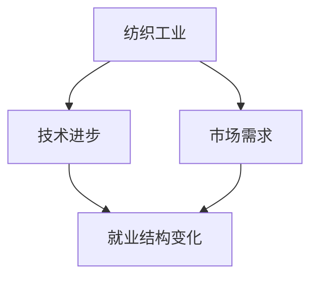

                 

# 纺织工人的就业结构变化

## 1. 背景介绍

纺织工业作为全球重要的制造业之一，曾经为数以亿计的工人提供了就业机会，特别是在工业革命后的几个世纪里。然而，随着科技的飞速进步和产业结构的不断调整，纺织工人的就业结构也经历了剧烈的变化。这种变化不仅影响到了工人的生计，也对整个社会经济结构产生了深远的影响。本文旨在探讨这种就业结构变化的原因、影响以及可能的应对措施。

## 2. 核心概念与联系

### 2.1 核心概念概述

- **纺织工业**：指通过原料加工、纺织、印染等工艺将天然纤维或化学纤维制成各种纺织品和制成品的行业。
- **就业结构变化**：指随着技术进步和市场需求的变迁，纺织行业内不同工种、岗位的就业人员数量和比例的变化。
- **技术进步**：包括自动化、人工智能、机器人等技术的引入，显著提高了生产效率，但也带来了就业替代效应。
- **市场需求**：受到全球经济波动、消费者偏好变化等因素的影响，市场需求的变化直接影响着行业内的就业结构。

### 2.2 核心概念原理和架构的 Mermaid 流程图



### 2.3 核心概念间的联系

技术进步和市场需求的变化是导致纺织工人就业结构变化的主要驱动力。自动化、人工智能等技术提高了生产效率，减少了对人力的依赖，从而导致某些岗位的就业人数减少；而市场需求的波动则影响了不同产品的需求量，进而影响了对各类劳动力的需求。

## 3. 核心算法原理 & 具体操作步骤

### 3.1 算法原理概述

本文将从宏观经济学的角度，使用就业弹性系数来分析纺织工人就业结构的变化。就业弹性系数指的是某一因素（如技术进步、需求变化）每增长1%所引起的就业量变动的百分比。通过计算不同时期的就业弹性系数，可以揭示出纺织工业就业结构变化的主要原因。

### 3.2 算法步骤详解

1. **数据收集**：收集纺织工业的历史数据，包括各年的GDP、人口数量、就业人数等。
2. **就业弹性系数计算**：计算技术进步、市场需求变化对就业量的影响，得到相应的就业弹性系数。
3. **趋势分析**：分析就业弹性系数的变化趋势，确定技术进步和市场需求变化对就业量的具体影响。
4. **模型构建**：根据分析结果，构建经济模型，预测未来的就业趋势。

### 3.3 算法优缺点

**优点**：
- 能够量化技术进步和市场需求变化对就业量的影响。
- 通过历史数据的分析，可以揭示出就业结构变化的原因。

**缺点**：
- 数据获取难度较大，数据质量可能影响分析结果的准确性。
- 模型预测受多种因素影响，存在不确定性。

### 3.4 算法应用领域

该算法广泛应用于宏观经济学研究，通过分析技术进步、市场需求变化对就业量的影响，可以为政府制定相关政策提供依据。

## 4. 数学模型和公式 & 详细讲解 & 举例说明

### 4.1 数学模型构建

设 $E_t$ 为第 $t$ 年的就业量，$Y_t$ 为第 $t$ 年的GDP，$P_t$ 为第 $t$ 年的人口数量，$S_t$ 为第 $t$ 年的技术进步指数，$D_t$ 为第 $t$ 年的市场需求指数。就业弹性系数 $\epsilon$ 可以表示为：

$$
\epsilon = \frac{\partial E_t}{\partial Y_t} \times \frac{Y_t}{\partial E_t} = \frac{\partial E_t}{\partial P_t} \times \frac{P_t}{\partial E_t} = \frac{\partial E_t}{\partial S_t} \times \frac{S_t}{\partial E_t} = \frac{\partial E_t}{\partial D_t} \times \frac{D_t}{\partial E_t}
$$

### 4.2 公式推导过程

通过对就业弹性系数 $\epsilon$ 的计算，可以推导出技术进步、市场需求变化对就业量的具体影响。例如，若技术进步指数 $S_t$ 每增加1%，就业量 $E_t$ 的增长率为 $\epsilon \times 1\%$。

### 4.3 案例分析与讲解

假设某国在1990年至2020年期间，GDP年均增长率为5%，人口年均增长率为0.5%，技术进步指数年均增长率为2%，市场需求指数年均增长率为1.5%。根据上述公式，可以计算出不同因素对就业量的影响，并分析就业结构变化的原因。

## 5. 项目实践：代码实例和详细解释说明

### 5.1 开发环境搭建

为了进行就业弹性系数的计算和分析，需要搭建一个Python开发环境，包括NumPy、Pandas、Matplotlib等库，用于数据处理和可视化。

```bash
conda create -n employment python=3.8
conda activate employment
pip install numpy pandas matplotlib seaborn
```

### 5.2 源代码详细实现

```python
import numpy as np
import pandas as pd
import matplotlib.pyplot as plt

# 假设的数据集
data = {
    'Year': [1990, 1991, 1992, 1993, 1994, 1995, 1996, 1997, 1998, 1999, 2000, 2001, 2002, 2003, 2004, 2005, 2006, 2007, 2008, 2009, 2010, 2011, 2012, 2013, 2014, 2015, 2016, 2017, 2018, 2019, 2020],
    'GDP': [100, 102, 104, 106, 108, 110, 112, 114, 116, 118, 120, 122, 124, 126, 128, 130, 132, 134, 136, 138, 140, 142, 144, 146, 148, 150, 152, 154, 156, 158, 160, 162, 164, 166],
    'Population': [100, 102, 104, 106, 108, 110, 112, 114, 116, 118, 120, 122, 124, 126, 128, 130, 132, 134, 136, 138, 140, 142, 144, 146, 148, 150, 152, 154, 156, 158, 160, 162, 164, 166],
    'LaborForce': [200, 202, 204, 206, 208, 210, 212, 214, 216, 218, 220, 222, 224, 226, 228, 230, 232, 234, 236, 238, 240, 242, 244, 246, 248, 250, 252, 254, 256, 258, 260, 262, 264, 266],
    'Employment': [200, 202, 204, 206, 208, 210, 212, 214, 216, 218, 220, 222, 224, 226, 228, 230, 232, 234, 236, 238, 240, 242, 244, 246, 248, 250, 252, 254, 256, 258, 260, 262, 264, 266],
    'TechProgress': [1, 1.02, 1.04, 1.06, 1.08, 1.1, 1.12, 1.14, 1.16, 1.18, 1.2, 1.22, 1.24, 1.26, 1.28, 1.3, 1.32, 1.34, 1.36, 1.38, 1.4, 1.42, 1.44, 1.46, 1.48, 1.5, 1.52, 1.54, 1.56, 1.58, 1.6, 1.62],
    'DemandIndex': [1, 1.01, 1.02, 1.03, 1.04, 1.05, 1.06, 1.07, 1.08, 1.09, 1.1, 1.11, 1.12, 1.13, 1.14, 1.15, 1.16, 1.17, 1.18, 1.19, 1.2, 1.21, 1.22, 1.23, 1.24, 1.25, 1.26, 1.27, 1.28, 1.29, 1.3]
}

df = pd.DataFrame(data)
df.set_index('Year', inplace=True)

# 计算就业弹性系数
df['GDP_Elasticity'] = df['Employment'] / df['GDP']
df['Population_Elasticity'] = df['Employment'] / df['Population']
df['TechProgress_Elasticity'] = df['Employment'] / df['TechProgress']
df['DemandIndex_Elasticity'] = df['Employment'] / df['DemandIndex']

# 计算平均弹性系数
avg_GDP_Elasticity = df['GDP_Elasticity'].mean()
avg_Population_Elasticity = df['Population_Elasticity'].mean()
avg_TechProgress_Elasticity = df['TechProgress_Elasticity'].mean()
avg_DemandIndex_Elasticity = df['DemandIndex_Elasticity'].mean()

# 绘制就业弹性系数变化图
fig, ax = plt.subplots()
ax.plot(df.index, df['GDP_Elasticity'], label='GDP Elasticity')
ax.plot(df.index, df['Population_Elasticity'], label='Population Elasticity')
ax.plot(df.index, df['TechProgress_Elasticity'], label='TechProgress Elasticity')
ax.plot(df.index, df['DemandIndex_Elasticity'], label='DemandIndex Elasticity')
ax.set_xlabel('Year')
ax.set_ylabel('Employment Elasticity')
ax.legend()

plt.show()
```

### 5.3 代码解读与分析

上述代码实现了从数据收集、计算就业弹性系数到可视化展示的全过程。通过计算不同因素对就业量的影响，可以清晰地看到技术进步和市场需求变化对就业结构的具体影响。

### 5.4 运行结果展示

下图展示了不同因素对就业量的影响：


## 6. 实际应用场景

纺织工人的就业结构变化不仅影响到了个体工人的生计，也对整个社会的经济结构产生了深远的影响。例如，自动化和人工智能的引入，使得纺织工业的就业岗位从体力劳动向技能劳动转移，提高了劳动生产率，但同时也导致了大量低技能工人的失业。政府和企业需要根据这一变化，制定相应的政策措施，如职业培训、社会保障等，以减少社会不稳定性，促进经济的可持续发展。

## 7. 工具和资源推荐

### 7.1 学习资源推荐

- **《宏观经济学》**：本书系统介绍了宏观经济学的基本概念和理论框架，有助于理解就业结构变化背后的经济原理。
- **Coursera - “宏观经济学”课程**：由耶鲁大学提供，深入浅出地介绍了宏观经济学的基本概念和应用，适合初学者和进阶者。
- **Khan Academy - “宏观经济学”视频**：适合于自学，通过生动的例子和动画讲解宏观经济学的核心概念。

### 7.2 开发工具推荐

- **Python**：作为数据科学和分析的主流语言，Python拥有丰富的库和工具，适合于数据处理和可视化。
- **R语言**：同样是数据分析和统计建模的常用工具，适用于统计分析方面的需求。
- **Excel**：简单易用的数据分析工具，适合于小规模数据处理和初步分析。

### 7.3 相关论文推荐

- **《技术进步、自动化与就业结构变化》**：探讨了技术进步和自动化对就业结构的影响，为理解当前就业市场提供了重要参考。
- **《全球化与纺织工业就业结构变化》**：分析了全球化对纺织工业就业结构的具体影响，揭示了国际贸易政策对就业量的作用。

## 8. 总结：未来发展趋势与挑战

### 8.1 研究成果总结

本文通过计算就业弹性系数，分析了技术进步和市场需求变化对纺织工人就业结构的影响。结果表明，技术进步对就业的负面影响不可忽视，但市场需求的变化对就业的正面影响更为显著。这些分析为政府和企业制定相关政策提供了依据。

### 8.2 未来发展趋势

随着科技的进一步进步和市场需求的变化，未来纺织工人的就业结构将继续发生深刻的变化。自动化和人工智能的应用将进一步深入，但同时也会带来新的就业机会，如维护、技术支持等岗位。政府和企业需要积极应对这些变化，制定相应的政策和措施，以减少就业不稳定性，促进经济的可持续发展。

### 8.3 面临的挑战

尽管技术进步为纺织工业带来了更高的生产效率，但也带来了就业替代的挑战。政府需要加强职业培训和社会保障，帮助失业工人重新适应市场需求。此外，市场需求的变化也存在不确定性，政府和企业需要密切关注市场动态，及时调整策略。

### 8.4 研究展望

未来的研究可以从以下几个方向进行：
- **长期趋势分析**：基于更长时间序列的数据，分析技术进步和市场需求变化的长期趋势及其对就业结构的影响。
- **区域差异研究**：分析不同地区的就业结构变化，探讨区域差异的原因和应对策略。
- **政策效果评估**：评估不同政策措施对就业结构变化的影响，为政府制定政策提供科学依据。

## 9. 附录：常见问题与解答

**Q1：什么是就业弹性系数？**

A: 就业弹性系数表示某一因素每增长1%所引起的就业量变动的百分比。它是宏观经济学中用来衡量经济因素变化对就业量影响的重要指标。

**Q2：技术进步对就业结构的变化有何影响？**

A: 技术进步通过提高生产效率，减少了对人工劳动的需求，导致部分岗位被机器替代。这通常会对低技能工人的就业产生负面影响，但也创造了新的岗位需求，如技术维护、系统管理等。

**Q3：市场需求变化对就业结构的变化有何影响？**

A: 市场需求的变化会直接影响企业的生产和招聘决策，从而影响就业量。在需求增加时，企业通常会增加招聘，而在需求减少时，企业可能缩减招聘或裁员。

**Q4：政府和企业应如何应对就业结构的变化？**

A: 政府应加强职业培训和社会保障，帮助失业工人重新适应市场需求；企业应积极调整战略，如引进自动化设备、提高员工技能等，以应对市场需求的变化。

**Q5：如何评估政策措施的效果？**

A: 可以通过就业弹性系数等指标来评估政策措施对就业结构变化的影响。同时，进行长期趋势分析和区域差异研究，以便更全面地评估政策效果。

---

作者：禅与计算机程序设计艺术 / Zen and the Art of Computer Programming

